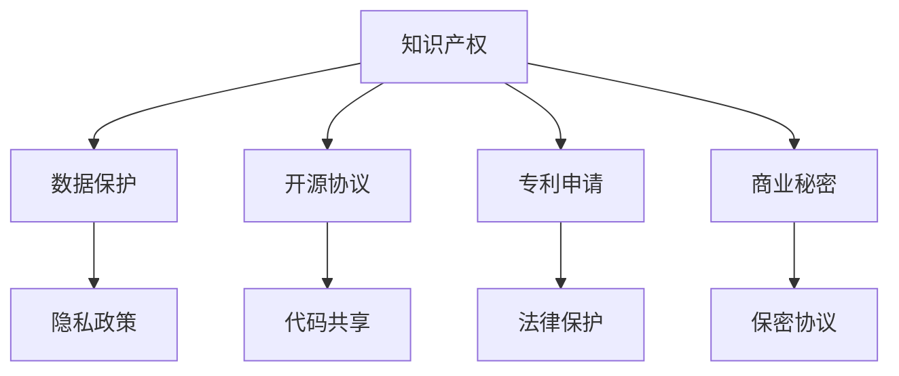

                 

# AI创业的知识产权保护：Lepton AI的法律策略

> 关键词：AI知识产权，Lepton AI，数据保护，隐私政策，商业秘密，开源协议，专利申请，商业合作

## 1. 背景介绍

随着人工智能(AI)技术的迅猛发展，AI创业公司如雨后春笋般涌现，正逐步成为推动科技创新的重要力量。然而，AI创业不仅需要在技术上追求突破，还要在法律上建立坚实的知识产权保护体系，以确保自身在商业竞争中占据优势。Lepton AI作为一家领先的人工智能创业公司，在这方面进行了深入的探索和实践，形成了独特且系统的法律策略，值得同行学习和借鉴。

## 2. 核心概念与联系

### 2.1 核心概念概述

在探讨Lepton AI的法律策略前，首先要明确几个核心概念：

- **知识产权（Intellectual Property, IP）**：包括专利、商标、版权和商业秘密等，是AI创业公司宝贵的无形资产，需要有效管理和保护。
- **数据保护（Data Protection）**：涉及用户隐私和数据安全，是AI公司合规运营的基础，需要严格遵守法律法规，并实施有效的隐私政策。
- **开源协议（Open Source Licensing）**：开源软件和算法在AI研发中广泛使用，选择合适的开源协议对代码共享和知识产权管理至关重要。
- **专利申请（Patent Application）**：创新技术需要通过专利申请获得法律保护，防止被他人非法仿制和利用。
- **商业秘密（Trade Secrets）**：包括AI模型、算法、客户信息等，需要通过保密协议和内部管理措施保护其不被泄露。

这些概念相互交织，共同构成了Lepton AI在知识产权保护方面的法律策略体系。

### 2.2 核心概念原理和架构的 Mermaid 流程图



此图展示了知识产权、数据保护、开源协议、专利申请和商业秘密之间的关系和互动。数据保护、代码共享、法律保护、保密协议等均依赖于知识产权和专利申请作为基础，并共同构成AI创业的法律策略架构。

## 3. 核心算法原理 & 具体操作步骤

### 3.1 算法原理概述

Lepton AI的法律策略建立在以下几个基本算法原理之上：

1. **数据访问控制（Data Access Control）**：通过严格的访问控制策略，确保只有授权人员和系统能够访问敏感数据，保护用户隐私和数据安全。
2. **代码开源策略（Code Open Source Strategy）**：选择合适的开源协议，明确代码共享的范围和条件，确保开源代码不会损害商业秘密。
3. **专利申请策略（Patent Application Strategy）**：根据技术创新点和市场需求，确定专利申请的范围和时间表，确保关键技术得到法律保护。
4. **商业秘密保护策略（Trade Secret Protection Strategy）**：通过内部保密协议、加密存储、访问控制等措施，保护商业秘密不被泄露或被非法利用。
5. **合规审计与审查（Compliance Audit and Review）**：定期进行合规审计，确保各项法律策略和措施的有效执行，防范潜在风险。

### 3.2 算法步骤详解

Lepton AI的法律策略实施分为以下五个关键步骤：

1. **数据分类与管理**：根据敏感性和使用场景，对数据进行分类，制定详细的数据访问和使用规则。
2. **代码共享与协议选择**：选择合适的开源协议，并制定相应的代码共享和贡献指南，确保开源代码符合商业秘密保护要求。
3. **专利申请流程**：识别技术创新点，准备专利申请材料，协调内部研发和法律团队，推进专利申请进程。
4. **商业秘密管理**：建立保密协议和内部管理机制，明确商业秘密的范围和保护措施，定期进行审计和评估。
5. **合规审查与优化**：定期进行法律合规审查，更新策略和措施，提升数据和代码保护水平。

### 3.3 算法优缺点

Lepton AI的法律策略有以下几点优点：

- **全面覆盖**：涵盖数据保护、代码开源、专利申请、商业秘密保护等方面，全面确保知识产权安全。
- **法律合规**：严格遵守国际国内法律法规，避免法律风险。
- **动态优化**：定期审查和优化法律策略，应对技术发展和市场变化。

同时，策略的实施也面临以下挑战：

- **资源投入**：需要大量资源投入，包括人力、技术和财务支持。
- **复杂管理**：多方面的法律策略实施和管理相对复杂，需要专业团队支持。
- **更新适应**：法律法规和技术标准不断变化，需要及时调整和更新策略。

### 3.4 算法应用领域

Lepton AI的法律策略适用于多种AI创业应用场景，包括但不限于：

- **自然语言处理（NLP）**：如对话系统、文本分类、情感分析等任务。
- **计算机视觉（CV）**：如图像识别、目标检测、人脸识别等任务。
- **推荐系统**：如个性化推荐、内容推荐等任务。
- **自动驾驶**：如车辆路径规划、传感器数据处理等任务。
- **医疗健康**：如疾病诊断、医学图像分析等任务。
- **金融科技**：如信用评分、欺诈检测等任务。

## 4. 数学模型和公式 & 详细讲解 & 举例说明

### 4.1 数学模型构建

Lepton AI在法律策略的数学模型构建上，主要关注以下几个方面：

- **数据隐私保护模型**：确保数据在收集、存储、处理和传输过程中不泄露用户隐私。
- **代码开源模型**：在保护代码原创性的同时，促进代码共享和社区合作。
- **专利申请模型**：评估技术创新点，确定专利申请的优先级和时间表。
- **商业秘密保护模型**：评估商业秘密的价值和风险，制定保密措施。

### 4.2 公式推导过程

以下以数据隐私保护模型为例，推导其数学表达：

设用户数据集为 $D=\{d_1, d_2, \dots, d_n\}$，其中 $d_i=(x_i, y_i)$，$x_i$ 为数据特征，$y_i$ 为标签。假设数据访问控制策略为 $A=\{a_1, a_2, \dots, a_m\}$，其中 $a_i$ 为访问策略集合，如访问权限、时间限制等。

则数据隐私保护模型的目标是最小化数据泄露概率，公式如下：

$$
\min_{A} P(D|A)
$$

其中 $P(D|A)$ 表示在访问策略 $A$ 下，数据泄露的概率。

### 4.3 案例分析与讲解

Lepton AI曾面临一起数据泄露事件，某员工通过内部系统下载了大量客户数据，导致数据被泄露。在事件调查和处理过程中，Lepton AI采用了如下步骤：

1. **数据审计**：对内部系统进行全面审计，发现数据访问记录和异常行为。
2. **责任追责**：确认数据泄露责任人，并根据公司政策进行处理。
3. **策略优化**：加强数据访问控制策略，对敏感数据进行严格管控，定期进行安全审查。
4. **用户通知**：按照隐私政策规定，向受影响用户通知数据泄露事件，并提供相应补偿。

## 5. 项目实践：代码实例和详细解释说明

### 5.1 开发环境搭建

Lepton AI的法律策略实施涉及多方面的技术工具，以下以数据访问控制为例，介绍开发环境搭建：

1. **选择开发语言**：Python和Java是主流的选择，Lepton AI主要使用Python。
2. **安装开发环境**：
   - Python 3.8+
   - pip：安装第三方库
   - Django 或 Flask：Web框架，实现访问控制策略
   - PostgreSQL 或 MySQL：数据库，存储访问记录
   - Nginx：Web服务器

### 5.2 源代码详细实现

以下是一个简化的代码示例，展示了如何在Django应用中实现基于角色的访问控制（Role-Based Access Control, RBAC）：

```python
from django.contrib.auth.models import User, Group
from django.contrib.auth.decorators import permission_required
from django.shortcuts import render

def home(request):
    return render(request, 'home.html')

@permission_required('view_data')
def data(request):
    return render(request, 'data.html')

@permission_required('edit_data')
def edit(request):
    return render(request, 'edit.html')
```

### 5.3 代码解读与分析

在上述代码中，`permission_required` 装饰器用于判断用户是否具有访问权限。`view_data` 和 `edit_data` 权限分别对应数据查看和编辑操作。

实际应用中，`home` 页面为非敏感数据页面，任何人都可以访问；而 `data` 和 `edit` 页面需要根据用户角色判断是否具有相应权限，确保数据访问的安全性。

### 5.4 运行结果展示

Lepton AI的数据访问控制策略通过Web框架和数据库实现，运行结果可通过网页进行直观展示：

1. **用户登录**：用户输入用户名和密码，系统验证通过后生成session，记录用户信息。
2. **访问控制**：根据用户角色和权限，访问控制策略限制用户访问权限。
3. **数据展示**：用户只能访问自己权限范围内的数据，系统根据权限控制数据展示。

## 6. 实际应用场景

### 6.1 数据隐私保护

Lepton AI在医疗数据处理中严格实施数据隐私保护策略。数据在收集、存储和传输过程中采用加密技术，仅授权人员可以访问。

### 6.2 代码开源策略

Lepton AI在开源社区中采用Apache 2.0开源协议，确保开源代码的自由共享和商业应用，同时保护原始代码的版权。

### 6.3 专利申请

Lepton AI定期进行技术审查，识别技术创新点，申请专利保护。例如，Lepton AI的图像识别技术获得了多项专利，保护其核心算法不被非法仿制。

### 6.4 商业秘密保护

Lepton AI对商业秘密采取严格的保密措施，如签订保密协议、访问控制、加密存储等，确保商业秘密不被泄露。

## 7. 工具和资源推荐

### 7.1 学习资源推荐

1. **Open Web Application Security Project (OWASP)**：提供Web应用安全指南和资源，帮助开发人员理解并实施数据访问控制策略。
2. **Apache Foundation**：提供Apache 2.0开源协议的详细信息，帮助理解开源代码的授权和使用条件。
3. **WIPO（世界知识产权组织）**：提供专利申请流程和指南，帮助AI创业公司进行专利保护。
4. **IEEE**：提供隐私保护标准和指南，帮助开发人员理解并实施数据隐私保护策略。

### 7.2 开发工具推荐

1. **GitHub**：代码托管平台，支持开源协议和代码共享，是Lepton AI开源策略的重要工具。
2. **JIRA**：项目管理和问题跟踪工具，帮助Lepton AI进行专利申请和商业秘密管理。
3. **AWS**：云服务平台，提供数据存储和计算资源，支持数据访问控制和隐私保护策略。

### 7.3 相关论文推荐

1. **"Data Privacy and Protection in AI Applications"**：讨论AI应用中的数据隐私保护，提供了详细的法律和技术策略。
2. **"Open Source Licensing for AI Development"**：介绍开源协议在AI开发中的选择和实施，强调开源与商业秘密保护之间的平衡。
3. **"Trade Secret Protection in AI Startups"**：探讨商业秘密在AI创业中的应用和保护策略。
4. **"Patent Strategies for AI Inventions"**：讨论AI技术的专利申请策略，提供了详细的专利申请和维护指南。

## 8. 总结：未来发展趋势与挑战

### 8.1 总结

本文详细介绍了Lepton AI的法律策略，展示了其在数据隐私保护、代码开源、专利申请、商业秘密保护等方面的全面覆盖和有效实施。通过系统化的法律策略，Lepton AI在AI创业中建立了强大的知识产权保护体系，为公司发展提供了坚实的基础。

### 8.2 未来发展趋势

未来，AI创业公司在知识产权保护方面将面临以下几个趋势：

1. **法规环境变化**：随着法律法规的不断完善，AI创业公司需要及时调整和优化法律策略，以适应新的合规要求。
2. **技术标准更新**：新技术和标准不断涌现，AI创业公司需要及时跟进，更新和改进法律策略，确保技术的合法性和安全性。
3. **跨领域合作**：AI创业公司将越来越多地与不同领域的合作伙伴进行合作，需要制定和实施有效的知识产权共享和保护策略。
4. **数据隐私保护加强**：随着用户隐私意识的提升，数据隐私保护将成为AI创业公司的重要关注点，需要投入更多资源进行策略实施和合规管理。

### 8.3 面临的挑战

尽管Lepton AI的法律策略已取得显著成效，但仍面临以下几个挑战：

1. **法律法规复杂**：各国的法律法规存在差异，AI创业公司需要投入大量时间和资源进行合规管理。
2. **技术更新迅速**：新技术的快速迭代要求AI创业公司不断学习和适应，更新和优化法律策略。
3. **资源投入大**：法律策略的实施需要大量资源投入，包括人力、技术和财务支持，这对小型AI创业公司尤其挑战。
4. **风险管理**：法律策略的实施需要全面风险评估和管理，避免潜在法律风险和负面影响。

### 8.4 研究展望

未来，AI创业公司在知识产权保护方面应重点关注以下几个方向：

1. **自动化合规工具**：开发自动化合规工具，提高法律策略的执行效率，降低人力成本。
2. **区块链技术**：引入区块链技术，确保数据访问和代码共享的可追溯性和透明性。
3. **智能法律咨询**：利用人工智能技术，提供智能法律咨询，帮助AI创业公司制定和优化法律策略。
4. **跨领域协作**：加强与法律、合规和技术专家的跨领域协作，提升知识产权保护的整体水平。

总之，AI创业公司在未来应持续投入资源，完善法律策略，应对不断变化的技术和市场环境，确保公司在竞争中保持领先优势。

## 9. 附录：常见问题与解答

**Q1：AI创业公司需要哪些法律策略？**

A: AI创业公司需要以下法律策略：
- 数据隐私保护策略
- 代码开源策略
- 专利申请策略
- 商业秘密保护策略

**Q2：如何选择合适的开源协议？**

A: 选择开源协议时，应考虑以下几点：
- 开源协议的授权范围
- 开源协议对商业应用的支持
- 开源协议的法律风险和责任
- 开源协议的社区支持和活跃度

**Q3：专利申请流程和注意事项有哪些？**

A: 专利申请流程包括：
- 技术评估和专利申请策略制定
- 准备专利申请材料
- 提交专利申请并支付申请费
- 审核和授权过程
- 专利维护和更新

注意事项包括：
- 专利申请时间要充分，不宜太晚
- 申请材料要详细、准确
- 专利范围要合理，避免过于宽泛
- 维护和更新专利，保持专利的有效性

**Q4：如何管理商业秘密？**

A: 管理商业秘密主要包括以下措施：
- 签订保密协议，限制员工和合作伙伴的访问权限
- 对商业秘密进行加密存储和访问控制
- 制定内部保密政策，明确商业秘密的范围和保护措施
- 定期进行安全审查，发现和处理商业秘密泄露事件

**Q5：合规审计和优化有哪些步骤？**

A: 合规审计和优化的步骤包括：
- 制定合规审计计划
- 收集和分析合规数据
- 识别合规问题和风险
- 制定改进措施并实施
- 定期进行审计，确保合规策略的有效性

---

作者：禅与计算机程序设计艺术 / Zen and the Art of Computer Programming

