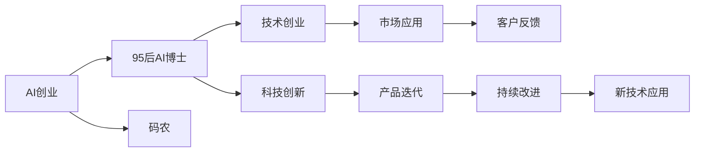

                 

# AI创业者的码头故事：95后AI博士选择

> 关键词：AI创业, 95后, AI博士, 码农, 选择, 技术创业, 科技创新, 人工智能发展

## 1. 背景介绍

在AI热的浪潮中，越来越多有志之士涌入这个领域，其中不乏一些90后、95后青年。在这个充满挑战与机遇的AI时代，这些年轻AI人面临着怎样的选择？他们的故事将给我们带来怎样的启示？本文将深入探讨这些问题。

### 1.1 时代背景

随着科技的飞速发展，人工智能（AI）成为了推动社会进步的重要引擎。从学术界到工业界，从科研到应用，AI正在深刻改变着世界的每一个角落。特别是在当前全球科技竞争激烈的态势下，AI领域逐渐成为创业的热土，吸引着众多AI爱好者和青年才俊投身其中。

### 1.2 95后群体的特点

95后群体出生和成长在互联网时代，他们天生对科技、创新有着浓厚的兴趣。相比于80后、70后，他们更熟悉互联网、更适应移动化、智能化生活，也更愿意接受和尝试新的事物。他们充满活力，思维跳跃，对AI的理解和应用有着独特的视角。

## 2. 核心概念与联系

### 2.1 核心概念概述

- **AI创业**：指基于人工智能技术，开发出具有商业价值的产品和服务，并将这些产品或服务推向市场，实现商业化的过程。
- **95后AI博士**：指拥有博士学位，年龄在95年后的AI研究人员或工程师。他们拥有扎实的理论基础和前沿的技术知识，对AI的未来发展有着深刻的见解。
- **码农**：是对程序员的一种亲切称呼，他们精通编程，致力于开发各种软件产品，推动科技发展。
- **选择**：在选择职业道路时，每个人都要根据自己的兴趣、优势和市场需求做出决策，这包括选择行业、公司、项目，甚至是选择不同的工作方式（如远程、全职、兼职等）。
- **技术创业**：指利用技术创新作为核心竞争力，进行创业活动，建立新的商业模式。
- **科技创新**：指在现有科技成果的基础上，不断进行技术革新和突破，创造新的产品和服务。

这些核心概念之间有紧密的联系：AI创业是技术创业的一种表现形式，95后AI博士和码农都是技术创业的重要力量。他们的选择不仅影响个人的职业发展，也对AI技术的发展和创新有着不可忽视的作用。

### 2.2 核心概念原理和架构的 Mermaid 流程图(Mermaid 流程节点中不要有括号、逗号等特殊字符)



该图展示了AI创业、95后AI博士、码农、技术创业和科技创新之间的关系及其相互影响。95后AI博士和码农通过技术创新推动产品迭代，进而通过市场应用获取客户反馈，并在此基础上持续改进，不断引入新技术，形成良性循环。

## 3. 核心算法原理 & 具体操作步骤

### 3.1 算法原理概述

AI创业的核心在于利用人工智能技术解决实际问题，创造商业价值。在这个过程中，算法设计、模型训练、产品开发等各个环节都需要精心设计，以确保技术的可行性和产品的实用性。95后AI博士作为AI技术的前沿研究者，他们熟悉算法原理，能够将复杂的AI算法转化为实用的技术。

### 3.2 算法步骤详解

AI创业的算法步骤主要包括以下几个方面：

1. **需求分析**：明确用户需求和市场痛点，确定创业方向。
2. **算法选择**：选择合适的算法模型，并对其进行训练和优化。
3. **数据处理**：清洗和处理数据，以提高模型训练效果。
4. **模型训练**：利用AI模型对数据进行训练，并调整超参数，以获得最优性能。
5. **产品开发**：将训练好的模型集成到产品中，并开发用户界面和其他功能。
6. **市场测试**：在小范围内测试产品，收集用户反馈，进行产品优化。
7. **大规模部署**：在大范围内部署产品，并通过数据反馈不断优化模型和产品。

### 3.3 算法优缺点

**优点**：

- **技术领先**：AI创业可以依托先进的人工智能技术，快速进入前沿科技领域。
- **灵活性强**：可以根据市场需求和用户反馈快速调整产品和服务。
- **创新驱动**：新技术的应用能够持续推动产品和服务的创新。

**缺点**：

- **研发周期长**：从算法模型到产品开发再到市场验证，整个过程耗时较长。
- **技术门槛高**：需要深厚的AI技术背景和创新能力。
- **资源投入大**：研发和市场推广需要大量人力物力。

### 3.4 算法应用领域

AI创业涵盖了众多应用领域，以下是其中几个典型的案例：

- **医疗健康**：基于AI的医疗影像分析、诊断系统、智能辅助诊疗系统等。
- **金融科技**：智能投顾、风险评估、反欺诈系统等。
- **智能制造**：工业视觉检测、机器人自动化系统、生产调度系统等。
- **教育**：个性化学习推荐、智能辅导系统、自动化阅卷等。
- **零售电商**：智能客服、推荐系统、个性化广告等。

## 4. 数学模型和公式 & 详细讲解 & 举例说明

### 4.1 数学模型构建

AI创业中的数学模型构建通常基于机器学习和深度学习算法。以推荐系统为例，推荐模型的数学模型可以表示为：

$$ P(x|y) = \prod_{i=1}^n P(x_i|y) $$

其中，$x$ 表示用户行为数据，$y$ 表示用户画像和偏好信息，$P(x|y)$ 表示在用户画像信息下，用户行为数据$x$的概率分布。

### 4.2 公式推导过程

推荐系统的核心公式为协同过滤（Collaborative Filtering），其基于用户行为数据进行相似度计算，预测用户对未交互物品的评分。假设用户$u$对物品$i$的评分$R_{ui}$，则协同过滤的公式可以表示为：

$$ \hat{R}_{ui} = \sum_{j=1}^m \alpha_j \hat{R}_{uj} \hat{R}_{ij} $$

其中，$\alpha_j$为用户的隐含因子，$m$为用户数量，$i$和$j$表示物品，$\hat{R}_{ui}$表示用户$u$对物品$i$的预测评分。

### 4.3 案例分析与讲解

假设我们要开发一个基于协同过滤的推荐系统，以下是具体的实现步骤：

1. **数据收集**：从电商平台收集用户行为数据，包括点击、浏览、购买等行为数据。
2. **数据清洗**：清洗数据，去除噪音和不完整数据。
3. **用户画像**：通过用户行为数据，构建用户画像，包括用户的兴趣、偏好等信息。
4. **物品画像**：通过物品的描述、类别等信息，构建物品画像。
5. **协同过滤**：使用协同过滤算法计算用户和物品之间的相似度，预测用户对物品的评分。
6. **推荐生成**：根据预测评分，生成推荐列表，推荐给用户。

## 5. 项目实践：代码实例和详细解释说明

### 5.1 开发环境搭建

要开发一个基于AI的推荐系统，首先需要搭建好开发环境。以下是搭建开发环境的详细步骤：

1. **安装Python**：从Python官网下载并安装最新版本Python。
2. **安装相关库**：安装推荐系统常用的库，如numpy、pandas、scikit-learn等。
3. **配置虚拟环境**：使用virtualenv创建虚拟环境，确保各版本库不冲突。
4. **安装TensorFlow**：安装TensorFlow，用于构建深度学习模型。

### 5.2 源代码详细实现

以下是一个简单的推荐系统的代码实现，主要包含用户画像和物品画像的构建、协同过滤算法和推荐系统的生成。

```python
import numpy as np
import pandas as pd
from sklearn.metrics.pairwise import cosine_similarity

# 用户行为数据
user_data = pd.read_csv('user_data.csv')

# 物品信息数据
item_data = pd.read_csv('item_data.csv')

# 构建用户画像
user_profile = user_data.groupby('user_id').mean()

# 构建物品画像
item_profile = item_data.groupby('item_id').mean()

# 构建用户与物品的相似度矩阵
similarity_matrix = cosine_similarity(user_profile, item_profile)

# 用户对物品的评分
user_ratings = pd.read_csv('user_ratings.csv')

# 协同过滤推荐
def collaborative_filtering(user_id, n_recommendations=5):
    # 获取用户对物品的评分
    user_ratings_vector = user_ratings[user_id]
    # 计算用户与物品的相似度
    user_similarity = similarity_matrix[user_id]
    # 计算物品的评分预测值
    predicted_ratings = np.dot(user_similarity, user_ratings_vector)
    # 根据预测值排序，生成推荐列表
    recommendations = predicted_ratings.argsort()[-n_recommendations:]
    return recommendations

# 测试
recommendations = collaborative_filtering(100)
print(recommendations)
```

### 5.3 代码解读与分析

上述代码实现了一个简单的协同过滤推荐系统。首先，构建用户画像和物品画像，然后通过余弦相似度计算用户和物品之间的相似度，最后根据相似度计算预测评分，并生成推荐列表。

**关键代码解释**：

- `cosine_similarity`：计算向量之间的余弦相似度，用于构建用户和物品的相似度矩阵。
- `argsort`：根据预测评分排序，返回前$n_recommendations$个推荐物品。

### 5.4 运行结果展示

运行上述代码，将输出用户$100$的推荐物品列表。这个列表是根据协同过滤算法计算出的，包含了用户$100$可能感兴趣的物品。

## 6. 实际应用场景

### 6.1 医疗健康

在医疗健康领域，AI创业有着巨大的应用潜力。例如，AI医生助手可以通过分析医学影像、电子病历等信息，辅助医生进行疾病诊断、治疗方案推荐等工作。

**应用案例**：

- **医学影像分析**：通过深度学习算法分析医学影像，帮助医生识别病变区域和病变类型。
- **电子病历分析**：利用自然语言处理技术分析电子病历，辅助医生进行病情评估和诊疗方案制定。
- **智能手术辅助**：开发智能手术系统，帮助医生进行手术操作和风险评估。

### 6.2 金融科技

金融科技是AI创业的另一大热点领域。通过AI技术，可以实现风险控制、智能投顾、反欺诈等功能，提高金融机构的运营效率和安全性。

**应用案例**：

- **智能投顾**：通过机器学习算法分析市场数据，为用户提供个性化的投资建议。
- **风险评估**：利用深度学习算法对客户信用进行评估，降低贷款风险。
- **反欺诈系统**：通过异常检测算法识别交易中的欺诈行为，保护用户资金安全。

### 6.3 智能制造

智能制造领域同样需要AI创业的支持。AI技术可以通过工业视觉检测、机器人自动化系统、生产调度系统等，提升制造业的自动化水平和生产效率。

**应用案例**：

- **工业视觉检测**：利用计算机视觉技术检测生产中的缺陷和异常。
- **机器人自动化系统**：通过智能算法控制机器人完成复杂的操作和装配。
- **生产调度系统**：通过优化算法调整生产计划，提升生产效率。

## 7. 工具和资源推荐

### 7.1 学习资源推荐

- **《深度学习》（Goodfellow et al.）**：深度学习领域的经典教材，详细介绍了深度学习的基本理论和应用。
- **Coursera**：提供多个AI相关的在线课程，包括机器学习、深度学习、自然语言处理等。
- **Kaggle**：数据科学竞赛平台，可以参与各类AI项目竞赛，积累实战经验。

### 7.2 开发工具推荐

- **Jupyter Notebook**：免费的开源笔记本，支持Python编程，适合数据探索和模型验证。
- **PyTorch**：流行的深度学习框架，支持动态图和静态图，适合快速原型开发。
- **TensorFlow**：Google开发的深度学习框架，支持分布式训练和部署。

### 7.3 相关论文推荐

- **《深度学习》（Ian Goodfellow et al.）**：深度学习领域的经典教材，详细介绍了深度学习的基本理论和应用。
- **《机器学习》（Tom Mitchell）**：机器学习领域的经典教材，介绍了机器学习的基本原理和算法。
- **《自然语言处理综论》（Daniel Jurafsky and James H. Martin）**：自然语言处理领域的经典教材，详细介绍了自然语言处理的基本技术和应用。

## 8. 总结：未来发展趋势与挑战

### 8.1 研究成果总结

AI创业在过去几年中取得了长足的发展，特别是在医疗健康、金融科技、智能制造等领域。95后AI博士和码农通过技术创新，推动了AI技术的落地应用，展现了强大的技术实力和创新能力。

### 8.2 未来发展趋势

未来，AI创业将继续保持快速发展的态势，以下几个趋势值得关注：

- **跨界融合**：AI技术将与其他行业（如农业、能源、交通等）深度融合，推动各行业的智能化升级。
- **自动化与智能化**：AI系统将更加自动化和智能化，提升用户体验和工作效率。
- **隐私保护**：AI系统在处理个人数据时将更加注重隐私保护，保障用户信息安全。
- **伦理规范**：AI创业将更加注重伦理规范和法律合规，确保技术的公正和透明。

### 8.3 面临的挑战

尽管AI创业充满了机遇，但也面临着诸多挑战：

- **技术瓶颈**：AI算法和模型的复杂性导致研发周期较长，技术实现难度较大。
- **市场竞争**：AI领域竞争激烈，众多企业和创业团队在争夺市场份额。
- **伦理问题**：AI技术在应用过程中可能涉及伦理和隐私问题，需要妥善处理。
- **人才短缺**：AI领域人才短缺，难以满足快速发展的需求。

### 8.4 研究展望

未来，AI创业需要在技术、市场、伦理等多个方面持续发力，才能保持持续发展。以下是几个重要的研究方向：

- **跨领域知识融合**：将AI技术与各行业专业知识结合，提升系统性能和实用性。
- **自动化模型训练**：开发自动化模型训练工具，减少研发成本。
- **数据隐私保护**：研究数据隐私保护技术，确保用户数据安全。
- **伦理规范研究**：制定AI伦理规范，确保技术的公正和透明。

## 9. 附录：常见问题与解答

**Q1: 如何选择合适的AI创业方向？**

A: 选择AI创业方向需要考虑市场需求、技术可行性、自身兴趣和资源情况。可以通过市场调研和用户反馈，明确目标市场和用户需求。同时，评估自身技术优势和资源配置，选择最适合的创业方向。

**Q2: AI创业需要投入多少资金？**

A: AI创业的资金投入因项目不同而异。一般来说，AI创业需要投入较少的资金，但前期研发和技术迭代成本较高。可以根据项目规模和需求，合理评估资金需求，确保项目的顺利进行。

**Q3: AI创业的团队应该具备哪些技能？**

A: AI创业团队需要具备以下技能：

- **技术技能**：掌握深度学习、机器学习、自然语言处理等AI技术。
- **项目管理**：具备项目管理和团队协作能力，确保项目按计划推进。
- **市场运营**：具备市场分析和运营能力，能够推广产品，拓展市场。

**Q4: AI创业的商业模式有哪些？**

A: AI创业的商业模式多种多样，主要包括：

- **产品销售**：开发AI产品，并通过销售获取收益。
- **服务订阅**：提供AI服务，收取订阅费用。
- **数据变现**：收集和分析用户数据，进行数据挖掘和商业变现。

**Q5: AI创业应该如何进行市场推广？**

A: AI创业的市场推广可以通过以下方式：

- **内容营销**：通过博客、视频、白皮书等形式，展示技术优势和应用场景。
- **参加展会**：参加行业展会和活动，与潜在客户和合作伙伴进行交流。
- **社交媒体**：通过社交媒体平台，宣传产品和项目，提高品牌知名度。

---

作者：禅与计算机程序设计艺术 / Zen and the Art of Computer Programming

