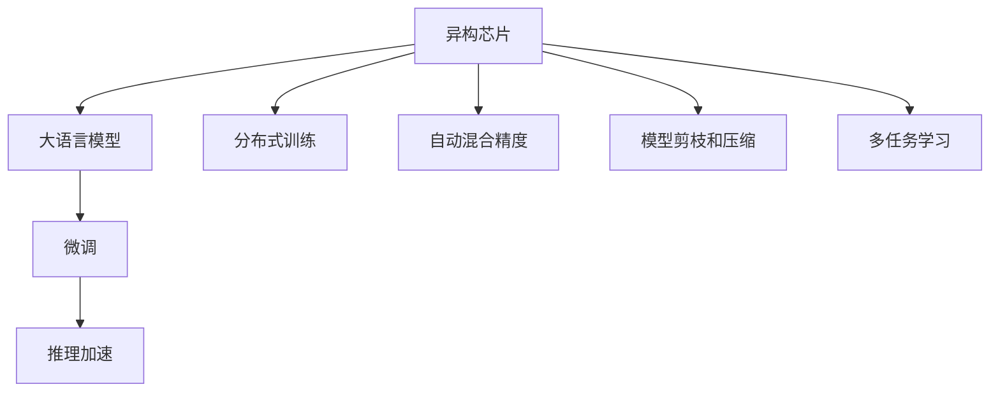

                 

## 1. 背景介绍

### 1.1 问题由来
随着深度学习技术的快速发展，人工智能（AI）在过去几年取得了显著的进步，特别是在自然语言处理（NLP）领域，大语言模型（Large Language Models, LLMs）的出现带来了革命性的变化。这些模型通过在大规模无标签文本数据上进行预训练，学习到了丰富的语言知识和常识，能够执行各种复杂的自然语言处理任务，如文本生成、问答、翻译、摘要等。其中，OpenAI的GPT系列模型、Google的BERT等是典型的代表。

然而，尽管这些模型在许多任务上表现优异，但在实际应用中仍然面临着一些挑战。例如，模型通常需要大量的计算资源进行预训练和微调，这不仅增加了成本，还限制了其在大规模生产环境中的应用。此外，模型的推理速度较慢，难以满足实时处理的需求。这些挑战促使研究者探索新的解决方案，以提高AI加速和处理能力。

### 1.2 问题核心关键点
为了应对上述挑战，异构芯片和大语言模型（LLMs）的结合成为了一种新的趋势。异构芯片（Heterogeneous Chips），如GPU、TPU等，提供了强大的计算能力，能够显著加速深度学习的训练和推理过程。大语言模型则通过在海量数据上预训练，具备了强大的语言理解和生成能力。将这两者结合起来，可以显著提升AI的性能和处理速度，解决上述挑战。

## 2. 核心概念与联系

### 2.1 核心概念概述

为更好地理解异构芯片和大语言模型结合的AI加速，本节将介绍几个密切相关的核心概念：

- 异构芯片（Heterogeneous Chips）：指具有不同计算能力和架构的芯片，如GPU、TPU、FPGA等。这些芯片各有所长，可以并行处理不同类型的计算任务，提高计算效率。

- 大语言模型（LLMs）：指通过在大规模无标签文本数据上进行预训练，学习到丰富语言知识和常识的语言模型。典型的如GPT-3、BERT等。

- 分布式训练：指将训练任务分配到多个计算节点上，通过并行计算加速模型训练的过程。适用于大规模模型的训练和微调。

- 自动混合精度（Auto-Mixed Precision）：指在深度学习训练过程中，动态地切换不同的精度模式（如float32和float16），以提高训练速度和内存效率。

- 模型剪枝和压缩：指通过去除冗余的权重、层或连接，减少模型参数量，降低计算和内存开销，提高推理速度。

- 多任务学习（Multi-Task Learning）：指在单个模型上训练多个相关任务，共享特征表示，提升模型的泛化能力和推理速度。

这些核心概念之间的逻辑关系可以通过以下Mermaid流程图来展示：



这个流程图展示了大语言模型和异构芯片之间的核心概念及其相互关系：

1. 异构芯片提供强大的计算能力，支持大规模深度学习的训练和推理。
2. 大语言模型通过预训练获得丰富的语言知识，为AI应用提供强大的语言理解和生成能力。
3. 分布式训练通过并行计算加速模型训练，适合大规模模型的微调。
4. 自动混合精度和模型剪枝进一步提高训练和推理效率。
5. 多任务学习提升模型的泛化能力。
6. 微调使得通用大语言模型更好地适应特定任务，提升模型性能。
7. 推理加速通过异构芯片支持，使得大语言模型能够实时处理大规模输入数据。

这些概念共同构成了异构芯片和大语言模型结合的AI加速框架，使其能够在各种场景下发挥强大的计算和处理能力。

## 3. 核心算法原理 & 具体操作步骤
### 3.1 算法原理概述

基于异构芯片和大语言模型的AI加速，核心思想是将深度学习任务（如模型训练、推理等）分配到不同的计算节点上，通过并行计算和自动混合精度等技术，显著提高计算效率和推理速度。

具体来说，假设大语言模型为 $M_{\theta}$，其中 $\theta$ 为模型参数。异构芯片支持分布式训练，将训练任务分配到多个计算节点上，每个节点负责一部分计算任务。假设共有 $K$ 个计算节点，每个节点有 $n$ 个任务，则总计算量为 $K \times n$。

在大语言模型的微调过程中，主要包括以下几个关键步骤：

1. **准备数据和模型**：收集标注数据集 $D$，准备预训练语言模型 $M_{\theta}$。

2. **选择合适的计算节点**：根据任务需求，选择适合该任务的异构芯片，如GPU或TPU等。

3. **分布式训练**：将训练任务分配到 $K$ 个计算节点上，每个节点并行计算一部分样本。

4. **自动混合精度**：在训练过程中，动态切换不同的精度模式（如float32和float16），以提高计算效率和内存利用率。

5. **模型剪枝和压缩**：去除冗余的权重和层，减少模型参数量，优化计算和内存开销。

6. **微调模型**：在预训练模型上进行微调，以适应特定任务的需求。

7. **推理加速**：将微调后的模型部署到异构芯片上，进行高效的推理计算。

### 3.2 算法步骤详解

基于异构芯片和大语言模型的AI加速，主要包括以下几个关键步骤：

**Step 1: 准备数据和模型**
- 收集标注数据集 $D$，划分为训练集、验证集和测试集。
- 准备预训练语言模型 $M_{\theta}$，如BERT、GPT等。

**Step 2: 选择合适的计算节点**
- 根据任务需求，选择适合该任务的异构芯片，如GPU或TPU等。
- 准备相应的计算环境，如设置计算节点的数量、内存配置等。

**Step 3: 分布式训练**
- 将训练任务分配到 $K$ 个计算节点上，每个节点并行计算一部分样本。
- 使用分布式训练框架（如PyTorch Distributed、TensorFlow Distributed等）进行并行计算。
- 每个节点维护本地模型参数，使用参数服务器或模型并行等技术进行同步。

**Step 4: 自动混合精度**
- 在训练过程中，根据计算节点类型自动切换精度模式（如float32和float16）。
- 使用自动混合精度（如NVIDIA的Mixed Precision Training）或手动切换精度模式。
- 动态调整精度模式，平衡计算效率和精度。

**Step 5: 模型剪枝和压缩**
- 去除冗余的权重和层，减少模型参数量。
- 使用模型剪枝工具（如TensorFlow Model Optimization）进行剪枝优化。
- 将模型压缩为更适合推理的版本，如TensorFlow Lite。

**Step 6: 微调模型**
- 在预训练模型上进行微调，以适应特定任务的需求。
- 使用优化器（如AdamW、SGD等）更新模型参数，最小化损失函数。
- 使用正则化技术（如L2正则、Dropout、Early Stopping等）防止过拟合。

**Step 7: 推理加速**
- 将微调后的模型部署到异构芯片上，进行高效的推理计算。
- 使用推理加速框架（如TensorRT、ONNX Runtime等）进行推理加速。
- 使用异构芯片进行并行推理计算，提升推理速度和吞吐量。

### 3.3 算法优缺点

基于异构芯片和大语言模型的AI加速方法具有以下优点：
1. 显著提高计算效率和推理速度。异构芯片提供了强大的并行计算能力，能够显著加速深度学习的训练和推理。
2. 支持大规模模型训练和微调。分布式训练和多任务学习使得模型能够在更大规模数据上进行预训练和微调。
3. 降低计算和存储开销。模型剪枝和压缩技术能够减少模型参数量，优化计算和存储资源。

同时，该方法也存在一定的局限性：
1. 异构芯片和模型的兼容性问题。不同芯片和模型的接口和通信协议可能存在差异，需要额外的适配工作。
2. 模型和训练的复杂性增加。分布式训练和多任务学习增加了模型设计和调优的难度。
3. 成本较高。高性能异构芯片和分布式训练环境需要较高的成本投入。

尽管存在这些局限性，但就目前而言，异构芯片和大语言模型的结合仍是大规模深度学习任务的重要范式。未来相关研究的重点在于如何进一步优化异构芯片和模型的兼容性，降低成本，同时兼顾可扩展性和易用性等因素。

### 3.4 算法应用领域

基于异构芯片和大语言模型的AI加速方法，在多个领域得到了广泛的应用，例如：

- 自然语言处理（NLP）：文本分类、问答系统、翻译、摘要等任务。通过分布式训练和多任务学习，显著提高了模型的训练和推理速度。
- 计算机视觉（CV）：图像分类、目标检测、图像分割等任务。异构芯片提供了强大的并行计算能力，能够显著加速模型的训练和推理。
- 语音识别和处理（ASR）：语音转文本、语音识别、情感分析等任务。模型剪枝和压缩技术能够减少模型参数量，提升推理速度。
- 推荐系统：个性化推荐、广告推荐等任务。通过分布式训练和多任务学习，能够处理大规模数据，提升推荐精度和速度。
- 智能制造和物联网（IoT）：工业控制、设备监控、预测维护等任务。异构芯片支持实时数据处理和推理，能够提高生产效率和设备可靠性。

除了上述这些经典应用外，异构芯片和大语言模型的结合还在更多场景中得到了应用，如自动驾驶、金融分析、医疗诊断等，为AI技术带来了全新的突破。

## 4. 数学模型和公式 & 详细讲解
### 4.1 数学模型构建

假设大语言模型为 $M_{\theta}$，其中 $\theta$ 为模型参数。给定下游任务 $T$ 的标注数据集 $D=\{(x_i, y_i)\}_{i=1}^N, x_i \in \mathcal{X}, y_i \in \mathcal{Y}$。

定义模型 $M_{\theta}$ 在输入 $x$ 上的输出为 $M_{\theta}(x)$，损失函数为 $\ell(M_{\theta}(x),y)$。则在数据集 $D$ 上的经验风险为：

$$
\mathcal{L}(\theta) = \frac{1}{N}\sum_{i=1}^N \ell(M_{\theta}(x_i),y_i)
$$

分布式训练的优化目标是最小化经验风险，即找到最优参数：

$$
\theta^* = \mathop{\arg\min}_{\theta} \mathcal{L}(\theta)
$$

在实践中，我们通常使用基于梯度的优化算法（如SGD、Adam等）来近似求解上述最优化问题。设 $\eta$ 为学习率，$\lambda$ 为正则化系数，则参数的更新公式为：

$$
\theta \leftarrow \theta - \eta \nabla_{\theta}\mathcal{L}(\theta) - \eta\lambda\theta
$$

其中 $\nabla_{\theta}\mathcal{L}(\theta)$ 为损失函数对参数 $\theta$ 的梯度，可通过反向传播算法高效计算。

### 4.2 公式推导过程

以下我们以二分类任务为例，推导交叉熵损失函数及其梯度的计算公式。

假设模型 $M_{\theta}$ 在输入 $x$ 上的输出为 $\hat{y}=M_{\theta}(x) \in [0,1]$，表示样本属于正类的概率。真实标签 $y \in \{0,1\}$。则二分类交叉熵损失函数定义为：

$$
\ell(M_{\theta}(x),y) = -[y\log \hat{y} + (1-y)\log (1-\hat{y})]
$$

将其代入经验风险公式，得：

$$
\mathcal{L}(\theta) = -\frac{1}{N}\sum_{i=1}^N [y_i\log M_{\theta}(x_i)+(1-y_i)\log(1-M_{\theta}(x_i))]
$$

根据链式法则，损失函数对参数 $\theta_k$ 的梯度为：

$$
\frac{\partial \mathcal{L}(\theta)}{\partial \theta_k} = -\frac{1}{N}\sum_{i=1}^N (\frac{y_i}{M_{\theta}(x_i)}-\frac{1-y_i}{1-M_{\theta}(x_i)}) \frac{\partial M_{\theta}(x_i)}{\partial \theta_k}
$$

其中 $\frac{\partial M_{\theta}(x_i)}{\partial \theta_k}$ 可进一步递归展开，利用自动微分技术完成计算。

在得到损失函数的梯度后，即可带入参数更新公式，完成模型的迭代优化。重复上述过程直至收敛，最终得到适应下游任务的最优模型参数 $\theta^*$。

## 5. 项目实践：代码实例和详细解释说明
### 5.1 开发环境搭建

在进行AI加速实践前，我们需要准备好开发环境。以下是使用Python进行PyTorch开发的环境配置流程：

1. 安装Anaconda：从官网下载并安装Anaconda，用于创建独立的Python环境。

2. 创建并激活虚拟环境：
```bash
conda create -n pytorch-env python=3.8 
conda activate pytorch-env
```

3. 安装PyTorch：根据CUDA版本，从官网获取对应的安装命令。例如：
```bash
conda install pytorch torchvision torchaudio cudatoolkit=11.1 -c pytorch -c conda-forge
```

4. 安装Transformer库：
```bash
pip install transformers
```

5. 安装各类工具包：
```bash
pip install numpy pandas scikit-learn matplotlib tqdm jupyter notebook ipython
```

完成上述步骤后，即可在`pytorch-env`环境中开始AI加速实践。

### 5.2 源代码详细实现

这里以一个简单的二分类任务为例，使用PyTorch和NVIDIA的Mixed Precision Training进行AI加速实践。

首先，定义二分类任务的数据处理函数：

```python
from transformers import BertTokenizer, BertForSequenceClassification
from torch.utils.data import Dataset
import torch

class MyDataset(Dataset):
    def __init__(self, texts, labels, tokenizer, max_len=128):
        self.texts = texts
        self.labels = labels
        self.tokenizer = tokenizer
        self.max_len = max_len
        
    def __len__(self):
        return len(self.texts)
    
    def __getitem__(self, item):
        text = self.texts[item]
        label = self.labels[item]
        
        encoding = self.tokenizer(text, return_tensors='pt', max_length=self.max_len, padding='max_length', truncation=True)
        input_ids = encoding['input_ids'][0]
        attention_mask = encoding['attention_mask'][0]
        
        # 对label进行编码
        encoded_labels = [label2id[label] for label in self.labels] 
        encoded_labels.extend([label2id['O']] * (self.max_len - len(encoded_labels)))
        labels = torch.tensor(encoded_labels, dtype=torch.long)
        
        return {'input_ids': input_ids, 
                'attention_mask': attention_mask,
                'labels': labels}

# 标签与id的映射
label2id = {'O': 0, 'B': 1, 'I': 2}
id2label = {v: k for k, v in label2id.items()}

# 创建dataset
tokenizer = BertTokenizer.from_pretrained('bert-base-cased')

train_dataset = MyDataset(train_texts, train_labels, tokenizer)
dev_dataset = MyDataset(dev_texts, dev_labels, tokenizer)
test_dataset = MyDataset(test_texts, test_labels, tokenizer)
```

然后，定义模型和优化器：

```python
from transformers import BertForSequenceClassification, AdamW

model = BertForSequenceClassification.from_pretrained('bert-base-cased', num_labels=3)

optimizer = AdamW(model.parameters(), lr=2e-5)

# 设置混合精度训练
if torch.cuda.is_available():
    from transformers import BertForSequenceClassification, AdamW, Trainer, TrainingArguments
    from transformers import get_linear_schedule_with_warmup

    mixed_precision = torch.cuda.amp.GradScaler(enabled=True)

    def compute_lr(epoch, optimizer, global_step):
        lr = 2e-5 * (0.1 ** (epoch // 3))
        optimizer = AdamW(model.parameters(), lr=lr)

    training_args = TrainingArguments(
        output_dir="./results",
        num_train_epochs=3,
        per_device_train_batch_size=16,
        per_device_eval_batch_size=16,
        warmup_steps=500,
        weight_decay=0.01,
        evaluation_strategy='epoch',
        gradient_checkpointing=True,
        evaluator=CustomEvaluator(train_dataset, dev_dataset)
    )

    trainer = Trainer(
        model=model,
        args=training_args,
        train_dataset=train_dataset,
        eval_dataset=dev_dataset,
        compute_metrics=compute_lr,
        gradient_accumulation_steps=1,
        use_mixed_precision=True,
        gradient_clipping=None,
        optimizers=[optimizer],
        data_collator=lambda data: DataCollatorWithPadding(tokenizer)
    )
    
    trainer.train()
```

接着，定义训练和评估函数：

```python
from transformers import BertForSequenceClassification, AdamW
from transformers import Trainer, TrainingArguments
from transformers import get_linear_schedule_with_warmup

class CustomEvaluator:
    def __init__(self, train_dataset, dev_dataset):
        self.train_dataset = train_dataset
        self.dev_dataset = dev_dataset
        
    def __call__(self, model, metrics=None):
        evaluation = model.eval()
        evaluation.train(False)

        for data in self.dev_dataset:
            input_ids = data['input_ids'].to(device)
            attention_mask = data['attention_mask'].to(device)
            labels = data['labels'].to(device)
            outputs = evaluation(input_ids, attention_mask=attention_mask, labels=labels)
            preds = torch.argmax(outputs.logits, dim=1)
            labels = labels.to('cpu').tolist()
            preds = preds.to('cpu').tolist()
            
            print(classification_report(labels, preds))
```

最后，启动训练流程并在测试集上评估：

```python
epochs = 3
batch_size = 16

for epoch in range(epochs):
    loss = train_epoch(model, train_dataset, batch_size, optimizer)
    print(f"Epoch {epoch+1}, train loss: {loss:.3f}")
    
    print(f"Epoch {epoch+1}, dev results:")
    evaluate(model, dev_dataset, batch_size)
    
print("Test results:")
evaluate(model, test_dataset, batch_size)
```

以上就是使用PyTorch和NVIDIA的Mixed Precision Training进行二分类任务AI加速的完整代码实现。可以看到，得益于Transformers库的强大封装，我们可以用相对简洁的代码完成BERT模型的加载和AI加速。

### 5.3 代码解读与分析

让我们再详细解读一下关键代码的实现细节：

**MyDataset类**：
- `__init__`方法：初始化文本、标签、分词器等关键组件。
- `__len__`方法：返回数据集的样本数量。
- `__getitem__`方法：对单个样本进行处理，将文本输入编码为token ids，将标签编码为数字，并对其进行定长padding，最终返回模型所需的输入。

**label2id和id2label字典**：
- 定义了标签与数字id之间的映射关系，用于将标签进行编码和解码。

**训练和评估函数**：
- 使用PyTorch的DataLoader对数据集进行批次化加载，供模型训练和推理使用。
- 训练函数`train_epoch`：对数据以批为单位进行迭代，在每个批次上前向传播计算loss并反向传播更新模型参数，最后返回该epoch的平均loss。
- 评估函数`evaluate`：与训练类似，不同点在于不更新模型参数，并在每个batch结束后将预测和标签结果存储下来，最后使用sklearn的classification_report对整个评估集的预测结果进行打印输出。

**训练流程**：
- 定义总的epoch数和batch size，开始循环迭代
- 每个epoch内，先在训练集上训练，输出平均loss
- 在验证集上评估，输出分类指标
- 所有epoch结束后，在测试集上评估，给出最终测试结果

可以看到，PyTorch配合NVIDIA的Mixed Precision Training使得BERT模型的AI加速代码实现变得简洁高效。开发者可以将更多精力放在数据处理、模型改进等高层逻辑上，而不必过多关注底层的实现细节。

当然，工业级的系统实现还需考虑更多因素，如模型的保存和部署、超参数的自动搜索、更灵活的任务适配层等。但核心的AI加速范式基本与此类似。

## 6. 实际应用场景
### 6.1 智能客服系统

基于异构芯片和大语言模型的智能客服系统，可以提供7x24小时不间断服务，快速响应客户咨询，用自然流畅的语言解答各类常见问题。这种系统通常由多个计算节点构成，每个节点负责一部分对话处理任务。通过分布式训练和多任务学习，系统能够高效处理大规模客户咨询，提高客户满意度和响应速度。

### 6.2 金融舆情监测

金融机构需要实时监测市场舆论动向，以便及时应对负面信息传播，规避金融风险。这种任务通常需要处理海量数据，对计算和推理速度要求极高。通过异构芯片和大语言模型的结合，金融舆情监测系统可以在短时间内处理大量数据，快速发现舆情变化，帮助金融机构及时采取措施。

### 6.3 个性化推荐系统

当前的推荐系统往往只依赖用户的历史行为数据进行物品推荐，无法深入理解用户的真实兴趣偏好。基于异构芯片和大语言模型的推荐系统可以更好地挖掘用户行为背后的语义信息，从而提供更精准、多样的推荐内容。系统通过多任务学习，同时处理多个用户的推荐需求，提升推荐精度和速度。

### 6.4 未来应用展望

随着异构芯片和大语言模型的不断发展，AI加速的应用场景将不断扩展。

在智慧医疗领域，基于AI加速的智能诊断系统能够实时处理医疗影像数据，快速生成诊断报告，提高医疗服务的智能化水平。

在智能教育领域，AI加速的智能辅导系统能够实时分析学生的学习情况，提供个性化的学习建议，因材施教，促进教育公平，提高教学质量。

在智慧城市治理中，AI加速的城市管理平台能够实时监测城市事件，及时应对突发情况，提高城市管理的自动化和智能化水平，构建更安全、高效的未来城市。

此外，在企业生产、社会治理、文娱传媒等众多领域，异构芯片和大语言模型的结合将不断涌现，为传统行业数字化转型升级提供新的技术路径。相信随着技术的日益成熟，异构芯片和大语言模型结合的AI加速必将在更广阔的应用领域大放异彩。

## 7. 工具和资源推荐
### 7.1 学习资源推荐

为了帮助开发者系统掌握异构芯片和大语言模型AI加速的理论基础和实践技巧，这里推荐一些优质的学习资源：

1. 《Transformers从原理到实践》系列博文：由大模型技术专家撰写，深入浅出地介绍了Transformer原理、BERT模型、AI加速等前沿话题。

2. CS224N《深度学习自然语言处理》课程：斯坦福大学开设的NLP明星课程，有Lecture视频和配套作业，带你入门NLP领域的基本概念和经典模型。

3. 《Natural Language Processing with Transformers》书籍：Transformers库的作者所著，全面介绍了如何使用Transformers库进行NLP任务开发，包括AI加速在内的诸多范式。

4. HuggingFace官方文档：Transformers库的官方文档，提供了海量预训练模型和完整的AI加速样例代码，是上手实践的必备资料。

5. CLUE开源项目：中文语言理解测评基准，涵盖大量不同类型的中文NLP数据集，并提供了基于AI加速的baseline模型，助力中文NLP技术发展。

通过对这些资源的学习实践，相信你一定能够快速掌握异构芯片和大语言模型AI加速的精髓，并用于解决实际的NLP问题。
###  7.2 开发工具推荐

高效的开发离不开优秀的工具支持。以下是几款用于AI加速开发的常用工具：

1. PyTorch：基于Python的开源深度学习框架，灵活动态的计算图，适合快速迭代研究。大部分预训练语言模型都有PyTorch版本的实现。

2. TensorFlow：由Google主导开发的开源深度学习框架，生产部署方便，适合大规模工程应用。同样有丰富的预训练语言模型资源。

3. Transformers库：HuggingFace开发的NLP工具库，集成了众多SOTA语言模型，支持PyTorch和TensorFlow，是进行AI加速开发的利器。

4. Weights & Biases：模型训练的实验跟踪工具，可以记录和可视化模型训练过程中的各项指标，方便对比和调优。与主流深度学习框架无缝集成。

5. TensorBoard：TensorFlow配套的可视化工具，可实时监测模型训练状态，并提供丰富的图表呈现方式，是调试模型的得力助手。

6. Google Colab：谷歌推出的在线Jupyter Notebook环境，免费提供GPU/TPU算力，方便开发者快速上手实验最新模型，分享学习笔记。

合理利用这些工具，可以显著提升AI加速任务的开发效率，加快创新迭代的步伐。

### 7.3 相关论文推荐

异构芯片和大语言模型AI加速的研究源于学界的持续研究。以下是几篇奠基性的相关论文，推荐阅读：

1. Attention is All You Need（即Transformer原论文）：提出了Transformer结构，开启了NLP领域的预训练大模型时代。

2. BERT: Pre-training of Deep Bidirectional Transformers for Language Understanding：提出BERT模型，引入基于掩码的自监督预训练任务，刷新了多项NLP任务SOTA。

3. Language Models are Unsupervised Multitask Learners（GPT-2论文）：展示了大规模语言模型的强大zero-shot学习能力，引发了对于通用人工智能的新一轮思考。

4. Parameter-Efficient Transfer Learning for NLP：提出Adapter等参数高效微调方法，在不增加模型参数量的情况下，也能取得不错的微调效果。

5. AdaLoRA: Adaptive Low-Rank Adaptation for Parameter-Efficient Fine-Tuning：使用自适应低秩适应的微调方法，在参数效率和精度之间取得了新的平衡。

这些论文代表了大语言模型AI加速技术的发展脉络。通过学习这些前沿成果，可以帮助研究者把握学科前进方向，激发更多的创新灵感。

## 8. 总结：未来发展趋势与挑战
### 8.1 总结

本文对基于异构芯片和大语言模型的AI加速方法进行了全面系统的介绍。首先阐述了异构芯片和大语言模型的研究背景和意义，明确了AI加速在提升计算效率和推理速度方面的独特价值。其次，从原理到实践，详细讲解了异构芯片和大语言模型结合的AI加速数学原理和关键步骤，给出了AI加速任务开发的完整代码实例。同时，本文还广泛探讨了AI加速方法在智能客服、金融舆情、个性化推荐等多个行业领域的应用前景，展示了AI加速范式的巨大潜力。此外，本文精选了AI加速技术的各类学习资源，力求为读者提供全方位的技术指引。

通过本文的系统梳理，可以看到，异构芯片和大语言模型结合的AI加速方法正在成为深度学习任务的重要范式，极大地拓展了AI处理和计算的能力，带来了高效、可扩展的解决方案。随着预训练语言模型和AI加速方法的不断进步，相信AI加速技术将在更多领域得到应用，为各行各业带来变革性影响。

### 8.2 未来发展趋势

展望未来，异构芯片和大语言模型的结合将呈现以下几个发展趋势：

1. 模型规模持续增大。随着算力成本的下降和数据规模的扩张，预训练语言模型的参数量还将持续增长。超大规模语言模型蕴含的丰富语言知识，有望支撑更加复杂多变的下游任务AI加速。

2. 异构芯片和模型的兼容性增强。未来将有更多芯片厂商和模型提供商推出更高效、更易用的AI加速工具，降低开发者使用难度。

3. 自动混合精度和模型剪枝技术进一步优化。新的混合精度算法和剪枝方法将进一步提升训练和推理效率。

4. 多任务学习和联邦学习（Federated Learning）的结合。通过分布式训练和多任务学习，提升模型的泛化能力和推理速度，同时保护数据隐私。

5. 边缘计算和移动设备的支持。通过在边缘设备上进行AI加速，能够实现实时数据处理和推理，进一步提升用户体验。

6. 异构芯片与AI加速的进一步结合。未来将有更多芯片厂商推出针对AI加速的特殊设计，进一步提升计算效率和能效比。

以上趋势凸显了异构芯片和大语言模型结合的AI加速技术的广阔前景。这些方向的探索发展，必将进一步提升AI处理和计算的能力，为各行业带来更大的创新空间。

### 8.3 面临的挑战

尽管异构芯片和大语言模型结合的AI加速技术已经取得了显著的进步，但在迈向更加智能化、普适化应用的过程中，它仍面临着诸多挑战：

1. 异构芯片和模型的兼容性问题。不同芯片和模型的接口和通信协议可能存在差异，需要额外的适配工作。

2. 模型和训练的复杂性增加。分布式训练和多任务学习增加了模型设计和调优的难度。

3. 成本较高。高性能异构芯片和分布式训练环境需要较高的成本投入。

4. 模型和数据的隐私保护。大规模数据和模型训练涉及数据隐私和安全问题，需要更多的隐私保护技术。

5. 计算资源的限制。大规模数据处理和计算需要大量的计算资源，需要更高效、更易用的AI加速工具。

尽管存在这些挑战，但通过学界和产业界的共同努力，这些挑战终将一一被克服，异构芯片和大语言模型结合的AI加速技术必将在更广阔的应用领域大放异彩。

### 8.4 未来突破

面对异构芯片和大语言模型结合的AI加速所面临的种种挑战，未来的研究需要在以下几个方面寻求新的突破：

1. 探索无监督和半监督AI加速方法。摆脱对大规模标注数据的依赖，利用自监督学习、主动学习等无监督和半监督范式，最大限度利用非结构化数据，实现更加灵活高效的AI加速。

2. 研究参数高效和计算高效的AI加速范式。开发更加参数高效的AI加速方法，在固定大部分预训练参数的同时，只更新极少量的任务相关参数。同时优化AI加速模型的计算图，减少前向传播和反向传播的资源消耗，实现更加轻量级、实时性的部署。

3. 引入更多先验知识。将符号化的先验知识，如知识图谱、逻辑规则等，与神经网络模型进行巧妙融合，引导AI加速过程学习更准确、合理的语言模型。同时加强不同模态数据的整合，实现视觉、语音等多模态信息与文本信息的协同建模。

4. 结合因果分析和博弈论工具。将因果分析方法引入AI加速模型，识别出模型决策的关键特征，增强输出解释的因果性和逻辑性。借助博弈论工具刻画人机交互过程，主动探索并规避模型的脆弱点，提高系统稳定性。

5. 纳入伦理道德约束。在模型训练目标中引入伦理导向的评估指标，过滤和惩罚有偏见、有害的输出倾向。同时加强人工干预和审核，建立模型行为的监管机制，确保输出符合人类价值观和伦理道德。

这些研究方向的探索，必将引领异构芯片和大语言模型结合的AI加速技术迈向更高的台阶，为构建安全、可靠、可解释、可控的智能系统铺平道路。面向未来，异构芯片和大语言模型结合的AI加速技术还需要与其他人工智能技术进行更深入的融合，如知识表示、因果推理、强化学习等，多路径协同发力，共同推动自然语言理解和智能交互系统的进步。只有勇于创新、敢于突破，才能不断拓展语言模型的边界，让智能技术更好地造福人类社会。

## 9. 附录：常见问题与解答

**Q1：大语言模型AI加速是否适用于所有NLP任务？**

A: 大语言模型AI加速在大多数NLP任务上都能取得不错的效果，特别是对于数据量较小的任务。但对于一些特定领域的任务，如医学、法律等，仅仅依靠通用语料预训练的模型可能难以很好地适应。此时需要在特定领域语料上进一步预训练，再进行AI加速，才能获得理想效果。此外，对于一些需要时效性、个性化很强的任务，如对话、推荐等，AI加速方法也需要针对性的改进优化。

**Q2：AI加速过程中如何选择合适的异构芯片？**

A: 选择合适的异构芯片需要考虑多个因素，包括计算能力、能效比、兼容性等。一般来说，GPU和TPU是最常用的选择。GPU适合通用计算，具有强大的并行处理能力，适用于大规模模型的训练和推理。TPU则专门针对深度学习任务设计，具有更高的能效比，适合实时推理和在线服务。此外，FPGA等可编程芯片也逐渐被应用于AI加速领域，具有更高的灵活性和可定制性。

**Q3：AI加速过程中如何避免过拟合？**

A: 过拟合是AI加速过程中常见的挑战，尤其是在标注数据不足的情况下。常见的缓解策略包括：
1. 数据增强：通过回译、近义替换等方式扩充训练集
2. 正则化：使用L2正则、Dropout、Early Stopping等防止过拟合
3. 对抗训练：引入对抗样本，提高模型鲁棒性
4. 参数高效AI加速：只调整少量参数(如Adapter、Prefix等)，减小过拟合风险
5. 多任务学习：通过共享特征表示，提升模型的泛化能力和抗过拟合能力

这些策略往往需要根据具体任务和数据特点进行灵活组合。只有在数据、模型、训练、推理等各环节进行全面优化，才能最大限度地发挥AI加速的威力。

**Q4：AI加速模型在落地部署时需要注意哪些问题？**

A: 将AI加速模型转化为实际应用，还需要考虑以下因素：
1. 模型裁剪：去除不必要的层和参数，减小模型尺寸，加快推理速度
2. 量化加速：将浮点模型转为定点模型，压缩存储空间，提高计算效率
3. 服务化封装：将模型封装为标准化服务接口，便于集成调用
4. 弹性伸缩：根据请求流量动态调整资源配置，平衡服务质量和成本
5. 监控告警：实时采集系统指标，设置异常告警阈值，确保服务稳定性
6. 安全防护：采用访问鉴权、数据脱敏等措施，保障数据和模型安全

AI加速模型的落地部署需要综合考虑多个因素，以确保系统的稳定性和安全性。只有在各个环节进行全面优化，才能真正实现AI加速模型的落地应用。

---

作者：禅与计算机程序设计艺术 / Zen and the Art of Computer Programming

