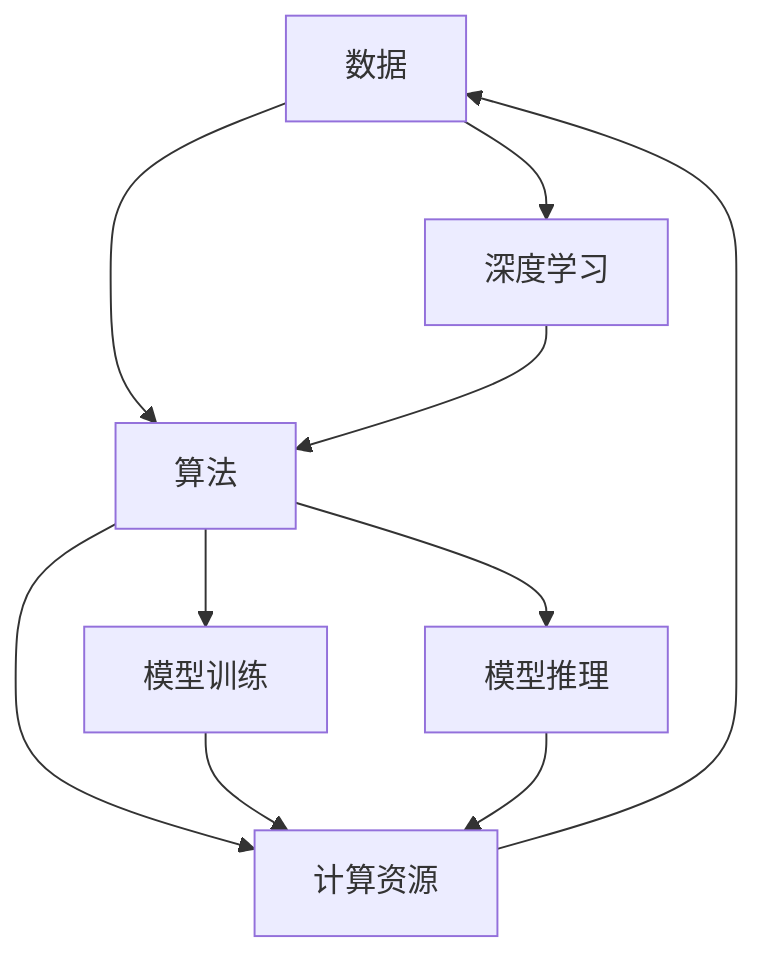

                 

## 1. 背景介绍

随着人工智能(AI)技术在各行各业的广泛应用，其发展已经进入了新的历史阶段。这一阶段的AI不仅在技术深度上有了显著突破，更在应用广度和多样性上取得了质的飞跃。本文将从三个核心力量入手，探讨当前AI发展的驱动因素，并展望其未来趋势。

### 1.1 问题的由来

AI的发展离不开三个关键因素：数据、算法和计算资源。这三个要素相互作用，共同推动了AI技术的快速发展。在技术深度的提升上，深度学习(DL)算法以其强大的建模能力，成为AI发展的重要基石。在应用广度上，数据驱动的策略使得AI能够从海量数据中挖掘出有价值的信息，应用于各类场景中。在计算资源的支撑上，云计算、GPU、TPU等高性能计算平台，为大规模模型训练和推理提供了坚实保障。

## 2. 核心概念与联系

### 2.1 核心概念概述

为更好地理解AI发展的三大核心力量，本节将介绍这些核心概念及其相互联系：

- **数据**：AI模型的训练离不开数据。无论是监督学习、无监督学习还是强化学习，数据都是基础。数据质量、数据多样性和数据量对模型性能至关重要。
- **算法**：算法是AI技术的大脑。从基础的线性回归、逻辑回归到复杂的深度学习模型，算法的进步直接推动了AI的发展。深度学习算法，尤其是神经网络，因其强大的非线性建模能力，成为当前AI的主流。
- **计算资源**：高性能计算是模型训练和推理的硬件基础。GPU、TPU等加速器，以及云平台，为大规模模型训练和实时推理提供了可能。

这些核心概念之间的逻辑关系可以通过以下Mermaid流程图来展示：



这个流程图展示了大语言模型发展的核心概念及其之间的关系：

1. 数据是算法和计算资源的基础。
2. 深度学习算法是AI技术的大脑，负责从数据中学习知识。
3. 计算资源为算法提供计算能力，支持模型的训练和推理。

## 3. 核心算法原理 & 具体操作步骤
### 3.1 算法原理概述

AI的核心算法通常采用数据驱动的方法，通过大量数据训练得到模型。本文以深度学习算法为例，介绍其基本原理和操作步骤。

深度学习算法通常采用神经网络的结构。神经网络由多个层次的节点组成，每层节点通过权重连接，用于学习输入数据的特征表示。以卷积神经网络(CNN)为例，其基本结构包括卷积层、池化层和全连接层。

卷积层通过卷积操作提取输入数据的局部特征，池化层通过池化操作减少特征维度，全连接层用于将特征映射到输出空间。深度学习算法的训练过程，通常包括前向传播和反向传播两个步骤。

前向传播时，将输入数据输入网络，经过一系列线性变换和非线性变换，得到最终的输出结果。反向传播时，根据输出结果和真实标签的误差，通过链式法则计算梯度，更新权重参数。

### 3.2 算法步骤详解

深度学习算法的训练步骤如下：

1. **数据预处理**：对原始数据进行清洗、归一化等处理，生成适合输入神经网络的格式。
2. **构建模型**：选择或设计合适的神经网络结构，并使用编译器(如Keras)搭建模型。
3. **编译模型**：配置模型的损失函数、优化器和评估指标。
4. **训练模型**：使用训练数据集进行模型训练，调整参数以最小化损失函数。
5. **评估模型**：使用验证数据集评估模型性能，调整参数或调整模型结构。
6. **测试模型**：使用测试数据集评估模型最终性能，应用到实际场景中。

### 3.3 算法优缺点

深度学习算法的优点包括：

- **建模能力强大**：可以处理非线性关系和复杂模式，适用于图像、语音、自然语言等多种数据类型。
- **自动化特征提取**：不需要手动设计特征，可以直接从数据中学习特征。
- **泛化能力好**：通过大量数据训练，能够在未见过的数据上取得良好性能。

但深度学习算法也存在一些缺点：

- **训练时间长**：需要大量计算资源，尤其是大规模模型的训练。
- **需要大量数据**：数据量不足时，模型容易过拟合。
- **可解释性差**：模型通常是"黑盒"，难以解释内部工作机制。

### 3.4 算法应用领域

深度学习算法在众多领域中得到广泛应用，例如：

- **计算机视觉**：图像分类、目标检测、人脸识别等任务。
- **自然语言处理**：机器翻译、语音识别、情感分析等任务。
- **语音识别**：自动语音识别、语音合成等任务。
- **机器人学**：机器人控制、路径规划等任务。
- **推荐系统**：商品推荐、内容推荐等任务。

## 4. 数学模型和公式 & 详细讲解  
### 4.1 数学模型构建

深度学习算法通常使用神经网络模型，其基本数学模型为：

$$
y = \sigma(Wx + b)
$$

其中，$y$为输出，$x$为输入，$W$为权重矩阵，$b$为偏置向量，$\sigma$为激活函数。

### 4.2 公式推导过程

以线性回归为例，其损失函数为均方误差损失：

$$
L(y, \hat{y}) = \frac{1}{2N} \sum_{i=1}^N (y_i - \hat{y}_i)^2
$$

其中，$N$为样本数量，$y_i$为真实标签，$\hat{y}_i$为模型预测输出。

根据链式法则，损失函数对权重$W$的梯度为：

$$
\frac{\partial L}{\partial W} = \frac{\partial L}{\partial y} \frac{\partial y}{\partial W}
$$

其中，$\frac{\partial y}{\partial W} = x$。

因此，梯度下降算法为：

$$
W \leftarrow W - \eta \frac{\partial L}{\partial W}
$$

其中，$\eta$为学习率。

### 4.3 案例分析与讲解

以CNN为例，其卷积操作可以表示为：

$$
y = \sigma(W * x + b)
$$

其中，$*$表示卷积运算，$W$为卷积核，$x$为输入特征图。

## 5. 项目实践：代码实例和详细解释说明
### 5.1 开发环境搭建

在进行深度学习项目开发前，我们需要准备好开发环境。以下是使用Python进行TensorFlow开发的环境配置流程：

1. 安装Anaconda：从官网下载并安装Anaconda，用于创建独立的Python环境。

2. 创建并激活虚拟环境：
```bash
conda create -n tf-env python=3.8 
conda activate tf-env
```

3. 安装TensorFlow：根据CUDA版本，从官网获取对应的安装命令。例如：
```bash
conda install tensorflow==2.6 -c pytorch -c conda-forge
```

4. 安装各类工具包：
```bash
pip install numpy pandas scikit-learn matplotlib tqdm jupyter notebook ipython
```

完成上述步骤后，即可在`tf-env`环境中开始深度学习项目的开发。

### 5.2 源代码详细实现

下面以手写数字识别为例，给出使用TensorFlow实现卷积神经网络的代码实现。

首先，定义手写数字识别数据集：

```python
import tensorflow as tf

mnist = tf.keras.datasets.mnist
(x_train, y_train), (x_test, y_test) = mnist.load_data()

x_train = x_train / 255.0
x_test = x_test / 255.0
```

然后，定义卷积神经网络模型：

```python
model = tf.keras.models.Sequential([
  tf.keras.layers.Conv2D(32, (3,3), activation='relu', input_shape=(28,28,1)),
  tf.keras.layers.MaxPooling2D((2,2)),
  tf.keras.layers.Flatten(),
  tf.keras.layers.Dense(128, activation='relu'),
  tf.keras.layers.Dense(10, activation='softmax')
])

model.compile(optimizer='adam', loss='sparse_categorical_crossentropy', metrics=['accuracy'])
```

接着，定义训练和评估函数：

```python
def train(model, x_train, y_train, epochs=5):
    model.fit(x_train, y_train, epochs=epochs, validation_data=(x_test, y_test))

def evaluate(model, x_test, y_test):
    model.evaluate(x_test, y_test)
```

最后，启动训练流程并在测试集上评估：

```python
train(model, x_train, y_train)
evaluate(model, x_test, y_test)
```

以上就是使用TensorFlow进行手写数字识别的完整代码实现。可以看到，TensorFlow提供了强大的API，可以方便地构建、训练和评估神经网络模型。

### 5.3 代码解读与分析

让我们再详细解读一下关键代码的实现细节：

**MNIST数据集加载**：
- `tf.keras.datasets.mnist.load_data()`方法：加载MNIST数据集。

**模型定义**：
- `Sequential`：定义一个序列化的神经网络模型。
- `Conv2D`：定义卷积层，用于提取图像特征。
- `MaxPooling2D`：定义池化层，用于减少特征维度。
- `Flatten`：将特征图展平，便于全连接层处理。
- `Dense`：定义全连接层，用于输出预测结果。

**模型编译**：
- `compile`方法：配置模型的损失函数、优化器和评估指标。

**训练和评估函数**：
- `fit`方法：对模型进行训练，并返回模型对象。
- `evaluate`方法：对模型进行评估，并返回损失和准确率。

**训练流程**：
- 使用`train`函数对模型进行训练，并在测试集上评估模型性能。

可以看到，TensorFlow提供了丰富的API，使得深度学习模型的构建和训练过程变得简单高效。开发者可以将更多精力放在模型的设计和优化上，而不必过多关注底层的实现细节。

当然，工业级的系统实现还需考虑更多因素，如模型的保存和部署、超参数的自动搜索、更灵活的任务适配层等。但核心的深度学习模型构建和训练方法基本与此类似。

## 6. 实际应用场景
### 6.1 医疗影像分析

深度学习算法在医疗影像分析中得到了广泛应用，可以用于病变检测、病变分类、图像分割等任务。通过训练基于医学影像数据的深度学习模型，可以在短时间内对大量影像进行快速分析，辅助医生进行诊断和治疗决策。

具体而言，可以收集各种医学影像数据，标注病变区域和类型，在此基础上训练深度学习模型。微调模型可以识别影像中的病变区域，并对其进行分类和分割，帮助医生快速定位病变，提高诊疗效率。

### 6.2 自动驾驶

自动驾驶技术依赖于深度学习算法在图像识别、目标检测、路径规划等环节的高效应用。通过在无人驾驶车辆上部署深度学习模型，可以实现车辆对环境的感知、目标识别和路径规划，从而保证行驶安全。

在实践中，可以收集大量的交通场景数据，标注车辆、行人、道路等目标，在此基础上训练深度学习模型。微调模型可以实时分析车辆周围环境，识别道路标志、行人、其他车辆，生成最优的行驶路径，实现智能驾驶。

### 6.3 智能推荐系统

深度学习算法在智能推荐系统中得到了广泛应用，可以用于商品推荐、内容推荐、广告投放等任务。通过训练基于用户行为数据和物品特征数据的深度学习模型，可以在短时间内对大量用户进行个性化推荐，提升用户体验和运营效果。

在实践中，可以收集用户的浏览、购买、评价等行为数据，提取物品的特征向量，在此基础上训练深度学习模型。微调模型可以根据用户行为特征，预测用户对物品的兴趣，生成个性化的推荐列表，优化用户体验。

### 6.4 未来应用展望

随着深度学习算法和计算资源的不断进步，基于深度学习的AI技术将在更多领域得到应用，为各行各业带来变革性影响。

在智慧医疗领域，基于深度学习的医疗影像分析、基因测序等技术，将显著提升医疗服务的智能化水平，辅助医生诊疗，提升患者治疗效果。

在智能制造领域，基于深度学习的智能控制、质量检测等技术，将显著提升生产效率和产品质量，推动工业自动化进程。

在智能教育领域，基于深度学习的智能辅导、课程推荐等技术，将提升教育质量，促进教育公平。

在智能城市治理中，基于深度学习的交通管理、安防监控等技术，将提高城市管理的自动化和智能化水平，构建更安全、高效的未来城市。

此外，在智能家居、智能农业、智能交通等众多领域，深度学习技术也将不断涌现，为各行各业带来新的发展机遇。相信随着深度学习算法和计算资源的持续进步，深度学习算法将在更广阔的领域得到应用，为经济社会发展注入新的动力。

## 7. 工具和资源推荐
### 7.1 学习资源推荐

为了帮助开发者系统掌握深度学习算法的理论基础和实践技巧，这里推荐一些优质的学习资源：

1. 《深度学习》系列书籍：由深度学习领域的权威学者撰写，全面介绍深度学习的基本概念和算法原理。
2. CS231n《深度学习计算机视觉》课程：斯坦福大学开设的深度学习视觉领域的经典课程，涵盖了从基础到高级的内容，适合深入学习。
3. 《TensorFlow实战》书籍：TensorFlow官方团队编写，详细介绍了TensorFlow的API和使用技巧。
4. Kaggle竞赛：参加深度学习相关的数据科学竞赛，积累实战经验，提高算法应用能力。
5. Coursera深度学习课程：Coursera提供的一系列深度学习课程，涵盖从基础到高级的内容，适合不同层次的学习者。

通过对这些资源的学习实践，相信你一定能够快速掌握深度学习算法的精髓，并用于解决实际的AI问题。
###  7.2 开发工具推荐

高效的开发离不开优秀的工具支持。以下是几款用于深度学习开发常用的工具：

1. TensorFlow：由Google主导开发的开源深度学习框架，生产部署方便，适合大规模工程应用。同时有丰富的预训练模型资源。
2. PyTorch：基于Python的开源深度学习框架，灵活动态的计算图，适合快速迭代研究。大部分深度学习模型都有PyTorch版本的实现。
3. JAX：由Google开发的深度学习框架，支持自动微分、高效向量运算等特性，适合高性能计算和研究。
4. MXNet：由亚马逊开发的深度学习框架，支持多种编程语言，跨平台性能优秀。
5. Keras：基于TensorFlow、Theano等后端的高级API，使得深度学习模型的构建更加简单高效。
6. Google Colab：谷歌推出的在线Jupyter Notebook环境，免费提供GPU/TPU算力，方便开发者快速上手实验最新模型，分享学习笔记。

合理利用这些工具，可以显著提升深度学习模型的开发效率，加快创新迭代的步伐。

### 7.3 相关论文推荐

深度学习算法的发展源于学界的持续研究。以下是几篇奠基性的相关论文，推荐阅读：

1. Deep Blue: A new computer chess champion：深度学习在计算机视觉领域的一次重大突破。
2. ImageNet Classification with Deep Convolutional Neural Networks：在ImageNet数据集上训练深度卷积神经网络，取得了显著的分类效果。
3. AlexNet: One Millisecond Image Classification with Deep Convolutional Neural Networks：在ImageNet数据集上训练深度卷积神经网络，取得了显著的分类效果。
4. LeNet-5: A Convolutional Neural Network for Handwritten Digit Recognition：第一个成功的深度学习模型，用于手写数字识别。
5. Inception-Net: Going Deeper with Convolutions：提出了Inception模块，使得深度卷积神经网络更加高效。
6. ResNet: Deep Residual Learning for Image Recognition：提出了残差连接，解决了深度神经网络训练中的梯度消失问题，使得模型可以更深。

这些论文代表了大规模深度学习模型发展的历程。通过学习这些前沿成果，可以帮助研究者把握学科前进方向，激发更多的创新灵感。

## 8. 总结：未来发展趋势与挑战
### 8.1 总结

本文从数据、算法和计算资源三个核心要素出发，探讨了当前AI发展的驱动因素。首先介绍了深度学习算法的基本原理和操作步骤，然后通过具体项目实践，展示了深度学习模型在实际应用中的强大能力。最后，本文展望了深度学习技术在各个领域的未来应用，强调了技术发展的潜在机遇和面临的挑战。

通过本文的系统梳理，可以看到，深度学习技术作为AI发展的核心力量，已经在各个领域中取得了显著成效。未来，随着算法的不断进步和计算资源的不断优化，深度学习技术将有望进一步提升AI系统的性能，拓展其应用范围。

### 8.2 未来发展趋势

展望未来，深度学习技术将呈现以下几个发展趋势：

1. **模型规模持续增大**：随着算力成本的下降和数据规模的扩张，深度学习模型的参数量还将持续增长。超大规模深度学习模型蕴含的丰富特征表示，有望支撑更加复杂多变的任务。
2. **算法日趋多样**：除了传统的卷积神经网络、循环神经网络，未来将涌现更多具有创新性的深度学习算法，如Transformer、GNN等，以满足不同场景的需求。
3. **数据驱动范式不断演化**：未来深度学习将更加注重数据的多样性和标注质量，同时引入更多未标注数据和弱标注数据，以实现更高效的学习。
4. **联邦学习的应用**：联邦学习技术可以在保护用户隐私的前提下，利用分布式数据训练深度学习模型，有望在医疗、金融等领域大显身手。
5. **元学习技术的发展**：元学习技术可以在少量数据上快速学习新任务，未来有望在自动驾驶、智能控制等场景中得到广泛应用。
6. **深度学习与其他AI技术的融合**：深度学习将与其他AI技术如强化学习、符号计算等进行更深入的融合，推动多模态信息融合和跨领域知识迁移。

这些趋势凸显了深度学习技术的广阔前景。随着技术的不断进步和应用的不断深入，深度学习技术必将在更多领域得到应用，为经济社会发展注入新的动力。

### 8.3 面临的挑战

尽管深度学习技术已经取得了瞩目成就，但在迈向更加智能化、普适化应用的过程中，它仍面临着诸多挑战：

1. **数据隐私保护**：深度学习模型的训练需要大量数据，但数据隐私保护问题愈发突出。如何在保护隐私的前提下，利用数据进行模型训练，是一个亟待解决的问题。
2. **模型可解释性**：深度学习模型通常是"黑盒"系统，难以解释内部工作机制和决策逻辑。对于医疗、金融等高风险应用，算法的可解释性和可审计性尤为重要。
3. **资源消耗**：深度学习模型的训练和推理需要大量的计算资源，如何在保持性能的同时，降低资源消耗，是一个重要的研究方向。
4. **泛化能力不足**：深度学习模型在数据分布发生变化时，泛化能力往往不足。如何提高模型的泛化能力，避免灾难性遗忘，还需要更多理论和实践的积累。
5. **伦理道德问题**：深度学习模型可能在训练过程中学习到有偏见、有害的信息，如何从数据和算法层面消除模型偏见，避免恶意用途，确保输出的安全性，也将是重要的研究课题。

### 8.4 研究展望

面对深度学习技术所面临的诸多挑战，未来的研究需要在以下几个方面寻求新的突破：

1. **探索无监督和半监督学习方法**：摆脱对大规模标注数据的依赖，利用自监督学习、主动学习等无监督和半监督范式，最大限度利用非结构化数据，实现更加灵活高效的学习。
2. **研究参数高效和计算高效的深度学习算法**：开发更加参数高效的深度学习算法，在固定大部分参数的情况下，只更新极少量的任务相关参数。同时优化深度学习模型的计算图，减少前向传播和反向传播的资源消耗，实现更加轻量级、实时性的部署。
3. **引入更多先验知识**：将符号化的先验知识，如知识图谱、逻辑规则等，与深度学习模型进行巧妙融合，引导学习过程学习更准确、合理的深度特征表示。
4. **引入因果分析和博弈论工具**：将因果分析方法引入深度学习模型，识别出模型决策的关键特征，增强输出解释的因果性和逻辑性。借助博弈论工具刻画人机交互过程，主动探索并规避模型的脆弱点，提高系统稳定性。
5. **纳入伦理道德约束**：在模型训练目标中引入伦理导向的评估指标，过滤和惩罚有偏见、有害的输出倾向。同时加强人工干预和审核，建立模型行为的监管机制，确保输出符合人类价值观和伦理道德。

这些研究方向凸显了深度学习技术在未来发展中的重要地位。只有不断创新、突破，才能不断拓展深度学习技术的边界，让AI技术更好地造福人类社会。

## 9. 附录：常见问题与解答

**Q1: 深度学习算法的缺点是什么？**

A: 深度学习算法的缺点包括：

- **数据需求大**：深度学习算法需要大量标注数据进行训练，数据量不足时，模型容易过拟合。
- **计算资源消耗高**：深度学习模型参数量庞大，训练和推理需要大量的计算资源。
- **可解释性差**：深度学习模型通常是"黑盒"系统，难以解释内部工作机制和决策逻辑。

**Q2: 如何缓解深度学习模型的过拟合问题？**

A: 缓解深度学习模型过拟合问题的方法包括：

- **数据增强**：通过数据增强技术，扩充训练集，增加数据多样性。
- **正则化**：使用L2正则化、Dropout等方法，避免模型过度拟合训练数据。
- **提前停止**：在验证集上监控模型性能，当性能不再提升时，停止训练。
- **模型简化**：通过减少模型参数、增加Dropout等方法，减小模型复杂度，降低过拟合风险。

**Q3: 深度学习算法在哪些领域得到广泛应用？**

A: 深度学习算法在以下领域得到广泛应用：

- **计算机视觉**：图像分类、目标检测、人脸识别等任务。
- **自然语言处理**：机器翻译、语音识别、情感分析等任务。
- **语音识别**：自动语音识别、语音合成等任务。
- **机器人学**：机器人控制、路径规划等任务。
- **推荐系统**：商品推荐、内容推荐等任务。
- **医疗影像分析**：病变检测、病变分类、图像分割等任务。
- **自动驾驶**：车辆对环境的感知、目标识别和路径规划等任务。

**Q4: 深度学习算法的未来发展方向是什么？**

A: 深度学习算法的未来发展方向包括：

- **模型规模持续增大**：超大规模深度学习模型蕴含的丰富特征表示，有望支撑更加复杂多变的任务。
- **算法日趋多样**：引入更多具有创新性的深度学习算法，如Transformer、GNN等，以满足不同场景的需求。
- **数据驱动范式不断演化**：利用更多未标注数据和弱标注数据，实现更高效的学习。
- **联邦学习的应用**：利用分布式数据训练深度学习模型，保护用户隐私。
- **元学习技术的发展**：在少量数据上快速学习新任务。
- **深度学习与其他AI技术的融合**：与强化学习、符号计算等技术进行融合，推动多模态信息融合和跨领域知识迁移。

**Q5: 深度学习技术面临的主要挑战是什么？**

A: 深度学习技术面临的主要挑战包括：

- **数据隐私保护**：如何在保护隐私的前提下，利用数据进行模型训练。
- **模型可解释性**：如何解释深度学习模型的内部工作机制和决策逻辑。
- **资源消耗**：如何在保持性能的同时，降低资源消耗。
- **泛化能力不足**：如何提高深度学习模型的泛化能力，避免灾难性遗忘。
- **伦理道德问题**：如何从数据和算法层面消除模型偏见，确保输出的安全性。

这些挑战凸显了深度学习技术在未来发展中的重要地位。只有不断创新、突破，才能不断拓展深度学习技术的边界，让AI技术更好地造福人类社会。

