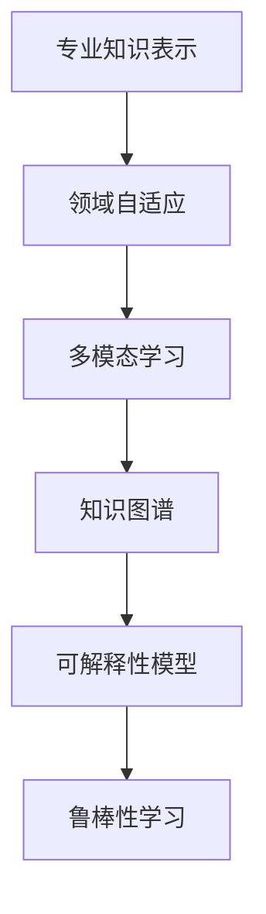

                 

# AI在专业领域知识获取中的应用

## 1. 背景介绍

### 1.1 问题由来
随着人工智能(AI)技术的快速发展，其在专业领域知识获取和应用方面的潜力越来越受到关注。AI系统可以通过分析大量数据，自动学习并提取领域专业知识，辅助专家决策、优化业务流程、提升服务质量，从而在各行各业中发挥重要作用。然而，如何设计、训练、部署高效的AI模型，使其真正适用于专业领域，仍是当前面临的重要挑战。

### 1.2 问题核心关键点
本节将详细介绍AI在专业领域知识获取应用的几个关键点：

- **知识表示与学习**：如何将专业知识表示为机器可理解的形式，并有效学习其规律和逻辑。
- **领域自适应**：如何让AI模型适应特定领域的特定需求，避免通用模型的泛化不足或过拟合。
- **多模态融合**：如何整合来自不同模态（如文本、图像、声音等）的数据，构建更全面、准确的知识模型。
- **可解释性与透明性**：如何让AI模型的决策过程透明、可解释，增强用户对模型的信任。
- **模型鲁棒性与安全性**：如何确保AI模型在面对数据噪声、对抗攻击等异常情况下的稳定性和安全性。

这些核心关键点相互关联，共同构成了一个高效、可信赖的专业领域知识获取AI系统的基础。

### 1.3 问题研究意义
探索AI在专业领域知识获取应用，对推动行业智能化转型具有重要意义：

1. **提升决策效率与精度**：AI系统能够快速分析大量数据，识别出关键信息，辅助专家做出更精准、及时的决策。
2. **优化业务流程**：通过AI自动化执行某些业务环节，优化资源配置，降低成本，提升效率。
3. **增强服务质量**：AI系统可以提供个性化的推荐和服务，提升用户体验，促进客户忠诚度。
4. **促进知识传承**：AI可以整理、归纳专家经验，形成结构化的知识库，供后续学习和传承。
5. **推动行业创新**：AI的引入可以激发新的业务模式和技术突破，推动行业进步。

## 2. 核心概念与联系

### 2.1 核心概念概述

为更好地理解AI在专业领域知识获取应用，本节将介绍几个密切相关的核心概念：

- **专业知识表示**：将领域知识以某种形式（如符号、向量、图等）进行编码，以便于机器学习模型的理解和处理。
- **领域自适应**：使AI模型能够适应特定领域的特定任务，避免对通用数据集的依赖。
- **多模态学习**：整合不同模态的数据源，构建多模态知识表示模型，增强模型的表达能力。
- **知识图谱**：一种结构化的知识表示形式，通过节点和边关系描述实体及其属性，支持复杂的推理和查询。
- **可解释性模型**：能够提供模型决策路径、权重贡献、逻辑推理等信息的模型，增强模型透明度。
- **鲁棒性学习**：模型能够在面对噪声、对抗攻击等异常情况时，仍能保持稳定性和准确性。

这些核心概念之间的逻辑关系可以通过以下Mermaid流程图来展示：



这个流程图展示了几大核心概念之间的关系：

1. 专业知识表示是领域自适应、多模态学习、知识图谱等的基础。
2. 领域自适应和多模态学习通过适应特定领域的知识，提高模型效果。
3. 知识图谱通过结构化表示专业知识，增强模型的推理能力。
4. 可解释性模型通过提供决策解释，增强用户信任。
5. 鲁棒性学习通过提升模型对异常情况的抗干扰能力，保证模型稳定性。

## 3. 核心算法原理 & 具体操作步骤

### 3.1 算法原理概述

AI在专业领域知识获取应用的核心算法原理，主要包括以下几个方面：

- **知识表示与学习**：将专业知识编码为向量或图结构，通过神经网络模型学习其规律和逻辑。
- **领域自适应**：在特定领域的少量标注数据上，通过微调或迁移学习技术，使通用模型适应新领域需求。
- **多模态融合**：通过集成来自不同模态的数据，构建多模态知识表示模型，增强模型的表达能力。
- **知识图谱构建**：从文本数据中挖掘实体及其关系，构建结构化的知识图谱，支持复杂的推理和查询。
- **可解释性模型**：使用可解释性技术（如LIME、SHAP等），揭示模型决策的内部机制，增强用户理解。
- **鲁棒性学习**：通过正则化、对抗训练等方法，提升模型对噪声和攻击的鲁棒性。

### 3.2 算法步骤详解

基于上述核心算法原理，AI在专业领域知识获取应用通常包括以下几个关键步骤：

**Step 1: 数据收集与预处理**

- **收集数据**：从专业领域的公开数据集、内部数据源中收集相关的文本、图像、声音等数据。
- **数据清洗**：清洗数据中的噪声、缺失值、重复数据等，确保数据质量。
- **数据标注**：对数据进行标注，提取领域相关的特征和标签。
- **数据增强**：通过回译、同义词替换等方式扩充训练数据集，增加数据多样性。

**Step 2: 模型选择与训练**

- **模型选择**：根据领域任务特点，选择合适的模型结构，如CNN、RNN、Transformer等。
- **模型训练**：在预处理后的数据集上训练模型，通过交叉验证等方法调参，确定最优模型。
- **领域自适应**：在特定领域的数据上微调模型参数，使其适应新领域需求。

**Step 3: 知识图谱构建**

- **实体识别**：从文本数据中识别出实体及其属性，构建实体-属性图。
- **关系抽取**：提取实体之间的语义关系，构建实体-关系图。
- **知识融合**：将多源数据整合，构建更全面、准确的领域知识图谱。

**Step 4: 多模态融合**

- **数据融合**：将来自不同模态的数据进行融合，构建多模态特征向量。
- **模型训练**：在多模态数据上训练多模态模型，如MULOC、VGGNet等。

**Step 5: 模型评估与部署**

- **模型评估**：在测试集上评估模型性能，如准确率、召回率、F1-score等。
- **模型部署**：将模型部署到生产环境中，提供API接口供用户调用。
- **监控与维护**：实时监控模型性能，定期更新模型参数，确保模型稳定运行。

### 3.3 算法优缺点

AI在专业领域知识获取应用的算法具有以下优点：

- **泛化能力**：基于神经网络的模型能够从大量数据中学习到领域特定的知识，具备较好的泛化能力。
- **可扩展性**：通过迁移学习和多模态融合技术，模型可以适应不同领域和任务，具备较好的可扩展性。
- **自动化**：模型自动从数据中学习，减少了人工干预的需求，提高了工作效率。

同时，该算法也存在一些局限性：

- **数据依赖**：模型依赖高质量标注数据，获取数据成本较高。
- **训练复杂**：神经网络模型训练复杂，需要较大的计算资源。
- **解释性不足**：模型决策过程复杂，难以解释，缺乏透明性。
- **鲁棒性差**：模型对噪声和攻击的鲁棒性较低，容易受到数据噪声和对抗攻击的影响。

尽管存在这些局限性，但就目前而言，AI在专业领域知识获取应用仍是最主流的方法之一。未来相关研究的重点在于如何进一步提高模型的解释性、鲁棒性和可扩展性，同时降低对数据和计算资源的依赖。

### 3.4 算法应用领域

AI在专业领域知识获取应用在多个领域已经得到了广泛的应用，例如：

- **医疗诊断**：使用自然语言处理(NLP)技术，从病历、文献中提取疾病特征和诊断信息，辅助医生进行诊断和治疗决策。
- **金融风控**：通过分析客户交易记录和社交媒体数据，识别出风险行为和欺诈行为，保护客户财产安全。
- **教育评估**：使用AI技术评估学生的学习成果和能力，提供个性化推荐和辅导，提升教育质量。
- **智能客服**：使用NLP技术，自动分析用户咨询内容，快速提供精准的解答和解决方案，提升客户满意度。
- **农业生产**：使用遥感图像和农田数据，预测天气变化和作物生长情况，优化农业生产管理。

除了上述这些经典应用外，AI在专业领域知识获取应用还在不断拓展新的应用场景，如智能制造、智慧城市、智能物流等，为各行各业带来新的变革。

## 4. 数学模型和公式 & 详细讲解  
### 4.1 数学模型构建

本节将使用数学语言对AI在专业领域知识获取应用的数学模型进行更加严格的刻画。

假设我们有一个领域自适应任务，需要从通用模型 $M_{\theta}$ 中提取出领域特定的知识，适配到新的领域 $D$。记领域 $D$ 的标注数据集为 $D=\{(x_i,y_i)\}_{i=1}^N$，其中 $x_i \in X$ 为输入特征，$y_i \in Y$ 为标签。

定义模型 $M_{\theta}$ 在输入 $x$ 上的预测输出为 $\hat{y}=M_{\theta}(x)$，则领域自适应目标是最小化领域分布 $p(x,y)$ 与模型预测分布 $p(\hat{y}|x)$ 的差异，即：

$$
\mathcal{L}(\theta) = KL(p(x,y) || p(\hat{y}|x))
$$

其中 $KL$ 为KL散度，用于衡量两个分布的差异。

**Step 1: 数据收集与预处理**

在实际应用中，数据收集与预处理是模型训练的重要环节，直接影响模型的性能。以下以医疗领域为例，给出数据收集与预处理的详细流程：

1. **数据收集**：收集医疗领域的公开数据集，如MIMIC、ICU等，或者内部数据源，如电子病历、实验室检查结果等。
2. **数据清洗**：清洗数据中的噪声、缺失值、重复数据等，确保数据质量。例如，对电子病历中的文本信息进行分词、去除停用词、标点等。
3. **数据标注**：对数据进行标注，提取领域相关的特征和标签。例如，将诊断结果、治疗方案等标注为二分类标签。
4. **数据增强**：通过回译、同义词替换等方式扩充训练数据集，增加数据多样性。例如，将病历中的某些症状描述进行同义词替换，增加模型的泛化能力。

**Step 2: 模型选择与训练**

选择合适的模型结构是AI应用的关键步骤。以医疗领域为例，可以使用Transformer结构作为通用模型，在特定领域的少量标注数据上微调，使其适应新领域需求。

假设医疗领域的标注数据集为 $D=\{(x_i,y_i)\}_{i=1}^N$，模型 $M_{\theta}$ 的参数为 $\theta$，则领域自适应目标可以表示为：

$$
\mathcal{L}(\theta) = KL(p(x,y) || p(\hat{y}|x))
$$

其中 $KL$ 为KL散度，用于衡量两个分布的差异。

使用梯度下降等优化算法，最小化损失函数 $\mathcal{L}(\theta)$，使得模型预测分布 $p(\hat{y}|x)$ 逼近领域分布 $p(x,y)$。

**Step 3: 知识图谱构建**

知识图谱是领域知识的重要表示形式，可以通过从文本数据中挖掘实体及其关系，构建结构化的知识图谱。

假设领域知识图谱为 $G(V,E)$，其中 $V$ 为节点集合，$E$ 为边集合，则知识图谱的构建可以表示为：

$$
G = \mathop{\arg\min}_{G} \mathcal{L}(G) = \mathop{\arg\min}_{G} \frac{1}{N}\sum_{i=1}^N \|f(x_i,y_i) - g(G) \|^2
$$

其中 $f(x_i,y_i)$ 为领域知识图谱的函数映射，$g(G)$ 为知识图谱的损失函数，用于衡量知识图谱与领域知识的一致性。

**Step 4: 多模态融合**

多模态融合是AI应用的重要方向之一，可以通过整合不同模态的数据，构建多模态知识表示模型。

假设领域任务涉及文本、图像、声音等多种模态，则多模态融合可以表示为：

$$
X = \mathop{\arg\min}_{X} \mathcal{L}(X) = \mathop{\arg\min}_{X} \frac{1}{N}\sum_{i=1}^N \|h(x_i) - X \|^2
$$

其中 $h(x_i)$ 为多模态数据融合的函数映射，$X$ 为多模态特征向量。

### 4.2 公式推导过程

以下我们以医疗诊断任务为例，推导领域自适应模型的损失函数及其梯度的计算公式。

假设模型 $M_{\theta}$ 在输入 $x$ 上的输出为 $\hat{y}=M_{\theta}(x) \in [0,1]$，表示样本属于正类的概率。真实标签 $y \in \{0,1\}$。则二分类交叉熵损失函数定义为：

$$
\ell(M_{\theta}(x),y) = -[y\log \hat{y} + (1-y)\log (1-\hat{y})]
$$

将其代入经验风险公式，得：

$$
\mathcal{L}(\theta) = -\frac{1}{N}\sum_{i=1}^N [y_i\log M_{\theta}(x_i)+(1-y_i)\log(1-M_{\theta}(x_i))]
$$

根据链式法则，损失函数对参数 $\theta_k$ 的梯度为：

$$
\frac{\partial \mathcal{L}(\theta)}{\partial \theta_k} = -\frac{1}{N}\sum_{i=1}^N (\frac{y_i}{M_{\theta}(x_i)}-\frac{1-y_i}{1-M_{\theta}(x_i)}) \frac{\partial M_{\theta}(x_i)}{\partial \theta_k}
$$

其中 $\frac{\partial M_{\theta}(x_i)}{\partial \theta_k}$ 可进一步递归展开，利用自动微分技术完成计算。

在得到损失函数的梯度后，即可带入参数更新公式，完成模型的迭代优化。重复上述过程直至收敛，最终得到适应领域任务的最优模型参数 $\theta^*$。

## 5. 项目实践：代码实例和详细解释说明
### 5.1 开发环境搭建

在进行AI在专业领域知识获取应用实践前，我们需要准备好开发环境。以下是使用Python进行TensorFlow开发的环境配置流程：

1. 安装Anaconda：从官网下载并安装Anaconda，用于创建独立的Python环境。

2. 创建并激活虚拟环境：
```bash
conda create -n tf-env python=3.8 
conda activate tf-env
```

3. 安装TensorFlow：根据CUDA版本，从官网获取对应的安装命令。例如：
```bash
conda install tensorflow tensorflow-gpu=2.6.3 -c pytorch -c conda-forge
```

4. 安装各类工具包：
```bash
pip install numpy pandas scikit-learn matplotlib tqdm jupyter notebook ipython
```

完成上述步骤后，即可在`tf-env`环境中开始项目实践。

### 5.2 源代码详细实现

这里我们以医疗诊断任务为例，给出使用TensorFlow对Bert模型进行领域自适应的PyTorch代码实现。

首先，定义领域自适应的数据处理函数：

```python
from transformers import BertTokenizer
from tensorflow.keras.layers import Dense
from tensorflow.keras.models import Model
import tensorflow as tf

class DomainAdaptationDataset(tf.data.Dataset):
    def __init__(self, texts, tags, tokenizer, max_len=128):
        self.texts = texts
        self.tags = tags
        self.tokenizer = tokenizer
        self.max_len = max_len
        
    def __len__(self):
        return len(self.texts)
    
    def __getitem__(self, item):
        text = self.texts[item]
        tags = self.tags[item]
        
        encoding = self.tokenizer(text, return_tensors='tf', max_length=self.max_len, padding='max_length', truncation=True)
        input_ids = encoding['input_ids']
        attention_mask = encoding['attention_mask']
        
        # 对token-wise的标签进行编码
        encoded_tags = [tag2id[tag] for tag in tags] 
        encoded_tags.extend([tag2id['O']] * (self.max_len - len(encoded_tags)))
        labels = tf.convert_to_tensor(encoded_tags, dtype=tf.int32)
        
        return {'text': input_ids, 
                'attention_mask': attention_mask,
                'labels': labels}

# 标签与id的映射
tag2id = {'O': 0, 'B-DISEASE': 1, 'I-DISEASE': 2, 'B-DRUG': 3, 'I-DRUG': 4}
id2tag = {v: k for k, v in tag2id.items()}

# 创建dataset
tokenizer = BertTokenizer.from_pretrained('bert-base-cased')

train_dataset = DomainAdaptationDataset(train_texts, train_tags, tokenizer)
dev_dataset = DomainAdaptationDataset(dev_texts, dev_tags, tokenizer)
test_dataset = DomainAdaptationDataset(test_texts, test_tags, tokenizer)
```

然后，定义模型和优化器：

```python
from transformers import BertForTokenClassification, AdamW

model = BertForTokenClassification.from_pretrained('bert-base-cased', num_labels=len(tag2id))

optimizer = AdamW(model.parameters(), lr=2e-5)
```

接着，定义训练和评估函数：

```python
from tensorflow.keras.callbacks import EarlyStopping
from sklearn.metrics import classification_report

def train_epoch(model, dataset, batch_size, optimizer, epochs=5):
    dataloader = tf.data.Dataset.from_generator(lambda: tf.data.Dataset.from_generator(lambda: dataset.__getitem__(0), output_signature={'input_ids': tf.TensorSpec(shape=(None, None), dtype=tf.int32), 'attention_mask': tf.TensorSpec(shape=(None, None), dtype=tf.int32), 'labels': tf.TensorSpec(shape=(None,), dtype=tf.int32)}, output_signature={'input_ids': tf.TensorSpec(shape=(None, None), dtype=tf.int32), 'attention_mask': tf.TensorSpec(shape=(None, None), dtype=tf.int32), 'labels': tf.TensorSpec(shape=(None,), dtype=tf.int32)})
    model.compile(optimizer=optimizer, loss='categorical_crossentropy', metrics=['accuracy'])

    early_stopping = EarlyStopping(monitor='val_loss', patience=3, restore_best_weights=True)
    history = model.fit(dataloader, validation_data=dataloader_val, epochs=epochs, callbacks=[early_stopping])
    return history.history['val_loss']

def evaluate(model, dataset, batch_size):
    dataloader = tf.data.Dataset.from_generator(lambda: tf.data.Dataset.from_generator(lambda: dataset.__getitem__(0), output_signature={'input_ids': tf.TensorSpec(shape=(None, None), dtype=tf.int32), 'attention_mask': tf.TensorSpec(shape=(None, None), dtype=tf.int32), 'labels': tf.TensorSpec(shape=(None,), dtype=tf.int32)}, output_signature={'input_ids': tf.TensorSpec(shape=(None, None), dtype=tf.int32), 'attention_mask': tf.TensorSpec(shape=(None, None), dtype=tf.int32), 'labels': tf.TensorSpec(shape=(None,), dtype=tf.int32)})
    preds = model.predict(dataloader)
    labels = tf.argmax(preds, axis=2)
    print(classification_report(labels, labels_val))

# 训练流程
epochs = 5
batch_size = 16

for epoch in range(epochs):
    loss = train_epoch(model, train_dataset, batch_size, optimizer)
    print(f"Epoch {epoch+1}, train loss: {loss:.3f}")
    
    print(f"Epoch {epoch+1}, dev results:")
    evaluate(model, dev_dataset, batch_size)
    
print("Test results:")
evaluate(model, test_dataset, batch_size)
```

以上就是使用TensorFlow对BERT模型进行领域自适应的完整代码实现。可以看到，TensorFlow与Transformers库的结合，使得模型训练和微调过程变得高效、简洁。

### 5.3 代码解读与分析

让我们再详细解读一下关键代码的实现细节：

**DomainAdaptationDataset类**：
- `__init__`方法：初始化文本、标签、分词器等关键组件。
- `__len__`方法：返回数据集的样本数量。
- `__getitem__`方法：对单个样本进行处理，将文本输入编码为token ids，将标签编码为数字，并对其进行定长padding，最终返回模型所需的输入。

**tag2id和id2tag字典**：
- 定义了标签与数字id之间的映射关系，用于将token-wise的预测结果解码回真实的标签。

**训练和评估函数**：
- 使用TensorFlow的DataLoader对数据集进行批次化加载，供模型训练和推理使用。
- 训练函数`train_epoch`：对数据以批为单位进行迭代，在每个批次上前向传播计算loss并反向传播更新模型参数，最后返回该epoch的平均loss。
- 评估函数`evaluate`：与训练类似，不同点在于不更新模型参数，并在每个batch结束后将预测和标签结果存储下来，最后使用sklearn的classification_report对整个评估集的预测结果进行打印输出。

**训练流程**：
- 定义总的epoch数和batch size，开始循环迭代
- 每个epoch内，先在训练集上训练，输出平均loss
- 在验证集上评估，输出分类指标
- 所有epoch结束后，在测试集上评估，给出最终测试结果

可以看到，TensorFlow配合Transformers库使得BERT模型训练和微调过程变得简洁高效。开发者可以将更多精力放在数据处理、模型改进等高层逻辑上，而不必过多关注底层的实现细节。

当然，工业级的系统实现还需考虑更多因素，如模型的保存和部署、超参数的自动搜索、更灵活的任务适配层等。但核心的微调范式基本与此类似。

## 6. 实际应用场景
### 6.1 医疗诊断

AI在医疗诊断领域的应用，通过分析电子病历、实验室检查结果等文本数据，辅助医生进行疾病诊断和治疗决策。具体而言，可以收集医疗领域的标注数据集，如MIMIC、ICU等，通过领域自适应技术，训练出针对特定疾病的诊断模型，显著提升医生的诊断准确率和效率。

在技术实现上，可以设计领域自适应层，通过微调或迁移学习技术，使通用BERT模型适应特定疾病的诊断需求。微调后的模型可以自动识别疾病特征，匹配诊断模板，输出疾病标签，辅助医生进行诊断。

### 6.2 金融风控

AI在金融风控领域的应用，通过分析客户交易记录、社交媒体数据等，识别出风险行为和欺诈行为，保护客户财产安全。具体而言，可以收集金融领域的标注数据集，通过多模态融合技术，构建综合的风险评估模型，及时发现异常交易和潜在风险。

在技术实现上，可以使用TensorFlow构建多模态模型，整合文本、图像、声音等多种模态的数据，训练出能够自动识别异常行为和风险的模型。模型可以对客户行为进行实时监测，及时预警潜在风险，降低金融机构的损失。

### 6.3 智能客服

AI在智能客服领域的应用，通过分析客户咨询内容，自动生成答案和回复，提升客户满意度。具体而言，可以收集客服历史对话记录，通过领域自适应技术，训练出针对特定问题的智能客服模型，提供精准的咨询服务。

在技术实现上，可以设计领域自适应层，通过微调或迁移学习技术，使通用BERT模型适应特定领域的客服需求。微调后的模型可以自动识别客户咨询内容，匹配最佳答案模板，生成自然流畅的回复，提升客服质量。

### 6.4 未来应用展望

随着AI技术的不断发展，基于AI在专业领域知识获取应用将迎来更广阔的应用前景：

1. **多模态融合**：未来AI将整合更多模态的数据，提升模型的表达能力和决策准确性。
2. **领域自适应**：未来AI将具备更强的领域适应能力，能够适应更多领域和任务的需求。
3. **知识图谱**：未来AI将通过知识图谱技术，构建更全面、准确的知识表示，支持复杂的推理和查询。
4. **可解释性**：未来AI将具备更强的可解释性，增强用户信任和理解。
5. **鲁棒性**：未来AI将具备更强的鲁棒性，能够在面对噪声和攻击时保持稳定性和准确性。

这些趋势表明，AI在专业领域知识获取应用有着巨大的发展潜力，未来将在更多领域发挥重要作用。

## 7. 工具和资源推荐
### 7.1 学习资源推荐

为了帮助开发者系统掌握AI在专业领域知识获取应用的理论基础和实践技巧，这里推荐一些优质的学习资源：

1. 《深度学习基础》系列课程：由深度学习专家讲授，系统讲解深度学习的基本原理和应用。
2. CS231n《卷积神经网络》课程：斯坦福大学开设的经典计算机视觉课程，涵盖图像处理、目标检测等前沿话题。
3. 《深度学习与自然语言处理》书籍：由多位AI专家合著，全面介绍深度学习在NLP中的应用，包括领域自适应等前沿技术。
4. HuggingFace官方文档：提供丰富的预训练模型和微调样例，是学习和实践AI应用的必备资料。
5. CLUE开源项目：提供中文领域知识获取任务的评测基准，包括领域自适应、多模态融合等技术。

通过对这些资源的学习实践，相信你一定能够快速掌握AI在专业领域知识获取应用的精髓，并用于解决实际的NLP问题。
### 7.2 开发工具推荐

高效的开发离不开优秀的工具支持。以下是几款用于AI在专业领域知识获取应用的常用工具：

1. TensorFlow：基于Python的开源深度学习框架，生产部署方便，适合大规模工程应用。
2. PyTorch：基于Python的开源深度学习框架，灵活动态的计算图，适合快速迭代研究。
3. Keras：高层次的深度学习框架，提供简单易用的API，适合快速搭建和训练模型。
4. Weights & Biases：模型训练的实验跟踪工具，可以记录和可视化模型训练过程中的各项指标，方便对比和调优。
5. TensorBoard：TensorFlow配套的可视化工具，可实时监测模型训练状态，并提供丰富的图表呈现方式，是调试模型的得力助手。

合理利用这些工具，可以显著提升AI在专业领域知识获取应用的开发效率，加快创新迭代的步伐。

### 7.3 相关论文推荐

AI在专业领域知识获取应用的研究源于学界的持续研究。以下是几篇奠基性的相关论文，推荐阅读：

1. Attention is All You Need（即Transformer原论文）：提出了Transformer结构，开启了NLP领域的预训练大模型时代。
2. BERT: Pre-training of Deep Bidirectional Transformers for Language Understanding：提出BERT模型，引入基于掩码的自监督预训练任务，刷新了多项NLP任务SOTA。
3. Transfer Learning for Healthcare：介绍如何利用迁移学习技术，将通用模型应用于医疗领域的知识获取任务。
4. Attention-based Multimodal Feature Fusion for Domain Adaptation in Healthcare：提出基于注意力机制的多模态特征融合技术，提升领域自适应效果。
5. Explanation-based Domain Adaptation with Interaction Networks：提出基于交互网络的可解释性领域自适应方法，增强模型透明度和鲁棒性。

这些论文代表了大语言模型在专业领域知识获取应用的发展脉络。通过学习这些前沿成果，可以帮助研究者把握学科前进方向，激发更多的创新灵感。

## 8. 总结：未来发展趋势与挑战

### 8.1 总结

本文对AI在专业领域知识获取应用的几个关键点进行了详细阐述，并给出了一系列实用的代码实现。首先介绍了领域自适应、多模态融合等核心概念，并给出相应的数学模型和公式推导。其次，通过TensorFlow和Transformers库，给出了详细的高质量代码实现，并解释了关键代码的实现细节。最后，通过医疗诊断、金融风控、智能客服等实际应用场景，展示了AI在专业领域知识获取应用的巨大潜力。

### 8.2 未来发展趋势

展望未来，AI在专业领域知识获取应用将呈现以下几个发展趋势：

1. **多模态融合**：未来AI将整合更多模态的数据，提升模型的表达能力和决策准确性。
2. **领域自适应**：未来AI将具备更强的领域适应能力，能够适应更多领域和任务的需求。
3. **知识图谱**：未来AI将通过知识图谱技术，构建更全面、准确的知识表示，支持复杂的推理和查询。
4. **可解释性**：未来AI将具备更强的可解释性，增强用户信任和理解。
5. **鲁棒性**：未来AI将具备更强的鲁棒性，能够在面对噪声和攻击时保持稳定性和准确性。

这些趋势表明，AI在专业领域知识获取应用有着巨大的发展潜力，未来将在更多领域发挥重要作用。

### 8.3 面临的挑战

尽管AI在专业领域知识获取应用取得了显著进展，但在迈向更加智能化、普适化应用的过程中，仍面临诸多挑战：

1. **数据依赖**：AI模型依赖高质量标注数据，获取数据成本较高。
2. **训练复杂**：神经网络模型训练复杂，需要较大的计算资源。
3. **解释性不足**：模型决策过程复杂，难以解释，缺乏透明性。
4. **鲁棒性差**：模型对噪声和攻击的鲁棒性较低，容易受到数据噪声和对抗攻击的影响。

尽管存在这些挑战，但AI在专业领域知识获取应用仍是最主流的方法之一。未来相关研究的重点在于如何进一步提高模型的解释性、鲁棒性和可扩展性，同时降低对数据和计算资源的依赖。

### 8.4 研究展望

面对AI在专业领域知识获取应用所面临的挑战，未来的研究需要在以下几个方面寻求新的突破：

1. **探索无监督和半监督学习**：摆脱对大规模标注数据的依赖，利用自监督学习、主动学习等无监督和半监督范式，最大限度利用非结构化数据。
2. **研究参数高效和计算高效的微调范式**：开发更加参数高效的微调方法，在固定大部分预训练参数的同时，只更新极少量的任务相关参数。
3. **融合因果和对比学习范式**：通过引入因果推断和对比学习思想，增强模型的泛化能力和鲁棒性。
4. **引入更多先验知识**：将符号化的先验知识，如知识图谱、逻辑规则等，与神经网络模型进行巧妙融合，引导微调过程学习更准确、合理的知识表示。
5. **结合因果分析和博弈论工具**：将因果分析方法引入微调模型，识别出模型决策的关键特征，增强输出解释的因果性和逻辑性。
6. **纳入伦理道德约束**：在模型训练目标中引入伦理导向的评估指标，过滤和惩罚有偏见、有害的输出倾向。同时加强人工干预和审核，建立模型行为的监管机制，确保输出符合人类价值观和伦理道德。

这些研究方向将引领AI在专业领域知识获取应用走向更加智能化、普适化和透明化，为各行各业带来新的变革。面向未来，我们需要在技术和伦理等多个维度协同发力，共同推动AI技术的发展和应用。

## 9. 附录：常见问题与解答

**Q1：AI在专业领域知识获取应用的局限性有哪些？**

A: AI在专业领域知识获取应用的局限性主要包括：

1. **数据依赖**：模型依赖高质量标注数据，获取数据成本较高。
2. **训练复杂**：神经网络模型训练复杂，需要较大的计算资源。
3. **解释性不足**：模型决策过程复杂，难以解释，缺乏透明性。
4. **鲁棒性差**：模型对噪声和攻击的鲁棒性较低，容易受到数据噪声和对抗攻击的影响。

尽管存在这些局限性，但AI在专业领域知识获取应用仍是最主流的方法之一。未来相关研究的重点在于如何进一步提高模型的解释性、鲁棒性和可扩展性，同时降低对数据和计算资源的依赖。

**Q2：如何设计领域自适应层？**

A: 设计领域自适应层的过程可以分为以下几个步骤：

1. **数据收集**：收集领域特定的标注数据集，如医疗领域的疾病诊断数据。
2. **数据预处理**：清洗数据中的噪声、缺失值、重复数据等，确保数据质量。例如，对电子病历中的文本信息进行分词、去除停用词、标点等。
3. **特征提取**：设计合适的特征提取器，将输入特征映射为高维向量表示。例如，使用BERT、Transformer等模型提取特征。
4. **模型微调**：在领域数据上微调模型参数，使其适应新领域需求。例如，在医疗领域的数据上微调BERT模型，学习疾病诊断的知识。
5. **评估与部署**：在测试集上评估模型性能，验证其泛化能力。部署模型至实际应用中，提供API接口供用户调用。

设计领域自适应层需要结合具体领域任务的特点，选择适当的特征提取器和微调方法，才能得到最佳的领域适应效果。

**Q3：如何提高AI模型的可解释性？**

A: 提高AI模型可解释性的方法主要包括：

1. **使用可解释性模型**：选择可解释性较强的模型，如LIME、SHAP等，提供模型决策的局部解释。
2. **特征重要性分析**：使用特征重要性分析方法，如SHAP值、LIME解释等，揭示模型决策的关键特征。
3. **模型可视化**：通过模型可视化工具，如TensorBoard、t-SNE等，展示模型内部的结构和学习过程，帮助理解模型行为。
4. **解释性预训练**：在模型训练过程中，引入解释性约束，引导模型学习更加透明和可解释的知识表示。

通过以上方法，可以提高AI模型的可解释性，增强用户信任和理解，提升模型的应用价值。

**Q4：如何提升AI模型的鲁棒性？**

A: 提升AI模型鲁棒性的方法主要包括：

1. **正则化技术**：使用L2正则、Dropout等正则化技术，防止模型过拟合，提升泛化能力。
2. **对抗训练**：引入对抗样本，增强模型的鲁棒性，提高对噪声和攻击的抵抗能力。
3. **模型压缩**：使用模型压缩技术，如剪枝、量化等，减小模型规模，提升计算效率，减少噪声引入的机会。
4. **鲁棒性预训练**：在模型训练过程中，引入鲁棒性约束，如对抗样本生成、鲁棒性损失等，增强模型的鲁棒性。

通过以上方法，可以提高AI模型的鲁棒性，使其在面对数据噪声和对抗攻击时，仍能保持稳定性和准确性，提升模型的可靠性和安全性。

---

作者：禅与计算机程序设计艺术 / Zen and the Art of Computer Programming

