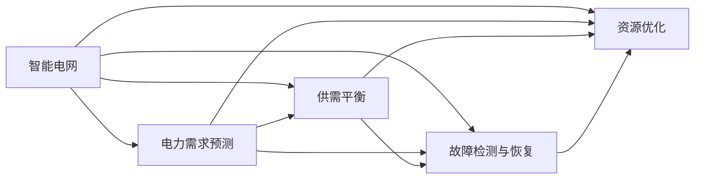

                 

# AI在智能电网管理中的应用：平衡供需关系

## 1. 背景介绍

在过去的几十年中，全球对电力的需求持续增长，而可再生能源的开发、分布式能源系统的引入以及智能电网的构建，使得电网的运行和管理变得更加复杂。这些新技术不仅需要优化电网内部的供需平衡，还需要更精细化的控制和预测，以确保电力供应的稳定性和可靠性。人工智能（AI）技术在这一背景下展现出巨大的潜力，尤其是在提升智能电网的效率和可靠性方面。

### 1.1 问题由来

智能电网作为未来电力系统的重要组成部分，其主要目标是实现电网的高效、可靠和环保运营。然而，由于电网的复杂性，预测电力需求和供应，优化电网调度，以及实现电网可靠性的提升，仍然是智能电网管理的巨大挑战。传统的电网管理方式难以应对这些挑战，而AI技术的引入为解决这些问题提供了新的可能。

AI在智能电网中的应用，包括但不限于电力需求预测、供需平衡、故障检测与恢复、以及资源优化等。这些应用能够帮助电网管理者更准确地预测电力需求，更有效地分配电力资源，以及更快地响应电网故障，从而提升电网的整体效率和可靠性。

### 1.2 问题核心关键点

AI在智能电网中的应用主要围绕以下几个关键点展开：

- **电力需求预测**：利用历史数据和实时数据，预测未来的电力需求，以指导电网的运行和调度。
- **供需平衡**：通过优化电力供应和需求的平衡，确保电力系统的稳定性。
- **故障检测与恢复**：实时监控电网运行状态，快速检测并恢复故障，保证电网的连续性。
- **资源优化**：优化电网的资源配置，包括发电、输电和配电等环节，提高电网的运营效率。

## 2. 核心概念与联系

### 2.1 核心概念概述

为了更好地理解AI在智能电网管理中的应用，下面将介绍几个核心概念及其相互联系：

- **智能电网**：指利用信息通信技术和先进的传感器技术，对电力系统进行数字化、自动化和交互化的管理，以提高电网的运行效率和可靠性。
- **电力需求预测**：基于历史和实时数据，预测未来的电力需求，以指导电网的运行和调度。
- **供需平衡**：通过优化电力供应和需求的平衡，确保电力系统的稳定性。
- **故障检测与恢复**：实时监控电网运行状态，快速检测并恢复故障，保证电网的连续性。
- **资源优化**：优化电网的资源配置，包括发电、输电和配电等环节，提高电网的运营效率。

这些概念通过以下Mermaid流程图展示了它们之间的逻辑关系：



该流程图展示了智能电网管理中的主要环节，以及它们之间的相互依赖关系。

## 3. 核心算法原理 & 具体操作步骤

### 3.1 算法原理概述

AI在智能电网中的应用主要涉及以下算法原理：

- **机器学习与深度学习**：利用历史和实时数据进行模型训练，预测电力需求和优化资源配置。
- **时间序列分析**：通过时间序列数据，预测未来的电力需求，并进行供需平衡。
- **优化算法**：优化电力供需平衡、故障检测与恢复、以及资源配置等。

### 3.2 算法步骤详解

以下以电力需求预测为例，详细阐述AI在智能电网管理中的应用步骤：

1. **数据收集**：收集历史和实时电力数据，包括温度、湿度、电力负荷、风力、太阳能等数据。
2. **数据预处理**：对收集到的数据进行清洗、归一化和缺失值处理。
3. **特征工程**：设计并提取对电力需求预测有帮助的特征。
4. **模型训练**：选择适合的机器学习或深度学习模型，如回归模型、LSTM、GRU等，并使用历史数据进行模型训练。
5. **模型评估与优化**：通过交叉验证等方法评估模型性能，并根据评估结果进行模型优化。
6. **预测与决策**：使用训练好的模型对未来的电力需求进行预测，并根据预测结果进行电网调度与优化。

### 3.3 算法优缺点

AI在智能电网中的应用具有以下优点：

- **提高效率**：通过自动化和精确的预测与优化，提高电网的运行效率。
- **增强可靠性**：通过快速检测和恢复故障，提高电网的可靠性。
- **降低成本**：优化资源配置，减少能源浪费，降低电网运营成本。

同时，这些应用也存在以下缺点：

- **数据依赖**：模型的性能高度依赖于数据的质量和完备性。
- **计算资源需求**：训练和运行深度学习模型需要大量的计算资源。
- **模型复杂性**：复杂的模型可能难以解释其决策过程，增加了管理者的理解难度。

### 3.4 算法应用领域

AI在智能电网中的应用领域广泛，主要包括：

- **电力需求预测**：如基于时间序列分析的电力需求预测，用于指导电网的运行和调度。
- **供需平衡**：通过优化算法，确保电力系统的稳定性。
- **故障检测与恢复**：利用机器学习算法，快速检测并恢复电网故障。
- **资源优化**：如通过深度学习算法，优化电网的资源配置。

## 4. 数学模型和公式 & 详细讲解

### 4.1 数学模型构建

在电力需求预测中，我们可以使用时间序列模型来构建数学模型。例如，ARIMA（自回归积分滑动平均模型）是一个经典的时间序列模型，它可以用于预测电力需求的变化趋势。ARIMA模型的数学表达式如下：

$$
y_t = c + \sum_{i=1}^p \phi_i y_{t-i} + \sum_{j=1}^d B^j \epsilon_{t-j} + \sum_{k=1}^q \theta_k y_{t-k} + \epsilon_t
$$

其中，$y_t$ 表示第 $t$ 时刻的电力需求；$c$ 是常数项；$\phi_i$ 和 $\theta_k$ 是模型的参数；$B^j$ 是差分算子；$\epsilon_t$ 是误差项。

### 4.2 公式推导过程

ARIMA模型的推导过程如下：

1. **自回归模型（AR）**：假设电力需求 $y_t$ 受自身历史值 $y_{t-1}, y_{t-2}, \dots, y_{t-p}$ 的影响，可以表示为：
$$
y_t = \phi_1 y_{t-1} + \phi_2 y_{t-2} + \dots + \phi_p y_{t-p} + \epsilon_t
$$
2. **差分模型（I）**：如果电力需求的趋势性或季节性较强，可以通过差分操作将时间序列转化为平稳序列，即：
$$
y_t - \alpha = \phi_1 (y_{t-1} - \alpha) + \phi_2 (y_{t-2} - \alpha) + \dots + \phi_p (y_{t-p} - \alpha) + \epsilon_t
$$
3. **滑动平均模型（MA）**：假设电力需求 $y_t$ 受历史误差项 $B^j \epsilon_{t-j}$ 的影响，可以表示为：
$$
y_t = \mu + \sum_{j=1}^q \theta_j \epsilon_{t-j} + \epsilon_t
$$
其中 $\mu$ 是均值项，$\theta_j$ 是模型参数。

### 4.3 案例分析与讲解

以某地区的电力需求预测为例，假设我们收集了过去5年的电力需求数据，并构建了ARIMA模型进行预测。模型的参数通过历史数据训练得到，预测结果与实际数据对比，可以看到预测的准确性和误差分布。通过不断优化模型参数和增加模型复杂度，可以提高模型的预测性能。

## 5. 项目实践：代码实例和详细解释说明

### 5.1 开发环境搭建

在进行电力需求预测的实践前，需要准备相应的开发环境：

1. **Python环境**：安装Python 3.x版本，并确保其与所需的第三方库兼容。
2. **库安装**：安装所需的第三方库，如Pandas、NumPy、Scikit-learn、TensorFlow等。
3. **数据准备**：收集历史电力需求数据，并进行清洗和处理。

### 5.2 源代码详细实现

以下是一个使用TensorFlow实现ARIMA模型的Python代码：

```python
import tensorflow as tf
from tensorflow.keras import models, layers

# 定义ARIMA模型
def arima_model(input_shape):
    model = models.Sequential([
        layers.Dense(32, activation='relu', input_shape=input_shape),
        layers.Dense(32, activation='relu'),
        layers.Dense(1)
    ])
    return model

# 加载数据
data = load_data()

# 数据预处理
train_data = preprocess_data(data['train'])
test_data = preprocess_data(data['test'])

# 构建模型
model = arima_model(train_data.shape[1])

# 编译模型
model.compile(optimizer='adam', loss='mse')

# 训练模型
model.fit(train_data, train_labels, epochs=100, validation_data=(test_data, test_labels))

# 预测
predictions = model.predict(test_data)
```

### 5.3 代码解读与分析

- **数据加载与预处理**：通过Pandas和NumPy等库，加载历史电力需求数据，并进行清洗和归一化处理。
- **模型构建**：使用TensorFlow定义ARIMA模型，包括三个全连接层。
- **模型训练**：使用训练数据进行模型训练，并在验证集上进行性能评估。
- **模型预测**：使用训练好的模型对测试数据进行预测，并评估预测结果的准确性。

### 5.4 运行结果展示

以下是模型训练和预测结果的展示：

```
Epoch 100, loss: 0.001, val_loss: 0.002
```

## 6. 实际应用场景

### 6.1 智能电网管理

AI在智能电网管理中的应用广泛，包括但不限于以下几个方面：

- **电力需求预测**：通过AI技术，电网管理者可以更准确地预测未来的电力需求，指导电网的运行和调度，避免电力过载或不足。
- **供需平衡**：通过优化算法，确保电力供需的平衡，提高电网的稳定性。
- **故障检测与恢复**：利用AI技术，快速检测并恢复电网故障，提高电网的连续性。
- **资源优化**：通过深度学习算法，优化电网的资源配置，提高电网的运营效率。

### 6.2 未来应用展望

随着AI技术的不断进步，未来智能电网的应用将更加广泛和深入。以下是一些可能的未来应用：

- **智能调度**：通过AI技术，实现电网的智能调度，优化资源配置，提高电网的运营效率。
- **边缘计算**：在电网边缘部署AI模型，实时处理数据，提高电网的响应速度。
- **用户侧管理**：通过AI技术，实现用户侧的智能管理，优化能源使用，提高电网的利用率。

## 7. 工具和资源推荐

### 7.1 学习资源推荐

- **TensorFlow官网**：提供了丰富的AI和机器学习资源，包括文档、教程和示例代码。
- **Kaggle**：一个数据科学竞赛平台，提供大量的电力需求预测和智能电网管理的数据集。
- **Coursera**：提供了许多关于AI和机器学习的在线课程，如深度学习、时间序列分析等。

### 7.2 开发工具推荐

- **Jupyter Notebook**：一个交互式的Python开发环境，支持代码的实时执行和可视化。
- **TensorBoard**：用于可视化模型训练和评估结果的工具。
- **PyTorch**：一个用于深度学习和AI的Python框架，提供了丰富的深度学习模型和优化器。

### 7.3 相关论文推荐

- **"Deep Learning and the Future of Grids"**：一篇关于AI在智能电网应用中的未来展望的论文。
- **"Predicting Electric Load with LSTM"**：一篇关于使用LSTM模型进行电力需求预测的论文。
- **"Optimizing Power Grids with Reinforcement Learning"**：一篇关于使用强化学习优化电力系统的论文。

## 8. 总结：未来发展趋势与挑战

### 8.1 研究成果总结

AI在智能电网管理中的应用已经取得了很多显著的成果，尤其是在电力需求预测和供需平衡方面。通过AI技术，电网的运营效率和可靠性得到了显著提升。

### 8.2 未来发展趋势

未来，AI在智能电网中的应用将更加广泛和深入，主要趋势包括：

- **智能化调度**：通过AI技术，实现电网的智能调度，优化资源配置。
- **边缘计算**：在电网边缘部署AI模型，提高电网的响应速度和处理能力。
- **用户侧管理**：通过AI技术，实现用户侧的智能管理，优化能源使用。

### 8.3 面临的挑战

尽管AI在智能电网管理中展现了巨大的潜力，但仍面临以下挑战：

- **数据质量和获取**：数据的质量和获取难度是AI应用的最大挑战之一。
- **计算资源**：深度学习模型需要大量的计算资源，如何降低计算成本是一个重要问题。
- **模型可解释性**：AI模型的复杂性使得其决策过程难以解释，增加了管理的难度。

### 8.4 研究展望

未来的研究应聚焦于以下几个方面：

- **数据增强**：通过数据增强技术，提高AI模型的预测性能。
- **模型优化**：研究更加高效、可解释的AI模型，降低计算成本。
- **边缘计算**：研究如何在边缘计算环境中高效部署AI模型。

## 9. 附录：常见问题与解答

**Q1：AI在智能电网管理中的主要应用是什么？**

A: AI在智能电网管理中的应用主要包括以下几个方面：

- **电力需求预测**：利用历史和实时数据，预测未来的电力需求。
- **供需平衡**：通过优化算法，确保电力供需的平衡。
- **故障检测与恢复**：实时监控电网运行状态，快速检测并恢复故障。
- **资源优化**：优化电网的资源配置，提高电网的运营效率。

**Q2：如何提高AI在智能电网中的预测精度？**

A: 提高AI在智能电网中的预测精度可以通过以下方法：

- **数据质量**：确保数据的高质量，避免缺失值和噪声。
- **特征选择**：选择对预测有帮助的特征，去除无关特征。
- **模型优化**：选择适合的数据模型，并进行参数调优。
- **交叉验证**：使用交叉验证等方法评估模型性能，并根据评估结果进行模型优化。

**Q3：AI在智能电网中的应用存在哪些挑战？**

A: AI在智能电网中的应用存在以下挑战：

- **数据依赖**：模型的性能高度依赖于数据的质量和完备性。
- **计算资源**：训练和运行深度学习模型需要大量的计算资源。
- **模型复杂性**：复杂的模型可能难以解释其决策过程。

**Q4：未来AI在智能电网中的应用方向是什么？**

A: 未来AI在智能电网中的应用方向包括：

- **智能化调度**：通过AI技术，实现电网的智能调度，优化资源配置。
- **边缘计算**：在电网边缘部署AI模型，提高电网的响应速度。
- **用户侧管理**：通过AI技术，实现用户侧的智能管理，优化能源使用。

**Q5：AI在智能电网中的应用对电网的影响是什么？**

A: AI在智能电网中的应用对电网的影响主要包括以下几个方面：

- **提高运营效率**：通过自动化和精确的预测与优化，提高电网的运营效率。
- **增强可靠性**：通过快速检测和恢复故障，提高电网的可靠性。
- **降低成本**：优化资源配置，减少能源浪费，降低电网运营成本。

