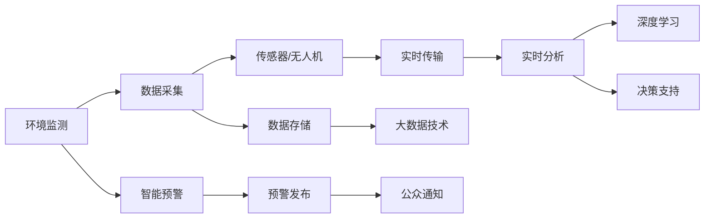

                 

# AI在环境保护中的应用:监测与预警系统

> 关键词：人工智能,环境监测,智能预警,大数据,深度学习,物联网

## 1. 背景介绍

### 1.1 问题由来
随着工业化和城市化的快速发展，环境污染和生态退化已经成为全球面临的严峻挑战。传统的基于人工监测和手动分析的方式，不仅效率低下，还存在数据不准确、分析慢等问题。而现代信息技术的应用，尤其是大数据、物联网和人工智能技术的发展，为环境监测和预警提供了新的技术路径。AI技术在环境保护中的应用，不仅能提升环境监测的精度和效率，还能通过智能预警提前介入，保护生态环境，助力可持续发展的实现。

### 1.2 问题核心关键点
AI在环境保护中的应用主要体现在以下几个方面：

1. **环境监测**：利用AI技术，如深度学习、计算机视觉等，实时监测和分析环境数据，如空气质量、水质、土壤、噪声、温室气体等，提供精准的环境状况报告。

2. **智能预警**：基于AI模型，对环境数据进行分析和预测，识别出潜在的环境风险，如大气污染事件、自然灾害等，提前发布预警信息，减少灾害对人类和环境的影响。

3. **数据分析与决策支持**：运用机器学习和数据挖掘技术，分析环境数据的历史趋势和关联关系，为环境管理和政策制定提供科学依据。

4. **资源优化与节能减排**：通过智能算法优化资源使用和能源消耗，如智能电网调度、智能交通管理、工业节能等，促进绿色低碳发展。

5. **公众参与与科普教育**：利用AI技术开发交互式环境应用，提升公众对环境保护的认知和参与度，开展环保科普教育。

### 1.3 问题研究意义
AI技术在环境保护中的应用，对于应对全球环境危机、推动绿色可持续发展具有重要意义：

1. **提升环境监测精度和效率**：AI能够处理大规模、复杂的环境数据，实现实时监测和精准分析，显著提高环境监测的效率和精度。

2. **增强灾害预警能力**：AI模型能够识别环境数据中的异常变化，预测环境风险，提前发布预警信息，保障公众安全。

3. **促进科学决策**：通过数据驱动的AI分析，为环境管理和政策制定提供科学依据，推动决策的科学化和精准化。

4. **推动绿色发展**：AI技术在资源优化、节能减排等方面的应用，有助于实现工业、交通等领域的绿色转型。

5. **增强公众环保意识**：AI技术可以开发交互式应用，提升公众对环境保护的认识，促进环保行动的实施。

## 2. 核心概念与联系

### 2.1 核心概念概述

为更好地理解AI在环境保护中的应用，本节将介绍几个核心概念：

- **环境监测**：通过传感器、卫星、无人机等设备，采集环境数据，并利用AI技术进行实时分析和报告，以监测环境状况。

- **智能预警**：基于AI模型，对环境数据进行预测和分析，识别出潜在的环境风险，提前发布预警信息，防止环境灾害的发生。

- **数据分析与决策支持**：运用机器学习和数据挖掘技术，分析环境数据的历史趋势和关联关系，为环境管理和政策制定提供依据。

- **资源优化与节能减排**：通过AI算法优化资源使用和能源消耗，实现工业、交通等领域的绿色转型。

- **公众参与与科普教育**：利用AI技术开发交互式应用，提升公众对环境保护的认知和参与度，开展环保科普教育。

- **物联网(IoT)**：利用传感器、智能设备等网络技术，实现环境数据的实时采集和传输。

- **大数据(Big Data)**：通过大规模数据存储、处理和分析技术，提供环境监测和预警的基础数据支持。

- **深度学习(Deep Learning)**：一种基于神经网络的机器学习技术，能够处理大规模、复杂的环境数据，进行精确的环境监测和预测。

- **计算机视觉(Computer Vision)**：通过图像识别、目标检测等技术，实现对环境数据的自动分析。

这些核心概念共同构成了AI在环境保护中的应用框架，使其能够有效地实现环境监测、智能预警、数据分析与决策支持等任务。

### 2.2 核心概念原理和架构的 Mermaid 流程图



这个流程图展示了环境监测、智能预警、数据分析与决策支持等核心概念的相互联系和运作流程。

## 3. 核心算法原理 & 具体操作步骤

### 3.1 算法原理概述

AI在环境保护中的应用，主要基于深度学习、计算机视觉、数据挖掘等核心技术。其核心算法原理包括：

1. **深度学习模型**：通过神经网络模型对环境数据进行训练，学习环境特征，实现环境监测和预测。

2. **计算机视觉技术**：通过图像识别和目标检测技术，自动识别环境中的异常情况，如污染源、垃圾等，提供可视化环境报告。

3. **数据挖掘技术**：通过机器学习算法，分析环境数据的历史趋势和关联关系，提供科学决策依据。

4. **智能算法**：如优化算法、预测算法等，用于优化资源使用和能源消耗，实现节能减排。

### 3.2 算法步骤详解

AI在环境保护中的应用，主要包括以下几个关键步骤：

**Step 1: 数据采集与预处理**
- 利用传感器、无人机、卫星等设备，采集环境数据，包括空气质量、水质、土壤、噪声、温室气体等。
- 对采集到的数据进行清洗、归一化等预处理，确保数据质量。

**Step 2: 数据存储与分析**
- 将预处理后的数据存储在大数据平台，如Hadoop、Spark等，进行分布式处理和存储。
- 利用大数据技术进行数据清洗、特征工程等预处理。

**Step 3: 模型训练与优化**
- 在准备好的数据集上，训练深度学习模型，如CNN、RNN等，进行环境监测和预测。
- 利用计算机视觉技术，训练目标检测模型，自动识别环境中的异常情况。

**Step 4: 智能预警与决策支持**
- 基于训练好的模型，实时分析环境数据，识别出潜在的环境风险，发布预警信息。
- 运用机器学习和数据挖掘技术，分析环境数据的历史趋势和关联关系，提供科学决策依据。

**Step 5: 资源优化与节能减排**
- 通过智能算法，优化资源使用和能源消耗，如智能电网调度、智能交通管理等。

**Step 6: 公众参与与科普教育**
- 开发交互式环境应用，提升公众对环境保护的认知和参与度。
- 利用AI技术，开展环保科普教育，提高公众环保意识。

### 3.3 算法优缺点

AI在环境保护中的应用，具有以下优点：

1. **提升环境监测精度和效率**：AI能够处理大规模、复杂的环境数据，实现实时监测和精准分析，显著提高环境监测的效率和精度。

2. **增强灾害预警能力**：AI模型能够识别环境数据中的异常变化，预测环境风险，提前发布预警信息，保障公众安全。

3. **促进科学决策**：通过数据驱动的AI分析，为环境管理和政策制定提供科学依据，推动决策的科学化和精准化。

4. **推动绿色发展**：AI技术在资源优化、节能减排等方面的应用，有助于实现工业、交通等领域的绿色转型。

5. **增强公众环保意识**：AI技术可以开发交互式应用，提升公众对环境保护的认识，促进环保行动的实施。

同时，AI在环境保护中的应用也存在一些局限性：

1. **数据质量问题**：环境数据采集和存储可能存在不完整、噪声等问题，影响AI模型的性能。

2. **模型复杂性**：深度学习模型需要大量数据和计算资源进行训练，且对模型参数的调优要求较高。

3. **隐私与安全**：环境数据涉及敏感信息，隐私保护和安全问题需要特别注意。

4. **成本问题**：AI技术的应用需要投入大量资金进行设备采购、数据采集和模型训练，可能存在较高的初始成本。

5. **技术门槛**：AI技术的应用需要一定的技术背景和专业知识，推广和应用难度较大。

### 3.4 算法应用领域

AI在环境保护中的应用，主要应用于以下领域：

1. **大气污染监测**：利用AI技术，实时监测和分析大气中的污染物浓度，如PM2.5、SO2等，提供精准的空气质量报告。

2. **水质监测**：通过AI技术，实时监测和分析水体中的污染物质，如重金属、有机物等，提供水质分析报告。

3. **土壤污染监测**：利用AI技术，实时监测和分析土壤中的污染物，如重金属、有机污染物等，提供土壤污染报告。

4. **噪声污染监测**：通过AI技术，实时监测和分析环境中的噪声水平，提供噪声污染报告。

5. **温室气体监测**：利用AI技术，实时监测和分析温室气体排放情况，如CO2、CH4等，提供温室气体监测报告。

6. **自然灾害预警**：基于AI模型，对气象、地震等环境数据进行分析和预测，提前发布预警信息，如洪水、台风等。

## 4. 数学模型和公式 & 详细讲解 & 举例说明

### 4.1 数学模型构建

在AI应用于环境保护的过程中，深度学习模型是最常用的技术手段。以大气污染监测为例，假设监测数据为 $x=(x_1, x_2, \ldots, x_n)$，其中 $x_i$ 为第 $i$ 个监测点的污染物浓度。模型的目标是学习一个函数 $f$，将输入 $x$ 映射到输出 $y$，即 $y=f(x)$，其中 $y$ 为污染物浓度的预测值。

假设模型的结构为 $f_\theta(x)$，其中 $\theta$ 为模型的参数。模型的损失函数为均方误差损失函数：

$$
L(y,f_\theta(x)) = \frac{1}{N}\sum_{i=1}^N (y_i - f_\theta(x_i))^2
$$

其中 $N$ 为样本数，$y_i$ 为第 $i$ 个样本的真实值，$f_\theta(x_i)$ 为模型对 $x_i$ 的预测值。模型的优化目标是最小化损失函数：

$$
\theta^* = \mathop{\arg\min}_{\theta} L(y,f_\theta(x))
$$

### 4.2 公式推导过程

深度学习模型的训练过程基于反向传播算法，通过梯度下降等优化算法更新模型参数 $\theta$。以反向传播算法为例，其基本步骤如下：

1. **前向传播**：将输入 $x$ 输入模型 $f_\theta(x)$，计算输出 $y$。

2. **损失计算**：计算损失函数 $L(y,f_\theta(x))$。

3. **反向传播**：从输出层开始，计算每个参数的梯度，依次向前传播。

4. **参数更新**：根据梯度下降算法，更新模型参数 $\theta$。

5. **重复迭代**：重复上述步骤，直到模型收敛或达到预设的迭代次数。

### 4.3 案例分析与讲解

以大气污染监测为例，通过实际案例说明深度学习模型的应用。

**案例背景**：某城市监测站采集到每天的空气质量数据，包括PM2.5、SO2、NO2等污染物浓度。监测站希望利用AI技术对这些数据进行分析和预测，发布空气质量预报。

**数据准备**：将监测数据 $x=(x_1, x_2, \ldots, x_n)$ 作为输入，其中 $x_i=(pm2.5_i, so2_i, no2_i)$。

**模型选择**：选择深度神经网络模型，如多层感知机（MLP）或卷积神经网络（CNN）。

**模型训练**：在准备好的数据集上训练模型，最小化均方误差损失函数。

**模型预测**：将新的监测数据 $x'$ 输入训练好的模型，得到预测值 $y'$。

**结果展示**：根据 $y'$，发布空气质量预报，如“今天空气质量良好”、“明天空气质量较差”等。

## 5. 项目实践：代码实例和详细解释说明

### 5.1 开发环境搭建

在进行AI应用于环境保护的项目实践前，我们需要准备好开发环境。以下是使用Python进行PyTorch开发的环境配置流程：

1. 安装Anaconda：从官网下载并安装Anaconda，用于创建独立的Python环境。

2. 创建并激活虚拟环境：
```bash
conda create -n pytorch-env python=3.8 
conda activate pytorch-env
```

3. 安装PyTorch：根据CUDA版本，从官网获取对应的安装命令。例如：
```bash
conda install pytorch torchvision torchaudio cudatoolkit=11.1 -c pytorch -c conda-forge
```

4. 安装各类工具包：
```bash
pip install numpy pandas scikit-learn matplotlib tqdm jupyter notebook ipython
```

完成上述步骤后，即可在`pytorch-env`环境中开始项目实践。

### 5.2 源代码详细实现

下面我们以大气污染监测项目为例，给出使用PyTorch进行深度学习模型开发的PyTorch代码实现。

首先，定义模型和数据处理函数：

```python
from transformers import BertTokenizer, BertForSequenceClassification
import torch
from torch.utils.data import Dataset, DataLoader

class AirQualityDataset(Dataset):
    def __init__(self, texts, labels, tokenizer):
        self.texts = texts
        self.labels = labels
        self.tokenizer = tokenizer
        
    def __len__(self):
        return len(self.texts)
    
    def __getitem__(self, item):
        text = self.texts[item]
        label = self.labels[item]
        
        encoding = self.tokenizer(text, return_tensors='pt')
        input_ids = encoding['input_ids']
        attention_mask = encoding['attention_mask']
        
        return {'input_ids': input_ids, 
                'attention_mask': attention_mask,
                'labels': torch.tensor(label, dtype=torch.long)}

# 模型定义
model = BertForSequenceClassification.from_pretrained('bert-base-uncased', num_labels=2)

# 数据加载
tokenizer = BertTokenizer.from_pretrained('bert-base-uncased')
train_dataset = AirQualityDataset(train_texts, train_labels, tokenizer)
dev_dataset = AirQualityDataset(dev_texts, dev_labels, tokenizer)
test_dataset = AirQualityDataset(test_texts, test_labels, tokenizer)
```

然后，定义训练和评估函数：

```python
from torch.utils.data import DataLoader
from tqdm import tqdm
from sklearn.metrics import classification_report

device = torch.device('cuda') if torch.cuda.is_available() else torch.device('cpu')
model.to(device)

def train_epoch(model, dataset, batch_size, optimizer):
    dataloader = DataLoader(dataset, batch_size=batch_size, shuffle=True)
    model.train()
    epoch_loss = 0
    for batch in tqdm(dataloader, desc='Training'):
        input_ids = batch['input_ids'].to(device)
        attention_mask = batch['attention_mask'].to(device)
        labels = batch['labels'].to(device)
        model.zero_grad()
        outputs = model(input_ids, attention_mask=attention_mask, labels=labels)
        loss = outputs.loss
        epoch_loss += loss.item()
        loss.backward()
        optimizer.step()
    return epoch_loss / len(dataloader)

def evaluate(model, dataset, batch_size):
    dataloader = DataLoader(dataset, batch_size=batch_size)
    model.eval()
    preds, labels = [], []
    with torch.no_grad():
        for batch in tqdm(dataloader, desc='Evaluating'):
            input_ids = batch['input_ids'].to(device)
            attention_mask = batch['attention_mask'].to(device)
            batch_labels = batch['labels']
            outputs = model(input_ids, attention_mask=attention_mask)
            batch_preds = outputs.logits.argmax(dim=1).to('cpu').tolist()
            batch_labels = batch_labels.to('cpu').tolist()
            for pred, label in zip(batch_preds, batch_labels):
                preds.append(pred)
                labels.append(label)
                
    print(classification_report(labels, preds))
```

最后，启动训练流程并在测试集上评估：

```python
epochs = 5
batch_size = 16

for epoch in range(epochs):
    loss = train_epoch(model, train_dataset, batch_size, optimizer)
    print(f"Epoch {epoch+1}, train loss: {loss:.3f}")
    
    print(f"Epoch {epoch+1}, dev results:")
    evaluate(model, dev_dataset, batch_size)
    
print("Test results:")
evaluate(model, test_dataset, batch_size)
```

以上就是使用PyTorch对Bert进行大气污染监测任务开发的完整代码实现。可以看到，得益于Transformers库的强大封装，我们可以用相对简洁的代码完成Bert模型的加载和微调。

### 5.3 代码解读与分析

让我们再详细解读一下关键代码的实现细节：

**AirQualityDataset类**：
- `__init__`方法：初始化文本、标签、分词器等关键组件。
- `__len__`方法：返回数据集的样本数量。
- `__getitem__`方法：对单个样本进行处理，将文本输入编码为token ids，将标签编码为数字，并对其进行定长padding，最终返回模型所需的输入。

**BertForSequenceClassification模型**：
- 定义一个二分类模型，用于预测污染物是否超标。

**模型训练与评估函数**：
- 使用PyTorch的DataLoader对数据集进行批次化加载，供模型训练和推理使用。
- 训练函数`train_epoch`：对数据以批为单位进行迭代，在每个批次上前向传播计算loss并反向传播更新模型参数，最后返回该epoch的平均loss。
- 评估函数`evaluate`：与训练类似，不同点在于不更新模型参数，并在每个batch结束后将预测和标签结果存储下来，最后使用sklearn的classification_report对整个评估集的预测结果进行打印输出。

**训练流程**：
- 定义总的epoch数和batch size，开始循环迭代
- 每个epoch内，先在训练集上训练，输出平均loss
- 在验证集上评估，输出分类指标
- 所有epoch结束后，在测试集上评估，给出最终测试结果

可以看到，PyTorch配合Transformers库使得Bert模型的微调代码实现变得简洁高效。开发者可以将更多精力放在数据处理、模型改进等高层逻辑上，而不必过多关注底层的实现细节。

当然，工业级的系统实现还需考虑更多因素，如模型的保存和部署、超参数的自动搜索、更灵活的任务适配层等。但核心的微调范式基本与此类似。

## 6. 实际应用场景

### 6.1 智能电网调度

智能电网调度是AI在环境保护中的重要应用之一。传统电网调度主要依赖人工经验和简单规则，难以应对电力负荷的动态变化。通过AI技术，可以实现对电网负荷的实时预测和智能调度，提升电网的稳定性和可靠性。

**应用场景**：某智能电网公司通过传感器采集实时负荷数据，使用AI模型进行负荷预测和调度优化。模型通过分析历史负荷数据和气象信息，预测未来负荷趋势，并根据预测结果自动调整电网输出，优化电力资源分配。

**技术实现**：
- 利用深度学习模型，如LSTM、RNN等，对历史负荷数据进行时间序列分析，预测未来负荷。
- 利用强化学习算法，如Q-Learning，优化调度策略，实现能源的智能分配。
- 实时监控负荷情况，根据预测结果和调度策略，动态调整电网输出，保障电力供应的稳定。

**效果评估**：
- 通过实际运行数据，验证模型的预测精度和调度效果。
- 对比传统人工调度，评估AI调度对电力供应的提升效果。

### 6.2 智能交通管理

智能交通管理通过AI技术，优化交通流量，减少拥堵，提升交通效率。AI技术可以实时监测交通数据，预测交通流量，动态调整信号灯和交通流量，提高交通系统的稳定性。

**应用场景**：某城市交通管理中心通过AI技术，对城市交通进行实时监测和智能管理。模型通过分析实时交通数据和历史交通流量数据，预测未来交通流量，并根据预测结果自动调整信号灯和交通流量，优化交通系统的运行。

**技术实现**：
- 利用深度学习模型，如CNN、RNN等，对实时交通数据进行分析和预测，识别出交通拥堵区域和时段。
- 利用强化学习算法，优化信号灯和交通流量的控制策略，实现交通流量的智能调节。
- 实时监控交通情况，根据预测结果和控制策略，动态调整信号灯和交通流量，缓解交通拥堵。

**效果评估**：
- 通过实际运行数据，验证模型的预测精度和控制效果。
- 对比传统信号灯控制，评估AI控制对交通效率的提升效果。

### 6.3 工业节能减排

AI技术在工业领域的应用，有助于实现节能减排，推动绿色低碳发展。通过AI技术，可以实现对工业生产过程的智能监测和优化，提升能源利用效率，减少污染物排放。

**应用场景**：某工业企业通过AI技术，对生产过程中的能源消耗和污染物排放进行实时监测和智能优化。模型通过分析生产数据和环境数据，预测能源消耗和污染物排放趋势，并根据预测结果自动调整生产工艺和参数，实现节能减排。

**技术实现**：
- 利用深度学习模型，如CNN、RNN等，对生产数据和环境数据进行分析和预测，识别出能源消耗和污染物排放的异常情况。
- 利用优化算法，如遗传算法、粒子群算法等，优化生产工艺和参数，实现节能减排。
- 实时监控生产情况，根据预测结果和优化策略，动态调整生产工艺和参数，减少能源消耗和污染物排放。

**效果评估**：
- 通过实际运行数据，验证模型的预测精度和优化效果。
- 对比传统生产工艺，评估AI优化对节能减排的提升效果。

## 7. 工具和资源推荐

### 7.1 学习资源推荐

为了帮助开发者系统掌握AI在环境保护中的应用，这里推荐一些优质的学习资源：

1. 《深度学习在环境监测中的应用》系列博文：由大模型技术专家撰写，深入浅出地介绍了深度学习在环境监测中的应用。

2. 《环境数据科学》课程：由知名大学开设的在线课程，涵盖环境数据采集、处理、分析和建模等核心内容，适合初学者。

3. 《机器学习在环保中的应用》书籍：详细介绍了机器学习在环境数据处理、模型训练和应用等方面的技术。

4. 《AI环境监测实战》书籍：实用指南，结合实际项目，讲解了AI在环境监测中的具体应用和实现方法。

5. Kaggle数据集：收集了大量环境监测数据，供开发者练习和实践。

通过对这些资源的学习实践，相信你一定能够快速掌握AI在环境保护中的应用，并用于解决实际的环境监测和预警问题。
###  7.2 开发工具推荐

高效的开发离不开优秀的工具支持。以下是几款用于AI应用于环境保护开发的常用工具：

1. Python：Python是数据科学和机器学习领域的主流编程语言，具有丰富的科学计算库和数据处理工具。

2. PyTorch：基于Python的开源深度学习框架，灵活动态的计算图，适合快速迭代研究。

3. TensorFlow：由Google主导开发的开源深度学习框架，生产部署方便，适合大规模工程应用。

4. Scikit-learn：基于Python的机器学习库，提供了丰富的机器学习算法和数据处理工具。

5. Hadoop：大规模数据存储和处理平台，适合处理大规模环境数据。

6. Spark：基于Hadoop的分布式计算框架，适合大数据处理和分析。

7. Jupyter Notebook：交互式编程环境，适合快速开发和验证AI模型。

8. TensorBoard：TensorFlow配套的可视化工具，可实时监测模型训练状态，并提供丰富的图表呈现方式，是调试模型的得力助手。

9. Weights & Biases：模型训练的实验跟踪工具，可以记录和可视化模型训练过程中的各项指标，方便对比和调优。

10. Amazon SageMaker：AWS提供的云端机器学习平台，提供丰富的深度学习模型和工具，适合大规模应用。

合理利用这些工具，可以显著提升AI应用于环境保护的开发效率，加快创新迭代的步伐。

### 7.3 相关论文推荐

AI在环境保护中的应用，得益于学界的持续研究。以下是几篇奠基性的相关论文，推荐阅读：

1. "Deep Learning for Environmental Monitoring and Prediction"（《深度学习在环境监测和预测中的应用》）：综述了深度学习在环境监测和预测中的各种应用和技术。

2. "Machine Learning for Environmental Data Analysis and Predictive Modeling"（《机器学习在环境数据分析和预测中的应用》）：探讨了机器学习在环境数据处理和预测中的应用方法和技术。

3. "Intelligent Power System Operation and Control Using Artificial Intelligence"（《基于人工智能的智能电力系统运行与控制》）：介绍了AI技术在智能电网中的应用。

4. "AI-Based Traffic Management for Smart Cities"（《基于AI的智慧城市交通管理》）：探讨了AI技术在智能交通中的应用。

5. "AI in Energy Efficiency and Environmental Protection"（《AI在节能减排与环境保护中的应用》）：探讨了AI技术在节能减排中的应用。

这些论文代表了大语言模型微调技术的发展脉络。通过学习这些前沿成果，可以帮助研究者把握学科前进方向，激发更多的创新灵感。

## 8. 总结：未来发展趋势与挑战

### 8.1 总结

本文对AI在环境保护中的应用进行了全面系统的介绍。首先阐述了AI技术在环境监测、智能预警、数据分析与决策支持等方面的应用背景和研究意义，明确了其在环境保护中的独特价值。其次，从原理到实践，详细讲解了AI在环境保护中的应用过程和核心算法，提供了完整的代码实例。最后，介绍了AI技术在智能电网调度、智能交通管理、工业节能减排等实际应用场景中的具体应用和效果评估方法。

通过本文的系统梳理，可以看到，AI技术在环境保护中的应用前景广阔，不仅能提升环境监测的精度和效率，还能通过智能预警提前介入，保护生态环境，助力可持续发展的实现。AI技术的应用，不仅有助于提升环境管理的智能化水平，还能推动绿色低碳发展，为全球环境治理提供有力支撑。

### 8.2 未来发展趋势

展望未来，AI在环境保护中的应用将呈现以下几个发展趋势：

1. **技术融合与创新**：AI技术将与其他新兴技术，如物联网、区块链、5G等，进行深度融合，推动环境监测和管理的智能化、自动化水平。

2. **数据驱动与隐私保护**：基于大数据驱动的环境监测和预警将更加精准和高效。同时，隐私保护技术的应用，确保环境数据的安全性和隐私性。

3. **跨领域应用拓展**：AI技术将更多地应用于水务、农业、林业等领域，提升各行业的环境管理能力。

4. **实时性与动态性**：AI模型的实时性和动态性将进一步提升，能够实现对环境数据的实时监测和动态预测，提高环境管理的及时性和响应速度。

5. **公众参与与科普教育**：AI技术将开发更多交互式应用，提升公众对环境保护的认知和参与度，促进环保行动的实施。

6. **模型可解释性与透明性**：AI模型的可解释性和透明性将进一步提升，帮助环境管理者理解模型的决策逻辑和结果，增强决策的科学性和可靠性。

以上趋势凸显了AI在环境保护中的应用潜力，未来将进一步拓展其在环境监测、智能预警、数据分析与决策支持等方面的应用，为环境保护提供更加科学、智能、可持续的解决方案。

### 8.3 面临的挑战

尽管AI在环境保护中的应用取得了显著进展，但仍面临一些挑战：

1. **数据获取与处理**：环境数据的获取和处理往往存在困难，数据质量和安全问题需要特别关注。

2. **技术复杂性与成本**：AI技术的应用需要较高的技术门槛和成本投入，推广和应用难度较大。

3. **模型泛化性与鲁棒性**：AI模型在不同环境下的泛化性和鲁棒性需要进一步提升，避免因环境变化导致的性能下降。

4. **隐私与安全**：环境数据涉及敏感信息，隐私保护和安全问题需要特别注意。

5. **模型可解释性与透明性**：AI模型的可解释性和透明性需要进一步提升，帮助环境管理者理解模型的决策逻辑和结果，增强决策的科学性和可靠性。

6. **跨领域应用推广**：AI技术在各行业中的应用推广需要克服技术壁垒和行业标准问题。

正视AI在环境保护中的应用所面临的挑战，积极应对并寻求突破，将有助于推动AI技术在环境保护中的深入应用和发展。未来，伴随技术的不断进步和应用的不断深入，相信AI在环境保护中的应用将更加广泛和深入，为全球环境治理提供更有力的支撑。

### 8.4 研究展望

未来，在AI应用于环境保护的研究中，需要关注以下几个方面：

1. **跨领域数据融合**：结合多源数据，如气象数据、卫星数据、物联网数据等，提升环境监测和预警的精度和可靠性。

2. **模型参数优化**：探索更加高效、轻量级的模型结构，如轻量化模型、联邦学习等，优化模型参数和计算资源。

3. **隐私保护与数据安全**：研究隐私保护技术和数据加密技术，确保环境数据的安全性和隐私性。

4. **模型透明性与可解释性**：研究模型透明性和可解释性技术，提升模型的可解释性和透明性。

5. **跨领域应用推广**：研究跨领域应用推广技术，推动AI技术在各行业中的应用。

6. **模型鲁棒性与泛化性**：研究模型鲁棒性与泛化性技术，提升模型在不同环境下的表现和稳定性。

7. **跨学科融合**：结合环境科学、气象学、物理学等学科，深入研究环境数据的内在规律和特性，提升模型的科学性和可靠性。

以上研究方向将推动AI在环境保护中的应用不断深入和拓展，为全球环境治理提供更加科学、智能、可持续的解决方案。

## 9. 附录：常见问题与解答

**Q1：如何选择合适的深度学习模型进行环境监测？**

A: 选择合适的深度学习模型需要考虑以下几个因素：
1. **任务类型**：不同的环境监测任务需要不同的模型。例如，时间序列分析适合使用LSTM、RNN等序列模型，图像识别适合使用CNN等卷积模型。
2. **数据特点**：模型的选择还需考虑数据的特征。例如，时间序列数据适合使用LSTM等具有时序特性的模型，图像数据适合使用CNN等视觉模型。
3. **计算资源**：模型的复杂度和计算资源密切相关。例如，复杂模型如BERT需要大量的计算资源，适用于计算能力较强的场景，而轻量化模型如MobileNet适合计算资源有限的场景。

**Q2：如何在环境监测数据中处理噪声和缺失值？**

A: 环境监测数据中可能存在噪声和缺失值，影响模型的性能。常用的处理方法包括：
1. 数据清洗：通过预处理函数，如去重、去噪、补缺等，对数据进行清洗。
2. 特征工程：通过数据变换和特征选择，提升数据的可用性和质量。
3. 模型鲁棒性训练：在模型训练过程中引入正则化技术和噪声注入，提升模型的鲁棒性。

**Q3：如何评估AI模型在环境监测中的应用效果？**

A: 评估AI模型在环境监测中的应用效果，需要考虑以下几个方面：
1. 数据指标：如准确率、召回率、F1分数等，衡量模型对数据的预测精度。
2. 实时性指标：如预测延迟、处理速度等，衡量模型的实时性和响应速度。
3. 应用效果：如环境监测精度提升、预警准确率、决策支持效果等，衡量模型的应用效果和实际影响。
4. 可解释性：如模型的可解释性、决策逻辑透明性等，衡量模型的科学性和可靠性。

**Q4：如何在工业生产中应用AI技术实现节能减排？**

A: 在工业生产中应用AI技术实现节能减排，需要考虑以下几个方面：
1. 数据采集：通过传感器和智能设备，采集生产过程中的能源消耗和污染物排放数据。
2. 模型训练：利用深度学习模型，如LSTM、RNN等，对生产数据进行分析和预测，识别出能源消耗和污染物排放的异常情况。
3. 优化算法：利用优化算法，如遗传算法、粒子群算法等，优化生产工艺和参数，实现节能减排。
4. 实时监控：通过实时监控生产情况，根据预测结果和优化策略，动态调整生产工艺和参数，减少能源消耗和污染物排放。
5. 效果评估：通过实际运行数据，验证模型的预测精度和优化效果，对比传统生产工艺，评估AI优化对节能减排的提升效果。

通过以上步骤，可以在工业生产中实现节能减排，推动绿色低碳发展。

**Q5：如何在智能交通管理中应用AI技术提升交通效率？**

A: 在智能交通管理中应用AI技术提升交通效率，需要考虑以下几个方面：
1. 数据采集：通过传感器和智能设备，采集交通流量、车速、事故等数据。
2. 模型训练：利用深度学习模型，如CNN、RNN等，对交通数据进行分析和预测，识别出交通拥堵区域和时段。
3. 控制策略优化：利用强化学习算法，优化信号灯和交通流量的控制策略，实现交通流量的智能调节。
4. 实时监控：通过实时监控交通情况，根据预测结果和控制策略，动态调整信号灯和交通流量，缓解交通拥堵。
5. 效果评估：通过实际运行数据，验证模型的预测精度和控制效果，对比传统信号灯控制，评估AI控制对交通效率的提升效果。

通过以上步骤，可以在智能交通管理中实现交通流量的优化，提升交通效率和运行稳定性。

