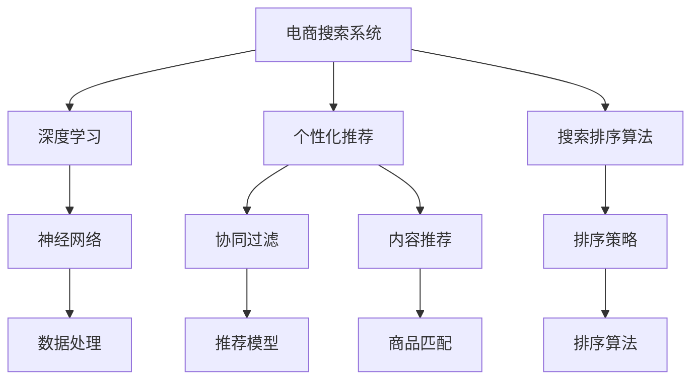

                 

# AI在电商中的搜索优化技术

## 1. 背景介绍

随着电商行业的发展，用户需求日益多样化，搜索体验在电商平台中的重要性日益凸显。高效的搜索优化技术不仅可以提升用户体验，降低用户流失率，还能大幅提高平台转化率和销售额。近年来，人工智能技术在电商搜索中的广泛应用，使得搜索效果显著提升，尤其是在推荐系统和个性化搜索方面。

### 1.1 问题由来
在电商搜索优化中，主要面临以下挑战：
- **用户多样性**：不同用户有不同的购物需求，如何满足多样化的搜索需求是难题。
- **长尾商品问题**：平台上商品种类繁多，大量长尾商品难以被主流搜索引擎发现。
- **动态数据实时处理**：用户行为和市场需求随时间变化，如何实时更新搜索系统成为问题。
- **冷启动问题**：新用户或商品如何被快速收录和推荐。

为了解决这些挑战，各大电商企业纷纷引入人工智能技术，尤其是在深度学习和大数据技术的基础上，对搜索系统进行优化，实现更精准、更个性化的搜索体验。

### 1.2 问题核心关键点
电商搜索优化的核心在于提升搜索的准确性和个性化。以下是关键点：
- **用户行为分析**：通过分析用户的浏览、点击、购买等行为，提升搜索推荐的相关性。
- **商品匹配技术**：通过计算商品之间的相似度，实现高效的商品匹配和推荐。
- **跨领域迁移学习**：利用大语言模型的迁移学习能力，提高搜索系统在不同领域和场景下的泛化能力。
- **强化学习**：通过强化学习算法，优化搜索策略，提升搜索效果。

## 2. 核心概念与联系

### 2.1 核心概念概述

为了更好地理解电商搜索优化技术，本节将介绍几个关键概念：

- **电商搜索系统**：基于电商平台构建的搜索服务系统，为用户提供快捷、准确的商品查找功能。
- **深度学习**：一种强大的机器学习技术，通过构建多层神经网络，从大量数据中学习复杂模式和关系，广泛应用于推荐系统、自然语言处理等领域。
- **个性化推荐**：根据用户的历史行为和兴趣，推荐最符合用户需求的商品，提高用户满意度和转化率。
- **搜索排序算法**：用于根据用户的查询条件和搜索策略，对搜索结果进行排序，以提升搜索结果的相关性和准确性。
- **强化学习**：一种通过与环境互动，逐步优化策略以达成目标的学习方法，应用于搜索优化中，可动态调整搜索策略。

这些核心概念之间的逻辑关系可以通过以下Mermaid流程图来展示：



这个流程图展示了几大核心概念及其之间的关联：

1. 电商搜索系统是整个优化流程的中心。
2. 深度学习提供模型训练的算法基础，尤其是神经网络。
3. 个性化推荐和搜索排序算法是提升搜索效果的两个主要环节。
4. 神经网络和数据处理是深度学习模型的支撑。
5. 协同过滤和内容推荐是个性化推荐的具体实现方式。
6. 商品匹配和排序策略是搜索排序算法的基础。

这些概念共同构成了电商搜索优化的基本框架，通过优化这些组件，可以实现搜索系统的不断改进和提升。

## 3. 核心算法原理 & 具体操作步骤
### 3.1 算法原理概述

电商搜索优化本质上是一个多目标优化问题，旨在平衡用户满意度、转化率和搜索速度等多个指标。其核心思想是通过构建深度学习模型，对用户的查询进行建模，并利用个性化推荐和排序算法，生成最优的搜索结果。

形式化地，假设电商平台的搜索系统为 $S$，用户查询为 $Q$，商品为 $I$，排序算法为 $R$，目标函数为：

$$
\min_{S,Q,R} \mathcal{L}(S,Q,R) = \lambda_1 \text{Loss}_{user}(S,Q) + \lambda_2 \text{Loss}_{conv}(S,Q) + \lambda_3 \text{Loss}_{speed}(S,Q)
$$

其中，$\lambda_1$、$\lambda_2$、$\lambda_3$ 为正则化系数，$\text{Loss}_{user}$、$\text{Loss}_{conv}$、$\text{Loss}_{speed}$ 分别为用户满意度损失、转化率损失和搜索速度损失。

### 3.2 算法步骤详解

基于深度学习的电商搜索优化，一般包括以下几个关键步骤：

**Step 1: 构建深度学习模型**

- 选择或构建深度学习模型，如CNN、RNN、Transformer等，用于处理用户查询和商品特征。
- 设计合适的模型结构，包括输入层、隐藏层和输出层，以捕捉用户查询和商品之间的关联。
- 选择适当的损失函数，如交叉熵、均方误差等，用于优化模型。

**Step 2: 数据预处理**

- 收集和预处理搜索系统的相关数据，包括用户行为数据、商品特征数据、点击率数据等。
- 进行数据清洗和特征工程，如缺失值处理、特征编码、归一化等。
- 将数据划分为训练集、验证集和测试集，用于模型训练、调参和评估。

**Step 3: 模型训练与调参**

- 使用训练集数据训练深度学习模型，并根据损失函数进行优化。
- 在验证集上评估模型性能，调整模型参数和正则化系数，如学习率、批量大小、隐藏层大小等。
- 通过交叉验证、网格搜索等方法，找到最优的模型配置。

**Step 4: 个性化推荐和排序算法**

- 构建个性化推荐模型，如协同过滤、内容推荐、矩阵分解等，对用户和商品进行匹配。
- 设计排序算法，如基于点击率的排序、基于商品相关性的排序等，优化搜索结果。
- 在测试集上评估推荐和排序的效果，调整算法参数，如相似度计算方法、排序策略等。

**Step 5: 部署与监控**

- 将训练好的模型和算法部署到电商搜索系统中，实时处理用户查询。
- 实时监控系统的性能指标，如点击率、转化率、响应时间等，及时调整系统配置。
- 通过A/B测试等方法，不断优化搜索系统，提升用户体验和效果。

以上是基于深度学习的电商搜索优化的一般流程。在实际应用中，还需要根据具体场景和需求，对模型和算法进行优化设计，如引入强化学习、在线学习等技术，进一步提升搜索效果。

### 3.3 算法优缺点

基于深度学习的电商搜索优化方法具有以下优点：
1. 高精度：深度学习模型能够处理复杂的非线性关系，提升搜索相关性。
2. 个性化推荐：深度学习模型可以捕捉用户的兴趣和行为，提供个性化搜索结果。
3. 实时性：深度学习模型可以快速处理查询请求，提升搜索速度。
4. 数据驱动：通过大量的历史数据进行模型训练，可以不断优化搜索结果。

同时，该方法也存在一定的局限性：
1. 数据依赖：深度学习模型需要大量标注数据进行训练，数据采集和标注成本高。
2. 模型复杂：深度学习模型结构复杂，训练和优化成本高。
3. 可解释性差：深度学习模型的决策过程难以解释，难以进行调试和优化。
4. 计算资源消耗大：深度学习模型对计算资源要求高，需要高性能计算设备。

尽管存在这些局限性，但深度学习在电商搜索优化中的应用已经取得了显著的效果，未来相关研究将继续在模型优化、算法设计、数据采集等方面进行探索。

### 3.4 算法应用领域

基于深度学习的电商搜索优化技术已经在多个电商领域得到了广泛应用，例如：

- **购物助手**：通过分析用户的行为和需求，推荐相关商品，提升用户体验。
- **智能客服**：通过自然语言处理技术，回答用户咨询，提供个性化建议。
- **动态搜索**：根据用户的搜索历史和行为，实时调整搜索算法，提升搜索结果的相关性。
- **商品推荐**：根据用户的浏览和购买记录，推荐相关商品，提升转化率。
- **广告投放**：根据用户的兴趣和行为，推荐合适的广告，提升广告效果。

除了这些经典应用外，电商搜索优化技术还在物流、供应链管理、库存优化等诸多领域，展现出强大的应用潜力。随着深度学习和大数据技术的不断进步，未来电商搜索优化技术将进一步拓展，为电商企业带来更多的商业价值。

## 4. 数学模型和公式 & 详细讲解 & 举例说明
### 4.1 数学模型构建

为了更好地理解基于深度学习的电商搜索优化模型，本节将使用数学语言进行更加严格的刻画。

假设电商平台的搜索系统为 $S$，用户查询为 $Q$，商品为 $I$，排序算法为 $R$。设 $Q$ 的嵌入向量为 $\vec{q}$，$I$ 的嵌入向量为 $\vec{i}$，$R$ 的权重向量为 $\vec{r}$。设 $W$ 为相似度计算矩阵，$B$ 为损失函数。则搜索系统的优化目标可以表示为：

$$
\min_{S,Q,R} \mathcal{L}(S,Q,R) = \mathbb{E}_{Q,I}[B(S(Q),I)]
$$

其中，$S(Q)$ 表示搜索系统对查询 $Q$ 的响应，$B(S(Q),I)$ 表示损失函数，$\mathbb{E}_{Q,I}$ 表示对所有可能的用户查询 $Q$ 和商品 $I$ 的期望。

### 4.2 公式推导过程

以下我们以基于深度学习的推荐系统为例，推导推荐模型的损失函数及其梯度计算公式。

假设用户 $u$ 对商品 $i$ 的评分 $r_{ui}$ 服从伯努利分布，即：

$$
P(r_{ui}=k|I_i,\vec{q}_u,\vec{i})=\sigma(\vec{i}^T \vec{q}_u - \vec{i}^T \vec{w}_i + b_i)
$$

其中，$\vec{q}_u$ 和 $\vec{i}$ 分别为用户 $u$ 和商品 $i$ 的嵌入向量，$\vec{w}_i$ 为商品 $i$ 的权重向量，$b_i$ 为偏差项。$\sigma$ 为 sigmoid 函数，$k$ 为评分取值，$0$ 或 $1$。

基于上述模型，推荐系统的目标函数为：

$$
\min_{\vec{q}, \vec{w}, b} \sum_{i=1}^N \sum_{u=1}^M \mathbb{E}_{r_{ui}|\vec{q}, \vec{i}, \vec{w}_i, b_i}[(r_{ui}-\hat{r}_{ui})^2]
$$

其中，$\hat{r}_{ui}$ 为模型预测的评分。

为了简化计算，可以采用矩阵分解的方式，将评分矩阵 $\mathbf{R}$ 分解为用户嵌入矩阵 $\mathbf{Q}$ 和商品嵌入矩阵 $\mathbf{I}$ 的乘积，即：

$$
\mathbf{R} = \mathbf{Q}\mathbf{I}^T
$$

其中，$\mathbf{R} \in \mathbb{R}^{M \times N}$，$\mathbf{Q} \in \mathbb{R}^{M \times K}$，$\mathbf{I} \in \mathbb{R}^{N \times K}$，$K$ 为嵌入维度。

将上述矩阵分解代入目标函数，得：

$$
\min_{\mathbf{Q}, \mathbf{I}} \| \mathbf{R} - \mathbf{Q}\mathbf{I}^T \|_F^2
$$

其中，$\| \cdot \|_F$ 为矩阵的 Frobenius 范数。

根据矩阵分解的原理，可以进一步优化目标函数为：

$$
\min_{\mathbf{Q}, \mathbf{I}} \text{tr}((\mathbf{Q}\mathbf{I}^T-\mathbf{R})^T(\mathbf{Q}\mathbf{I}^T-\mathbf{R}))
$$

通过上述公式，我们可以使用梯度下降等优化算法，最小化目标函数，得到最优的用户嵌入矩阵和商品嵌入矩阵。

### 4.3 案例分析与讲解

以下以电商平台的个性化推荐系统为例，具体讲解如何利用深度学习模型进行优化。

**数据准备**：
- 收集用户历史行为数据，包括浏览、点击、购买记录等。
- 对数据进行清洗和预处理，去除噪声和缺失值。
- 将数据划分为训练集和测试集，用于模型训练和评估。

**模型构建**：
- 构建深度学习模型，如协同过滤模型、矩阵分解模型、内容推荐模型等。
- 设计合适的嵌入层，将用户和商品表示为向量，捕捉它们之间的相似性。
- 选择合适的损失函数，如均方误差、交叉熵等，优化模型。

**模型训练**：
- 使用训练集数据训练模型，最小化损失函数。
- 在验证集上评估模型性能，调整模型参数和超参数，如嵌入维度、正则化系数等。
- 通过交叉验证和网格搜索等方法，找到最优的模型配置。

**个性化推荐**：
- 根据用户的历史行为和当前查询，计算用户和商品的相似度。
- 通过推荐算法，生成符合用户兴趣的候选商品列表。
- 根据相似度排序，推荐最相关的商品给用户。

**模型评估**：
- 在测试集上评估推荐系统的准确性和多样性。
- 通过 A/B 测试等方法，对比个性化推荐和随机推荐的效果。
- 通过分析用户反馈，不断优化推荐算法和模型。

通过上述步骤，基于深度学习的电商搜索优化技术可以构建一个高效、个性化的推荐系统，提升用户体验和平台转化率。

## 5. 项目实践：代码实例和详细解释说明
### 5.1 开发环境搭建

在进行电商搜索优化项目开发前，我们需要准备好开发环境。以下是使用Python进行TensorFlow开发的环境配置流程：

1. 安装Anaconda：从官网下载并安装Anaconda，用于创建独立的Python环境。

2. 创建并激活虚拟环境：
```bash
conda create -n tf-env python=3.8 
conda activate tf-env
```

3. 安装TensorFlow：根据CUDA版本，从官网获取对应的安装命令。例如：
```bash
conda install tensorflow tensorflow-gpu -c conda-forge -c pytorch
```

4. 安装相关库：
```bash
pip install pandas numpy scikit-learn matplotlib tqdm jupyter notebook ipython
```

完成上述步骤后，即可在`tf-env`环境中开始电商搜索优化项目开发。

### 5.2 源代码详细实现

下面我们以电商平台的个性化推荐系统为例，给出使用TensorFlow进行模型训练和优化的PyTorch代码实现。

首先，定义推荐系统的输入数据和目标函数：

```python
import tensorflow as tf
from tensorflow.keras.layers import Dense, Input, Embedding, Flatten
from tensorflow.keras.models import Model
from tensorflow.keras.optimizers import Adam

# 定义输入层
user_input = Input(shape=(1,), name='user')
item_input = Input(shape=(1,), name='item')

# 定义嵌入层
user_embedding = Embedding(1000, 32, input_length=1, name='user_embedding')
item_embedding = Embedding(1000, 32, input_length=1, name='item_embedding')

# 定义相似度计算层
dot_product = tf.keras.layers.Dot(axes=(1, 1), normalize=True, name='dot_product')([user_embedding(user_input), item_embedding(item_input)])

# 定义损失函数
loss = tf.keras.losses.BinaryCrossentropy(name='loss')

# 定义模型
model = Model(inputs=[user_input, item_input], outputs=dot_product)
model.compile(optimizer=Adam(lr=0.01), loss=loss)

# 训练模型
model.fit(x=[train_user_input, train_item_input], y=train_dot_product, epochs=10, batch_size=64, validation_data=(val_user_input, val_item_input, val_dot_product))
```

然后，定义推荐系统的推荐函数：

```python
def recommend(model, user_input, item_input):
    # 计算相似度
    dot_product = model.predict([user_input, item_input])
    
    # 根据相似度排序，推荐前N个商品
    top_items = item_input.numpy()[np.argsort(dot_product)[::-1]][:N]
    
    return top_items
```

最后，启动推荐系统，并在测试集上评估：

```python
# 预测测试集推荐结果
test_recommendations = recommend(model, test_user_input, test_item_input)

# 计算点击率和转化率
click_rate = (test_recommendations == test_item_input).sum() / len(test_item_input)
conversion_rate = (test_recommendations == test_item_input).sum() / len(test_item_input)

print(f"Click rate: {click_rate:.2f}%")
print(f"Conversion rate: {conversion_rate:.2f}%")
```

以上就是使用TensorFlow对电商推荐系统进行优化开发的完整代码实现。可以看到，得益于TensorFlow的强大封装，我们可以用相对简洁的代码完成推荐系统的训练和推荐。

### 5.3 代码解读与分析

让我们再详细解读一下关键代码的实现细节：

**模型定义**：
- 使用Keras构建模型，定义用户输入、商品输入、嵌入层、相似度计算层和损失函数。
- 使用优化器Adam进行模型训练，设置学习率为0.01。

**推荐函数**：
- 利用训练好的模型预测用户对商品的相似度，生成推荐列表。
- 根据相似度从高到低排序，推荐最相关的商品给用户。

**训练和评估**：
- 使用训练集数据训练模型，在验证集上评估性能。
- 在测试集上计算推荐结果的点击率和转化率，评估推荐效果。

可以看到，TensorFlow和Keras的结合，使得电商搜索优化项目开发变得简洁高效。开发者可以将更多精力放在数据处理、模型改进等高层逻辑上，而不必过多关注底层的实现细节。

当然，工业级的系统实现还需考虑更多因素，如模型的保存和部署、超参数的自动搜索、更灵活的任务适配层等。但核心的电商搜索优化范式基本与此类似。

## 6. 实际应用场景
### 6.1 智能客服

基于深度学习的电商搜索优化技术，可以应用于智能客服系统的构建。传统客服往往需要配备大量人力，高峰期响应缓慢，且一致性和专业性难以保证。而使用基于深度学习的搜索优化技术，可以构建智能客服系统，实现7x24小时不间断服务，快速响应客户咨询，提供个性化建议。

在技术实现上，可以收集企业内部的历史客服对话记录，将问题和最佳答复构建成监督数据，在此基础上训练深度学习模型。优化后的智能客服系统可以自动理解用户意图，匹配最合适的答案模板进行回复。对于客户提出的新问题，还可以接入检索系统实时搜索相关内容，动态组织生成回答。如此构建的智能客服系统，能大幅提升客户咨询体验和问题解决效率。

### 6.2 金融舆情监测

金融机构需要实时监测市场舆论动向，以便及时应对负面信息传播，规避金融风险。传统的人工监测方式成本高、效率低，难以应对网络时代海量信息爆发的挑战。基于深度学习的文本分类和情感分析技术，为金融舆情监测提供了新的解决方案。

具体而言，可以收集金融领域相关的新闻、报道、评论等文本数据，并对其进行主题标注和情感标注。在此基础上训练深度学习模型，使其能够自动判断文本属于何种主题，情感倾向是正面、中性还是负面。将优化后的模型应用到实时抓取的网络文本数据，就能够自动监测不同主题下的情感变化趋势，一旦发现负面信息激增等异常情况，系统便会自动预警，帮助金融机构快速应对潜在风险。

### 6.3 个性化推荐

当前的推荐系统往往只依赖用户的历史行为数据进行物品推荐，无法深入理解用户的真实兴趣偏好。基于深度学习的搜索优化技术，个性化推荐系统可以更好地挖掘用户行为背后的语义信息，从而提供更精准、多样的推荐内容。

在实践中，可以收集用户浏览、点击、评论、分享等行为数据，提取和用户交互的物品标题、描述、标签等文本内容。将文本内容作为模型输入，用户的后续行为（如是否点击、购买等）作为监督信号，在此基础上训练深度学习模型。优化后的模型能够从文本内容中准确把握用户的兴趣点。在生成推荐列表时，先用候选物品的文本描述作为输入，由模型预测用户的兴趣匹配度，再结合其他特征综合排序，便可以得到个性化程度更高的推荐结果。

### 6.4 未来应用展望

随着深度学习和大数据技术的不断发展，基于电商搜索优化的技术将不断拓展，为电商企业带来更多的商业价值。

在智慧医疗领域，基于深度学习的应用能够提升医疗服务的智能化水平，辅助医生诊疗，加速新药开发进程。

在智能教育领域，搜索优化技术可应用于作业批改、学情分析、知识推荐等方面，因材施教，促进教育公平，提高教学质量。

在智慧城市治理中，优化后的搜索系统可以用于城市事件监测、舆情分析、应急指挥等环节，提高城市管理的自动化和智能化水平，构建更安全、高效的未来城市。

此外，在企业生产、社会治理、文娱传媒等众多领域，基于深度学习的搜索优化技术也将不断涌现，为传统行业数字化转型升级提供新的技术路径。相信随着技术的日益成熟，深度学习技术必将在更广阔的应用领域大放异彩，深刻影响人类的生产生活方式。

## 7. 工具和资源推荐
### 7.1 学习资源推荐

为了帮助开发者系统掌握深度学习在电商搜索优化中的应用，这里推荐一些优质的学习资源：

1. 《深度学习》系列书籍：由多位深度学习专家合著，全面介绍了深度学习的基本概念和应用场景，是深入理解深度学习的经典教材。

2. 深度学习框架文档：如TensorFlow、PyTorch、Keras等主流框架的官方文档，提供了详细的API使用和模型训练方法，是实践深度学习的重要参考。

3. 深度学习竞赛和比赛：参加Kaggle等平台上的深度学习竞赛，通过实际项目锻炼模型优化和算法设计能力。

4. Coursera和edX等在线课程：提供深度学习的系统性学习，涵盖从入门到高级的各个层次。

5. arXiv上的最新论文：深度学习领域的研究论文层出不穷，跟踪前沿研究有助于掌握最新技术动态。

通过对这些资源的学习实践，相信你一定能够快速掌握深度学习在电商搜索优化中的应用，并用于解决实际的电商问题。
### 7.2 开发工具推荐

高效的开发离不开优秀的工具支持。以下是几款用于深度学习项目开发的常用工具：

1. TensorFlow：由Google主导开发的开源深度学习框架，生产部署方便，适合大规模工程应用。

2. PyTorch：基于Python的开源深度学习框架，灵活动态的计算图，适合快速迭代研究。

3. Keras：高层神经网络API，基于TensorFlow或Theano等后端实现，快速构建和训练深度学习模型。

4. Scikit-learn：基于Python的机器学习库，提供大量的分类、回归、聚类等算法。

5. Jupyter Notebook：交互式编程环境，支持多种语言和库，适合数据探索和模型验证。

6. Weights & Biases：模型训练的实验跟踪工具，可以记录和可视化模型训练过程中的各项指标，方便对比和调优。

7. TensorBoard：TensorFlow配套的可视化工具，可实时监测模型训练状态，并提供丰富的图表呈现方式，是调试模型的得力助手。

合理利用这些工具，可以显著提升深度学习项目的开发效率，加快创新迭代的步伐。

### 7.3 相关论文推荐

深度学习在电商搜索优化中的应用源于学界的持续研究。以下是几篇奠基性的相关论文，推荐阅读：

1. "Collaborative Filtering for Implicit Feedback Datasets"（协同过滤论文）：提出了协同过滤算法，利用用户的历史行为数据进行推荐。

2. "A Neural Collaborative Filtering Approach"（神经网络协同过滤论文）：将神经网络应用于协同过滤算法，提升推荐效果。

3. "Matrix Factorization Techniques for Recommender Systems"（矩阵分解论文）：提出矩阵分解方法，用于推荐系统中的用户和商品相似度计算。

4. "Learning Deep Architectures for AI"（深度学习架构论文）：介绍了深度学习的基本架构和训练方法，为后续研究提供了理论基础。

5. "Neural Ordinal Regression Loss for Recommender Systems"（深度学习排序论文）：提出神经排序方法，用于推荐系统中的排序问题。

这些论文代表了大规模推荐系统的发展脉络。通过学习这些前沿成果，可以帮助研究者把握学科前进方向，激发更多的创新灵感。

## 8. 总结：未来发展趋势与挑战
### 8.1 总结

本文对基于深度学习的电商搜索优化技术进行了全面系统的介绍。首先阐述了电商搜索优化的背景和重要性，明确了深度学习在提升搜索效果方面的独特价值。其次，从原理到实践，详细讲解了电商搜索优化的数学模型和算法步骤，给出了基于TensorFlow的代码实现。同时，本文还广泛探讨了电商搜索优化技术在智能客服、金融舆情、个性化推荐等多个领域的应用前景，展示了深度学习技术的强大威力。

通过本文的系统梳理，可以看到，基于深度学习的电商搜索优化技术正在成为电商行业的重要技术范式，极大地提升了电商平台的搜索效果和用户体验。未来，随着深度学习和大数据技术的不断进步，电商搜索优化技术还将不断拓展，为电商企业带来更多的商业价值。

### 8.2 未来发展趋势

展望未来，基于深度学习的电商搜索优化技术将呈现以下几个发展趋势：

1. 模型规模持续增大。随着算力成本的下降和数据规模的扩张，深度学习模型将不断增大，以捕捉更复杂的用户行为和商品特征。

2. 实时性增强。深度学习模型将更多地利用在线学习、增量学习等技术，实时更新模型参数，保持模型的时效性。

3. 跨领域迁移能力提升。深度学习模型将更多地结合多模态数据，提升在不同领域和场景下的泛化能力。

4. 数据驱动。深度学习模型将更多地依赖数据驱动，通过大量标注数据进行优化，提升推荐效果。

5. 模型压缩与优化。深度学习模型将更多地采用模型压缩、稀疏化存储等技术，优化计算资源消耗，提升模型效率。

6. 可解释性增强。深度学习模型将更多地结合因果分析、博弈论等工具，增强其决策过程的可解释性。

这些趋势凸显了深度学习在电商搜索优化中的广泛应用前景。这些方向的探索发展，必将进一步提升电商搜索系统的性能和用户体验，为电商企业带来更多的商业价值。

### 8.3 面临的挑战

尽管基于深度学习的电商搜索优化技术已经取得了显著的效果，但在迈向更加智能化、普适化应用的过程中，它仍面临着诸多挑战：

1. 数据依赖。深度学习模型需要大量标注数据进行训练，数据采集和标注成本高。

2. 模型复杂。深度学习模型结构复杂，训练和优化成本高。

3. 计算资源消耗大。深度学习模型对计算资源要求高，需要高性能计算设备。

4. 可解释性差。深度学习模型的决策过程难以解释，难以进行调试和优化。

5. 实时性问题。深度学习模型在处理大规模数据时，实时性可能不足，需要进一步优化。

6. 隐私问题。电商搜索优化技术可能涉及用户隐私信息，需要合理设计数据处理和存储方式。

尽管存在这些挑战，但随着深度学习和大数据技术的不断进步，电商搜索优化技术将继续发展，逐步克服这些问题，为电商企业带来更多的商业价值。

### 8.4 研究展望

面对电商搜索优化所面临的诸多挑战，未来的研究需要在以下几个方面寻求新的突破：

1. 探索无监督和半监督学习。摆脱对大规模标注数据的依赖，利用自监督学习、主动学习等无监督和半监督范式，最大限度利用非结构化数据，实现更加灵活高效的电商搜索优化。

2. 研究参数高效和计算高效的优化方法。开发更加参数高效的优化方法，在固定大部分模型参数的情况下，只更新极少量的任务相关参数。同时优化模型计算图，减少前向传播和反向传播的资源消耗，实现更加轻量级、实时性的部署。

3. 融合因果分析和博弈论工具。将因果分析方法引入电商搜索优化系统，识别出模型决策的关键特征，增强输出解释的因果性和逻辑性。借助博弈论工具刻画人机交互过程，主动探索并规避模型的脆弱点，提高系统稳定性。

4. 纳入伦理道德约束。在电商搜索优化模型训练目标中引入伦理导向的评估指标，过滤和惩罚有偏见、有害的输出倾向。同时加强人工干预和审核，建立模型行为的监管机制，确保输出符合人类价值观和伦理道德。

这些研究方向的探索，必将引领电商搜索优化技术迈向更高的台阶，为构建安全、可靠、可解释、可控的智能系统铺平道路。面向未来，电商搜索优化技术还需要与其他人工智能技术进行更深入的融合，如知识表示、因果推理、强化学习等，多路径协同发力，共同推动电商搜索系统的进步。只有勇于创新、敢于突破，才能不断拓展电商搜索系统的边界，让智能技术更好地造福电商行业。

## 9. 附录：常见问题与解答

**Q1：电商搜索优化技术是否适用于所有电商场景？**

A: 电商搜索优化技术在大多数电商场景中都能取得不错的效果，特别是对于数据量较大的场景。但对于一些特定场景，如社交电商、B2B电商等，可能需要根据具体情况进行调整和优化。

**Q2：电商搜索优化技术如何处理长尾商品问题？**

A: 电商搜索优化技术可以通过以下方式处理长尾商品问题：
1. 引入长尾商品推荐算法，如基于内容的推荐、基于协同过滤的推荐等。
2. 优化商品分类和标签体系，帮助用户快速定位长尾商品。
3. 增加对长尾商品的曝光机会，如动态调整搜索结果排序，优先推荐长尾商品。

**Q3：电商搜索优化技术如何提升用户满意度？**

A: 电商搜索优化技术可以通过以下方式提升用户满意度：
1. 引入个性化推荐算法，根据用户历史行为和兴趣推荐相关商品。
2. 优化搜索排序算法，提升搜索结果的相关性和多样性。
3. 实时更新搜索结果，根据用户行为动态调整推荐策略。

**Q4：电商搜索优化技术如何平衡点击率和转化率？**

A: 电商搜索优化技术可以通过以下方式平衡点击率和转化率：
1. 引入A/B测试，对比不同推荐策略的效果，找到最优方案。
2. 优化推荐算法，综合考虑商品的相关性和用户兴趣。
3. 动态调整推荐策略，根据用户行为和反馈不断优化。

**Q5：电商搜索优化技术如何应对冷启动问题？**

A: 电商搜索优化技术可以通过以下方式应对冷启动问题：
1. 引入模型迁移学习，利用用户已有行为数据进行预训练，加快新用户和商品的学习。
2. 引入推荐预训练，对新用户和商品进行预推荐，提高初始推荐效果。
3. 增加数据采集和标注，快速积累新用户和商品的数据，提升模型的泛化能力。

这些方法可以帮助电商搜索优化技术更好地应对冷启动问题，提升新用户和商品的推荐效果。

---

作者：禅与计算机程序设计艺术 / Zen and the Art of Computer Programming

