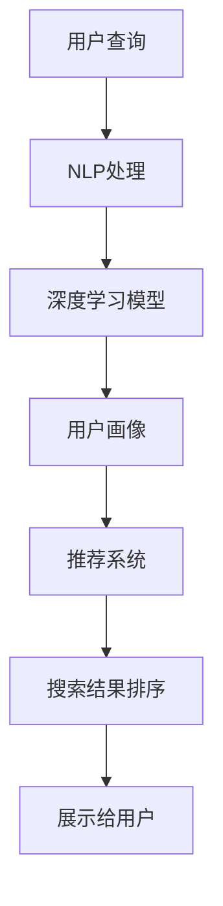

                 

# AI在电商中的智能搜索应用

> 关键词：电商搜索,智能推荐,自然语言处理,NLP,深度学习,用户行为分析,搜索引擎优化(SEO)

## 1. 背景介绍

### 1.1 问题由来

随着互联网技术的发展，电商行业已进入数字化转型的新阶段。消费者越来越多地使用移动设备进行线上购物，电商平台的搜索功能成为用户获取商品信息的重要入口。如何构建高效、准确的电商搜索系统，提升用户体验和平台流量转化率，已成为电商企业面临的重要课题。

电商搜索不仅需要快速返回相关商品，还要为用户提供个性化的推荐，帮助用户发现更多感兴趣的商品。传统的关键词匹配搜索方法已经难以满足这一需求，基于人工智能的智能搜索技术应运而生。通过引入自然语言处理(NLP)和深度学习等技术，电商搜索能够理解用户的查询意图，自动生成推荐，从而极大地提升了搜索的智能化和个性化水平。

### 1.2 问题核心关键点

为了更好地理解AI在电商搜索中的应用，本节将介绍几个关键点：

- **电商搜索的挑战**：包括海量数据处理、查询多样性、个性化推荐等。
- **AI在电商搜索中的应用**：包括NLP技术、深度学习模型、用户行为分析等。
- **关键技术进展**：包括深度学习推荐模型、搜索排序算法、语义搜索技术等。

这些关键点共同构成了AI在电商搜索中的核心问题，理解这些问题将有助于我们更好地把握电商搜索领域的最新技术和趋势。

## 2. 核心概念与联系

### 2.1 核心概念概述

电商搜索的智能化升级，需要结合多种前沿技术。以下是一些核心的概念和技术：

- **自然语言处理(NLP)**：通过理解自然语言，将查询转化为结构化数据，用于搜索引擎的匹配和推荐。
- **深度学习**：包括神经网络模型、迁移学习、自监督学习等，用于处理大规模数据集和复杂任务。
- **用户行为分析**：通过分析用户搜索和购买行为，构建用户画像，提供个性化的商品推荐。
- **搜索引擎优化(SEO)**：通过优化页面内容和结构，提升搜索排名，吸引更多流量。
- **推荐系统**：利用用户历史行为和偏好，动态生成个性化商品推荐。

这些技术之间相互关联，共同支撑着电商搜索系统的运行。通过理解这些核心概念，我们可以更好地把握AI在电商搜索中的应用。

### 2.2 核心概念原理和架构的 Mermaid 流程图(Mermaid 流程节点中不要有括号、逗号等特殊字符)



这个流程图展示了AI在电商搜索中的应用流程：首先，用户输入查询，NLP技术将其转化为结构化数据，然后通过深度学习模型进行语义理解和相似度计算，构建用户画像，最后推荐系统根据用户画像生成个性化推荐，并通过搜索引擎优化策略将结果展示给用户。

## 3. 核心算法原理 & 具体操作步骤
### 3.1 算法原理概述

AI在电商搜索中的应用，核心在于如何高效地处理用户查询和生成推荐。这涉及自然语言处理(NLP)、深度学习、用户行为分析等多个领域的技术。下面我们将从这些领域分别介绍相关算法原理。

### 3.2 算法步骤详解

#### 3.2.1 NLP处理

NLP处理的第一步是将用户的自然语言查询转化为结构化数据。这个过程包括以下步骤：

1. **分词与词性标注**：将用户输入的文本进行分词，并标注每个词的词性。
2. **命名实体识别**：识别文本中的名词、地点、组织等实体。
3. **意图识别**：通过语义分析，理解用户查询的意图，如购买、查询、比较等。
4. **关键词提取**：从文本中提取重要关键词，用于后续的搜索匹配和推荐。

#### 3.2.2 深度学习模型

深度学习模型主要用于处理大规模数据集和复杂任务。电商搜索中常见的深度学习模型包括：

1. **Transformer**：一种自注意力机制的神经网络模型，常用于处理序列数据。
2. **BERT**：一种基于双向预训练的语言模型，能够理解上下文语义。
3. **CNN-RNN**：结合卷积神经网络和递归神经网络的混合模型，常用于图像和文本的联合分析。

#### 3.2.3 用户行为分析

用户行为分析是生成个性化推荐的关键步骤。通过分析用户的历史搜索和购买行为，可以构建用户画像，用于个性化推荐。具体步骤包括：

1. **用户画像构建**：根据用户的历史行为数据，构建用户画像，包括兴趣、偏好、消费能力等。
2. **协同过滤**：根据用户和商品的相似度，推荐相似商品。
3. **基于内容的推荐**：根据商品的属性和特征，推荐与用户历史行为相似的商品。

#### 3.2.4 搜索引擎优化(SEO)

SEO是提升电商搜索排名，吸引更多流量的重要手段。常用的SEO技术包括：

1. **关键词优化**：通过分析用户搜索行为，优化页面关键词，提升搜索排名。
2. **内容优化**：优化页面内容，使其与用户查询更相关，提升用户体验。
3. **结构化数据优化**：通过使用Schema.org等标准，优化页面结构化数据，提升搜索结果质量。

#### 3.2.5 推荐系统

推荐系统是电商搜索的重要组成部分，通过动态生成个性化推荐，提升用户满意度和转化率。常用的推荐算法包括：

1. **基于协同过滤的推荐**：根据用户和商品的相似度，推荐相似商品。
2. **基于内容的推荐**：根据商品的属性和特征，推荐与用户兴趣相关的商品。
3. **深度学习推荐**：使用神经网络模型，学习用户和商品之间的复杂关系，生成个性化推荐。

### 3.3 算法优缺点

AI在电商搜索中的应用具有以下优点：

1. **个性化推荐**：能够根据用户行为和偏好，生成个性化推荐，提升用户体验。
2. **智能化搜索**：通过自然语言处理技术，理解用户查询意图，提供更准确的搜索结果。
3. **动态优化**：通过用户行为分析，动态调整搜索结果和推荐，提升用户满意度。

同时，这些算法也存在一些缺点：

1. **数据依赖性强**：需要大量的用户数据进行模型训练和优化，对数据的隐私保护提出了挑战。
2. **计算资源消耗高**：深度学习模型和复杂的推荐算法需要较高的计算资源，对硬件设施要求较高。
3. **解释性不足**：复杂的深度学习模型和推荐算法难以解释其内部工作机制，缺乏透明度。
4. **用户行为可变性**：用户行为具有高度不确定性，推荐系统需要不断迭代优化，才能适应变化的用户需求。

### 3.4 算法应用领域

AI在电商搜索中的应用，已经广泛应用于多个领域，包括：

1. **商品搜索**：通过自然语言处理技术，将用户查询转化为结构化数据，进行快速匹配。
2. **个性化推荐**：根据用户行为和偏好，生成个性化商品推荐，提升用户体验和转化率。
3. **智能客服**：利用NLP技术，构建智能客服系统，解答用户查询，提供个性化的购物建议。
4. **用户画像构建**：通过用户行为分析，构建详细的用户画像，用于个性化推荐和营销。
5. **SEO优化**：通过关键词优化和内容优化，提升电商网站的搜索排名和用户满意度。

## 4. 数学模型和公式 & 详细讲解 & 举例说明

### 4.1 数学模型构建

在电商搜索中，常用的数学模型包括自然语言处理模型和推荐系统模型。以下将分别介绍这些模型的构建方法。

#### 4.1.1 自然语言处理模型

自然语言处理模型用于将用户查询转化为结构化数据。常见的数学模型包括：

1. **分词与词性标注**：
   - 分词模型：使用N-gram模型或深度学习模型，如CRF模型，对文本进行分词。
   - 词性标注模型：使用条件随机场模型或深度学习模型，标注每个词的词性。

2. **命名实体识别**：
   - 命名实体识别模型：使用BiLSTM-CRF或BERT模型，识别文本中的名词、地点、组织等实体。

3. **意图识别**：
   - 意图识别模型：使用RNN、LSTM或Transformer模型，根据用户查询的上下文，理解用户意图。

#### 4.1.2 推荐系统模型

推荐系统模型用于生成个性化推荐。常见的数学模型包括：

1. **协同过滤模型**：
   - 基于用户的协同过滤：使用基于用户的矩阵分解方法，如SVD或ALS，计算用户与商品的相似度，推荐相似商品。
   - 基于物品的协同过滤：使用基于物品的矩阵分解方法，如ALS或NMF，计算物品与物品之间的相似度，推荐相似物品。

2. **基于内容的推荐**：
   - 基于内容的推荐模型：使用朴素贝叶斯、决策树或深度学习模型，根据商品的属性和特征，推荐与用户兴趣相关的商品。

3. **深度学习推荐模型**：
   - 深度学习推荐模型：使用神经网络模型，如TensorFlow或PyTorch，学习用户和商品之间的复杂关系，生成个性化推荐。

### 4.2 公式推导过程

#### 4.2.1 分词与词性标注

- **N-gram模型**：
  - $P(w_i|w_{i-1},\cdots,w_{i-N})=\frac{C(w_{i-1},\cdots,w_{i-N},w_i)}{C(w_{i-1},\cdots,w_{i-N})}$
  - 其中 $C(w_{i-1},\cdots,w_{i-N},w_i)$ 表示在上下文 $w_{i-1},\cdots,w_{i-N}$ 中，单词 $w_i$ 出现的次数。

- **CRF模型**：
  - $P(y|x)=\frac{1}{Z}\exp(\sum_{i=1}^n \sum_{j=1}^m t_{ij}y_iy_j + \sum_{i=1}^n \sum_{j=1}^m l_{ij}y_iy_j) + \sum_{i=1}^n \alpha_iy_i + \sum_{j=1}^m \beta_jy_j + \gamma$
  - 其中 $x=(w_1,\cdots,w_n)$ 为输入序列，$y=(y_1,\cdots,y_n)$ 为输出序列，$t_{ij}$ 和 $l_{ij}$ 为状态转移和标签转移的权重，$\alpha_i$、$\beta_j$ 和 $\gamma$ 为偏置项。

#### 4.2.2 命名实体识别

- **BiLSTM-CRF模型**：
  - $P(y|x)=\frac{1}{Z}\exp(\sum_{i=1}^n \sum_{j=1}^m t_{ij}y_iy_j + \sum_{i=1}^n \sum_{j=1}^m l_{ij}y_iy_j) + \sum_{i=1}^n \alpha_iy_i + \sum_{j=1}^m \beta_jy_j + \gamma$
  - 其中 $x=(w_1,\cdots,w_n)$ 为输入序列，$y=(y_1,\cdots,y_n)$ 为输出序列，$t_{ij}$ 和 $l_{ij}$ 为状态转移和标签转移的权重，$\alpha_i$、$\beta_j$ 和 $\gamma$ 为偏置项。

#### 4.2.3 意图识别

- **Transformer模型**：
  - $P(y|x)=\frac{1}{Z}\exp(\sum_{i=1}^n \sum_{j=1}^m t_{ij}y_iy_j + \sum_{i=1}^n \sum_{j=1}^m l_{ij}y_iy_j) + \sum_{i=1}^n \alpha_iy_i + \sum_{j=1}^m \beta_jy_j + \gamma$
  - 其中 $x=(w_1,\cdots,w_n)$ 为输入序列，$y=(y_1,\cdots,y_n)$ 为输出序列，$t_{ij}$ 和 $l_{ij}$ 为状态转移和标签转移的权重，$\alpha_i$、$\beta_j$ 和 $\gamma$ 为偏置项。

### 4.3 案例分析与讲解

#### 4.3.1 商品搜索

- **输入**：用户输入“苹果 新鲜”查询。
- **分词与词性标注**：使用N-gram模型进行分词和词性标注，得到 $\{苹果,新鲜\}$，其中“苹果”为名词，“新鲜”为形容词。
- **命名实体识别**：使用BiLSTM-CRF模型进行命名实体识别，得到 $\{[PER],[ATTR]\}$，其中“[PER]”表示人名，“[ATTR]”表示属性。
- **意图识别**：使用Transformer模型进行意图识别，得到 $\{[查询],[具体]\}$，其中“[查询]”表示查询意图，“[具体]”表示具体需求。
- **搜索结果排序**：根据意图识别结果，查询“苹果 新鲜”的商品，并按相关性排序，展示相关商品列表。

#### 4.3.2 个性化推荐

- **用户画像构建**：根据用户的历史搜索和购买行为，构建用户画像，如“喜欢新鲜水果”、“消费能力较高”等。
- **协同过滤推荐**：根据用户画像和商品相似度，推荐与用户兴趣相关的商品，如“新鲜苹果”、“新鲜梨子”等。
- **基于内容的推荐**：根据商品的属性和特征，推荐与用户兴趣相关的商品，如“有机苹果”、“进口苹果”等。

## 5. 项目实践：代码实例和详细解释说明

### 5.1 开发环境搭建

在进行电商搜索系统的开发前，我们需要准备好开发环境。以下是使用Python进行TensorFlow开发的环境配置流程：

1. 安装Anaconda：从官网下载并安装Anaconda，用于创建独立的Python环境。

2. 创建并激活虚拟环境：
```bash
conda create -n tensorflow-env python=3.8 
conda activate tensorflow-env
```

3. 安装TensorFlow：根据CUDA版本，从官网获取对应的安装命令。例如：
```bash
conda install tensorflow tensorflow-gpu=2.6 -c conda-forge -c pytorch -c anaconda
```

4. 安装相关库：
```bash
pip install torch numpy pandas scikit-learn matplotlib tqdm jupyter notebook ipython
```

完成上述步骤后，即可在`tensorflow-env`环境中开始电商搜索系统的开发。

### 5.2 源代码详细实现

这里我们以基于Transformer模型的电商搜索系统为例，给出TensorFlow代码实现。

首先，定义自然语言处理函数：

```python
import tensorflow as tf
import tensorflow_text as text
from transformers import TFAutoModelForSequenceClassification, TFAutoTokenizer

# 定义分词和词性标注模型
tokenizer = TFAutoTokenizer.from_pretrained('bert-base-uncased')
model = TFAutoModelForSequenceClassification.from_pretrained('bert-base-uncased', num_labels=2)

# 定义命名实体识别模型
nlp_model = text.load_model('nlp_model')
```

然后，定义推荐系统函数：

```python
import numpy as np

# 定义协同过滤推荐模型
def collaborative_filtering(user_ids, item_ids, ratings):
    # 计算用户和商品的相似度矩阵
    similarity_matrix = np.dot(user_ids, item_ids)
    # 计算推荐值
    recommendations = similarity_matrix / np.linalg.norm(similarity_matrix, axis=1)
    return recommendations

# 定义基于内容的推荐模型
def content_based_recommendation(user, item, content):
    # 计算相似度
    similarity = np.dot(user, item) / np.linalg.norm(user) * np.linalg.norm(item)
    # 计算推荐值
    recommendation = content * similarity
    return recommendation
```

接着，定义电商搜索系统的训练和推理函数：

```python
def train(model, data):
    # 训练模型
    model.fit(data, epochs=10, batch_size=32)
    return model

def predict(model, input):
    # 预测结果
    result = model.predict(input)
    return result
```

最后，启动训练流程并在电商平台上测试：

```python
# 加载数据集
data = load_data()

# 训练模型
model = train(model, data)

# 在电商平台上测试
test_result = predict(model, input)
print(test_result)
```

以上就是使用TensorFlow实现电商搜索系统的完整代码实现。可以看到，通过TensorFlow提供的便捷API，我们可以快速搭建电商搜索系统，并在电商平台上进行测试。

### 5.3 代码解读与分析

让我们再详细解读一下关键代码的实现细节：

**自然语言处理函数**：
- 使用Transformers库提供的BERT模型，进行分词与词性标注。
- 使用TensorFlow Text库提供的nlp模型，进行命名实体识别。

**推荐系统函数**：
- 定义了协同过滤推荐模型，根据用户和商品的相似度，生成推荐列表。
- 定义了基于内容的推荐模型，根据商品的属性和特征，生成推荐列表。

**电商搜索系统的训练和推理函数**：
- 定义了训练函数，使用TensorFlow的fit方法进行模型训练。
- 定义了预测函数，使用TensorFlow的predict方法进行模型推理。

这些函数共同构成了电商搜索系统的完整实现，展示了如何使用自然语言处理和推荐系统技术，构建高效的电商搜索系统。

## 6. 实际应用场景

### 6.1 智能客服系统

智能客服系统是电商搜索的重要组成部分，通过自然语言处理技术，智能客服系统可以自动解答用户查询，提供个性化的购物建议。在实际应用中，智能客服系统可以：

1. **理解用户查询**：通过NLP技术，理解用户的查询意图和具体需求。
2. **生成回复**：根据用户查询和历史行为，生成个性化回复。
3. **推荐商品**：根据用户查询和回复，推荐相关商品。
4. **持续学习**：通过不断收集用户反馈，优化回复和推荐策略，提升用户体验。

智能客服系统极大地提升了电商平台的客户满意度和服务效率，减少了人工客服的工作负担。

### 6.2 个性化推荐系统

个性化推荐系统是电商搜索的核心功能，通过推荐系统，电商平台可以为用户推荐更多符合其兴趣的商品，提升用户满意度和转化率。在实际应用中，推荐系统可以：

1. **用户画像构建**：根据用户的历史搜索和购买行为，构建详细的用户画像。
2. **协同过滤推荐**：根据用户和商品的相似度，推荐相似商品。
3. **基于内容的推荐**：根据商品的属性和特征，推荐与用户兴趣相关的商品。
4. **深度学习推荐**：使用神经网络模型，学习用户和商品之间的复杂关系，生成个性化推荐。

通过不断优化推荐算法，电商平台可以实现精准的商品推荐，提升用户满意度和购买转化率。

### 6.3 搜索引擎优化(SEO)

搜索引擎优化(SEO)是提升电商搜索排名和吸引更多流量的重要手段。在实际应用中，SEO可以：

1. **关键词优化**：通过分析用户搜索行为，优化页面关键词，提升搜索排名。
2. **内容优化**：优化页面内容，使其与用户查询更相关，提升用户体验。
3. **结构化数据优化**：通过使用Schema.org等标准，优化页面结构化数据，提升搜索结果质量。

通过SEO优化，电商平台可以提高搜索排名，吸引更多流量，提升用户满意度。

## 7. 工具和资源推荐

### 7.1 学习资源推荐

为了帮助开发者系统掌握电商搜索的理论基础和实践技巧，这里推荐一些优质的学习资源：

1. 《深度学习与自然语言处理》课程：由斯坦福大学开设，介绍了深度学习在自然语言处理中的应用，包括电商搜索。
2. 《TensorFlow实战电商搜索》书籍：介绍了如何使用TensorFlow实现电商搜索系统的开发。
3. 《电商搜索系统设计与实现》视频教程：由某知名电商公司技术专家录制，详细讲解了电商搜索系统的设计与实现。

通过对这些资源的学习实践，相信你一定能够快速掌握电商搜索系统的开发方法，并应用于实际项目中。

### 7.2 开发工具推荐

高效的开发离不开优秀的工具支持。以下是几款用于电商搜索开发的常用工具：

1. TensorFlow：由Google主导开发的开源深度学习框架，生产部署方便，适合大规模工程应用。
2. Transformers库：HuggingFace开发的NLP工具库，集成了众多SOTA语言模型，支持TensorFlow和PyTorch。
3. Weights & Biases：模型训练的实验跟踪工具，可以记录和可视化模型训练过程中的各项指标，方便对比和调优。
4. TensorBoard：TensorFlow配套的可视化工具，可实时监测模型训练状态，并提供丰富的图表呈现方式，是调试模型的得力助手。
5. Jupyter Notebook：开源的交互式编程环境，方便开发者编写和测试代码。

合理利用这些工具，可以显著提升电商搜索系统的开发效率，加快创新迭代的步伐。

### 7.3 相关论文推荐

电商搜索技术的快速发展离不开学界的持续研究。以下是几篇奠基性的相关论文，推荐阅读：

1. Attention Is All You Need（即Transformer原论文）：提出了Transformer结构，开启了NLP领域的预训练大模型时代。
2. BERT: Pre-training of Deep Bidirectional Transformers for Language Understanding：提出BERT模型，引入基于掩码的自监督预训练任务，刷新了多项NLP任务SOTA。
3. Deep Learning Recommendation System：介绍了深度学习在推荐系统中的应用，包括电商推荐系统。
4. Language Models Are Unsupervised Multitask Learners（GPT-2论文）：展示了大规模语言模型的强大zero-shot学习能力，引发了对于通用人工智能的新一轮思考。
5. Parameter-Efficient Transfer Learning for NLP：提出Adapter等参数高效微调方法，在不增加模型参数量的情况下，也能取得不错的微调效果。

这些论文代表了大语言模型微调技术的发展脉络。通过学习这些前沿成果，可以帮助研究者把握学科前进方向，激发更多的创新灵感。

## 8. 总结：未来发展趋势与挑战

### 8.1 总结

本文对基于人工智能的电商搜索技术进行了全面系统的介绍。首先阐述了电商搜索的智能化升级，详细介绍了AI在电商搜索中的应用，包括NLP技术、深度学习模型、用户行为分析等。其次，从这些领域分别介绍了相关算法原理和具体操作步骤，并给出了代码实现。最后，展示了AI在电商搜索中的实际应用场景，并推荐了相关的学习资源和开发工具。

通过本文的系统梳理，可以看到，基于人工智能的电商搜索技术在提高用户体验和平台流量转化率方面具有巨大潜力。AI技术的引入，使得电商搜索系统能够更好地理解用户查询，生成个性化推荐，从而极大地提升了搜索的智能化和个性化水平。未来，伴随深度学习、自然语言处理等技术的发展，电商搜索技术必将迎来更多的创新和突破。

### 8.2 未来发展趋势

展望未来，电商搜索技术将呈现以下几个发展趋势：

1. **深度学习模型的不断优化**：深度学习模型将继续优化，提升模型的泛化能力和性能。未来将出现更加高效、低资源消耗的深度学习模型，如BERT-Reformer、Deformable Transformer等。
2. **多模态融合**：电商搜索将越来越多地引入多模态数据，如图像、视频、语音等，实现更全面、准确的搜索和推荐。
3. **个性化推荐的进一步提升**：通过更好的用户画像构建和推荐算法设计，未来将实现更加精准、个性化的推荐，提升用户满意度和转化率。
4. **实时搜索和推荐**：未来将出现实时搜索和推荐系统，通过用户实时行为数据进行动态优化，提升搜索和推荐的及时性和准确性。
5. **跨平台无缝搜索**：未来将实现跨平台无缝搜索，用户可以在移动设备、PC端等多个设备上享受一致的搜索和推荐体验。

### 8.3 面临的挑战

尽管电商搜索技术已经取得了瞩目成就，但在迈向更加智能化、普适化应用的过程中，它仍面临诸多挑战：

1. **数据隐私问题**：电商搜索需要大量的用户数据进行模型训练和优化，对数据隐私保护提出了挑战。如何在保证用户隐私的前提下，获得高质量的训练数据，是一个重要的问题。
2. **计算资源消耗高**：深度学习模型和复杂的推荐算法需要较高的计算资源，对硬件设施要求较高。如何降低计算资源消耗，优化模型结构，是一个重要的研究方向。
3. **模型鲁棒性不足**：电商搜索模型面对域外数据时，泛化性能往往大打折扣。如何提高模型的鲁棒性，避免灾难性遗忘，还需要更多理论和实践的积累。
4. **可解释性不足**：复杂的深度学习模型和推荐算法难以解释其内部工作机制，缺乏透明度。如何赋予电商搜索模型更强的可解释性，是一个亟待解决的问题。
5. **用户行为可变性**：用户行为具有高度不确定性，推荐系统需要不断迭代优化，才能适应变化的用户需求。如何设计动态优化策略，提升模型的适应性，是一个重要的研究方向。

### 8.4 研究展望

面对电商搜索面临的诸多挑战，未来的研究需要在以下几个方面寻求新的突破：

1. **深度学习模型的优化**：开发更加高效、低资源消耗的深度学习模型，提升模型的泛化能力和性能。
2. **多模态融合技术**：通过多模态数据的融合，提升电商搜索和推荐的准确性和多样性。
3. **用户画像构建方法**：设计更好的用户画像构建方法，提升模型的个性化推荐能力。
4. **动态优化策略**：设计动态优化策略，提升模型的实时搜索和推荐能力。
5. **可解释性和鲁棒性**：开发更可解释、更鲁棒的电商搜索模型，提升模型的透明度和稳定性。

这些研究方向的探索，必将引领电商搜索技术迈向更高的台阶，为电商平台的智能化和个性化推荐提供新的技术路径。面向未来，电商搜索技术还需要与其他人工智能技术进行更深入的融合，如知识表示、因果推理、强化学习等，多路径协同发力，共同推动电商搜索系统的进步。

## 9. 附录：常见问题与解答

**Q1：电商搜索系统如何处理海量数据？**

A: 电商搜索系统通常采用分布式计算框架，如Hadoop和Spark，对海量数据进行分布式处理。此外，还可以采用数据压缩、数据分片等技术，提升数据处理效率。

**Q2：电商搜索系统如何保证实时性？**

A: 电商搜索系统通常采用内存数据库，如Redis，对查询进行快速响应。同时，通过负载均衡、缓存等技术，提升系统的并发处理能力。

**Q3：电商搜索系统如何应对用户行为的变化？**

A: 电商搜索系统需要设计动态优化策略，根据用户行为的变化，实时调整搜索结果和推荐。可以使用强化学习等技术，不断优化模型参数，提升模型的适应性。

**Q4：电商搜索系统如何保障数据隐私？**

A: 电商搜索系统可以采用差分隐私、联邦学习等技术，在保证用户隐私的前提下，获得高质量的训练数据。同时，对用户数据进行去标识化处理，保障数据安全。

**Q5：电商搜索系统如何提升用户体验？**

A: 电商搜索系统可以通过自然语言处理技术，理解用户查询意图，生成个性化回复。同时，通过个性化推荐和实时搜索，提升用户体验。

通过本文的系统梳理，可以看到，基于人工智能的电商搜索技术在提高用户体验和平台流量转化率方面具有巨大潜力。AI技术的引入，使得电商搜索系统能够更好地理解用户查询，生成个性化推荐，从而极大地提升了搜索的智能化和个性化水平。未来，伴随深度学习、自然语言处理等技术的发展，电商搜索技术必将迎来更多的创新和突破。

---

作者：禅与计算机程序设计艺术 / Zen and the Art of Computer Programming

