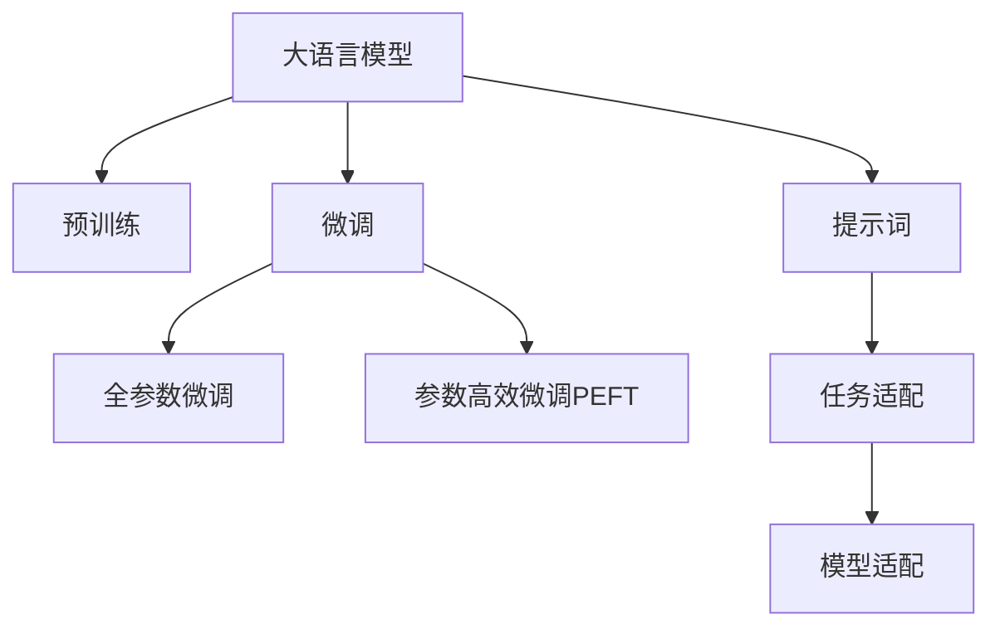

                 

# AI大模型Prompt提示词最佳实践：向我解释，就像我是新手一样

大语言模型（Large Language Models, LLMs）如GPT系列、BERT等，已经证明了其在处理自然语言处理任务上的强大能力。然而，尽管这些模型具有广泛的语言知识，但在面对某些复杂或具体的任务时，其表现可能不如预期。为了提高大语言模型在这些任务上的性能，**提示词（Prompt）**技术应运而生，成为连接模型和任务的关键桥梁。提示词是一种精心设计的文本模板，旨在引导模型理解输入的具体语境，并输出符合预期的结果。本文将系统地介绍大模型提示词的最佳实践，帮助用户有效利用提示词技术，提升模型的任务适应能力。

## 1. 背景介绍

### 1.1 问题由来

大语言模型在面对各种NLP任务时，尽管可以通过自监督学习获取大量通用语言知识，但在特定领域或特定类型的任务上，仍然可能面临表现不足的问题。这主要是由于以下原因：

- **泛化能力有限**：大语言模型往往缺乏领域特定的知识，无法有效泛化到新领域或新任务。
- **上下文理解不足**：模型在处理长文本或复杂任务时，可能无法捕捉到关键的上下文信息。
- **计算资源限制**：大规模模型的推理计算开销较大，无法实时处理所有类型和规模的任务。

为了克服这些限制，提示词技术被提出，用于在模型的输入中嵌入额外信息，帮助模型更好地理解任务和上下文。

### 1.2 问题核心关键点

提示词的核心思想是通过在输入文本中嵌入特定的语言线索，引导模型按照预期的方式生成输出。提示词的设计需要考虑以下几点：

- **任务适配性**：提示词应紧密对应特定任务的需求，如分类、生成、匹配等。
- **上下文引导**：提示词应提供足够的上下文信息，帮助模型理解输入文本的具体语境。
- **简洁性**：提示词应尽可能简洁明了，避免混淆模型。
- **可扩展性**：提示词应便于扩展和调整，以适应不同类型和规模的任务。

提示词技术的应用，使得大语言模型在各种任务上取得了显著的性能提升。无论是文本分类、摘要生成、对话系统、问答系统，还是代码生成等，提示词都能显著提升模型的效果。

## 2. 核心概念与联系

### 2.1 核心概念概述

为更好地理解提示词在大语言模型中的应用，本节将介绍几个密切相关的核心概念：

- **大语言模型（LLMs）**：指以自回归（如GPT系列）或自编码（如BERT）模型为代表的大规模预训练语言模型。通过在大规模无标签文本语料上进行预训练，学习通用的语言表示。

- **预训练（Pre-training）**：指在大规模无标签文本语料上，通过自监督学习任务训练通用语言模型的过程。常见的预训练任务包括言语建模、掩码语言模型等。

- **微调（Fine-tuning）**：指在预训练模型的基础上，使用下游任务的少量标注数据，通过有监督地训练来优化模型在特定任务上的性能。通常只需调整顶层分类器或解码器，并以较小的学习率更新全部或部分的模型参数。

- **提示词（Prompt）**：指在输入文本中添加的一段引导语，用于指导大语言模型理解输入的语境，并输出符合预期的结果。

- **模型适配（Model Adoption）**：指将大语言模型应用于特定领域或任务的过程。通过提示词，模型能够更好地理解新任务的特点，提高任务适应能力。

这些核心概念之间的逻辑关系可以通过以下Mermaid流程图来展示：



这个流程图展示了大语言模型的核心概念及其之间的关系：

1. 大语言模型通过预训练获得基础能力。
2. 微调是对预训练模型进行任务特定的优化，可以分为全参数微调和参数高效微调（PEFT）。
3. 提示词是一种不更新模型参数的方法，可以实现任务适配。
4. 模型适配是连接预训练模型与下游任务的桥梁，可以通过提示词来实现。

这些概念共同构成了大语言模型的学习和应用框架，使其能够在各种场景下发挥强大的语言理解和生成能力。通过理解这些核心概念，我们可以更好地把握大语言模型的工作原理和优化方向。

## 3. 核心算法原理 & 具体操作步骤

### 3.1 算法原理概述

提示词技术的核心思想是，通过在输入文本中添加一段引导语（即提示词），帮助大语言模型更好地理解输入的语境，并按照预期的方式生成输出。提示词的输入格式为 `<input>: <label>`，其中 `<input>` 是原始输入文本，`<label>` 是任务特定的标签或输出格式。

在大语言模型的前向传播过程中，输入文本 `<input>` 和提示词 `<label>` 将被同时输入模型，模型会先解析提示词，再对原始输入进行处理。最终，模型输出的结果将与提示词中的 `<label>` 进行比对，以评估模型的性能。

### 3.2 算法步骤详解

提示词技术在大语言模型中的应用，主要包括以下几个关键步骤：

**Step 1: 准备输入数据**

- 收集和标注任务所需的样本数据。样本数据应覆盖任务的不同类型和规模。
- 对样本数据进行预处理，如分词、去除停用词、标准化等。

**Step 2: 设计提示词**

- 根据任务需求，设计适合的提示词模板。提示词应尽量简洁明了，避免混淆模型。
- 对提示词进行微调，以获得更好的效果。微调方法包括但不限于搜索最优提示词模板、自动化提示词生成等。

**Step 3: 集成提示词**

- 将提示词集成到模型输入中，如在原始输入前或后添加提示词。
- 调整模型的超参数，如学习率、批大小、迭代轮数等，以适应提示词的加入。

**Step 4: 训练和评估**

- 使用提示词增强后的数据集对模型进行训练。
- 在验证集上评估模型性能，根据评估结果调整提示词模板或模型参数。
- 重复上述步骤直至模型性能达到预期。

**Step 5: 部署和应用**

- 将训练好的模型部署到实际应用系统中。
- 根据实际需求，对提示词进行调整和优化。
- 持续收集反馈数据，对提示词和模型进行迭代优化。

### 3.3 算法优缺点

提示词技术在大语言模型中的应用，具有以下优点：

- **任务适配性强**：提示词能够针对具体任务进行定制，提高模型在特定任务上的表现。
- **计算开销小**：提示词技术不增加额外的计算开销，可以在小规模数据上获得良好效果。
- **扩展性强**：提示词可以根据需求进行灵活调整，适应不同类型和规模的任务。

同时，提示词技术也存在一些局限性：

- **设计复杂**：设计合适的提示词模板需要一定的经验和技能，有时需要进行多次尝试和调整。
- **泛化能力有限**：提示词模板通常针对特定任务，在新任务上的效果可能不如预期。
- **依赖数据质量**：提示词的效果很大程度上取决于标注数据的质量和数量。

尽管存在这些局限性，提示词技术仍是大语言模型应用的重要补充，对于提高模型的任务适应能力具有显著作用。

### 3.4 算法应用领域

提示词技术在大语言模型的应用中，已被广泛用于各种NLP任务，包括但不限于：

- **文本分类**：如情感分析、主题分类、意图识别等。通过提示词引导模型理解输入文本的具体类别。
- **命名实体识别**：识别文本中的人名、地名、机构名等特定实体。通过提示词帮助模型理解实体边界和类型。
- **关系抽取**：从文本中抽取实体之间的语义关系。通过提示词引导模型理解实体和关系。
- **问答系统**：对自然语言问题给出答案。将问题-答案对作为提示词，引导模型生成回答。
- **文本摘要**：将长文本压缩成简短摘要。通过提示词帮助模型抓取文章要点。
- **对话系统**：使机器能够与人自然对话。将对话历史作为上下文，提示词引导模型生成回复。

除了上述这些经典任务外，提示词技术还被创新性地应用到更多场景中，如可控文本生成、代码生成、数据增强等，为NLP技术带来了全新的突破。

## 4. 数学模型和公式 & 详细讲解 & 举例说明

### 4.1 数学模型构建

提示词技术在大语言模型中的应用，可以通过以下数学模型进行描述：

假设模型为 $M_\theta$，输入文本为 $x$，提示词为 $p$，输出为 $y$。模型输出的概率分布为 $P(y|x,p)$，表示在输入 $x$ 和提示词 $p$ 的条件下，输出 $y$ 的概率。

模型的输出由输入 $x$ 和提示词 $p$ 共同决定。提示词的作用是通过引导模型理解输入的语境，影响模型的输出概率分布。

### 4.2 公式推导过程

以下我们以情感分析任务为例，推导提示词技术在大语言模型中的应用。

假设模型在输入文本 $x$ 上的输出为 $\hat{y}=M_{\theta}(x)$，表示模型对文本 $x$ 进行情感分析的概率分布。

通过引入提示词 $p$，模型的输出变为 $\hat{y}=M_{\theta}(x,p)$，表示在提示词 $p$ 的引导下，模型对文本 $x$ 进行情感分析的概率分布。

对于情感分析任务，常用的提示词模板为 `Sentence: <text>, Sentiment: <positive/negative>`，其中 `<text>` 为原始输入文本，`<positive/negative>` 为情感标签。

通过提示词模板，模型输出的概率分布变为 $P(\text{positive}|\text{Sentence}: x, \text{Sentiment}: \text{positive})$ 或 $P(\text{negative}|\text{Sentence}: x, \text{Sentiment}: \text{negative})$。

### 4.3 案例分析与讲解

以情感分析任务为例，提示词技术的具体应用过程如下：

**Step 1: 准备输入数据**

- 收集标注好情感标签的文本数据，如电影评论、产品评价等。
- 对文本数据进行预处理，如分词、去除停用词、标准化等。

**Step 2: 设计提示词**

- 设计提示词模板为 `Sentence: <text>, Sentiment: <positive/negative>`。
- 对提示词进行微调，以获得更好的效果。微调方法包括但不限于搜索最优提示词模板、自动化提示词生成等。

**Step 3: 集成提示词**

- 将提示词模板集成到模型输入中，如在原始输入前或后添加提示词。
- 调整模型的超参数，如学习率、批大小、迭代轮数等，以适应提示词的加入。

**Step 4: 训练和评估**

- 使用提示词增强后的数据集对模型进行训练。
- 在验证集上评估模型性能，根据评估结果调整提示词模板或模型参数。
- 重复上述步骤直至模型性能达到预期。

## 5. 项目实践：代码实例和详细解释说明

### 5.1 开发环境搭建

在进行提示词技术实践前，我们需要准备好开发环境。以下是使用Python进行PyTorch开发的环境配置流程：

1. 安装Anaconda：从官网下载并安装Anaconda，用于创建独立的Python环境。

2. 创建并激活虚拟环境：
```bash
conda create -n pytorch-env python=3.8 
conda activate pytorch-env
```

3. 安装PyTorch：根据CUDA版本，从官网获取对应的安装命令。例如：
```bash
conda install pytorch torchvision torchaudio cudatoolkit=11.1 -c pytorch -c conda-forge
```

4. 安装Transformers库：
```bash
pip install transformers
```

5. 安装各类工具包：
```bash
pip install numpy pandas scikit-learn matplotlib tqdm jupyter notebook ipython
```

完成上述步骤后，即可在`pytorch-env`环境中开始提示词技术的实践。

### 5.2 源代码详细实现

这里我们以情感分析任务为例，给出使用Transformers库对BERT模型进行提示词技术应用的PyTorch代码实现。

首先，定义情感分析任务的数据处理函数：

```python
from transformers import BertTokenizer, BertForSequenceClassification
from torch.utils.data import Dataset
import torch

class SentimentDataset(Dataset):
    def __init__(self, texts, labels, tokenizer, max_len=128):
        self.texts = texts
        self.labels = labels
        self.tokenizer = tokenizer
        self.max_len = max_len
        
    def __len__(self):
        return len(self.texts)
    
    def __getitem__(self, item):
        text = self.texts[item]
        label = self.labels[item]
        
        encoding = self.tokenizer(text, return_tensors='pt', max_length=self.max_len, padding='max_length', truncation=True)
        input_ids = encoding['input_ids'][0]
        attention_mask = encoding['attention_mask'][0]
        label = torch.tensor(label, dtype=torch.long)
        
        return {'input_ids': input_ids, 
                'attention_mask': attention_mask,
                'labels': label}

# 标签和id的映射
label2id = {'positive': 1, 'negative': 0}
id2label = {v: k for k, v in label2id.items()}

# 创建dataset
tokenizer = BertTokenizer.from_pretrained('bert-base-cased')

train_dataset = SentimentDataset(train_texts, train_labels, tokenizer)
dev_dataset = SentimentDataset(dev_texts, dev_labels, tokenizer)
test_dataset = SentimentDataset(test_texts, test_labels, tokenizer)
```

然后，定义模型和优化器：

```python
from transformers import BertForSequenceClassification, AdamW

model = BertForSequenceClassification.from_pretrained('bert-base-cased', num_labels=2)

optimizer = AdamW(model.parameters(), lr=2e-5)
```

接着，定义训练和评估函数：

```python
from torch.utils.data import DataLoader
from tqdm import tqdm
from sklearn.metrics import accuracy_score

device = torch.device('cuda') if torch.cuda.is_available() else torch.device('cpu')
model.to(device)

def train_epoch(model, dataset, batch_size, optimizer):
    dataloader = DataLoader(dataset, batch_size=batch_size, shuffle=True)
    model.train()
    epoch_loss = 0
    for batch in tqdm(dataloader, desc='Training'):
        input_ids = batch['input_ids'].to(device)
        attention_mask = batch['attention_mask'].to(device)
        labels = batch['labels'].to(device)
        model.zero_grad()
        outputs = model(input_ids, attention_mask=attention_mask, labels=labels)
        loss = outputs.loss
        epoch_loss += loss.item()
        loss.backward()
        optimizer.step()
    return epoch_loss / len(dataloader)

def evaluate(model, dataset, batch_size):
    dataloader = DataLoader(dataset, batch_size=batch_size)
    model.eval()
    preds, labels = [], []
    with torch.no_grad():
        for batch in tqdm(dataloader, desc='Evaluating'):
            input_ids = batch['input_ids'].to(device)
            attention_mask = batch['attention_mask'].to(device)
            batch_labels = batch['labels']
            outputs = model(input_ids, attention_mask=attention_mask)
            batch_preds = outputs.logits.argmax(dim=2).to('cpu').tolist()
            batch_labels = batch_labels.to('cpu').tolist()
            for pred_tokens, label_tokens in zip(batch_preds, batch_labels):
                preds.append(pred_tokens[:len(label_tokens)])
                labels.append(label_tokens)
                
    print('Accuracy:', accuracy_score(labels, preds))
```

最后，启动训练流程并在测试集上评估：

```python
epochs = 5
batch_size = 16

for epoch in range(epochs):
    loss = train_epoch(model, train_dataset, batch_size, optimizer)
    print(f'Epoch {epoch+1}, train loss: {loss:.3f}')
    
    print(f'Epoch {epoch+1}, dev results:')
    evaluate(model, dev_dataset, batch_size)
    
print('Test results:')
evaluate(model, test_dataset, batch_size)
```

以上就是使用PyTorch对BERT进行情感分析任务提示词技术应用的完整代码实现。可以看到，得益于Transformers库的强大封装，我们可以用相对简洁的代码完成BERT模型的加载和提示词技术的实现。

### 5.3 代码解读与分析

让我们再详细解读一下关键代码的实现细节：

**SentimentDataset类**：
- `__init__`方法：初始化文本、标签、分词器等关键组件。
- `__len__`方法：返回数据集的样本数量。
- `__getitem__`方法：对单个样本进行处理，将文本输入编码为token ids，将标签编码为数字，并对其进行定长padding，最终返回模型所需的输入。

**label2id和id2label字典**：
- 定义了标签与数字id之间的映射关系，用于将模型输出的预测结果解码回真实的标签。

**训练和评估函数**：
- 使用PyTorch的DataLoader对数据集进行批次化加载，供模型训练和推理使用。
- 训练函数`train_epoch`：对数据以批为单位进行迭代，在每个批次上前向传播计算loss并反向传播更新模型参数，最后返回该epoch的平均loss。
- 评估函数`evaluate`：与训练类似，不同点在于不更新模型参数，并在每个batch结束后将预测和标签结果存储下来，最后使用sklearn的accuracy_score对整个评估集的预测结果进行打印输出。

**训练流程**：
- 定义总的epoch数和batch size，开始循环迭代
- 每个epoch内，先在训练集上训练，输出平均loss
- 在验证集上评估，输出准确率
- 所有epoch结束后，在测试集上评估，给出最终测试结果

可以看到，PyTorch配合Transformers库使得BERT模型的提示词技术应用的代码实现变得简洁高效。开发者可以将更多精力放在数据处理、模型改进等高层逻辑上，而不必过多关注底层的实现细节。

当然，工业级的系统实现还需考虑更多因素，如模型的保存和部署、超参数的自动搜索、更灵活的任务适配层等。但核心的提示词技术基本与此类似。

## 6. 实际应用场景

### 6.1 智能客服系统

基于大语言模型提示词技术，可以广泛应用于智能客服系统的构建。传统客服往往需要配备大量人力，高峰期响应缓慢，且一致性和专业性难以保证。而使用提示词技术引导的对话模型，可以7x24小时不间断服务，快速响应客户咨询，用自然流畅的语言解答各类常见问题。

在技术实现上，可以收集企业内部的历史客服对话记录，将问题和最佳答复构建成提示词模板，在此基础上对预训练对话模型进行微调。微调后的对话模型能够自动理解用户意图，匹配最合适的答复模板进行回复。对于客户提出的新问题，还可以接入检索系统实时搜索相关内容，动态组织生成回答。如此构建的智能客服系统，能大幅提升客户咨询体验和问题解决效率。

### 6.2 金融舆情监测

金融机构需要实时监测市场舆论动向，以便及时应对负面信息传播，规避金融风险。传统的人工监测方式成本高、效率低，难以应对网络时代海量信息爆发的挑战。基于大语言模型提示词技术的文本分类和情感分析技术，为金融舆情监测提供了新的解决方案。

具体而言，可以收集金融领域相关的新闻、报道、评论等文本数据，并对其进行主题标注和情感标注。在此基础上对预训练语言模型进行微调，使其能够自动判断文本属于何种主题，情感倾向是正面、中性还是负面。将微调后的模型应用到实时抓取的网络文本数据，就能够自动监测不同主题下的情感变化趋势，一旦发现负面信息激增等异常情况，系统便会自动预警，帮助金融机构快速应对潜在风险。

### 6.3 个性化推荐系统

当前的推荐系统往往只依赖用户的历史行为数据进行物品推荐，无法深入理解用户的真实兴趣偏好。基于大语言模型提示词技术的个性化推荐系统可以更好地挖掘用户行为背后的语义信息，从而提供更精准、多样的推荐内容。

在实践中，可以收集用户浏览、点击、评论、分享等行为数据，提取和用户交互的物品标题、描述、标签等文本内容。将文本内容作为模型输入，用户的后续行为（如是否点击、购买等）作为监督信号，在此基础上微调预训练语言模型。微调后的模型能够从文本内容中准确把握用户的兴趣点。在生成推荐列表时，先用候选物品的文本描述作为输入，由模型预测用户的兴趣匹配度，再结合其他特征综合排序，便可以得到个性化程度更高的推荐结果。

### 6.4 未来应用展望

随着大语言模型和提示词技术的不断发展，基于提示词范式将在更多领域得到应用，为传统行业带来变革性影响。

在智慧医疗领域，基于提示词的医疗问答、病历分析、药物研发等应用将提升医疗服务的智能化水平，辅助医生诊疗，加速新药开发进程。

在智能教育领域，提示词技术可应用于作业批改、学情分析、知识推荐等方面，因材施教，促进教育公平，提高教学质量。

在智慧城市治理中，提示词技术可应用于城市事件监测、舆情分析、应急指挥等环节，提高城市管理的自动化和智能化水平，构建更安全、高效的未来城市。

此外，在企业生产、社会治理、文娱传媒等众多领域，基于大模型提示词技术的人工智能应用也将不断涌现，为经济社会发展注入新的动力。相信随着技术的日益成熟，提示词技术将成为大语言模型应用的重要范式，推动人工智能技术在垂直行业的规模化落地。

## 7. 工具和资源推荐

### 7.1 学习资源推荐

为了帮助开发者系统掌握大语言模型提示词技术的理论基础和实践技巧，这里推荐一些优质的学习资源：

1. 《Transformers从原理到实践》系列博文：由大模型技术专家撰写，深入浅出地介绍了Transformer原理、BERT模型、提示词技术等前沿话题。

2. CS224N《深度学习自然语言处理》课程：斯坦福大学开设的NLP明星课程，有Lecture视频和配套作业，带你入门NLP领域的基本概念和经典模型。

3. 《Natural Language Processing with Transformers》书籍：Transformers库的作者所著，全面介绍了如何使用Transformers库进行NLP任务开发，包括提示词技术在内的诸多范式。

4. HuggingFace官方文档：Transformers库的官方文档，提供了海量预训练模型和完整的提示词技术样例代码，是上手实践的必备资料。

5. CLUE开源项目：中文语言理解测评基准，涵盖大量不同类型的中文NLP数据集，并提供了基于提示词技术的baseline模型，助力中文NLP技术发展。

通过对这些资源的学习实践，相信你一定能够快速掌握大语言模型提示词技术的精髓，并用于解决实际的NLP问题。

### 7.2 开发工具推荐

高效的开发离不开优秀的工具支持。以下是几款用于大语言模型提示词技术开发的常用工具：

1. PyTorch：基于Python的开源深度学习框架，灵活动态的计算图，适合快速迭代研究。大部分预训练语言模型都有PyTorch版本的实现。

2. TensorFlow：由Google主导开发的开源深度学习框架，生产部署方便，适合大规模工程应用。同样有丰富的预训练语言模型资源。

3. Transformers库：HuggingFace开发的NLP工具库，集成了众多SOTA语言模型，支持PyTorch和TensorFlow，是进行提示词技术开发的利器。

4. Weights & Biases：模型训练的实验跟踪工具，可以记录和可视化模型训练过程中的各项指标，方便对比和调优。与主流深度学习框架无缝集成。

5. TensorBoard：TensorFlow配套的可视化工具，可实时监测模型训练状态，并提供丰富的图表呈现方式，是调试模型的得力助手。

6. Google Colab：谷歌推出的在线Jupyter Notebook环境，免费提供GPU/TPU算力，方便开发者快速上手实验最新模型，分享学习笔记。

合理利用这些工具，可以显著提升大语言模型提示词技术的开发效率，加快创新迭代的步伐。

### 7.3 相关论文推荐

大语言模型和提示词技术的发展源于学界的持续研究。以下是几篇奠基性的相关论文，推荐阅读：

1. Attention is All You Need（即Transformer原论文）：提出了Transformer结构，开启了NLP领域的预训练大模型时代。

2. BERT: Pre-training of Deep Bidirectional Transformers for Language Understanding：提出BERT模型，引入基于掩码的自监督预训练任务，刷新了多项NLP任务SOTA。

3. Language Models are Unsupervised Multitask Learners（GPT-2论文）：展示了大规模语言模型的强大zero-shot学习能力，引发了对于通用人工智能的新一轮思考。

4. Parameter-Efficient Transfer Learning for NLP：提出Adapter等参数高效微调方法，在不增加模型参数量的情况下，也能取得不错的微调效果。

5. Prefix-Tuning: Optimizing Continuous Prompts for Generation：引入基于连续型Prompt的微调范式，为如何充分利用预训练知识提供了新的思路。

6. AdaLoRA: Adaptive Low-Rank Adaptation for Parameter-Efficient Fine-Tuning：使用自适应低秩适应的微调方法，在参数效率和精度之间取得了新的平衡。

这些论文代表了大语言模型提示词技术的发展脉络。通过学习这些前沿成果，可以帮助研究者把握学科前进方向，激发更多的创新灵感。

## 8. 总结：未来发展趋势与挑战

### 8.1 研究成果总结

本文对基于提示词技术的大语言模型应用进行了全面系统的介绍。首先阐述了提示词技术的背景和重要性，明确了提示词在大模型应用中的独特价值。其次，从原理到实践，详细讲解了提示词技术的数学模型和操作步骤，给出了提示词技术应用的具体代码实现。同时，本文还探讨了提示词技术在智能客服、金融舆情、个性化推荐等多个行业领域的应用前景，展示了提示词技术的巨大潜力。此外，本文精选了提示词技术的各类学习资源，力求为读者提供全方位的技术指引。

通过本文的系统梳理，可以看到，提示词技术在大语言模型中的应用，使得模型在特定任务上的表现得到了显著提升。得益于提示词技术的灵活性和高效性，大语言模型在实际应用中得以更好地适应新领域、新任务，发挥其强大的语言理解和生成能力。

### 8.2 未来发展趋势

展望未来，提示词技术在大语言模型中的应用将呈现以下几个发展趋势：

1. **提示词设计自动化**：未来的提示词设计将更多依赖于自动化工具，通过数据驱动的方式，快速生成和优化提示词模板，提高设计效率。

2. **跨领域泛化能力**：提示词技术将不仅局限于特定领域，而是扩展到更广泛的领域和任务，提升模型的跨领域泛化能力。

3. **多模态融合**：提示词技术将更多地与图像、语音等多模态数据结合，实现视觉、语音、文本等多模态信息的协同建模，提升模型的综合理解能力。

4. **知识图谱整合**：提示词技术将与知识图谱、逻辑规则等专家知识结合，引导模型从结构化知识中学习，提升模型的逻辑推理和知识整合能力。

5. **数据自适应**：提示词技术将更多地利用自适应技术，根据实际数据特点，动态调整提示词模板，提升模型的数据适应能力。

6. **动态提示词生成**：提示词技术将更多地结合动态生成技术，根据输入数据动态调整提示词模板，提升模型的适应性和灵活性。

这些趋势凸显了提示词技术在大语言模型应用中的广阔前景。这些方向的探索发展，必将进一步提升提示词技术的性能和应用范围，为构建更加智能、灵活、可解释的人工智能系统铺平道路。

### 8.3 面临的挑战

尽管提示词技术在大语言模型中的应用已经取得了显著成效，但在迈向更加智能化、普适化应用的过程中，它仍面临着诸多挑战：

1. **提示词模板设计复杂**：设计合适的提示词模板需要一定的经验和技能，有时需要进行多次尝试和调整，特别是在复杂任务上。

2. **提示词泛化能力有限**：提示词模板通常针对特定任务，在新任务上的效果可能不如预期，提示词的泛化能力有待提升。

3. **依赖数据质量**：提示词技术的效果很大程度上取决于标注数据的质量和数量。低质量的标注数据可能导致提示词失效，模型性能下降。

4. **模型计算开销大**：提示词技术在大模型上的计算开销较大，特别是在处理长文本或复杂任务时，可能导致推理效率下降。

5. **模型过拟合**：提示词技术在处理长文本时，可能导致模型过拟合，降低模型的泛化能力。

6. **提示词模板过长**：提示词模板过长可能导致模型难以理解，降低模型的性能。

尽管存在这些挑战，提示词技术仍是大语言模型应用的重要补充，对于提高模型的任务适应能力具有显著作用。

### 8.4 研究展望

面对提示词技术面临的挑战，未来的研究需要在以下几个方面寻求新的突破：

1. **提示词自动化设计**：开发自动化工具，利用数据驱动的方式，快速生成和优化提示词模板，提高设计效率和效果。

2. **提示词泛化能力提升**：研究如何设计具有更强泛化能力的提示词模板，适应更广泛的任务和领域。

3. **数据增强与预训练**：利用数据增强和预训练技术，提升模型的数据适应能力和泛化能力。

4. **动态提示词生成**：研究动态生成提示词的技术，根据输入数据动态调整提示词模板，提升模型的灵活性和泛化能力。

5. **知识图谱与提示词结合**：研究如何将知识图谱与提示词结合，引导模型从结构化知识中学习，提升模型的逻辑推理和知识整合能力。

6. **跨领域泛化能力增强**：研究如何增强模型的跨领域泛化能力，提升模型在不同领域和任务上的表现。

这些研究方向的探索，必将引领提示词技术迈向更高的台阶，为构建安全、可靠、可解释、可控的智能系统提供新的思路和手段。

## 9. 附录：常见问题与解答

**Q1：如何设计合适的提示词模板？**

A: 设计合适的提示词模板需要考虑以下几个方面：
1. **任务适配性**：提示词应紧密对应特定任务的需求，如分类、生成、匹配等。
2. **上下文引导**：提示词应提供足够的上下文信息，帮助模型理解输入的语境。
3. **简洁性**：提示词应尽可能简洁明了，避免混淆模型。
4. **可扩展性**：提示词应便于扩展和调整，以适应不同类型和规模的任务。

具体来说，可以通过以下步骤设计提示词模板：
1. 了解任务需求和数据特点。
2. 设计符合任务需求的提示词模板，如分类任务可以用`Class: <class_name>; Input: <text>`。
3. 对提示词进行微调，以获得更好的效果。

**Q2：提示词技术是否适用于所有NLP任务？**

A: 提示词技术在大语言模型中的应用，在大多数NLP任务上都能取得不错的效果，特别是对于数据量较小的任务。但对于一些特定领域的任务，如医学、法律等，仅仅依靠通用语料预训练的模型可能难以很好地适应。此时需要在特定领域语料上进一步预训练，再进行微调，才能获得理想效果。此外，对于一些需要时效性、个性化很强的任务，如对话、推荐等，提示词方法也需要针对性的改进优化。

**Q3：提示词技术在落地部署时需要注意哪些问题？**

A: 将提示词技术应用于实际应用时，需要注意以下问题：
1. **模型裁剪**：去除不必要的层和参数，减小模型尺寸，加快推理速度。
2. **量化加速**：将浮点模型转为定点模型，压缩存储空间，提高计算效率。
3. **服务化封装**：将模型封装为标准化服务接口，便于集成调用。
4. **弹性伸缩**：根据请求流量动态调整资源配置，平衡服务质量和成本。
5. **监控告警**：实时采集系统指标，设置异常告警阈值，确保服务稳定性。
6. **安全防护**：采用访问鉴权、数据脱敏等措施，保障数据和模型安全。

合理利用这些技术手段，可以显著提升提示词技术在实际应用中的性能和稳定性。

---

作者：禅与计算机程序设计艺术 / Zen and the Art of Computer Programming

