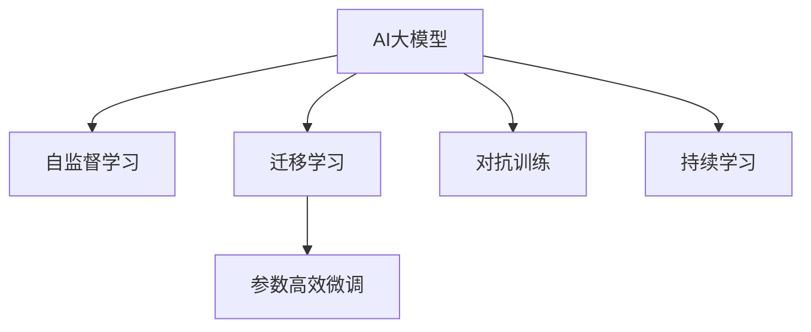

                 

# AI大模型创业：如何应对未来技术挑战？

> 关键词：AI大模型,创业,技术挑战,创新,市场策略

## 1. 背景介绍

随着人工智能技术的快速演进，AI大模型正成为各行业企业争相布局的战略资源。面对日益激烈的市场竞争和快速变化的技术环境，AI创业公司需要敏锐把握技术前沿，制定合理的市场策略，才能在激烈竞争中脱颖而出。本文将从大模型技术挑战、市场策略优化和创新路径选择等角度，探讨AI创业公司在创业过程中如何应对未来技术挑战。

## 2. 核心概念与联系

### 2.1 核心概念概述

为更好地理解AI大模型创业所面临的技术挑战，本节将介绍几个关键概念及其相互联系：

- AI大模型：指以Transformer等架构为基础，通过大规模无标签数据自监督预训练得到的多模态神经网络模型。如GPT、BERT等。
- 自监督学习：指在无标签数据上，通过设计自我标注任务(如掩码语言模型、自回归预测等)，训练出具有强大表示能力的模型。
- 迁移学习：指将预训练模型知识迁移到下游任务上进行微调，提升模型在新任务上的表现。
- 参数高效微调：指在微调过程中只更新少量参数，保持大部分预训练参数不变，以提高微调效率和泛化性能。
- 对抗训练：指通过对抗样本训练，提升模型的鲁棒性和泛化能力。
- 持续学习：指模型在实际应用中不断更新知识，适应数据分布变化，保持性能稳定。

这些概念之间的联系可以简明地用以下Mermaid流程图表示：



这个流程图展示了大模型从预训练到微调，再到实际应用的关键步骤和技术手段。

## 3. 核心算法原理 & 具体操作步骤
### 3.1 算法原理概述

AI大模型的核心算法原理基于自监督学习，通过大规模无标签数据预训练，学习到通用语言模型。然后通过迁移学习的方式，在特定任务上进行微调，提升模型在该任务上的表现。微调过程中，可以采用参数高效微调、对抗训练、持续学习等技术，进一步提升模型性能和泛化能力。

### 3.2 算法步骤详解

AI大模型创业过程中，从预训练到微调，再到市场应用，通常需要经过以下几个关键步骤：

**Step 1: 数据准备与模型选择**
- 准备足够的无标签数据，进行自监督预训练。
- 选择合适的预训练模型架构和初始化参数，如BERT、GPT等。

**Step 2: 任务适配与微调**
- 设计适当的任务适配层，如分类器、解码器等。
- 选择适宜的微调超参数，如学习率、批大小、优化器等。
- 执行梯度训练，更新模型参数，最小化损失函数。
- 进行评估和验证，确保模型性能达标。

**Step 3: 部署与持续学习**
- 将微调后的模型部署到生产环境。
- 定期收集新数据，持续训练模型，更新模型参数，适应数据分布变化。
- 对模型进行监控，确保性能稳定，及时发现和修复问题。

### 3.3 算法优缺点

AI大模型的迁移学习微调具有以下优点：
- 简单高效。仅需少量标注数据，即可实现模型适配。
- 通用性高。适用于各种NLP任务，包括分类、生成等。
- 泛化能力强。利用大规模预训练知识，模型具有较强的泛化能力。

但同时，也存在一些缺点：
- 依赖标注数据。微调性能取决于标注数据的质量和数量，标注成本较高。
- 过拟合风险。微调模型容易过度适应训练集，泛化性能不足。
- 模型复杂度高。大模型参数量庞大，训练和推理资源消耗大。

## 4. 数学模型和公式 & 详细讲解  
### 4.1 数学模型构建

AI大模型的数学模型构建基于神经网络架构，通常包括输入层、隐藏层、输出层。隐藏层包含多个Transformer块，每个块包含自注意力和前馈神经网络。模型训练的目标是最大化训练集上的损失函数。以分类任务为例，常用的损失函数包括交叉熵损失。

### 4.2 公式推导过程

假设有$N$个样本，每个样本的特征表示为$x_i$，标签表示为$y_i \in \{0,1\}$。预训练模型$M_{\theta}$的输出表示为$z=\text{softmax}(M_{\theta}(x_i))$，则分类任务上的交叉熵损失函数为：

$$
\mathcal{L}(\theta) = -\frac{1}{N} \sum_{i=1}^N [y_i\log z_i + (1-y_i)\log (1-z_i)]
$$

其中$\theta$表示模型参数，$z_i$表示模型对样本$x_i$进行分类的概率分布。

### 4.3 案例分析与讲解

以BERT模型为例，其微调过程包括以下几个步骤：
- 在预训练数据上学习语言表示，构建预训练模型$M_{\theta}$。
- 设计适当的任务适配层，如分类器。
- 选择适当的损失函数，如交叉熵损失。
- 更新模型参数，最小化损失函数。
- 在验证集上评估模型性能，调整超参数，完成微调。

## 5. 项目实践：代码实例和详细解释说明
### 5.1 开发环境搭建

开发环境搭建是AI大模型创业的重要基础，通常需要以下步骤：

1. 安装Python环境，包括Python、PyTorch、TensorFlow等深度学习框架。
2. 安装Transformers、NLTK等NLP相关库。
3. 安装Google Cloud、AWS等云服务平台，用于数据存储、模型训练和部署。
4. 搭建Kubernetes集群，实现模型和服务的高可用性。
5. 配置监控系统，如Prometheus、Grafana等，实时监控模型性能。

### 5.2 源代码详细实现

以下以BERT模型为例，演示其微调过程的代码实现：

```python
from transformers import BertForSequenceClassification, AdamW, BertTokenizerFast

# 加载预训练BERT模型和tokenizer
model = BertForSequenceClassification.from_pretrained('bert-base-uncased')
tokenizer = BertTokenizerFast.from_pretrained('bert-base-uncased')

# 准备训练数据
train_dataset = ...  # 具体实现，略

# 设置训练超参数
learning_rate = 2e-5
num_epochs = 5
batch_size = 16

# 定义优化器
optimizer = AdamW(model.parameters(), lr=learning_rate)

# 定义训练函数
def train_epoch(model, dataset, batch_size, optimizer):
    model.train()
    for batch in dataset:
        inputs, labels = batch
        model.zero_grad()
        outputs = model(**inputs)
        loss = outputs.loss
        loss.backward()
        optimizer.step()

# 训练模型
for epoch in range(num_epochs):
    train_epoch(model, train_dataset, batch_size, optimizer)

# 在验证集上评估模型
evaluation_result = ...  # 具体实现，略
```

### 5.3 代码解读与分析

这段代码实现了BERT模型在分类任务上的微调过程。具体步骤如下：
1. 加载预训练BERT模型和tokenizer。
2. 准备训练数据，包括样本和标签。
3. 设置训练超参数，如学习率、批量大小等。
4. 定义优化器，用于更新模型参数。
5. 定义训练函数，在每个epoch内进行一次epoch的训练。
6. 在验证集上评估模型性能，获得最终评估结果。

## 6. 实际应用场景
### 6.1 医疗健康

AI大模型在医疗健康领域有着广泛应用，如智能问诊、疾病诊断、药物研发等。以智能问诊为例，模型可以分析病人的症状、历史数据和医学知识，给出诊断和治疗建议，提升医疗服务的智能化水平。

### 6.2 金融投资

AI大模型在金融投资领域也有着重要应用，如股票分析、风险评估、量化交易等。模型可以利用海量金融数据和专业知识，进行精准预测，提升投资收益和风险管理水平。

### 6.3 智能制造

AI大模型在智能制造领域可以用于设备监控、质量检测、生产优化等。通过实时数据监测和分析，提升生产效率和产品质量，降低生产成本。

### 6.4 未来应用展望

未来，AI大模型将进一步扩展到更多行业领域，如教育、农业、能源等。利用大规模预训练知识，AI大模型能够实现高效、准确的推理和生成，推动各行各业智能化转型。

## 7. 工具和资源推荐
### 7.1 学习资源推荐

1. 《深度学习》：Ian Goodfellow、Yoshua Bengio、Aaron Courville等著。该书是深度学习领域的经典教材，详细介绍了深度学习的基本原理和算法。
2. 《自然语言处理综述》：Yoav Goldberg、Quoc V. Le、Rajarshi Gupta等著。该书涵盖了自然语言处理领域的最新进展，适合深入了解大模型的应用。
3. 《Transformers: A Survey on Architectures, Designs and Applications》：Thomas Wolf等著。该书介绍了Transformer架构的设计和应用，适合理解大模型的技术细节。
4. 《BERT: Pre-training of Deep Bidirectional Transformers for Language Understanding》：Jacob Devlin等著。该文介绍了BERT模型的预训练和微调方法，是了解大模型技术的必读文献。

### 7.2 开发工具推荐

1. PyTorch：高性能深度学习框架，支持动态计算图，易于迭代实验。
2. TensorFlow：谷歌开源的深度学习框架，支持静态计算图，适用于大规模工程部署。
3. TensorBoard：谷歌提供的可视化工具，可以实时监控模型训练和推理过程。
4. Amazon SageMaker：亚马逊云服务平台，提供完整的模型训练和部署工具链，适合企业级应用。
5. Google Cloud AI Platform：谷歌云服务平台，提供模型训练、推理和部署的完整工具链，适合企业级应用。

### 7.3 相关论文推荐

1. Attention is All You Need：提出Transformer架构，标志着大模型时代的到来。
2. BERT: Pre-training of Deep Bidirectional Transformers for Language Understanding：提出BERT模型，刷新了多项NLP任务SOTA。
3. Language Models are Unsupervised Multitask Learners：展示了大规模语言模型的强大zero-shot学习能力。
4. Parameter-Efficient Transfer Learning for NLP：提出Adapter等参数高效微调方法，提高了微调效率。
5. Prefix-Tuning: Optimizing Continuous Prompts for Generation：提出基于连续型Prompt的微调范式，提高了模型泛化能力。

## 8. 总结：未来发展趋势与挑战
### 8.1 研究成果总结

大模型技术在各个领域取得了显著进展，提升了各行各业的智能化水平。然而，在未来发展过程中，仍然面临一些挑战：
1. 标注数据获取成本高。预训练和微调都需要大量标注数据，标注成本较高。
2. 模型泛化能力有限。大模型可能过度适应训练集，泛化能力不足。
3. 训练和推理资源消耗大。大模型参数量庞大，训练和推理资源消耗大。
4. 模型可解释性不足。大模型通常缺乏可解释性，难以理解其内部工作机制。
5. 模型安全和伦理问题。模型可能学习到有害信息和偏见，产生误导性输出。

### 8.2 未来发展趋势

未来，大模型技术将继续快速发展，推动各行各业的智能化转型。具体趋势包括：
1. 模型规模持续增大。随着算力成本的下降和数据规模的扩张，预训练语言模型的参数量还将持续增长。
2. 微调方法更加多样化。未来将涌现更多参数高效微调方法，如Adapter、LoRA等。
3. 持续学习成为常态。模型需要不断学习新知识，适应数据分布变化。
4. 融合更多先验知识。符号化的先验知识将与神经网络模型结合，增强模型泛化能力。
5. 多模态微调崛起。模型将融合视觉、语音、文本等多模态信息，提升推理和生成能力。

### 8.3 面临的挑战

在未来大模型技术的发展过程中，仍然面临以下挑战：
1. 标注成本瓶颈。大模型微调仍需大量标注数据，标注成本较高。
2. 模型鲁棒性不足。模型可能对域外数据泛化能力不足，产生误导性输出。
3. 推理效率有待提高。大模型推理速度较慢，内存占用大，需要优化。
4. 可解释性不足。模型缺乏可解释性，难以理解其内部工作机制。
5. 安全性问题。模型可能学习有害信息和偏见，产生误导性输出。

### 8.4 研究展望

未来，AI大模型创业公司需要在以下方面进行持续创新：
1. 探索无监督和半监督微调方法，减少标注成本。
2. 研究参数高效和计算高效的微调范式，提高模型效率。
3. 引入更多先验知识，增强模型泛化能力。
4. 融合多模态数据，提升模型推理和生成能力。
5. 引入因果分析和博弈论工具，增强模型稳定性和鲁棒性。
6. 引入伦理道德约束，确保模型安全和可控性。

## 9. 附录：常见问题与解答

**Q1: AI大模型创业需要哪些关键资源？**

A: AI大模型创业需要以下关键资源：
1. 高性能计算资源，如GPU、TPU等。
2. 海量标注数据，用于预训练和微调。
3. 专业团队，包括数据科学家、工程师、产品经理等。
4. 丰富的学习资源，如书籍、论文、课程等。
5. 完善的开发工具和平台，如PyTorch、TensorFlow等。

**Q2: 如何选择合适的AI大模型架构？**

A: 选择合适的AI大模型架构需要考虑以下几个因素：
1. 任务需求。不同任务可能需要不同架构的模型，如分类任务可以使用BERT、GPT等。
2. 数据规模。数据规模越大，需要的模型参数量也越大。
3. 资源限制。计算资源和存储资源有限，需要选择合适的模型架构。
4. 性能要求。模型性能需要满足实际应用需求，如实时性、精度等。

**Q3: 如何提升AI大模型的推理效率？**

A: 提升AI大模型的推理效率需要以下几个方面的优化：
1. 模型压缩。通过剪枝、量化等方法，减小模型参数量，降低计算资源消耗。
2. 加速推理。通过优化计算图，提高推理速度。如使用TensorRT等推理加速工具。
3. 分布式推理。将模型分布在多个计算节点上，提高推理速度和扩展性。
4. 混合精度推理。将模型参数和数据转换为定点数，降低内存消耗和计算量。

**Q4: 如何提升AI大模型的鲁棒性？**

A: 提升AI大模型的鲁棒性需要以下几个方面的优化：
1. 数据增强。通过数据增强技术，增加数据多样性，提高模型泛化能力。
2. 对抗训练。引入对抗样本，提高模型的鲁棒性和泛化能力。
3. 参数高效微调。只更新少量参数，避免过拟合。
4. 模型融合。通过模型融合技术，提高模型鲁棒性和泛化能力。

**Q5: 如何确保AI大模型的可解释性？**

A: 确保AI大模型的可解释性需要以下几个方面的优化：
1. 模型设计。选择合适的模型架构和参数，确保模型的可解释性。
2. 可视化工具。使用可视化工具，如TensorBoard，监控模型训练过程。
3. 模型分解。将模型分解为多个子模块，分别解释各个模块的功能和输出。
4. 交互式解释。通过交互式解释工具，让用户可以实时理解模型的推理过程和结果。

总之，AI大模型创业需要在技术、市场、资源等多个方面进行持续创新和优化，才能在激烈的市场竞争中脱颖而出。未来，随着技术的不断进步，AI大模型将展现出更加广阔的应用前景和价值。

---

作者：禅与计算机程序设计艺术 / Zen and the Art of Computer Programming

