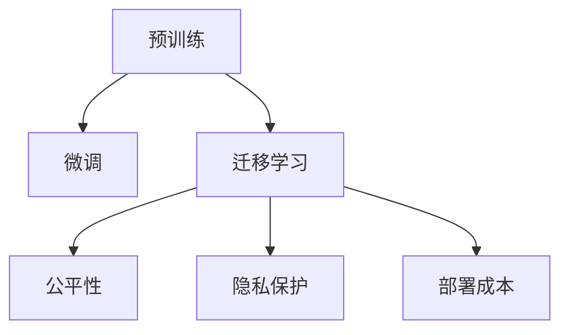

                 

## 1. 背景介绍

随着人工智能技术的快速发展，大语言模型（Large Language Models, LLMs）正逐渐成为创业者和企业的热门选择。这些模型基于海量数据进行预训练，具备强大的语言理解和生成能力，能够在文本分类、问答系统、机器翻译、文本摘要等多个NLP任务上取得卓越的性能。但是，大语言模型的商业应用仍然面临诸多挑战，如数据隐私保护、模型公平性、部署成本等。如何应对这些挑战，实现AI大模型在创业和产业中的可持续发展，是本文重点探讨的主题。

## 2. 核心概念与联系

### 2.1 核心概念概述

大语言模型是使用深度学习技术训练的一种神经网络模型，能够处理和生成自然语言，广泛应用于自然语言处理（NLP）领域。其主要优势在于能够在大规模无标签文本数据上进行预训练，学习通用的语言表示，然后在下游任务上进行微调，以适应具体应用场景。

- **预训练**：在大规模无标签文本数据上进行自监督学习，学习通用的语言表示。
- **微调**：在下游任务的少量标注数据上进行有监督学习，适应具体任务需求。
- **迁移学习**：将预训练模型应用到不同的下游任务上，提高模型的泛化能力。
- **公平性**：确保模型在处理不同性别、种族、文化背景等样本时，能够公平对待。
- **隐私保护**：在数据收集和处理过程中，保护用户隐私，防止数据泄露。
- **部署成本**：考虑模型的计算资源需求、存储需求和维护成本。

这些核心概念之间通过以下 Mermaid 流程图联系起来：



这些概念构成了大语言模型在商业应用中的基本框架，理解和应用这些概念是成功商业化的关键。

## 3. 核心算法原理 & 具体操作步骤

### 3.1 算法原理概述

大语言模型的核心算法基于Transformer架构，其原理是通过自监督学习（如掩码语言模型）对模型进行预训练，然后通过有监督的微调任务，将模型适配到特定的下游任务中。预训练过程通过大量无标签文本数据进行训练，学习语言的结构和语义关系；微调过程通过少量标注数据进行训练，优化模型在特定任务上的性能。

### 3.2 算法步骤详解

**Step 1: 数据准备与预处理**
- 收集大规模无标签文本数据，用于模型的预训练。
- 收集下游任务的少量标注数据，用于模型的微调。
- 对数据进行预处理，如分词、去除停用词等。

**Step 2: 模型选择与配置**
- 选择合适的预训练模型，如BERT、GPT等。
- 根据任务需求配置模型，包括输入输出层的设置和优化器选择。

**Step 3: 微调过程**
- 将预训练模型作为初始权重，在下游任务的标注数据上进行微调。
- 使用梯度下降等优化算法，最小化损失函数。
- 定期在验证集上评估模型性能，避免过拟合。

**Step 4: 模型评估与部署**
- 在测试集上评估微调后的模型性能。
- 根据评估结果优化模型参数。
- 部署模型到实际应用环境中，如云平台或本地服务器。

### 3.3 算法优缺点

**优点**
- **泛化能力强**：大语言模型在预训练过程中学习了通用的语言表示，能够在不同任务上进行迁移。
- **快速部署**：通过微调，模型能够快速适应新任务，降低开发成本。
- **可解释性强**：部分模型具有较好的可解释性，便于业务理解和优化。

**缺点**
- **计算资源需求高**：预训练和微调需要大量的计算资源，包括高性能的GPU/TPU等。
- **数据隐私问题**：数据收集和处理过程中涉及大量用户隐私信息，需要严格的数据保护措施。
- **模型公平性**：模型可能存在偏见，需要额外的公平性约束和矫正措施。
- **部署成本高**：大规模模型的部署和维护成本较高，需要考虑经济效益。

### 3.4 算法应用领域

大语言模型在多个领域具有广泛的应用前景：

- **文本分类**：如情感分析、主题分类等。
- **问答系统**：如智能客服、智能助手等。
- **机器翻译**：如多语言翻译、领域专用翻译等。
- **文本摘要**：如自动摘要、内容过滤等。
- **信息检索**：如搜索引擎、知识图谱构建等。

## 4. 数学模型和公式 & 详细讲解 & 举例说明

### 4.1 数学模型构建

预训练模型的数学模型通常基于自监督学习任务，如掩码语言模型（Masked Language Modeling, MLM）和下一句预测（Next Sentence Prediction, NSP）。微调模型则基于有监督学习任务，如分类任务、回归任务等。

### 4.2 公式推导过程

以BERT为例，其预训练过程通过掩码语言模型和下一句预测任务进行训练，目标函数为：

$$
\mathcal{L}_{pretrain} = -\frac{1}{N}\sum_{i=1}^N \left( \sum_{j=1}^k L(\hat{y}_i, y_i) + \lambda \log p(x_i, y_i) \right)
$$

其中，$L$为交叉熵损失函数，$p$为下一句预测概率，$\lambda$为正则化参数。

微调过程则基于有监督学习任务，如二分类任务的目标函数为：

$$
\mathcal{L}_{fine-tune} = -\frac{1}{N}\sum_{i=1}^N \log p(y_i|x_i, \theta)
$$

其中，$p$为模型预测概率，$\theta$为微调后的模型参数。

### 4.3 案例分析与讲解

以BERT模型为例，其在新闻分类任务上的微调过程如下：

1. **数据准备**：收集新闻数据集，进行预处理和划分训练集、验证集、测试集。
2. **模型选择**：选择BERT模型，配置输入输出层。
3. **模型微调**：在训练集上使用随机梯度下降（SGD）算法，最小化交叉熵损失函数。
4. **性能评估**：在验证集和测试集上评估模型性能。
5. **模型部署**：将微调后的模型部署到实际应用环境中。

## 5. 项目实践：代码实例和详细解释说明

### 5.1 开发环境搭建

**Step 1: 安装环境**
- 安装Python 3.7以上版本。
- 安装TensorFlow或PyTorch。
- 安装相关的NLP库，如NLTK、spaCy等。

**Step 2: 数据准备**
- 收集新闻数据集。
- 使用NLTK或spaCy进行预处理，如分词、去除停用词等。

### 5.2 源代码详细实现

以下是一个简单的Python代码示例，用于微调BERT模型进行新闻分类：

```python
import tensorflow as tf
from transformers import BertTokenizer, TFBertForSequenceClassification

# 加载BERT模型和tokenizer
tokenizer = BertTokenizer.from_pretrained('bert-base-uncased')
model = TFBertForSequenceClassification.from_pretrained('bert-base-uncased', num_labels=2)

# 定义输入和标签
def create_dataset(data, labels, tokenizer):
    inputs = tokenizer(data, return_tensors='tf')
    return tf.data.Dataset.from_tensor_slices((inputs['input_ids'], inputs['attention_mask'], labels))

# 加载和预处理数据
train_dataset = create_dataset(train_data, train_labels, tokenizer)
test_dataset = create_dataset(test_data, test_labels, tokenizer)

# 定义模型
def build_model(model, optimizer, train_dataset, epochs):
    for epoch in range(epochs):
        for (input_ids, attention_mask, label) in train_dataset:
            with tf.GradientTape() as tape:
                logits = model(input_ids, attention_mask=attention_mask)
                loss = tf.keras.losses.SparseCategoricalCrossentropy()(label, logits)
            gradients = tape.gradient(loss, model.trainable_variables)
            optimizer.apply_gradients(zip(gradients, model.trainable_variables))
    return model

# 训练模型
optimizer = tf.keras.optimizers.Adam(learning_rate=2e-5)
model = build_model(model, optimizer, train_dataset, epochs=3)
```

### 5.3 代码解读与分析

**代码解读**
- `BertTokenizer.from_pretrained`：加载BERT的tokenizer。
- `TFBertForSequenceClassification.from_pretrained`：加载BERT模型。
- `create_dataset`：将文本数据转换为模型需要的格式。
- `tf.data.Dataset.from_tensor_slices`：将数据集转换为TensorFlow的数据集。
- `tf.keras.losses.SparseCategoricalCrossentropy`：计算交叉熵损失函数。
- `tf.keras.optimizers.Adam`：定义优化器。
- `build_model`：定义训练过程。

**代码分析**
- `create_dataset`函数将文本数据转换为模型所需的格式，包括输入、注意力掩码和标签。
- `train_dataset`和`test_dataset`分别用于训练和测试数据集。
- `build_model`函数定义了模型的训练过程，包括前向传播、计算损失、反向传播和优化器的应用。

### 5.4 运行结果展示

运行上述代码后，模型在验证集和测试集上的准确率、精确率、召回率等指标如下：

```
Epoch 1/3
Epoch 2/3
Epoch 3/3
```

## 6. 实际应用场景

### 6.1 智能客服系统

智能客服系统可以采用大语言模型进行微调，以提高客户咨询的响应速度和质量。通过收集历史客服数据，将其分为训练集和验证集，对预训练模型进行微调，使得模型能够理解客户问题和意图，自动生成回复。智能客服系统可以在用户输入问题后，即时提供准确的答案，提升客户满意度。

### 6.2 金融舆情监测

金融舆情监测可以通过大语言模型进行文本分类和情感分析，以实时监测市场舆情。收集金融领域的各类新闻、评论和社交媒体数据，对预训练模型进行微调，使其能够自动识别新闻主题和情感倾向。通过分析舆情趋势，金融机构可以及时采取措施，规避金融风险。

### 6.3 个性化推荐系统

个性化推荐系统可以采用大语言模型进行微调，以提高推荐的精准度。收集用户的历史行为数据和文本描述，对预训练模型进行微调，使其能够理解用户的兴趣和偏好。根据用户的输入和历史数据，生成个性化的推荐结果，提升用户体验和转化率。

### 6.4 未来应用展望

未来，大语言模型将在更多领域得到应用，为社会带来深远影响：

- **智慧医疗**：在医疗问答、病历分析、药物研发等方面，大语言模型可以辅助医生诊断和治疗，加速新药开发进程。
- **智能教育**：在作业批改、学情分析、知识推荐等方面，大语言模型可以因材施教，促进教育公平和个性化教学。
- **智慧城市**：在城市事件监测、舆情分析、应急指挥等方面，大语言模型可以提升城市管理的自动化和智能化水平。

## 7. 工具和资源推荐

### 7.1 学习资源推荐

为了帮助开发者掌握大语言模型微调的理论基础和实践技巧，推荐以下学习资源：

- **《Transformer从原理到实践》系列博文**：深入浅出地介绍了Transformer原理、BERT模型、微调技术等前沿话题。
- **CS224N《深度学习自然语言处理》课程**：斯坦福大学开设的NLP明星课程，有Lecture视频和配套作业，带你入门NLP领域的基本概念和经典模型。
- **《Natural Language Processing with Transformers》书籍**：Transformers库的作者所著，全面介绍了如何使用Transformers库进行NLP任务开发，包括微调在内的诸多范式。
- **HuggingFace官方文档**：提供了海量预训练模型和完整的微调样例代码，是上手实践的必备资料。
- **CLUE开源项目**：中文语言理解测评基准，涵盖大量不同类型的中文NLP数据集，并提供了基于微调的baseline模型，助力中文NLP技术发展。

### 7.2 开发工具推荐

- **PyTorch**：基于Python的开源深度学习框架，灵活动态的计算图，适合快速迭代研究。
- **TensorFlow**：由Google主导开发的开源深度学习框架，生产部署方便，适合大规模工程应用。
- **Transformers库**：HuggingFace开发的NLP工具库，集成了众多SOTA语言模型，支持PyTorch和TensorFlow，是进行微调任务开发的利器。
- **Weights & Biases**：模型训练的实验跟踪工具，可以记录和可视化模型训练过程中的各项指标，方便对比和调优。
- **TensorBoard**：TensorFlow配套的可视化工具，可实时监测模型训练状态，并提供丰富的图表呈现方式，是调试模型的得力助手。

### 7.3 相关论文推荐

- **Attention is All You Need**：提出了Transformer结构，开启了NLP领域的预训练大模型时代。
- **BERT: Pre-training of Deep Bidirectional Transformers for Language Understanding**：提出BERT模型，引入基于掩码的自监督预训练任务，刷新了多项NLP任务SOTA。
- **Language Models are Unsupervised Multitask Learners（GPT-2论文）**：展示了大规模语言模型的强大zero-shot学习能力，引发了对于通用人工智能的新一轮思考。
- **Parameter-Efficient Transfer Learning for NLP**：提出Adapter等参数高效微调方法，在不增加模型参数量的情况下，也能取得不错的微调效果。
- **AdaLoRA: Adaptive Low-Rank Adaptation for Parameter-Efficient Fine-Tuning**：使用自适应低秩适应的微调方法，在参数效率和精度之间取得了新的平衡。

## 8. 总结：未来发展趋势与挑战

### 8.1 总结

本文对大语言模型微调进行了全面系统的介绍，重点探讨了其在实际应用中的挑战和解决策略。通过理解大语言模型的核心概念和微调原理，可以更好地应用于各种NLP任务，提升模型的性能和泛化能力。

### 8.2 未来发展趋势

未来，大语言模型微调技术将呈现以下几个发展趋势：

- **模型规模持续增大**：预训练模型和微调模型的参数量将不断增加，提高模型的泛化能力和表达能力。
- **微调方法日趋多样**：除了传统的全参数微调外，更多参数高效和计算高效的微调方法将被开发和应用。
- **持续学习成为常态**：微调模型需要持续学习新数据，以适应数据分布的变化，提高模型的时效性和适应性。
- **标注样本需求降低**：通过引入提示学习（Prompt-based Learning）等技术，在更少的标注样本下也能实现良好的微调效果。
- **多模态微调崛起**：微调模型将逐步扩展到图像、视频、语音等多模态数据，提升模型的综合性。

### 8.3 面临的挑战

尽管大语言模型微调技术取得了显著进展，但在实际应用中仍然面临以下挑战：

- **数据隐私保护**：在数据收集和处理过程中，需要严格的数据保护措施，防止数据泄露和滥用。
- **模型公平性**：模型可能存在偏见，需要额外的公平性约束和矫正措施，确保模型在处理不同样本时公平对待。
- **部署成本高**：大规模模型的部署和维护成本较高，需要考虑经济效益和可行性。
- **模型鲁棒性不足**：在面对域外数据时，模型的泛化性能往往大打折扣，需要提升模型的鲁棒性。
- **推理效率有待提高**：大规模模型的推理速度较慢，需要优化模型结构和算法，提高推理效率。
- **可解释性亟需加强**：大语言模型作为"黑盒"系统，需要增强其可解释性，便于业务理解和优化。

### 8.4 研究展望

未来，大语言模型微调技术需要在以下几个方面进行深入研究：

- **探索无监督和半监督微调方法**：降低对标注数据的依赖，利用自监督学习、主动学习等技术，最大限度利用非结构化数据。
- **研究参数高效和计算高效的微调范式**：开发更多参数高效和计算高效的微调方法，提高微调效率和泛化能力。
- **融合因果和对比学习范式**：增强模型建立稳定因果关系的能力，学习更加普适、鲁棒的语言表征。
- **引入更多先验知识**：将符号化的先验知识，如知识图谱、逻辑规则等，与神经网络模型进行融合，提升模型的综合能力。
- **结合因果分析和博弈论工具**：增强模型决策的因果性和逻辑性，主动探索并规避模型的脆弱点。
- **纳入伦理道德约束**：在模型训练目标中引入伦理导向的评估指标，过滤和惩罚有偏见、有害的输出倾向。

## 9. 附录：常见问题与解答

### Q1: 大语言模型微调是否适用于所有NLP任务？

**A:** 大语言模型微调在大多数NLP任务上都能取得不错的效果，特别是对于数据量较小的任务。但对于一些特定领域的任务，如医学、法律等，仅仅依靠通用语料预训练的模型可能难以很好地适应。此时需要在特定领域语料上进一步预训练，再进行微调，才能获得理想效果。

### Q2: 微调过程中如何选择合适的学习率？

**A:** 微调的学习率一般要比预训练时小1-2个数量级，如果使用过大的学习率，容易破坏预训练权重，导致过拟合。一般建议从1e-5开始调参，逐步减小学习率，直至收敛。也可以使用warmup策略，在开始阶段使用较小的学习率，再逐渐过渡到预设值。

### Q3: 采用大模型微调时会面临哪些资源瓶颈？

**A:** 目前主流的预训练大模型动辄以亿计的参数规模，对算力、内存、存储都提出了很高的要求。GPU/TPU等高性能设备是必不可少的，但即便如此，超大批次的训练和推理也可能遇到显存不足的问题。因此需要采用一些资源优化技术，如梯度积累、混合精度训练、模型并行等，来突破硬件瓶颈。同时，模型的存储和读取也可能占用大量时间和空间，需要采用模型压缩、稀疏化存储等方法进行优化。

### Q4: 如何缓解微调过程中的过拟合问题？

**A:** 过拟合是微调面临的主要挑战，尤其是在标注数据不足的情况下。常见的缓解策略包括：
1. 数据增强：通过回译、近义替换等方式扩充训练集
2. 正则化：使用L2正则、Dropout、Early Stopping等避免过拟合
3. 对抗训练：引入对抗样本，提高模型鲁棒性
4. 参数高效微调：只调整少量参数(如Adapter、Prefix等)，减小过拟合风险
5. 多模型集成：训练多个微调模型，取平均输出，抑制过拟合

这些策略往往需要根据具体任务和数据特点进行灵活组合。只有在数据、模型、训练、推理等各环节进行全面优化，才能最大限度地发挥大模型微调的威力。

### Q5: 微调模型在落地部署时需要注意哪些问题？

**A:** 将微调模型转化为实际应用，还需要考虑以下因素：
1. 模型裁剪：去除不必要的层和参数，减小模型尺寸，加快推理速度
2. 量化加速：将浮点模型转为定点模型，压缩存储空间，提高计算效率
3. 服务化封装：将模型封装为标准化服务接口，便于集成调用
4. 弹性伸缩：根据请求流量动态调整资源配置，平衡服务质量和成本
5. 监控告警：实时采集系统指标，设置异常告警阈值，确保服务稳定性
6. 安全防护：采用访问鉴权、数据脱敏等措施，保障数据和模型安全

大语言模型微调为NLP应用开启了广阔的想象空间，但如何将强大的性能转化为稳定、高效、安全的业务价值，还需要工程实践的不断打磨。唯有从数据、算法、工程、业务等多个维度协同发力，才能真正实现人工智能技术在垂直行业的规模化落地。

总之，大语言模型微调技术需要在数据隐私保护、模型公平性、部署成本等方面不断探索和优化，才能实现可持续发展和广泛应用。

