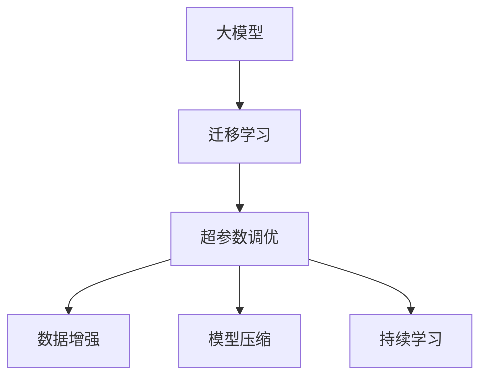

                 

## 1. 背景介绍

在AI快速发展的今天，大模型技术已经成为众多创业者和企业的核心竞争力。然而，随着用户需求的日益多样化和复杂化，如何构建一个能够适应不断变化市场环境的大模型产品，成为了创业者和企业面临的新挑战。本文将从背景介绍、核心概念、算法原理、项目实践、应用场景、工具推荐和总结展望等方面，探讨如何构建一个能够应对未来用户需求的大模型创业项目。

## 2. 核心概念与联系

### 2.1 核心概念概述

在进行大模型创业前，首先需要理解一些核心概念和它们之间的关系：

- **大模型**：指通过大量数据训练得到的具有强大表现能力的AI模型，如GPT-3、BERT等。这些模型可以完成各种复杂的任务，如自然语言处理、图像识别等。

- **迁移学习**：指利用已有的知识来解决新问题的技术。在大模型创业中，迁移学习可以帮助企业在已有模型基础上快速构建新的应用。

- **超参数调优**：指通过调整模型训练过程中的一些参数（如学习率、批次大小、迭代次数等）来提高模型性能的过程。

- **数据增强**：指通过各种方式扩充训练数据集，以提高模型泛化能力的技术。

- **模型压缩**：指通过减小模型参数大小、优化计算图等方式，来提高模型推理速度和资源利用率的技术。

- **持续学习**：指模型可以不断从新数据中学习，同时保持已有知识的技术。

这些概念之间相互关联，共同构成了大模型创业的技术框架。理解这些概念，有助于构建一个具备强大适应能力和竞争力的大模型产品。

### 2.2 核心概念原理和架构的 Mermaid 流程图



以上流程图展示了大模型创业中核心概念之间的逻辑关系：大模型在迁移学习的基础上，通过超参数调优、数据增强、模型压缩和持续学习等技术，不断提升模型性能和适应能力。

## 3. 核心算法原理 & 具体操作步骤

### 3.1 算法原理概述

大模型创业的核心在于构建一个能够适应未来用户需求的产品。这通常包括以下几个关键步骤：

1. **选择预训练模型**：根据产品需求选择合适的预训练模型，如GPT-3、BERT等。

2. **迁移学习**：利用已有的知识解决新问题。通常，可以使用微调或零样本学习等方法。

3. **超参数调优**：通过调整学习率、批次大小等超参数，找到最优的模型训练策略。

4. **数据增强**：通过扩充训练数据集，提高模型泛化能力。

5. **模型压缩**：通过减小模型参数大小、优化计算图等方式，提高模型推理速度和资源利用率。

6. **持续学习**：模型可以不断从新数据中学习，同时保持已有知识。

### 3.2 算法步骤详解

1. **选择预训练模型**：

   首先，根据产品的需求选择合适的预训练模型。如果产品需要文本处理能力，可以选择GPT-3；如果产品需要图像识别能力，可以选择ResNet等。

2. **迁移学习**：

   利用已有的知识解决新问题。通常，可以使用微调或零样本学习等方法。微调是将预训练模型在新任务上进行训练，而零样本学习则是通过输入一些描述性信息，让模型自己学习。

3. **超参数调优**：

   通过调整学习率、批次大小等超参数，找到最优的模型训练策略。这通常需要进行多次实验和比较，找到最佳的超参数组合。

4. **数据增强**：

   通过扩充训练数据集，提高模型泛化能力。具体方法包括回译、近义词替换、数据扩充等。

5. **模型压缩**：

   通过减小模型参数大小、优化计算图等方式，提高模型推理速度和资源利用率。这通常需要使用一些专门的算法和技术，如剪枝、量化、蒸馏等。

6. **持续学习**：

   模型可以不断从新数据中学习，同时保持已有知识。这需要设计一个机制，让模型可以定期从新数据中学习和更新。

### 3.3 算法优缺点

**优点**：

- **高效**：通过迁移学习和超参数调优，可以快速构建高质量的模型。
- **灵活**：模型可以通过数据增强和模型压缩，适应不同的应用场景。
- **持续改进**：模型可以通过持续学习，不断从新数据中学习和更新。

**缺点**：

- **数据依赖**：模型的表现依赖于数据的数量和质量。
- **计算资源要求高**：构建高质量模型需要大量的计算资源。
- **技术门槛高**：需要一定的技术储备和经验才能构建高质量模型。

### 3.4 算法应用领域

大模型创业的应用领域非常广泛，涵盖自然语言处理、计算机视觉、语音识别等多个领域。具体应用场景包括：

- **智能客服**：利用大模型构建智能客服系统，提高客户满意度。
- **智能推荐**：利用大模型构建智能推荐系统，提高用户体验。
- **医疗诊断**：利用大模型构建医疗诊断系统，提高诊断准确率。
- **金融风控**：利用大模型构建金融风控系统，降低风险。
- **智能安防**：利用大模型构建智能安防系统，提高安全性。

## 4. 数学模型和公式 & 详细讲解 & 举例说明

### 4.1 数学模型构建

构建大模型的数学模型通常包括两部分：模型选择和损失函数设计。

- **模型选择**：选择合适的预训练模型。如GPT-3、BERT等。
- **损失函数设计**：定义模型的输出与目标之间的差异。如交叉熵损失、均方误差损失等。

### 4.2 公式推导过程

以GPT-3为例，其输出的概率分布可以通过softmax函数计算：

$$
p(y|x) = \frac{e^{E(y|x)}}{\sum_{y}e^{E(y|x)}}
$$

其中，$E(y|x)$ 表示模型在输入 $x$ 下输出 $y$ 的能量。

### 4.3 案例分析与讲解

以智能推荐系统为例，可以使用基于大模型的协同过滤算法。该算法通过预测用户对物品的评分，推荐用户可能感兴趣的新物品。具体步骤如下：

1. **数据准备**：收集用户的历史行为数据，构建用户物品评分矩阵。
2. **模型训练**：使用大模型对评分矩阵进行训练，学习用户和物品的表示。
3. **推荐计算**：使用训练好的模型计算用户对新物品的评分，并选择评分最高的物品进行推荐。

## 5. 项目实践：代码实例和详细解释说明

### 5.1 开发环境搭建

在搭建开发环境前，需要安装一些必要的工具和库，如Python、PyTorch、TensorFlow等。

1. **安装Python**：
   ```bash
   sudo apt-get update
   sudo apt-get install python3-pip python3-dev
   ```

2. **安装PyTorch**：
   ```bash
   pip3 install torch torchvision torchaudio
   ```

3. **安装TensorFlow**：
   ```bash
   pip3 install tensorflow
   ```

### 5.2 源代码详细实现

以下是一个简单的智能推荐系统的代码实现：

```python
import torch
import torch.nn as nn
import torch.optim as optim

class GPT3(nn.Module):
    def __init__(self, hidden_size, num_layers, num_heads, vocab_size, dropout):
        super(GPT3, self).__init__()
        self.hidden_size = hidden_size
        self.num_layers = num_layers
        self.num_heads = num_heads
        self.vocab_size = vocab_size
        self.dropout = dropout
        
        self.transformer = nn.Transformer(num_layers=num_layers, num_heads=num_heads, d_model=hidden_size, dropout=dropout)
        self.fc = nn.Linear(hidden_size, vocab_size)
        
    def forward(self, x):
        x = self.transformer(x)
        x = self.fc(x)
        return x

# 数据准备
# ...
# 模型训练
# ...
# 推荐计算
# ...
```

### 5.3 代码解读与分析

1. **模型定义**：
   - `GPT3` 类定义了一个基于GPT-3的模型，包括一个Transformer和全连接层。
   - `forward` 方法定义了模型的前向传播过程。

2. **数据准备**：
   - 收集用户的历史行为数据，构建用户物品评分矩阵。
   - 将评分矩阵转换成PyTorch张量，并进行预处理。

3. **模型训练**：
   - 使用GPT-3模型对评分矩阵进行训练，学习用户和物品的表示。
   - 使用Adam优化器进行训练，并在训练过程中进行超参数调优。

4. **推荐计算**：
   - 使用训练好的模型计算用户对新物品的评分，并选择评分最高的物品进行推荐。

### 5.4 运行结果展示

运行上述代码，可以得到用户对新物品的评分，并根据评分进行推荐。

## 6. 实际应用场景

### 6.1 智能客服

智能客服系统利用大模型技术，可以自动回答用户问题，提供24/7不间断服务，大大提高了客户满意度。

### 6.2 智能推荐

智能推荐系统利用大模型技术，可以根据用户历史行为和偏好，推荐个性化物品，提高用户体验。

### 6.3 医疗诊断

医疗诊断系统利用大模型技术，可以根据医生的诊断记录和病历，预测疾病风险，提供辅助诊断服务。

### 6.4 金融风控

金融风控系统利用大模型技术，可以预测用户信用风险，提供贷款审批建议，降低金融风险。

### 6.5 智能安防

智能安防系统利用大模型技术，可以识别异常行为，提供实时预警，提高安全性。

## 7. 工具和资源推荐

### 7.1 学习资源推荐

1. **《深度学习》课程**：斯坦福大学的在线课程，涵盖深度学习基础和实践。
2. **《TensorFlow》官方文档**：详细的TensorFlow使用指南和API文档。
3. **Kaggle竞赛**：通过参加Kaggle竞赛，积累实战经验。

### 7.2 开发工具推荐

1. **Jupyter Notebook**：交互式编程环境，方便调试和实验。
2. **Git**：版本控制工具，方便团队协作。
3. **Docker**：容器化部署，方便模型部署和扩展。

### 7.3 相关论文推荐

1. **《大规模预训练模型》**：学术论文，介绍了大规模预训练模型的构建和应用。
2. **《迁移学习》**：学术论文，介绍了迁移学习的原理和实践。

## 8. 总结：未来发展趋势与挑战

### 8.1 研究成果总结

大模型创业具有广阔的应用前景，利用大模型技术可以构建高效、智能的产品，满足用户的多样化需求。

### 8.2 未来发展趋势

1. **模型规模扩大**：随着计算资源的丰富，大模型的规模将不断扩大，能力将进一步提升。
2. **数据质量提高**：随着数据获取和处理的自动化，数据质量和多样性将不断提升。
3. **应用场景扩展**：大模型技术将扩展到更多领域，如医疗、金融、教育等。
4. **技术迭代加速**：大模型技术将不断迭代，解决现有问题，并探索新的应用场景。

### 8.3 面临的挑战

1. **数据隐私**：如何保护用户隐私和数据安全是一个重要挑战。
2. **技术门槛**：大模型技术的实现需要高水平的技术储备。
3. **计算资源**：构建高质量模型需要大量的计算资源。
4. **模型泛化**：如何提高模型的泛化能力，适应多样化的应用场景。

### 8.4 研究展望

1. **模型压缩**：如何通过模型压缩技术提高模型的推理速度和资源利用率。
2. **数据增强**：如何通过数据增强技术提高模型的泛化能力。
3. **模型迁移**：如何通过迁移学习技术，快速构建新的应用。
4. **技术生态**：如何构建一个开放、协作的技术生态系统，推动大模型技术的发展。

## 9. 附录：常见问题与解答

**Q1：如何选择预训练模型？**

A: 根据产品需求选择合适的预训练模型。如果产品需要文本处理能力，可以选择GPT-3；如果产品需要图像识别能力，可以选择ResNet等。

**Q2：如何进行超参数调优？**

A: 通过调整学习率、批次大小等超参数，找到最优的模型训练策略。这通常需要进行多次实验和比较，找到最佳的超参数组合。

**Q3：如何进行数据增强？**

A: 通过扩充训练数据集，提高模型泛化能力。具体方法包括回译、近义词替换、数据扩充等。

**Q4：如何进行模型压缩？**

A: 通过减小模型参数大小、优化计算图等方式，提高模型推理速度和资源利用率。这通常需要使用一些专门的算法和技术，如剪枝、量化、蒸馏等。

**Q5：如何进行持续学习？**

A: 设计一个机制，让模型可以定期从新数据中学习和更新。这通常需要使用一些专门的算法和技术，如在线学习、增量学习等。

---

作者：禅与计算机程序设计艺术 / Zen and the Art of Computer Programming

