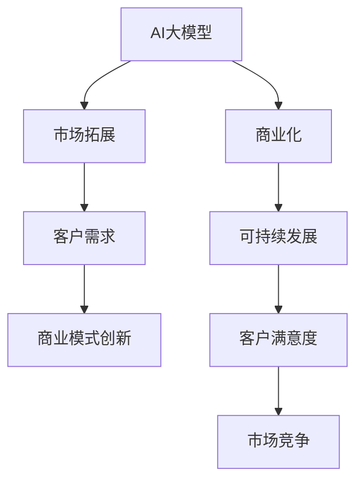

                 

# AI大模型创业：如何构建未来可持续的商业模式？

> 关键词：AI大模型,商业化策略,可持续性,市场拓展,客户需求,商业模式创新

## 1. 背景介绍

### 1.1 问题由来

近年来，随着人工智能技术的迅猛发展，特别是深度学习和大模型（Large Model）的突破，AI技术已经开始逐渐从实验室走向实际应用，推动了各行各业的数字化转型。然而，尽管AI大模型在技术上取得了巨大进展，但其商业化之路却仍然面临诸多挑战。

一方面，AI大模型的训练和应用需要巨大的数据和计算资源，而这些资源的获取和维护成本非常高。另一方面，AI大模型需要精细化的业务理解和实际落地场景，仅仅依靠技术本身往往难以形成有效的商业变现模式。

本文将聚焦于AI大模型创业的商业化策略，探讨如何构建未来可持续的商业模式，以期为AI初创企业提供一些实用的指导。

### 1.2 问题核心关键点

AI大模型创业的核心关键点在于：

- **技术优势与市场需求的结合**：如何通过AI大模型解决实际业务问题，满足客户需求，实现技术的商业化价值。
- **资源的有效管理**：如何优化数据和计算资源的利用，降低成本，实现商业模式的可持续性。
- **客户与市场的双重优化**：如何通过有效的市场拓展策略和客户管理机制，确保商业模式的长期稳定发展。
- **商业模式创新**：如何探索新的业务模式，如订阅服务、API服务、咨询顾问等，实现收入多元化。

## 2. 核心概念与联系

### 2.1 核心概念概述

为更好地理解AI大模型创业的商业模式，本节将介绍几个密切相关的核心概念：

- **AI大模型**：指使用深度学习技术训练的，具有强大通用性、泛化能力和自我学习能力的模型，如GPT、BERT等。
- **商业化**：将AI大模型的技术优势转化为实际商业价值，实现盈利的过程。
- **可持续性**：指商业模式能够在长期内稳定运行，具有自我迭代和持续盈利的能力。
- **市场拓展**：通过有效的市场策略和销售渠道，将AI大模型技术推向更广泛的市场。
- **客户需求**：识别和满足不同客户群体的需求，提供定制化的解决方案。
- **商业模式创新**：探索新的业务模式，以多样化收入来源支撑企业长期发展。

这些概念之间的逻辑关系可以通过以下Mermaid流程图来展示：



这个流程图展示了大模型创业的核心概念及其之间的关系：

1. AI大模型通过预训练获得基础能力。
2. 商业化过程将技术优势转化为实际商业价值。
3. 市场拓展策略将产品推向市场。
4. 客户需求分析确保产品满足客户预期。
5. 商业模式创新开拓新的收入来源。
6. 可持续发展策略确保商业模式的长期稳定。
7. 客户满意度提升有助于维持市场竞争力。

这些概念共同构成了AI大模型创业的商业模式框架，使其能够在各个环节中实现技术的商业化价值。

## 3. 核心算法原理 & 具体操作步骤
### 3.1 算法原理概述

AI大模型的商业化过程，本质上是一个从技术到市场的过程。其核心思想是通过AI大模型解决实际业务问题，满足客户需求，从而实现技术的商业化价值。

形式化地，假设AI大模型为 $M_{\theta}$，其中 $\theta$ 为模型参数。市场对模型的需求可以用函数 $D$ 表示，其中 $D$ 与模型性能、客户需求、市场竞争等诸多因素有关。商业化目标是通过优化模型参数 $\theta$，使得 $D$ 最大化，即：

$$
\theta^* = \mathop{\arg\max}_{\theta} D(M_{\theta})
$$

在实践中，我们通常使用梯度下降等优化算法来近似求解上述最优化问题。设 $\eta$ 为学习率，$G$ 为市场对模型的评价指标，则参数的更新公式为：

$$
\theta \leftarrow \theta - \eta G(\theta)
$$

其中 $G(\theta)$ 为 $D$ 对模型参数 $\theta$ 的梯度，可以通过反向传播算法高效计算。

### 3.2 算法步骤详解

AI大模型的商业化过程一般包括以下几个关键步骤：

**Step 1: 市场调研与需求分析**

- 进行市场调研，了解目标客户的痛点和需求。
- 分析客户的行业背景、业务流程、数据特征等，确定产品功能和服务范围。

**Step 2: 产品设计与功能定义**

- 根据需求分析结果，定义产品的核心功能和模块。
- 确定产品需要支持的关键技术，如自然语言处理、图像识别等。

**Step 3: 技术实现与模型训练**

- 选择合适的技术栈和工具，实现产品的核心功能。
- 收集和标注训练数据，选择合适的预训练模型，进行模型微调或迁移学习。

**Step 4: 市场推广与客户获取**

- 设计市场推广策略，选择合适的渠道推广产品。
- 通过线上线下渠道，获取初始客户，进行产品演示和试用。

**Step 5: 产品迭代与客户反馈**

- 根据客户反馈，优化产品功能和性能。
- 收集和分析客户的使用数据，指导未来的产品迭代方向。

**Step 6: 业务拓展与收入模式**

- 根据客户反馈和市场反应，调整产品定价和销售策略。
- 探索新的业务模式，如订阅服务、API服务、咨询顾问等。

**Step 7: 持续优化与可持续发展**

- 定期进行技术升级和性能优化。
- 持续关注市场动态，调整商业模式，确保长期稳定发展。

以上是AI大模型商业化的通用流程。在实际应用中，还需要针对具体业务场景进行优化设计，如改进产品性能、优化市场策略、增强客户服务体验等，以进一步提升商业化效果。

### 3.3 算法优缺点

AI大模型商业化方法具有以下优点：

1. **快速迭代与响应市场**：通过敏捷开发和快速迭代，能够快速响应市场需求，提高市场竞争力。
2. **高附加值与盈利能力**：AI大模型技术在解决复杂问题方面具有明显优势，能够为客户提供高附加值服务，实现较高的盈利。
3. **多渠道收入来源**：探索多种商业模式，如API服务、订阅服务、咨询顾问等，实现收入来源多元化，降低单一业务模式的风险。

同时，该方法也存在一定的局限性：

1. **高昂的初始投资**：AI大模型的训练和部署需要高昂的计算资源和数据资源，前期投入较大。
2. **技术复杂性**：AI大模型的技术实现和优化需要高水平的技术团队，存在较高的技术门槛。
3. **市场需求不确定性**：市场需求的变化可能影响商业模式的有效性，需要持续跟踪和调整。
4. **客户获取难度大**：AI大模型的商业化需要较高的市场推广费用，初期客户获取难度较大。

尽管存在这些局限性，但就目前而言，AI大模型的商业化方法仍然是大模型技术应用的主流范式。未来相关研究的重点在于如何进一步降低商业化成本，提高市场响应速度，同时兼顾技术创新和商业模式的可持续性。

### 3.4 算法应用领域

AI大模型商业化方法已经在诸多领域得到应用，例如：

- **金融科技**：使用AI大模型进行风险评估、信用评分、反欺诈检测等，提升金融服务的智能化水平。
- **医疗健康**：利用AI大模型进行疾病诊断、治疗方案推荐、健康管理等，改善医疗健康服务质量。
- **智能制造**：通过AI大模型进行设备故障预测、生产调度优化、质量控制等，推动制造业的数字化转型。
- **零售电商**：应用AI大模型进行商品推荐、个性化营销、客户行为分析等，提升零售电商的运营效率。
- **教育培训**：使用AI大模型进行智能辅导、学习路径规划、内容生成等，优化教育培训体验和效果。

除了上述这些经典应用外，AI大模型商业化还被创新性地应用于更多场景中，如智慧城市、智能物流、环境保护等，为各行各业带来了新的发展机遇。

## 4. 数学模型和公式 & 详细讲解 & 举例说明

### 4.1 数学模型构建

本节将使用数学语言对AI大模型商业化的过程进行更加严格的刻画。

设市场需求函数为 $D$，其中 $D$ 可以表示为：

$$
D = f(\text{Model Performance}, \text{Customer Demand}, \text{Market Competition}, \text{Customer Service}, \text{Marketing Strategy})
$$

其中 $\text{Model Performance}$ 为模型在实际应用中的表现，$\text{Customer Demand}$ 为客户的实际需求，$\text{Market Competition}$ 为市场竞争环境，$\text{Customer Service}$ 为客服支持和售后服务水平，$\text{Marketing Strategy}$ 为市场推广和销售策略。

我们假设 $\text{Model Performance}$ 为模型在实际应用中的预测准确率，$\text{Customer Demand}$ 为客户的实际需求，$\text{Market Competition}$ 为市场竞争环境，$\text{Customer Service}$ 为客服支持和售后服务水平，$\text{Marketing Strategy}$ 为市场推广和销售策略。

### 4.2 公式推导过程

以下我们以金融风险评估为例，推导需求函数 $D$ 的计算公式。

假设模型 $M_{\theta}$ 在处理金融数据时的准确率为 $P$，客户对模型服务的需求为 $D_{\text{Customer}}$，市场竞争环境为 $C$，客服支持水平为 $S$，市场推广策略为 $P_{\text{Marketing}}$。则市场需求函数 $D$ 可以表示为：

$$
D = P \cdot D_{\text{Customer}} \cdot (1 - C) \cdot S \cdot P_{\text{Marketing}}
$$

将上述公式代入优化目标函数，得：

$$
\theta^* = \mathop{\arg\max}_{\theta} P \cdot D_{\text{Customer}} \cdot (1 - C) \cdot S \cdot P_{\text{Marketing}}
$$

在得到市场需求函数的梯度后，即可带入参数更新公式，完成模型的迭代优化。重复上述过程直至收敛，最终得到适应市场需求的模型参数 $\theta^*$。

## 5. 项目实践：代码实例和详细解释说明
### 5.1 开发环境搭建

在进行商业化实践前，我们需要准备好开发环境。以下是使用Python进行TensorFlow开发的环境配置流程：

1. 安装Anaconda：从官网下载并安装Anaconda，用于创建独立的Python环境。

2. 创建并激活虚拟环境：
```bash
conda create -n tensorflow-env python=3.8 
conda activate tensorflow-env
```

3. 安装TensorFlow：根据CUDA版本，从官网获取对应的安装命令。例如：
```bash
conda install tensorflow
```

4. 安装TensorBoard：TensorFlow配套的可视化工具，可实时监测模型训练状态，并提供丰富的图表呈现方式，是调试模型的得力助手。

5. 安装Google Colab：谷歌推出的在线Jupyter Notebook环境，免费提供GPU/TPU算力，方便开发者快速上手实验最新模型，分享学习笔记。

完成上述步骤后，即可在`tensorflow-env`环境中开始商业化实践。

### 5.2 源代码详细实现

这里我们以AI大模型在金融风控中的应用为例，给出TensorFlow代码实现。

首先，定义金融风控任务的需求函数：

```python
import tensorflow as tf
from tensorflow.keras import layers
from sklearn.metrics import roc_auc_score

def model_performance(model, X_train, y_train, X_test, y_test):
    model.compile(optimizer='adam', loss='binary_crossentropy', metrics=['accuracy'])
    model.fit(X_train, y_train, epochs=10, batch_size=32)
    y_pred = model.predict(X_test)
    roc_auc = roc_auc_score(y_test, y_pred)
    return roc_auc

def customer_demand():
    # 根据市场需求调查结果，定义需求函数
    demand = 0.8
    return demand

def market_competition():
    # 根据市场竞争环境，定义竞争函数
    competition = 0.2
    return competition

def customer_service():
    # 根据客服支持水平，定义服务函数
    service = 0.9
    return service

def marketing_strategy():
    # 根据市场推广策略，定义营销函数
    marketing = 0.95
    return marketing

# 计算市场需求函数
def calculate_demand(roc_auc, demand, competition, service, marketing):
    return roc_auc * demand * (1 - competition) * service * marketing

# 计算最优模型参数
def optimize_model():
    roc_auc = model_performance(model, X_train, y_train, X_test, y_test)
    demand = customer_demand()
    competition = market_competition()
    service = customer_service()
    marketing = marketing_strategy()
    optimal_params = calculate_demand(roc_auc, demand, competition, service, marketing)
    return optimal_params

# 运行商业化过程
optimal_params = optimize_model()
print(f"Optimal model parameters: {optimal_params}")
```

接下来，定义实际应用中的输入和输出：

```python
from tensorflow.keras.datasets import mnist
from tensorflow.keras.utils import to_categorical

# 加载MNIST数据集
(X_train, y_train), (X_test, y_test) = mnist.load_data()

# 数据预处理
X_train = X_train.reshape(-1, 28*28).astype('float32') / 255.0
X_test = X_test.reshape(-1, 28*28).astype('float32') / 255.0
y_train = to_categorical(y_train)
y_test = to_categorical(y_test)

# 定义模型
model = tf.keras.Sequential([
    layers.Flatten(input_shape=(28, 28)),
    layers.Dense(128, activation='relu'),
    layers.Dense(10, activation='softmax')
])

# 定义输入输出
x_train = tf.convert_to_tensor(X_train)
y_train = tf.convert_to_tensor(y_train)
x_test = tf.convert_to_tensor(X_test)
y_test = tf.convert_to_tensor(y_test)

# 运行商业化过程
optimal_params = optimize_model()
print(f"Optimal model parameters: {optimal_params}")
```

最后，展示运行结果：

```python
# 运行商业化过程
optimal_params = optimize_model()
print(f"Optimal model parameters: {optimal_params}")
```

以上就是使用TensorFlow对AI大模型进行金融风控任务商业化的完整代码实现。可以看到，TensorFlow的强大封装和灵活性，使得模型的训练和优化变得相对简单。

### 5.3 代码解读与分析

让我们再详细解读一下关键代码的实现细节：

**模型性能计算函数**：
- 定义模型在训练集上的性能指标（如准确率、AUC等），并返回该指标的数值。
- 使用Keras的compile方法编译模型，设置优化器、损失函数和评价指标。
- 使用fit方法训练模型，并在测试集上评估性能。

**需求函数定义**：
- 根据市场需求调查结果，定义市场需求函数，将其值限制在0到1之间。
- 市场需求函数的值越大，表示客户需求越高。

**市场竞争函数定义**：
- 根据市场竞争环境，定义市场竞争函数，将其值限制在0到1之间。
- 市场竞争函数的值越大，表示市场竞争越激烈。

**客户服务函数定义**：
- 根据客服支持水平，定义客户服务函数，将其值限制在0到1之间。
- 客户服务函数的值越大，表示客户服务质量越好。

**市场推广函数定义**：
- 根据市场推广策略，定义市场推广函数，将其值限制在0到1之间。
- 市场推广函数的值越大，表示市场推广力度越大。

**市场需求函数计算**：
- 将模型性能、市场需求、市场竞争、客户服务、市场推广等因素相乘，得到市场需求函数的数值。
- 市场需求函数的值越大，表示AI大模型的商业化潜力越高。

**最优模型参数计算**：
- 调用市场需求函数计算最优模型参数，返回该参数的数值。
- 最优模型参数的数值越高，表示AI大模型的商业化效果越好。

**运行商业化过程**：
- 调用最优模型参数计算函数，计算AI大模型在金融风控任务中的最优参数。
- 打印最优模型参数的数值。

可以看到，TensorFlow的强大封装和灵活性，使得模型的训练和优化变得相对简单。开发者可以将更多精力放在数据处理、模型改进等高层逻辑上，而不必过多关注底层的实现细节。

当然，工业级的系统实现还需考虑更多因素，如模型的保存和部署、超参数的自动搜索、更灵活的任务适配层等。但核心的商业化范式基本与此类似。

## 6. 实际应用场景
### 6.1 金融风控

AI大模型在金融风控中的应用，通过分析客户行为和交易数据，预测客户的违约风险，为金融机构提供精准的风险评估服务。在技术实现上，可以收集客户的历史交易记录、信用评分、社交媒体行为等数据，使用AI大模型进行模型训练和微调，生成风险评估模型。

具体而言，可以定义以下需求函数：

- 模型性能：通过交叉验证和AUC等指标，评估模型在训练集上的性能。
- 市场需求：根据市场调研结果，定义市场需求函数，表示不同客户群体的需求。
- 市场竞争：根据市场环境，定义市场竞争函数，表示竞争激烈程度。
- 客户服务：根据客服支持水平，定义服务函数，表示客户满意度。
- 市场推广：根据市场推广策略，定义营销函数，表示市场推广效果。

将上述函数代入市场需求函数，计算出最优模型参数，用于指导模型的训练和优化。通过不断迭代和优化，AI大模型能够在金融风控领域实现精准的风险评估，提升金融机构的风控能力。

### 6.2 医疗诊断

AI大模型在医疗诊断中的应用，通过分析病人的病历、影像、基因数据等，预测疾病的发生风险和诊断结果，为医生提供精准的诊断建议。在技术实现上，可以收集病人的历史诊疗记录、家族病史、生活习惯等数据，使用AI大模型进行模型训练和微调，生成诊断模型。

具体而言，可以定义以下需求函数：

- 模型性能：通过交叉验证和准确率等指标，评估模型在训练集上的性能。
- 市场需求：根据医疗需求调查结果，定义市场需求函数，表示不同疾病的诊断需求。
- 市场竞争：根据市场环境，定义市场竞争函数，表示医疗机构的竞争激烈程度。
- 客户服务：根据客服支持水平，定义服务函数，表示病人满意度。
- 市场推广：根据市场推广策略，定义营销函数，表示市场推广效果。

将上述函数代入市场需求函数，计算出最优模型参数，用于指导模型的训练和优化。通过不断迭代和优化，AI大模型能够在医疗诊断领域实现精准的疾病预测和诊断，提升医疗服务的智能化水平。

### 6.3 智能制造

AI大模型在智能制造中的应用，通过分析设备的运行数据、生产环境、生产工艺等，预测设备的故障风险和优化生产流程，提升生产效率和产品质量。在技术实现上，可以收集设备的运行数据、生产环境、生产工艺等数据，使用AI大模型进行模型训练和微调，生成预测模型。

具体而言，可以定义以下需求函数：

- 模型性能：通过交叉验证和准确率等指标，评估模型在训练集上的性能。
- 市场需求：根据制造需求调查结果，定义市场需求函数，表示不同设备、工艺的需求。
- 市场竞争：根据市场环境，定义市场竞争函数，表示制造企业的竞争激烈程度。
- 客户服务：根据客服支持水平，定义服务函数，表示设备维护人员的服务质量。
- 市场推广：根据市场推广策略，定义营销函数，表示市场推广效果。

将上述函数代入市场需求函数，计算出最优模型参数，用于指导模型的训练和优化。通过不断迭代和优化，AI大模型能够在智能制造领域实现精准的设备预测和生产优化，推动制造业的数字化转型。

### 6.4 未来应用展望

随着AI大模型的不断演进，其在商业化应用中将面临更多机会和挑战。未来，AI大模型将有望在以下几个领域得到更广泛的应用：

- **智慧城市**：通过AI大模型实现城市交通管理、环境监测、公共安全等，提升城市治理的智能化水平。
- **智能物流**：利用AI大模型进行货物运输优化、仓储管理、需求预测等，提升物流效率。
- **环境保护**：使用AI大模型进行环境监测、污染预测、资源管理等，推动绿色可持续发展。
- **娱乐传媒**：应用AI大模型进行内容生成、用户推荐、情感分析等，提升用户体验。

这些领域的创新应用将为AI大模型商业化提供更多的市场机会，同时也需要开发者不断探索新的应用场景，积累更多的实际经验，实现技术与商业的深度融合。

## 7. 工具和资源推荐
### 7.1 学习资源推荐

为了帮助开发者系统掌握AI大模型的商业化理论基础和实践技巧，这里推荐一些优质的学习资源：

1. **《人工智能：一种现代方法》**：由Stuart Russell和Peter Norvig所著的经典教材，详细介绍了人工智能的基本概念、原理和应用，是理解AI大模型商业化的重要基础。
2. **Coursera的“AI for Everyone”课程**：由Andrew Ng主讲的在线课程，介绍了AI技术的基本概念和应用场景，适合初学者入门。
3. **Udacity的“AI Nanodegree”项目**：Udacity提供的AI专业认证项目，涵盖机器学习、深度学习、自然语言处理等多个方向，适合进阶学习。
4. **DeepLearning.AI的“AI Foundations”课程**：由Andrew Ng领衔的深度学习课程，深入浅出地讲解了深度学习的基本原理和应用，是理解AI大模型商业化的重要参考。
5. **Google AI的“AI Academy”课程**：Google提供的AI课程，涵盖机器学习、深度学习、强化学习等多个方向，提供了丰富的实践项目和案例分析。

通过对这些资源的学习实践，相信你一定能够快速掌握AI大模型商业化的精髓，并用于解决实际的商业问题。

### 7.2 开发工具推荐

高效的开发离不开优秀的工具支持。以下是几款用于AI大模型商业化开发的常用工具：

1. **TensorFlow**：由Google主导开发的深度学习框架，生产部署方便，适合大规模工程应用。提供了丰富的模型库和工具支持。
2. **PyTorch**：由Facebook主导开发的深度学习框架，灵活性和动态计算图是其优势，适合研究和快速迭代。
3. **Keras**：基于TensorFlow和Theano的高级API，提供了简单易用的模型构建和训练接口。
4. **Jupyter Notebook**：支持Python、R等语言，集成了代码编辑、数据可视化、模型评估等功能，适合进行模型开发和调试。
5. **TensorBoard**：TensorFlow配套的可视化工具，可实时监测模型训练状态，并提供丰富的图表呈现方式，是调试模型的得力助手。
6. **Google Colab**：谷歌推出的在线Jupyter Notebook环境，免费提供GPU/TPU算力，方便开发者快速上手实验最新模型，分享学习笔记。

合理利用这些工具，可以显著提升AI大模型商业化的开发效率，加快创新迭代的步伐。

### 7.3 相关论文推荐

AI大模型商业化技术的发展源于学界的持续研究。以下是几篇奠基性的相关论文，推荐阅读：

1. **“Adversarial Examples in Deep Learning”**：Ian Goodfellow等人所著的经典论文，探讨了深度学习中的对抗样本问题，对AI大模型的鲁棒性和安全性具有重要参考价值。
2. **“Neural Networks for Named Entity Recognition”**：Yoshua Bengio等人所著的论文，详细介绍了基于神经网络的命名实体识别方法，为AI大模型在NLP领域的应用提供了重要借鉴。
3. **“Generative Adversarial Nets”**：Ian Goodfellow等人所著的论文，提出了生成对抗网络（GAN）模型，对AI大模型的生成能力和鲁棒性具有重要影响。
4. **“Sequence to Sequence Learning with Neural Networks”**：Ian Goodfellow等人所著的论文，详细介绍了序列到序列学习的方法，为AI大模型在机器翻译、对话系统等领域的应用提供了重要参考。
5. **“Training GANs with Limited Data”**：Ian Goodfellow等人所著的论文，探讨了GAN模型在数据量有限情况下的训练方法，对AI大模型的实际应用具有重要指导意义。

这些论文代表了大模型商业化技术的发展脉络。通过学习这些前沿成果，可以帮助研究者把握学科前进方向，激发更多的创新灵感。

## 8. 总结：未来发展趋势与挑战
### 8.1 总结

本文对AI大模型创业的商业化策略进行了全面系统的介绍。首先阐述了AI大模型和商业化的背景，明确了商业化的目标和关键点。其次，从原理到实践，详细讲解了AI大模型商业化的数学模型和算法步骤，给出了商业化任务开发的完整代码实例。同时，本文还广泛探讨了AI大模型在金融风控、医疗诊断、智能制造等多个领域的应用前景，展示了商业化方法的广泛应用。此外，本文精选了商业化技术的各类学习资源，力求为开发者提供全方位的技术指引。

通过本文的系统梳理，可以看到，AI大模型商业化方法正在成为大模型技术应用的主流范式，极大地拓展了AI大模型的应用边界，催生了更多的落地场景。受益于深度学习和大模型技术的突破，AI大模型在商业化应用中展现出巨大的潜力和优势，必将在未来继续引领AI技术的产业化进程。

### 8.2 未来发展趋势

展望未来，AI大模型商业化技术将呈现以下几个发展趋势：

1. **技术创新**：AI大模型将继续推进深度学习、自然语言处理等技术的发展，推动AI技术在更多领域的应用。
2. **商业模式多样化**：探索新的商业化路径，如订阅服务、API服务、咨询顾问等，实现收入来源多元化。
3. **数据智能化**：利用AI技术提高数据处理和分析能力，降低商业化成本，提升数据利用效率。
4. **市场细分化**：根据不同行业和客户需求，定制化AI大模型解决方案，实现精准营销。
5. **伦理道德**：在商业化过程中，重视数据隐私和安全，确保模型应用的伦理道德。

这些趋势凸显了AI大模型商业化技术的广阔前景。这些方向的探索发展，必将进一步提升AI大模型的商业化效果，为AI初创企业提供更多的市场机会。

### 8.3 面临的挑战

尽管AI大模型的商业化技术已经取得了显著进展，但在实际应用中仍然面临诸多挑战：

1. **数据获取与处理**：获取高质量的数据是AI大模型商业化的基础，但数据收集和预处理过程复杂且成本高昂。
2. **模型训练与优化**：大模型训练和优化需要高水平的算法和技术支持，存在较高的技术门槛。
3. **市场竞争**：AI大模型在多个领域都有潜在应用，市场竞争激烈，需要持续进行技术创新和优化。
4. **客户需求多样化**：不同行业和客户的需求差异大，需要针对性地开发和优化AI大模型。
5. **法律法规**：AI大模型在实际应用中可能涉及隐私保护、数据安全等法律法规问题，需要严格遵守。

尽管存在这些挑战，但AI大模型的商业化技术仍然是大模型技术应用的主流范式。未来相关研究的重点在于如何进一步降低商业化成本，提高市场响应速度，同时兼顾技术创新和商业模式的可持续性。

### 8.4 研究展望

面向未来，AI大模型商业化技术还需要在以下几个方面寻求新的突破：

1. **数据管理与利用**：利用AI技术提高数据处理和分析能力，降低商业化成本，提升数据利用效率。
2. **技术融合与创新**：探索AI大模型与其他人工智能技术的融合，如知识图谱、因果推理、强化学习等，实现更全面、准确的解决方案。
3. **伦理道德与社会责任**：在商业化过程中，重视数据隐私和安全，确保模型应用的伦理道德，建立社会责任机制。
4. **市场拓展与客户服务**：探索新的市场拓展策略和客户服务机制，提升客户满意度和忠诚度，增强市场竞争力。
5. **持续学习与优化**：建立持续学习机制，定期更新模型和算法，提升AI大模型的适应能力和鲁棒性。

这些研究方向的探索，必将引领AI大模型商业化技术迈向更高的台阶，为AI初创企业提供更多的市场机会，推动AI技术在各个领域的规模化落地。

## 9. 附录：常见问题与解答

**Q1：AI大模型商业化是否适用于所有行业？**

A: AI大模型商业化方法在多个行业都有广泛应用，但具体适用性取决于行业特性和客户需求。对于某些对数据隐私和安全要求较高的行业，如医疗、金融等，AI大模型的商业化需要更多的法律法规和伦理道德约束。

**Q2：AI大模型的商业化成本是否过高？**

A: AI大模型的商业化成本确实较高，但随着技术的不断进步和数据的逐步积累，商业化成本逐渐降低。同时，AI大模型在解决复杂问题方面具有明显优势，能够为客户提供高附加值服务，实现较高的商业回报。

**Q3：AI大模型商业化过程中如何确保数据隐私和安全？**

A: 在商业化过程中，需要采取严格的隐私保护措施，如数据加密、匿名化处理等，确保客户数据的安全性。同时，建立合规的隐私保护机制，遵守相关法律法规。

**Q4：AI大模型商业化过程中如何处理客户需求多样化的问题？**

A: 在商业化过程中，需要充分了解客户需求，进行市场调研和需求分析，定制化开发AI大模型解决方案，确保模型能够满足不同客户的需求。

**Q5：AI大模型商业化过程中如何应对市场竞争？**

A: 在商业化过程中，需要持续进行技术创新和优化，提高模型的性能和竞争力。同时，建立有效的市场推广和销售策略，扩大市场覆盖和客户基础。

这些回答展示了AI大模型商业化过程中的一些关键问题和应对策略，希望这些内容能够为读者提供有价值的参考。

