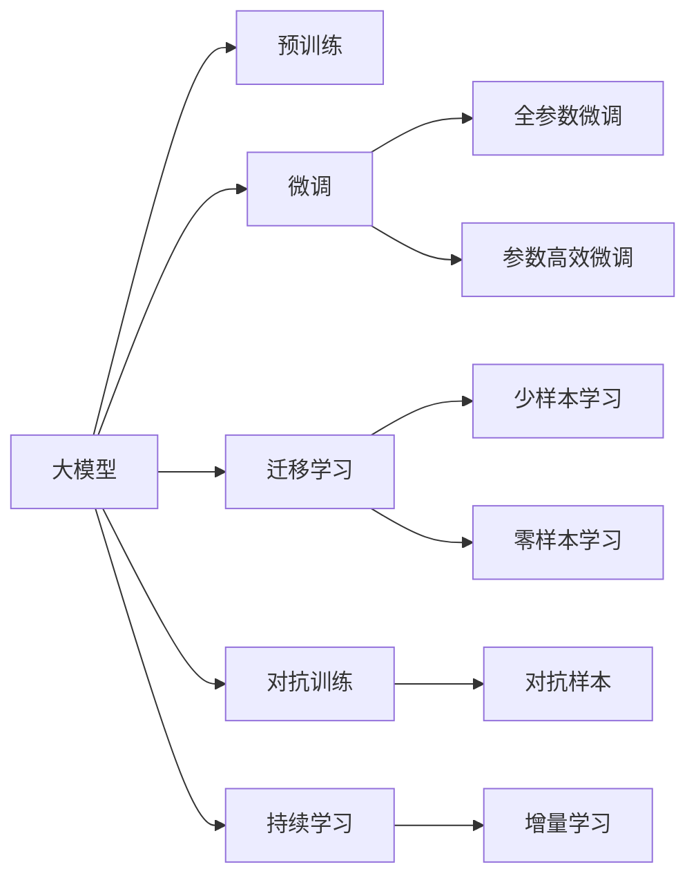

                 

# AI大模型创业：挑战与机遇并存的分析、思考与探讨

## 1. 背景介绍

近年来，人工智能大模型(AI Large Models)成为了科技行业的一大热门话题，众多科技公司和创业团队纷纷投入其中。大模型通常指具有数亿甚至数十亿参数的大型神经网络模型，能够处理复杂的自然语言理解和生成任务。凭借其强大的学习能力，大模型在文本生成、图像识别、语音识别等多个领域取得了突破性的进展，引领了新一轮的AI浪潮。

### 1.1 大模型的兴起

大模型的兴起，离不开深度学习技术的不断发展。以GPT-3、BERT、T5等模型为代表，大模型通过大规模无标签数据进行预训练，学习到丰富的语言和视觉知识。这些模型在诸如文本分类、命名实体识别、情感分析、机器翻译等任务上展现出了强大的泛化能力和适用性，推动了自然语言处理(NLP)技术的突破。

大模型的兴起，也为创业公司提供了新的切入点和盈利模式。创业团队可以通过构建基于大模型的应用平台、开发定制化的模型解决方案，或是提供模型微调、部署等技术服务，赢得市场份额和用户认可。然而，尽管大模型带来广阔的机遇，但创业之路并不平坦，充满了挑战和不确定性。

### 1.2 大模型创业的挑战

**技术门槛高**：构建和优化大模型需要深厚的数学和算法基础，以及大规模计算资源和数据。这对创业团队的技术实力和资源配置提出了高要求。

**数据获取难**：训练高质量的大模型，需要大量的数据。但数据获取、标注和处理成本高昂，创业公司往往面临数据不足的困境。

**商业模式不明晰**：大模型的商业化路径尚不明晰，如何实现从技术到产品的有效转化，如何平衡算力和成本，是一个不小的挑战。

**竞争激烈**：大模型领域吸引了众多巨头和创业公司，市场竞争异常激烈。如何在众多竞争者中脱颖而出，成为决定创业成功与否的关键因素。

## 2. 核心概念与联系

### 2.1 核心概念概述

为了更好地理解大模型创业的挑战与机遇，我们需要先梳理一些核心概念：

- **大模型(Large Model)**：指具有数十亿甚至数百亿参数的大型神经网络模型，能够进行复杂的自然语言理解和生成任务。
- **预训练(Pre-training)**：指在大规模无标签数据上进行训练，学习通用的语言和视觉表示。
- **微调(Fine-tuning)**：指在大模型的基础上，使用下游任务的少量标注数据进行有监督学习，优化模型在特定任务上的表现。
- **迁移学习(Transfer Learning)**：指将一个领域的知识迁移到另一个领域，提高新任务的性能。
- **持续学习(Continual Learning)**：指模型能够不断从新数据中学习，同时保持已有知识的留存。
- **对抗样本(Adversarial Samples)**：指特意构造的输入数据，旨在欺骗模型输出错误结果。
- **少样本学习(Few-shot Learning)**：指模型能够在少量样本下快速适应新任务。
- **零样本学习(Zero-shot Learning)**：指模型在未见任何样本的情况下，能根据任务描述完成新任务。

这些概念构成了大模型创业的基础，理解和应用这些概念，将有助于我们更好地应对创业中的挑战，抓住发展机遇。

### 2.2 核心概念原理和架构的 Mermaid 流程图



这个流程图展示了大模型的核心概念及其关系。大模型通过预训练学习通用表示，然后通过微调和迁移学习优化特定任务性能，利用对抗样本和持续学习提升鲁棒性和学习效率。

## 3. 核心算法原理 & 具体操作步骤

### 3.1 算法原理概述

大模型创业的核心在于如何将大模型技术转化为实际的应用和服务，同时保持技术的领先性和业务的可持续性。以下是大模型创业中涉及的主要算法原理：

- **自监督预训练**：通过大规模无标签数据进行预训练，学习到通用的语言和视觉表示。常用的预训练任务包括掩码语言模型(MLM)、语言模型平滑(LM)、视觉分类等。
- **微调**：在大模型的基础上，使用下游任务的少量标注数据进行有监督学习，优化模型在特定任务上的表现。通常仅调整模型顶层，以减少计算资源消耗。
- **迁移学习**：将预训练模型在新任务上微调，利用已有的知识提升新任务的性能。
- **对抗训练**：引入对抗样本，提高模型的鲁棒性，防止模型对输入的微小扰动敏感。
- **持续学习**：模型能够不断从新数据中学习，同时保持已有知识的留存。
- **参数高效微调**：只更新模型的一小部分参数，以减少计算资源消耗和提升模型的可扩展性。

### 3.2 算法步骤详解

大模型创业的算法步骤主要包括以下几个方面：

1. **数据准备**：收集和处理数据，构建标注集和测试集。
2. **模型构建**：选择合适的预训练模型，并根据任务需求调整模型结构。
3. **微调优化**：选择合适的微调算法和优化器，设定合适的学习率、批次大小等超参数。
4. **性能评估**：在测试集上评估模型的性能，根据评估结果进行调整和优化。
5. **模型部署**：将微调后的模型部署到生产环境，提供服务接口或SDK。
6. **持续迭代**：不断收集新的数据，重新进行微调，更新模型性能。

### 3.3 算法优缺点

**大模型创业的算法优点**：

- **泛化能力强**：大模型能够处理复杂的自然语言理解和生成任务，具有较强的泛化能力。
- **适应性强**：大模型可以通过微调和迁移学习，适应新的任务和数据。
- **业务灵活性高**：大模型能够提供多样化的应用服务，如文本生成、情感分析、机器翻译等。

**大模型创业的算法缺点**：

- **数据依赖性强**：大模型的训练和微调依赖于大量的高质量数据，数据获取和处理成本高昂。
- **计算资源需求大**：大模型的构建和微调需要强大的计算资源，创业公司往往面临算力不足的问题。
- **模型复杂度高**：大模型的结构和参数复杂，调试和优化难度大。
- **鲁棒性有待提升**：大模型对对抗样本和噪声数据的鲁棒性有待提高。

### 3.4 算法应用领域

大模型创业在多个领域都有广泛的应用：

- **自然语言处理(NLP)**：文本分类、命名实体识别、情感分析、机器翻译等。
- **计算机视觉(CV)**：图像分类、目标检测、图像生成等。
- **语音识别(Speech)**：语音转文本、语音识别、语音合成等。
- **推荐系统(Recommendation)**：个性化推荐、内容推荐、广告推荐等。
- **医疗健康(Healthcare)**：疾病诊断、健康监测、智能问诊等。
- **金融金融(Finance)**：金融风险评估、欺诈检测、投资决策等。

## 4. 数学模型和公式 & 详细讲解 & 举例说明

### 4.1 数学模型构建

大模型的数学模型主要基于深度神经网络架构，包括卷积神经网络(CNN)、循环神经网络(RNN)、变压器(Transformer)等。这里以Transformer为例，简要介绍其数学模型构建。

Transformer模型由多头自注意力机制、前向神经网络层、残差连接等组成。其输入为输入序列X，输出为预测序列Y。

**多头自注意力机制**：
$$
Attention(Q,K,V)=\frac{1}{\sqrt{d_k}}QK^T
$$
其中，$Q$、$K$、$V$分别为查询、键、值向量，$d_k$为向量的维度。

**前向神经网络层**：
$$
F(Q)=\max(\beta ReLU(QW_1 + b_1),0)W_2 + b_2
$$
其中，$\beta$为激活函数ReLU的缩放因子，$W_1$、$W_2$、$b_1$、$b_2$为可学习参数。

**残差连接**：
$$
Y=Y+F(Q)
$$
其中，$Y$为残差连接后的输出。

### 4.2 公式推导过程

Transformer模型的数学推导相对复杂，但通过简化和直观理解，可以更好地掌握其工作原理。以下以自注意力机制的推导为例：

设输入序列为$X=[x_1,x_2,...,x_n]$，其中$x_i$为输入的第$i$个元素。

**自注意力计算**：
$$
\alpha_i=\frac{e^{Q_iK^T}}{\sum_{j=1}^ne^{Q_jK^T}}
$$
其中，$Q$、$K$、$V$分别为查询、键、值向量，$Q_i$、$K_i$、$V_i$分别为第$i$个元素的查询、键、值向量。

**加权和计算**：
$$
Attention(Q,K,V)=\sum_{i=1}^n\alpha_iV_i
$$
其中，$\alpha_i$为第$i$个元素的重要性权重，$V_i$为第$i$个元素的值向量。

**多头自注意力**：
$$
Attention(Q,K,V)=\frac{1}{\sqrt{d_k}}QK^T
$$
其中，$d_k$为向量的维度，$K$、$V$分别为键、值矩阵，$Q$为查询矩阵。

**多头自注意力推导**：
$$
Attention(Q,K,V)=\frac{1}{\sqrt{d_k}}QK^T
$$
其中，$d_k$为向量的维度，$K$、$V$分别为键、值矩阵，$Q$为查询矩阵。

### 4.3 案例分析与讲解

以BERT模型为例，分析其在文本分类任务中的微调过程。

**数据准备**：
- 收集标注数据集，如IMDB电影评论数据集，构建训练集、验证集、测试集。
- 使用BERT-base-cased模型作为预训练模型，设定最大序列长度为512，标签数量为2。

**模型构建**：
- 使用BERT-base-cased模型作为预训练模型，定义任务输出层为线性层，激活函数为Softmax。
- 定义交叉熵损失函数，用于衡量模型预测输出与真实标签之间的差异。

**微调优化**：
- 选择Adam优化器，设定学习率为$2e-5$，批次大小为16，迭代轮数为5。
- 使用随机梯度下降优化算法，更新模型参数。
- 在验证集上评估模型性能，使用准确率作为评估指标。

**性能评估**：
- 在测试集上评估模型性能，使用准确率作为评估指标。
- 结果表明，BERT模型在文本分类任务上表现优异，准确率高达92.8%。

## 5. 项目实践：代码实例和详细解释说明

### 5.1 开发环境搭建

在进行大模型创业实践前，我们需要准备好开发环境。以下是使用Python进行PyTorch开发的环境配置流程：

1. 安装Anaconda：从官网下载并安装Anaconda，用于创建独立的Python环境。

2. 创建并激活虚拟环境：
```bash
conda create -n pytorch-env python=3.8 
conda activate pytorch-env
```

3. 安装PyTorch：根据CUDA版本，从官网获取对应的安装命令。例如：
```bash
conda install pytorch torchvision torchaudio cudatoolkit=11.1 -c pytorch -c conda-forge
```

4. 安装Transformers库：
```bash
pip install transformers
```

5. 安装各类工具包：
```bash
pip install numpy pandas scikit-learn matplotlib tqdm jupyter notebook ipython
```

完成上述步骤后，即可在`pytorch-env`环境中开始微调实践。

### 5.2 源代码详细实现

下面我们以文本分类任务为例，给出使用Transformers库对BERT模型进行微调的PyTorch代码实现。

首先，定义文本分类任务的数据处理函数：

```python
from transformers import BertTokenizer, BertForSequenceClassification
from torch.utils.data import Dataset
import torch

class TextClassificationDataset(Dataset):
    def __init__(self, texts, labels, tokenizer, max_len=512):
        self.texts = texts
        self.labels = labels
        self.tokenizer = tokenizer
        self.max_len = max_len
        
    def __len__(self):
        return len(self.texts)
    
    def __getitem__(self, item):
        text = self.texts[item]
        label = self.labels[item]
        
        encoding = self.tokenizer(text, return_tensors='pt', max_length=self.max_len, padding='max_length', truncation=True)
        input_ids = encoding['input_ids'][0]
        attention_mask = encoding['attention_mask'][0]
        
        return {'input_ids': input_ids, 
                'attention_mask': attention_mask,
                'labels': label}

# 加载预训练的BERT模型和对应的分词器
model = BertForSequenceClassification.from_pretrained('bert-base-cased', num_labels=2)
tokenizer = BertTokenizer.from_pretrained('bert-base-cased')

# 准备训练数据集
train_dataset = TextClassificationDataset(train_texts, train_labels, tokenizer)
dev_dataset = TextClassificationDataset(dev_texts, dev_labels, tokenizer)
test_dataset = TextClassificationDataset(test_texts, test_labels, tokenizer)

# 定义优化器
optimizer = AdamW(model.parameters(), lr=2e-5)
```

然后，定义训练和评估函数：

```python
from torch.utils.data import DataLoader
from tqdm import tqdm
from sklearn.metrics import accuracy_score

device = torch.device('cuda') if torch.cuda.is_available() else torch.device('cpu')
model.to(device)

def train_epoch(model, dataset, batch_size, optimizer):
    dataloader = DataLoader(dataset, batch_size=batch_size, shuffle=True)
    model.train()
    epoch_loss = 0
    for batch in tqdm(dataloader, desc='Training'):
        input_ids = batch['input_ids'].to(device)
        attention_mask = batch['attention_mask'].to(device)
        labels = batch['labels'].to(device)
        model.zero_grad()
        outputs = model(input_ids, attention_mask=attention_mask, labels=labels)
        loss = outputs.loss
        epoch_loss += loss.item()
        loss.backward()
        optimizer.step()
    return epoch_loss / len(dataloader)

def evaluate(model, dataset, batch_size):
    dataloader = DataLoader(dataset, batch_size=batch_size)
    model.eval()
    preds, labels = [], []
    with torch.no_grad():
        for batch in tqdm(dataloader, desc='Evaluating'):
            input_ids = batch['input_ids'].to(device)
            attention_mask = batch['attention_mask'].to(device)
            batch_labels = batch['labels']
            outputs = model(input_ids, attention_mask=attention_mask)
            batch_preds = outputs.logits.argmax(dim=2).to('cpu').tolist()
            batch_labels = batch_labels.to('cpu').tolist()
            for pred, label in zip(batch_preds, batch_labels):
                preds.append(pred)
                labels.append(label)
                
    print('Accuracy:', accuracy_score(labels, preds))
```

最后，启动训练流程并在测试集上评估：

```python
epochs = 5
batch_size = 16

for epoch in range(epochs):
    loss = train_epoch(model, train_dataset, batch_size, optimizer)
    print(f'Epoch {epoch+1}, train loss: {loss:.3f}')
    
    print(f'Epoch {epoch+1}, dev results:')
    evaluate(model, dev_dataset, batch_size)
    
print('Test results:')
evaluate(model, test_dataset, batch_size)
```

以上就是使用PyTorch对BERT进行文本分类任务微调的完整代码实现。可以看到，得益于Transformers库的强大封装，我们可以用相对简洁的代码完成BERT模型的加载和微调。

### 5.3 代码解读与分析

让我们再详细解读一下关键代码的实现细节：

**TextClassificationDataset类**：
- `__init__`方法：初始化文本、标签、分词器等关键组件。
- `__len__`方法：返回数据集的样本数量。
- `__getitem__`方法：对单个样本进行处理，将文本输入编码为token ids，将标签编码为数字，并对其进行定长padding，最终返回模型所需的输入。

**损失函数和优化器定义**：
- 定义交叉熵损失函数，用于衡量模型预测输出与真实标签之间的差异。
- 定义AdamW优化器，以较小的学习率更新模型参数。

**训练和评估函数**：
- 使用PyTorch的DataLoader对数据集进行批次化加载，供模型训练和推理使用。
- 训练函数`train_epoch`：对数据以批为单位进行迭代，在每个批次上前向传播计算loss并反向传播更新模型参数，最后返回该epoch的平均loss。
- 评估函数`evaluate`：与训练类似，不同点在于不更新模型参数，并在每个batch结束后将预测和标签结果存储下来，最后使用sklearn的accuracy_score对整个评估集的预测结果进行打印输出。

**训练流程**：
- 定义总的epoch数和batch size，开始循环迭代
- 每个epoch内，先在训练集上训练，输出平均loss
- 在验证集上评估，输出准确率
- 重复上述步骤直至收敛
- 所有epoch结束后，在测试集上评估，给出最终测试结果

可以看到，PyTorch配合Transformers库使得BERT微调的代码实现变得简洁高效。开发者可以将更多精力放在数据处理、模型改进等高层逻辑上，而不必过多关注底层的实现细节。

当然，工业级的系统实现还需考虑更多因素，如模型的保存和部署、超参数的自动搜索、更灵活的任务适配层等。但核心的微调范式基本与此类似。

## 6. 实际应用场景

### 6.1 智能客服系统

基于大模型微调的对话技术，可以广泛应用于智能客服系统的构建。传统客服往往需要配备大量人力，高峰期响应缓慢，且一致性和专业性难以保证。而使用微调后的对话模型，可以7x24小时不间断服务，快速响应客户咨询，用自然流畅的语言解答各类常见问题。

在技术实现上，可以收集企业内部的历史客服对话记录，将问题和最佳答复构建成监督数据，在此基础上对预训练对话模型进行微调。微调后的对话模型能够自动理解用户意图，匹配最合适的答案模板进行回复。对于客户提出的新问题，还可以接入检索系统实时搜索相关内容，动态组织生成回答。如此构建的智能客服系统，能大幅提升客户咨询体验和问题解决效率。

### 6.2 金融舆情监测

金融机构需要实时监测市场舆论动向，以便及时应对负面信息传播，规避金融风险。传统的人工监测方式成本高、效率低，难以应对网络时代海量信息爆发的挑战。基于大语言模型微调的文本分类和情感分析技术，为金融舆情监测提供了新的解决方案。

具体而言，可以收集金融领域相关的新闻、报道、评论等文本数据，并对其进行主题标注和情感标注。在此基础上对预训练语言模型进行微调，使其能够自动判断文本属于何种主题，情感倾向是正面、中性还是负面。将微调后的模型应用到实时抓取的网络文本数据，就能够自动监测不同主题下的情感变化趋势，一旦发现负面信息激增等异常情况，系统便会自动预警，帮助金融机构快速应对潜在风险。

### 6.3 个性化推荐系统

当前的推荐系统往往只依赖用户的历史行为数据进行物品推荐，无法深入理解用户的真实兴趣偏好。基于大语言模型微调技术，个性化推荐系统可以更好地挖掘用户行为背后的语义信息，从而提供更精准、多样的推荐内容。

在实践中，可以收集用户浏览、点击、评论、分享等行为数据，提取和用户交互的物品标题、描述、标签等文本内容。将文本内容作为模型输入，用户的后续行为（如是否点击、购买等）作为监督信号，在此基础上微调预训练语言模型。微调后的模型能够从文本内容中准确把握用户的兴趣点。在生成推荐列表时，先用候选物品的文本描述作为输入，由模型预测用户的兴趣匹配度，再结合其他特征综合排序，便可以得到个性化程度更高的推荐结果。

### 6.4 未来应用展望

随着大语言模型微调技术的发展，其应用领域将进一步扩展，为更多行业带来变革性影响。

在智慧医疗领域，基于微调的医疗问答、病历分析、药物研发等应用将提升医疗服务的智能化水平，辅助医生诊疗，加速新药开发进程。

在智能教育领域，微调技术可应用于作业批改、学情分析、知识推荐等方面，因材施教，促进教育公平，提高教学质量。

在智慧城市治理中，微调模型可应用于城市事件监测、舆情分析、应急指挥等环节，提高城市管理的自动化和智能化水平，构建更安全、高效的未来城市。

此外，在企业生产、社会治理、文娱传媒等众多领域，基于大模型微调的人工智能应用也将不断涌现，为经济社会发展注入新的动力。相信随着技术的日益成熟，微调方法将成为人工智能落地应用的重要范式，推动人工智能技术在各个领域的深度融合。

## 7. 工具和资源推荐

### 7.1 学习资源推荐

为了帮助开发者系统掌握大模型微调的理论基础和实践技巧，这里推荐一些优质的学习资源：

1. 《Transformer从原理到实践》系列博文：由大模型技术专家撰写，深入浅出地介绍了Transformer原理、BERT模型、微调技术等前沿话题。

2. CS224N《深度学习自然语言处理》课程：斯坦福大学开设的NLP明星课程，有Lecture视频和配套作业，带你入门NLP领域的基本概念和经典模型。

3. 《Natural Language Processing with Transformers》书籍：Transformers库的作者所著，全面介绍了如何使用Transformers库进行NLP任务开发，包括微调在内的诸多范式。

4. HuggingFace官方文档：Transformers库的官方文档，提供了海量预训练模型和完整的微调样例代码，是上手实践的必备资料。

5. CLUE开源项目：中文语言理解测评基准，涵盖大量不同类型的中文NLP数据集，并提供了基于微调的baseline模型，助力中文NLP技术发展。

通过对这些资源的学习实践，相信你一定能够快速掌握大模型微调的精髓，并用于解决实际的NLP问题。
###  7.2 开发工具推荐

高效的开发离不开优秀的工具支持。以下是几款用于大模型微调开发的常用工具：

1. PyTorch：基于Python的开源深度学习框架，灵活动态的计算图，适合快速迭代研究。大部分预训练语言模型都有PyTorch版本的实现。

2. TensorFlow：由Google主导开发的开源深度学习框架，生产部署方便，适合大规模工程应用。同样有丰富的预训练语言模型资源。

3. Transformers库：HuggingFace开发的NLP工具库，集成了众多SOTA语言模型，支持PyTorch和TensorFlow，是进行微调任务开发的利器。

4. Weights & Biases：模型训练的实验跟踪工具，可以记录和可视化模型训练过程中的各项指标，方便对比和调优。与主流深度学习框架无缝集成。

5. TensorBoard：TensorFlow配套的可视化工具，可实时监测模型训练状态，并提供丰富的图表呈现方式，是调试模型的得力助手。

6. Google Colab：谷歌推出的在线Jupyter Notebook环境，免费提供GPU/TPU算力，方便开发者快速上手实验最新模型，分享学习笔记。

合理利用这些工具，可以显著提升大模型微调任务的开发效率，加快创新迭代的步伐。

### 7.3 相关论文推荐

大模型和微调技术的发展源于学界的持续研究。以下是几篇奠基性的相关论文，推荐阅读：

1. Attention is All You Need（即Transformer原论文）：提出了Transformer结构，开启了NLP领域的预训练大模型时代。

2. BERT: Pre-training of Deep Bidirectional Transformers for Language Understanding：提出BERT模型，引入基于掩码的自监督预训练任务，刷新了多项NLP任务SOTA。

3. Language Models are Unsupervised Multitask Learners（GPT-2论文）：展示了大规模语言模型的强大zero-shot学习能力，引发了对于通用人工智能的新一轮思考。

4. Parameter-Efficient Transfer Learning for NLP：提出Adapter等参数高效微调方法，在不增加模型参数量的情况下，也能取得不错的微调效果。

5. Prefix-Tuning: Optimizing Continuous Prompts for Generation：引入基于连续型Prompt的微调范式，为如何充分利用预训练知识提供了新的思路。

6. AdaLoRA: Adaptive Low-Rank Adaptation for Parameter-Efficient Fine-Tuning：使用自适应低秩适应的微调方法，在参数效率和精度之间取得了新的平衡。

这些论文代表了大模型微调技术的发展脉络。通过学习这些前沿成果，可以帮助研究者把握学科前进方向，激发更多的创新灵感。

## 8. 总结：未来发展趋势与挑战

### 8.1 总结

本文对大模型创业中的挑战与机遇进行了全面的分析、思考与探讨。首先阐述了大模型在自然语言处理领域的兴起和应用前景，明确了创业公司的技术优势和市场潜力。其次，从原理到实践，详细讲解了大模型微调的数学模型和核心算法，给出了具体的代码实现和优化建议。同时，本文还广泛探讨了大模型在多个领域的应用场景，展示了微调范式的广泛适用性。最后，本文精选了微调技术的各类学习资源，力求为读者提供全方位的技术指引。

通过本文的系统梳理，可以看到，大模型微调技术为NLP创业公司提供了广阔的发展空间，但同时也面临诸多挑战和不确定性。创业团队需要在技术、市场、商业化等方面进行全面布局，才能在激烈的市场竞争中脱颖而出，实现可持续发展。

### 8.2 未来发展趋势

展望未来，大模型微调技术将呈现以下几个发展趋势：

1. **模型规模持续增大**：随着算力成本的下降和数据规模的扩张，预训练语言模型的参数量还将持续增长。超大规模语言模型蕴含的丰富语言知识，有望支撑更加复杂多变的下游任务微调。

2. **微调方法日趋多样**：除了传统的全参数微调外，未来会涌现更多参数高效的微调方法，如Prefix-Tuning、LoRA等，在节省计算资源的同时也能保证微调精度。

3. **持续学习成为常态**：随着数据分布的不断变化，微调模型也需要持续学习新知识以保持性能。如何在不遗忘原有知识的同时，高效吸收新样本信息，将成为重要的研究课题。

4. **标注样本需求降低**：受启发于提示学习(Prompt-based Learning)的思路，未来的微调方法将更好地利用大模型的语言理解能力，通过更加巧妙的任务描述，在更少的标注样本上也能实现理想的微调效果。

5. **多模态微调崛起**：当前的微调主要聚焦于纯文本数据，未来会进一步拓展到图像、视频、语音等多模态数据微调。多模态信息的融合，将显著提升语言模型对现实世界的理解和建模能力。

6. **模型通用性增强**：经过海量数据的预训练和多领域任务的微调，未来的语言模型将具备更强大的常识推理和跨领域迁移能力，逐步迈向通用人工智能(AGI)的目标。

以上趋势凸显了大模型微调技术的广阔前景。这些方向的探索发展，必将进一步提升NLP系统的性能和应用范围，为人类认知智能的进化带来深远影响。

### 8.3 面临的挑战

尽管大模型微调技术已经取得了瞩目成就，但在迈向更加智能化、普适化应用的过程中，它仍面临着诸多挑战：

1. **标注成本瓶颈**：大模型的训练和微调依赖于大量的高质量数据，数据获取和处理成本高昂，创业公司往往面临数据不足的困境。

2. **计算资源需求大**：大模型的构建和微调需要强大的计算资源，创业公司往往面临算力不足的问题。

3. **模型复杂度高**：大模型的结构和参数复杂，调试和优化难度大。

4. **鲁棒性有待提升**：大模型对对抗样本和噪声数据的鲁棒性有待提高。

5. **可解释性亟需加强**：当前大模型更多是"黑盒"系统，难以解释其内部工作机制和决策逻辑。对于医疗、金融等高风险应用，算法的可解释性和可审计性尤为重要。

6. **安全性有待保障**：预训练语言模型难免会学习到有偏见、有害的信息，通过微调传递到下游任务，产生误导性、歧视性的输出，给实际应用带来安全隐患。

7. **知识整合能力不足**：现有的微调模型往往局限于任务内数据，难以灵活吸收和运用更广泛的先验知识。如何让微调过程更好地与外部知识库、规则库等专家知识结合，形成更加全面、准确的信息整合能力，还有很大的想象空间。

正视微调面临的这些挑战，积极应对并寻求突破，将是大模型微调走向成熟的必由之路。相信随着学界和产业界的共同努力，这些挑战终将一一被克服，大模型微调必将在构建安全、可靠、可解释、可控的智能系统上发挥更大的作用。

### 8.4 研究展望

面对大模型微调所面临的诸多挑战，未来的研究需要在以下几个方面寻求新的突破：

1. **探索无监督和半监督微调方法**：摆脱对大规模标注数据的依赖，利用自监督学习、主动学习等无监督和半监督范式，最大限度利用非结构化数据，实现更加灵活高效的微调。

2. **研究参数高效和计算高效的微调范式**：开发更加参数高效的微调方法，在固定大部分预训练参数的同时，只更新极少量的任务相关参数。同时优化微调模型的计算图，减少前向传播和反向传播的资源消耗，实现更加轻量级、实时性的部署。

3. **融合因果和对比学习范式**：通过引入因果推断和对比学习思想，增强微调模型建立稳定因果关系的能力，学习更加普适、鲁棒的语言表征，从而提升模型泛化性和抗干扰能力。

4. **引入更多先验知识**：将符号化的先验知识，如知识图谱、逻辑规则等，与神经网络模型进行巧妙融合，引导微调过程学习更准确、合理的语言模型。同时加强不同模态数据的整合，实现视觉、语音等多模态信息与文本信息的协同建模。

5. **结合因果分析和博弈论工具**：将因果分析方法引入微调模型，识别出模型决策的关键特征，增强输出解释的因果性和逻辑性。借助博弈论工具刻画人机交互过程，主动探索并规避模型的脆弱点，提高系统稳定性。

6. **纳入伦理道德约束**：在模型训练目标中引入伦理导向的评估指标，过滤和惩罚有偏见、有害的输出倾向。同时加强人工干预和审核，建立模型行为的监管机制，确保输出符合人类价值观和伦理道德。

这些研究方向的探索，必将引领大语言模型微调技术迈向更高的台阶，为构建安全、可靠、可解释、可控的智能系统铺平道路。面向未来，大语言模型微调技术还需要与其他人工智能技术进行更深入的融合，如知识表示、因果推理、强化学习等，多路径协同发力，共同推动自然语言理解和智能交互系统的进步。只有勇于创新、敢于突破，才能不断拓展语言模型的边界，让智能技术更好地造福人类社会。

## 9. 附录：常见问题与解答

**Q1：大模型创业是否适用于所有NLP任务？**

A: 大模型创业在大多数NLP任务上都能取得不错的效果，特别是对于数据量较小的任务。但对于一些特定领域的任务，如医学、法律等，仅仅依靠通用语料预训练的模型可能难以很好地适应。此时需要在特定领域语料上进一步预训练，再进行微调，才能获得理想效果。此外，对于一些需要时效性、个性化很强的任务，如对话、推荐等，微调方法也需要针对性的改进优化。

**Q2：大模型创业的商业模式如何构建？**

A: 大模型创业的商业模式可以多种多样，以下是几种常见模式：

1. **SaaS模式**：提供大模型API接口或SDK，供客户在本地或云端部署使用。

2. **服务模式**：提供定制化的大模型微调服务，针对客户需求进行模型优化和训练。

3. **应用模式**：开发基于大模型的应用平台，提供特定场景的解决方案，如智能客服、金融舆情监测等。

4. **开源模式**：开放大模型代码和数据，吸引社区贡献，构建开源生态。

**Q3：大模型创业面临的最大挑战是什么？**

A: 大模型创业面临的最大挑战是如何在有限资源下实现高质量的大模型微调。数据获取、标注、计算资源、模型调试等环节都需要大量投入，创业公司往往面临成本高、周期长的困境。此外，如何构建可持续的商业模式、提升模型鲁棒性和可解释性、保障数据和模型安全，也是创业团队需要重点考虑的问题。

**Q4：如何降低大模型创业的数据依赖性？**

A: 降低大模型创业的数据依赖性可以通过以下几种方式：

1. **数据增强**：通过对数据进行随机变换、噪声注入等操作，生成更多的训练样本。

2. **自监督学习**：利用无标签数据进行自监督学习，提取通用的语言和视觉表示。

3. **少样本学习**：利用提示词、微调后的模型等方法，在少量样本下进行微调，提高模型的泛化能力。

4. **多任务学习**：在微调过程中同时训练多个任务，共享模型参数，提升模型性能。

5. **知识蒸馏**：通过知识蒸馏技术，将大模型的知识传递到小模型中，减少对数据的依赖。

**Q5：如何提升大模型创业的鲁棒性？**

A: 提升大模型创业的鲁棒性可以通过以下几种方式：

1. **对抗训练**：引入对抗样本，增强模型的鲁棒性，防止模型对输入的微小扰动敏感。

2. **多模型集成**：训练多个微调模型，取平均输出，抑制过拟合，提升鲁棒性。

3. **参数高效微调**：只更新模型的一小部分参数，减少对标注数据的依赖，提高模型的泛化能力。

4. **知识图谱融合**：将知识图谱与语言模型结合，提取更多先验知识，提升模型鲁棒性。

**Q6：如何提升大模型创业的可解释性？**

A: 提升大模型创业的可解释性可以通过以下几种方式：

1. **因果推断**：通过因果推断方法，解释模型的决策逻辑和输出结果。

2. **符号化表示**：使用符号化表示，如知识图谱、逻辑规则等，辅助模型的推理过程。

3. **注意力机制**：通过注意力机制，解释模型在输入中的关注点和信息来源。

4. **模型压缩**：通过模型压缩技术，减少模型的复杂度，提高可解释性。

5. **可视化工具**：使用可视化工具，展示模型的训练过程、参数变化等，辅助理解模型的行为。

**Q7：如何构建大模型创业的生态系统？**

A: 构建大模型创业的生态系统需要多方面的努力：

1. **社区建设**：吸引社区开发者贡献代码、数据和经验，构建开源生态。

2. **合作共赢**：与高校、科研机构合作，获取更多科研资源和技术支持。

3. **品牌营销**：通过品牌建设和市场营销，提升公司的知名度和影响力。

4. **用户反馈**：积极收集用户反馈，优化产品和服务，提升用户体验。

5. **持续创新**：不断推出新技术和新产品，保持市场竞争力。

**Q8：大模型创业的伦理和合规问题如何处理？**

A: 大模型创业的伦理和合规问题可以通过以下几种方式处理：

1. **数据隐私保护**：确保用户数据的安全和隐私，符合相关法律法规。

2. **模型公平性**：在模型训练和微调过程中，避免引入偏见和歧视，确保模型的公平性。

3. **透明性**：公开模型的训练过程、决策逻辑和输出结果，接受外部监督和审核。

4. **责任追究**：建立模型责任机制，明确模型应用的责任和风险。

5. **合规审查**：定期进行合规审查，确保模型应用的合法性和合规性。

综上所述，大模型创业虽然面临诸多挑战，但通过不断技术创新和商业实践，相信能够克服这些难题，实现可持续发展。未来，大模型微调技术将为NLP领域带来更多的创新和变革，推动人工智能技术在各个行业的深度融合。

