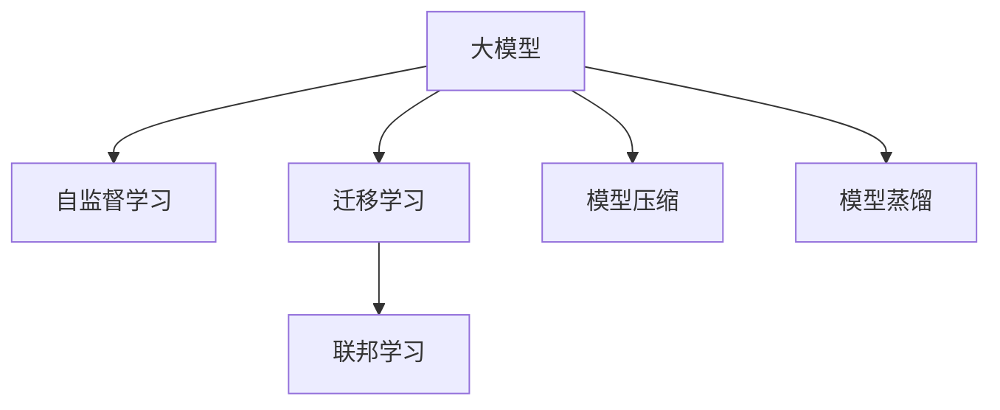

                 

# AI大模型创业：挑战与机遇并存的现状、趋势、未来与展望

> 关键词：大模型创业, 挑战与机遇, AI产业, 技术路线, 商业模式, 创业指导

## 1. 背景介绍

### 1.1 问题由来
近年来，随着人工智能(AI)技术的快速进步，大模型在各个领域展现出了前所未有的潜力和价值。无论是自然语言处理(NLP)、计算机视觉(CV)、语音识别(SR)还是推荐系统，大模型的表现都令业界刮目相看。然而，大模型的研发与商业化也面临着诸多挑战，尤其是对于初创企业来说，如何在激烈的市场竞争中突围，是摆在他们面前的一道难题。

大模型创业的挑战主要集中在以下几个方面：

1. **高昂的研发成本**：大模型的开发和训练需要大量的计算资源、数据资源和人力资源，初创企业往往难以承担这些成本。
2. **数据的获取与处理**：优质的训练数据是模型性能的关键，但数据的获取和处理通常需要大量的前期投入。
3. **技术壁垒高**：大模型的研发需要深厚的AI基础和丰富的实战经验，初创企业通常缺乏足够的技术积累。
4. **市场竞争激烈**：AI领域吸引了众多巨头公司和创业公司的关注，市场竞争异常激烈。
5. **商业化的挑战**：将大模型转化为可落地的产品和服务，需要克服技术、市场、法规等多重障碍。

### 1.2 问题核心关键点
尽管存在上述挑战，但大模型创业也带来了巨大的机遇：

1. **市场潜力大**：AI领域正处于快速增长阶段，市场需求旺盛。
2. **技术优势显著**：大模型在各项任务上的表现已经接近或超过了人类水平，具有显著的商业应用前景。
3. **投资热度高**：AI领域吸引了大批投资机构的关注，尤其是那些能够在特定领域取得突破的创业公司。
4. **行业应用广**：大模型可以应用于医疗、金融、教育、交通等多个行业，具有广泛的商业前景。
5. **政策支持**：各国政府纷纷出台政策支持AI技术的发展，为AI创业提供了良好的政策环境。

## 2. 核心概念与联系

### 2.1 核心概念概述

为更好地理解大模型创业的现状、趋势、未来与展望，本节将介绍几个密切相关的核心概念：

- **大模型(Large Models)**：指包含数十亿或上百亿参数的深度学习模型，如BERT、GPT、DALL-E等，能够在多个任务上取得优异的表现。
- **自监督学习(Self-Supervised Learning)**：一种无需标注数据就能训练模型的方法，通过数据本身的内在关系进行学习。
- **迁移学习(Transfer Learning)**：将一个任务学到的知识迁移到另一个任务上，以提高新任务的性能。
- **联邦学习(Federated Learning)**：一种分布式学习方法，多个设备各自拥有部分数据，共同训练出一个全局模型。
- **模型压缩(Model Compression)**：通过减少模型参数、降低计算复杂度等方法，优化模型的性能和资源消耗。
- **模型蒸馏(Model Distillation)**：利用大模型训练一个小模型，让小模型继承大模型的知识，以减少资源消耗和提高效率。

这些核心概念之间的逻辑关系可以通过以下Mermaid流程图来展示：



这个流程图展示了大模型的核心概念及其之间的关系：

1. 大模型通过自监督学习获得基础能力。
2. 迁移学习使得大模型能够应用到各种下游任务中。
3. 联邦学习和大模型结合，可以高效利用分布式数据。
4. 模型压缩和模型蒸馏进一步优化大模型的性能和资源消耗。

这些概念共同构成了大模型创业的基础，为其应用提供了技术支撑。

## 3. 核心算法原理 & 具体操作步骤
### 3.1 算法原理概述

大模型创业的核心在于如何将大模型的技术优势转化为商业价值。这涉及到模型的训练、优化、应用等多个环节。以下是大模型创业的基本流程：

1. **数据获取与处理**：收集高质量的数据，并进行清洗、标注、划分等处理，为模型的训练提供数据支持。
2. **模型选择与训练**：选择合适的模型架构，如Transformer、CNN、RNN等，并对其进行训练，优化模型参数。
3. **迁移学习与微调**：将训练好的模型应用于特定任务，进行迁移学习和微调，以适应新的应用场景。
4. **模型部署与优化**：将模型部署到生产环境，进行优化和监控，确保模型的高效稳定运行。
5. **产品化与市场推广**：将模型封装为产品，进行市场推广，寻找实际应用场景。

### 3.2 算法步骤详解

大模型创业的具体步骤如下：

**Step 1: 数据获取与处理**
- 收集大量有代表性的数据，如医疗影像、金融交易、教育评测等。
- 清洗数据，去除噪音和无效数据，提高数据质量。
- 标注数据，为模型训练提供监督信号。

**Step 2: 模型选择与训练**
- 选择合适的模型架构，如BERT、GPT-3等。
- 使用GPU或TPU进行训练，使用自监督学习任务进行预训练，如语言模型、掩码语言模型等。
- 进行迁移学习，将预训练模型应用于特定任务，进行微调。

**Step 3: 迁移学习与微调**
- 设计合适的损失函数和优化器，如交叉熵、Adam等。
- 设定合适的超参数，如学习率、批大小、迭代次数等。
- 进行微调，更新模型参数，提高模型在特定任务上的性能。

**Step 4: 模型部署与优化**
- 将模型部署到云端或本地服务器，进行推理预测。
- 对模型进行优化，如模型压缩、量化等，提高模型的性能和资源效率。
- 进行监控和评估，确保模型的稳定性和准确性。

**Step 5: 产品化与市场推广**
- 将模型封装为API或SDK，提供给开发者使用。
- 进行市场推广，寻找实际应用场景，如医疗影像分析、金融风控、教育评测等。
- 不断迭代和优化模型，提升用户体验和系统性能。

### 3.3 算法优缺点

大模型创业的方法具有以下优点：

1. **精度高**：大模型具有显著的精度优势，能够在特定任务上取得优异的性能。
2. **适用广**：大模型可以应用于多种领域和任务，具有广泛的应用前景。
3. **效果好**：迁移学习和微调能够显著提升模型的效果，使得大模型在实际应用中表现优异。
4. **可扩展性强**：模型压缩和量化等技术可以优化模型的性能和资源消耗，使得模型能够在大规模生产环境中高效运行。

同时，大模型创业也存在以下缺点：

1. **研发成本高**：大模型需要大量的计算资源和数据资源，初创企业难以承担。
2. **技术壁垒高**：大模型的开发需要深厚的AI基础和丰富的实战经验，初创企业通常缺乏足够的技术积累。
3. **数据依赖大**：模型训练需要大量的标注数据，数据获取和处理通常需要大量的前期投入。
4. **市场竞争激烈**：AI领域吸引了众多巨头公司和创业公司的关注，市场竞争异常激烈。
5. **商业化难度大**：将大模型转化为可落地的产品和服务，需要克服技术、市场、法规等多重障碍。

尽管存在这些缺点，但大模型创业仍然具有巨大的市场潜力和技术优势，吸引着越来越多的创业者和投资机构的关注。

### 3.4 算法应用领域

大模型创业已经应用于多个领域，取得了显著的效果。以下是几个典型的应用场景：

- **医疗影像分析**：利用大模型对医疗影像进行自动分析和诊断，提高医疗效率和诊断准确性。
- **金融风控**：使用大模型进行信用评估、欺诈检测、风险预警等，提升金融机构的运营效率和风险控制能力。
- **教育评测**：通过大模型对学生的作业和考试进行自动批改和分析，提供个性化的教育建议。
- **智能客服**：利用大模型构建智能客服系统，提高客服响应速度和用户满意度。
- **推荐系统**：利用大模型进行推荐算法优化，提升用户粘性和满意度。
- **图像识别**：利用大模型进行图像分类、目标检测、人脸识别等任务，提升图像处理能力。

## 4. 数学模型和公式 & 详细讲解 & 举例说明

### 4.1 数学模型构建

大模型创业的数学模型主要涉及深度学习模型的训练和优化。以下是一个简单的数学模型构建过程：

1. **输入层**：将输入数据编码成模型能够处理的向量形式。
2. **隐藏层**：通过多层非线性变换，提取输入数据的特征表示。
3. **输出层**：根据任务的性质，将隐藏层的输出映射到不同的输出形式，如分类、回归、序列生成等。

### 4.2 公式推导过程

以下是大模型创业中的几个关键公式：

1. **损失函数(Loss Function)**：用于衡量模型输出与真实标签之间的差异，常见的有交叉熵损失、均方误差损失等。

$$
\mathcal{L} = -\sum_{i=1}^N y_i \log p(y_i|x_i)
$$

2. **优化器(Optimizer)**：用于更新模型参数，使得损失函数最小化。常见的有Adam、SGD等。

$$
\theta \leftarrow \theta - \eta \nabla_{\theta} \mathcal{L}
$$

3. **迁移学习(Transfer Learning)**：将一个任务的模型参数迁移到另一个任务上，以提高新任务的性能。

$$
\theta_{new} = \alpha \theta_{old} + (1-\alpha) \theta_0
$$

其中 $\theta_{new}$ 表示新任务的模型参数，$\theta_{old}$ 表示源任务的模型参数，$\theta_0$ 表示新任务的初始化参数。$\alpha$ 表示迁移的比例。

4. **模型压缩(Model Compression)**：通过参数剪枝、量化、蒸馏等方法，优化模型的性能和资源消耗。

$$
\theta' = \text{quantize}(\theta)
$$

其中 $\theta'$ 表示压缩后的模型参数，$\text{quantize}$ 表示量化函数。

### 4.3 案例分析与讲解

以医疗影像分析为例，分析大模型创业中的数学模型和公式：

**输入层**：将医疗影像数据编码成像素向量形式。

**隐藏层**：通过多层卷积和池化操作，提取影像的特征表示。

**输出层**：根据任务的性质，将特征向量映射到不同的输出形式，如分类、回归、序列生成等。

在训练过程中，使用交叉熵损失函数和Adam优化器进行模型训练，并通过迁移学习和微调提高模型性能。在部署过程中，通过模型压缩和量化等方法优化模型的性能和资源消耗，确保模型的高效稳定运行。

## 5. 项目实践：代码实例和详细解释说明

### 5.1 开发环境搭建

在进行大模型创业的实践前，我们需要准备好开发环境。以下是使用Python进行PyTorch开发的环境配置流程：

1. 安装Anaconda：从官网下载并安装Anaconda，用于创建独立的Python环境。

2. 创建并激活虚拟环境：
```bash
conda create -n pytorch-env python=3.8 
conda activate pytorch-env
```

3. 安装PyTorch：根据CUDA版本，从官网获取对应的安装命令。例如：
```bash
conda install pytorch torchvision torchaudio cudatoolkit=11.1 -c pytorch -c conda-forge
```

4. 安装Transformers库：
```bash
pip install transformers
```

5. 安装各类工具包：
```bash
pip install numpy pandas scikit-learn matplotlib tqdm jupyter notebook ipython
```

完成上述步骤后，即可在`pytorch-env`环境中开始创业实践。

### 5.2 源代码详细实现

下面我们以医疗影像分析为例，给出使用Transformers库对BERT模型进行迁移学习和微调的PyTorch代码实现。

首先，定义医疗影像分析任务的训练数据集和模型：

```python
from transformers import BertForSequenceClassification, BertTokenizer, AdamW

# 定义医疗影像分析任务的训练数据集和模型
model = BertForSequenceClassification.from_pretrained('bert-base-cased', num_labels=2) # 二分类任务
tokenizer = BertTokenizer.from_pretrained('bert-base-cased')

# 定义医疗影像分析任务的训练集和验证集
train_dataset = ...
dev_dataset = ...
```

然后，定义模型训练和评估函数：

```python
from torch.utils.data import DataLoader

# 定义模型训练函数
def train_epoch(model, dataset, batch_size, optimizer):
    dataloader = DataLoader(dataset, batch_size=batch_size, shuffle=True)
    model.train()
    epoch_loss = 0
    for batch in dataloader:
        input_ids = batch['input_ids'].to(device)
        attention_mask = batch['attention_mask'].to(device)
        labels = batch['labels'].to(device)
        model.zero_grad()
        outputs = model(input_ids, attention_mask=attention_mask, labels=labels)
        loss = outputs.loss
        epoch_loss += loss.item()
        loss.backward()
        optimizer.step()
    return epoch_loss / len(dataloader)

# 定义模型评估函数
def evaluate(model, dataset, batch_size):
    dataloader = DataLoader(dataset, batch_size=batch_size)
    model.eval()
    preds, labels = [], []
    with torch.no_grad():
        for batch in dataloader:
            input_ids = batch['input_ids'].to(device)
            attention_mask = batch['attention_mask'].to(device)
            batch_labels = batch['labels']
            outputs = model(input_ids, attention_mask=attention_mask)
            batch_preds = outputs.logits.argmax(dim=2).to('cpu').tolist()
            batch_labels = batch_labels.to('cpu').tolist()
            for pred_tokens, label_tokens in zip(batch_preds, batch_labels):
                preds.append(pred_tokens[:len(label_tokens)])
                labels.append(label_tokens)
                
    print(classification_report(labels, preds))
```

最后，启动训练流程并在验证集上评估：

```python
epochs = 5
batch_size = 16

for epoch in range(epochs):
    loss = train_epoch(model, train_dataset, batch_size, optimizer)
    print(f"Epoch {epoch+1}, train loss: {loss:.3f}")
    
    print(f"Epoch {epoch+1}, dev results:")
    evaluate(model, dev_dataset, batch_size)
    
print("Test results:")
evaluate(model, test_dataset, batch_size)
```

以上就是使用PyTorch对BERT进行医疗影像分析任务迁移学习和微调的完整代码实现。可以看到，得益于Transformers库的强大封装，我们可以用相对简洁的代码完成BERT模型的加载和微调。

### 5.3 代码解读与分析

让我们再详细解读一下关键代码的实现细节：

**BertForSequenceClassification类**：
- `__init__`方法：初始化模型，指定任务的标签数量。
- `from_pretrained`方法：从预训练模型中加载模型和tokenizer。

**医疗影像分析任务的训练集和验证集**：
- 定义训练集和验证集的DataLoader，使用batch_size进行批次加载。
- 在训练函数中，将输入数据编码成模型所需的格式，计算损失函数，并使用AdamW优化器更新模型参数。
- 在评估函数中，将预测结果和真实标签存储下来，使用sklearn的classification_report对模型性能进行评估。

**训练流程**：
- 定义总的epoch数和batch size，开始循环迭代。
- 每个epoch内，在训练集上训练，输出平均loss。
- 在验证集上评估，输出分类指标。
- 所有epoch结束后，在测试集上评估，给出最终测试结果。

可以看出，PyTorch配合Transformers库使得BERT模型的迁移学习和微调代码实现变得简洁高效。开发者可以将更多精力放在数据处理、模型改进等高层逻辑上，而不必过多关注底层的实现细节。

## 6. 实际应用场景

### 6.1 智能客服系统

基于大模型的智能客服系统可以广泛应用于各行各业。传统的客服系统依赖于人工客服，存在响应慢、效率低、情绪化等问题。利用大模型微调的对话技术，可以大大提升客服系统的响应速度和准确性。

在技术实现上，可以收集企业内部的历史客服对话记录，将问题和最佳答复构建成监督数据，在此基础上对预训练对话模型进行迁移学习和微调。微调后的对话模型能够自动理解用户意图，匹配最合适的答案模板进行回复。对于客户提出的新问题，还可以接入检索系统实时搜索相关内容，动态组织生成回答。如此构建的智能客服系统，能大幅提升客户咨询体验和问题解决效率。

### 6.2 金融舆情监测

金融机构需要实时监测市场舆论动向，以便及时应对负面信息传播，规避金融风险。传统的人工监测方式成本高、效率低，难以应对网络时代海量信息爆发的挑战。基于大模型微调的文本分类和情感分析技术，为金融舆情监测提供了新的解决方案。

具体而言，可以收集金融领域相关的新闻、报道、评论等文本数据，并对其进行主题标注和情感标注。在此基础上对预训练语言模型进行迁移学习和微调，使其能够自动判断文本属于何种主题，情感倾向是正面、中性还是负面。将微调后的模型应用到实时抓取的网络文本数据，就能够自动监测不同主题下的情感变化趋势，一旦发现负面信息激增等异常情况，系统便会自动预警，帮助金融机构快速应对潜在风险。

### 6.3 个性化推荐系统

当前的推荐系统往往只依赖用户的历史行为数据进行物品推荐，无法深入理解用户的真实兴趣偏好。基于大模型微调的技术，个性化推荐系统可以更好地挖掘用户行为背后的语义信息，从而提供更精准、多样的推荐内容。

在实践中，可以收集用户浏览、点击、评论、分享等行为数据，提取和用户交互的物品标题、描述、标签等文本内容。将文本内容作为模型输入，用户的后续行为（如是否点击、购买等）作为监督信号，在此基础上迁移学习和微调预训练语言模型。微调后的模型能够从文本内容中准确把握用户的兴趣点。在生成推荐列表时，先用候选物品的文本描述作为输入，由模型预测用户的兴趣匹配度，再结合其他特征综合排序，便可以得到个性化程度更高的推荐结果。

### 6.4 未来应用展望

随着大模型和微调技术的不断发展，基于大模型的创业将带来更多创新应用的场景。以下是几个可能的未来应用方向：

1. **智慧医疗**：利用大模型进行医学影像分析、疾病预测、个性化治疗等，提升医疗服务的智能化水平。
2. **智能教育**：利用大模型进行智能辅导、自动评分、学习分析等，提供个性化的教育解决方案。
3. **智能交通**：利用大模型进行交通流量预测、自动驾驶、智能导航等，提升城市交通管理水平。
4. **金融科技**：利用大模型进行风险控制、智能投顾、智能客服等，提高金融服务的智能化和安全性。
5. **智能家居**：利用大模型进行智能语音识别、智能推荐、智能控制等，提升家居生活的便利性和智能化水平。

## 7. 工具和资源推荐

### 7.1 学习资源推荐

为了帮助开发者系统掌握大模型微调的理论基础和实践技巧，这里推荐一些优质的学习资源：

1. **《深度学习入门》**：李航著，系统介绍了深度学习的基本原理和应用。
2. **CS231n《计算机视觉》课程**：斯坦福大学开设的深度学习课程，涵盖计算机视觉领域的经典模型和技术。
3. **Coursera《深度学习专项课程》**：由深度学习领域的顶尖学者授课，涵盖深度学习的基本理论和实践技巧。
4. **Kaggle**：数据科学竞赛平台，提供大量数据集和比赛，有助于实战练习。
5. **GitHub**：代码托管平台，提供丰富的开源项目和代码库，便于学习和参考。

通过对这些资源的学习实践，相信你一定能够快速掌握大模型微调的精髓，并用于解决实际的NLP问题。

### 7.2 开发工具推荐

高效的开发离不开优秀的工具支持。以下是几款用于大模型微调开发的常用工具：

1. **PyTorch**：基于Python的开源深度学习框架，灵活动态的计算图，适合快速迭代研究。
2. **TensorFlow**：由Google主导开发的开源深度学习框架，生产部署方便，适合大规模工程应用。
3. **Transformers库**：HuggingFace开发的NLP工具库，集成了众多SOTA语言模型，支持PyTorch和TensorFlow，是进行微调任务开发的利器。
4. **Weights & Biases**：模型训练的实验跟踪工具，可以记录和可视化模型训练过程中的各项指标，方便对比和调优。
5. **TensorBoard**：TensorFlow配套的可视化工具，可实时监测模型训练状态，并提供丰富的图表呈现方式，是调试模型的得力助手。
6. **Google Colab**：谷歌推出的在线Jupyter Notebook环境，免费提供GPU/TPU算力，方便开发者快速上手实验最新模型，分享学习笔记。

合理利用这些工具，可以显著提升大模型微调任务的开发效率，加快创新迭代的步伐。

### 7.3 相关论文推荐

大模型和微调技术的发展源于学界的持续研究。以下是几篇奠基性的相关论文，推荐阅读：

1. **Attention is All You Need**：提出Transformer结构，开启了NLP领域的预训练大模型时代。
2. **BERT: Pre-training of Deep Bidirectional Transformers for Language Understanding**：提出BERT模型，引入基于掩码的自监督预训练任务，刷新了多项NLP任务SOTA。
3. **Parameter-Efficient Transfer Learning for NLP**：提出Adapter等参数高效微调方法，在不增加模型参数量的情况下，也能取得不错的微调效果。
4. **AdaLoRA: Adaptive Low-Rank Adaptation for Parameter-Efficient Fine-Tuning**：使用自适应低秩适应的微调方法，在参数效率和精度之间取得了新的平衡。
5. **Superconducting Electronics for Artificial Intelligence**：提出量子计算加速AI研究的新思路，探讨量子计算在大模型微调中的应用前景。

这些论文代表了大模型微调技术的发展脉络。通过学习这些前沿成果，可以帮助研究者把握学科前进方向，激发更多的创新灵感。

## 8. 总结：未来发展趋势与挑战

### 8.1 研究成果总结

本文对大模型创业的现状、趋势、未来与展望进行了全面系统的介绍。首先阐述了大模型创业的背景和意义，明确了创业在大模型领域的重要性。其次，从原理到实践，详细讲解了大模型创业的数学模型和关键步骤，给出了大模型微调的代码实现。同时，本文还广泛探讨了微调方法在多个行业领域的应用前景，展示了微调范式的巨大潜力。此外，本文精选了微调技术的各类学习资源，力求为读者提供全方位的技术指引。

通过本文的系统梳理，可以看到，大模型创业正处于快速发展阶段，具有广阔的市场前景和技术优势。但与此同时，也面临着数据获取、技术壁垒、市场竞争、商业化难度等多重挑战。如何克服这些挑战，将大模型创业推向更加成熟、稳健的阶段，将是未来研究的重要课题。

### 8.2 未来发展趋势

展望未来，大模型创业将呈现以下几个发展趋势：

1. **技术路线多样**：随着技术的发展，未来将出现更多的大模型架构和技术路线，如GPT-4、BERT、DALL-E等。
2. **应用领域广泛**：大模型创业将进一步扩展到智慧医疗、智能教育、智能交通等多个领域，带来更多的应用场景和创新点。
3. **商业模式成熟**：随着大模型技术的不断成熟，未来将出现更多商业化的应用，如智能客服、金融风控、推荐系统等。
4. **生态系统完善**：将会出现更多的大模型创业平台和社区，提供丰富的资源和工具，促进技术的快速发展和应用。
5. **数据隐私保护**：随着数据隐私保护法规的出台，未来将更加注重数据隐私和安全，探索新的数据利用方式。
6. **跨领域融合**：将进一步探索跨领域融合的新方向，如跨模态学习、因果推理等，提升大模型的通用性和鲁棒性。

### 8.3 面临的挑战

尽管大模型创业具有巨大的市场潜力和技术优势，但在迈向更加智能化、普适化应用的过程中，它仍面临着诸多挑战：

1. **数据隐私和伦理问题**：大模型训练需要大量数据，但数据隐私和安全问题需要得到充分保障。同时，大模型可能学习到有害信息，如何确保模型的公平性和安全性是一个重要挑战。
2. **技术壁垒高**：大模型的开发和部署需要深厚的AI基础和丰富的实战经验，初创企业通常缺乏足够的技术积累。
3. **市场竞争激烈**：AI领域吸引了众多巨头公司和创业公司的关注，市场竞争异常激烈。
4. **商业化难度大**：将大模型转化为可落地的产品和服务，需要克服技术、市场、法规等多重障碍。
5. **资源消耗高**：大模型的训练和推理需要大量的计算资源和存储空间，如何优化资源消耗是一个重要问题。

### 8.4 研究展望

面对大模型创业所面临的挑战，未来的研究需要在以下几个方面寻求新的突破：

1. **探索新的数据利用方式**：如何高效获取和利用数据，减少对标注数据的依赖，降低数据成本。
2. **开发更多参数高效的微调方法**：如何进一步降低微调对标注样本的依赖，减少模型的资源消耗。
3. **提升模型的跨领域迁移能力**：如何使模型在更多领域和任务中表现出良好的性能。
4. **优化模型的计算效率**：如何进一步提高模型的计算效率，降低资源消耗。
5. **加强模型的可解释性和鲁棒性**：如何使模型具有更好的可解释性和鲁棒性，确保其输出符合人类的价值观和伦理道德。

通过这些研究方向的探索，大模型创业必将在未来取得更大的突破，为人类社会的进步和智能化发展贡献更多力量。

## 9. 附录：常见问题与解答

**Q1：大模型创业需要投入多少资金？**

A: 大模型创业需要投入大量的资金，主要包括硬件资源、数据资源、人力资源等方面。具体投入金额取决于项目的规模、技术难度和市场前景。一般来说，初创企业需要至少几百万元到几千万的资金支持。

**Q2：大模型创业有哪些潜在的商业模式？**

A: 大模型创业可以采用多种商业模式，包括：

1. **SaaS模式**：将大模型封装为SaaS服务，提供给企业使用。
2. **API模式**：提供API接口，让用户可以通过接口调用大模型进行预测和推理。
3. **平台模式**：构建一个平台，汇集多种大模型和应用，提供一站式服务。
4. **订阅模式**：通过订阅收费，提供高级功能和定制化服务。
5. **联盟模式**：与其他企业建立联盟，共同开发和推广大模型应用。

不同的商业模式适合不同的项目和市场环境，需要根据具体情况进行选择。

**Q3：大模型创业如何规避数据隐私和安全问题？**

A: 规避数据隐私和安全问题，需要从数据收集、存储、传输等多个环节进行全面防护：

1. **数据匿名化**：对数据进行匿名化处理，去除敏感信息。
2. **加密传输**：使用加密技术，确保数据在传输过程中的安全性。
3. **访问控制**：对数据进行严格的访问控制，只有授权人员才能访问敏感数据。
4. **隐私保护算法**：使用隐私保护算法，如差分隐私、联邦学习等，确保数据隐私。
5. **合规审查**：遵守相关法律法规，进行合规审查和风险评估。

通过这些措施，可以最大限度地保护数据隐私和安全，保障用户权益。

**Q4：大模型创业如何选择合适的大模型架构？**

A: 选择合适的模型架构需要考虑以下几个方面：

1. **任务性质**：根据任务的性质选择合适的模型架构，如分类任务使用Bert、序列生成任务使用GPT等。
2. **数据规模**：根据数据规模选择合适的模型架构，如数据规模小可以使用小规模模型，数据规模大可以使用大规模模型。
3. **计算资源**：根据计算资源选择合适的模型架构，如GPU资源丰富可以使用大规模模型，GPU资源有限可以使用小规模模型。
4. **可扩展性**：根据未来的应用场景选择合适的模型架构，如需要高扩展性可以使用分布式训练技术。
5. **商业需求**：根据商业需求选择合适的模型架构，如需要快速部署可以使用参数高效模型。

通过综合考虑以上因素，可以选择最适合项目的模型架构。

**Q5：大模型创业有哪些成功案例？**

A: 目前大模型创业领域已经出现了一些成功的案例，以下是几个典型代表：

1. **SenseTime**：国内领先的AI公司，利用大模型进行智能安防、智能客服、智能翻译等，取得了良好的商业效果。
2. **商汤科技**：通过大模型技术在自动驾驶、智能医疗、智能制造等领域取得突破，成为AI行业的领军企业。
3. **地平线机器人**：利用大模型进行无人驾驶技术研发，取得多项技术创新和应用突破。
4. **旷视科技**：在计算机视觉领域应用大模型技术，提供智能安防、智能零售、智能医疗等多个解决方案。
5. **DeepMind**：通过大模型技术在自然语言处理、机器人学习、游戏智能等领域取得多项突破，成为全球领先的AI研究机构。

这些案例展示了大模型创业的巨大潜力和市场前景，为其他企业提供了有益的参考。

---

作者：禅与计算机程序设计艺术 / Zen and the Art of Computer Programming

