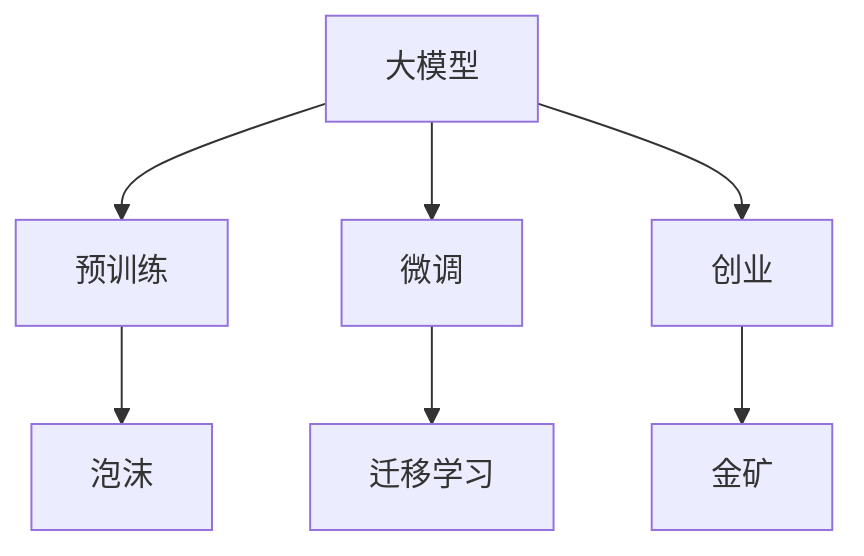

                 

## 1. 背景介绍

### 1.1 问题由来
近年来，人工智能(AI)技术发展迅猛，尤其是深度学习领域，涌现出了大量的预训练大模型，如BERT、GPT-3、T5等，这些模型在各种自然语言处理(NLP)任务上均取得了显著的效果。这些大模型作为通用知识库，已经被广泛应用于搜索、翻译、语音识别等各领域，显著提升了应用系统的智能化水平。

然而，尽管大模型带来了极大的便利，但实际落地应用的过程中也面临不少问题。以GPT-3为例，其训练成本高昂、模型复杂且难以解释，用户在使用时需通过API调用，成本较高。此外，预训练大模型通常需要依赖大公司强大的计算资源，普通企业难以自主使用。这些因素均使得大模型落地应用面临挑战。

在AI技术日益成熟的当下，各企业纷纷尝试利用大模型进行商业化布局，但其能否真正实现大规模应用，还需回答一个问题：AI大模型创业是泡沫还是金矿？

## 2. 核心概念与联系

### 2.1 核心概念概述

在探讨AI大模型创业前，首先需要明确几个核心概念：

- **大模型(Large Model)**：指预训练得到的具有大规模参数量的神经网络模型，例如GPT、BERT等。通过自监督学习方式在大量数据上预训练，学习到丰富的语言知识，具有通用性、可迁移性。

- **预训练(Pre-training)**：指在大量无标注数据上进行自监督学习，学习到通用的语言知识，如BERT、GPT-2、T5等。

- **微调(Fine-tuning)**：指在大模型基础上，利用少量标注数据，通过有监督学习对特定任务进行优化，提升模型在该任务上的性能，如问答系统、情感分析等。

- **迁移学习(Transfer Learning)**：指在预训练大模型基础上，通过微调的方式，使模型能够适配不同的下游任务。

- **创业(Entrepreneurship)**：指利用AI技术，结合自身优势，创立新公司或部门，从事与AI相关的业务活动。

- **泡沫( Bubble)**：指市场对AI技术或产品过度乐观，投资和需求远超其实际价值，导致价格虚高，最终崩盘的现象。

- **金矿(Gold Mine)**：指市场对AI技术或产品的实际价值有充分认识，投资和需求与实际价值相符，能够实现稳定增长的状态。

这些核心概念通过以下Mermaid流程图展现：



该流程图展示了大模型从预训练到微调再到创业的过程，以及泡沫与金矿的区别。

## 3. 核心算法原理 & 具体操作步骤

### 3.1 算法原理概述

大模型创业的背后，是基于深度学习技术的商业模式。其核心原理如下：

- **预训练大模型**：通过在无标签的大规模数据集上进行自监督学习，学习到语言知识，形成一个具有通用性和迁移性的模型。

- **微调**：在预训练模型基础上，通过下游任务的少量标注数据进行微调，提升模型在该任务上的性能，使其具备针对性。

- **迁移学习**：将预训练模型应用于不同的下游任务，通过微调的方式，使模型能够适应不同的数据分布，增强模型的泛化能力。

- **创业**：将大模型或其微调版作为产品或服务的核心，结合商业模式进行推广和销售。

### 3.2 算法步骤详解

大模型创业的算法步骤主要包括以下几个关键点：

1. **数据收集与预处理**：收集并预处理大规模数据，包括数据清洗、特征提取等。

2. **模型预训练**：使用无标签数据对模型进行预训练，学习到通用语言知识。

3. **微调**：选择预训练模型，利用下游任务的少量标注数据进行微调，提升模型在该任务上的性能。

4. **部署与应用**：将微调后的模型部署到应用系统中，实现商业化落地。

5. **商业化推广**：结合商业模式，推广和销售产品或服务。

### 3.3 算法优缺点

#### 优点：

- **通用性和可迁移性**：大模型具备通用性和可迁移性，能够在多个下游任务中进行微调，适应性强。

- **效率高**：通过微调，利用少量标注数据即可训练出高性能模型，大幅缩短开发周期。

- **效果好**：微调能够显著提升模型在下游任务上的性能，带来实际应用价值。

#### 缺点：

- **资源需求高**：大模型的预训练和微调需要大量的计算资源，成本较高。

- **模型复杂**：大模型结构复杂，难以解释和调试。

- **维护难度大**：模型更新和维护需要高度专业技能。

### 3.4 算法应用领域

大模型创业可以应用于众多领域，如自然语言处理、计算机视觉、语音识别、推荐系统等。以下是几个典型应用：

- **自然语言处理(NLP)**：通过微调大模型，实现问答系统、情感分析、机器翻译等。

- **计算机视觉(CV)**：利用大模型进行图像分类、目标检测、语义分割等任务。

- **语音识别(SR)**：通过微调大模型，实现语音转文本、说话人识别等应用。

- **推荐系统(Recommendation System)**：结合用户行为数据，微调大模型进行个性化推荐。

## 4. 数学模型和公式 & 详细讲解

### 4.1 数学模型构建

大模型创业的数学模型主要包含预训练和微调两个部分。以下是其构建过程：

1. **预训练模型**：假设模型为$M_{\theta}$，其中$\theta$为预训练得到的参数。预训练的目标函数为$\mathcal{L}_{pre}(\theta) = \mathbb{E}_{(x,y)}[\ell(M_{\theta}(x),y)]$，其中$\ell$为损失函数。

2. **微调模型**：假设下游任务为$t$，标注数据集为$D_t=\{(x_i,y_i)\}_{i=1}^N$，微调的目标函数为$\mathcal{L}_{finetune}(\theta) = \frac{1}{N}\sum_{i=1}^N\ell(M_{\theta}(x_i),y_i)$。

### 4.2 公式推导过程

假设模型$M_{\theta}$在预训练后的通用知识为$K$，对于下游任务$t$，微调模型$M_{\theta}^{finetune}$的预测函数为$M_{\theta}^{finetune}(x) = M_{\theta}(x) + f(t,K)$，其中$f$为微调函数。

微调的过程可以表示为：
$$
\theta^{finetune} = \arg\min_{\theta}\mathcal{L}_{finetune}(\theta)
$$

通过微调函数$f$，模型可以学习到针对特定任务的额外知识，提高其在下游任务上的性能。

### 4.3 案例分析与讲解

假设某公司希望利用大模型进行医疗问答系统的开发。首先，公司收集大量医疗相关文本，如病历、症状描述、诊断报告等。然后，使用这些无标签数据对BERT模型进行预训练，得到一个预训练模型$M_{\theta}$。接着，公司收集少量标注数据，对预训练模型进行微调，得到一个针对医疗问答任务的微调模型$M_{\theta}^{finetune}$。最后，将微调模型部署到问答系统应用中，实现医疗问答功能。

## 5. 项目实践：代码实例和详细解释说明

### 5.1 开发环境搭建

搭建大模型创业的开发环境主要包括以下步骤：

1. **安装Python和相关库**：确保Python版本为3.7以上，安装TensorFlow、PyTorch、Pandas等常用库。

2. **配置GPU和TPU**：在条件允许的情况下，配置GPU或TPU加速计算。

3. **准备数据集**：准备预训练数据和下游任务的数据集，进行清洗和标注。

### 5.2 源代码详细实现

以下是使用PyTorch进行BERT模型微调的代码实现：

```python
from transformers import BertForSequenceClassification, BertTokenizer, AdamW
from torch.utils.data import DataLoader
from torch.nn import CrossEntropyLoss
from sklearn.metrics import accuracy_score

# 加载预训练模型和分词器
model = BertForSequenceClassification.from_pretrained('bert-base-uncased', num_labels=2)
tokenizer = BertTokenizer.from_pretrained('bert-base-uncased')

# 准备数据集
train_data = ...
val_data = ...
test_data = ...

# 定义损失函数和优化器
criterion = CrossEntropyLoss()
optimizer = AdamW(model.parameters(), lr=1e-5)

# 训练模型
model.train()
for epoch in range(10):
    for batch in DataLoader(train_data, batch_size=16, shuffle=True):
        inputs, labels = batch
        inputs = tokenizer(inputs, padding='max_length', truncation=True, max_length=128)
        outputs = model(**inputs)
        loss = criterion(outputs, labels)
        optimizer.zero_grad()
        loss.backward()
        optimizer.step()

# 评估模型
model.eval()
with torch.no_grad():
    val_preds = []
    val_labels = []
    for batch in DataLoader(val_data, batch_size=16):
        inputs, labels = batch
        inputs = tokenizer(inputs, padding='max_length', truncation=True, max_length=128)
        outputs = model(**inputs)
        val_preds.append(outputs.argmax(dim=1).tolist())
        val_labels.append(labels.tolist())
    
    val_accuracy = accuracy_score(val_labels, val_preds)
```

### 5.3 代码解读与分析

- **数据集准备**：
  - `BertForSequenceClassification`类加载BERT预训练模型，`BertTokenizer`类加载分词器。
  - 使用`DataLoader`类加载训练集、验证集和测试集。

- **模型训练**：
  - 使用`CrossEntropyLoss`作为损失函数。
  - 定义AdamW优化器。
  - 在每个epoch内，对训练集数据进行迭代，前向传播计算损失，反向传播更新参数。

- **模型评估**：
  - 对验证集数据进行迭代，前向传播计算预测值，使用`accuracy_score`计算准确率。

通过上述代码实现，可以完成BERT模型在医疗问答任务上的微调。

## 6. 实际应用场景

### 6.1 医疗问答系统

医疗问答系统是利用大模型创业的一个典型场景。公司可以通过微调BERT等大模型，结合医疗领域的知识库和规则库，构建具有高度智能化水平的医疗问答系统。

例如，某公司收集大量医疗案例，利用微调后的BERT模型生成问答对，用户输入症状描述，系统即可输出推荐的治疗方案和医生建议。该系统具有高度的智能性和可解释性，能够显著提升医疗服务的质量和效率。

### 6.2 金融舆情分析

金融舆情分析是大模型创业的另一个重要应用场景。公司可以收集大量金融新闻、评论等文本数据，利用微调后的BERT模型进行情感分析和舆情监测。

例如，某公司利用微调后的BERT模型，对金融市场的新闻和评论进行情感分析，识别出市场的情绪变化趋势，帮助投资者及时规避风险。

### 6.3 智能客服

智能客服是大模型创业的典型应用场景之一。公司可以通过微调BERT等大模型，构建智能客服系统，提供24小时不间断服务。

例如，某公司利用微调后的BERT模型，在智能客服系统中引入自然语言理解，能够根据用户提出的问题，自动匹配答案并生成回复，提升客户体验。

## 7. 工具和资源推荐

### 7.1 学习资源推荐

- **《深度学习》书籍**：李宏毅教授的《深度学习》课程，深入浅出地介绍了深度学习原理，适合入门学习。
- **《TensorFlow》官方文档**：提供TensorFlow的详细使用方法和最佳实践。
- **HuggingFace Transformers库文档**：提供了大量预训练模型和微调样例，适合实践操作。

### 7.2 开发工具推荐

- **PyTorch**：Python语言的开源深度学习框架，灵活高效，支持GPU/TPU加速。
- **TensorFlow**：Google主导的深度学习框架，功能全面，支持多平台部署。
- **Transformers库**：HuggingFace开发的NLP库，提供了丰富的预训练模型和微调样例。
- **TensorBoard**：用于可视化模型训练过程和参数优化。

### 7.3 相关论文推荐

- **Attention is All You Need**：Transformer模型的原始论文，开创了预训练大模型的先河。
- **BERT: Pre-training of Deep Bidirectional Transformers for Language Understanding**：BERT模型的论文，提出了掩码语言模型和Next Sentence Prediction任务，大幅提升了语言模型的效果。
- **Language Models are Unsupervised Multitask Learners**：GPT-2模型的论文，展示了语言模型的强大自学习能力。

## 8. 总结：未来发展趋势与挑战

### 8.1 总结

本文对大模型创业的原理、步骤、优缺点及应用进行了详细阐述。大模型创业作为AI技术落地的重要方式，具有广阔的应用前景，但同时面临一些挑战。

通过本文的系统梳理，可以看出，大模型创业能够带来巨大的商业价值和技术进步，但也需要克服资源需求高、模型复杂、维护难度大等挑战。未来需要更多理论和实践的探索，以实现大模型创业的持续发展和商业化落地。

### 8.2 未来发展趋势

- **计算资源优化**：未来的计算资源优化将聚焦于GPU、TPU等硬件设备，以及更高效的模型结构和算法，进一步降低大模型的计算成本。

- **模型压缩和量化**：通过模型压缩和量化技术，进一步减小模型参数和存储开销，提高计算效率。

- **多模态融合**：未来的AI模型将更加注重多模态数据的融合，融合视觉、语音、文本等多模态信息，提升模型的综合能力。

- **模型解释性和可解释性**：未来的大模型将更加注重模型解释性和可解释性，提升模型的透明性和可信度。

- **自动化和智能化**：通过自动化和智能化技术，提升大模型的应用效果和用户体验。

### 8.3 面临的挑战

- **计算资源瓶颈**：大模型的训练和微调需要大量计算资源，如何降低计算成本，提高计算效率，仍然是一个挑战。

- **模型复杂性**：大模型的结构复杂，难以解释和调试，如何提高模型的透明性和可解释性，提升模型的可信度，是一个重要挑战。

- **数据获取和标注**：大模型的训练和微调需要大量高质量数据和标注，如何获取这些数据并标注，是一个重要问题。

- **应用场景多样化**：大模型的应用场景非常多样化，如何针对不同的应用场景，进行模型适配和优化，是一个挑战。

- **市场接受度**：大模型的商业化需要面对市场的广泛接受度，如何提高市场接受度和用户认知，是一个重要挑战。

### 8.4 研究展望

未来的研究需要从以下几个方面进行深入探索：

- **计算资源优化**：优化计算资源配置，提升计算效率，降低计算成本。

- **模型压缩和量化**：通过模型压缩和量化技术，进一步减小模型参数和存储开销，提高计算效率。

- **多模态融合**：融合视觉、语音、文本等多模态数据，提升模型的综合能力。

- **模型解释性和可解释性**：提高模型的透明性和可信度，提升用户的接受度和信任度。

- **自动化和智能化**：提升大模型的应用效果和用户体验，实现更智能化的AI系统。

总之，大模型创业是AI技术落地的重要方式，具有广阔的应用前景。未来需要更多理论和实践的探索，以实现大模型创业的持续发展和商业化落地。

## 9. 附录：常见问题与解答

**Q1: 大模型创业与传统软件开发有何不同？**

A: 大模型创业与传统软件开发的主要不同点在于数据和模型的重要性。传统软件开发更多依赖代码和逻辑实现，而大模型创业更多依赖数据和模型。

**Q2: 大模型创业的盈利模式有哪些？**

A: 大模型创业的盈利模式主要包括：
- **服务订阅**：提供基于云的API服务，按用户使用量收费。
- **产品销售**：出售预训练模型或微调模型。
- **定制化开发**：为特定企业定制化开发基于大模型的应用系统。

**Q3: 大模型创业需要注意哪些风险？**

A: 大模型创业需要注意以下风险：
- **数据隐私和版权**：确保数据隐私和版权，避免法律风险。
- **市场竞争**：面对激烈的市场竞争，需要不断优化产品和服务。
- **技术演进**：持续跟踪技术演进，及时更新模型和算法。

通过本文的系统梳理，可以看出，大模型创业具有广阔的应用前景，但也需要克服资源需求高、模型复杂等挑战。未来需要更多理论和实践的探索，以实现大模型创业的持续发展和商业化落地。

---

作者：禅与计算机程序设计艺术 / Zen and the Art of Computer Programming

