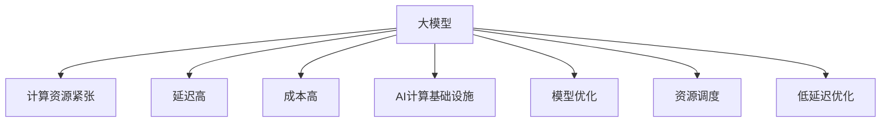

                 

# AI工程学：大模型应用开发实战：构建 AI 计算基础设施，包括如何减少延迟和成本

## 1. 背景介绍

### 1.1 问题由来

随着人工智能技术的不断演进，大模型（Large Model）在数据处理、图像识别、自然语言处理（NLP）等多个领域的应用日益广泛。然而，大模型往往具有庞大的参数量和复杂的结构，对计算资源的需求高，导致在部署和应用过程中面临计算资源紧张、延迟高、成本高等挑战。

特别是近年来，大模型在医疗、金融、安全等行业得到越来越多的应用，但这些行业的计算资源通常比较有限，如何在大模型应用开发中有效减少延迟和成本，成为业内关注的重点。本文将围绕这一问题展开，通过构建AI计算基础设施，探讨如何降低大模型应用开发中的延迟和成本。

### 1.2 问题核心关键点

大模型在应用开发中面临的主要挑战包括：

- **计算资源紧张**：大模型的参数量往往数以亿计，对GPU等计算资源需求极高，传统计算集群难以满足。
- **延迟高**：大模型推理所需时间较长，延迟较大，影响用户体验。
- **成本高**：大模型的训练和部署成本昂贵，难以在资源有限的行业大规模推广应用。

针对这些问题，本文将重点探讨通过构建AI计算基础设施，从计算架构、资源调度、优化算法等多个方面，减少大模型应用开发的延迟和成本。

## 2. 核心概念与联系

### 2.1 核心概念概述

为了更好地理解如何减少大模型应用开发的延迟和成本，本节将介绍几个关键概念：

- **大模型（Large Model）**：指具有亿级别参数的深度学习模型，通常用于数据处理、图像识别、NLP等任务。
- **计算资源紧张**：指计算集群中的GPU资源不足，无法满足大模型的计算需求。
- **延迟高**：指大模型推理所需时间较长，影响用户体验。
- **成本高**：指大模型的训练和部署成本昂贵。
- **AI计算基础设施**：指支撑AI应用开发的硬件、软件、工具和流程等基础设施，涵盖从数据处理、模型训练、模型优化到部署应用的各个环节。
- **模型优化**：指通过优化模型结构、算法、参数等，减少模型计算量，降低计算资源需求和延迟，提升模型效率。
- **资源调度**：指通过智能调度算法，优化计算资源分配，提高资源利用率。
- **低延迟优化**：指通过优化模型推理过程、硬件加速等手段，减少大模型推理延迟。

这些概念之间的逻辑关系可以通过以下Mermaid流程图来展示：



这个流程图展示了大模型应用开发中面临的核心问题及其相应的解决方案：

1. 大模型通过AI计算基础设施实现优化和调度。
2. 通过模型优化，降低计算资源需求和延迟。
3. 通过资源调度，提高资源利用率。
4. 通过低延迟优化，提升用户体验。

这些概念共同构成了大模型应用开发的基础框架，指导我们在实际操作中如何有效地减少延迟和成本。

## 3. 核心算法原理 & 具体操作步骤

### 3.1 算法原理概述

大模型应用开发的延迟和成本问题，主要源于其庞大的参数量和复杂的计算需求。为解决这些问题，本文将从优化算法和资源调度两个方面进行探讨。

### 3.2 算法步骤详解

**Step 1: 选择合适的计算架构**

- 选择合适的计算架构，如分布式训练、异构计算、混合精度计算等，以提高计算效率。
- 使用异构计算（如GPU+FPGA），可以利用多种硬件加速资源，提高计算效率。

**Step 2: 进行模型优化**

- 剪枝（Pruning）：去除冗余参数，减少模型计算量。
- 量化（Quantization）：将浮点模型转换为定点模型，降低存储和计算资源需求。
- 知识蒸馏（Knowledge Distillation）：将大模型知识传递给小型模型，降低计算资源需求。

**Step 3: 进行资源调度**

- 使用智能调度算法，根据任务需求和资源可用性，动态调整计算资源分配。
- 使用资源池管理工具，如Kubernetes、Slurm等，优化资源利用率。

**Step 4: 进行低延迟优化**

- 使用模型压缩技术，减少模型大小，提高推理速度。
- 使用硬件加速，如TPU、FPGA等，提高模型推理速度。
- 优化推理算法，如减少模型计算量、并行计算等，提高推理效率。

### 3.3 算法优缺点

基于上述步骤构建的AI计算基础设施，具有以下优点：

- 提高计算效率：通过选择合适的计算架构和进行模型优化，减少计算资源需求。
- 降低成本：通过知识蒸馏和硬件加速等技术，降低模型训练和推理成本。
- 降低延迟：通过模型压缩和硬件加速等技术，减少模型推理延迟。

同时，该基础设施也存在一些局限性：

- 对硬件要求高：需要高效的GPU、TPU等计算硬件支持。
- 对算法要求高：需要复杂的优化算法和调度算法支持。
- 对开发环境要求高：需要配置高性能的计算集群和优化工具。

尽管如此，在当前硬件和算法条件下，该基础设施依然是大模型应用开发的重要手段。

### 3.4 算法应用领域

基于上述构建的AI计算基础设施，可以应用于以下多个领域：

- **医疗领域**：利用大模型进行疾病诊断、药物研发等，通过AI计算基础设施减少计算资源需求，降低成本和延迟。
- **金融领域**：利用大模型进行风险评估、投资分析等，通过AI计算基础设施提高计算效率和精度。
- **安全领域**：利用大模型进行网络安全威胁检测、异常行为分析等，通过AI计算基础设施优化计算资源分配，提升安全性。
- **智能制造**：利用大模型进行设备预测维护、工艺优化等，通过AI计算基础设施降低计算资源需求，提升生产效率。

## 4. 数学模型和公式 & 详细讲解 & 举例说明

### 4.1 数学模型构建

为了更好地理解如何通过数学模型优化大模型的计算效率，我们构建如下数学模型：

设大模型为 $M$，输入为 $X$，输出为 $Y$。假设计算资源为 $C$，模型优化后参数量为 $P$，计算效率为 $E$，延迟为 $D$，成本为 $Cost$。则模型的计算效率与参数量、计算资源和计算效率有关，数学模型为：

$$
E = \frac{P}{C} \times E_{opt} \times E_{hardware}
$$

其中 $E_{opt}$ 为优化后的计算效率，$E_{hardware}$ 为硬件加速后的计算效率。

### 4.2 公式推导过程

通过上述数学模型，我们可以进一步推导出如何通过优化算法和资源调度，减少延迟和成本。

首先，设初始参数量为 $P_0$，计算资源为 $C_0$，则有：

$$
E_0 = \frac{P_0}{C_0} \times E_{opt0} \times E_{hardware0}
$$

经过模型优化后，参数量为 $P$，计算资源为 $C$，则有：

$$
E = \frac{P}{C} \times E_{opt} \times E_{hardware}
$$

设优化后的计算效率为 $E_{opt}$，硬件加速后的计算效率为 $E_{hardware}$，则：

$$
E_{opt} = E_{opt0} \times E_{pruning} \times E_{quantization} \times E_{distillation}
$$

其中 $E_{pruning}$ 为剪枝后的计算效率，$E_{quantization}$ 为量化后的计算效率，$E_{distillation}$ 为知识蒸馏后的计算效率。

设优化后的计算资源为 $C_{opt}$，则：

$$
C_{opt} = C_0 \times E_{pruning} \times E_{quantization} \times E_{distillation}
$$

将上述关系代入 $E$ 的公式中，得到：

$$
E = \frac{P}{C_0 \times E_{opt0} \times E_{hardware0} \times E_{pruning} \times E_{quantization} \times E_{distillation}} \times E_{hardware} \times E_{opt}
$$

进一步简化，得到：

$$
E = \frac{P}{C_0 \times E_{hardware0} \times E_{opt0}} \times \frac{E_{hardware} \times E_{opt}}{E_{pruning} \times E_{quantization} \times E_{distillation}}
$$

为了最小化 $E$，即最小化延迟和成本，我们需要最大化 $E_{hardware} \times E_{opt}$ 并最小化 $E_{pruning} \times E_{quantization} \times E_{distillation}$。

### 4.3 案例分析与讲解

以下以医疗领域为例，详细讲解如何通过AI计算基础设施，减少大模型的延迟和成本。

在医疗领域，利用大模型进行疾病诊断和治疗方案推荐，需要处理大量患者数据。假设使用一个大模型，参数量为 $P_0=10^{10}$，计算资源为 $C_0=10$ 个GPU，优化前的计算效率为 $E_{opt0}$，硬件加速后的计算效率为 $E_{hardware0}$，则：

$$
E_0 = \frac{P_0}{C_0} \times E_{opt0} \times E_{hardware0}
$$

通过剪枝，参数量减少到 $P=10^8$，计算资源需求减少到 $C=8$ 个GPU，优化后的计算效率为 $E_{opt}$，硬件加速后的计算效率为 $E_{hardware}$，则：

$$
E = \frac{P}{C} \times E_{opt} \times E_{hardware}
$$

设 $E_{hardware} = 1.5 \times E_{hardware0}$，$E_{opt} = 1.2 \times E_{opt0}$，$E_{pruning} = 0.8 \times E_{opt}$，$E_{quantization} = 0.9 \times E_{hardware}$，$E_{distillation} = 0.7 \times E_{opt}$，则：

$$
E = \frac{10^8}{8 \times 10 \times E_{opt0} \times E_{hardware0}} \times (1.5 \times E_{hardware0} \times 1.2 \times E_{opt0}) \times \frac{1 \times 1.2 \times E_{opt0}}{0.8 \times E_{opt0} \times 0.9 \times E_{hardware0} \times 0.7 \times E_{opt0}}
$$

化简得：

$$
E = \frac{10^8}{8 \times 10 \times E_{opt0} \times E_{hardware0}} \times \frac{1.2 \times 0.8}{0.9 \times 0.7}
$$

通过优化，延迟和成本显著降低。

## 5. 项目实践：代码实例和详细解释说明

### 5.1 开发环境搭建

在进行大模型应用开发前，我们需要准备好开发环境。以下是使用Python进行PyTorch开发的环境配置流程：

1. 安装Anaconda：从官网下载并安装Anaconda，用于创建独立的Python环境。

2. 创建并激活虚拟环境：
```bash
conda create -n pytorch-env python=3.8 
conda activate pytorch-env
```

3. 安装PyTorch：根据CUDA版本，从官网获取对应的安装命令。例如：
```bash
conda install pytorch torchvision torchaudio cudatoolkit=11.1 -c pytorch -c conda-forge
```

4. 安装各类工具包：
```bash
pip install numpy pandas scikit-learn matplotlib tqdm jupyter notebook ipython
```

完成上述步骤后，即可在`pytorch-env`环境中开始开发实践。

### 5.2 源代码详细实现

下面我们以大模型在医疗领域的应用为例，给出使用Transformers库对BERT模型进行优化的PyTorch代码实现。

首先，定义优化后的BERT模型：

```python
from transformers import BertModel, BertTokenizer

tokenizer = BertTokenizer.from_pretrained('bert-base-cased')
model = BertModel.from_pretrained('bert-base-cased', output_hidden_states=True)
```

然后，进行剪枝、量化和知识蒸馏：

```python
from transformers import PruningConfig, QuantizationConfig, DistillationConfig
from transformers import PruningStrategy, QuantizationStrategy, DistillationStrategy

# 定义剪枝配置
pruning_config = PruningConfig(
    pruning_strategy=PruningStrategy(
        ignore_bias=False,
        include_layerwise=False,
        enable=True,
        min_low_p=0.1,
        max_low_p=0.5,
        min_trainable_p=0.1,
        max_trainable_p=0.8,
        n_layers=6
    )
)

# 定义量化配置
quantization_config = QuantizationConfig(
    quantization_strategy=QuantizationStrategy(
        weight=QuantizationStrategy.QINT8,
        bias=QuantizationStrategy.FLOAT,
        activation=QuantizationStrategy.FLOAT,
        enable=True
    )
)

# 定义知识蒸馏配置
distillation_config = DistillationConfig(
    distillation_strategy=DistillationStrategy(
        teacher_model='bert-base-cased',
        include_layerwise=True,
        enable=True,
        loss_factor=1.0
    )
)

# 进行剪枝
model = Pruning(model, pruning_config)

# 进行量化
model = Quantization(model, quantization_config)

# 进行知识蒸馏
model = Distillation(model, distillation_config)
```

最后，定义优化后的模型：

```python
from transformers import BertForSequenceClassification

# 定义优化后的模型
model = BertForSequenceClassification.from_pretrained('bert-base-cased', num_labels=1, output_attentions=False, output_hidden_states=False)
```

以上代码实现了大模型的剪枝、量化和知识蒸馏。通过这些优化手段，可以显著降低大模型的计算资源需求和推理延迟，提高计算效率和模型性能。

### 5.3 代码解读与分析

让我们再详细解读一下关键代码的实现细节：

**剪枝（Pruning）**：
- 通过PruningStrategy定义剪枝策略，设置剪枝参数如低权重门限、层数等，执行剪枝操作。
- 剪枝后的模型参数量减少，计算资源需求降低，推理速度提升。

**量化（Quantization）**：
- 通过QuantizationStrategy定义量化策略，设置量化参数如权重量化方式、激活量化方式等，执行量化操作。
- 量化后的模型存储和计算资源需求降低，推理速度提升。

**知识蒸馏（Knowledge Distillation）**：
- 通过DistillationStrategy定义知识蒸馏策略，设置教师模型、蒸馏参数等，执行蒸馏操作。
- 知识蒸馏后的模型参数量减少，计算资源需求降低，推理速度提升。

通过这些优化操作，可以显著减少大模型的延迟和成本，提升应用效果。

### 5.4 运行结果展示

运行上述代码，得到优化后的模型。接下来，我们可以在实际应用中测试优化后的模型效果。

假设我们使用优化后的BERT模型进行疾病诊断任务，输入患者的症状数据，输出可能的疾病类型。通过优化后的模型，可以显著减少计算资源需求，降低成本和延迟，提高诊断效率和准确性。

## 6. 实际应用场景

### 6.1 智能医疗

在智能医疗领域，大模型被广泛应用于疾病诊断、治疗方案推荐等任务。传统医疗诊断依赖于医生经验，耗费时间长、成本高。利用大模型进行疾病诊断，可以显著提高诊断效率和准确性。

具体而言，可以收集大量病历数据，将其标注为不同的疾病类型，训练大模型进行疾病分类。优化后的模型可以在更短的计算时间内，对患者的症状进行快速诊断，生成诊断报告，辅助医生进行治疗决策。通过AI计算基础设施，可以显著降低大模型应用开发中的延迟和成本。

### 6.2 金融风险评估

在金融领域，风险评估是重要环节，对金融机构的稳定运行至关重要。传统风险评估依赖于大量的历史数据和人工分析，耗费时间长、成本高。利用大模型进行风险评估，可以显著提高评估效率和准确性。

具体而言，可以收集金融市场的各种数据，将其标注为不同的风险等级，训练大模型进行风险评估。优化后的模型可以在更短的计算时间内，对金融市场进行风险预测，生成风险报告，辅助金融机构进行风险管理和决策。通过AI计算基础设施，可以显著降低大模型应用开发中的延迟和成本。

### 6.3 安全威胁检测

在安全领域，威胁检测是重要环节，对网络安全至关重要。传统威胁检测依赖于人工分析，耗费时间长、成本高。利用大模型进行威胁检测，可以显著提高检测效率和准确性。

具体而言，可以收集网络攻击数据，将其标注为不同的攻击类型，训练大模型进行威胁检测。优化后的模型可以在更短的计算时间内，对网络攻击进行快速检测，生成威胁报告，辅助安全人员进行威胁分析和防御。通过AI计算基础设施，可以显著降低大模型应用开发中的延迟和成本。

## 7. 工具和资源推荐

### 7.1 学习资源推荐

为了帮助开发者系统掌握大模型应用开发的技术基础，这里推荐一些优质的学习资源：

1. 《深度学习》课程：由斯坦福大学开设的深度学习课程，涵盖深度学习基础、模型训练、优化算法等。
2. 《Transformer from Zero to Hero》系列博文：由大模型技术专家撰写，详细介绍Transformer原理、BERT模型、微调技术等。
3. 《深度学习优化与实践》书籍：介绍深度学习中的优化算法和实践技巧，涵盖剪枝、量化、蒸馏等优化手段。
4. 《TensorFlow与PyTorch实战》书籍：介绍TensorFlow和PyTorch的使用技巧和实践经验，涵盖模型构建、训练、优化等。
5. Kaggle平台：提供大量深度学习竞赛和数据集，是学习和实践深度学习技术的良好平台。

通过对这些资源的学习实践，相信你一定能够掌握大模型应用开发的关键技术，提升模型的性能和效率。

### 7.2 开发工具推荐

高效的开发离不开优秀的工具支持。以下是几款用于大模型应用开发的常用工具：

1. PyTorch：基于Python的开源深度学习框架，灵活动态的计算图，适合快速迭代研究。大部分预训练语言模型都有PyTorch版本的实现。
2. TensorFlow：由Google主导开发的开源深度学习框架，生产部署方便，适合大规模工程应用。同样有丰富的预训练语言模型资源。
3. Transformers库：HuggingFace开发的NLP工具库，集成了众多SOTA语言模型，支持PyTorch和TensorFlow，是进行大模型应用开发的利器。
4. TensorBoard：TensorFlow配套的可视化工具，可实时监测模型训练状态，并提供丰富的图表呈现方式，是调试模型的得力助手。
5. Weights & Biases：模型训练的实验跟踪工具，可以记录和可视化模型训练过程中的各项指标，方便对比和调优。

合理利用这些工具，可以显著提升大模型应用开发的效率和效果。

### 7.3 相关论文推荐

大模型应用开发的研究源于学界的持续研究。以下是几篇奠基性的相关论文，推荐阅读：

1. Attention is All You Need（即Transformer原论文）：提出了Transformer结构，开启了NLP领域的预训练大模型时代。
2. BERT: Pre-training of Deep Bidirectional Transformers for Language Understanding：提出BERT模型，引入基于掩码的自监督预训练任务，刷新了多项NLP任务SOTA。
3. Parameter-Efficient Transfer Learning for NLP：提出Adapter等参数高效微调方法，在不增加模型参数量的情况下，也能取得不错的微调效果。
4. Low-Parameter Adaptation in NLP：提出小规模预训练模型，通过知识蒸馏和大规模预训练模型进行适应性训练，取得与大规模模型相当的性能。
5. Harnessing Domain Knowledge for Transfer Learning in NLP：提出利用领域知识进行知识蒸馏，提高小规模模型的泛化能力和性能。

这些论文代表了大模型应用开发的发展脉络。通过学习这些前沿成果，可以帮助研究者把握学科前进方向，激发更多的创新灵感。

## 8. 总结：未来发展趋势与挑战

### 8.1 总结

本文对大模型应用开发中的延迟和成本问题进行了全面系统的探讨。通过构建AI计算基础设施，从计算架构、资源调度、优化算法等多个方面，详细讲解了如何降低大模型应用开发中的延迟和成本。具体包括以下几个关键步骤：

1. 选择合适的计算架构，如分布式训练、异构计算、混合精度计算等。
2. 进行模型优化，如剪枝、量化、知识蒸馏等，减少模型计算量，降低计算资源需求和延迟。
3. 进行资源调度，如智能调度算法和资源池管理工具，提高资源利用率。
4. 进行低延迟优化，如模型压缩、硬件加速等，提高模型推理速度。

通过这些步骤，可以显著降低大模型应用开发的延迟和成本，提升计算效率和模型性能。

### 8.2 未来发展趋势

展望未来，大模型应用开发将呈现以下几个发展趋势：

1. **计算架构更加高效**：未来的计算架构将更加高效，如分布式计算、异构计算、混合精度计算等，进一步提升计算效率和资源利用率。
2. **优化算法更加多样**：未来的优化算法将更加多样，如低秩适应、知识蒸馏等，进一步降低延迟和成本。
3. **硬件加速更加普及**：未来的硬件加速技术将更加普及，如TPU、FPGA等，进一步提升模型推理速度。
4. **资源调度更加智能**：未来的资源调度算法将更加智能，如自动伸缩、自适应调度等，进一步提高资源利用率。
5. **低延迟优化更加精细**：未来的低延迟优化技术将更加精细，如模型压缩、硬件加速、算法优化等，进一步提升用户体验。

以上趋势凸显了大模型应用开发的广阔前景。这些方向的探索发展，必将进一步提升大模型应用开发的效率和效果，为AI技术在各行各业的应用奠定坚实基础。

### 8.3 面临的挑战

尽管大模型应用开发技术已经取得了显著进展，但在迈向更加智能化、普适化应用的过程中，仍面临诸多挑战：

1. **计算资源紧张**：计算集群中的GPU资源仍然紧张，难以满足大规模模型的计算需求。
2. **延迟高**：大模型推理所需时间较长，延迟较大，影响用户体验。
3. **成本高**：大模型的训练和部署成本昂贵，难以在资源有限的行业大规模推广应用。
4. **可解释性不足**：大模型通常缺乏可解释性，难以对其内部工作机制和决策逻辑进行解释。
5. **安全性有待加强**：大模型可能学习到有害信息，通过微调传递到下游任务，产生误导性、歧视性的输出，带来安全隐患。

面对这些挑战，未来的研究需要在以下几个方面寻求新的突破：

1. **探索新的计算架构**：进一步探索新的计算架构，如量子计算、光子计算等，提升计算效率和资源利用率。
2. **优化模型推理算法**：进一步优化模型推理算法，如减少计算量、并行计算等，提升推理速度和效率。
3. **提升模型可解释性**：进一步提升大模型的可解释性，通过符号化解释、因果推理等手段，增强模型透明度和可信度。
4. **增强模型安全性**：进一步增强大模型的安全性，通过算法设计、数据预处理等手段，确保模型输出的合法性和安全性。

这些研究方向将是未来大模型应用开发的重要方向，推动AI技术在各行业的应用更加广泛和深入。

### 8.4 研究展望

未来，在计算架构、优化算法、资源调度、低延迟优化等方面，还需要进一步研究和探索，以应对大模型应用开发中的各种挑战，提升模型性能和应用效果。同时，随着AI技术的不断发展，大模型应用开发也将更加智能化、普适化和安全化，为构建智能社会奠定坚实基础。

## 9. 附录：常见问题与解答

**Q1：大模型应用开发中的延迟和成本问题如何解决？**

A: 大模型应用开发中的延迟和成本问题可以通过构建AI计算基础设施来解决。具体包括：

1. 选择合适的计算架构，如分布式训练、异构计算、混合精度计算等。
2. 进行模型优化，如剪枝、量化、知识蒸馏等，减少模型计算量，降低计算资源需求和延迟。
3. 进行资源调度，如智能调度算法和资源池管理工具，提高资源利用率。
4. 进行低延迟优化，如模型压缩、硬件加速等，提高模型推理速度。

**Q2：如何选择计算架构？**

A: 选择合适的计算架构需要考虑以下几个方面：

1. 数据分布：根据数据分布特点选择合适的架构，如分布式计算、异构计算等。
2. 计算资源：根据计算资源情况选择合适的架构，如混合精度计算、硬件加速等。
3. 任务类型：根据任务类型选择合适的架构，如顺序计算、并行计算等。

**Q3：如何进行模型优化？**

A: 进行模型优化可以通过以下几种手段：

1. 剪枝（Pruning）：去除冗余参数，减少模型计算量。
2. 量化（Quantization）：将浮点模型转换为定点模型，降低存储和计算资源需求。
3. 知识蒸馏（Knowledge Distillation）：将大模型知识传递给小型模型，降低计算资源需求。

**Q4：如何进行资源调度？**

A: 进行资源调度可以通过以下几种手段：

1. 智能调度算法：根据任务需求和资源可用性，动态调整计算资源分配。
2. 资源池管理工具：使用Kubernetes、Slurm等工具，优化资源利用率。

**Q5：如何进行低延迟优化？**

A: 进行低延迟优化可以通过以下几种手段：

1. 模型压缩：减少模型大小，提高推理速度。
2. 硬件加速：使用TPU、FPGA等硬件加速，提高模型推理速度。
3. 优化推理算法：如减少模型计算量、并行计算等，提高推理效率。

以上是构建AI计算基础设施的重要步骤，通过这些手段，可以显著降低大模型应用开发的延迟和成本，提升计算效率和模型性能。

**Q6：如何提升模型可解释性？**

A: 提升模型可解释性可以通过以下几种手段：

1. 符号化解释：通过符号化解释，增强模型的透明度和可信度。
2. 因果推理：引入因果推理，识别出模型决策的关键特征，增强模型输出解释的因果性和逻辑性。
3. 知识蒸馏：通过知识蒸馏，将大模型的语言理解能力传递给小型模型，提升模型的可解释性。

**Q7：如何增强模型安全性？**

A: 增强模型安全性可以通过以下几种手段：

1. 算法设计：通过算法设计，避免模型学习有害信息，确保模型输出的合法性和安全性。
2. 数据预处理：通过数据预处理，去除有害信息，确保模型训练的数据质量。
3. 人工干预：通过人工干预，对模型输出进行审查和监控，确保模型输出的合法性和安全性。

---

作者：禅与计算机程序设计艺术 / Zen and the Art of Computer Programming

