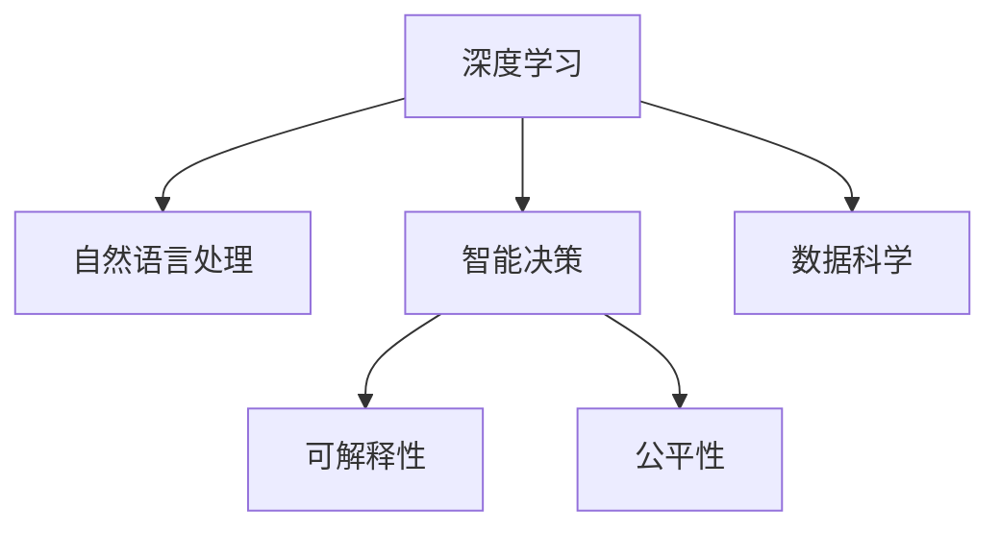

                 

# AI应用实践的新方向与趋势

> 关键词：AI应用、智能决策、深度学习、自然语言处理、数据科学

## 1. 背景介绍

### 1.1 问题由来
随着人工智能(AI)技术的不断发展和成熟，AI的应用场景日益丰富，从图像识别、语音处理到自然语言处理(NLP)、智能决策等领域，AI正在深刻地改变着人类的生活方式。然而，AI应用的技术复杂性以及数据需求的高门槛，使得其落地推广仍面临诸多挑战。本文旨在探讨AI应用实践的新方向与趋势，为AI技术的深入应用提供理论指导和实践参考。

### 1.2 问题核心关键点
AI应用的核心在于通过深度学习算法对海量数据进行建模，从而实现对复杂问题的自主决策和预测。然而，当前AI应用面临以下几个关键挑战：
1. 数据获取与标注成本高昂。
2. 算法模型的泛化能力和鲁棒性不足。
3. 计算资源和存储成本的限制。
4. 模型复杂度和可解释性的平衡。
5. 模型的公平性和安全性问题。

针对这些挑战，AI应用实践正在向以下几个新方向与趋势发展：

## 2. 核心概念与联系

### 2.1 核心概念概述

为更好地理解AI应用实践的新方向与趋势，本节将介绍几个密切相关的核心概念：

- **深度学习(Deep Learning, DL)**：一种基于神经网络的机器学习技术，通过对大规模数据进行多层次的非线性建模，从而实现对复杂数据的自主学习和决策。

- **自然语言处理(Natural Language Processing, NLP)**：通过语言模型、序列模型、预训练模型等技术，实现对自然语言的理解、生成和推理。

- **智能决策(Intelligent Decision Making, IDM)**：利用AI算法对复杂问题进行分析和决策，辅助或替代人类的决策过程，提升决策效率和准确性。

- **数据科学(Data Science, DS)**：通过对数据进行采集、存储、处理、分析和可视化，提取数据中的知识和洞察，为AI应用提供基础支持。

- **可解释性(Explainability)**：指AI模型决策过程的可解释性和透明性，便于理解模型的内部工作机制和决策逻辑。

- **公平性(Fairness)**：指AI模型在处理数据和决策过程中，不偏向或歧视任何群体，确保决策的公正性和公平性。

这些核心概念之间的逻辑关系可以通过以下Mermaid流程图来展示：



这个流程图展示了大语言模型的核心概念及其之间的关系：

1. 深度学习是大语言模型的基础，通过对大规模数据进行非线性建模，实现对复杂问题的自主学习和决策。
2. 自然语言处理是大语言模型的关键应用领域，通过语言模型、序列模型、预训练模型等技术，实现对自然语言的理解、生成和推理。
3. 智能决策是大语言模型的重要应用场景，利用AI算法对复杂问题进行分析和决策，辅助或替代人类的决策过程，提升决策效率和准确性。
4. 数据科学是大语言模型的支撑体系，通过对数据进行采集、存储、处理、分析和可视化，提取数据中的知识和洞察，为AI应用提供基础支持。
5. 可解释性是大语言模型的重要研究方向，指AI模型决策过程的可解释性和透明性，便于理解模型的内部工作机制和决策逻辑。
6. 公平性是大语言模型的伦理考量，指AI模型在处理数据和决策过程中，不偏向或歧视任何群体，确保决策的公正性和公平性。

这些核心概念共同构成了大语言模型的应用框架，使其能够在各种场景下发挥强大的自主学习和决策能力。通过理解这些核心概念，我们可以更好地把握大语言模型的工作原理和优化方向。

## 3. 核心算法原理 & 具体操作步骤
### 3.1 算法原理概述

AI应用实践的核心在于通过深度学习算法对数据进行建模，从而实现对复杂问题的自主决策和预测。其核心算法包括深度神经网络、卷积神经网络(CNN)、循环神经网络(RNN)、Transformer等。

深度神经网络通过多层非线性变换，将输入数据映射到输出空间，从而实现对数据的自主学习和决策。其基本架构包括输入层、隐藏层和输出层，隐藏层通过非线性激活函数实现对数据的非线性建模。

卷积神经网络通过卷积操作实现对图像和视频等空间数据的自动特征提取，常用于图像识别、目标检测等任务。其基本架构包括卷积层、池化层和全连接层，卷积层实现对数据的局部特征提取，池化层实现对特征的降维和抽象，全连接层实现对高维特征的分类和决策。

循环神经网络通过循环连接实现对序列数据的建模，常用于自然语言处理、语音识别等任务。其基本架构包括输入层、隐藏层和输出层，隐藏层通过循环连接实现对序列数据的记忆和处理。

Transformer通过自注意力机制实现对序列数据的非线性建模，常用于自然语言处理、机器翻译等任务。其基本架构包括编码器和解码器，编码器和解码器均由多层自注意力和前馈神经网络组成，实现对序列数据的自主学习和决策。

### 3.2 算法步骤详解

AI应用实践的一般流程包括数据获取与预处理、模型选择与训练、模型评估与优化、模型应用与部署等步骤。

**Step 1: 数据获取与预处理**
- 收集应用场景所需的数据，并进行清洗、去重、标注等预处理。
- 将数据划分为训练集、验证集和测试集。
- 将数据转化为模型可接受的格式，如图像、文本等。

**Step 2: 模型选择与训练**
- 根据应用场景和任务需求，选择合适的深度学习模型，如CNN、RNN、Transformer等。
- 选择合适的优化算法及其参数，如Adam、SGD等，设置学习率、批大小、迭代轮数等。
- 设置正则化技术及强度，包括权重衰减、Dropout、Early Stopping等。
- 执行梯度训练，不断更新模型参数，最小化损失函数。

**Step 3: 模型评估与优化**
- 在验证集上评估模型性能，根据性能指标决定是否触发Early Stopping。
- 根据评估结果调整模型超参数，如学习率、批大小、优化器等。
- 在测试集上评估最终模型的性能，确保模型在新样本上具有较好的泛化能力。

**Step 4: 模型应用与部署**
- 将训练好的模型应用于实际场景，进行数据输入和预测输出。
- 集成模型到实际应用系统中，如智能决策系统、智能客服系统等。
- 持续收集新的数据，定期重新训练模型，以适应数据分布的变化。

### 3.3 算法优缺点

AI应用实践的优点在于其自主学习和决策能力，可以处理大规模复杂数据，实现高效、准确的决策。然而，其缺点也显而易见：

优点：
1. 自主学习和决策能力。AI应用通过深度学习算法，可以对大规模复杂数据进行自主学习和决策，实现高效、准确的决策。
2. 灵活性和适应性。AI应用可以通过调整模型超参数和优化算法，适应不同应用场景和任务需求。
3. 可扩展性。AI应用可以通过增加数据量、提高模型复杂度等方式，实现性能的不断提升。

缺点：
1. 数据需求高。AI应用需要大规模高质量数据进行训练，数据获取与标注成本高昂。
2. 模型泛化能力不足。AI应用对数据分布的依赖较大，泛化能力和鲁棒性不足，难以处理异常数据。
3. 计算资源消耗大。AI应用需要高性能计算资源进行训练和推理，计算成本高昂。
4. 模型复杂度高。AI应用需要复杂的深度神经网络进行建模，模型复杂度高，难以理解其内部工作机制。

尽管存在这些缺点，但AI应用实践仍在不断发展和成熟，其应用前景广阔，尤其在智能决策、自然语言处理、智能客服等领域具有巨大的应用潜力。

### 3.4 算法应用领域

AI应用实践已经在多个领域得到了广泛的应用，包括但不限于：

- **智能决策系统**：通过深度学习算法对复杂问题进行分析和决策，辅助或替代人类的决策过程，提升决策效率和准确性。如金融风控、医疗诊断、智能交通等。
- **自然语言处理(NLP)**：通过语言模型、序列模型、预训练模型等技术，实现对自然语言的理解、生成和推理。如机器翻译、情感分析、文本摘要等。
- **智能客服系统**：通过深度学习算法构建智能客服机器人，提升客户咨询体验，降低人工成本。如智能客服对话、智能推荐、智能客服决策等。
- **智能推荐系统**：通过深度学习算法对用户行为数据进行分析，实现个性化推荐，提升用户体验。如电商推荐、视频推荐、新闻推荐等。
- **图像识别与目标检测**：通过卷积神经网络等技术，实现对图像的自动特征提取和分类，常用于安防监控、医疗影像分析等领域。如人脸识别、车辆识别、医学影像诊断等。

除了上述这些经典应用外，AI应用实践还在更多场景中得到了创新性的应用，如自动驾驶、智能医疗、智能制造等，为各行各业带来了新的发展机遇。

## 4. 数学模型和公式 & 详细讲解  
### 4.1 数学模型构建

本节将使用数学语言对AI应用实践的理论基础进行更加严格的刻画。

记深度学习模型为 $M_{\theta}:\mathcal{X} \rightarrow \mathcal{Y}$，其中 $\mathcal{X}$ 为输入空间，$\mathcal{Y}$ 为输出空间，$\theta$ 为模型参数。假设应用场景的任务为 $T$，其训练集为 $D=\{(x_i,y_i)\}_{i=1}^N$。

定义模型 $M_{\theta}$ 在数据样本 $(x,y)$ 上的损失函数为 $\ell(M_{\theta}(x),y)$，则在数据集 $D$ 上的经验风险为：

$$
\mathcal{L}(\theta) = \frac{1}{N} \sum_{i=1}^N \ell(M_{\theta}(x_i),y_i)
$$

微调的目标是最小化经验风险，即找到最优参数：

$$
\theta^* = \mathop{\arg\min}_{\theta} \mathcal{L}(\theta)
$$

在实践中，我们通常使用基于梯度的优化算法（如SGD、Adam等）来近似求解上述最优化问题。设 $\eta$ 为学习率，$\lambda$ 为正则化系数，则参数的更新公式为：

$$
\theta \leftarrow \theta - \eta \nabla_{\theta}\mathcal{L}(\theta) - \eta\lambda\theta
$$

其中 $\nabla_{\theta}\mathcal{L}(\theta)$ 为损失函数对参数 $\theta$ 的梯度，可通过反向传播算法高效计算。

### 4.2 公式推导过程

以下我们以二分类任务为例，推导交叉熵损失函数及其梯度的计算公式。

假设模型 $M_{\theta}$ 在输入 $x$ 上的输出为 $\hat{y}=M_{\theta}(x) \in [0,1]$，表示样本属于正类的概率。真实标签 $y \in \{0,1\}$。则二分类交叉熵损失函数定义为：

$$
\ell(M_{\theta}(x),y) = -[y\log \hat{y} + (1-y)\log (1-\hat{y})]
$$

将其代入经验风险公式，得：

$$
\mathcal{L}(\theta) = -\frac{1}{N}\sum_{i=1}^N [y_i\log M_{\theta}(x_i)+(1-y_i)\log(1-M_{\theta}(x_i))]
$$

根据链式法则，损失函数对参数 $\theta_k$ 的梯度为：

$$
\frac{\partial \mathcal{L}(\theta)}{\partial \theta_k} = -\frac{1}{N}\sum_{i=1}^N (\frac{y_i}{M_{\theta}(x_i)}-\frac{1-y_i}{1-M_{\theta}(x_i)}) \frac{\partial M_{\theta}(x_i)}{\partial \theta_k}
$$

其中 $\frac{\partial M_{\theta}(x_i)}{\partial \theta_k}$ 可进一步递归展开，利用自动微分技术完成计算。

在得到损失函数的梯度后，即可带入参数更新公式，完成模型的迭代优化。重复上述过程直至收敛，最终得到适应特定任务的最优模型参数 $\theta^*$。

## 5. 项目实践：代码实例和详细解释说明
### 5.1 开发环境搭建

在进行AI应用实践前，我们需要准备好开发环境。以下是使用Python进行TensorFlow开发的环境配置流程：

1. 安装Anaconda：从官网下载并安装Anaconda，用于创建独立的Python环境。

2. 创建并激活虚拟环境：
```bash
conda create -n tf-env python=3.8 
conda activate tf-env
```

3. 安装TensorFlow：根据CUDA版本，从官网获取对应的安装命令。例如：
```bash
conda install tensorflow tensorflow-gpu=cuda11.1 -c pytorch -c conda-forge
```

4. 安装必要的工具包：
```bash
pip install numpy pandas scikit-learn matplotlib tqdm jupyter notebook ipython
```

完成上述步骤后，即可在`tf-env`环境中开始AI应用实践。

### 5.2 源代码详细实现

这里我们以二分类任务为例，给出使用TensorFlow进行神经网络模型训练的PyTorch代码实现。

首先，定义二分类任务的数据处理函数：

```python
import tensorflow as tf
from tensorflow.keras import layers
from sklearn.model_selection import train_test_split
from sklearn.metrics import accuracy_score

def load_data():
    # 加载数据集
    X_train, X_test, y_train, y_test = train_test_split(X, y, test_size=0.2, random_state=42)
    return X_train, X_test, y_train, y_test

def preprocess_data(X):
    # 数据预处理
    X = layers.experimental.preprocessing.ImageDataGenerator(
        rescale=1./255,
        zoom_range=0.1,
        width_shift_range=0.1,
        height_shift_range=0.1,
        horizontal_flip=True
    ).flow(X, batch_size=32)
    return X
```

然后，定义神经网络模型：

```python
class Model(tf.keras.Model):
    def __init__(self):
        super(Model, self).__init__()
        self.conv1 = layers.Conv2D(32, (3,3), activation='relu')
        self.pool1 = layers.MaxPooling2D((2,2))
        self.conv2 = layers.Conv2D(64, (3,3), activation='relu')
        self.pool2 = layers.MaxPooling2D((2,2))
        self.flatten = layers.Flatten()
        self.dense1 = layers.Dense(64, activation='relu')
        self.dense2 = layers.Dense(2, activation='softmax')

    def call(self, inputs):
        x = self.conv1(inputs)
        x = self.pool1(x)
        x = self.conv2(x)
        x = self.pool2(x)
        x = self.flatten(x)
        x = self.dense1(x)
        return self.dense2(x)
```

接着，定义训练和评估函数：

```python
def train_model(model, X_train, y_train, epochs=10, batch_size=32):
    # 定义优化器和损失函数
    optimizer = tf.keras.optimizers.Adam(learning_rate=0.001)
    loss_fn = tf.keras.losses.SparseCategoricalCrossentropy(from_logits=True)

    # 定义训练函数
    def train_step(inputs, targets):
        with tf.GradientTape() as tape:
            logits = model(inputs)
            loss_value = loss_fn(targets, logits)
        gradients = tape.gradient(loss_value, model.trainable_variables)
        optimizer.apply_gradients(zip(gradients, model.trainable_variables))

    # 训练模型
    for epoch in range(epochs):
        for i in range(0, X_train.shape[0], batch_size):
            inputs = X_train[i:i+batch_size]
            targets = y_train[i:i+batch_size]
            train_step(inputs, targets)

    # 在测试集上评估模型
    X_test = preprocess_data(X_test)
    y_pred = model(X_test).numpy()
    y_pred = np.argmax(y_pred, axis=1)
    accuracy = accuracy_score(y_test, y_pred)
    print(f'Test Accuracy: {accuracy:.2f}')
```

最后，启动训练流程并在测试集上评估：

```python
X, y = load_data()
X_train, X_test, y_train, y_test = X_train, X_test, y_train, y_test

# 构建模型
model = Model()

# 训练模型
train_model(model, X_train, y_train)

# 在测试集上评估模型
X_test = preprocess_data(X_test)
y_pred = model(X_test).numpy()
y_pred = np.argmax(y_pred, axis=1)
accuracy = accuracy_score(y_test, y_pred)
print(f'Test Accuracy: {accuracy:.2f}')
```

以上就是使用TensorFlow进行二分类任务神经网络模型训练的完整代码实现。可以看到，借助TensorFlow的高级API，我们可以用相对简洁的代码完成神经网络模型的构建和训练。

### 5.3 代码解读与分析

让我们再详细解读一下关键代码的实现细节：

**preprocess_data函数**：
- 对输入数据进行预处理，包括归一化、旋转、平移、翻转等，增加数据多样性，防止过拟合。

**Model类**：
- 定义了神经网络模型的架构，包括卷积层、池化层、全连接层等。

**train_model函数**：
- 定义了模型的优化器和损失函数。
- 实现了训练函数train_step，通过反向传播更新模型参数。
- 在训练过程中，使用梯度累积等技术，加快模型收敛。

**训练流程**：
- 定义总的训练轮数epochs和批大小batch_size，开始循环迭代
- 每个epoch内，对训练数据进行批处理，执行训练函数train_step
- 在测试集上评估模型性能，输出准确率

可以看到，TensorFlow使得神经网络模型的训练和评估过程变得简洁高效。开发者可以将更多精力放在模型设计、数据处理等高层逻辑上，而不必过多关注底层的实现细节。

当然，工业级的系统实现还需考虑更多因素，如模型的保存和部署、超参数的自动搜索、更灵活的任务适配层等。但核心的神经网络模型训练范式基本与此类似。

## 6. 实际应用场景
### 6.1 智能决策系统

智能决策系统是AI应用实践的重要应用场景之一，通过深度学习算法对复杂问题进行分析和决策，辅助或替代人类的决策过程，提升决策效率和准确性。例如，金融风控、医疗诊断、智能交通等领域，通过构建智能决策系统，可以实现实时风险评估、智能诊断、智能调度等功能，提升业务运营的效率和质量。

### 6.2 自然语言处理(NLP)

自然语言处理是大语言模型的核心应用领域之一，通过深度学习算法实现对自然语言的理解、生成和推理。例如，机器翻译、情感分析、文本摘要、问答系统等任务，通过构建大语言模型，可以实现高效、准确的文本处理和分析，提升人机交互的智能化水平。

### 6.3 智能客服系统

智能客服系统通过深度学习算法构建智能客服机器人，提升客户咨询体验，降低人工成本。例如，智能客服对话、智能推荐、智能客服决策等任务，通过构建智能客服系统，可以实现高效、准确的客户服务，提升用户体验。

### 6.4 智能推荐系统

智能推荐系统通过深度学习算法对用户行为数据进行分析，实现个性化推荐，提升用户体验。例如，电商推荐、视频推荐、新闻推荐等任务，通过构建智能推荐系统，可以实现精准、高效的个性化推荐，提升用户满意度和转化率。

### 6.5 图像识别与目标检测

图像识别与目标检测通过卷积神经网络等技术，实现对图像的自动特征提取和分类。例如，人脸识别、车辆识别、医学影像诊断等任务，通过构建图像识别系统，可以实现高效、准确的图像处理和分析，提升业务运营的效率和质量。

## 7. 工具和资源推荐
### 7.1 学习资源推荐

为了帮助开发者系统掌握AI应用实践的理论基础和实践技巧，这里推荐一些优质的学习资源：

1. 《深度学习》（Ian Goodfellow著）：全面介绍了深度学习的基本概念和算法原理，适合初学者和进阶者学习。

2. CS231n《Convolutional Neural Networks for Visual Recognition》课程：斯坦福大学开设的图像识别课程，系统讲解了卷积神经网络、目标检测、图像分类等技术。

3. CS224n《Natural Language Processing with Deep Learning》课程：斯坦福大学开设的自然语言处理课程，系统讲解了语言模型、序列模型、Transformer等技术。

4. 《动手学深度学习》（李沐等著）：基于PyTorch实现的深度学习教材，适合动手实践和项目开发。

5. TensorFlow官方文档：TensorFlow的官方文档，提供了详细的API使用和案例，适合实战学习。

6. PyTorch官方文档：PyTorch的官方文档，提供了详细的API使用和案例，适合实战学习。

通过对这些资源的学习实践，相信你一定能够快速掌握AI应用实践的精髓，并用于解决实际的AI问题。

### 7.2 开发工具推荐

高效的开发离不开优秀的工具支持。以下是几款用于AI应用实践开发的常用工具：

1. TensorFlow：由Google主导开发的开源深度学习框架，生产部署方便，适合大规模工程应用。

2. PyTorch：基于Python的开源深度学习框架，灵活动态的计算图，适合快速迭代研究。

3. Keras：高层次的深度学习API，基于TensorFlow和Theano实现，易于上手，适合快速原型开发。

4. Jupyter Notebook：交互式编程环境，支持代码编辑、执行、结果展示等功能，适合研究和学习。

5. Anaconda：Python环境管理工具，支持虚拟环境、包管理、依赖安装等功能，适合科学计算和研究。

6. Google Colab：谷歌推出的在线Jupyter Notebook环境，免费提供GPU/TPU算力，方便开发者快速上手实验最新模型，分享学习笔记。

合理利用这些工具，可以显著提升AI应用实践的开发效率，加快创新迭代的步伐。

### 7.3 相关论文推荐

AI应用实践的研究源于学界的持续研究。以下是几篇奠基性的相关论文，推荐阅读：

1. AlexNet: ImageNet Classification with Deep Convolutional Neural Networks：提出卷积神经网络，开启了计算机视觉领域的新纪元。

2. RNNs applied to sequence data：提出循环神经网络，实现了对序列数据的建模，广泛应用于自然语言处理领域。

3. Attention is All You Need：提出Transformer结构，开启了NLP领域的预训练大模型时代。

4. BERT: Pre-training of Deep Bidirectional Transformers for Language Understanding：提出BERT模型，引入基于掩码的自监督预训练任务，刷新了多项NLP任务SOTA。

5. Natural Language Understanding with the Transformer Architecture：介绍Transformer结构在自然语言处理中的应用，提升了NLP模型的效果和效率。

这些论文代表了大语言模型应用的研究进展，通过学习这些前沿成果，可以帮助研究者把握学科前进方向，激发更多的创新灵感。

## 8. 总结：未来发展趋势与挑战

### 8.1 总结

本文对AI应用实践的理论基础和实践技巧进行了全面系统的介绍。首先阐述了AI应用实践的背景和意义，明确了AI应用在智能决策、自然语言处理、智能客服等领域的重要价值。其次，从原理到实践，详细讲解了神经网络模型、优化算法、模型评估等核心内容，给出了AI应用实践的完整代码实现。同时，本文还广泛探讨了AI应用实践在智能决策、自然语言处理、智能客服等场景的应用前景，展示了AI技术的广泛应用。此外，本文精选了AI应用实践的学习资源、开发工具、相关论文，力求为读者提供全方位的技术指引。

通过本文的系统梳理，可以看到，AI应用实践正在成为AI技术的核心范式，极大地拓展了深度学习算法的应用边界，催生了更多的落地场景。受益于深度学习算法的不断进步，AI应用实践将在各行各业得到广泛应用，为经济社会发展带来深远影响。

### 8.2 未来发展趋势

展望未来，AI应用实践将呈现以下几个发展趋势：

1. 算法模型更加复杂。随着深度学习算法的不断演进，AI应用实践将采用更加复杂、高效的模型结构，如Transformer、自注意力机制等，提升模型的泛化能力和鲁棒性。

2. 数据驱动范式更加成熟。数据获取和标注成本将进一步降低，大数据驱动的AI应用实践将逐渐普及。AI应用实践将更加依赖于数据驱动的算法优化和模型训练。

3. 模型应用更加广泛。AI应用实践将覆盖更多行业和场景，如医疗、金融、制造、物流等，带来全面数字化转型的机遇。

4. 应用场景更加多元化。AI应用实践将应用于更多新兴领域，如自动驾驶、智能制造、智慧城市等，带来全新的应用模式和商业模式。

5. 应用效果更加显著。AI应用实践将带来更高的决策效率、更强的业务洞察和更优的用户体验，推动各行各业的创新和发展。

### 8.3 面临的挑战

尽管AI应用实践取得了显著进展，但仍面临诸多挑战：

1. 数据获取和标注成本高昂。数据获取和标注成本仍然是AI应用实践的瓶颈，尤其是在新兴领域和复杂任务中，获取高质量数据困难重重。

2. 模型泛化能力和鲁棒性不足。AI应用实践的模型对数据分布的依赖较大，泛化能力和鲁棒性不足，难以应对异常数据和未知领域。

3. 计算资源消耗大。AI应用实践需要高性能计算资源进行模型训练和推理，计算成本高昂。

4. 模型复杂度高。AI应用实践的模型结构复杂，难以理解其内部工作机制，可解释性不足。

5. 公平性和安全性问题。AI应用实践的模型可能学习到有偏见、有害的信息，带来公平性和安全性问题。

6. 伦理道德约束。AI应用实践的模型需要遵守伦理道德约束，确保其决策过程公正透明。

尽管存在这些挑战，但AI应用实践的不断探索和创新，将逐渐解决这些难题。未来，伴随深度学习算法的不断演进和数据获取技术的进步，AI应用实践必将在更多领域得到应用，为经济社会发展带来深远影响。

### 8.4 研究展望

面对AI应用实践所面临的挑战，未来的研究需要在以下几个方面寻求新的突破：

1. 数据增强技术。通过数据增强技术，增加数据多样性，提升模型的泛化能力和鲁棒性。

2. 模型压缩技术。通过模型压缩技术，降低模型复杂度和计算资源消耗，提升模型的应用效率。

3. 可解释性研究。通过可解释性研究，提升模型的透明性和可理解性，增强用户的信任度。

4. 公平性和安全性研究。通过公平性和安全性研究，确保AI应用实践的决策过程公正透明，避免偏见和有害信息的输出。

5. 跨领域知识融合。通过跨领域知识融合，提升AI应用实践的综合分析和决策能力，拓展模型的应用范围。

这些研究方向将引领AI应用实践的不断演进，推动AI技术在更多领域和场景中得到应用，为人类社会带来更多的智能化和便捷化。面向未来，AI应用实践需要与跨学科知识相结合，多路径协同发力，共同推动人类社会的数字化转型和智能化升级。

## 9. 附录：常见问题与解答

**Q1：AI应用实践的数据需求高昂，如何解决数据获取和标注问题？**

A: 数据获取和标注成本确实是AI应用实践的主要瓶颈。以下是一些可能的解决方案：
1. 数据增强技术。通过数据增强技术，增加数据多样性，提升模型的泛化能力和鲁棒性。例如，通过对图像进行旋转、平移、缩放等操作，生成新的训练样本。
2. 半监督学习。利用少量标注数据和大量未标注数据进行训练，提高模型的泛化能力。例如，通过对抗生成网络(GAN)生成伪标注数据，辅助模型训练。
3. 主动学习。通过主动学习算法，自动选择最具代表性的样本进行标注，减少标注工作量。例如，通过标注成本函数筛选出最有价值的标注样本。
4. 知识图谱。利用知识图谱中的结构化数据，辅助模型学习知识关系和语义信息，减少对标注数据的依赖。

**Q2：AI应用实践的模型复杂度高，如何提升模型的可解释性？**

A: 提升模型的可解释性是AI应用实践的重要研究方向。以下是一些可能的解决方案：
1. 模型可视化。通过可视化技术，展示模型的内部工作机制和决策过程，增强用户的理解。例如，通过生成对抗网络(GAN)生成输入样本，可视化模型响应。
2. 可解释性算法。通过可解释性算法，提取模型的关键特征和决策路径，辅助理解和解释。例如，通过LIME算法生成局部解释模型，解释模型的决策过程。
3. 多模型融合。通过多模型融合，综合不同模型的决策结果，增强模型的可解释性。例如，通过集成多个模型的决策结果，生成最终的解释。
4. 知识图谱。利用知识图谱中的结构化数据，辅助模型学习知识关系和语义信息，提升模型的可解释性。

**Q3：AI应用实践的模型泛化能力和鲁棒性不足，如何解决？**

A: 提高模型的泛化能力和鲁棒性是AI应用实践的重要研究方向。以下是一些可能的解决方案：
1. 数据增强技术。通过数据增强技术，增加数据多样性，提升模型的泛化能力和鲁棒性。例如，通过对图像进行旋转、平移、缩放等操作，生成新的训练样本。
2. 对抗训练。通过对抗训练，提高模型的鲁棒性，防止模型对输入数据的微小扰动敏感。例如，通过生成对抗样本训练模型，增强模型的鲁棒性。
3. 多模态融合。通过多模态融合，利用多种模态数据的互补信息，提升模型的泛化能力和鲁棒性。例如，通过结合图像和文本数据，提升模型的视觉语义能力。
4. 知识图谱。利用知识图谱中的结构化数据，辅助模型学习知识关系和语义信息，提升模型的泛化能力和鲁棒性。

**Q4：AI应用实践的计算资源消耗大，如何优化？**

A: 优化AI应用实践的计算资源消耗是AI应用实践的重要研究方向。以下是一些可能的解决方案：
1. 模型压缩技术。通过模型压缩技术，降低模型复杂度和计算资源消耗，提升模型的应用效率。例如，通过剪枝、量化、蒸馏等技术，压缩模型的参数和计算量。
2. 分布式训练。通过分布式训练，利用多个计算节点并行计算，提升模型的训练速度。例如，通过分布式TensorFlow实现多机训练，提高训练效率。
3. 硬件加速。通过硬件加速技术，利用GPU、TPU等高性能硬件，提升模型的计算效率。例如，通过使用TensorFlow GPU加速，提升模型的训练和推理速度。
4. 算法优化。通过算法优化，提升模型的计算效率，减少资源消耗。例如，通过优化梯度计算和内存管理，减少计算和内存开销。

**Q5：AI应用实践的模型复杂度高，难以理解其内部工作机制，如何解决？**

A: 提升模型的可解释性是AI应用实践的重要研究方向。以下是一些可能的解决方案：
1. 模型可视化。通过可视化技术，展示模型的内部工作机制和决策过程，增强用户的理解。例如，通过生成对抗网络(GAN)生成输入样本，可视化模型响应。
2. 可解释性算法。通过可解释性算法，提取模型的关键特征和决策路径，辅助理解和解释。例如，通过LIME算法生成局部解释模型，解释模型的决策过程。
3. 多模型融合。通过多模型融合，综合不同模型的决策结果，增强模型的可解释性。例如，通过集成多个模型的决策结果，生成最终的解释。
4. 知识图谱。利用知识图谱中的结构化数据，辅助模型学习知识关系和语义信息，提升模型的可解释性。

---

作者：禅与计算机程序设计艺术 / Zen and the Art of Computer Programming

