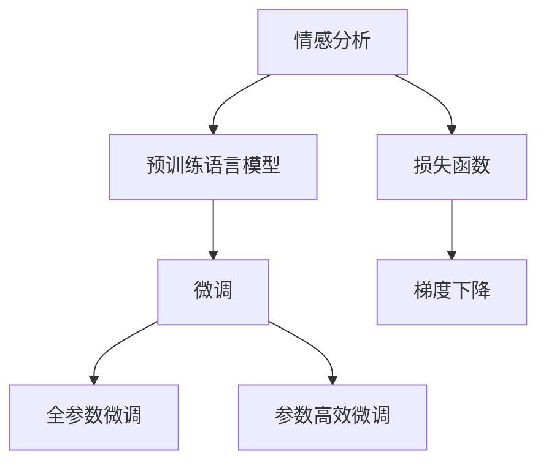

                 

## 1. 背景介绍

### 1.1 问题由来
情感分析（Sentiment Analysis）是自然语言处理（NLP）和文本挖掘中一项重要技术。它旨在识别和提取文本中的主观信息，并对文本的情感极性（如积极、消极、中性）进行分类。情感分析技术已经在社交媒体监控、品牌舆情分析、消费者行为分析、市场情感预测等多个领域得到广泛应用。

近年来，随着深度学习和大规模预训练模型的发展，情感分析的准确性和泛化能力得到了显著提升。比如，通过使用BERT等预训练模型进行情感分析，可以显著提高模型在特定任务上的性能。

### 1.2 问题核心关键点
情感分析的核心在于如何从大量文本数据中提取和识别情感信息。目前主流的情感分析方法主要包括两类：基于词典的方法和基于机器学习的方法。

基于词典的方法依赖于情感词典（如SentiWordNet、AFINN等），通过统计文本中情感词汇的分布来进行情感极性分类。虽然简单，但受限于词典的覆盖度和准确性，容易受到情感词汇歧义的影响。

基于机器学习的方法通过训练分类模型来学习文本与情感标签之间的映射关系，常见的方法包括朴素贝叶斯、支持向量机、逻辑回归等。深度学习方法如卷积神经网络（CNN）、循环神经网络（RNN）、Transformer等也有广泛应用。这些方法能够更全面地考虑上下文信息，具备更强的泛化能力。

当前，基于深度学习的情感分析方法已经超越传统方法，成为主流。其中，使用预训练语言模型进行微调是一种典型范式，通过在标注数据上微调预训练模型，使其具备情感分析能力。

## 2. 核心概念与联系

### 2.1 核心概念概述

为更好地理解情感分析技术，本节将介绍几个关键概念：

- 情感分析（Sentiment Analysis）：识别文本中的主观情感，通常分为正面、负面和中性三类。
- 预训练语言模型（Pre-trained Language Model）：通过大规模无标签文本进行自监督预训练，学习语言表示的通用模型，如BERT、GPT等。
- 微调（Fine-tuning）：在预训练模型基础上，使用标注数据对其进行有监督微调，适应特定情感分析任务。
- 损失函数（Loss Function）：用于衡量模型预测输出与真实标签之间的差异，如交叉熵损失、对数似然损失等。
- 梯度下降（Gradient Descent）：基于损失函数优化模型参数的算法，包括随机梯度下降（SGD）、Adam等。

这些概念通过以下Mermaid流程图展示它们之间的联系：



这个流程图展示了情感分析的核心概念及其之间的关系：

1. 情感分析依赖于预训练语言模型。
2. 微调是对预训练模型进行特定任务适配。
3. 微调可以全参数微调或参数高效微调。
4. 损失函数衡量模型预测与真实标签的差异。
5. 梯度下降优化模型参数，使损失函数最小化。

## 3. 核心算法原理 & 具体操作步骤
### 3.1 算法原理概述

基于预训练语言模型的情感分析微调，其核心思想是：将预训练语言模型作为情感分析的特征提取器，通过在标注数据上进行有监督微调，学习情感极性的表示。

形式化地，假设预训练模型为 $M_{\theta}$，其中 $\theta$ 为预训练得到的模型参数。给定情感分析任务 $T$ 的标注数据集 $D=\{(x_i, y_i)\}_{i=1}^N$，其中 $x_i$ 为文本样本，$y_i \in \{0,1\}$ 为情感极性标签，$0$ 代表负面，$1$ 代表正面。

微调的目标是最小化模型在标注数据集 $D$ 上的损失函数：

$$
\theta^* = \mathop{\arg\min}_{\theta} \mathcal{L}(M_{\theta},D)
$$

其中 $\mathcal{L}$ 为针对情感分析任务设计的损失函数。

### 3.2 算法步骤详解

基于预训练语言模型的情感分析微调，一般包括以下几个关键步骤：

**Step 1: 准备预训练模型和数据集**
- 选择合适的预训练语言模型 $M_{\theta}$，如BERT、GPT等。
- 准备情感分析任务的标注数据集 $D$，划分为训练集、验证集和测试集。数据集应包含足够的正面和负面样本，以及少量的中性样本。

**Step 2: 添加情感分析适配层**
- 根据情感分析任务的输出类型，设计情感分析适配层。对于二分类任务，通常添加一个全连接层和sigmoid激活函数，输出概率值 $p$。
- 损失函数可选用二元交叉熵损失函数，如 $\mathcal{L} = -(y \log p + (1-y) \log (1-p))$。

**Step 3: 设置微调超参数**
- 选择合适的优化算法及其参数，如AdamW、SGD等，设置学习率、批大小、迭代轮数等。
- 设置正则化技术及强度，包括权重衰减、Dropout、Early Stopping等。
- 确定冻结预训练参数的策略，如仅微调顶层，或全部参数都参与微调。

**Step 4: 执行梯度训练**
- 将训练集数据分批次输入模型，前向传播计算损失函数。
- 反向传播计算参数梯度，根据设定的优化算法和学习率更新模型参数。
- 周期性在验证集上评估模型性能，根据性能指标决定是否触发Early Stopping。
- 重复上述步骤直到满足预设的迭代轮数或Early Stopping条件。

**Step 5: 测试和部署**
- 在测试集上评估微调后模型 $M_{\hat{\theta}}$ 的性能，对比微调前后的精度提升。
- 使用微调后的模型对新样本进行情感分析，集成到实际的应用系统中。
- 持续收集新的数据，定期重新微调模型，以适应数据分布的变化。

以上是基于预训练语言模型的情感分析微调的一般流程。在实际应用中，还需要根据具体任务进行优化设计，如改进损失函数、引入更多的正则化技术、搜索最优的超参数组合等，以进一步提升模型性能。

### 3.3 算法优缺点

基于预训练语言模型的情感分析微调方法具有以下优点：
1. 简单高效。只需准备少量标注数据，即可对预训练模型进行快速适配，获得较大的性能提升。
2. 通用适用。适用于各种NLP下游任务，包括分类、匹配、生成等，设计简单的任务适配层即可实现微调。
3. 参数高效。利用参数高效微调技术，在固定大部分预训练参数的情况下，仍可取得不错的提升。
4. 效果显著。在学术界和工业界的诸多任务上，基于微调的方法已经刷新了最先进的性能指标。

同时，该方法也存在一定的局限性：
1. 依赖标注数据。微调的效果很大程度上取决于标注数据的质量和数量，获取高质量标注数据的成本较高。
2. 迁移能力有限。当目标任务与预训练数据的分布差异较大时，微调的性能提升有限。
3. 负面效果传递。预训练模型的固有偏见、有害信息等，可能通过微调传递到下游任务，造成负面影响。
4. 可解释性不足。微调模型的决策过程通常缺乏可解释性，难以对其推理逻辑进行分析和调试。

尽管存在这些局限性，但就目前而言，基于预训练语言模型的情感分析微调方法仍是目前情感分析任务的主流范式。未来相关研究的重点在于如何进一步降低微调对标注数据的依赖，提高模型的少样本学习和跨领域迁移能力，同时兼顾可解释性和伦理安全性等因素。

### 3.4 算法应用领域

基于预训练语言模型的情感分析微调方法在多个领域得到了广泛应用：

- 社交媒体情感分析：分析用户评论、帖子中的情感倾向，识别舆情热点。
- 产品评价分析：自动分析用户对产品的评价情感，进行产品推荐。
- 品牌声誉监控：监测品牌在社交媒体上的情感变化趋势，及时调整策略。
- 舆情监测与预警：对新闻、文章进行情感分析，识别敏感信息，进行舆情预警。
- 消费者行为分析：分析用户对广告、活动的情感反应，优化市场策略。

这些应用场景展示了情感分析技术在数据驱动决策中的重要作用，推动了相关行业向智能化、精细化发展。

## 4. 数学模型和公式 & 详细讲解 & 举例说明
### 4.1 数学模型构建

在情感分析任务中，预训练语言模型 $M_{\theta}$ 的输出为文本 $x$ 的情感极性概率 $p$。假设标签 $y \in \{0,1\}$，对应的损失函数为二元交叉熵损失，即：

$$
\mathcal{L}(M_{\theta}, (x, y)) = -[y \log p + (1-y) \log (1-p)]
$$

在微调过程中，目标是最小化经验风险 $\mathcal{L}(\theta)$，即：

$$
\theta^* = \mathop{\arg\min}_{\theta} \mathcal{L}(\theta) = \mathop{\arg\min}_{\theta} \frac{1}{N} \sum_{i=1}^N \mathcal{L}(M_{\theta}, (x_i, y_i))
$$

### 4.2 公式推导过程

以下是情感分析任务中二元交叉熵损失函数及其梯度的计算过程。

假设模型 $M_{\theta}$ 在输入 $x$ 上的输出为 $\hat{y}=M_{\theta}(x) \in [0,1]$，表示样本属于正类的概率。真实标签 $y \in \{0,1\}$。则二元交叉熵损失函数定义为：

$$
\mathcal{L}(M_{\theta}(x),y) = -[y\log \hat{y} + (1-y)\log (1-\hat{y})]
$$

将其代入经验风险公式，得：

$$
\mathcal{L}(\theta) = -\frac{1}{N}\sum_{i=1}^N [y_i\log M_{\theta}(x_i)+(1-y_i)\log(1-M_{\theta}(x_i))]
$$

根据链式法则，损失函数对参数 $\theta_k$ 的梯度为：

$$
\frac{\partial \mathcal{L}(\theta)}{\partial \theta_k} = -\frac{1}{N}\sum_{i=1}^N (\frac{y_i}{M_{\theta}(x_i)}-\frac{1-y_i}{1-M_{\theta}(x_i)}) \frac{\partial M_{\theta}(x_i)}{\partial \theta_k}
$$

其中 $\frac{\partial M_{\theta}(x_i)}{\partial \theta_k}$ 可进一步递归展开，利用自动微分技术完成计算。

在得到损失函数的梯度后，即可带入参数更新公式，完成模型的迭代优化。重复上述过程直至收敛，最终得到适应下游任务的最优模型参数 $\theta^*$。

### 4.3 案例分析与讲解

假设我们已经选择了BERT模型作为情感分析任务的基础模型，并在IMDb数据集上进行二元分类任务微调。以下是微调过程的具体实现步骤：

1. 准备数据集：IMDb数据集包含了50,000条影评数据，标注为正面或负面情感。
2. 分割数据集：将数据集分为训练集、验证集和测试集。
3. 初始化模型：使用PretrainedModel.from_pretrained()方法加载预训练的BERT模型，并进行相应配置。
4. 定义损失函数：使用二元交叉熵损失函数。
5. 优化器配置：使用AdamW优化器，设置学习率为1e-5。
6. 训练模型：在训练集上执行梯度下降，迭代轮数为5，批量大小为32。
7. 验证模型：在验证集上评估模型性能，计算准确率和F1分数。
8. 测试模型：在测试集上进一步评估模型性能。

下面是使用PyTorch实现上述过程的代码示例：

```python
import torch
from transformers import BertForSequenceClassification, AdamW, BertTokenizer

# 加载预训练模型
model = BertForSequenceClassification.from_pretrained('bert-base-uncased', num_labels=2)

# 加载词汇表
tokenizer = BertTokenizer.from_pretrained('bert-base-uncased')

# 准备训练集数据
train_dataset = MyDataset(train_data, tokenizer)

# 定义优化器
optimizer = AdamW(model.parameters(), lr=1e-5)

# 训练模型
for epoch in range(5):
    model.train()
    for batch in train_loader:
        inputs = tokenizer(batch[0], return_tensors='pt')
        labels = batch[1]
        optimizer.zero_grad()
        outputs = model(**inputs, labels=labels)
        loss = outputs.loss
        loss.backward()
        optimizer.step()

    model.eval()
    with torch.no_grad():
        for batch in validation_loader:
            inputs = tokenizer(batch[0], return_tensors='pt')
            labels = batch[1]
            outputs = model(**inputs)
            predictions = torch.argmax(outputs.logits, dim=1)
            accuracy = (predictions == labels).float().mean()
            f1_score = f1_score(predictions.tolist(), labels.tolist(), average='macro')
    print(f"Epoch {epoch+1}, accuracy={accuracy:.3f}, F1 score={f1_score:.3f}")
```

在上述代码中，我们首先加载了预训练的BERT模型，并使用词汇表进行数据预处理。接着，定义了AdamW优化器，并在训练集上执行梯度下降。在每个epoch的训练结束后，我们在验证集上评估模型性能，最后得到微调后的模型。

通过上述过程，我们可以看到，基于预训练语言模型的情感分析微调方法简单高效，只需少量标注数据即可取得较好的性能提升。这种范式已经被广泛应用于NLP任务的各个领域，推动了自然语言处理技术的不断进步。

## 5. 项目实践：代码实例和详细解释说明
### 5.1 开发环境搭建

在进行情感分析任务微调前，我们需要准备好开发环境。以下是使用Python进行PyTorch开发的环境配置流程：

1. 安装Anaconda：从官网下载并安装Anaconda，用于创建独立的Python环境。

2. 创建并激活虚拟环境：
```bash
conda create -n pytorch-env python=3.8 
conda activate pytorch-env
```

3. 安装PyTorch：根据CUDA版本，从官网获取对应的安装命令。例如：
```bash
conda install pytorch torchvision torchaudio cudatoolkit=11.1 -c pytorch -c conda-forge
```

4. 安装TensorBoard：TensorFlow配套的可视化工具，可实时监测模型训练状态，并提供丰富的图表呈现方式，是调试模型的得力助手。

5. 安装Weights & Biases：模型训练的实验跟踪工具，可以记录和可视化模型训练过程中的各项指标，方便对比和调优。

完成上述步骤后，即可在`pytorch-env`环境中开始情感分析任务微调实践。

### 5.2 源代码详细实现

下面以情感分析任务为例，给出使用Transformers库对BERT模型进行微调的PyTorch代码实现。

首先，定义情感分析任务的数据处理函数：

```python
from transformers import BertTokenizer
from torch.utils.data import Dataset
import torch

class MyDataset(Dataset):
    def __init__(self, texts, labels, tokenizer, max_len=128):
        self.texts = texts
        self.labels = labels
        self.tokenizer = tokenizer
        self.max_len = max_len
        
    def __len__(self):
        return len(self.texts)
    
    def __getitem__(self, item):
        text = self.texts[item]
        label = self.labels[item]
        
        encoding = self.tokenizer(text, return_tensors='pt', max_length=self.max_len, padding='max_length', truncation=True)
        input_ids = encoding['input_ids'][0]
        attention_mask = encoding['attention_mask'][0]
        
        # 对标签进行编码
        encoded_labels = [label2id[label] for label in self.labels] 
        encoded_labels.extend([label2id['O']] * (self.max_len - len(encoded_labels)))
        labels = torch.tensor(encoded_labels, dtype=torch.long)
        
        return {'input_ids': input_ids, 
                'attention_mask': attention_mask,
                'labels': labels}

# 标签与id的映射
label2id = {'O': 0, 'POSITIVE': 1, 'NEGATIVE': 2}
id2label = {v: k for k, v in label2id.items()}

# 创建dataset
tokenizer = BertTokenizer.from_pretrained('bert-base-uncased')

train_dataset = MyDataset(train_texts, train_labels, tokenizer)
dev_dataset = MyDataset(dev_texts, dev_labels, tokenizer)
test_dataset = MyDataset(test_texts, test_labels, tokenizer)
```

然后，定义模型和优化器：

```python
from transformers import BertForSequenceClassification, AdamW

model = BertForSequenceClassification.from_pretrained('bert-base-uncased', num_labels=len(label2id))

optimizer = AdamW(model.parameters(), lr=2e-5)
```

接着，定义训练和评估函数：

```python
from torch.utils.data import DataLoader
from tqdm import tqdm
from sklearn.metrics import accuracy_score, f1_score

device = torch.device('cuda') if torch.cuda.is_available() else torch.device('cpu')
model.to(device)

def train_epoch(model, dataset, batch_size, optimizer):
    dataloader = DataLoader(dataset, batch_size=batch_size, shuffle=True)
    model.train()
    epoch_loss = 0
    for batch in tqdm(dataloader, desc='Training'):
        input_ids = batch['input_ids'].to(device)
        attention_mask = batch['attention_mask'].to(device)
        labels = batch['labels'].to(device)
        model.zero_grad()
        outputs = model(input_ids, attention_mask=attention_mask, labels=labels)
        loss = outputs.loss
        epoch_loss += loss.item()
        loss.backward()
        optimizer.step()
    return epoch_loss / len(dataloader)

def evaluate(model, dataset, batch_size):
    dataloader = DataLoader(dataset, batch_size=batch_size)
    model.eval()
    preds, labels = [], []
    with torch.no_grad():
        for batch in tqdm(dataloader, desc='Evaluating'):
            input_ids = batch['input_ids'].to(device)
            attention_mask = batch['attention_mask'].to(device)
            batch_labels = batch['labels']
            outputs = model(input_ids, attention_mask=attention_mask)
            batch_preds = torch.argmax(outputs.logits, dim=2).to('cpu').tolist()
            batch_labels = batch_labels.to('cpu').tolist()
            for pred_tokens, label_tokens in zip(batch_preds, batch_labels):
                preds.append(pred_tokens[:len(label_tokens)])
                labels.append(label_tokens)
                
    print(f"Accuracy: {accuracy_score(labels, preds)}")
    print(f"F1 Score: {f1_score(labels, preds, average='macro')}")

# 启动训练流程并在测试集上评估
epochs = 5
batch_size = 16

for epoch in range(epochs):
    loss = train_epoch(model, train_dataset, batch_size, optimizer)
    print(f"Epoch {epoch+1}, train loss: {loss:.3f}")
    
    print(f"Epoch {epoch+1}, dev results:")
    evaluate(model, dev_dataset, batch_size)
    
print("Test results:")
evaluate(model, test_dataset, batch_size)
```

以上就是使用PyTorch对BERT进行情感分析任务微调的完整代码实现。可以看到，得益于Transformers库的强大封装，我们可以用相对简洁的代码完成BERT模型的加载和微调。

### 5.3 代码解读与分析

让我们再详细解读一下关键代码的实现细节：

**MyDataset类**：
- `__init__`方法：初始化文本、标签、分词器等关键组件。
- `__len__`方法：返回数据集的样本数量。
- `__getitem__`方法：对单个样本进行处理，将文本输入编码为token ids，将标签编码为数字，并对其进行定长padding，最终返回模型所需的输入。

**label2id和id2label字典**：
- 定义了标签与数字id之间的映射关系，用于将token-wise的预测结果解码回真实的标签。

**训练和评估函数**：
- 使用PyTorch的DataLoader对数据集进行批次化加载，供模型训练和推理使用。
- 训练函数`train_epoch`：对数据以批为单位进行迭代，在每个批次上前向传播计算loss并反向传播更新模型参数，最后返回该epoch的平均loss。
- 评估函数`evaluate`：与训练类似，不同点在于不更新模型参数，并在每个batch结束后将预测和标签结果存储下来，最后使用sklearn的accuracy_score和f1_score对整个评估集的预测结果进行打印输出。

**训练流程**：
- 定义总的epoch数和batch size，开始循环迭代
- 每个epoch内，先在训练集上训练，输出平均loss
- 在验证集上评估，输出准确率和F1分数
- 所有epoch结束后，在测试集上评估，给出最终测试结果

可以看到，PyTorch配合Transformers库使得BERT微调的代码实现变得简洁高效。开发者可以将更多精力放在数据处理、模型改进等高层逻辑上，而不必过多关注底层的实现细节。

当然，工业级的系统实现还需考虑更多因素，如模型的保存和部署、超参数的自动搜索、更灵活的任务适配层等。但核心的微调范式基本与此类似。

## 6. 实际应用场景
### 6.1 社交媒体情感分析

社交媒体情感分析是情感分析技术的一个重要应用场景。通过分析用户在社交媒体上的评论、帖子，可以了解用户对某事件、产品、品牌的情感倾向，及时调整策略，提升用户满意度和品牌声誉。

在技术实现上，可以收集社交媒体平台上的用户评论、帖子等文本数据，使用预训练语言模型对其进行微调。微调后的模型能够自动识别文本中的情感倾向，并在短时间内对大量文本进行情感分析。此外，通过分析用户情感变化趋势，可以识别舆情热点，进行预警和干预。

### 6.2 产品评价分析

产品评价分析是企业品牌管理中的重要环节。通过分析用户对产品的评价情感，可以了解用户对产品的满意度、不满意原因等，及时优化产品设计和服务质量。

在技术实现上，可以收集用户对产品的评论、评分数据，使用预训练语言模型对其进行微调。微调后的模型能够自动识别用户评论中的情感倾向，并给出情感分类结果。根据情感分类结果，可以进一步进行情感极性分析，了解用户对产品的详细反馈。

### 6.3 品牌声誉监控

品牌声誉监控是企业舆情分析的重要组成部分。通过分析品牌在社交媒体、新闻、论坛等渠道上的情感变化，可以及时发现负面信息，采取应对措施。

在技术实现上，可以收集品牌在社交媒体、新闻、论坛等渠道上的评论、报道、评分等数据，使用预训练语言模型对其进行微调。微调后的模型能够自动识别文本中的品牌提及和情感倾向，并在短时间内对大量文本进行情感分析。根据情感分析结果，可以进一步进行舆情预警和品牌管理。

### 6.4 消费者行为分析

消费者行为分析是企业市场研究的重要环节。通过分析用户在社交媒体、电商平台等渠道上的评论、评分数据，可以了解用户的消费偏好、行为模式等，优化市场策略。

在技术实现上，可以收集用户在社交媒体、电商平台等渠道上的评论、评分数据，使用预训练语言模型对其进行微调。微调后的模型能够自动识别文本中的情感倾向，并给出情感分类结果。根据情感分类结果，可以进一步进行用户行为分析，了解用户的消费偏好和行为模式。

### 6.5 舆情监测与预警

舆情监测与预警是政府舆情管理的重要环节。通过分析新闻、论坛、社交媒体等渠道上的文本数据，可以及时发现负面信息，进行舆情预警和干预。

在技术实现上，可以收集新闻、论坛、社交媒体等渠道上的文本数据，使用预训练语言模型对其进行微调。微调后的模型能够自动识别文本中的情感倾向，并给出情感分类结果。根据情感分类结果，可以进一步进行舆情预警和舆情干预。

### 6.6 市场情感预测

市场情感预测是金融投资、市场研究的重要环节。通过分析市场新闻、评论、公告等文本数据，可以预测市场情绪变化，制定投资策略。

在技术实现上，可以收集市场新闻、评论、公告等文本数据，使用预训练语言模型对其进行微调。微调后的模型能够自动识别文本中的情感倾向，并给出情感分类结果。根据情感分类结果，可以进一步进行市场情感预测，制定投资策略。

## 7. 工具和资源推荐
### 7.1 学习资源推荐

为了帮助开发者系统掌握情感分析技术，这里推荐一些优质的学习资源：

1. 《深度学习理论与实践》系列博文：由大模型技术专家撰写，深入浅出地介绍了深度学习理论和实践，包括情感分析等前沿话题。

2. 斯坦福大学NLP课程：斯坦福大学开设的NLP明星课程，有Lecture视频和配套作业，带你入门NLP领域的基本概念和经典模型。

3. 《Python自然语言处理》书籍：全面介绍了自然语言处理中的情感分析技术，包括模型选择、数据预处理、评估指标等。

4. NLTK和spaCy库：Python中的自然语言处理库，提供了情感分析的预训练模型和工具。

5. Weights & Biases：模型训练的实验跟踪工具，可以记录和可视化模型训练过程中的各项指标，方便对比和调优。

通过学习这些资源，相信你一定能够快速掌握情感分析技术的精髓，并用于解决实际的NLP问题。
### 7.2 开发工具推荐

高效的开发离不开优秀的工具支持。以下是几款用于情感分析任务开发的常用工具：

1. PyTorch：基于Python的开源深度学习框架，灵活动态的计算图，适合快速迭代研究。

2. TensorFlow：由Google主导开发的开源深度学习框架，生产部署方便，适合大规模工程应用。

3. Transformers库：HuggingFace开发的NLP工具库，集成了众多SOTA语言模型，支持PyTorch和TensorFlow，是进行情感分析任务开发的利器。

4. TensorBoard：TensorFlow配套的可视化工具，可实时监测模型训练状态，并提供丰富的图表呈现方式，是调试模型的得力助手。

5. Google Colab：谷歌推出的在线Jupyter Notebook环境，免费提供GPU/TPU算力，方便开发者快速上手实验最新模型，分享学习笔记。

合理利用这些工具，可以显著提升情感分析任务开发效率，加快创新迭代的步伐。

### 7.3 相关论文推荐

情感分析技术的发展源于学界的持续研究。以下是几篇奠基性的相关论文，推荐阅读：

1. Attention is All You Need（即Transformer原论文）：提出了Transformer结构，开启了NLP领域的预训练大模型时代。

2. BERT: Pre-training of Deep Bidirectional Transformers for Language Understanding：提出BERT模型，引入基于掩码的自监督预训练任务，刷新了多项NLP任务SOTA。

3. Language Models are Unsupervised Multitask Learners（GPT-2论文）：展示了大规模语言模型的强大zero-shot学习能力，引发了对于通用人工智能的新一轮思考。

4. Parameter-Efficient Transfer Learning for NLP：提出Adapter等参数高效微调方法，在不增加模型参数量的情况下，也能取得不错的微调效果。

5. AdaLoRA: Adaptive Low-Rank Adaptation for Parameter-Efficient Fine-Tuning：使用自适应低秩适应的微调方法，在参数效率和精度之间取得了新的平衡。

这些论文代表了大语言模型微调技术的发展脉络。通过学习这些前沿成果，可以帮助研究者把握学科前进方向，激发更多的创新灵感。

## 8. 总结：未来发展趋势与挑战
### 8.1 总结

本文对基于预训练语言模型的情感分析微调方法进行了全面系统的介绍。首先阐述了情感分析技术的研究背景和意义，明确了微调在拓展预训练模型应用、提升情感分析性能方面的独特价值。其次，从原理到实践，详细讲解了情感分析任务的数学原理和关键步骤，给出了情感分析任务开发的完整代码实例。同时，本文还广泛探讨了情感分析技术在社交媒体、产品评价、品牌声誉等多个领域的应用前景，展示了情感分析技术在数据驱动决策中的重要作用。

通过本文的系统梳理，可以看到，基于预训练语言模型的情感分析微调方法简单高效，只需少量标注数据即可取得较大的性能提升。这种范式已经被广泛应用于NLP任务的各个领域，推动了自然语言处理技术的不断进步。

### 8.2 未来发展趋势

展望未来，情感分析技术将呈现以下几个发展趋势：

1. 模型规模持续增大。随着算力成本的下降和数据规模的扩张，预训练语言模型的参数量还将持续增长。超大批次的训练和推理也可能遇到显存不足的问题。如何突破硬件瓶颈，将是未来的重要研究方向。

2. 微调方法日趋多样。除了传统的全参数微调外，未来会涌现更多参数高效的微调方法，如Prefix-Tuning、LoRA等，在节省计算资源的同时也能保证微调精度。

3. 持续学习成为常态。随着数据分布的不断变化，微调模型也需要持续学习新知识以保持性能。如何在不遗忘原有知识的同时，高效吸收新样本信息，将成为重要的研究课题。

4. 标注样本需求降低。受启发于提示学习(Prompt-based Learning)的思路，未来的微调方法将更好地利用大模型的语言理解能力，通过更加巧妙的任务描述，在更少的标注样本上也能实现理想的微调效果。

5. 情感分析与多模态数据的结合。情感分析任务不仅仅依赖于文本数据，还可以结合图像、视频、语音等多模态信息进行综合建模。情感分析技术与其他多模态任务的结合，将进一步拓展其应用范围。

6. 模型通用性增强。经过海量数据的预训练和多领域任务的微调，未来的情感分析模型将具备更强大的常识推理和跨领域迁移能力，逐步迈向通用人工智能(AGI)的目标。

以上趋势凸显了情感分析技术的广阔前景。这些方向的探索发展，必将进一步提升情感分析系统的性能和应用范围，为自然语言处理技术带来新的突破。

### 8.3 面临的挑战

尽管情感分析技术已经取得了瞩目成就，但在迈向更加智能化、普适化应用的过程中，它仍面临着诸多挑战：

1. 标注成本瓶颈。尽管微调大大降低了标注数据的需求，但对于长尾应用场景，难以获得充足的高质量标注数据，成为制约微调性能的瓶颈。如何进一步降低微调对标注样本的依赖，将是一大难题。

2. 模型鲁棒性不足。当前情感分析模型面对域外数据时，泛化性能往往大打折扣。对于测试样本的微小扰动，模型预测也容易发生波动。如何提高情感分析模型的鲁棒性，避免灾难性遗忘，还需要更多理论和实践的积累。

3. 推理效率有待提高。大规模语言模型虽然精度高，但在实际部署时往往面临推理速度慢、内存占用大等效率问题。如何在保证性能的同时，简化模型结构，提升推理速度，优化资源占用，将是重要的优化方向。

4. 可解释性亟需加强。当前情感分析模型通常缺乏可解释性，难以解释其内部工作机制和决策逻辑。对于医疗、金融等高风险应用，算法的可解释性和可审计性尤为重要。如何赋予情感分析模型更强的可解释性，将是亟待攻克的难题。

5. 安全性有待保障。预训练语言模型难免会学习到有偏见、有害的信息，通过微调传递到下游任务，产生误导性、歧视性的输出，给实际应用带来安全隐患。如何从数据和算法层面消除模型偏见，避免恶意用途，确保输出的安全性，也将是重要的研究课题。

6. 知识整合能力不足。现有的情感分析模型往往局限于任务内数据，难以灵活吸收和运用更广泛的先验知识。如何让情感分析过程更好地与外部知识库、规则库等专家知识结合，形成更加全面、准确的信息整合能力，还有很大的想象空间。

正视情感分析面临的这些挑战，积极应对并寻求突破，将是大语言模型微调走向成熟的必由之路。相信随着学界和产业界的共同努力，这些挑战终将一一被克服，情感分析技术必将在构建安全、可靠、可解释、可控的智能系统铺平道路。

### 8.4 研究展望

面对情感分析技术面临的种种挑战，未来的研究需要在以下几个方面寻求新的突破：

1. 探索无监督和半监督微调方法。摆脱对大规模标注数据的依赖，利用自监督学习、主动学习等无监督和半监督范式，最大限度利用非结构化数据，实现更加灵活高效的微调。

2. 研究参数高效和计算高效的微调范式。开发更加参数高效的微调方法，在固定大部分预训练参数的同时，只更新极少量的任务相关参数。同时优化微调模型的计算图，减少前向传播和反向传播的资源消耗，实现更加轻量级、实时性的部署。

3. 引入更多先验知识。将符号化的先验知识，如知识图谱、逻辑规则等，与神经网络模型进行巧妙融合，引导情感分析过程学习更准确、合理的语言模型。同时加强不同模态数据的整合，实现视觉、语音等多模态信息与文本信息的协同建模。

4. 结合因果分析和博弈论工具。将因果分析方法引入情感分析模型，识别出模型决策的关键特征，增强输出解释的因果性和逻辑性。借助博弈论工具刻画人机交互过程，主动探索并规避模型的脆弱点，提高系统稳定性。

5. 纳入伦理道德约束。在模型训练目标中引入伦理导向的评估指标，过滤和惩罚有偏见、有害的输出倾向。同时加强人工干预和审核，建立模型行为的监管机制，确保输出符合人类价值观和伦理道德。

这些研究方向的探索，必将引领情感分析技术迈向更高的台阶，为构建安全、可靠、可解释、可控的智能系统铺平道路。面向未来，情感分析技术还需要与其他人工智能技术进行更深入的融合，如知识表示、因果推理、强化学习等，多路径协同发力，共同推动自然语言处理系统的进步。只有勇于创新、敢于突破，才能不断拓展情感分析技术的边界，让智能技术更好地造福人类社会。

## 9. 附录：常见问题与解答

**Q1：情感分析中的标注样本如何准备？**

A: 情感分析任务的标注样本通常需要人工标注。标注流程包括如下步骤：
1. 选择合适的标注工具，如Labelbox、Prodigy等。
2. 标注工具界面设计，包括标注任务的界面和标注指导文档。
3. 收集标注人员，进行培训，并制定标注规范。
4. 标注数据审核，确保标注数据的一致性和准确性。

标注样本的准备需要耗费大量人力和资源，但高质量的标注数据是情感分析任务的基础，对模型的性能提升至关重要。

**Q2：情感分析模型的评估指标有哪些？**

A: 情感分析模型的评估指标包括准确率、精确率、召回率和F1分数。其中，F1分数是最常用的指标，因为它综合考虑了准确率和召回率。此外，还可以使用ROC曲线、AUC等评估指标。

在实际应用中，还可以根据任务需求选择不同的评估指标。例如，对于二分类任务，准确率和F1分数是最常用的指标；对于多分类任务，精确率和召回率可能更合适。

**Q3：情感分析模型在实际应用中需要注意哪些问题？**

A: 情感分析模型在实际应用中需要注意以下问题：
1. 标注数据的选择。标注数据需要反映真实用户的情感，避免标注数据的偏差。
2. 模型泛化能力。模型需要在多种数据分布下都能表现良好，避免过拟合和泛化能力不足。
3. 模型鲁棒性。模型需要具备一定的鲁棒性，能够抵抗输入噪声和干扰。
4. 模型可解释性。模型需要具备一定的可解释性，便于用户理解和信任。
5. 数据隐私保护。模型需要保护用户隐私，避免泄露敏感信息。

合理使用情感分析模型，需要综合考虑这些问题，才能确保模型在实际应用中的稳定性和可靠性。

**Q4：情感分析任务中的情感词典有哪些？**

A: 情感分析任务中常用的情感词典包括SentiWordNet、AFINN、VADER等。这些词典包含了大量情感词汇及其极性标注，可以作为情感分析任务的参考依据。

其中，SentiWordNet是最常用的情感词典，包含近10000个英文单词的情感极性标注。AFINN情感词典包含约7500个英文单词的情感极性标注。VADER情感词典是一个情感词典和规则组合而成的工具，适用于分析中文情感。

在选择情感词典时，需要根据任务需求和数据特点进行选择。通常，情感词典的覆盖面和准确性越高，情感分析模型的性能越好。

**Q5：情感分析任务中的特征工程有哪些？**

A: 情感分析任务中的特征工程包括文本特征提取、文本预处理和特征编码。常用的特征工程方法包括：
1. 文本特征提取：通过统计文本中的情感词汇、情感短语、情感句法结构等特征。
2. 文本预处理：包括分词、去除停用词、词性标注、实体识别等。
3. 特征编码：将文本特征编码成模型所需的输入格式，如词向量、句子向量等。

特征工程是情感分析任务中的重要环节，需要根据任务需求和数据特点进行选择和设计。合理的设计和提取特征，可以提高模型的性能和泛化能力。

---

作者：禅与计算机程序设计艺术 / Zen and the Art of Computer Programming

