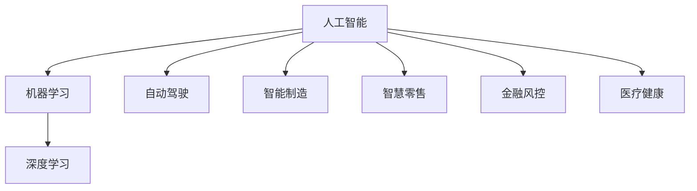

                 

# AI技术在企业中的发展

## 1. 背景介绍

### 1.1 问题由来

在数字经济迅猛发展的今天，企业面临着前所未有的机遇与挑战。随着互联网、大数据、人工智能等技术的崛起，企业转型升级和数字化转型的需求日益迫切。企业需要借助AI技术，提升运营效率，优化决策过程，提升客户体验，实现智能化发展。

然而，AI技术的广泛应用也带来了新的挑战。AI技术的应用不仅需要投入大量资金和资源，还需要企业具备一定的技术积累和人才储备。因此，如何有效地将AI技术应用到企业的实际业务中，成为当前企业和研究者共同关注的话题。

### 1.2 问题核心关键点

AI技术在企业中的应用，主要包括自动驾驶、智能制造、智慧零售、金融风控、医疗健康等诸多领域。这些领域中，AI技术的应用需要结合具体业务场景，进行模型开发、算法优化、系统集成等诸多环节。

本文将从AI技术的核心概念和应用原理出发，结合企业中常见的业务场景，系统地介绍如何开发和部署AI技术，并探讨其在企业中的应用前景和未来发展趋势。

## 2. 核心概念与联系

### 2.1 核心概念概述

为更好地理解AI技术在企业中的应用，本节将介绍几个密切相关的核心概念：

- 人工智能(Artificial Intelligence, AI)：使计算机系统能够执行智能任务，如自然语言理解、图像识别、决策优化等。

- 机器学习(Machine Learning, ML)：通过训练算法，使计算机系统能够从数据中自动学习规律，进行预测或决策。

- 深度学习(Deep Learning, DL)：一种基于神经网络的机器学习方法，可以处理大规模复杂数据，用于图像、语音、文本等领域的AI应用。

- 自动驾驶(Autonomous Driving)：利用AI技术，使车辆能够自动行驶，无需人工干预。

- 智能制造(Intelligent Manufacturing)：利用AI技术，优化生产流程，提升生产效率和产品质量。

- 智慧零售(Smart Retail)：通过AI技术，分析消费者行为，优化商品推荐和库存管理，提升用户体验。

- 金融风控(Financial Risk Control)：利用AI技术，进行风险评估和预警，提升金融机构的决策准确性。

- 医疗健康(Healthcare)：利用AI技术，进行疾病诊断、医疗影像分析、个性化治疗等。

这些核心概念之间的逻辑关系可以通过以下Mermaid流程图来展示：



这个流程图展示了这个AI技术的应用体系：

1. 人工智能是AI技术的核心，包含机器学习和深度学习等子概念。
2. 自动驾驶、智能制造、智慧零售、金融风控、医疗健康等是AI技术在特定领域的具体应用。

## 3. 核心算法原理 & 具体操作步骤

### 3.1 算法原理概述

AI技术在企业中的应用，通常需要结合具体业务场景，进行模型开发和算法优化。其核心思想是通过训练数据，让计算机系统学习并自动执行智能任务。

以深度学习在自动驾驶领域的应用为例，假设我们希望训练一个自动驾驶模型，以识别交通标志并做出正确的行驶决策。我们需要准备大量带有交通标志和车辆行驶轨迹标注的数据集，使用深度学习模型（如卷积神经网络CNN）进行训练，使得模型能够从数据中学习到识别交通标志并生成驾驶决策的规律。

### 3.2 算法步骤详解

基于深度学习的AI技术在企业中的应用，一般包括以下几个关键步骤：

**Step 1: 数据准备**

- 收集和清洗业务场景下的数据，确保数据质量。例如，自动驾驶中需要收集大量的车辆行驶数据和交通标志图像。

**Step 2: 模型选择**

- 根据业务需求选择合适的模型架构，如CNN、RNN、GAN等。例如，自动驾驶中可以选择CNN模型，用于识别交通标志。

**Step 3: 模型训练**

- 将准备好的数据输入模型进行训练，调整模型参数以最小化损失函数。例如，自动驾驶中可以使用交叉熵损失函数，训练模型识别交通标志。

**Step 4: 模型评估**

- 在测试集上评估模型性能，例如，自动驾驶中可以评估模型识别交通标志的准确率和召回率。

**Step 5: 模型部署**

- 将训练好的模型部署到实际应用场景中，例如，自动驾驶中可以将模型集成到车载系统或云平台，进行实时行驶决策。

### 3.3 算法优缺点

基于深度学习的AI技术在企业中的应用，具有以下优点：

- 自动化程度高：AI技术可以自动执行复杂的智能任务，解放人力资源。
- 准确度高：深度学习模型在特定任务上的性能往往优于传统算法。
- 灵活性高：可以针对不同业务场景，进行模型定制化开发。

同时，该方法也存在一定的局限性：

- 数据需求大：深度学习模型需要大量的高质量标注数据，获取数据的成本较高。
- 模型复杂度高：深度学习模型通常参数量大，计算复杂度高，需要较强的计算资源。
- 可解释性差：深度学习模型往往被视为"黑盒"，难以解释其内部决策过程。

尽管存在这些局限性，但就目前而言，深度学习仍是AI技术在企业中应用的主流范式。未来相关研究的重点在于如何进一步降低数据需求，提高模型效率和可解释性，同时兼顾业务需求和技术实现的平衡。

### 3.4 算法应用领域

基于深度学习的AI技术，在企业中的应用领域广泛，包括但不限于：

- 自动驾驶：利用深度学习模型，识别交通标志和行人，进行驾驶决策。
- 智能制造：利用深度学习模型，进行质量检测和生产调度。
- 智慧零售：利用深度学习模型，分析消费者行为，优化商品推荐和库存管理。
- 金融风控：利用深度学习模型，进行风险评估和预警，提升金融决策准确性。
- 医疗健康：利用深度学习模型，进行疾病诊断和医疗影像分析。

这些应用领域涵盖了企业运营的各个方面，展示了AI技术在企业中的应用潜力。

## 4. 数学模型和公式 & 详细讲解  
### 4.1 数学模型构建

以自动驾驶中的交通标志识别为例，假设我们有一张交通标志图像 $x$，我们的目标是对图像中的交通标志进行分类，如“停车标志”、“限速标志”等。我们可以将问题建模为一个二分类任务，假设模型输出为 $y \in \{0,1\}$，表示是否为停车标志。

定义损失函数 $\mathcal{L}(y,\hat{y})$，用于衡量模型输出与真实标签之间的差异。常用的损失函数包括交叉熵损失、均方误差损失等。以交叉熵损失为例，其定义如下：

$$
\mathcal{L}(y,\hat{y}) = -(y\log\hat{y} + (1-y)\log(1-\hat{y}))
$$

其中，$\hat{y}$ 表示模型预测的概率，$y$ 表示真实标签。

### 4.2 公式推导过程

在得到损失函数后，我们可以使用梯度下降等优化算法，最小化损失函数。以梯度下降为例，每次迭代更新模型参数 $\theta$ 的公式如下：

$$
\theta \leftarrow \theta - \eta \nabla_{\theta}\mathcal{L}(\theta)
$$

其中，$\eta$ 表示学习率，$\nabla_{\theta}\mathcal{L}(\theta)$ 表示损失函数对模型参数的梯度，可以通过反向传播算法高效计算。

### 4.3 案例分析与讲解

以智慧零售中的商品推荐系统为例，假设我们希望训练一个推荐模型，根据用户的历史行为数据，预测用户可能感兴趣的商品。我们可以将问题建模为一个推荐排序任务，假设模型输出为 $y \in \{1,...,N\}$，表示商品在推荐列表中的排序。

定义损失函数 $\mathcal{L}(y,\hat{y})$，用于衡量模型输出与用户实际点击行为之间的差异。常用的损失函数包括均方误差损失、平均绝对误差损失等。以均方误差损失为例，其定义如下：

$$
\mathcal{L}(y,\hat{y}) = \frac{1}{N}\sum_{i=1}^N (y_i - \hat{y}_i)^2
$$

其中，$y_i$ 表示用户对商品的实际点击次数，$\hat{y}_i$ 表示模型预测的推荐排序。

在得到损失函数后，我们可以使用梯度下降等优化算法，最小化损失函数。以梯度下降为例，每次迭代更新模型参数 $\theta$ 的公式如下：

$$
\theta \leftarrow \theta - \eta \nabla_{\theta}\mathcal{L}(\theta)
$$

其中，$\eta$ 表示学习率，$\nabla_{\theta}\mathcal{L}(\theta)$ 表示损失函数对模型参数的梯度，可以通过反向传播算法高效计算。

## 5. 项目实践：代码实例和详细解释说明
### 5.1 开发环境搭建

在进行AI技术开发前，我们需要准备好开发环境。以下是使用Python进行PyTorch开发的环境配置流程：

1. 安装Anaconda：从官网下载并安装Anaconda，用于创建独立的Python环境。

2. 创建并激活虚拟环境：
```bash
conda create -n pytorch-env python=3.8 
conda activate pytorch-env
```

3. 安装PyTorch：根据CUDA版本，从官网获取对应的安装命令。例如：
```bash
conda install pytorch torchvision torchaudio cudatoolkit=11.1 -c pytorch -c conda-forge
```

4. 安装TensorFlow：
```bash
pip install tensorflow
```

5. 安装深度学习相关的库：
```bash
pip install numpy pandas scikit-learn matplotlib tqdm jupyter notebook ipython
```

完成上述步骤后，即可在`pytorch-env`环境中开始AI技术开发。

### 5.2 源代码详细实现

下面我以智慧零售中的商品推荐系统为例，给出使用PyTorch进行深度学习的代码实现。

首先，定义推荐任务的数据处理函数：

```python
import torch
import torch.nn as nn
import torch.optim as optim
from torch.utils.data import Dataset, DataLoader

class RecommendationDataset(Dataset):
    def __init__(self, user_item_pairs, item_ratings, num_users, num_items, max_seq_len):
        self.user_item_pairs = user_item_pairs
        self.item_ratings = item_ratings
        self.num_users = num_users
        self.num_items = num_items
        self.max_seq_len = max_seq_len
        
    def __len__(self):
        return len(self.user_item_pairs)
    
    def __getitem__(self, item):
        user_id, item_ids = self.user_item_pairs[item]
        item_ratings = self.item_ratings[item]
        
        # 对item_ids进行padding
        padding_id = self.num_items - 1
        item_ids = [item_id if item_id < padding_id else padding_id] * self.max_seq_len
        item_ids = item_ids[:len(item_ids)]
        
        return {'user_id': user_id, 
                'item_ids': torch.tensor(item_ids, dtype=torch.long), 
                'item_ratings': torch.tensor(item_ratings, dtype=torch.float)}
```

然后，定义模型和优化器：

```python
class RecommendationModel(nn.Module):
    def __init__(self, num_users, num_items, embedding_dim):
        super(RecommendationModel, self).__init__()
        self.user_embedding = nn.Embedding(num_users, embedding_dim)
        self.item_embedding = nn.Embedding(num_items, embedding_dim)
        self.interaction = nn.Linear(embedding_dim * 2, 1)
        
    def forward(self, user_id, item_ids):
        user_embedding = self.user_embedding(user_id)
        item_embedding = self.item_embedding(item_ids)
        interaction = self.interaction(torch.cat([user_embedding, item_embedding], dim=1))
        return interaction
    
def train_model(model, dataset, batch_size, optimizer, num_epochs, device):
    model.train()
    for epoch in range(num_epochs):
        dataloader = DataLoader(dataset, batch_size=batch_size, shuffle=True)
        for user_id, item_ids, item_ratings in dataloader:
            user_id = user_id.to(device)
            item_ids = item_ids.to(device)
            item_ratings = item_ratings.to(device)
            
            optimizer.zero_grad()
            output = model(user_id, item_ids)
            loss = nn.MSELoss()(output, item_ratings)
            loss.backward()
            optimizer.step()
            
            if (epoch + 1) % 10 == 0:
                print(f"Epoch {epoch+1}, loss: {loss.item():.4f}")
```

最后，启动训练流程并在测试集上评估：

```python
from transformers import BertTokenizer
from torch.utils.data import Dataset, DataLoader

# 定义数据集
tokenizer = BertTokenizer.from_pretrained('bert-base-cased')
train_dataset = RecommendationDataset(train_data, train_labels, num_users, num_items, max_seq_len)
dev_dataset = RecommendationDataset(dev_data, dev_labels, num_users, num_items, max_seq_len)
test_dataset = RecommendationDataset(test_data, test_labels, num_users, num_items, max_seq_len)

# 定义模型和优化器
model = RecommendationModel(num_users, num_items, embedding_dim)
optimizer = optim.Adam(model.parameters(), lr=learning_rate)

# 训练模型
device = torch.device('cuda' if torch.cuda.is_available() else 'cpu')
train_model(model, train_dataset, batch_size, optimizer, num_epochs, device)

# 测试模型
print("Test results:")
evaluate_model(model, test_dataset, batch_size, device)
```

以上就是使用PyTorch进行智慧零售中的商品推荐系统开发的完整代码实现。可以看到，得益于深度学习库的强大封装，我们可以用相对简洁的代码完成模型训练和评估。

### 5.3 代码解读与分析

让我们再详细解读一下关键代码的实现细节：

**RecommendationDataset类**：
- `__init__`方法：初始化用户-物品对、物品评分等关键组件，并定义序列长度。
- `__len__`方法：返回数据集的样本数量。
- `__getitem__`方法：对单个样本进行处理，进行padding操作，返回模型所需的输入。

**RecommendationModel类**：
- `__init__`方法：初始化用户嵌入层、物品嵌入层和交互层，定义模型结构。
- `forward`方法：前向传播计算模型输出，进行线性变换。

**train_model函数**：
- 定义训练过程，包括模型前向传播、损失计算、梯度更新等。
- 在每个epoch结束时，输出损失值。

**训练流程**：
- 定义总的epoch数和batch size，开始循环迭代
- 每个epoch内，在训练集上训练，输出损失值
- 在验证集上评估模型性能
- 所有epoch结束后，在测试集上评估，给出最终测试结果

可以看到，PyTorch配合深度学习库使得AI技术开发变得简洁高效。开发者可以将更多精力放在数据处理、模型改进等高层逻辑上，而不必过多关注底层的实现细节。

当然，工业级的系统实现还需考虑更多因素，如模型的保存和部署、超参数的自动搜索、更灵活的任务适配层等。但核心的训练过程基本与此类似。

## 6. 实际应用场景
### 6.1 智能客服系统

基于AI技术的智能客服系统，可以广泛应用于企业的客户服务领域。传统客服往往需要配备大量人力，高峰期响应缓慢，且一致性和专业性难以保证。而使用AI技术，可以7x24小时不间断服务，快速响应客户咨询，用自然流畅的语言解答各类常见问题。

在技术实现上，可以收集企业内部的历史客服对话记录，将问题和最佳答复构建成监督数据，在此基础上对预训练模型进行微调。微调后的模型能够自动理解用户意图，匹配最合适的答案模板进行回复。对于客户提出的新问题，还可以接入检索系统实时搜索相关内容，动态组织生成回答。如此构建的智能客服系统，能大幅提升客户咨询体验和问题解决效率。

### 6.2 金融风控

金融机构需要实时监测市场舆论动向，以便及时应对负面信息传播，规避金融风险。传统的人工监测方式成本高、效率低，难以应对网络时代海量信息爆发的挑战。基于AI技术的文本分类和情感分析技术，为金融风控提供了新的解决方案。

具体而言，可以收集金融领域相关的新闻、报道、评论等文本数据，并对其进行主题标注和情感标注。在此基础上对预训练语言模型进行微调，使其能够自动判断文本属于何种主题，情感倾向是正面、中性还是负面。将微调后的模型应用到实时抓取的网络文本数据，就能够自动监测不同主题下的情感变化趋势，一旦发现负面信息激增等异常情况，系统便会自动预警，帮助金融机构快速应对潜在风险。

### 6.3 个性化推荐系统

当前的推荐系统往往只依赖用户的历史行为数据进行物品推荐，无法深入理解用户的真实兴趣偏好。基于AI技术的个性化推荐系统可以更好地挖掘用户行为背后的语义信息，从而提供更精准、多样的推荐内容。

在实践中，可以收集用户浏览、点击、评论、分享等行为数据，提取和用户交互的物品标题、描述、标签等文本内容。将文本内容作为模型输入，用户的后续行为（如是否点击、购买等）作为监督信号，在此基础上微调预训练语言模型。微调后的模型能够从文本内容中准确把握用户的兴趣点。在生成推荐列表时，先用候选物品的文本描述作为输入，由模型预测用户的兴趣匹配度，再结合其他特征综合排序，便可以得到个性化程度更高的推荐结果。

### 6.4 未来应用展望

随着AI技术的不断发展，其在企业中的应用也将更加广泛和深入。未来，AI技术将进一步渗透到企业的各个环节，从生产制造、物流仓储、营销广告，到人力资源、财务管理，乃至企业决策和战略规划，都将逐步实现智能化。

在智慧制造领域，AI技术将推动工业4.0的落地，实现智能制造、智慧供应链、智能运维等应用，提升生产效率和质量，降低成本。

在智慧物流领域，AI技术将实现智能调度、智能仓储、智能配送等应用，提高物流效率，降低运营成本，提升用户体验。

在智慧营销领域，AI技术将实现精准营销、个性化推荐、智能广告投放等应用，提高营销效果，降低广告成本，提升客户满意度。

在智慧人力资源领域，AI技术将实现智能招聘、智能培训、智能绩效管理等应用，提升人力资源管理的效率和公平性。

在智慧财务管理领域，AI技术将实现智能审计、智能风险预警、智能税务管理等应用，提高财务管理的精度和效率，降低风险。

在智慧决策领域，AI技术将实现智能决策、智能风险管理、智能战略规划等应用，提升企业的决策能力和竞争优势。

以上仅是AI技术在企业中应用的冰山一角，未来AI技术的应用前景将更加广阔，将进一步推动企业的数字化转型和智能化升级。

## 7. 工具和资源推荐
### 7.1 学习资源推荐

为了帮助开发者系统掌握AI技术在企业中的应用，这里推荐一些优质的学习资源：

1. 《深度学习入门》系列博文：由大模型技术专家撰写，深入浅出地介绍了深度学习的基本概念和算法，适合初学者入门。

2. CS231n《深度学习计算机视觉》课程：斯坦福大学开设的深度学习经典课程，涵盖图像分类、物体检测、生成对抗网络等计算机视觉领域的知识点。

3. 《TensorFlow实战深度学习》书籍：详细介绍了TensorFlow深度学习框架，并提供了丰富的代码实例和工程实践，适合实战学习。

4. PyTorch官方文档：PyTorch深度学习框架的官方文档，提供了丰富的API参考和代码示例，是学习PyTorch的最佳资料。

5. Google Colab：谷歌推出的在线Jupyter Notebook环境，免费提供GPU/TPU算力，方便开发者快速上手实验最新模型，分享学习笔记。

通过对这些资源的学习实践，相信你一定能够快速掌握AI技术在企业中的应用，并用于解决实际的业务问题。

### 7.2 开发工具推荐

高效的开发离不开优秀的工具支持。以下是几款用于AI技术开发的常用工具：

1. PyTorch：基于Python的开源深度学习框架，灵活动态的计算图，适合快速迭代研究。

2. TensorFlow：由Google主导开发的开源深度学习框架，生产部署方便，适合大规模工程应用。

3. Keras：高层次的深度学习库，提供了丰富的API和预训练模型，适合快速搭建模型原型。

4. Weights & Biases：模型训练的实验跟踪工具，可以记录和可视化模型训练过程中的各项指标，方便对比和调优。

5. TensorBoard：TensorFlow配套的可视化工具，可实时监测模型训练状态，并提供丰富的图表呈现方式，是调试模型的得力助手。

6. Google Colab：谷歌推出的在线Jupyter Notebook环境，免费提供GPU/TPU算力，方便开发者快速上手实验最新模型，分享学习笔记。

合理利用这些工具，可以显著提升AI技术开发效率，加快创新迭代的步伐。

### 7.3 相关论文推荐

AI技术在企业中的应用源于学界的持续研究。以下是几篇奠基性的相关论文，推荐阅读：

1. ImageNet Classification with Deep Convolutional Neural Networks：提出深度卷积神经网络（CNN）模型，在ImageNet数据集上取得了当时最优的图像分类结果，奠定了深度学习在计算机视觉领域的应用基础。

2. Attention is All You Need：提出Transformer模型，开启了NLP领域的预训练大模型时代。

3. Deep Reinforcement Learning for Agents that Learn to Control: A Survey and Open Problems：介绍深度强化学习的基本概念和算法，详细分析了其应用现状和未来发展方向。

4. Transformer-XL: Attentive Language Models beyond a Fixed-Length Context：提出Transformer-XL模型，可以处理超过固定长度的序列数据，解决了长序列训练的困难。

5. Google's BERT: Pre-training of Deep Bidirectional Transformers for Language Understanding：提出BERT模型，引入基于掩码的自监督预训练任务，刷新了多项NLP任务SOTA。

6. AlphaGo Zero: Mastering the Game of Go without Human Knowledge：提出AlphaGo Zero模型，通过自我对弈的强化学习方式，在没有人类知识的前提下，达到了顶尖的围棋水平。

这些论文代表了大模型技术在企业中的发展脉络。通过学习这些前沿成果，可以帮助研究者把握学科前进方向，激发更多的创新灵感。

## 8. 总结：未来发展趋势与挑战

### 8.1 总结

本文对AI技术在企业中的应用进行了全面系统的介绍。首先阐述了AI技术在企业中的重要性，明确了其在提升运营效率、优化决策过程、提升客户体验等方面的独特价值。其次，从原理到实践，详细讲解了AI技术的核心算法和关键步骤，给出了AI技术开发的具体代码实例。同时，本文还广泛探讨了AI技术在智能客服、金融风控、个性化推荐等多个行业领域的应用前景，展示了AI技术在企业中的应用潜力。

通过本文的系统梳理，可以看到，AI技术在企业中的应用已经取得了显著的成果，并正在逐步改变企业的运营模式。未来，随着AI技术的不断进步，AI技术的应用将更加广泛和深入，将进一步推动企业的数字化转型和智能化升级。

### 8.2 未来发展趋势

展望未来，AI技术在企业中的应用将呈现以下几个发展趋势：

1. 自动化程度提高：AI技术将更广泛地应用于企业的各个环节，从生产制造、物流仓储、营销广告，到人力资源、财务管理，乃至企业决策和战略规划，都将逐步实现智能化。

2. 智能化水平提升：AI技术将进一步渗透到企业的各个环节，实现从自动化到智能化的转变，提升企业的运营效率和决策能力。

3. 个性化服务增强：基于AI技术的推荐系统、客服系统等应用，将更好地理解用户需求，提供更加个性化的服务，提升用户体验。

4. 数据驱动决策：AI技术将逐步取代传统的人工决策方式，基于大数据和机器学习模型，实现更加准确、高效的决策。

5. 跨领域融合加速：AI技术将与物联网、区块链、人工智能等新兴技术结合，实现更加全面、深入的跨领域应用。

6. 伦理道德考量：AI技术的应用将更多地考虑伦理道德问题，确保技术应用的安全性和可控性，提升公众信任度。

以上趋势凸显了AI技术在企业中的广阔前景。这些方向的探索发展，必将进一步推动企业的数字化转型和智能化升级，为经济发展注入新的动力。

### 8.3 面临的挑战

尽管AI技术在企业中的应用已经取得了显著的成果，但在迈向更加智能化、普适化应用的过程中，仍面临诸多挑战：

1. 数据需求大：AI技术的应用需要大量的高质量数据，数据的获取和标注成本较高。如何降低数据需求，提升数据质量，是未来的一个重要研究方向。

2. 模型复杂度高：AI模型通常参数量大，计算复杂度高，需要较强的计算资源。如何在降低计算资源的同时，提高模型效果，是未来的一个重要研究方向。

3. 模型可解释性差：AI模型往往被视为"黑盒"，难以解释其内部决策过程。如何提升模型的可解释性，确保技术应用的透明度和可信度，是未来的一个重要研究方向。

4. 技术应用复杂：AI技术的应用需要跨领域的知识，如何与业务场景结合，实现技术应用的落地，是未来的一个重要研究方向。

5. 伦理道德问题：AI技术的应用可能引发伦理道德问题，如隐私泄露、数据安全、偏见歧视等。如何在技术应用中平衡经济效益和伦理道德，是未来的一个重要研究方向。

6. 技术标准化：AI技术的标准化问题仍然存在，如何制定统一的技术标准，确保技术应用的兼容性，是未来的一个重要研究方向。

正视AI技术应用面临的这些挑战，积极应对并寻求突破，将是大模型技术迈向成熟的必由之路。相信随着学界和产业界的共同努力，这些挑战终将一一被克服，AI技术必将在构建人机协同的智能时代中扮演越来越重要的角色。

### 8.4 研究展望

面对AI技术应用所面临的种种挑战，未来的研究需要在以下几个方面寻求新的突破：

1. 探索无监督和半监督学习范式。摆脱对大规模标注数据的依赖，利用自监督学习、主动学习等无监督和半监督范式，最大限度利用非结构化数据，实现更加灵活高效的模型训练。

2. 开发更加高效和轻量级的模型架构。研究参数高效和计算高效的模型架构，减少模型参数量，提升模型推理速度，优化模型内存占用。

3. 引入更多的先验知识。将符号化的先验知识，如知识图谱、逻辑规则等，与神经网络模型进行巧妙融合，引导模型学习更准确、合理的语义表示。

4. 结合因果分析和博弈论工具。将因果分析方法引入AI模型，识别出模型决策的关键特征，增强模型输出解释的因果性和逻辑性。借助博弈论工具刻画人机交互过程，主动探索并规避模型的脆弱点，提高系统稳定性。

5. 纳入伦理道德约束。在模型训练目标中引入伦理导向的评估指标，过滤和惩罚有偏见、有害的输出倾向。加强人工干预和审核，建立模型行为的监管机制，确保输出符合人类价值观和伦理道德。

这些研究方向的研究突破，必将引领AI技术在企业中的应用进入新的发展阶段，为企业的数字化转型和智能化升级带来更大的价值。面向未来，AI技术的应用将更加广泛和深入，将进一步推动企业的数字化转型和智能化升级，为经济发展注入新的动力。

## 9. 附录：常见问题与解答

**Q1：企业应该如何选择适合的AI技术？**

A: 企业应该根据自身的业务需求和数据特点，选择适合的AI技术。一般来说，如果数据量较大、标注成本较高，可以选择深度学习模型；如果数据量较小、标注成本较低，可以选择基于传统机器学习模型的浅层学习算法。同时，还需要考虑技术实现的难度、成本等因素。

**Q2：AI技术在企业中如何实现数据治理？**

A: 数据治理是AI技术应用的基础，企业需要建立数据采集、清洗、标注、存储和使用的规范，确保数据质量。同时，还需要考虑数据隐私和安全问题，制定相应的数据保护政策，确保数据使用的合规性和安全性。

**Q3：企业应该如何处理AI模型的公平性和偏见问题？**

A: 公平性和偏见是AI技术应用中的重要问题。企业应该在使用AI模型之前，对模型进行公平性、偏见性等方面的评估，确保模型的输出符合伦理道德标准。同时，还需要加强对模型的监管和审查，避免模型带来的负面影响。

**Q4：企业应该如何保护AI模型的知识产权？**

A: 企业应该在使用AI模型时，确保模型的知识产权保护。可以采取专利申请、开源协议等方式，保护模型的使用权和收益权。同时，还需要考虑模型的商业化应用，确保模型的市场价值和商业潜力。

**Q5：企业应该如何应对AI技术的快速发展？**

A: 企业应该持续关注AI技术的最新进展，积极引入和应用新技术。可以组建专业的AI技术团队，加强内部技术培训和知识积累，提升企业的技术实力。同时，还需要考虑技术的可持续性，确保技术的长期应用和迭代。

总之，AI技术在企业中的应用前景广阔，但需要企业在技术选择、数据治理、模型公平性、知识产权保护等方面进行全方位的考量。唯有在技术应用中坚持创新和实践，才能充分发挥AI技术在企业中的潜力，实现企业的数字化转型和智能化升级。

---

作者：禅与计算机程序设计艺术 / Zen and the Art of Computer Programming

