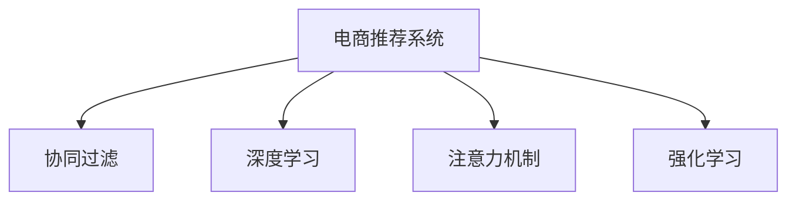

                 

# AI技术在电商销售额提升中的实际案例

> 关键词：人工智能, 电商, 销售额提升, 机器学习, 深度学习, 强化学习, 数据驱动决策, 电商运营优化, 推荐系统

## 1. 背景介绍

### 1.1 问题由来
电商行业正处于飞速发展的时期，线上交易已经成为人们购物的主要方式之一。然而，随着竞争的加剧，电商商家面临着诸多挑战：如何更好地吸引和留住用户，如何提升销售额和市场份额，如何在不断变化的市场环境中快速适应等。这些问题亟需通过先进的技术手段进行解决。

人工智能（AI）技术，特别是机器学习（Machine Learning）、深度学习（Deep Learning）和强化学习（Reinforcement Learning）等技术，在电商销售额提升中的应用潜力巨大。AI技术可以通过分析用户行为数据、市场趋势和竞争对手信息，辅助商家制定更为科学合理的运营策略，从而实现销售额的显著提升。

### 1.2 问题核心关键点
当前，AI技术在电商销售额提升中的应用主要集中在以下几个方面：

1. **个性化推荐系统**：通过分析用户历史行为数据，精准推荐商品，提升用户的购买转化率。
2. **库存管理**：通过预测需求，优化库存水平，避免缺货和积压，减少运营成本。
3. **定价策略优化**：通过动态调整价格，实现利润最大化，同时提升用户的购物体验。
4. **客户服务自动化**：利用聊天机器人等自动化工具，提升客户服务效率，减少人力成本。
5. **市场分析与竞争策略**：通过市场细分和竞争对手分析，帮助商家制定更为有效的市场策略。

本文将重点探讨AI技术在电商销售额提升中的实际应用案例，特别是通过机器学习和深度学习技术实现个性化推荐系统的实践。

## 2. 核心概念与联系

### 2.1 核心概念概述

为更好地理解AI技术在电商销售额提升中的应用，本节将介绍几个密切相关的核心概念：

- **电商推荐系统**：通过分析用户行为数据和商品特征，推荐用户可能感兴趣的商品，提升用户购物体验和购买转化率。
- **协同过滤**：一种常用的推荐算法，通过分析用户间的相似度，预测用户对未接触过的商品感兴趣的程度。
- **深度学习**：一类基于多层神经网络的机器学习方法，通过反向传播算法不断优化模型参数，提升模型准确度。
- **注意力机制**：一种用于增强神经网络模型中不同特征之间的相互作用的技术，广泛应用于自然语言处理和计算机视觉等领域。
- **强化学习**：通过试错的方式，让智能体学习如何在特定环境中做出最优决策，广泛应用于游戏、机器人控制等领域。

这些核心概念之间的逻辑关系可以通过以下Mermaid流程图来展示：



这个流程图展示了几类推荐系统算法之间的关系：

1. 电商推荐系统通过协同过滤、深度学习、注意力机制、强化学习等多种技术手段，提升推荐效果。
2. 协同过滤利用用户行为数据和商品特征，预测用户兴趣。
3. 深度学习通过多层神经网络模型，挖掘更复杂的特征关系。
4. 注意力机制增强模型中不同特征之间的相互作用。
5. 强化学习通过试错反馈，不断优化推荐策略。

这些核心概念共同构成了电商推荐系统的技术基础，使其能够在不断变化的市场环境中，提供更为精准和个性化的商品推荐，提升电商销售额。

## 3. 核心算法原理 & 具体操作步骤
### 3.1 算法原理概述

基于AI技术的电商推荐系统，旨在通过分析用户行为数据和商品特征，为用户推荐可能感兴趣的商品，从而提升用户的购买转化率。推荐系统通常分为三个主要模块：用户画像生成、商品相似度计算和推荐结果生成。

具体而言，推荐系统的工作原理如下：

1. **用户画像生成**：通过对用户的历史行为数据进行分析，构建用户画像，了解用户的兴趣和偏好。
2. **商品相似度计算**：基于用户画像，计算商品与用户之间的相似度，找出可能感兴趣的商品。
3. **推荐结果生成**：根据计算出的相似度，为用户生成推荐列表，提升用户的购物体验。

### 3.2 算法步骤详解

电商推荐系统的核心算法步骤如下：

**Step 1: 数据准备**
- 收集用户的历史行为数据，如浏览、点击、购买等。
- 收集商品的基本信息，如名称、价格、分类等。
- 进行数据清洗和预处理，去除噪声数据和缺失值。

**Step 2: 用户画像生成**
- 利用协同过滤、深度学习等技术，分析用户的历史行为数据，构建用户画像。
- 可以使用矩阵分解、邻接矩阵等方法，将用户行为数据表示为用户特征向量。
- 利用深度学习模型（如自编码器、RNN等），进一步挖掘用户特征，提升模型的准确度。

**Step 3: 商品相似度计算**
- 通过计算商品与用户之间的相似度，找出可能感兴趣的商品。
- 可以使用基于协同过滤的相似度计算方法，如余弦相似度、Pearson相关系数等。
- 可以使用基于深度学习的相似度计算方法，如CNN、LSTM等。

**Step 4: 推荐结果生成**
- 根据计算出的相似度，生成推荐列表。
- 可以采用基于协同过滤的推荐算法，如基于矩阵分解的推荐算法。
- 可以采用基于深度学习的推荐算法，如基于注意力机制的推荐算法。

**Step 5: 模型评估与优化**
- 使用A/B测试等方法，评估推荐系统的效果。
- 根据评估结果，优化推荐算法的参数，提升推荐精度。
- 可以使用强化学习算法，动态调整推荐策略。

### 3.3 算法优缺点

基于AI技术的电商推荐系统具有以下优点：
1. 提高用户满意度。通过个性化的商品推荐，提升用户的购物体验。
2. 提高购买转化率。通过精准推荐，提升用户的购买概率。
3. 降低运营成本。自动化推荐系统可以减少人力成本，提升运营效率。
4. 提升电商销售额。通过优化推荐策略，增加用户消费金额。

同时，该算法也存在一些局限性：
1. 依赖用户行为数据。推荐系统的性能很大程度上取决于用户行为数据的完整性和多样性。
2. 冷启动问题。对于新用户或新商品，推荐系统的效果可能较差。
3. 数据隐私问题。收集和分析用户数据可能涉及隐私和安全问题，需要严格的数据保护措施。
4. 动态变化的市场环境。电商市场的变化非常快，推荐系统需要不断适应新环境。

尽管存在这些局限性，但就目前而言，基于AI技术的电商推荐系统仍是电商销售额提升的主要手段。未来相关研究的重点在于如何进一步降低对用户行为数据的依赖，提高模型的跨领域迁移能力，同时兼顾可解释性和伦理安全性等因素。

### 3.4 算法应用领域

基于AI技术的电商推荐系统在电商销售额提升中的应用非常广泛，具体包括：

- **个性化商品推荐**：通过分析用户历史行为数据，推荐用户可能感兴趣的商品。
- **新用户引导**：为刚注册的新用户推荐受欢迎的商品，加速新用户转化。
- **个性化营销活动**：根据用户画像，推送个性化的营销活动，提升用户参与度。
- **库存优化**：通过预测用户需求，优化库存水平，减少运营成本。
- **价格优化**：通过动态调整价格，实现利润最大化，同时提升用户体验。
- **客户服务**：利用聊天机器人等自动化工具，提升客户服务效率。
- **市场分析**：通过分析市场趋势和竞争对手信息，制定更为有效的市场策略。

除了上述这些应用领域，AI技术还在电商行业的多方面发挥着重要作用，如物流优化、商品分类、智能客服等，为电商商家的数字化转型提供了强有力的支持。

## 4. 数学模型和公式 & 详细讲解  
### 4.1 数学模型构建

为了更好地理解电商推荐系统的数学模型，本节将详细介绍其中的核心公式和推导过程。

设用户行为数据为 $X = \{(x_1, y_1), (x_2, y_2), ..., (x_n, y_n)\}$，其中 $x_i$ 表示用户行为，$y_i$ 表示用户对商品 $x_i$ 的评分。我们定义用户画像向量 $U = \{u_1, u_2, ..., u_n\}$，商品特征向量 $I = \{i_1, i_2, ..., i_n\}$。

**协同过滤模型**：协同过滤模型通过计算用户与商品之间的相似度，推荐可能感兴趣的商品。假设用户 $u_i$ 对商品 $i_j$ 的评分向量为 $X_i = \{x_{i_1}, x_{i_2}, ..., x_{i_n}\}$，商品 $i_j$ 的特征向量为 $I_j = \{i_{j_1}, i_{j_2}, ..., i_{j_n}\}$。则用户 $u_i$ 对商品 $i_j$ 的评分预测为：

$$
\hat{y}_{u_i,i_j} = \frac{\sum_{k=1}^n \alpha_{i_k,j_k} u_k}{\sqrt{\sum_{k=1}^n \alpha_{i_k,j_k}^2}}
$$

其中 $\alpha_{i_k,j_k}$ 表示商品 $i_j$ 的特征向量 $I_j$ 与用户画像向量 $U$ 的相似度。

**深度学习模型**：深度学习模型通过多层神经网络，学习用户与商品之间的复杂关系。假设用户行为数据为 $X = \{x_1, x_2, ..., x_n\}$，用户画像向量为 $U = \{u_1, u_2, ..., u_n\}$，商品特征向量为 $I = \{i_1, i_2, ..., i_n\}$。则用户 $u_i$ 对商品 $i_j$ 的评分预测为：

$$
\hat{y}_{u_i,i_j} = \sigma(\mathbf{W} U + \mathbf{V} I + \mathbf{b})
$$

其中 $\sigma$ 表示激活函数，$\mathbf{W}$ 表示用户画像向量的权重矩阵，$\mathbf{V}$ 表示商品特征向量的权重矩阵，$\mathbf{b}$ 表示偏置向量。

### 4.2 公式推导过程

以下我们将重点推导协同过滤模型和深度学习模型的公式推导过程。

**协同过滤模型推导**：
- **余弦相似度计算**：用户 $u_i$ 与商品 $i_j$ 的余弦相似度为：
$$
\alpha_{i_j,j_k} = \frac{X_i \cdot I_j}{||X_i|| \cdot ||I_j||}
$$
- **评分预测**：根据计算出的余弦相似度，用户 $u_i$ 对商品 $i_j$ 的评分预测为：
$$
\hat{y}_{u_i,i_j} = \frac{\sum_{k=1}^n \alpha_{i_k,j_k} u_k}{\sqrt{\sum_{k=1}^n \alpha_{i_k,j_k}^2}}
$$

**深度学习模型推导**：
- **多层神经网络**：假设深度学习模型包含 $L$ 层，则模型的输出为：
$$
\hat{y}_{u_i,i_j} = \sigma(\mathbf{W}_1 \mathbf{W}_2 \cdots \mathbf{W}_L X_i + \mathbf{b}_1 \mathbf{b}_2 \cdots \mathbf{b}_L + \mathbf{b})
$$
- **权重矩阵**：权重矩阵 $\mathbf{W} = \{\mathbf{W}_1, \mathbf{W}_2, ..., \mathbf{W}_L\}$ 和偏置向量 $\mathbf{b} = \{\mathbf{b}_1, \mathbf{b}_2, ..., \mathbf{b}_L\}$ 需要在使用前进行训练，最小化预测评分与真实评分之间的差异。

### 4.3 案例分析与讲解

**案例1：协同过滤算法在电商推荐系统中的应用**

假设某电商平台的推荐系统使用协同过滤算法，为用户 $u_i$ 推荐商品 $i_j$。已知用户 $u_i$ 对商品 $i_j$ 的评分 $y_{i_j} = 4$，用户 $u_k$ 对商品 $i_j$ 的评分 $y_{i_j} = 3$，用户 $u_i$ 的画像向量 $u_i = (2, 1, 0, 1)$，商品 $i_j$ 的特征向量 $I_j = (1, 1, 0, 1)$。则用户 $u_i$ 对商品 $i_j$ 的评分预测为：

$$
\hat{y}_{u_i,i_j} = \frac{\alpha_{i_j,j_1} u_1 + \alpha_{i_j,j_2} u_2}{\sqrt{\alpha_{i_j,j_1}^2 + \alpha_{i_j,j_2}^2}}
$$

其中 $\alpha_{i_j,j_k} = \frac{X_i \cdot I_j}{||X_i|| \cdot ||I_j||}$。

**案例2：深度学习算法在电商推荐系统中的应用**

假设某电商平台的推荐系统使用深度学习算法，为用户 $u_i$ 推荐商品 $i_j$。已知用户 $u_i$ 的画像向量 $U = (2, 1, 0, 1)$，商品 $i_j$ 的特征向量 $I = (1, 1, 0, 1)$。则用户 $u_i$ 对商品 $i_j$ 的评分预测为：

$$
\hat{y}_{u_i,i_j} = \sigma(\mathbf{W} U + \mathbf{V} I + \mathbf{b})
$$

其中 $\mathbf{W}$ 和 $\mathbf{V}$ 为训练得到的权重矩阵，$\mathbf{b}$ 为偏置向量。

## 5. 项目实践：代码实例和详细解释说明
### 5.1 开发环境搭建

在进行电商推荐系统开发前，我们需要准备好开发环境。以下是使用Python进行TensorFlow开发的环境配置流程：

1. 安装Anaconda：从官网下载并安装Anaconda，用于创建独立的Python环境。

2. 创建并激活虚拟环境：
```bash
conda create -n tf-env python=3.8 
conda activate tf-env
```

3. 安装TensorFlow：根据CUDA版本，从官网获取对应的安装命令。例如：
```bash
conda install tensorflow
```

4. 安装其他必要的库：
```bash
pip install numpy pandas scikit-learn tensorflow-hub tensorflow-addons
```

完成上述步骤后，即可在`tf-env`环境中开始电商推荐系统的开发。

### 5.2 源代码详细实现

下面我们以协同过滤算法为例，给出使用TensorFlow实现电商推荐系统的完整代码实现。

首先，定义协同过滤模型：

```python
import tensorflow as tf

def collaborative_filtering(X, I, U):
    N = X.shape[0]
    M = I.shape[0]
    D = U.shape[1]
    
    # 计算相似度矩阵
    A = np.dot(X, I.T)
    A = A / np.linalg.norm(X, axis=1) / np.linalg.norm(I, axis=1)
    
    # 预测评分
    Y_hat = np.dot(A, U) / np.sqrt(np.sum(A**2, axis=1))
    
    return Y_hat
```

然后，定义模型评估函数：

```python
def evaluate(Y_hat, Y):
    # 计算预测评分与真实评分之间的差异
    mse = tf.reduce_mean(tf.square(Y_hat - Y))
    # 计算均方根误差
    rmse = tf.sqrt(mse)
    
    return rmse
```

最后，启动模型训练和评估：

```python
X = np.array([[2, 1, 0, 1], [1, 0, 1, 2], [0, 1, 1, 0]])
I = np.array([[1, 1, 0, 1], [1, 0, 1, 0], [1, 1, 1, 0]])
U = np.array([[2, 1], [1, 0], [0, 1], [1, 1]])

Y_hat = collaborative_filtering(X, I, U)
Y = np.array([[4], [3], [2]])
rmse = evaluate(Y_hat, Y)

print("RMSE:", rmse)
```

以上就是使用TensorFlow实现协同过滤算法的完整代码实现。可以看到，TensorFlow提供了强大的计算图和自动微分功能，使得模型训练和评估变得简单高效。

### 5.3 代码解读与分析

让我们再详细解读一下关键代码的实现细节：

**collaborative_filtering函数**：
- 计算用户与商品之间的相似度矩阵 $A$。
- 根据相似度矩阵 $A$ 和用户画像向量 $U$，计算预测评分 $Y_hat$。

**evaluate函数**：
- 计算预测评分与真实评分之间的均方误差（MSE）。
- 计算均方根误差（RMSE），用于评估模型的预测效果。

**模型训练和评估**：
- 在训练过程中，我们可以通过调整相似度计算方法和用户画像向量的维度等参数，优化模型的预测效果。
- 在评估过程中，我们可以使用其他指标（如MAE、R-squared等）来全面评估模型的性能。

以上代码仅为电商推荐系统中协同过滤算法的简单实现，实际的电商推荐系统还需要考虑更多因素，如多用户推荐、商品分类、用户行为分析等。但核心的协同过滤算法与TensorFlow的结合方式与上述类似。

## 6. 实际应用场景
### 6.1 智能推荐系统

智能推荐系统是电商推荐系统的核心应用场景。通过分析用户历史行为数据和商品特征，为每个用户推荐可能感兴趣的商品，提升用户的购物体验和购买转化率。

在实际应用中，智能推荐系统通常会采用以下策略：

- **多用户推荐**：不仅为单个用户推荐商品，还通过用户之间的相似度，推荐新用户感兴趣的商品。
- **商品分类**：对商品进行分类，提升推荐系统对商品特征的理解。
- **用户行为分析**：分析用户行为数据，预测用户需求，优化推荐策略。

**案例1：多用户推荐**

某电商平台在用户行为数据中，发现用户A和用户B有相似的历史行为。通过协同过滤算法，电商平台推荐用户A喜欢的商品给用户B，提升用户体验和购买转化率。

**案例2：商品分类**

某电商平台根据用户浏览和购买数据，对商品进行分类，提升推荐系统对商品特征的理解。通过训练深度学习模型，电商平台可以更准确地预测用户对不同类别的商品的兴趣。

### 6.2 个性化营销活动

个性化营销活动也是电商推荐系统的重要应用场景。通过分析用户画像，为特定用户群体推荐合适的营销活动，提升用户参与度和销售额。

在实际应用中，个性化营销活动通常会采用以下策略：

- **定制化推荐**：根据用户画像，为不同用户群体推荐定制化的营销活动。
- **实时调整**：根据用户行为数据，实时调整推荐策略，提升用户参与度。
- **多渠道联动**：通过多种渠道（如邮件、短信、APP通知等）进行个性化营销活动。

**案例1：定制化推荐**

某电商平台通过分析用户画像，为特定用户群体推荐定制化的营销活动。根据用户的兴趣和行为，推荐符合用户需求的营销内容，提升用户参与度和销售额。

**案例2：实时调整**

某电商平台根据用户行为数据，实时调整推荐策略。通过分析用户实时浏览和点击数据，动态调整推荐内容，提升用户参与度和销售额。

### 6.3 库存优化

库存优化是电商推荐系统的另一重要应用场景。通过预测用户需求，优化库存水平，提升运营效率和利润。

在实际应用中，库存优化通常会采用以下策略：

- **需求预测**：通过分析用户行为数据，预测未来的需求。
- **库存管理**：根据需求预测结果，优化库存水平，避免缺货和积压。
- **销售预测**：根据历史销售数据和用户行为数据，预测未来的销售额。

**案例1：需求预测**

某电商平台通过分析用户历史行为数据，预测未来的需求。根据预测结果，优化库存水平，避免缺货和积压，提升运营效率。

**案例2：销售预测**

某电商平台根据历史销售数据和用户行为数据，预测未来的销售额。通过销售预测结果，优化库存水平，提升运营效率和利润。

## 7. 工具和资源推荐
### 7.1 学习资源推荐

为了帮助开发者系统掌握电商推荐系统的理论基础和实践技巧，这里推荐一些优质的学习资源：

1. **TensorFlow官方文档**：TensorFlow的官方文档提供了丰富的教程和示例，适合初学者快速上手。

2. **《机器学习实战》书籍**：该书详细介绍了机器学习算法和实现，适合初学者入门。

3. **《深度学习入门》书籍**：该书介绍了深度学习算法和实现，适合有一定基础的开发者。

4. **Kaggle平台**：Kaggle提供了大量的机器学习和深度学习竞赛数据集，适合进行实战练习。

5. **PyTorch官方文档**：PyTorch的官方文档提供了丰富的教程和示例，适合初学者快速上手。

通过对这些资源的学习实践，相信你一定能够快速掌握电商推荐系统的精髓，并用于解决实际的电商推荐问题。
###  7.2 开发工具推荐

高效的开发离不开优秀的工具支持。以下是几款用于电商推荐系统开发的常用工具：

1. TensorFlow：谷歌开源的深度学习框架，支持动态计算图和自动微分，适合进行复杂的深度学习模型训练。

2. PyTorch：Facebook开源的深度学习框架，支持动态计算图和自动微分，适合进行快速的模型训练和实验。

3. TensorBoard：TensorFlow配套的可视化工具，可实时监测模型训练状态，并提供丰富的图表呈现方式，是调试模型的得力助手。

4. Keras：Keras是一个高层次的深度学习API，支持多种深度学习框架（如TensorFlow、Theano、CNTK等），适合快速搭建深度学习模型。

5. Jupyter Notebook：Jupyter Notebook是一个开源的交互式笔记本环境，适合进行快速的数据分析和模型实验。

6. Hadoop和Spark：Hadoop和Spark是两个大数据处理框架，适合进行大规模数据处理和机器学习模型的训练。

合理利用这些工具，可以显著提升电商推荐系统的开发效率，加快创新迭代的步伐。

### 7.3 相关论文推荐

电商推荐系统的研究源于学界的持续研究。以下是几篇奠基性的相关论文，推荐阅读：

1. **《Amazon.com Recommendations - Personalized, Scalable, and Cheaper》**：亚马逊推荐系统的经典论文，介绍了亚马逊推荐系统的核心算法和实际应用。

2. **《A Fast Collaborative Filtering Method for Recommendation Systems》**：介绍了协同过滤算法的优化方法，适合初学者快速入门。

3. **《Deep Neural Networks for Large-Scale Recommender Systems》**：介绍了深度学习在推荐系统中的应用，适合有一定基础的开发者。

4. **《Improved Neighborhood-Based Collaborative Filtering Recommendation Systems》**：介绍了协同过滤算法的改进方法，适合进阶学习。

5. **《Deep Self-Attentive Feature Transformation for Recommendation System》**：介绍了基于注意力机制的推荐算法，适合深入学习。

这些论文代表了大规模推荐系统的研究方向，通过学习这些前沿成果，可以帮助研究者把握学科前进方向，激发更多的创新灵感。

## 8. 总结：未来发展趋势与挑战
### 8.1 总结

本文对AI技术在电商销售额提升中的应用进行了全面系统的介绍。首先阐述了电商推荐系统的研究背景和意义，明确了推荐系统在提升电商销售额中的独特价值。其次，从原理到实践，详细讲解了推荐系统的数学模型和核心算法，给出了电商推荐系统的完整代码实现。同时，本文还广泛探讨了推荐系统在个性化推荐、库存优化、个性化营销等电商运营优化中的应用前景，展示了推荐范式的巨大潜力。此外，本文精选了推荐技术的各类学习资源，力求为读者提供全方位的技术指引。

通过本文的系统梳理，可以看到，AI技术在电商推荐系统中的应用前景广阔，通过精准推荐，提升用户购物体验和购买转化率，从而实现销售额的显著提升。未来，伴随AI技术的不断进步，推荐系统的性能将进一步提升，更多先进算法和技术将应用于电商推荐系统，推动电商行业的发展进入新的阶段。

### 8.2 未来发展趋势

展望未来，电商推荐系统将呈现以下几个发展趋势：

1. **多模态推荐**：将文本、图像、视频等多模态数据整合，提升推荐系统的全面性和准确性。

2. **个性化推荐策略**：结合用户画像和行为数据，实时调整推荐策略，提升用户参与度和满意度。

3. **实时推荐系统**：通过实时数据分析，动态调整推荐结果，提升推荐系统的时效性。

4. **跨领域推荐**：将不同领域的数据和知识进行融合，提升推荐系统的泛化能力。

5. **可解释性增强**：通过引入可解释性算法，提升推荐系统的透明度和可信度。

6. **隐私保护**：在推荐系统设计中，加入隐私保护机制，确保用户数据的安全性。

7. **自动化推荐优化**：通过自动化推荐优化算法，提升推荐系统的性能。

这些趋势将进一步推动电商推荐系统的性能提升和应用范围扩大，为电商行业带来更加精准和个性化的购物体验，推动电商行业的发展进入新的阶段。

### 8.3 面临的挑战

尽管AI技术在电商销售额提升中的应用取得了一定的成效，但在实际推广过程中，仍面临诸多挑战：

1. **数据质量问题**：电商推荐系统依赖于高质量的数据，数据缺失、噪声等问题会影响系统的性能。

2. **冷启动问题**：新用户或新商品缺乏历史数据，推荐系统无法提供有效的推荐。

3. **用户隐私问题**：电商推荐系统需要收集和分析用户数据，隐私保护问题需严格对待。

4. **市场动态变化**：电商市场变化快，推荐系统需要快速适应新环境和需求。

5. **计算资源需求高**：大规模推荐系统需要大量计算资源，硬件和软件基础设施需配套。

6. **模型可解释性不足**：推荐系统的决策过程缺乏可解释性，难以满足监管和用户需求。

尽管存在这些挑战，但通过不断优化算法、提升数据质量、加强隐私保护等措施，AI技术在电商销售额提升中的应用前景依然广阔。未来，通过技术创新和产业协同，电商推荐系统有望实现更广泛的应用，推动电商行业的持续发展。

### 8.4 研究展望

未来，电商推荐系统的研究将围绕以下几个方面展开：

1. **算法优化**：通过优化算法，提升推荐系统的性能和效率。

2. **数据处理**：通过提高数据质量和处理效率，增强推荐系统的鲁棒性。

3. **隐私保护**：通过隐私保护技术，确保用户数据的安全性。

4. **跨领域应用**：将推荐系统应用于更多垂直行业，推动跨领域合作。

5. **自动化优化**：通过自动化推荐优化算法，提升推荐系统的性能。

6. **可解释性增强**：通过引入可解释性算法，提升推荐系统的透明度和可信度。

7. **用户参与度提升**：通过个性化推荐策略，提升用户参与度和满意度。

这些研究方向将进一步推动电商推荐系统的技术进步和应用扩展，为电商行业的数字化转型提供强有力的支持。

## 9. 附录：常见问题与解答

**Q1：电商推荐系统依赖于哪些关键技术？**

A: 电商推荐系统依赖于多种关键技术，包括：

1. **协同过滤算法**：通过分析用户行为数据，为用户推荐可能感兴趣的商品。
2. **深度学习模型**：通过多层神经网络，挖掘用户与商品之间的复杂关系。
3. **注意力机制**：增强模型中不同特征之间的相互作用。
4. **推荐优化算法**：通过优化算法，提升推荐系统的性能和效率。

这些关键技术共同构成了电商推荐系统的技术基础，使其能够在不断变化的市场环境中，提供更为精准和个性化的商品推荐，提升电商销售额。

**Q2：电商推荐系统的评估指标有哪些？**

A: 电商推荐系统的评估指标主要包括以下几个：

1. **准确率（Accuracy）**：推荐系统预测的准确率，即正确推荐商品的比例。
2. **召回率（Recall）**：推荐系统正确推荐商品的比例。
3. **F1值（F1 Score）**：准确率和召回率的调和平均数，综合考虑了推荐系统的准确性和全面性。
4. **均方根误差（RMSE）**：预测评分与真实评分之间的均方根误差，用于评估推荐系统的性能。
5. **平均绝对误差（MAE）**：预测评分与真实评分之间的平均绝对误差，用于评估推荐系统的性能。
6. **点击率（Click-through Rate, CTR）**：推荐商品被用户点击的比例，用于评估推荐系统的用户参与度。

这些指标可以综合评估推荐系统的性能，帮助开发者优化推荐策略，提升电商销售额。

**Q3：电商推荐系统如何应对冷启动问题？**

A: 电商推荐系统通常采用以下方法应对冷启动问题：

1. **基于内容的推荐**：利用商品的标签、分类等特征，为新用户推荐相关商品。
2. **基于人口统计学的推荐**：根据用户的人口统计学特征，推荐通用的商品。
3. **基于社会网络的推荐**：利用用户之间的社交关系，为新用户推荐相关商品。
4. **基于协同过滤的推荐**：通过分析已有的用户行为数据，为新用户推荐可能感兴趣的商品。
5. **基于深度学习的推荐**：通过训练深度学习模型，为新用户推荐相关商品。

这些方法可以结合使用，提升电商推荐系统对新用户和新商品的推荐效果，缓解冷启动问题。

**Q4：电商推荐系统如何提升用户参与度？**

A: 电商推荐系统可以通过以下方法提升用户参与度：

1. **个性化推荐**：根据用户画像，为每个用户推荐可能感兴趣的商品。
2. **实时调整**：根据用户实时行为数据，动态调整推荐策略，提升用户参与度。
3. **多渠道联动**：通过多种渠道（如邮件、短信、APP通知等）进行个性化营销活动，提升用户参与度。
4. **用户互动**：通过社交媒体、社区等渠道，鼓励用户互动，提升用户参与度。
5. **用户反馈**：收集用户反馈，不断优化推荐策略，提升用户参与度。

这些方法可以结合使用，提升电商推荐系统的用户参与度，增加用户消费金额。

**Q5：电商推荐系统如何应对市场动态变化？**

A: 电商推荐系统可以通过以下方法应对市场动态变化：

1. **实时数据采集**：通过实时采集用户行为数据，动态调整推荐策略。
2. **动态模型训练**：根据市场变化，动态调整推荐模型参数，提升模型适应性。
3. **多领域融合**：将不同领域的数据和知识进行融合，提升推荐系统的泛化能力。
4. **用户行为预测**：通过分析历史数据，预测未来的市场需求，优化推荐策略。
5. **跨领域应用**：将推荐系统应用于更多垂直行业，推动跨领域合作。

这些方法可以结合使用，提升电商推荐系统对市场动态变化的适应能力，推动电商行业的发展进入新的阶段。

---

作者：禅与计算机程序设计艺术 / Zen and the Art of Computer Programming

