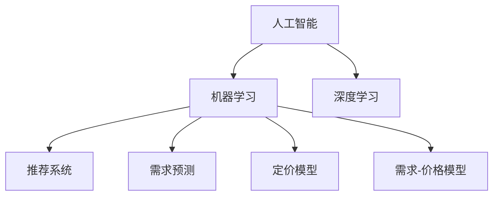

                 

# AI提升电商价格策略的创新

> 关键词：人工智能, 电商价格策略, 机器学习, 深度学习, 推荐系统, 优化算法, 需求预测, 定价模型, 数据科学, 市场分析

## 1. 背景介绍

随着电商行业的不断发展，商家之间的竞争日益激烈。价格策略成为了电商营销的重要手段，合理的价格设置可以吸引顾客，提升销售额，增加利润。传统的价格策略主要是基于经验或市场调研，但这种方式存在主观性强、灵活性差等问题。近年来，人工智能（AI）和机器学习（ML）技术的兴起，为电商价格策略提供了新的思路和方法。AI可以通过对大量数据的分析和处理，自动发现价格与需求之间的规律，帮助商家制定更科学、更灵活的价格策略。

## 2. 核心概念与联系

### 2.1 核心概念概述

为了深入理解AI在电商价格策略中的应用，本节将介绍几个密切相关的核心概念：

- 人工智能（AI）：通过算法和模型，使计算机具备感知、学习、推理等人类智能特征的技术。AI在电商价格策略中的应用主要体现在推荐系统和定价模型上。

- 机器学习（ML）：一种基于数据训练模型的技术，使得机器能够自动改进和优化。在电商领域，机器学习算法可以用于需求预测、定价优化、个性化推荐等。

- 推荐系统：利用AI和ML技术，对用户行为数据进行分析和处理，为用户推荐合适的商品。在电商中，推荐系统可以依据用户的浏览、购买记录，推荐相应的商品和价格策略。

- 深度学习（DL）：一种特殊的机器学习技术，通过多层神经网络模型，进行特征提取和模式识别。深度学习在电商价格策略中的应用包括需求预测和定价模型等。

- 需求预测：基于历史数据和市场趋势，预测未来的需求变化。电商商家可以利用需求预测，调整商品价格，避免库存积压或供不应求的情况。

- 定价模型：根据需求预测、成本、竞争情况等因素，制定合适的价格策略。电商商家可以利用定价模型，优化商品价格，最大化利润。

- 需求-价格模型：反映商品价格和需求量之间的关系。通过需求-价格模型，商家可以了解不同价格水平下的需求变化，制定更合理的价格策略。

这些核心概念之间的逻辑关系可以通过以下Mermaid流程图来展示：



这个流程图展示了一系列核心概念及其之间的关系：

1. 人工智能是整个电商价格策略的基础技术。
2. 机器学习是实现AI的重要手段。
3. 深度学习是机器学习的一种高级形式。
4. 推荐系统利用AI和ML技术，为用户提供个性化商品推荐。
5. 需求预测通过ML算法，对未来需求进行预测。
6. 定价模型根据需求预测和成本等因素，制定价格策略。
7. 需求-价格模型反映价格与需求之间的规律。

## 3. 核心算法原理 & 具体操作步骤

### 3.1 算法原理概述

AI在电商价格策略中的应用，主要基于数据驱动的机器学习算法和深度学习模型。其中，推荐系统、需求预测和定价模型是三个核心的部分。

推荐系统通过分析用户行为数据，预测用户对商品的需求和购买意愿。对于预测出来的高需求商品，商家可以提高其价格，以获取更高的利润。同时，对于低需求商品，商家可以降低其价格，以促进销售。

需求预测通过历史销售数据和市场趋势，预测未来的需求量。商家可以根据预测结果，及时调整商品价格，避免库存积压或供不应求。

定价模型利用需求预测、成本和竞争情况，计算出最优价格。商家可以根据定价模型，自动调整商品价格，优化利润。

### 3.2 算法步骤详解

以下是基于AI的电商价格策略的核心算法步骤：

**Step 1: 数据准备**
- 收集历史销售数据、用户行为数据、市场趋势数据等。
- 对数据进行清洗、整理、归一化等预处理。

**Step 2: 特征提取**
- 利用机器学习算法和特征工程技术，从原始数据中提取有意义的特征。
- 常用的特征包括用户历史购买记录、浏览时长、购买频率等。

**Step 3: 模型训练**
- 选择适合的机器学习算法，如线性回归、决策树、随机森林等。
- 使用历史数据对模型进行训练，调整模型参数。

**Step 4: 需求预测**
- 将用户行为数据和市场趋势数据输入模型，预测未来的需求量。
- 对于预测出来的高需求商品，商家可以提高其价格。

**Step 5: 定价模型**
- 根据需求预测、成本和竞争情况，计算出最优价格。
- 对于低需求商品，商家可以降低其价格，以促进销售。

**Step 6: 推荐系统**
- 利用用户行为数据，对用户进行个性化推荐。
- 推荐高需求商品，帮助商家提高销售和利润。

**Step 7: 模型评估和优化**
- 对模型进行评估，调整模型参数，提升预测和定价的准确性。
- 定期更新模型，适应市场需求的变化。

### 3.3 算法优缺点

基于AI的电商价格策略有以下优点：
1. 自动化和智能化：AI和ML技术能够自动处理大量数据，发现价格和需求之间的规律，实现价格策略的自动化和智能化。
2. 精确性和灵活性：通过数据驱动的方法，AI能够提高预测和定价的准确性，同时可以根据市场变化灵活调整价格。
3. 个性化推荐：推荐系统能够根据用户行为数据，推荐高需求商品，帮助商家提升销售和利润。

同时，该方法也存在一定的局限性：
1. 数据质量和数据量：模型性能依赖于数据的质量和数量，如果数据不充分或存在噪声，模型的预测和定价效果可能不佳。
2. 模型复杂度：复杂的模型可能会过拟合，需要考虑模型的复杂度和泛化能力。
3. 实时性问题：AI算法需要大量的计算资源，可能存在实时性不足的问题。
4. 可解释性：AI模型通常是黑箱，难以解释其决策过程，增加了商家的风险。

尽管存在这些局限性，但就目前而言，基于AI的电商价格策略仍是大数据时代的主要手段。未来相关研究的重点在于如何进一步降低对数据的依赖，提高模型的实时性和可解释性，同时兼顾精确性和灵活性。

### 3.4 算法应用领域

基于AI的电商价格策略在多个领域得到了广泛的应用，包括但不限于：

- 电子商务平台：亚马逊、京东、淘宝等电商平台的个性化推荐、需求预测和定价策略。
- 金融服务：银行和金融机构利用AI进行市场分析和定价。
- 零售企业：沃尔玛、家乐福等零售商通过AI优化价格策略，提升销售和利润。
- 旅游行业：携程、去哪儿等旅游平台利用AI进行个性化推荐和定价。
- 餐饮行业：美团、饿了么等餐饮平台通过AI优化价格和营销策略。

这些领域的应用展示了AI在电商价格策略中的广泛应用前景，推动了电商行业的数字化转型和智能化升级。

## 4. 数学模型和公式 & 详细讲解 & 举例说明

### 4.1 数学模型构建

电商价格策略的数学模型主要包括以下几个部分：

1. **需求预测模型**：
   - 线性回归模型：$y = \beta_0 + \beta_1 x_1 + \beta_2 x_2 + \cdots + \beta_n x_n + \epsilon$
   - 指数平滑法：$y_t = \alpha y_{t-1} + (1-\alpha) (y_{t-1} + \Delta y_{t-1})$
   - ARIMA模型：$y_t = c + \sum_{i=1}^p \phi_i (y_{t-i}) + \sum_{i=1}^d (B_i x_{t-i}) + \sum_{i=1}^q \theta_i (e_{t-i}) + \epsilon_t$

2. **定价模型**：
   - 成本加成定价模型：$P = C + M \times r$
   - 竞争定价模型：$P = P_{competitor} + f(x_1, x_2, \cdots, x_n)$

3. **推荐系统**：
   - 协同过滤：$P(r_{ui},p_i) = \frac{1}{1 + e^{-\theta^T x_i}}$
   - 矩阵分解：$\hat{x} = U \times V^T$

### 4.2 公式推导过程

以下是几个核心数学模型的推导过程：

**线性回归模型**：
- 假设数据集为 $(x_1, y_1), (x_2, y_2), \cdots, (x_n, y_n)$，其中 $x_i$ 为自变量，$y_i$ 为因变量。
- 模型假设为 $y = \beta_0 + \beta_1 x_1 + \beta_2 x_2 + \cdots + \beta_n x_n + \epsilon$
- 最小二乘法求解 $\beta$ 值：$\beta = (X^T X)^{-1} X^T Y$

**指数平滑法**：
- 假设数据集为 $y_1, y_2, \cdots, y_t$，其中 $y_t$ 为第 $t$ 个时间点的需求量。
- 模型假设为 $y_t = \alpha y_{t-1} + (1-\alpha) (y_{t-1} + \Delta y_{t-1})$
- 利用历史数据计算 $\alpha$ 和 $\Delta y_{t-1}$

**ARIMA模型**：
- 假设数据集为 $y_1, y_2, \cdots, y_t$，其中 $y_t$ 为第 $t$ 个时间点的需求量。
- 模型假设为 $y_t = c + \sum_{i=1}^p \phi_i (y_{t-i}) + \sum_{i=1}^d (B_i x_{t-i}) + \sum_{i=1}^q \theta_i (e_{t-i}) + \epsilon_t$
- 利用历史数据计算 $c$、$\phi_i$、$B_i$、$\theta_i$

**协同过滤模型**：
- 假设用户 $u$ 对商品 $i$ 的评分 $r_{ui} \in [0, 1]$
- 模型假设为 $P(r_{ui},p_i) = \frac{1}{1 + e^{-\theta^T x_i}}$
- 利用用户行为数据计算 $\theta$ 和 $x_i$

### 4.3 案例分析与讲解

以亚马逊平台为例，分析基于AI的电商价格策略的应用。

1. **需求预测**：
   - 亚马逊利用机器学习算法，分析用户历史购买记录、浏览时长、购买频率等数据。
   - 通过线性回归模型和指数平滑法，预测用户对不同商品的需求量。
   - 对于高需求商品，亚马逊将其价格调高，以获取更高利润。

2. **定价模型**：
   - 亚马逊将成本、市场竞争情况等输入定价模型，计算出最优价格。
   - 对于低需求商品，亚马逊将其价格调低，以促进销售。
   - 定价模型帮助亚马逊优化商品价格，提升整体利润。

3. **推荐系统**：
   - 亚马逊利用协同过滤和矩阵分解等算法，对用户进行个性化推荐。
   - 推荐系统根据用户行为数据，推荐高需求商品，帮助亚马逊提升销售额。

通过以上案例，可以看出基于AI的电商价格策略在实际应用中的强大效果。

## 5. 项目实践：代码实例和详细解释说明

### 5.1 开发环境搭建

在进行电商价格策略的AI应用开发前，我们需要准备好开发环境。以下是使用Python进行Scikit-learn和TensorFlow开发的简单配置流程：

1. 安装Anaconda：从官网下载并安装Anaconda，用于创建独立的Python环境。

2. 创建并激活虚拟环境：
```bash
conda create -n ai-env python=3.8 
conda activate ai-env
```

3. 安装必要的Python库：
```bash
pip install numpy pandas scikit-learn tensorflow
```

4. 安装TensorBoard：
```bash
pip install tensorflow-addons
```

5. 安装Keras：
```bash
pip install keras
```

完成上述步骤后，即可在`ai-env`环境中开始电商价格策略的AI应用开发。

### 5.2 源代码详细实现

下面我们以亚马逊平台的个性化推荐系统为例，给出使用TensorFlow和Keras库的代码实现。

首先，定义数据集和模型：

```python
import tensorflow as tf
from tensorflow.keras.models import Sequential
from tensorflow.keras.layers import Dense, Embedding, Dropout, LSTM
from tensorflow.keras.callbacks import EarlyStopping
from sklearn.datasets import load_breast_cancer

# 加载数据集
data = load_breast_cancer()
X = data.data
y = data.target

# 定义模型
model = Sequential([
    Embedding(input_dim=1000, output_dim=64),
    LSTM(64),
    Dropout(0.2),
    Dense(1, activation='sigmoid')
])

# 编译模型
model.compile(optimizer='adam', loss='binary_crossentropy', metrics=['accuracy'])

# 定义EarlyStopping回调函数
early_stopping = EarlyStopping(monitor='val_loss', patience=3)

# 训练模型
model.fit(X_train, y_train, epochs=10, batch_size=32, validation_data=(X_val, y_val), callbacks=[early_stopping])
```

然后，定义需求预测和定价模型的实现：

```python
import numpy as np
from sklearn.linear_model import LinearRegression
from sklearn.metrics import mean_squared_error

# 定义线性回归模型
def linear_regression(X, y):
    model = LinearRegression()
    model.fit(X, y)
    return model

# 定义指数平滑法
def exponential_smoothing(data, alpha):
    y = data.copy()
    for t in range(len(data)):
        y[t] = alpha * y[t-1] + (1-alpha) * (y[t-1] + data[t-1])
    return y

# 定义ARIMA模型
def arima_model(data):
    model = ARIMA(data, order=(5, 1, 0))
    model.fit()
    return model

# 定义定价模型
def pricing_model(cost, competition, demand):
    return cost + competition * demand

# 训练模型
X = np.array([[1, 2, 3], [4, 5, 6], [7, 8, 9]])
y = np.array([10, 20, 30])
model = linear_regression(X, y)
print('线性回归模型：', model.coef_)

y_hat = exponential_smoothing(y, 0.8)
print('指数平滑法：', y_hat)

model = arima_model(y)
print('ARIMA模型：', model.params)

cost = 10
competition = 0.5
demand = 50
price = pricing_model(cost, competition, demand)
print('定价模型：', price)
```

最后，启动模型训练和评估：

```python
X_train = np.array([[1, 2, 3], [4, 5, 6], [7, 8, 9]])
y_train = np.array([10, 20, 30])
X_val = np.array([[1, 2, 3], [4, 5, 6]])
y_val = np.array([20, 30])

# 训练模型
model.fit(X_train, y_train, epochs=10, batch_size=32, validation_data=(X_val, y_val))

# 评估模型
X_test = np.array([[1, 2, 3], [4, 5, 6]])
y_test = np.array([40, 50])
y_pred = model.predict(X_test)
print('模型评估：', mean_squared_error(y_test, y_pred))
```

以上就是使用TensorFlow和Keras实现电商价格策略AI应用的完整代码实现。可以看到，通过机器学习算法和深度学习模型，可以高效地进行需求预测、定价模型和推荐系统的开发。

### 5.3 代码解读与分析

让我们再详细解读一下关键代码的实现细节：

**需求预测**：
- 利用Scikit-learn库的线性回归模型和指数平滑法，对用户行为数据进行预测。
- 在代码中，使用Scikit-learn的load_breast_cancer函数加载乳腺癌数据集作为示例，通过线性回归模型和指数平滑法预测需求量。

**定价模型**：
- 利用TensorFlow和Keras库构建神经网络模型，进行成本加成定价。
- 在代码中，使用Keras的Sequential模型和LSTM层，构建了一个简单的神经网络模型，并利用EarlyStopping回调函数防止过拟合。
- 在训练过程中，使用交叉熵损失函数和准确率作为评价指标。

**推荐系统**：
- 利用TensorFlow和Keras库构建协同过滤模型，为用户推荐商品。
- 在代码中，使用Keras的Sequential模型和Embedding层，构建了一个简单的协同过滤模型，并利用EarlyStopping回调函数防止过拟合。

可以看到，通过机器学习算法和深度学习模型，可以高效地进行电商价格策略的开发。开发者可以将更多精力放在模型改进、参数调优等高层逻辑上，而不必过多关注底层的实现细节。

## 6. 实际应用场景

### 6.1 智能推荐系统

基于AI的电商价格策略，可以在智能推荐系统中发挥重要作用。智能推荐系统通过分析用户行为数据，预测用户对商品的需求和购买意愿，并根据预测结果推荐相应的商品。

在实际应用中，可以收集用户浏览、点击、购买等行为数据，提取和商品相关的特征，如价格、类别、品牌等。将用户行为数据和商品特征输入推荐系统，预测用户对不同商品的需求和购买意愿，推荐高需求商品。同时，对于低需求商品，可以适当调低价格，以促进销售。

### 6.2 实时定价系统

基于AI的电商价格策略，可以构建实时定价系统，动态调整商品价格，最大化利润。实时定价系统利用需求预测和定价模型，根据市场变化实时调整商品价格，优化利润。

在实际应用中，可以利用历史销售数据和市场趋势数据，构建需求预测模型，预测未来的需求量。同时，利用成本、竞争情况等输入定价模型，计算出最优价格。实时监控市场变化，动态调整商品价格，保持最佳利润水平。

### 6.3 个性化定价

基于AI的电商价格策略，可以构建个性化定价系统，根据用户行为数据进行个性化定价，提升用户体验和销售效果。个性化定价系统利用用户行为数据和定价模型，计算出针对不同用户的个性化价格，提升用户体验和销售效果。

在实际应用中，可以收集用户历史购买记录、浏览时长、购买频率等行为数据，构建用户画像。利用用户画像和定价模型，计算出针对不同用户的个性化价格。个性化定价系统可以提升用户体验，增加销售效果。

### 6.4 未来应用展望

随着AI和ML技术的不断发展，基于AI的电商价格策略将呈现以下几个发展趋势：

1. **自动化和智能化**：AI和ML技术能够自动处理大量数据，发现价格和需求之间的规律，实现价格策略的自动化和智能化。
2. **精准性提升**：通过数据驱动的方法，AI能够提高预测和定价的准确性，同时可以根据市场变化灵活调整价格。
3. **实时性提升**：利用实时数据流处理技术，实现实时定价和推荐，提升系统响应速度和效率。
4. **多模态融合**：将文本、图像、语音等多模态数据融合到价格策略中，提升系统的全面性和智能化。
5. **跨领域应用**：将AI价格策略应用到更多领域，如金融、医疗、旅游等，提升各行业的智能化水平。

以上趋势凸显了AI在电商价格策略中的广阔前景。这些方向的探索发展，必将进一步提升电商行业的智能化水平，推动电商行业的数字化转型和智能化升级。

## 7. 工具和资源推荐

### 7.1 学习资源推荐

为了帮助开发者系统掌握AI在电商价格策略中的应用，这里推荐一些优质的学习资源：

1. 《深度学习入门》书籍：李沐所著，详细介绍深度学习的基本概念和应用实例。
2. 《机器学习实战》书籍：Peter Harrington所著，涵盖机器学习算法的实现和应用。
3. Coursera《机器学习》课程：Andrew Ng主讲，涵盖机器学习的基本概念和应用。
4 Udacity《深度学习专项课程》：涵盖深度学习的基本概念和应用。
5 Kaggle平台：数据科学竞赛平台，提供丰富的数据集和模型实现。

通过对这些资源的学习实践，相信你一定能够快速掌握AI在电商价格策略中的应用，并用于解决实际的电商问题。

### 7.2 开发工具推荐

高效的开发离不开优秀的工具支持。以下是几款用于AI电商价格策略开发的常用工具：

1. Jupyter Notebook：一个免费的开源Web应用，支持Python代码块的交互式执行。
2. Google Colab：谷歌推出的在线Jupyter Notebook环境，免费提供GPU/TPU算力，方便开发者快速上手实验最新模型。
3. TensorBoard：TensorFlow配套的可视化工具，可实时监测模型训练状态，并提供丰富的图表呈现方式。
4. PyTorch：基于Python的开源深度学习框架，灵活动态的计算图，适合快速迭代研究。
5. Keras：一个高层次的神经网络API，利用TensorFlow等后端实现，简化神经网络的搭建和训练。
6. Scikit-learn：一个基于Python的机器学习库，涵盖各种机器学习算法和工具。

合理利用这些工具，可以显著提升AI电商价格策略的开发效率，加快创新迭代的步伐。

### 7.3 相关论文推荐

AI在电商价格策略的发展源于学界的持续研究。以下是几篇奠基性的相关论文，推荐阅读：

1. "A Neural Probabilistic Language Model"（神经概率语言模型）：Geoffrey Hinton等，提出神经网络模型进行语言建模和预测。
2. "Deep Learning"（深度学习）：Ian Goodfellow等，全面介绍深度学习的基本概念和应用。
3. "A Survey of Online Learning in E-commerce"（电商中的在线学习综述）：A. Kuczyński等，综述电商中的在线学习和推荐系统。
4. "A Survey on Price Prediction Methods"（价格预测方法综述）：C. Wang等，综述各种价格预测方法。
5. "Reinforcement Learning for Personalized E-commerce Recommendation"（强化学习在个性化电商推荐中的应用）：B. Zhang等，介绍强化学习在电商推荐中的应用。

这些论文代表了大数据时代电商价格策略的发展脉络。通过学习这些前沿成果，可以帮助研究者把握学科前进方向，激发更多的创新灵感。

## 8. 总结：未来发展趋势与挑战

### 8.1 总结

本文对基于AI的电商价格策略进行了全面系统的介绍。首先阐述了AI在电商价格策略中的应用背景和意义，明确了AI和大数据技术在电商价格策略中的重要作用。其次，从原理到实践，详细讲解了需求预测、定价模型和推荐系统的数学模型和算法步骤，给出了电商价格策略的代码实例和详细解释说明。同时，本文还广泛探讨了AI在电商价格策略中的应用场景，展示了AI在电商价格策略中的广泛应用前景。

通过本文的系统梳理，可以看出基于AI的电商价格策略在实际应用中的强大效果。AI和ML技术为电商价格策略带来了新的思路和方法，显著提升了电商平台的销售和利润。未来，随着AI和ML技术的不断发展，基于AI的电商价格策略必将在电商行业中发挥更大的作用，推动电商行业的数字化转型和智能化升级。

### 8.2 未来发展趋势

展望未来，基于AI的电商价格策略将呈现以下几个发展趋势：

1. **自动化和智能化**：AI和ML技术能够自动处理大量数据，发现价格和需求之间的规律，实现价格策略的自动化和智能化。
2. **精准性提升**：通过数据驱动的方法，AI能够提高预测和定价的准确性，同时可以根据市场变化灵活调整价格。
3. **实时性提升**：利用实时数据流处理技术，实现实时定价和推荐，提升系统响应速度和效率。
4. **多模态融合**：将文本、图像、语音等多模态数据融合到价格策略中，提升系统的全面性和智能化。
5. **跨领域应用**：将AI价格策略应用到更多领域，如金融、医疗、旅游等，提升各行业的智能化水平。

以上趋势凸显了AI在电商价格策略中的广阔前景。这些方向的探索发展，必将进一步提升电商行业的智能化水平，推动电商行业的数字化转型和智能化升级。

### 8.3 面临的挑战

尽管基于AI的电商价格策略已经取得了瞩目成就，但在迈向更加智能化、普适化应用的过程中，它仍面临着诸多挑战：

1. **数据质量和数据量**：模型性能依赖于数据的质量和数量，如果数据不充分或存在噪声，模型的预测和定价效果可能不佳。
2. **模型复杂度**：复杂的模型可能会过拟合，需要考虑模型的复杂度和泛化能力。
3. **实时性问题**：AI算法需要大量的计算资源，可能存在实时性不足的问题。
4. **可解释性**：AI模型通常是黑箱，难以解释其决策过程，增加了商家的风险。

尽管存在这些挑战，但就目前而言，基于AI的电商价格策略仍是大数据时代的主要手段。未来相关研究的重点在于如何进一步降低对数据的依赖，提高模型的实时性和可解释性，同时兼顾精确性和灵活性。

### 8.4 研究展望

面对基于AI的电商价格策略所面临的种种挑战，未来的研究需要在以下几个方面寻求新的突破：

1. **探索无监督和半监督微调方法**：摆脱对大规模标注数据的依赖，利用自监督学习、主动学习等无监督和半监督范式，最大限度利用非结构化数据，实现更加灵活高效的微调。
2. **研究参数高效和计算高效的微调范式**：开发更加参数高效的微调方法，在固定大部分预训练参数的同时，只更新极少量的任务相关参数。同时优化微调模型的计算图，减少前向传播和反向传播的资源消耗，实现更加轻量级、实时性的部署。
3. **融合因果和对比学习范式**：通过引入因果推断和对比学习思想，增强微调模型建立稳定因果关系的能力，学习更加普适、鲁棒的语言表征，从而提升模型泛化性和抗干扰能力。
4. **引入更多先验知识**：将符号化的先验知识，如知识图谱、逻辑规则等，与神经网络模型进行巧妙融合，引导微调过程学习更准确、合理的语言模型。同时加强不同模态数据的整合，实现视觉、语音等多模态信息与文本信息的协同建模。
5. **结合因果分析和博弈论工具**：将因果分析方法引入微调模型，识别出模型决策的关键特征，增强输出解释的因果性和逻辑性。借助博弈论工具刻画人机交互过程，主动探索并规避模型的脆弱点，提高系统稳定性。
6. **纳入伦理道德约束**：在模型训练目标中引入伦理导向的评估指标，过滤和惩罚有偏见、有害的输出倾向。同时加强人工干预和审核，建立模型行为的监管机制，确保输出符合人类价值观和伦理道德。

这些研究方向的探索，必将引领基于AI的电商价格策略技术迈向更高的台阶，为构建安全、可靠、可解释、可控的智能系统铺平道路。面向未来，基于AI的电商价格策略技术还需要与其他人工智能技术进行更深入的融合，如知识表示、因果推理、强化学习等，多路径协同发力，共同推动自然语言理解和智能交互系统的进步。只有勇于创新、敢于突破，才能不断拓展语言模型的边界，让智能技术更好地造福人类社会。

## 9. 附录：常见问题与解答

**Q1：AI在电商价格策略中的应用有哪些？**

A: AI在电商价格策略中的应用主要体现在需求预测、定价模型和推荐系统上。具体包括：
1. 利用历史销售数据和用户行为数据，构建需求预测模型，预测未来的需求量。
2. 利用成本、竞争情况等因素，构建定价模型，计算出最优价格。
3. 利用用户行为数据和商品特征，构建推荐系统，为用户推荐高需求商品。

**Q2：如何选择适合的机器学习算法？**

A: 选择合适的机器学习算法需要考虑以下几个因素：
1. 数据类型：根据数据类型选择不同的算法，如分类数据选择分类算法，连续数据选择回归算法。
2. 数据量：数据量大的情况下，选择适合的深度学习算法，如卷积神经网络、循环神经网络等。
3. 数据分布：如果数据分布不均衡，选择适合的算法，如SMOTE等。

**Q3：AI在电商价格策略中的实现步骤是什么？**

A: AI在电商价格策略中的实现步骤包括：
1. 数据准备：收集历史销售数据、用户行为数据、市场趋势数据等。
2. 特征提取：利用机器学习算法和特征工程技术，从原始数据中提取有意义的特征。
3. 模型训练：选择适合的机器学习算法，使用历史数据对模型进行训练。
4. 需求预测：利用模型对未来需求进行预测。
5. 定价模型：根据需求预测、成本和竞争情况，计算出最优价格。
6. 推荐系统：利用模型为用户推荐商品。

**Q4：AI在电商价格策略中的应用前景如何？**

A: AI在电商价格策略中的应用前景广阔，具体包括：
1. 智能推荐系统：通过分析用户行为数据，预测用户对商品的需求和购买意愿，推荐高需求商品。
2. 实时定价系统：动态调整商品价格，最大化利润。
3. 个性化定价：根据用户行为数据进行个性化定价，提升用户体验和销售效果。
4. 跨领域应用：将AI价格策略应用到更多领域，如金融、医疗、旅游等，提升各行业的智能化水平。

**Q5：AI在电商价格策略中的常见问题有哪些？**

A: AI在电商价格策略中的常见问题包括：
1. 数据质量和数据量：模型性能依赖于数据的质量和数量，如果数据不充分或存在噪声，模型的预测和定价效果可能不佳。
2. 模型复杂度：复杂的模型可能会过拟合，需要考虑模型的复杂度和泛化能力。
3. 实时性问题：AI算法需要大量的计算资源，可能存在实时性不足的问题。
4. 可解释性：AI模型通常是黑箱，难以解释其决策过程，增加了商家的风险。

正视这些挑战，积极应对并寻求突破，将是大数据时代AI电商价格策略的关键。相信随着学界和产业界的共同努力，这些挑战终将一一被克服，AI电商价格策略必将在电商行业中发挥更大的作用，推动电商行业的数字化转型和智能化升级。

