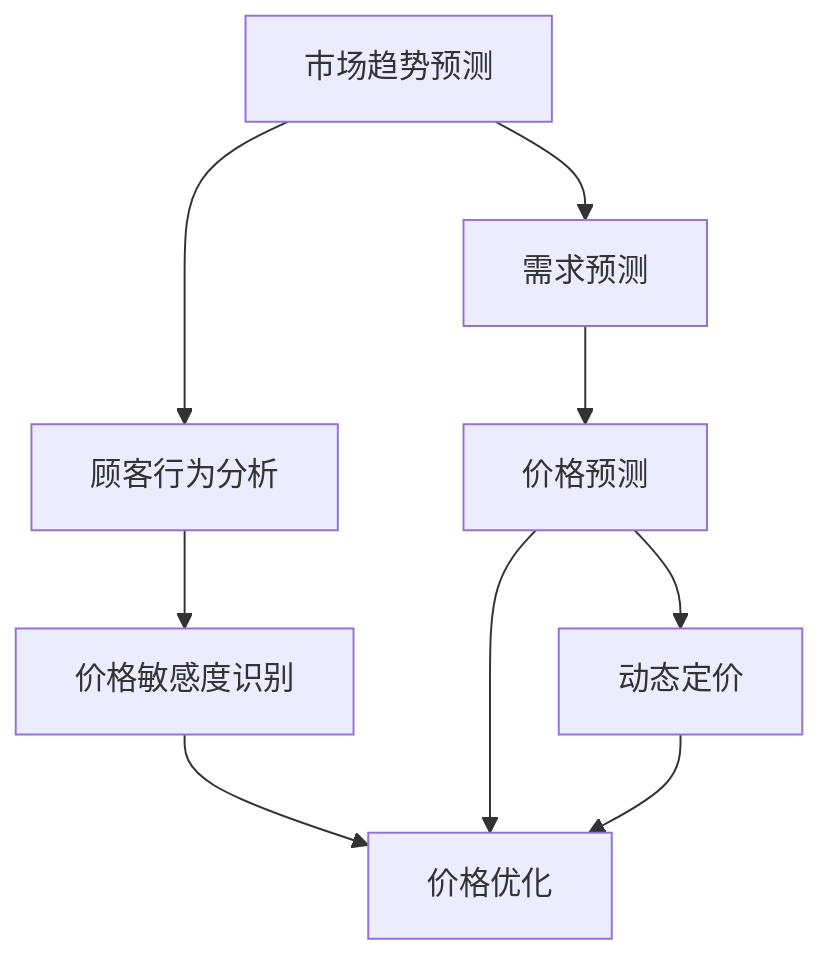

                 

# AI提升电商价格策略的实际效果

在当今激烈的市场竞争中，电商企业需要不断优化其价格策略，以吸引顾客并提升销售。人工智能（AI）技术的应用为价格策略的优化提供了新的思路和方法。本文将探讨AI在电商价格策略中的实际效果，从核心概念、算法原理、实际操作、应用场景等方面进行深入分析，并提出优化策略和未来展望。

## 1. 背景介绍

### 1.1 问题由来
随着互联网和电子商务的发展，商家面临的竞争日益加剧。价格成为吸引消费者、增加销量的重要手段。传统的价格策略基于历史销售数据和市场调研，但这种方法难以实时响应市场变化和竞争对手动态。AI技术的应用，特别是机器学习和深度学习，为电商价格策略提供了数据驱动、动态调整的能力。

### 1.2 问题核心关键点
AI在电商价格策略中的核心关键点包括：
- 预测市场趋势：通过分析历史数据和实时数据，预测市场需求和价格变化趋势。
- 动态定价：根据市场需求和竞争对手价格，动态调整产品价格，以最大化销售收益。
- 顾客行为分析：利用AI分析顾客购买行为，识别价格敏感度和购买意愿，优化价格策略。
- 多渠道协同：整合线上线下渠道数据，实现跨渠道的价格策略优化。

## 2. 核心概念与联系

### 2.1 核心概念概述

要理解AI在电商价格策略中的应用，首先需要了解以下几个核心概念：

- **机器学习（Machine Learning）**：一种利用数据和算法让计算机自动学习和改进的技术。在电商价格策略中，机器学习用于预测市场需求和价格变化。
- **深度学习（Deep Learning）**：机器学习的一种高级形式，通过多层次的非线性模型提取复杂特征。深度学习在电商价格策略中用于建立复杂的价格预测模型。
- **预测模型（Prediction Model）**：用于预测未来事件或结果的数学模型，如线性回归、决策树、神经网络等。在电商价格策略中，预测模型用于预测顾客需求、价格变化等。
- **动态定价（Dynamic Pricing）**：根据市场需求和竞争对手价格，实时调整产品价格，以最大化销售收益。动态定价是电商价格策略的核心。
- **顾客行为分析（Customer Behavior Analysis）**：通过分析顾客购买行为，识别价格敏感度和购买意愿，优化价格策略。

这些核心概念之间的联系可以通过以下Mermaid流程图来展示：



这个流程图展示了几大核心概念之间的联系：市场趋势预测和顾客行为分析是基础，用于预测需求和识别价格敏感度；价格预测和动态定价是核心，实现价格的动态调整；价格优化则是目标，通过调整价格策略，最大化销售收益。

## 3. 核心算法原理 & 具体操作步骤

### 3.1 算法原理概述

AI在电商价格策略中的应用，主要基于以下算法原理：

- **回归分析（Regression Analysis）**：用于预测连续变量（如价格）的统计方法。电商可以利用线性回归、岭回归等方法，预测产品的价格变化。
- **决策树（Decision Tree）**：一种树形结构模型，用于分类和回归分析。电商可以通过决策树模型，根据市场趋势和顾客行为，预测价格变化。
- **随机森林（Random Forest）**：一种集成学习方法，通过组合多个决策树，提高预测准确性。电商可以构建随机森林模型，综合多个因素，预测价格变化。
- **神经网络（Neural Network）**：一种模仿人脑神经网络的多层次非线性模型，用于处理复杂数据。电商可以利用深度神经网络，建立复杂的价格预测模型。
- **强化学习（Reinforcement Learning）**：一种通过奖励和惩罚机制，让模型学习最优策略的机器学习方法。电商可以通过强化学习，优化动态定价策略。

### 3.2 算法步骤详解

AI在电商价格策略中的具体操作步骤包括以下几个步骤：

**Step 1: 数据收集与预处理**
- 收集历史销售数据、市场趋势数据、顾客行为数据、竞争对手价格数据等。
- 对数据进行清洗、归一化和特征工程，构建训练数据集和测试数据集。

**Step 2: 建立预测模型**
- 选择合适的预测模型，如线性回归、决策树、随机森林、神经网络等。
- 利用训练数据集，训练预测模型，调整模型参数，优化预测效果。

**Step 3: 价格预测**
- 将实时市场数据、顾客行为数据等输入预测模型，预测未来价格变化。
- 利用预测结果，结合顾客价格敏感度等指标，制定价格策略。

**Step 4: 动态定价**
- 根据预测价格和顾客价格敏感度，制定动态定价策略。
- 实时调整产品价格，并监控价格策略的效果，适时调整。

**Step 5: 效果评估**
- 利用测试数据集，评估价格预测模型的准确性和动态定价策略的效果。
- 根据评估结果，调整模型参数和价格策略，优化价格效果。

### 3.3 算法优缺点

AI在电商价格策略中的应用，具有以下优点：
- 实时响应市场变化：AI能够实时分析市场趋势和顾客行为，快速调整价格策略。
- 准确预测价格变化：利用深度学习等先进算法，能够更准确地预测价格变化趋势。
- 优化价格策略：AI能够综合考虑多种因素，制定最优的价格策略，最大化销售收益。

同时，也存在以下缺点：
- 数据依赖：AI的预测效果依赖于数据的质量和量，需要收集和处理大量数据。
- 模型复杂度：复杂的AI模型需要较长的训练时间和较高的计算资源。
- 参数调优：需要不断调整模型参数，才能达到最佳预测效果。
- 模型解释性：AI模型的预测过程复杂，难以解释和调试。

## 4. 数学模型和公式 & 详细讲解

### 4.1 数学模型构建

假设电商销售产品，历史销售数据为 $D=\{(x_i, y_i)\}_{i=1}^N$，其中 $x_i$ 为输入特征（如时间、季节、促销等），$y_i$ 为输出（如价格）。我们需要构建一个预测模型 $f(x)$，用于预测未来的价格。

常用的数学模型包括线性回归模型和神经网络模型。

**线性回归模型**：
$$
y = \beta_0 + \beta_1x_1 + \beta_2x_2 + \cdots + \beta_nx_n + \epsilon
$$
其中 $\beta_0, \beta_1, \ldots, \beta_n$ 为模型参数，$\epsilon$ 为误差项。

**神经网络模型**：
$$
y = \sigma(W^Tz + b)
$$
其中 $z$ 为输入特征向量，$W$ 和 $b$ 为模型参数，$\sigma$ 为激活函数。

### 4.2 公式推导过程

以线性回归模型为例，推导预测公式和误差函数。

设 $x$ 为输入，$y$ 为输出，$f(x)$ 为预测模型。预测公式为：
$$
\hat{y} = f(x) = \beta_0 + \beta_1x_1 + \beta_2x_2 + \cdots + \beta_nx_n
$$
误差函数为：
$$
\ell(y, \hat{y}) = \frac{1}{2}(y - \hat{y})^2
$$
其中 $y$ 为真实价格，$\hat{y}$ 为预测价格。

利用最小二乘法，求解模型参数 $\beta_0, \beta_1, \ldots, \beta_n$：
$$
\min_{\beta_0, \beta_1, \ldots, \beta_n} \sum_{i=1}^N \ell(y_i, \hat{y}_i)
$$
利用梯度下降法，求解模型参数：
$$
\beta_j = \beta_j - \alpha \frac{\partial \ell(y, \hat{y})}{\partial \beta_j}
$$
其中 $\alpha$ 为学习率，$\frac{\partial \ell(y, \hat{y})}{\partial \beta_j}$ 为误差函数对模型参数的梯度。

### 4.3 案例分析与讲解

假设一家电商公司销售某款产品，收集了过去一年中每天的销售数据，包括日期、星期、节假日、促销活动等信息，以及对应的价格。利用这些数据，构建线性回归模型，预测未来价格变化。

模型输入特征为日期、星期、节假日和促销活动，输出为目标价格。

利用梯度下降法，训练模型，调整模型参数，优化预测效果。模型训练完成后，利用实时市场数据，预测未来价格，制定动态定价策略。

## 5. 项目实践：代码实例和详细解释说明

### 5.1 开发环境搭建

为了进行价格预测和动态定价，需要搭建Python开发环境。具体步骤如下：

1. 安装Python：下载并安装Python 3.x，建议选择3.6以上版本。
2. 安装相关库：安装Pandas、NumPy、Scikit-learn等库，用于数据处理和模型训练。
3. 安装TensorFlow或PyTorch：安装深度学习框架，用于构建神经网络模型。
4. 搭建开发环境：搭建虚拟环境，使用虚拟环境管理包，避免不同项目之间的依赖冲突。

### 5.2 源代码详细实现

以下是一个基于线性回归模型的价格预测和动态定价的Python代码示例：

```python
import pandas as pd
from sklearn.linear_model import LinearRegression
import numpy as np

# 加载历史销售数据
data = pd.read_csv('sales_data.csv')

# 将日期转换为时间序列特征
data['date'] = pd.to_datetime(data['date'])
data['weekday'] = data['date'].dt.dayofweek
data['is_holiday'] = data['date'].isin(data['holiday_list'])
data['is_promo'] = data['date'].isin(data['promo_list'])

# 选择输入特征和输出目标
X = data[['weekday', 'is_holiday', 'is_promo']]
y = data['price']

# 构建线性回归模型
model = LinearRegression()

# 训练模型
model.fit(X, y)

# 预测未来价格
future_data = pd.DataFrame({'weekday': [0, 1, 2, 3, 4, 5, 6],
                          'is_holiday': [False, False, True, False, True, False, False],
                          'is_promo': [False, True, False, False, False, True, False]})
future_price = model.predict(future_data)

# 输出预测价格
print(future_price)
```

### 5.3 代码解读与分析

这段代码实现了一个简单的线性回归模型，用于预测电商产品的价格。

首先，将历史销售数据加载到Pandas DataFrame中，将日期转换为时间序列特征，如星期和节假日。然后选择输入特征和输出目标，构建线性回归模型。

接着，利用训练数据集，训练模型，并调整模型参数，优化预测效果。模型训练完成后，利用实时市场数据，预测未来价格，并制定动态定价策略。

## 6. 实际应用场景

### 6.1 智能库存管理

利用AI进行电商价格策略优化，可以实现智能库存管理，避免库存积压或缺货。通过实时分析市场需求和价格变化，动态调整价格和库存，优化库存水平，减少库存成本。

### 6.2 个性化推荐

AI可以通过分析顾客行为和购买历史，识别价格敏感度和购买意愿，制定个性化的价格策略。例如，对于价格敏感度高的顾客，可以提供优惠券或折扣，以提高销售额。

### 6.3 交叉销售和搭配销售

利用AI进行价格策略优化，可以实现交叉销售和搭配销售。例如，对于经常购买某类商品的顾客，可以推荐相关的搭配商品，并提供折扣优惠，提高销售量和平均订单价值。

### 6.4 未来应用展望

随着AI技术的发展，未来电商价格策略优化将具备更强的实时性、动态性和个性化。AI可以结合更多数据源和模型，提高预测准确性和策略优化效果。同时，AI技术将进一步扩展到供应链管理、物流优化等领域，提升整体运营效率。

## 7. 工具和资源推荐

### 7.1 学习资源推荐

为了深入学习AI在电商价格策略中的应用，推荐以下学习资源：

1. 《Python数据分析与数据可视化》：介绍Python数据分析的基本方法和技巧，涵盖数据处理、可视化等。
2. 《机器学习实战》：实战性很强的机器学习入门书籍，涵盖线性回归、决策树、随机森林等算法。
3. 《深度学习入门》：介绍深度学习的基本原理和实践技巧，涵盖神经网络、卷积神经网络、循环神经网络等。
4. 《TensorFlow实战》：介绍TensorFlow的基本使用方法和实践技巧，涵盖深度学习模型的构建和训练。

### 7.2 开发工具推荐

为了高效开发AI价格策略优化系统，推荐以下开发工具：

1. Jupyter Notebook：用于编写和运行Python代码，支持代码块、可视化图表等。
2. VS Code：跨平台的IDE，支持代码高亮、调试、版本控制等功能。
3. Git：版本控制工具，方便代码版本管理和团队协作。

### 7.3 相关论文推荐

为了了解AI在电商价格策略中的最新研究成果，推荐以下相关论文：

1. "Dynamic Pricing in Online Marketplaces"（JPMR 2018）：介绍电商动态定价的基本原理和实践方法。
2. "Deep Learning for Dynamic Pricing: A Comprehensive Survey"（TOMACS 2020）：综述了深度学习在电商动态定价中的应用。
3. "AI-based Dynamic Pricing Strategies in E-Commerce"（IEEE TNS 2021）：介绍AI技术在电商动态定价中的应用，涵盖线性回归、深度学习等方法。

## 8. 总结：未来发展趋势与挑战

### 8.1 研究成果总结

AI在电商价格策略中的应用，已经取得了显著的成效。通过预测市场需求、动态调整价格和优化价格策略，电商企业能够提高销售额、提升顾客满意度，并降低库存成本。

### 8.2 未来发展趋势

未来，AI在电商价格策略中的应用将具备更强的实时性、动态性和个性化。随着数据量和计算资源的增加，深度学习等高级算法将逐渐取代传统的线性回归等方法，提高预测准确性和策略优化效果。同时，AI将结合更多数据源和模型，实现更全面、更深入的价格策略优化。

### 8.3 面临的挑战

尽管AI在电商价格策略中的应用已经取得了一定的成效，但仍面临一些挑战：

1. 数据获取和处理：获取高质量的数据是AI应用的前提，需要耗费大量时间和人力进行数据收集和清洗。
2. 模型复杂度：高级算法如深度学习模型需要较长的训练时间和较高的计算资源，难以快速部署。
3. 参数调优：模型参数的选择和调整需要丰富的经验和专业知识，难以自动化和优化。
4. 模型解释性：复杂模型的预测过程难以解释和调试，难以获得顾客和市场的信任。

### 8.4 研究展望

未来，AI在电商价格策略中的应用，需要进一步优化数据获取和处理流程，提高模型训练效率和参数调优自动化，提升模型的解释性和透明度。同时，AI技术将进一步扩展到供应链管理、物流优化等领域，提升整体运营效率。

## 9. 附录：常见问题与解答

**Q1：AI在电商价格策略中的应用是否适用于所有电商企业？**

A: AI在电商价格策略中的应用，适用于数据充足、计算资源丰富的电商企业。对于小规模企业，由于数据量有限，难以获得理想的预测效果。

**Q2：如何选择合适的价格预测模型？**

A: 根据数据类型和任务需求，选择合适的价格预测模型。例如，对于连续变量预测，可以选择线性回归、岭回归等方法；对于分类预测，可以选择决策树、随机森林等方法。

**Q3：如何优化动态定价策略？**

A: 结合实时市场数据和顾客行为分析，动态调整价格策略。利用强化学习等方法，优化价格策略，实现最大化销售收益。

**Q4：AI价格策略优化是否需要大量数据？**

A: AI价格策略优化需要大量的历史数据和实时数据。数据质量高、量大的企业，可以取得更好的预测效果和策略优化效果。

**Q5：如何评估价格预测模型的效果？**

A: 利用测试数据集，评估价格预测模型的准确性和鲁棒性。结合实际业务需求，评估模型效果，不断优化预测模型和价格策略。

总之，AI在电商价格策略中的应用，具有显著的实际效果，能够提升电商企业的运营效率和竞争力。未来，随着AI技术的发展和应用普及，更多电商企业将受益于AI带来的价格策略优化。

---

作者：禅与计算机程序设计艺术 / Zen and the Art of Computer Programming

