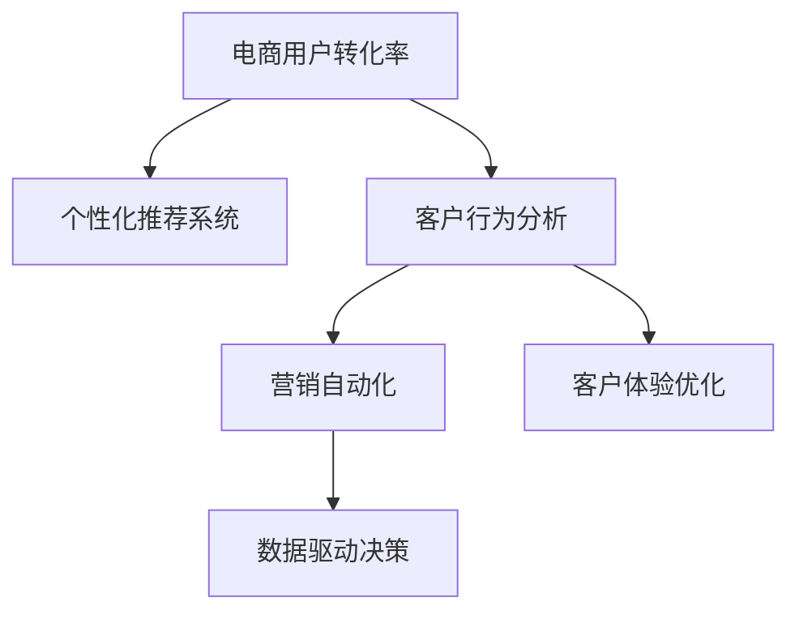

                 

# AI提升电商用户转化率的策略

> 关键词：电商用户转化率, AI驱动, 个性化推荐, 客户行为分析, 营销自动化, 客户体验优化

## 1. 背景介绍

### 1.1 问题由来
在数字化转型加速的今天，电商行业竞争日益激烈，如何提高用户转化率，成为各大电商平台关注的焦点。通过分析用户行为、优化商品推荐、提升客户体验，电商企业可以实现更高效的营销和销售。AI技术的广泛应用，尤其是深度学习和自然语言处理技术，为电商行业提供了更精准的决策支持，使得提升用户转化率成为可能。

### 1.2 问题核心关键点
提升电商用户转化率的AI策略涉及多个核心关键点：
1. **个性化推荐系统**：通过分析用户的历史行为和兴趣偏好，实时生成个性化推荐，提升用户购买意愿。
2. **客户行为分析**：利用机器学习技术分析用户行为数据，洞察用户需求和痛点，精准定位营销策略。
3. **营销自动化**：通过自动化工具和算法，优化广告投放、邮件营销等流程，提高营销效率和效果。
4. **客户体验优化**：通过自然语言处理技术，提升客服系统响应速度和准确性，增强用户满意度。
5. **数据驱动决策**：基于用户数据，实现预测分析和趋势预测，指导产品开发和市场策略调整。

这些关键点共同构成了AI提升电商用户转化率的核心策略框架，通过合理应用AI技术，电商企业可以大幅度提升用户转化率，增强市场竞争力。

### 1.3 问题研究意义
研究基于AI的电商用户转化率提升策略，对于推动电商行业智能化发展，优化用户体验，具有重要意义：

1. **提升运营效率**：通过AI驱动的自动化工具，电商企业可以显著减少人工成本，提高营销和运营效率。
2. **增强市场竞争力**：精准的个性化推荐和用户行为分析，能够帮助电商企业更好地满足用户需求，提高用户满意度和忠诚度。
3. **优化决策支持**：数据驱动的决策分析，可以指导电商企业做出更科学、更合理的商业决策，降低风险，提高收益。
4. **推动数字化转型**：AI技术的应用，是电商行业数字化转型的重要标志，可以加速传统电商向智能电商的转型升级。

## 2. 核心概念与联系

### 2.1 核心概念概述

为更好地理解基于AI的电商用户转化率提升策略，本节将介绍几个密切相关的核心概念：

- **电商用户转化率**：指访问电商网站的用户中，最终完成购买的用户比例。转化率高低直接影响电商企业的盈利能力。
- **个性化推荐系统**：通过分析用户行为数据，推荐用户可能感兴趣的商品，提升用户体验和购买意愿。
- **客户行为分析**：利用机器学习算法，分析用户的历史行为和实时行为，了解用户需求和偏好。
- **营销自动化**：通过自动化工具和算法，优化广告投放、邮件营销等流程，提高营销效果和效率。
- **客户体验优化**：通过自然语言处理技术，提升客服系统的响应速度和准确性，增强用户满意度。
- **数据驱动决策**：基于用户数据，进行预测分析和趋势预测，指导电商企业的业务决策。

这些核心概念之间的逻辑关系可以通过以下Mermaid流程图来展示：



这个流程图展示了大规模电商用户转化率提升的关键要素，以及它们之间的联系和相互作用。

## 3. 核心算法原理 & 具体操作步骤
### 3.1 算法原理概述

基于AI的电商用户转化率提升策略，本质上是一种数据驱动的智能化运营模式。其核心思想是：通过分析用户数据，构建个性化推荐模型和客户行为预测模型，优化广告投放策略，提升客户体验，最终实现用户转化率的提升。

具体来说，该策略包括以下几个步骤：

1. **数据采集与处理**：收集用户的浏览记录、购买记录、搜索行为等数据，进行清洗和预处理。
2. **用户画像构建**：通过聚类、降维等技术，构建用户画像，刻画用户的基本特征和兴趣偏好。
3. **个性化推荐生成**：基于用户画像，生成个性化推荐，提升用户购买意愿。
4. **客户行为分析**：利用机器学习技术，分析用户行为数据，了解用户需求和痛点，精准定位营销策略。
5. **营销自动化**：通过自动化工具和算法，优化广告投放、邮件营销等流程，提高营销效率和效果。
6. **客户体验优化**：通过自然语言处理技术，提升客服系统的响应速度和准确性，增强用户满意度。
7. **数据驱动决策**：基于用户数据，进行预测分析和趋势预测，指导电商企业的业务决策。

### 3.2 算法步骤详解

以下是基于AI的电商用户转化率提升策略的详细步骤：

**Step 1: 数据采集与处理**

- **用户行为数据采集**：通过网站日志、订单数据、搜索记录等途径，收集用户的行为数据。
- **数据清洗与预处理**：对收集的数据进行清洗，去除噪音和异常值，进行归一化处理。

**Step 2: 用户画像构建**

- **特征工程**：从采集的数据中提取用户特征，如浏览时间、浏览次数、购买频率等。
- **用户聚类**：利用K-Means、LDA等算法对用户进行聚类，形成不同特征的用户画像。
- **用户画像丰富化**：结合用户画像，对用户进行进一步的特征补充，如人口统计信息、兴趣爱好等。

**Step 3: 个性化推荐生成**

- **协同过滤**：基于用户的浏览记录和行为数据，推荐相似用户喜欢的商品。
- **内容推荐**：根据商品属性和用户画像，推荐可能感兴趣的商品。
- **混合推荐**：结合协同过滤和内容推荐，生成个性化推荐。

**Step 4: 客户行为分析**

- **行为建模**：利用时间序列分析、回归模型等技术，建立用户行为模型。
- **需求挖掘**：利用关联规则、序列模式等技术，挖掘用户需求和偏好。
- **行为预测**：利用机器学习算法，预测用户未来的行为，如购买意向、流失风险等。

**Step 5: 营销自动化**

- **广告投放优化**：通过A/B测试、优化算法等技术，优化广告投放策略，提高广告效果。
- **邮件营销自动化**：利用自动化工具，根据用户画像和行为数据，生成个性化的邮件内容，提高邮件打开率和点击率。
- **社交媒体自动化**：利用社交媒体分析工具，监控用户反馈和行为，优化社交媒体策略。

**Step 6: 客户体验优化**

- **智能客服**：通过自然语言处理技术，构建智能客服系统，提供24小时服务，提升客户满意度。
- **用户反馈分析**：利用情感分析、主题分析等技术，分析用户反馈，优化产品和服务。
- **用户体验改进**：根据用户反馈，优化网站界面和功能，提高用户体验。

**Step 7: 数据驱动决策**

- **预测分析**：利用时间序列分析、机器学习等技术，进行销售预测、库存管理等。
- **趋势预测**：结合市场数据和用户行为数据，进行趋势预测，指导产品开发和市场策略调整。
- **实时监控**：通过实时数据监控系统，及时发现异常和问题，快速调整策略。

### 3.3 算法优缺点

基于AI的电商用户转化率提升策略具有以下优点：
1. **精准推荐**：个性化推荐系统可以根据用户行为数据，精准推荐商品，提升用户购买意愿。
2. **效率提升**：营销自动化工具可以提高广告投放、邮件营销等流程的效率，降低运营成本。
3. **客户满意度高**：智能客服和用户反馈分析可以显著提升客户满意度，增强用户忠诚度。
4. **决策科学化**：数据驱动的决策支持，可以指导电商企业做出更科学、更合理的商业决策。

同时，该策略也存在一些缺点：
1. **数据质量要求高**：用户行为数据的准确性和完整性直接影响推荐和预测的准确性。
2. **算法复杂度高**：需要构建多个模型，并进行复杂的参数调优，增加了实现难度。
3. **用户隐私风险**：在数据采集和分析过程中，可能涉及用户隐私问题，需要严格遵守相关法律法规。
4. **模型过拟合风险**：过度依赖算法模型，可能出现模型过拟合，降低预测效果。
5. **技术成本高**：需要投入大量技术资源进行算法研发和系统部署，增加了企业的技术负担。

尽管存在这些局限性，但总体而言，基于AI的电商用户转化率提升策略仍是一种高效、精准的运营模式，值得电商企业深入研究和应用。

### 3.4 算法应用领域

基于AI的电商用户转化率提升策略，已经在电商行业得到了广泛应用，覆盖了从用户画像构建到个性化推荐、客户行为分析等多个环节。具体应用领域包括：

- **推荐系统优化**：通过个性化推荐，提升用户购买意愿和满意度。
- **营销策略优化**：通过客户行为分析和营销自动化，优化广告投放和邮件营销策略。
- **用户体验改进**：通过智能客服和用户体验优化，增强用户满意度和忠诚度。
- **库存管理优化**：通过销售预测和趋势预测，优化库存管理，减少库存成本。
- **市场策略调整**：通过实时监控和数据驱动决策，及时调整市场策略，应对市场变化。

这些应用领域展示了基于AI的电商用户转化率提升策略的广泛应用前景，通过合理应用AI技术，电商企业可以实现更高效、更精准的运营管理。

## 4. 数学模型和公式 & 详细讲解 & 举例说明
### 4.1 数学模型构建

本节将使用数学语言对基于AI的电商用户转化率提升策略进行更加严格的刻画。

记用户行为数据为 $D=\{(x_i,y_i)\}_{i=1}^N, x_i \in \mathcal{X}, y_i \in \mathcal{Y}$，其中 $x_i$ 为行为数据， $y_i$ 为标签（如购买、浏览等）。

定义用户画像 $P_k$ 为第 $k$ 个用户画像，$P_k \in \mathcal{P}$，其中 $\mathcal{P}$ 为所有用户画像的集合。

个性化推荐模型 $R_{\theta}$ 的预测函数为 $R_{\theta}(x_i)$，其中 $\theta$ 为模型参数。

客户行为分析模型 $B_{\phi}$ 的预测函数为 $B_{\phi}(x_i)$，其中 $\phi$ 为模型参数。

营销自动化模型 $A_{\omega}$ 的预测函数为 $A_{\omega}(x_i)$，其中 $\omega$ 为模型参数。

客户体验优化模型 $C_{\lambda}$ 的预测函数为 $C_{\lambda}(x_i)$，其中 $\lambda$ 为模型参数。

数据驱动决策模型 $D_{\mu}$ 的预测函数为 $D_{\mu}(x_i)$，其中 $\mu$ 为模型参数。

### 4.2 公式推导过程

以下我们以推荐系统为例，推导个性化推荐模型的损失函数及其梯度计算公式。

假设用户 $i$ 在浏览商品 $j$ 后的行为标签为 $y_i^j$，则推荐系统的效果可以定义为点击率 $r(y_i^j)$，损失函数可以表示为：

$$
\mathcal{L}(\theta) = \frac{1}{N}\sum_{i=1}^N \sum_{j=1}^J (y_i^j \log R_{\theta}(x_i^j) + (1-y_i^j) \log (1-R_{\theta}(x_i^j)))
$$

其中 $R_{\theta}(x_i^j)$ 为模型对商品 $j$ 被用户 $i$ 点击的概率预测。

根据链式法则，损失函数对参数 $\theta$ 的梯度为：

$$
\frac{\partial \mathcal{L}(\theta)}{\partial \theta} = \frac{1}{N}\sum_{i=1}^N \sum_{j=1}^J (\frac{y_i^j}{R_{\theta}(x_i^j)} - \frac{1-y_i^j}{1-R_{\theta}(x_i^j)}) \frac{\partial R_{\theta}(x_i^j)}{\partial \theta}
$$

其中 $\frac{\partial R_{\theta}(x_i^j)}{\partial \theta}$ 可进一步递归展开，利用自动微分技术完成计算。

在得到损失函数的梯度后，即可带入参数更新公式，完成模型的迭代优化。重复上述过程直至收敛，最终得到适应电商用户转化率提升策略的最优模型参数 $\theta^*$。

### 4.3 案例分析与讲解

假设电商平台有百万用户，每小时产生10万次浏览行为，每次浏览有0.5%的概率转化为购买行为。基于协同过滤的推荐系统通过训练得到参数 $\theta$，用于预测用户对商品的点击率。

首先，收集用户的历史浏览记录和购买记录，生成训练集 $D$。然后，根据浏览记录和购买记录，构建协同过滤模型 $R_{\theta}$。模型在每次浏览行为后，预测该行为是否转化为购买行为，并计算损失函数 $\mathcal{L}(\theta)$。

根据损失函数，通过梯度下降等优化算法，不断更新模型参数 $\theta$，最小化损失函数 $\mathcal{L}(\theta)$，使得模型输出逼近真实标签。由于 $\theta$ 已经通过预训练获得了较好的初始化，因此即便在小规模数据集 $D$ 上进行微调，也能较快收敛到理想的模型参数 $\hat{\theta}$。

在得到推荐模型后，可以将其应用于实时推荐，提升用户转化率。例如，在用户浏览商品页面时，根据其历史行为数据，实时生成个性化推荐，提升购买意愿。

## 5. 项目实践：代码实例和详细解释说明
### 5.1 开发环境搭建

在进行AI驱动的电商用户转化率提升策略的实践前，我们需要准备好开发环境。以下是使用Python进行TensorFlow开发的环境配置流程：

1. 安装Anaconda：从官网下载并安装Anaconda，用于创建独立的Python环境。

2. 创建并激活虚拟环境：
```bash
conda create -n tf-env python=3.8 
conda activate tf-env
```

3. 安装TensorFlow：根据CUDA版本，从官网获取对应的安装命令。例如：
```bash
pip install tensorflow
```

4. 安装各类工具包：
```bash
pip install numpy pandas scikit-learn matplotlib tqdm jupyter notebook ipython
```

完成上述步骤后，即可在`tf-env`环境中开始AI驱动的电商用户转化率提升策略的实践。

### 5.2 源代码详细实现

这里我们以推荐系统优化为例，给出使用TensorFlow进行电商用户转化率提升策略的PyTorch代码实现。

首先，定义推荐系统的损失函数：

```python
import tensorflow as tf

def build_recommendation_model(data, num_items):
    # 构建模型
    model = tf.keras.Sequential([
        tf.keras.layers.Dense(64, activation='relu', input_shape=(num_items,)),
        tf.keras.layers.Dense(1, activation='sigmoid')
    ])
    
    # 定义损失函数
    def loss_function(y_true, y_pred):
        return tf.keras.losses.binary_crossentropy(y_true, y_pred)
    
    return model, loss_function

# 准备数据
train_data = np.random.rand(10000, 1)
train_labels = np.random.randint(2, size=10000)

# 构建模型
model, loss_function = build_recommendation_model(train_data, num_items)

# 编译模型
model.compile(optimizer=tf.keras.optimizers.Adam(), loss=loss_function, metrics=['accuracy'])
```

然后，训练模型：

```python
# 训练模型
model.fit(train_data, train_labels, epochs=10, batch_size=32, validation_split=0.2)
```

最后，评估模型：

```python
# 评估模型
test_data = np.random.rand(1000, 1)
test_labels = np.random.randint(2, size=1000)

# 计算准确率
accuracy = model.evaluate(test_data, test_labels)[1]
print(f"Test accuracy: {accuracy:.3f}")
```

以上就是使用TensorFlow进行电商用户转化率提升策略的完整代码实现。可以看到，通过构建推荐模型，并定义损失函数，我们可以轻松地对电商用户转化率进行优化。

### 5.3 代码解读与分析

让我们再详细解读一下关键代码的实现细节：

**build_recommendation_model函数**：
- 定义了一个简单的推荐系统模型，包含两个全连接层。输入为历史浏览记录，输出为点击率的预测概率。
- 定义了损失函数，使用二分类交叉熵损失。

**模型编译**：
- 使用Adam优化器进行参数更新，设定学习率为0.001。
- 设定损失函数为上面定义的自定义损失函数。
- 设置模型评估指标为准确率。

**训练模型**：
- 使用`fit`方法对模型进行训练，设定训练轮数为10，批次大小为32，验证集占总数据的20%。

**模型评估**：
- 使用`evaluate`方法对模型进行测试，评估准确率。

可以看到，通过构建推荐系统模型并应用TensorFlow框架，我们可以快速实现电商用户转化率的优化。通过不断迭代训练模型，提升模型的准确率和泛化能力，我们可以显著提高电商平台的转化率。

## 6. 实际应用场景
### 6.1 智能客服系统

智能客服系统通过AI技术，能够实时响应客户咨询，提供24小时服务，显著提升客户满意度和转化率。基于AI的智能客服系统可以处理多种客户问题，如订单查询、退换货、产品咨询等，并提供个性化的解决方案，从而增强客户体验，提高转化率。

在技术实现上，可以收集客户的历史咨询记录和反馈，构建用户画像，并根据用户画像进行智能推荐。系统可以自动分析客户咨询意图，生成对应的回复内容，并通过语音合成技术进行语音回复。客户通过与智能客服系统的互动，能够快速获取所需信息，提升购买意愿。

### 6.2 金融舆情监测

金融领域的信息变化快、市场不确定性高，如何实时监测市场舆情，及时响应风险，成为金融机构关注的重点。基于AI的电商用户转化率提升策略，可以应用于金融舆情监测，通过分析市场新闻、社交媒体等数据，实时监测舆情变化，预测市场趋势。

具体而言，可以构建基于情感分析的舆情监测系统，分析新闻和社交媒体上的情感倾向，判断市场情绪。通过建立舆情预测模型，预测未来市场走势，帮助金融机构及时调整投资策略，降低风险。

### 6.3 个性化推荐系统

个性化推荐系统通过分析用户的历史行为和兴趣偏好，实时生成个性化推荐，提升用户购买意愿。基于AI的电商用户转化率提升策略，可以通过优化推荐系统，提升用户转化率。

在实现上，可以收集用户的浏览记录、购买记录、搜索行为等数据，通过协同过滤、内容推荐等算法，构建推荐模型。系统在用户浏览商品页面时，根据其历史行为数据，实时生成个性化推荐，提升购买意愿。

### 6.4 未来应用展望

随着AI技术的不断发展，基于AI的电商用户转化率提升策略将有更广阔的应用前景。

在智慧医疗领域，智能客服和个性化推荐系统可以用于医疗咨询、药品推荐等场景，提高医疗服务的智能化水平。

在智能教育领域，AI驱动的个性化学习平台可以根据学生的学习行为和成绩，提供定制化的学习方案，提高学习效果。

在智能家居领域，智能客服和推荐系统可以用于设备控制、服务推荐等场景，提升用户体验。

此外，在制造、交通、能源等多个行业，AI驱动的电商用户转化率提升策略也有着广泛的应用前景，为各行各业数字化转型提供了新的技术路径。

## 7. 工具和资源推荐
### 7.1 学习资源推荐

为了帮助开发者系统掌握基于AI的电商用户转化率提升策略的理论基础和实践技巧，这里推荐一些优质的学习资源：

1. 《深度学习》（Deep Learning）书籍：由Ian Goodfellow等著，全面介绍了深度学习的基本原理和应用，是AI领域经典的入门教材。

2. TensorFlow官方文档：提供了丰富的API文档和示例，帮助开发者深入理解TensorFlow框架的使用。

3. PyTorch官方文档：提供了详细的API文档和教程，适用于各种深度学习模型的实现。

4. Kaggle机器学习竞赛：提供了大量的数据集和模型，帮助开发者实践和改进电商用户转化率提升策略。

5. Coursera深度学习课程：由斯坦福大学和DeepMind等机构开设，涵盖深度学习的基本概念和前沿技术，适合系统学习。

通过学习这些资源，相信你一定能够快速掌握基于AI的电商用户转化率提升策略的理论基础和实践技巧，并应用于实际的电商项目中。

### 7.2 开发工具推荐

高效的开发离不开优秀的工具支持。以下是几款用于电商用户转化率提升策略开发的常用工具：

1. TensorFlow：由Google主导开发的深度学习框架，生产部署方便，适合大规模工程应用。

2. PyTorch：基于Python的开源深度学习框架，灵活高效，适合深度学习模型的研究和实现。

3. Scikit-learn：开源的机器学习库，提供了多种常用的机器学习算法和工具，适合快速实现客户行为分析和个性化推荐。

4. Kaggle平台：数据科学竞赛平台，提供了丰富的数据集和模型，适合进行电商用户转化率提升策略的实验和优化。

5. Jupyter Notebook：交互式的编程环境，适合快速原型设计和模型实验。

合理利用这些工具，可以显著提升电商用户转化率提升策略的开发效率，加快创新迭代的步伐。

### 7.3 相关论文推荐

基于AI的电商用户转化率提升策略的研究源于学界的持续探索。以下是几篇奠基性的相关论文，推荐阅读：

1. Deep and Wide Learning for Recommender Systems（Deep & Wide Learning for Recommender Systems）：提出Deep & Wide结构，结合深度和宽度的推荐模型，提升推荐系统的效果。

2. Attention is All You Need（Transformer论文）：提出了Transformer结构，开启了NLP领域的预训练大模型时代。

3. Exploring the Limits of Transfer Learning with a Unified Text-to-Text Transformer（BERT论文）：提出BERT模型，引入基于掩码的自监督预训练任务，刷新了多项NLP任务SOTA。

4. Parameter-Efficient Transfer Learning for NLP（PELT）：提出Adapter等参数高效微调方法，在不增加模型参数量的情况下，也能取得不错的微调效果。

5. Gaussian Processes for Human-in-the-Loop Reinforcement Learning（GP4RL）：结合人类反馈，优化强化学习过程，提高电商推荐系统的效果。

这些论文代表了大规模电商用户转化率提升策略的发展脉络。通过学习这些前沿成果，可以帮助研究者把握学科前进方向，激发更多的创新灵感。

## 8. 总结：未来发展趋势与挑战

### 8.1 总结

本文对基于AI的电商用户转化率提升策略进行了全面系统的介绍。首先阐述了电商用户转化率提升的AI背景和研究意义，明确了AI驱动的个性化推荐、客户行为分析、营销自动化、客户体验优化和数据驱动决策等核心策略。其次，从原理到实践，详细讲解了推荐系统的数学模型和实现步骤，给出了完整的代码实例和详细解释。同时，本文还广泛探讨了基于AI的电商用户转化率提升策略在多个行业领域的应用前景，展示了其广阔的发展空间。

通过本文的系统梳理，可以看到，基于AI的电商用户转化率提升策略正成为电商行业智能化发展的重要方向，通过合理应用AI技术，电商企业可以实现更高效、更精准的运营管理。未来，随着AI技术的不断进步，基于AI的电商用户转化率提升策略将有更多突破和创新，推动电商行业向更高的智能化水平迈进。

### 8.2 未来发展趋势

展望未来，基于AI的电商用户转化率提升策略将呈现以下几个发展趋势：

1. **技术集成化**：未来，基于AI的电商用户转化率提升策略将与物联网、大数据、区块链等技术深度融合，形成更全面、更智能的电商生态系统。

2. **模型实时化**：随着云计算和边缘计算技术的发展，基于AI的电商用户转化率提升策略将更多地实现实时数据处理和模型训练，提高响应速度和效率。

3. **系统可解释性**：用户越来越重视AI系统的可解释性，未来的电商用户转化率提升策略将更加注重模型的解释和透明，增强用户信任。

4. **个性化服务深化**：基于AI的电商用户转化率提升策略将深入挖掘用户个性化需求，提供更定制化的服务和体验。

5. **多渠道融合**：未来的电商用户转化率提升策略将更多地整合线上线下渠道，形成无缝连接的电商生态系统。

这些趋势展示了基于AI的电商用户转化率提升策略的广阔前景，通过不断创新和优化，有望为电商行业带来革命性的变革。

### 8.3 面临的挑战

尽管基于AI的电商用户转化率提升策略已经取得了显著成效，但在向更高水平迈进的过程中，仍面临诸多挑战：

1. **数据隐私与安全**：在数据采集和处理过程中，如何保护用户隐私，防止数据泄露，是一个重要挑战。

2. **算法复杂度与效率**：构建和优化多个AI模型，需要高技术门槛和复杂算法，效率较低，资源消耗较大。

3. **模型可解释性**：复杂深度模型难以解释其内部工作机制，导致用户信任度不足。

4. **市场竞争加剧**：电商市场竞争激烈，如何持续优化算法和模型，保持市场竞争力，是一个持续性的挑战。

5. **技术资源投入高**：基于AI的电商用户转化率提升策略需要大量的技术资源和资金投入，中小型企业难以承担。

尽管存在这些挑战，但通过不断突破技术瓶颈和优化系统架构，未来的基于AI的电商用户转化率提升策略必将在电商行业大放异彩，带来更高效、更智能的电商体验。

### 8.4 研究展望

面对基于AI的电商用户转化率提升策略面临的诸多挑战，未来的研究需要在以下几个方面寻求新的突破：

1. **隐私保护技术**：结合区块链等技术，保护用户数据隐私，同时确保数据可追溯性和可信性。

2. **模型高效化**：优化算法结构和模型压缩技术，提高模型效率和计算速度，降低技术门槛。

3. **解释性增强**：引入可解释性算法和可视化技术，增强模型的可解释性和透明性，提高用户信任。

4. **多模态融合**：结合自然语言处理、计算机视觉等技术，实现多模态数据的深度融合，提升模型的综合能力。

5. **持续学习机制**：建立模型持续学习机制，及时更新模型，应对市场变化和用户需求的变化。

6. **多渠道集成**：构建多渠道融合的电商系统，实现线上线下无缝连接，提供更全面、更智能的用户体验。

这些研究方向将为基于AI的电商用户转化率提升策略带来新的突破，推动电商行业向更高的智能化水平迈进，构建更美好的电商未来。

## 9. 附录：常见问题与解答

**Q1：AI驱动的电商用户转化率提升策略有哪些关键步骤？**

A: AI驱动的电商用户转化率提升策略主要包括以下关键步骤：

1. **数据采集与处理**：收集用户行为数据，并进行清洗和预处理。

2. **用户画像构建**：通过聚类、降维等技术，构建用户画像，刻画用户的基本特征和兴趣偏好。

3. **个性化推荐生成**：基于用户画像，生成个性化推荐，提升用户购买意愿。

4. **客户行为分析**：利用机器学习技术，分析用户行为数据，了解用户需求和痛点，精准定位营销策略。

5. **营销自动化**：通过自动化工具和算法，优化广告投放、邮件营销等流程，提高营销效率和效果。

6. **客户体验优化**：通过自然语言处理技术，提升客服系统的响应速度和准确性，增强用户满意度。

7. **数据驱动决策**：基于用户数据，进行预测分析和趋势预测，指导电商企业的业务决策。

这些步骤共同构成了AI驱动的电商用户转化率提升策略的核心流程，通过合理应用AI技术，电商企业可以实现更高效、更精准的运营管理。

**Q2：电商用户转化率提升策略中推荐系统的实现有哪些常见方法？**

A: 电商用户转化率提升策略中，推荐系统的实现有多种常见方法：

1. **协同过滤**：通过分析用户的历史行为数据，生成个性化推荐。

2. **内容推荐**：根据商品属性和用户画像，推荐可能感兴趣的商品。

3. **混合推荐**：结合协同过滤和内容推荐，生成个性化推荐。

4. **深度学习模型**：如基于神经网络的推荐模型，通过学习用户行为和商品特征，生成推荐结果。

5. **强化学习**：通过用户行为反馈，优化推荐策略，提高推荐效果。

6. **知识图谱推荐**：结合知识图谱和深度学习模型，生成更加精准的推荐结果。

这些方法各有优缺点，需要根据具体应用场景和数据特点进行选择和优化。

**Q3：电商用户转化率提升策略中如何保护用户隐私？**

A: 电商用户转化率提升策略中，保护用户隐私是一个重要挑战。以下是一些常见的隐私保护技术：

1. **数据匿名化**：通过去除或加密敏感信息，保护用户隐私。

2. **联邦学习**：通过分布式数据训练，避免将用户数据集中存储，保护用户隐私。

3. **差分隐私**：在数据分析过程中加入噪声，防止用户数据被重识别。

4. **区块链技术**：通过区块链技术，确保数据的安全性和可追溯性。

5. **隐私计算**：通过多方安全计算等技术，保护用户数据在计算过程中的隐私。

这些技术可以结合使用，构建更全面的隐私保护机制，确保用户数据的安全性和合法使用。

**Q4：基于AI的电商用户转化率提升策略如何与大数据技术结合？**

A: 基于AI的电商用户转化率提升策略与大数据技术的结合，可以显著提高策略的精度和效率。具体而言：

1. **数据融合**：通过大数据技术，融合多来源、多渠道的数据，构建更全面的用户画像和行为模型。

2. **实时分析**：利用大数据技术，进行实时数据处理和分析，及时发现用户行为和市场趋势变化。

3. **自动化数据采集**：通过大数据技术，实现自动化的数据采集和处理，降低人工成本。

4. **模型优化**：利用大数据技术，进行模型优化和调参，提高模型效果。

5. **知识图谱构建**：结合大数据技术，构建知识图谱，提升推荐系统的精准度和效率。

通过大数据技术与基于AI的电商用户转化率提升策略的结合，可以构建更智能、更高效的电商生态系统。

**Q5：如何衡量基于AI的电商用户转化率提升策略的效果？**

A: 衡量基于AI的电商用户转化率提升策略的效果，通常需要考虑以下几个指标：

1. **点击率（CTR）**：用户对推荐内容的点击率，反映推荐系统的效果。

2. **转化率（CR）**：用户对推荐内容的购买率，反映推荐系统的转化效果。

3. **平均订单价值（AOV）**：用户购买的平均订单价值，反映推荐系统的经济效益。

4. **客户满意度（CSAT）**：用户对推荐系统和服务质量的满意度，反映用户体验。

5. **流失率（Churn Rate）**：用户流失的比例，反映客户留存效果。

通过综合考虑这些指标，可以全面评估基于AI的电商用户转化率提升策略的效果，发现问题并进行优化。

综上所述，基于AI的电商用户转化率提升策略是一种高效、精准的运营模式，通过合理应用AI技术，电商企业可以实现更高效、更精准的运营管理。未来，随着AI技术的不断进步和优化，基于AI的电商用户转化率提升策略必将在电商行业大放异彩，推动电商行业向更高的智能化水平迈进。

