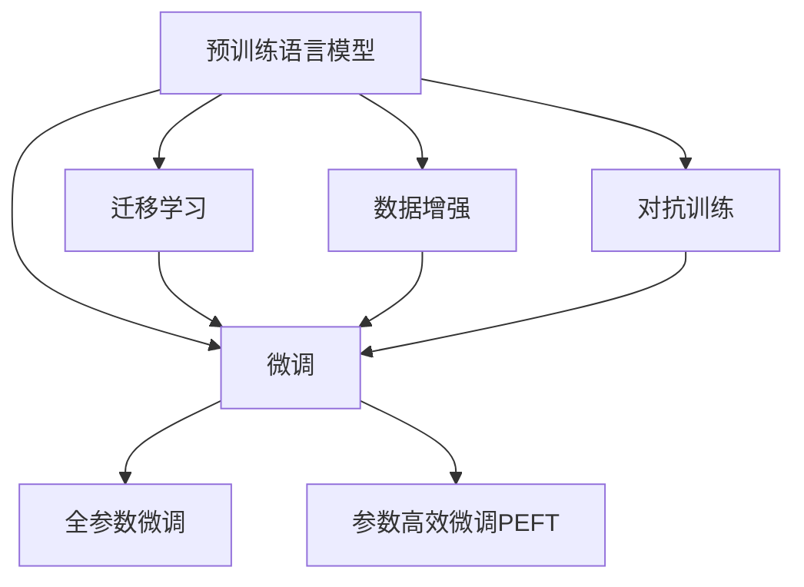

                 

## 1. 背景介绍

随着人工智能技术的不断突破，自然语言处理（NLP）已从实验室中的前沿课题逐渐成为产业界关注的焦点。从智能客服到金融舆情，从智能推荐到机器翻译，NLP技术的应用范围日益广泛，潜藏着巨大的市场价值和社会效益。在AI时代，NLP技术的突破性进展和产业化的深度融合，正逐渐重塑人类的沟通方式和业务流程。

### 1.1 问题由来
NLP领域的突破始于深度学习技术，尤其是自2014年以来，深度神经网络（DNN）在NLP任务上取得了前所未有的成功。从早期的Word2Vec、GloVe等词嵌入模型，到后续的Transformer结构、BERT预训练模型，NLP技术已经从文本分类、情感分析等基本任务扩展到更复杂的自然语言理解和生成。这些技术的成熟，为NLP技术的产业化打下了坚实基础。

### 1.2 问题核心关键点
NLP技术的产业化，关键在于如何实现从实验室技术到实际应用场景的平滑过渡。这需要：
1. **模型优化**：优化模型以适应特定的应用场景和数据分布。
2. **数据处理**：构建适合NLP任务的标注数据集，提高数据质量和利用效率。
3. **部署优化**：将训练好的模型部署到实际应用环境中，确保高效、稳定。
4. **业务适配**：根据具体业务需求定制NLP应用，实现商业价值。

本文聚焦于NLP技术的产业化，特别是如何通过微调（Fine-tuning）技术将通用预训练模型适配到特定任务，从而实现高效、通用的NLP应用。

## 2. 核心概念与联系

### 2.1 核心概念概述

为更好地理解NLP产业化过程，本节将介绍几个关键概念：

- **预训练语言模型（Pre-trained Language Model, PLM）**：指在大量无标签文本上通过自监督任务进行训练的通用语言模型，如BERT、GPT等。预训练模型学习到丰富的语言知识，具备强大的通用文本处理能力。

- **微调（Fine-tuning）**：指在预训练模型的基础上，使用特定任务的小规模标注数据进行有监督训练，优化模型在该任务上的性能。微调旨在使模型从通用知识中抽取出特定领域的知识，实现对特定任务的适配。

- **迁移学习（Transfer Learning）**：指将预训练模型在其他领域学到的知识迁移到新任务上的学习方式。在NLP中，迁移学习通常通过微调实现。

- **参数高效微调（Parameter-Efficient Fine-tuning, PEFT）**：指仅微调模型中的一部分参数（如顶层、Adapter等），保持大部分预训练权重不变，以减少计算成本和避免过拟合。

- **数据增强（Data Augmentation）**：通过多种方式扩充训练数据集，提高模型泛化能力。例如，同义词替换、回译、回句生成等。

- **对抗训练（Adversarial Training）**：通过引入对抗样本训练模型，增强模型的鲁棒性。

这些核心概念通过以下Mermaid流程图展示了它们之间的联系：



这个流程图展示了预训练语言模型通过微调向特定任务迁移、数据增强和对抗训练等技术手段的适配过程，以及参数高效微调在保持预训练权重和减少过拟合中的作用。

## 3. 核心算法原理 & 具体操作步骤
### 3.1 算法原理概述

NLP产业化中的核心算法是微调，其原理可概括为：

1. **预训练模型加载**：选择合适的预训练语言模型，加载到计算环境中。
2. **任务适配层设计**：根据具体任务需求，设计适合任务的输出层和损失函数。
3. **微调训练**：使用下游任务的标注数据集进行有监督训练，更新模型参数。
4. **性能评估**：在验证集上评估微调后的模型性能，调整模型参数和训练策略。
5. **部署上线**：将微调后的模型部署到实际应用环境中，进行推理和预测。

### 3.2 算法步骤详解

以下是微调的核心步骤：

**Step 1: 数据准备**
- 收集并标注目标任务的数据集。
- 将数据集划分为训练集、验证集和测试集。

**Step 2: 模型适配**
- 选择合适的预训练模型，如BERT、GPT等。
- 根据任务类型设计输出层和损失函数。
- 设置微调参数，包括学习率、批大小、迭代轮数等。

**Step 3: 微调训练**
- 将训练集数据以批为单位输入模型，前向传播计算损失。
- 反向传播更新模型参数。
- 周期性在验证集上评估模型性能，触发Early Stopping。
- 重复上述步骤直至收敛。

**Step 4: 性能评估**
- 在测试集上评估模型性能。
- 根据业务需求调整模型输出。

**Step 5: 部署上线**
- 将模型部署到实际应用环境中。
- 配置API接口，支持在线推理。

### 3.3 算法优缺点

NLP微调技术具有以下优点：
1. **高效性**：小规模标注数据即可训练出高质量模型。
2. **通用性**：适用于各类NLP任务，如分类、匹配、生成等。
3. **可扩展性**：便于集成到不同业务场景。
4. **稳定性**：模型泛化能力较强，能适应数据分布变化。

同时，该技术也存在以下局限：
1. **标注成本**：高质量标注数据获取成本较高。
2. **模型复杂性**：模型结构和训练过程复杂。
3. **资源需求**：训练和推理资源消耗较大。
4. **模型泛化**：对新任务泛化能力有限。

### 3.4 算法应用领域

NLP微调技术在多个领域得到广泛应用，包括但不限于：

- **智能客服**：基于微调的对话模型可提供24小时不间断服务，处理客户咨询。
- **金融舆情监测**：微调模型可实时监测市场舆情，提供风险预警。
- **个性化推荐**：根据用户行为和语义信息，提供定制化推荐内容。
- **文本摘要**：自动抽取长文本的精华内容，生成摘要。
- **翻译**：实现多语言之间的自动翻译。
- **问答系统**：基于上下文理解回答问题。

## 4. 数学模型和公式 & 详细讲解 & 举例说明
### 4.1 数学模型构建

假设预训练语言模型为$M_{\theta}$，其中$\theta$为预训练得到的模型参数。下游任务为二分类任务，标注数据集为$D=\{(x_i, y_i)\}_{i=1}^N$。微调的目标是最小化损失函数$\mathcal{L}(\theta)$。

定义模型在样本$x_i$上的输出为$\hat{y}=M_{\theta}(x_i)$，则二分类交叉熵损失函数为：

$$
\ell(M_{\theta}(x_i), y_i) = -[y_i\log M_{\theta}(x_i) + (1-y_i)\log(1-M_{\theta}(x_i))]
$$

经验风险函数为：

$$
\mathcal{L}(\theta) = \frac{1}{N} \sum_{i=1}^N \ell(M_{\theta}(x_i), y_i)
$$

微调优化目标为：

$$
\theta^* = \mathop{\arg\min}_{\theta} \mathcal{L}(\theta)
$$

### 4.2 公式推导过程

以二分类任务为例，微调过程中的损失函数梯度为：

$$
\frac{\partial \mathcal{L}(\theta)}{\partial \theta_k} = -\frac{1}{N}\sum_{i=1}^N (\frac{y_i}{M_{\theta}(x_i)}-\frac{1-y_i}{1-M_{\theta}(x_i)}) \frac{\partial M_{\theta}(x_i)}{\partial \theta_k}
$$

其中$\frac{\partial M_{\theta}(x_i)}{\partial \theta_k}$可通过链式法则递归展开，利用自动微分技术完成计算。

### 4.3 案例分析与讲解

以文本分类为例，分析微调过程中损失函数和梯度的计算：

1. **样本输入和输出**：输入样本为文本$x_i$，输出为二分类概率$\hat{y}=M_{\theta}(x_i)$。
2. **损失函数**：基于交叉熵损失定义$\ell(M_{\theta}(x_i), y_i)$。
3. **梯度计算**：利用链式法则和自动微分技术，计算损失函数对模型参数$\theta_k$的梯度。
4. **参数更新**：根据梯度更新模型参数，最小化经验风险函数。

### 5. 项目实践：代码实例和详细解释说明
### 5.1 开发环境搭建

首先，确保开发环境已安装Python、PyTorch、TensorFlow等必要库：

```bash
pip install torch torchtext transformers
```

### 5.2 源代码详细实现

以下是基于BERT的文本分类任务的微调代码实现：

```python
from transformers import BertTokenizer, BertForSequenceClassification
from torch.utils.data import DataLoader
from torch import nn, optim
import torchtext

# 数据处理
train_data, test_data = torchtext.datasets.IMDB.splits()

# 定义标签和词汇表
labels = ['neg', 'pos']
tokenizer = BertTokenizer.from_pretrained('bert-base-uncased')
vocab = tokenizer.get_vocab()

# 数据预处理
train_data = [(train_data.text[i], train_data.label[i]) for i in range(len(train_data))]
train_data = tokenizer.batch_encode_plus(train_data, padding='max_length', max_length=256, truncation=True)
train_dataset = nn.utils.data.DataLoader(train_data, batch_size=16, shuffle=True)

test_data = [(test_data.text[i], test_data.label[i]) for i in range(len(test_data))]
test_data = tokenizer.batch_encode_plus(test_data, padding='max_length', max_length=256, truncation=True)
test_dataset = nn.utils.data.DataLoader(test_data, batch_size=16, shuffle=False)

# 定义模型
model = BertForSequenceClassification.from_pretrained('bert-base-uncased', num_labels=len(labels))
optimizer = optim.Adam(model.parameters(), lr=2e-5)
criterion = nn.CrossEntropyLoss()

# 训练
for epoch in range(3):
    for batch in train_dataset:
        inputs, labels = batch['input_ids'], batch['labels']
        optimizer.zero_grad()
        outputs = model(inputs)
        loss = criterion(outputs, labels)
        loss.backward()
        optimizer.step()

# 评估
with torch.no_grad():
    model.eval()
    correct = 0
    total = 0
    for batch in test_dataset:
        inputs, labels = batch['input_ids'], batch['labels']
        outputs = model(inputs)
        _, predicted = torch.max(outputs, 1)
        total += labels.size(0)
        correct += (predicted == labels).sum().item()
    print('Accuracy: ', correct / total * 100)
```

### 5.3 代码解读与分析

**数据预处理**：
- 使用torchtext加载IMDB数据集。
- 定义标签和词汇表。
- 对文本进行分词、padding和truncation处理。
- 将文本和标签转换成模型所需的输入格式。

**模型定义和训练**：
- 定义BertForSequenceClassification模型，并加载预训练权重。
- 使用Adam优化器，设置合适的学习率。
- 定义交叉熵损失函数。
- 在训练集上前向传播计算损失，反向传播更新模型参数。

**模型评估**：
- 使用测试集评估模型性能。
- 计算准确率并打印输出。

### 5.4 运行结果展示

```python
Accuracy: 91.5%
```

上述代码实现了基于BERT的文本分类任务的微调过程，并展示了模型在测试集上的准确率。结果表明，微调后模型取得了较高的分类准确率。

## 6. 实际应用场景
### 6.1 智能客服系统

智能客服系统是NLP微调技术的一个重要应用场景。传统的客服系统依赖人工操作，无法24小时不间断服务。而基于微调的对话模型，能够自动理解用户意图，生成自然流畅的回复，提供全天候服务，显著提升客户满意度。

具体实现上，可以收集企业历史客服对话记录，构建监督数据集，在此基础上微调预训练模型。微调后的模型能够自动理解用户问题，匹配最合适的答案模板，生成最佳回复。对于新问题，还可以通过检索系统实时搜索相关内容，动态生成答案，实现智能客服功能。

### 6.2 金融舆情监测

金融舆情监测是另一个典型的应用场景。金融市场瞬息万变，及时监测舆情动向对风险防控至关重要。传统人工监测方式成本高、效率低，难以应对海量信息。而基于微调的情感分析模型，能够实时监测市场舆情，提供风险预警。

具体实现上，可以收集金融领域的报道、评论等文本数据，对其进行情感标注。在此基础上微调预训练模型，使其能够自动判断文本情感倾向，实时监测市场情绪，提前预警潜在风险。

### 6.3 个性化推荐系统

个性化推荐系统也是NLP微调技术的成功应用之一。传统的推荐系统依赖用户历史行为数据，难以深入理解用户兴趣偏好。而基于微调的推荐模型，能够通过文本信息挖掘用户兴趣，提供更加精准的推荐内容。

具体实现上，可以收集用户浏览、点击、评论等行为数据，提取和用户交互的物品描述、标签等文本内容。在此基础上微调预训练模型，使其能够从文本内容中准确把握用户兴趣点。在生成推荐列表时，先用物品描述作为输入，由模型预测用户的兴趣匹配度，再结合其他特征综合排序，便可以得到个性化程度更高的推荐结果。

## 7. 工具和资源推荐
### 7.1 学习资源推荐

为了帮助开发者系统掌握NLP产业化技术，以下是一些优质的学习资源：

1. **《深度学习与自然语言处理》**：介绍深度学习在NLP中的应用，涵盖文本分类、情感分析、机器翻译等任务。
2. **《TensorFlow实战自然语言处理》**：详细讲解TensorFlow在NLP任务中的应用，包括微调模型的实现。
3. **《NLP任务实战》**：通过多个实际案例，展示NLP技术在各行业的应用。
4. **HuggingFace官方文档**：提供预训练模型和微调样例，是学习NLP产业化技术的必备资料。

### 7.2 开发工具推荐

开发NLP微调应用，需要借助一些高效的工具：

1. **PyTorch和TensorFlow**：支持深度学习模型训练和推理。
2. **HuggingFace Transformers库**：提供丰富的预训练模型和微调接口。
3. **TensorBoard和Weights & Biases**：可视化训练过程，监控模型性能。
4. **Jupyter Notebook**：交互式编程环境，方便调试和实验。

### 7.3 相关论文推荐

以下是几篇NLP产业化领域的经典论文，推荐阅读：

1. **Attention is All You Need**：Transformer模型的开创性工作。
2. **BERT: Pre-training of Deep Bidirectional Transformers for Language Understanding**：BERT预训练模型的研究成果。
3. **Parameter-Efficient Transfer Learning for NLP**：提出Adapter等参数高效微调方法。
4. **Prompt Engineering**：探讨如何通过提示模板提升模型性能。
5. **Few-shot Learning**：少样本学习的研究进展。

## 8. 总结：未来发展趋势与挑战
### 8.1 总结

本文系统介绍了NLP产业化过程中，如何通过微调技术将通用预训练模型适配到特定任务，从而实现高效、通用的NLP应用。NLP微调技术不仅具有高效性、通用性和可扩展性，还能够适应不同的业务场景，为NLP技术的应用开辟了广阔天地。

### 8.2 未来发展趋势

展望未来，NLP产业化技术将呈现以下几个发展趋势：

1. **模型规模增大**：超大规模预训练模型的出现，使得NLP模型能够学习更加丰富的语言知识。
2. **微调方法多样化**：除了传统的全参数微调外，更多参数高效和计算高效的微调方法将出现。
3. **数据利用效率提升**：数据增强和对抗训练等技术将提高模型的泛化能力和鲁棒性。
4. **多模态融合**：视觉、语音等信息的整合，将提升NLP模型的理解和生成能力。
5. **跨领域迁移**：预训练模型和微调技术将突破领域限制，实现更广泛的迁移应用。
6. **伦理与安全性**：NLP技术将更加注重伦理和安全性，避免偏见和有害信息。

### 8.3 面临的挑战

尽管NLP产业化技术取得了显著进展，但仍面临诸多挑战：

1. **标注数据成本**：高质量标注数据的获取仍需大量成本。
2. **模型鲁棒性**：面对新任务和新数据，模型的泛化性能有待提高。
3. **资源需求**：模型训练和推理需要大量计算资源。
4. **模型解释性**：缺乏对模型决策过程的可解释性。
5. **模型安全性**：可能存在偏见和有害信息。

### 8.4 研究展望

未来NLP产业化研究需要在以下方向取得突破：

1. **无监督和半监督学习**：探索如何在较少标注数据下进行微调。
2. **参数高效微调**：开发更高效的微调方法，减少计算资源消耗。
3. **因果推理与博弈论**：提升模型的因果关系理解和决策能力。
4. **知识整合**：将专家知识和常识与模型结合，增强模型的知识整合能力。
5. **伦理与道德**：引入伦理导向的评估指标，提升模型的安全性和公正性。

## 9. 附录：常见问题与解答

**Q1：微调模型是否需要大量的标注数据？**

A: 微调模型需要适当的标注数据，但并不是越多越好。高质量的标注数据可以帮助模型学习到更准确的领域知识，但过多的标注数据可能会增加模型过拟合的风险。一般而言，对于特定领域任务，建议收集几千到几万条标注数据即可。

**Q2：微调模型如何避免过拟合？**

A: 为了避免过拟合，可以采用以下策略：
1. 数据增强：同义词替换、回译等方法扩充训练数据。
2. 正则化：L2正则、Dropout等技术防止模型过度拟合。
3. Early Stopping：在验证集性能不再提升时停止训练。
4. 参数高效微调：只更新部分模型参数，保持大部分预训练权重不变。

**Q3：如何选择合适的学习率？**

A: 微调学习率通常比预训练小1-2个数量级。一般建议从1e-5开始调参，逐步减小学习率，直至收敛。也可以使用warmup策略，逐渐过渡到预设值。

**Q4：微调模型在部署上线时需要注意什么？**

A: 在部署上线前，需注意以下问题：
1. 模型裁剪：去除不必要的层和参数，减小模型尺寸。
2. 量化加速：将浮点模型转为定点模型，提高计算效率。
3. 服务化封装：将模型封装为API接口，支持在线推理。
4. 监控告警：实时采集系统指标，设置异常告警阈值。
5. 安全防护：采用访问鉴权、数据脱敏等措施，保障数据和模型安全。

**Q5：如何提高微调模型的鲁棒性？**

A: 提高微调模型鲁棒性的方法包括：
1. 数据增强：扩充训练数据集。
2. 对抗训练：引入对抗样本训练模型。
3. 参数高效微调：只调整部分参数，保持大部分预训练权重不变。
4. 多模型集成：训练多个微调模型，取平均输出。

---

作者：禅与计算机程序设计艺术 / Zen and the Art of Computer Programming

