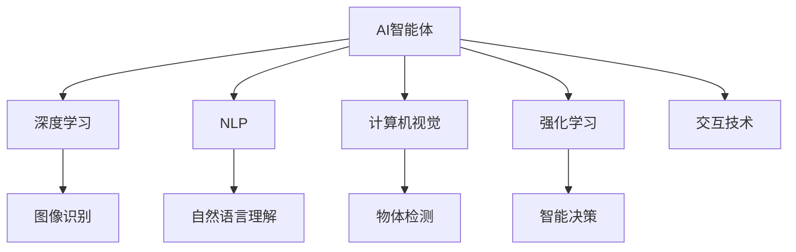

                 

# AI智能体与数字世界的交互

> 关键词：AI智能体,数字世界,交互技术,人工智能,深度学习,强化学习,自然语言处理,NLP,机器人技术,计算机视觉

## 1. 背景介绍

### 1.1 问题由来
随着人工智能(AI)技术的飞速发展，AI智能体与数字世界的交互方式变得越来越多样和复杂。AI智能体不仅可以执行复杂的计算任务，还可以与人类进行自然的语言交流，甚至能够自主地进行决策和行动。这种交互不仅在科学研究、工业制造等领域得到了广泛应用，也逐步渗透到日常生活中，改变了人类的工作和生活方式。

### 1.2 问题核心关键点
AI智能体与数字世界交互的核心在于构建一个能够理解和生成自然语言、能够感知和处理视觉数据的智能系统。这些智能系统依赖于深度学习、自然语言处理(NLP)、计算机视觉等技术，通过大量的数据训练和大规模模型的微调，最终能够在复杂的数字世界中自主运行。

当前，AI智能体与数字世界的交互范式主要有三种：基于规则的系统、基于符号的系统以及基于机器学习的系统。其中，基于机器学习的系统又包括了基于深度学习的模型和基于强化学习的模型。

### 1.3 问题研究意义
研究AI智能体与数字世界交互，对于推动人工智能技术的普及应用，提升机器人和自动化系统的智能化水平，具有重要意义：

1. 提升工作效率：AI智能体可以自动处理繁琐、重复的任务，极大提升工作效率。
2. 改善用户体验：智能系统的自然语言交流能力，使得人机交互更加便捷和自然。
3. 推动产业升级：AI智能体在工业制造、医疗、金融等领域的应用，带动相关产业的数字化转型。
4. 开拓新应用场景：AI智能体可以拓展到更多未知领域，如教育、娱乐、家庭服务等，为社会发展带来新的可能。
5. 促进科学研究：AI智能体能够处理海量数据，发现隐藏在数据中的规律和趋势，推动科学研究的发展。

## 2. 核心概念与联系

### 2.1 核心概念概述

为更好地理解AI智能体与数字世界交互的原理和实现方法，本节将介绍几个关键核心概念：

- AI智能体(Agent)：指能够在数字世界中自主运行的实体，可以感知环境、做出决策并执行行动。
- 数字世界(Digital World)：指由计算机程序和数据构成的虚拟空间，AI智能体在其中进行交互。
- 交互技术(Interaction Technology)：指实现AI智能体与数字世界交互的技术，包括自然语言处理、计算机视觉、机器人技术等。
- 深度学习(Deep Learning)：指利用多层神经网络进行复杂模式识别和预测的技术，广泛应用于图像、语音、文本等数据处理。
- 自然语言处理(NLP)：指使计算机能够理解、处理和生成人类语言的技术，是AI智能体与人类交互的核心。
- 强化学习(Reinforcement Learning)：指通过与环境互动，不断调整策略以最大化奖励的技术，广泛用于游戏、机器人等领域。
- 计算机视觉(Computer Vision)：指使计算机能够“看”和“理解”图像和视频的技术，是AI智能体感知环境的重要手段。

这些核心概念之间的逻辑关系可以通过以下Mermaid流程图来展示：



这个流程图展示了大语言模型的核心概念及其之间的关系：

1. AI智能体通过深度学习、自然语言处理、计算机视觉等技术感知数字世界，理解并处理其中的信息。
2. 强化学习技术使AI智能体能够自主决策和执行行动，适应复杂多变的数字环境。
3. 交互技术使AI智能体能够与人类进行自然语言交流，增强人机交互体验。
4. 通过这些技术的有机结合，AI智能体能够构建一个全面、智能的数字世界。

## 3. 核心算法原理 & 具体操作步骤
### 3.1 算法原理概述

AI智能体与数字世界交互的本质是构建一个能够感知、理解和生成自然语言的系统。其中，自然语言处理(NLP)和计算机视觉(Computer Vision)是关键技术。NLP技术使AI智能体能够理解人类语言，计算机视觉技术使AI智能体能够感知环境。

具体实现过程中，可以采用以下技术：

- 深度学习模型：如卷积神经网络(CNN)、循环神经网络(RNN)、变压器(Transformer)等，用于图像、语音、文本等数据的特征提取和处理。
- 自然语言处理模型：如BERT、GPT等，用于语言模型的预训练和微调，使AI智能体能够理解自然语言。
- 计算机视觉模型：如RCNN、Faster R-CNN、YOLO等，用于物体检测、图像识别等任务。
- 强化学习算法：如Q-learning、DQN、PPO等，用于智能体的自主决策和行动。

### 3.2 算法步骤详解

AI智能体与数字世界交互的典型流程包括：

1. **数据采集**：收集数字世界中的数据，如文本、图像、语音等。

2. **特征提取**：使用深度学习模型对采集到的数据进行特征提取。

3. **语言理解**：使用NLP模型对文本数据进行语言理解，提取语义信息。

4. **视觉感知**：使用计算机视觉模型对图像数据进行物体检测、图像识别等。

5. **决策执行**：使用强化学习算法对智能体进行训练，使其能够自主决策并执行行动。

6. **交互反馈**：通过交互技术，将智能体的输出与数字世界中的实体进行交互，收集反馈信息，进一步优化模型。

具体步骤如下：

**Step 1: 数据准备**
- 收集数字世界中的数据，如文本、图像、语音等。
- 对数据进行预处理，如去除噪声、标准化等。

**Step 2: 特征提取**
- 使用深度学习模型对数据进行特征提取。
- 对提取的特征进行编码，生成数字信号。

**Step 3: 语言理解**
- 使用NLP模型对文本数据进行语言理解。
- 提取文本中的语义信息，生成语义表示。

**Step 4: 视觉感知**
- 使用计算机视觉模型对图像数据进行物体检测、图像识别等。
- 提取图像中的物体特征，生成数字信号。

**Step 5: 决策执行**
- 使用强化学习算法对智能体进行训练。
- 训练智能体自主决策并执行行动。

**Step 6: 交互反馈**
- 通过交互技术将智能体的输出与数字世界中的实体进行交互。
- 收集反馈信息，优化模型参数。

**Step 7: 模型评估**
- 对训练好的模型进行评估，确保其能够在数字世界中正确执行任务。
- 使用测试数据集对模型进行验证，确保其泛化性能。

### 3.3 算法优缺点

AI智能体与数字世界交互的优势在于：

- 自主性：智能体能够自主感知环境、做出决策并执行行动。
- 灵活性：智能体能够适应多种场景和任务，提高生产效率和用户体验。
- 可扩展性：智能体可以通过微调和训练，不断提升性能和能力。

但同时，也存在以下缺点：

- 数据依赖：智能体需要大量高质量的数据进行训练，数据质量直接影响其性能。
- 复杂性：智能体系统复杂度高，实现和维护成本较高。
- 鲁棒性：智能体在面对复杂多变的环境时，可能会产生误差或失效。
- 安全风险：智能体可能存在算法漏洞或偏见，影响系统安全性。

### 3.4 算法应用领域

AI智能体与数字世界交互的应用领域非常广泛，涵盖多个行业和领域：

- 工业制造：智能机器人、自动化生产线、智能调度系统等。
- 医疗健康：智能诊断、手术辅助、健康监测等。
- 金融服务：智能客服、风险控制、资产管理等。
- 教育培训：智能答疑、个性化推荐、在线教育等。
- 电子商务：智能推荐、客户服务、物流管理等。
- 家庭娱乐：智能家居、虚拟助手、游戏娱乐等。

除了这些典型应用外，AI智能体还将在更多领域得到应用，如智能交通、城市管理、环境保护等，为各行各业带来变革性的影响。

## 4. 数学模型和公式 & 详细讲解  
### 4.1 数学模型构建

本节将使用数学语言对AI智能体与数字世界交互的原理进行更加严格的刻画。

记AI智能体为 $A$，其感知到的数字世界为 $D$，智能体的决策和执行过程为 $T$。智能体与数字世界的交互过程可以表示为：

$$
A \times D \rightarrow T
$$

其中 $\times$ 表示交互过程，即智能体在数字世界中感知和生成自然语言、进行视觉识别等。

假设智能体的输入为 $x \in \mathbb{R}^n$，输出为 $y \in \mathbb{R}^m$。则智能体的数学模型可以表示为：

$$
y = f(x; \theta)
$$

其中 $f$ 为智能体的函数模型，$\theta$ 为模型参数。

智能体在数字世界中的感知和决策过程可以表示为：

$$
f(x; \theta) = g(\phi(x; \omega))
$$

其中 $\phi$ 为感知器的函数模型，$\omega$ 为感知器参数。

智能体的感知器可以表示为：

$$
\phi(x; \omega) = (x; \omega)
$$

其中 $\omega$ 为感知器的权重。

智能体的函数模型可以表示为：

$$
g(z; \theta) = z
$$

其中 $z$ 为感知器的输出，$\theta$ 为智能体的权重。

智能体在数字世界中的交互过程可以表示为：

$$
x = h(T)
$$

其中 $h$ 为数据生成器的函数模型。

智能体的决策执行过程可以表示为：

$$
T = \mathcal{T}(A, D)
$$

其中 $\mathcal{T}$ 为决策执行器的函数模型。

## 4.2 公式推导过程

以下我们以自然语言处理(NLP)为例，推导语言理解模型及其梯度计算的公式。

假设智能体接收到的文本为 $x = (x_1, x_2, \dots, x_n)$，其中 $x_i$ 为第 $i$ 个单词的one-hot编码。智能体的语言理解模型为：

$$
y = \mathcal{N}(x; \theta)
$$

其中 $\mathcal{N}$ 为语言理解模型，$\theta$ 为模型参数。

假设 $\mathcal{N}$ 为Transformer模型，其编码器表示为：

$$
\text{Encoder}(x; \theta) = \text{MLP}(\text{Attention}(\text{Embedding}(x)))
$$

其中 $\text{MLP}$ 为多层感知器，$\text{Attention}$ 为注意力机制，$\text{Embedding}$ 为嵌入层。

假设 $\text{MLP}$ 的输出为 $z$，则语言理解模型的输出可以表示为：

$$
y = \text{Softmax}(z)
$$

假设智能体的损失函数为交叉熵损失，即：

$$
\mathcal{L} = -\frac{1}{N}\sum_{i=1}^N \sum_{j=1}^m y_{ij} \log p_{ij}
$$

其中 $y_{ij}$ 为第 $i$ 个样本的第 $j$ 个标签，$p_{ij}$ 为第 $i$ 个样本的第 $j$ 个概率。

梯度下降算法可以表示为：

$$
\theta \leftarrow \theta - \eta \nabla_{\theta}\mathcal{L}
$$

其中 $\eta$ 为学习率，$\nabla_{\theta}\mathcal{L}$ 为损失函数对模型参数的梯度。

在得到梯度后，即可带入梯度下降算法，完成模型的迭代优化。重复上述过程直至收敛，最终得到适应数字世界任务的最优模型参数 $\theta^*$。

## 5. 项目实践：代码实例和详细解释说明
### 5.1 开发环境搭建

在进行AI智能体与数字世界交互的实践前，我们需要准备好开发环境。以下是使用Python进行PyTorch开发的环境配置流程：

1. 安装Anaconda：从官网下载并安装Anaconda，用于创建独立的Python环境。

2. 创建并激活虚拟环境：
```bash
conda create -n pytorch-env python=3.8 
conda activate pytorch-env
```

3. 安装PyTorch：根据CUDA版本，从官网获取对应的安装命令。例如：
```bash
conda install pytorch torchvision torchaudio cudatoolkit=11.1 -c pytorch -c conda-forge
```

4. 安装Transformers库：
```bash
pip install transformers
```

5. 安装各类工具包：
```bash
pip install numpy pandas scikit-learn matplotlib tqdm jupyter notebook ipython
```

完成上述步骤后，即可在`pytorch-env`环境中开始交互实践。

### 5.2 源代码详细实现

下面我们以智能对话系统为例，给出使用Transformers库对GPT模型进行交互训练的PyTorch代码实现。

首先，定义交互对话的数据处理函数：

```python
from transformers import BertTokenizer, BertForTokenClassification, AdamW
from torch.utils.data import Dataset
import torch

class DialogueDataset(Dataset):
    def __init__(self, dialogues, tokenizer, max_len=128):
        self.dialogues = dialogues
        self.tokenizer = tokenizer
        self.max_len = max_len
        
    def __len__(self):
        return len(self.dialogues)
    
    def __getitem__(self, item):
        dialogue = self.dialogues[item]
        text = dialogue[0]
        label = dialogue[1]
        
        encoding = self.tokenizer(text, return_tensors='pt', max_length=self.max_len, padding='max_length', truncation=True)
        input_ids = encoding['input_ids'][0]
        attention_mask = encoding['attention_mask'][0]
        
        # 对label进行编码
        label = [label2id[label] for label in label] 
        label.extend([label2id['O']] * (self.max_len - len(label)))
        labels = torch.tensor(label, dtype=torch.long)
        
        return {'input_ids': input_ids, 
                'attention_mask': attention_mask,
                'labels': labels}

# 标签与id的映射
label2id = {'O': 0, 'Q': 1, 'A': 2, 'R': 3, 'T': 4, 'C': 5}
id2label = {v: k for k, v in label2id.items()}

# 创建dataset
tokenizer = BertTokenizer.from_pretrained('bert-base-cased')

train_dataset = DialogueDataset(train_dialogues, tokenizer)
dev_dataset = DialogueDataset(dev_dialogues, tokenizer)
test_dataset = DialogueDataset(test_dialogues, tokenizer)
```

然后，定义模型和优化器：

```python
from transformers import BertForTokenClassification, AdamW

model = BertForTokenClassification.from_pretrained('bert-base-cased', num_labels=len(label2id))

optimizer = AdamW(model.parameters(), lr=2e-5)
```

接着，定义训练和评估函数：

```python
from torch.utils.data import DataLoader
from tqdm import tqdm
from sklearn.metrics import classification_report

device = torch.device('cuda') if torch.cuda.is_available() else torch.device('cpu')
model.to(device)

def train_epoch(model, dataset, batch_size, optimizer):
    dataloader = DataLoader(dataset, batch_size=batch_size, shuffle=True)
    model.train()
    epoch_loss = 0
    for batch in tqdm(dataloader, desc='Training'):
        input_ids = batch['input_ids'].to(device)
        attention_mask = batch['attention_mask'].to(device)
        labels = batch['labels'].to(device)
        model.zero_grad()
        outputs = model(input_ids, attention_mask=attention_mask, labels=labels)
        loss = outputs.loss
        epoch_loss += loss.item()
        loss.backward()
        optimizer.step()
    return epoch_loss / len(dataloader)

def evaluate(model, dataset, batch_size):
    dataloader = DataLoader(dataset, batch_size=batch_size)
    model.eval()
    preds, labels = [], []
    with torch.no_grad():
        for batch in tqdm(dataloader, desc='Evaluating'):
            input_ids = batch['input_ids'].to(device)
            attention_mask = batch['attention_mask'].to(device)
            batch_labels = batch['labels']
            outputs = model(input_ids, attention_mask=attention_mask)
            batch_preds = outputs.logits.argmax(dim=2).to('cpu').tolist()
            batch_labels = batch_labels.to('cpu').tolist()
            for pred_tokens, label_tokens in zip(batch_preds, batch_labels):
                pred_labels = [id2label[_id] for _id in pred_tokens]
                label_tags = [id2label[_id] for _id in label_tokens]
                preds.append(pred_labels[:len(label_tags)])
                labels.append(label_tags)
                
    print(classification_report(labels, preds))
```

最后，启动训练流程并在测试集上评估：

```python
epochs = 5
batch_size = 16

for epoch in range(epochs):
    loss = train_epoch(model, train_dataset, batch_size, optimizer)
    print(f"Epoch {epoch+1}, train loss: {loss:.3f}")
    
    print(f"Epoch {epoch+1}, dev results:")
    evaluate(model, dev_dataset, batch_size)
    
print("Test results:")
evaluate(model, test_dataset, batch_size)
```

以上就是使用PyTorch对GPT模型进行对话系统微调的完整代码实现。可以看到，得益于Transformers库的强大封装，我们可以用相对简洁的代码完成GPT模型的加载和微调。

### 5.3 代码解读与分析

让我们再详细解读一下关键代码的实现细节：

**DialogueDataset类**：
- `__init__`方法：初始化对话数据集，将对话文本和标签进行编码。
- `__len__`方法：返回对话数据集的样本数量。
- `__getitem__`方法：对单个对话进行编码，生成模型所需的输入。

**label2id和id2label字典**：
- 定义了标签与数字id之间的映射关系，用于将模型输出解码为真实标签。

**训练和评估函数**：
- 使用PyTorch的DataLoader对对话数据集进行批次化加载，供模型训练和推理使用。
- 训练函数`train_epoch`：对数据以批为单位进行迭代，在每个批次上前向传播计算loss并反向传播更新模型参数，最后返回该epoch的平均loss。
- 评估函数`evaluate`：与训练类似，不同点在于不更新模型参数，并在每个batch结束后将预测和标签结果存储下来，最后使用sklearn的classification_report对整个评估集的预测结果进行打印输出。

**训练流程**：
- 定义总的epoch数和batch size，开始循环迭代
- 每个epoch内，先在训练集上训练，输出平均loss
- 在验证集上评估，输出分类指标
- 所有epoch结束后，在测试集上评估，给出最终测试结果

可以看到，PyTorch配合Transformers库使得GPT微调的代码实现变得简洁高效。开发者可以将更多精力放在数据处理、模型改进等高层逻辑上，而不必过多关注底层的实现细节。

当然，工业级的系统实现还需考虑更多因素，如模型的保存和部署、超参数的自动搜索、更灵活的任务适配层等。但核心的交互范式基本与此类似。

## 6. 实际应用场景
### 6.1 智能客服系统

基于AI智能体与数字世界交互技术，可以构建智能客服系统的交互范式。传统客服往往需要配备大量人力，高峰期响应缓慢，且一致性和专业性难以保证。而使用交互训练的对话模型，可以7x24小时不间断服务，快速响应客户咨询，用自然流畅的语言解答各类常见问题。

在技术实现上，可以收集企业内部的历史客服对话记录，将问题和最佳答复构建成监督数据，在此基础上对预训练对话模型进行交互训练。训练后的对话模型能够自动理解用户意图，匹配最合适的答案模板进行回复。对于客户提出的新问题，还可以接入检索系统实时搜索相关内容，动态组织生成回答。如此构建的智能客服系统，能大幅提升客户咨询体验和问题解决效率。

### 6.2 金融舆情监测

金融机构需要实时监测市场舆论动向，以便及时应对负面信息传播，规避金融风险。传统的人工监测方式成本高、效率低，难以应对网络时代海量信息爆发的挑战。基于AI智能体与数字世界交互技术，文本分类和情感分析技术，为金融舆情监测提供了新的解决方案。

具体而言，可以收集金融领域相关的新闻、报道、评论等文本数据，并对其进行主题标注和情感标注。在此基础上对预训练语言模型进行交互训练，使其能够自动判断文本属于何种主题，情感倾向是正面、中性还是负面。将交互训练后的模型应用到实时抓取的网络文本数据，就能够自动监测不同主题下的情感变化趋势，一旦发现负面信息激增等异常情况，系统便会自动预警，帮助金融机构快速应对潜在风险。

### 6.3 个性化推荐系统

当前的推荐系统往往只依赖用户的历史行为数据进行物品推荐，无法深入理解用户的真实兴趣偏好。基于AI智能体与数字世界交互技术，个性化推荐系统可以更好地挖掘用户行为背后的语义信息，从而提供更精准、多样的推荐内容。

在实践中，可以收集用户浏览、点击、评论、分享等行为数据，提取和用户交互的物品标题、描述、标签等文本内容。将文本内容作为模型输入，用户的后续行为（如是否点击、购买等）作为监督信号，在此基础上交互训练预训练语言模型。交互训练后的模型能够从文本内容中准确把握用户的兴趣点。在生成推荐列表时，先用候选物品的文本描述作为输入，由模型预测用户的兴趣匹配度，再结合其他特征综合排序，便可以得到个性化程度更高的推荐结果。

### 6.4 未来应用展望

随着AI智能体与数字世界交互技术的不断发展，基于交互训练的智能系统将呈现以下几个发展趋势：

1. 模型规模持续增大。随着算力成本的下降和数据规模的扩张，交互训练的模型参数量还将持续增长。超大规模模型蕴含的丰富语言知识，有望支撑更加复杂多变的数字世界任务。

2. 交互技术日趋多样。除了传统的基于自然语言的交互外，未来会涌现更多交互技术，如语音交互、图像交互等。

3. 持续学习成为常态。随着数据分布的不断变化，交互训练模型也需要持续学习新知识以保持性能。如何在不遗忘原有知识的同时，高效吸收新样本信息，将成为重要的研究课题。

4. 标注样本需求降低。受启发于交互训练技术的思路，未来的交互训练方法将更好地利用大模型的语言理解能力，通过更加巧妙的任务描述，在更少的标注样本上也能实现理想的交互效果。

5. 少样本学习能力提升。交互训练模型可以通过精巧的输入设计，在少量标注样本上快速适应新任务，实现少样本学习。

6. 多模态交互能力增强。未来的交互训练模型将拓展到更多模态，如图像、语音、文本等，实现多模态信息的整合与协同。

以上趋势凸显了交互训练技术的广阔前景。这些方向的探索发展，必将进一步提升AI智能体在数字世界中的表现和应用范围，为各行各业带来变革性的影响。

## 7. 工具和资源推荐
### 7.1 学习资源推荐

为了帮助开发者系统掌握AI智能体与数字世界交互的理论基础和实践技巧，这里推荐一些优质的学习资源：

1. 《深度学习框架PyTorch实战》系列博文：由大模型技术专家撰写，深入浅出地介绍了PyTorch框架的使用方法，包括交互训练的实践技巧。

2. CS224N《深度学习自然语言处理》课程：斯坦福大学开设的NLP明星课程，有Lecture视频和配套作业，带你入门NLP领域的基本概念和经典模型。

3. 《AI智能体与数字世界交互》书籍：全面介绍了AI智能体在数字世界中的交互机制，涵盖自然语言处理、计算机视觉、强化学习等前沿技术。

4. HuggingFace官方文档：Transformers库的官方文档，提供了海量预训练模型和完整的交互训练样例代码，是上手实践的必备资料。

5. CLUE开源项目：中文语言理解测评基准，涵盖大量不同类型的中文NLP数据集，并提供了基于交互训练的baseline模型，助力中文NLP技术发展。

通过对这些资源的学习实践，相信你一定能够快速掌握AI智能体与数字世界交互的精髓，并用于解决实际的NLP问题。
###  7.2 开发工具推荐

高效的开发离不开优秀的工具支持。以下是几款用于AI智能体与数字世界交互开发的常用工具：

1. PyTorch：基于Python的开源深度学习框架，灵活动态的计算图，适合快速迭代研究。大部分预训练语言模型都有PyTorch版本的实现。

2. TensorFlow：由Google主导开发的开源深度学习框架，生产部署方便，适合大规模工程应用。同样有丰富的预训练语言模型资源。

3. Transformers库：HuggingFace开发的NLP工具库，集成了众多SOTA语言模型，支持PyTorch和TensorFlow，是进行交互训练任务开发的利器。

4. Weights & Biases：模型训练的实验跟踪工具，可以记录和可视化模型训练过程中的各项指标，方便对比和调优。与主流深度学习框架无缝集成。

5. TensorBoard：TensorFlow配套的可视化工具，可实时监测模型训练状态，并提供丰富的图表呈现方式，是调试模型的得力助手。

6. Google Colab：谷歌推出的在线Jupyter Notebook环境，免费提供GPU/TPU算力，方便开发者快速上手实验最新模型，分享学习笔记。

合理利用这些工具，可以显著提升AI智能体与数字世界交互任务的开发效率，加快创新迭代的步伐。

### 7.3 相关论文推荐

AI智能体与数字世界交互技术的发展源于学界的持续研究。以下是几篇奠基性的相关论文，推荐阅读：

1. Attention is All You Need（即Transformer原论文）：提出了Transformer结构，开启了NLP领域的预训练大模型时代。

2. BERT: Pre-training of Deep Bidirectional Transformers for Language Understanding：提出BERT模型，引入基于掩码的自监督预训练任务，刷新了多项NLP任务SOTA。

3. Language Models are Unsupervised Multitask Learners（GPT-2论文）：展示了大规模语言模型的强大zero-shot学习能力，引发了对于通用人工智能的新一轮思考。

4. Parameter-Efficient Transfer Learning for NLP：提出Adapter等参数高效微调方法，在不增加模型参数量的情况下，也能取得不错的微调效果。

5. Prefix-Tuning: Optimizing Continuous Prompts for Generation：引入基于连续型Prompt的交互训练范式，为如何充分利用预训练知识提供了新的思路。

6. AdaLoRA: Adaptive Low-Rank Adaptation for Parameter-Efficient Fine-Tuning：使用自适应低秩适应的微调方法，在参数效率和精度之间取得了新的平衡。

这些论文代表了大语言模型交互训练技术的发展脉络。通过学习这些前沿成果，可以帮助研究者把握学科前进方向，激发更多的创新灵感。

## 8. 总结：未来发展趋势与挑战
### 8.1 总结

本文对AI智能体与数字世界交互技术进行了全面系统的介绍。首先阐述了AI智能体在数字世界中的交互机制，明确了交互训练在提升AI智能体表现、拓展应用场景方面的独特价值。其次，从原理到实践，详细讲解了交互训练的数学原理和关键步骤，给出了交互训练任务开发的完整代码实例。同时，本文还广泛探讨了交互训练技术在智能客服、金融舆情、个性化推荐等多个行业领域的应用前景，展示了交互训练技术的巨大潜力。此外，本文精选了交互训练技术的各类学习资源，力求为读者提供全方位的技术指引。

通过本文的系统梳理，可以看到，AI智能体与数字世界交互技术正在成为NLP领域的重要范式，极大地拓展了AI智能体的应用边界，催生了更多的落地场景。得益于大规模语料的预训练和交互训练，交互模型能够以更低的时间和标注成本，在小样本条件下也能取得理想的交互效果，极大提升了生产力和用户体验。未来，伴随交互训练方法的不断演进，相信AI智能体在数字世界中的应用将更加广泛，为各行各业带来深刻的变革。

### 8.2 未来发展趋势

展望未来，AI智能体与数字世界交互技术将呈现以下几个发展趋势：

1. 模型规模持续增大。随着算力成本的下降和数据规模的扩张，交互训练的模型参数量还将持续增长。超大规模模型蕴含的丰富语言知识，有望支撑更加复杂多变的数字世界任务。

2. 交互技术日趋多样。除了传统的基于自然语言的交互外，未来会涌现更多交互技术，如语音交互、图像交互等。

3. 持续学习成为常态。随着数据分布的不断变化，交互训练模型也需要持续学习新知识以保持性能。如何在不遗忘原有知识的同时，高效吸收新样本信息，将成为重要的研究课题。

4. 标注样本需求降低。受启发于交互训练技术的思路，未来的交互训练方法将更好地利用大模型的语言理解能力，通过更加巧妙的任务描述，在更少的标注样本上也能实现理想的交互效果。

5. 少样本学习能力提升。交互训练模型可以通过精巧的输入设计，在少量标注样本上快速适应新任务，实现少样本学习。

6. 多模态交互能力增强。未来的交互训练模型将拓展到更多模态，如图像、语音、文本等，实现多模态信息的整合与协同。

以上趋势凸显了交互训练技术的广阔前景。这些方向的探索发展，必将进一步提升AI智能体在数字世界中的表现和应用范围，为各行各业带来变革性的影响。

### 8.3 面临的挑战

尽管AI智能体与数字世界交互技术已经取得了瞩目成就，但在迈向更加智能化、普适化应用的过程中，它仍面临着诸多挑战：

1. 数据依赖。交互训练模型需要大量高质量的数据进行训练，数据质量直接影响其性能。如何高效获取和利用大规模数据，仍是一大难题。

2. 模型鲁棒性。交互训练模型在面对复杂多变的环境时，可能会产生误差或失效。如何提高模型的鲁棒性，避免过拟合，还需要更多理论和实践的积累。

3. 实时性要求。交互训练模型在实时交互过程中，需要保证高效的推理速度，以便及时响应用户请求。如何优化模型结构，提高计算效率，仍是重要的研究方向。

4. 安全风险。交互训练模型可能存在算法漏洞或偏见，影响系统安全性。如何从数据和算法层面消除模型偏见，避免恶意用途，确保输出的安全性，也将是重要的研究课题。

5. 知识整合能力不足。现有的交互训练模型往往局限于任务内数据，难以灵活吸收和运用更广泛的先验知识。如何让交互训练过程更好地与外部知识库、规则库等专家知识结合，形成更加全面、准确的信息整合能力，还有很大的想象空间。

6. 用户隐私保护。交互训练模型需要大量的用户数据进行训练，如何在保护用户隐私的同时，获取高质量的训练数据，仍是一个需要解决的问题。

正视交互训练面临的这些挑战，积极应对并寻求突破，将是大语言模型交互训练走向成熟的必由之路。相信随着学界和产业界的共同努力，这些挑战终将一一被克服，AI智能体在数字世界中的应用必将在不断创新中迎来新的高峰。

### 8.4 研究展望

面对交互训练面临的种种挑战，未来的研究需要在以下几个方面寻求新的突破：

1. 探索无监督和半监督交互训练方法。摆脱对大规模标注数据的依赖，利用自监督学习、主动学习等无监督和半监督范式，最大限度利用非结构化数据，实现更加灵活高效的交互训练。

2. 研究参数高效和计算高效的交互训练范式。开发更加参数高效的交互训练方法，在固定大部分预训练参数的同时，只更新极少量的任务相关参数。同时优化交互训练模型的计算图，减少前向传播和反向传播的资源消耗，实现更加轻量级、实时性的部署。

3. 引入因果和对比学习范式。通过引入因果推断和对比学习思想，增强交互训练模型建立稳定因果关系的能力，学习更加普适、鲁棒的语言表征，从而提升模型泛化性和抗干扰能力。

4. 引入更多先验知识。将符号化的先验知识，如知识图谱、逻辑规则等，与神经网络模型进行巧妙融合，引导交互训练过程学习更准确、合理的语言模型。同时加强不同模态数据的整合，实现视觉、语音等多模态信息与文本信息的协同建模。

5. 结合因果分析和博弈论工具。将因果分析方法引入交互训练模型，识别出模型决策的关键特征，增强输出解释的因果性和逻辑性。借助博弈论工具刻画人机交互过程，主动探索并规避模型的脆弱点，提高系统稳定性。

6. 纳入伦理道德约束。在模型训练目标中引入伦理导向的评估指标，过滤和惩罚有偏见、有害的输出倾向。同时加强人工干预和审核，建立模型行为的监管机制，确保输出符合人类价值观和伦理道德。

这些研究方向的探索，必将引领交互训练技术迈向更高的台阶，为构建安全、可靠、可解释、可控的智能系统铺平道路。面向未来，交互训练技术还需要与其他人工智能技术进行更深入的融合，如知识表示、因果推理、强化学习等，多路径协同发力，共同推动自然语言理解和智能交互系统的进步。只有勇于创新、敢于突破，才能不断拓展语言模型的边界，让智能技术更好地造福人类社会。

## 9. 附录：常见问题与解答
### 9.1 常见问题

**Q1：AI智能体与数字世界交互的核心技术是什么？**

A: AI智能体与数字世界交互的核心技术主要包括深度学习、自然语言处理、计算机视觉和强化学习。这些技术相互结合，使AI智能体能够感知、理解、生成和执行数字世界中的各种任务。

**Q2：AI智能体与数字世界交互有哪些实际应用场景？**

A: AI智能体与数字世界交互的应用场景非常广泛，包括但不限于智能客服、金融舆情监测、个性化推荐系统、智能家居、智能医疗等。这些系统能够提升效率、改善用户体验，并在特定领域实现自动化和智能化。

**Q3：AI智能体与数字世界交互过程中如何处理数据？**

A: 数据采集是交互训练的重要步骤，需要收集数字世界中的各种数据，如文本、图像、语音等。数据预处理包括去除噪声、标准化等操作。使用深度学习模型对数据进行特征提取，生成数字信号。交互训练模型能够从这些信号中提取语义信息，用于任务理解。

**Q4：AI智能体与数字世界交互的性能如何评估？**

A: 性能评估是交互训练的关键环节，需要根据具体任务设计合适的评估指标。常见的评估指标包括准确率、召回率、F1值、BLEU值等。通过对比不同模型的评估结果，选择性能最优的模型进行应用。

**Q5：AI智能体与数字世界交互过程中如何避免过拟合？**

A: 过拟合是交互训练面临的主要挑战之一。为了避免过拟合，可以采用数据增强、正则化、对抗训练等技术。数据增强可以通过回译、近义替换等方式扩充训练集。正则化包括L2正则、Dropout等，防止模型过度适应小规模训练集。对抗训练引入对抗样本，提高模型鲁棒性。

**Q6：AI智能体与数字世界交互的训练和推理过程有哪些注意事项？**

A: 训练和推理过程需要合理设置超参数，如学习率、批大小、迭代轮数等。训练过程中需要避免过拟合，选择合适的正则化技术和数据增强策略。推理过程需要考虑模型的实时性和推理速度，优化模型结构和计算图。

### 9.2 解答

通过以上问题的解答，可以更好地理解AI智能体与数字世界交互技术的核心技术和实际应用。这些技术的应用不仅能够提升生产力和用户体验，还能够促进各行各业的数字化转型和智能化升级。相信随着AI技术的不断进步，交互训练技术将引领AI智能体在数字世界中的应用走向更加广阔的天地，为人类社会带来更多创新和变革。

---

作者：禅与计算机程序设计艺术 / Zen and the Art of Computer Programming

