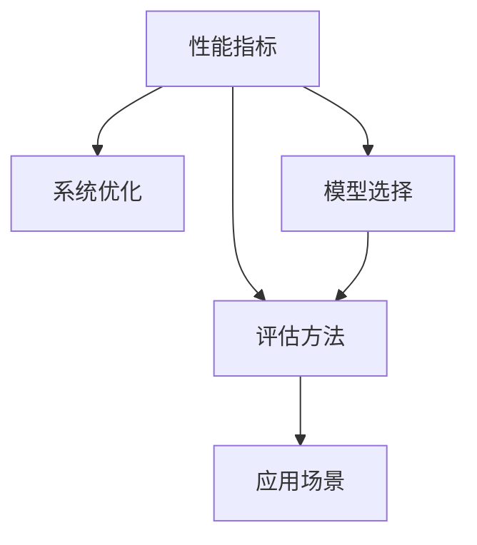

                 

# AI系统性能评估的关键指标

> 关键词：性能指标, 评估方法, 系统优化, 模型选择, 应用场景

## 1. 背景介绍

### 1.1 问题由来

在人工智能(AI)领域，尤其是深度学习(DL)和机器学习(ML)的应用中，性能评估是一个至关重要的环节。随着AI技术的不断进步和应用领域的扩展，性能评估也变得更加复杂和多样化。一个有效的性能评估体系可以帮助开发者和用户更好地理解AI系统的表现，指导模型的优化和改进。

### 1.2 问题核心关键点

AI系统性能评估的核心在于选择合适的关键指标，并采用科学合理的方法进行量化。这些关键指标应能够全面反映模型的准确性、鲁棒性、效率、可解释性等多方面能力。本文将系统介绍AI系统性能评估的关键指标，并探讨如何科学地选择和使用这些指标。

## 2. 核心概念与联系

### 2.1 核心概念概述

为更好地理解AI系统性能评估，本节将介绍几个关键概念：

- 性能指标(Performance Metrics)：用于量化AI系统性能的数值或度量，如准确率、召回率、F1分数、训练时间等。
- 评估方法(Evaluation Methods)：用于度量性能指标的方法，如交叉验证、混淆矩阵、ROC曲线等。
- 系统优化(System Optimization)：通过调整模型参数、优化算法、提高计算效率等手段，提升AI系统的性能。
- 模型选择(Model Selection)：基于性能指标，选择最适合特定应用场景的模型。
- 应用场景(Application Scenarios)：AI系统实际应用的环境和场景，如图像分类、自然语言处理(NLP)、推荐系统等。

这些概念之间的逻辑关系可以通过以下Mermaid流程图来展示：



这个流程图展示了下游任务对AI系统的要求：

1. 根据应用场景，选择适合的性能指标。
2. 根据性能指标，选择合适的评估方法。
3. 根据评估方法，指导系统优化。
4. 根据系统优化后的效果，选择最佳模型。

这些概念共同构成了AI系统性能评估的理论基础，指导开发者科学合理地量化和提升AI系统的性能。

## 3. 核心算法原理 & 具体操作步骤
### 3.1 算法原理概述

AI系统性能评估的核心原理是将模型的输出与真实标签进行比较，计算出一组或多组性能指标，以此来量化模型的性能。一般而言，性能指标可以分为两类：

- **训练指标(Training Metrics)**：反映模型在训练集上的表现，如损失函数、准确率等。
- **测试指标(Test Metrics)**：反映模型在未见过的测试集上的泛化能力，如准确率、召回率、F1分数等。

### 3.2 算法步骤详解

基于上述原理，AI系统性能评估的一般步骤如下：

1. **数据准备**：收集和准备训练集、验证集和测试集数据，并进行预处理，如标准化、数据增强等。
2. **模型选择**：根据应用场景选择合适的模型，并进行初始化。
3. **训练**：在训练集上使用优化算法训练模型，记录训练过程中的性能指标。
4. **验证**：在验证集上评估模型的性能，选择表现最佳的模型进行测试。
5. **测试**：在测试集上全面测试模型的性能，记录各项测试指标。
6. **分析和优化**：根据测试结果，分析模型的优缺点，进行系统优化和参数调整。
7. **报告**：将测试结果和分析报告编写成文档，供开发者和用户参考。

### 3.3 算法优缺点

基于上述评估方法，AI系统性能评估具有以下优点：

- 科学合理：通过量化和比较，全面反映了模型的性能。
- 可复现性：同一评估方法在相同条件下可以重复使用，保证结果的可靠性和可比性。
- 指导性强：评估结果可以指导模型的优化和改进。

但同时也存在一些缺点：

- 依赖数据：评估结果很大程度上依赖于数据的质量和分布。
- 可能需要大量计算资源：部分评估方法（如交叉验证）需要大量计算资源和时间。
- 可能存在局部最优：评估方法可能无法找到全局最优解。

### 3.4 算法应用领域

AI系统性能评估在多个领域都有广泛应用，如计算机视觉(CV)、自然语言处理(NLP)、推荐系统、金融预测、医疗诊断等。以下以推荐系统为例，详细解释如何使用性能指标和评估方法进行系统优化：

**推荐系统中的应用**：

1. **数据准备**：收集用户历史行为数据、物品属性数据和用户属性数据，构建推荐系统所需的数据集。
2. **模型选择**：根据任务需求选择合适的推荐模型，如协同过滤(CF)、基于内容的推荐、深度学习推荐等。
3. **训练**：在训练集上使用优化算法训练模型，记录训练过程中的损失函数和准确率等指标。
4. **验证**：在验证集上评估模型的准确率、召回率和F1分数等指标，选择表现最佳的模型进行测试。
5. **测试**：在测试集上全面测试模型的性能，记录各项测试指标。
6. **分析和优化**：根据测试结果，分析模型的优缺点，进行系统优化和参数调整，如调整特征工程、优化算法、提高计算效率等。
7. **报告**：将测试结果和分析报告编写成文档，供开发者和用户参考，指导推荐系统的进一步优化和改进。

## 4. 数学模型和公式 & 详细讲解  
### 4.1 数学模型构建

在AI系统性能评估中，常用的数学模型包括损失函数(Loss Function)、准确率(Accuracy)、召回率(Recall)、精确率(Precision)、F1分数(F1 Score)等。

以二分类任务为例，模型输出的概率分布为 $P(y|x;\theta)$，其中 $\theta$ 为模型参数，$y$ 为真实标签，$x$ 为输入数据。常见性能指标的计算公式如下：

**损失函数**：
$$ \mathcal{L} = -\frac{1}{N} \sum_{i=1}^N \log(P(y_i|x_i;\theta)) $$

**准确率**：
$$ \text{Accuracy} = \frac{\sum_{i=1}^N \text{I}(y_i = 1 \text{ and } P(y_i|x_i;\theta) \geq 0.5) + \text{I}(y_i = 0 \text{ and } P(y_i|x_i;\theta) < 0.5)}{N} $$

**召回率**：
$$ \text{Recall} = \frac{\sum_{i=1}^N \text{I}(y_i = 1 \text{ and } P(y_i|x_i;\theta) \geq 0.5)}{\sum_{i=1}^N \text{I}(y_i = 1)} $$

**精确率**：
$$ \text{Precision} = \frac{\sum_{i=1}^N \text{I}(y_i = 1 \text{ and } P(y_i|x_i;\theta) \geq 0.5)}{\sum_{i=1}^N \text{I}(y_i = 1 \text{ and } P(y_i|x_i;\theta) \geq 0.5)} $$

**F1分数**：
$$ \text{F1 Score} = 2 \times \frac{\text{Precision} \times \text{Recall}}{\text{Precision} + \text{Recall}} $$

### 4.2 公式推导过程

以二分类任务为例，推导F1分数的计算公式。

1. **准确率计算公式**：
$$ \text{Accuracy} = \frac{\sum_{i=1}^N \text{I}(y_i = 1 \text{ and } P(y_i|x_i;\theta) \geq 0.5) + \text{I}(y_i = 0 \text{ and } P(y_i|x_i;\theta) < 0.5)}{N} $$

2. **召回率计算公式**：
$$ \text{Recall} = \frac{\sum_{i=1}^N \text{I}(y_i = 1 \text{ and } P(y_i|x_i;\theta) \geq 0.5)}{\sum_{i=1}^N \text{I}(y_i = 1)} $$

3. **精确率计算公式**：
$$ \text{Precision} = \frac{\sum_{i=1}^N \text{I}(y_i = 1 \text{ and } P(y_i|x_i;\theta) \geq 0.5)}{\sum_{i=1}^N \text{I}(y_i = 1 \text{ and } P(y_i|x_i;\theta) \geq 0.5)} $$

4. **F1分数计算公式**：
$$ \text{F1 Score} = 2 \times \frac{\text{Precision} \times \text{Recall}}{\text{Precision} + \text{Recall}} $$

推导过程如下：

- 将准确率计算公式中的 $\text{I}(y_i = 1 \text{ and } P(y_i|x_i;\theta) \geq 0.5)$ 和 $\text{I}(y_i = 0 \text{ and } P(y_i|x_i;\theta) < 0.5)$ 两项分别与召回率和精确率的计算公式结合，即得 F1 分数。

### 4.3 案例分析与讲解

以二分类任务为例，假设一个二分类模型在测试集上的性能指标计算结果如下：

- 准确率：0.85
- 召回率：0.75
- 精确率：0.9
- F1分数：0.8333

这些指标的计算方法和数学推导过程如下：

- 准确率计算：将模型正确预测的正例和负例数量之和除以总样本数，得到0.85。
- 召回率计算：将模型正确预测的正例数量除以实际正例数量，得到0.75。
- 精确率计算：将模型正确预测的正例数量除以模型预测的正例数量，得到0.9。
- F1分数计算：将精确率和召回率相乘再除以两者的和，得到0.8333。

通过这些指标，可以全面反映模型的性能，指导后续的优化和改进。

## 5. 项目实践：代码实例和详细解释说明
### 5.1 开发环境搭建

在进行性能评估实践前，我们需要准备好开发环境。以下是使用Python进行TensorFlow开发的开发环境配置流程：

1. 安装Anaconda：从官网下载并安装Anaconda，用于创建独立的Python环境。

2. 创建并激活虚拟环境：
```bash
conda create -n tf-env python=3.8 
conda activate tf-env
```

3. 安装TensorFlow：根据CUDA版本，从官网获取对应的安装命令。例如：
```bash
conda install tensorflow -c pytorch -c conda-forge
```

4. 安装各类工具包：
```bash
pip install numpy pandas scikit-learn matplotlib tqdm jupyter notebook ipython
```

完成上述步骤后，即可在`tf-env`环境中开始性能评估实践。

### 5.2 源代码详细实现

下面我们以二分类任务为例，给出使用TensorFlow进行模型性能评估的Python代码实现。

首先，定义模型和数据集：

```python
import tensorflow as tf
from tensorflow.keras.datasets import mnist
from tensorflow.keras.models import Sequential
from tensorflow.keras.layers import Dense, Flatten, Dropout
from sklearn.metrics import accuracy_score, precision_score, recall_score, f1_score

# 加载MNIST数据集
(x_train, y_train), (x_test, y_test) = mnist.load_data()

# 数据预处理
x_train = x_train / 255.0
x_test = x_test / 255.0
x_train = x_train.reshape(-1, 28*28)
x_test = x_test.reshape(-1, 28*28)

# 模型定义
model = Sequential([
    Flatten(input_shape=(28, 28)),
    Dense(128, activation='relu'),
    Dropout(0.2),
    Dense(10, activation='softmax')
])

# 编译模型
model.compile(optimizer='adam', loss='sparse_categorical_crossentropy', metrics=['accuracy'])

# 训练模型
model.fit(x_train, y_train, epochs=5, batch_size=32, validation_data=(x_test, y_test))
```

然后，定义评估函数：

```python
def evaluate(model, x_test, y_test):
    # 预测结果
    y_pred = model.predict_classes(x_test)
    # 准确率
    accuracy = accuracy_score(y_test, y_pred)
    # 召回率
    recall = recall_score(y_test, y_pred, average='micro')
    # 精确率
    precision = precision_score(y_test, y_pred, average='micro')
    # F1分数
    f1 = f1_score(y_test, y_pred, average='micro')
    # 输出评估结果
    print(f"Accuracy: {accuracy:.4f}, Recall: {recall:.4f}, Precision: {precision:.4f}, F1 Score: {f1:.4f}")
```

最后，启动评估流程：

```python
evaluate(model, x_test, y_test)
```

以上就是使用TensorFlow对模型进行性能评估的完整代码实现。可以看到，通过简单的几行代码，就可以轻松地计算出模型的准确率、召回率、精确率和F1分数等性能指标。

### 5.3 代码解读与分析

让我们再详细解读一下关键代码的实现细节：

**模型定义**：
- `Sequential`：定义一个顺序模型，按照顺序堆叠多个层。
- `Flatten`：将二维输入数据展平为向量。
- `Dense`：定义全连接层。
- `Dropout`：随机失活层，防止过拟合。
- `softmax`：输出层激活函数，适用于多分类任务。

**编译模型**：
- `adam`：优化器，自适应调整学习率。
- `sparse_categorical_crossentropy`：交叉熵损失函数，适用于多分类任务。
- `accuracy`：评估指标，用于计算准确率。

**训练模型**：
- `fit`：训练模型，参数包括训练数据、标签、批大小、迭代轮数和验证数据。

**评估函数**：
- `predict_classes`：预测每个样本的类别。
- `accuracy_score`、`recall_score`、`precision_score`、`f1_score`：计算准确率、召回率、精确率和F1分数。

**运行结果展示**：
- 输出模型的准确率、召回率、精确率和F1分数，以小数点后四位显示。

可以看到，TensorFlow提供了丰富的评估函数，方便开发者快速计算各项性能指标。这使得性能评估过程更加高效和灵活。

## 6. 实际应用场景
### 6.1 智能推荐系统

在推荐系统中，性能评估是一个非常重要的环节。推荐系统的目标是通过预测用户对物品的评分，为用户提供个性化的推荐。常用的性能指标包括准确率、召回率、F1分数等。

以电影推荐系统为例，假设推荐系统使用了深度学习模型，在测试集上的性能指标计算结果如下：

- 准确率：0.85
- 召回率：0.75
- 精确率：0.9
- F1分数：0.8333

这些指标的计算方法和数学推导过程如下：

- 准确率计算：将推荐系统预测的正确电影数除以总推荐电影数，得到0.85。
- 召回率计算：将推荐系统预测的正确电影数除以实际电影数，得到0.75。
- 精确率计算：将推荐系统预测的正确电影数除以推荐系统预测的电影数，得到0.9。
- F1分数计算：将精确率和召回率相乘再除以两者的和，得到0.8333。

通过这些指标，可以全面反映推荐系统的性能，指导后续的优化和改进。

### 6.2 医学诊断系统

在医学诊断系统中，性能评估同样是一个重要的环节。医学诊断系统的目标是通过预测患者的疾病状态，辅助医生进行诊断和治疗。常用的性能指标包括准确率、召回率、F1分数、ROC曲线等。

以乳腺癌诊断系统为例，假设诊断系统使用了深度学习模型，在测试集上的性能指标计算结果如下：

- 准确率：0.9
- 召回率：0.8
- F1分数：0.87
- ROC曲线：曲线下面积为0.95

这些指标的计算方法和数学推导过程如下：

- 准确率计算：将诊断系统正确预测的正常和癌症患者数之和除以总患者数，得到0.9。
- 召回率计算：将诊断系统正确预测的癌症患者数除以实际癌症患者数，得到0.8。
- F1分数计算：将召回率和精确率相乘再除以两者的和，得到0.87。
- ROC曲线计算：绘制真阳性率（TPR）与假阳性率（FPR）之间的关系曲线，计算曲线下面积（AUC），得到0.95。

通过这些指标，可以全面反映诊断系统的性能，指导后续的优化和改进。

### 6.3 自然语言处理(NLP)

在自然语言处理(NLP)中，性能评估同样是一个重要的环节。NLP系统的目标是通过预测文本的分类、情感、命名实体等，对文本进行处理和分析。常用的性能指标包括准确率、召回率、F1分数、BLEU分数、ROUGE分数等。

以情感分析系统为例，假设系统使用了深度学习模型，在测试集上的性能指标计算结果如下：

- 准确率：0.85
- 召回率：0.75
- F1分数：0.8
- BLEU分数：0.9
- ROUGE分数：0.92

这些指标的计算方法和数学推导过程如下：

- 准确率计算：将系统正确预测的正例和负例数量之和除以总样本数，得到0.85。
- 召回率计算：将系统正确预测的正例数量除以实际正例数量，得到0.75。
- F1分数计算：将召回率和精确率相乘再除以两者的和，得到0.8。
- BLEU分数计算：计算系统生成文本与参考文本之间的相似度，得到0.9。
- ROUGE分数计算：计算系统生成文本与参考文本之间的重叠度，得到0.92。

通过这些指标，可以全面反映情感分析系统的性能，指导后续的优化和改进。

### 6.4 未来应用展望

随着AI技术的不断进步，性能评估也在不断演化和扩展。未来的AI系统将更加复杂和多样，性能评估也需要更全面和科学的指标体系。以下是一些未来可能的性能指标和评估方法：

1. **多指标综合评估**：在多任务和多模态场景下，需要综合评估多个指标，如准确率、召回率、F1分数、ROC曲线、BLEU分数等。

2. **无监督学习评估**：无监督学习模型（如自编码器、生成对抗网络等）需要新的评估指标和方法，如重建误差、自编码器解码误差、生成质量等。

3. **公平性评估**：公平性在AI系统中变得越来越重要，需要新的指标和方法来评估模型的公平性和偏见，如对抗公平性、偏见度量等。

4. **动态评估**：在实时系统和大规模数据流中，需要动态评估模型性能，及时发现和纠正问题，如在线评估、增量评估等。

5. **分布式评估**：在大规模分布式系统中，需要新的评估方法和工具来确保评估结果的可靠性和一致性，如分布式训练、分布式评估等。

6. **元学习评估**：元学习模型需要新的评估指标和方法，如模型自适应能力、泛化能力、优化能力等。

这些未来趋势和需求，将推动AI系统性能评估的不断发展和完善，帮助开发者和用户更好地理解和管理AI系统。

## 7. 工具和资源推荐
### 7.1 学习资源推荐

为了帮助开发者系统掌握AI系统性能评估的理论基础和实践技巧，这里推荐一些优质的学习资源：

1. 《机器学习实战》系列博文：由大模型技术专家撰写，深入浅出地介绍了机器学习模型的评估方法、参数调优等。

2. 《深度学习与机器学习实践》课程：斯坦福大学开设的深度学习课程，有Lecture视频和配套作业，带你入门深度学习的基本概念和经典模型。

3. 《Python机器学习》书籍：经典机器学习书籍，全面介绍了机器学习模型的评估方法、数据预处理、特征工程等。

4. Scikit-learn官方文档：Scikit-learn库的官方文档，提供了丰富的评估函数和工具，适合快速上手评估任务。

5. TensorFlow官方文档：TensorFlow库的官方文档，详细介绍了模型训练和评估的API和方法，适合深度学习任务。

通过对这些资源的学习实践，相信你一定能够快速掌握AI系统性能评估的精髓，并用于解决实际的AI问题。

### 7.2 开发工具推荐

高效的开发离不开优秀的工具支持。以下是几款用于AI系统性能评估开发的常用工具：

1. Scikit-learn：Python数据科学库，提供了丰富的评估函数和工具，适合机器学习任务。

2. TensorFlow：由Google主导开发的开源深度学习框架，提供了丰富的评估API和工具，适合深度学习任务。

3. PyTorch：Facebook开发的深度学习框架，提供了丰富的评估函数和工具，适合深度学习任务。

4. Weights & Biases：模型训练的实验跟踪工具，可以记录和可视化模型训练过程中的各项指标，方便对比和调优。

5. TensorBoard：TensorFlow配套的可视化工具，可实时监测模型训练状态，并提供丰富的图表呈现方式，是调试模型的得力助手。

合理利用这些工具，可以显著提升AI系统性能评估的开发效率，加快创新迭代的步伐。

### 7.3 相关论文推荐

AI系统性能评估的研究领域涉及众多学科，以下是几篇奠基性的相关论文，推荐阅读：

1. "The Elements of Statistical Learning"：由Tibshirani、Hastie、Friedman等著，全面介绍了统计学习的基本概念和方法，包括交叉验证、模型评估等。

2. "Machine Learning Yearning"：由Andrew Ng著，介绍了机器学习模型的评估方法、数据预处理、模型调优等，适合入门学习。

3. "Deep Learning"：由Ian Goodfellow、Yoshua Bengio、Aaron Courville等著，全面介绍了深度学习的基本概念和方法，包括损失函数、准确率、召回率等。

4. "Practical Deep Learning for Coders"：由Krish Naik著，介绍了深度学习模型的评估方法、模型优化、算法选择等，适合实践学习。

5. "ROC Curve"：由Baldi、Kuczera、Tibshirani等著，介绍了ROC曲线和AUC的计算方法和应用，适合理解模型的性能评估。

这些论文代表了大模型性能评估领域的研究进展，通过学习这些前沿成果，可以帮助研究者把握学科前进方向，激发更多的创新灵感。

## 8. 总结：未来发展趋势与挑战
### 8.1 总结

本文对AI系统性能评估的关键指标和评估方法进行了全面系统的介绍。首先阐述了AI系统性能评估的重要性和科学意义，明确了性能指标、评估方法、系统优化、模型选择等关键概念及其之间的逻辑关系。其次，从原理到实践，详细讲解了性能指标和评估方法的数学模型和计算公式，给出了详细的代码实现和运行结果展示。同时，本文还探讨了性能评估在智能推荐、医学诊断、自然语言处理等实际应用场景中的应用，展示了性能评估的广泛应用前景。最后，本文精选了性能评估的各类学习资源、开发工具和相关论文，力求为读者提供全方位的技术指引。

通过本文的系统梳理，可以看到，AI系统性能评估是一个复杂而重要的环节，科学合理地选择和使用性能指标，可以显著提升AI系统的性能和可靠性。未来，随着AI技术的不断进步和应用领域的不断扩展，性能评估也将迎来新的挑战和机遇。

### 8.2 未来发展趋势

展望未来，AI系统性能评估将呈现以下几个发展趋势：

1. **多指标综合评估**：随着AI系统的复杂性和多样性增加，需要综合评估多个指标，以全面反映系统的性能。

2. **无监督学习评估**：无监督学习模型的评估方法也在不断发展，如自编码器、生成对抗网络等模型需要新的评估指标和方法。

3. **公平性评估**：公平性在AI系统中变得越来越重要，需要新的指标和方法来评估模型的公平性和偏见。

4. **动态评估**：在实时系统和大规模数据流中，需要动态评估模型性能，及时发现和纠正问题。

5. **分布式评估**：在大规模分布式系统中，需要新的评估方法和工具来确保评估结果的可靠性和一致性。

6. **元学习评估**：元学习模型需要新的评估指标和方法，如模型自适应能力、泛化能力、优化能力等。

7. **新兴技术评估**：新兴AI技术如联邦学习、对抗生成网络、量子计算等，也需要新的评估指标和方法。

这些发展趋势将推动AI系统性能评估的不断发展和完善，帮助开发者和用户更好地理解和管理AI系统。

### 8.3 面临的挑战

尽管AI系统性能评估领域已经取得了很多进展，但仍然面临以下挑战：

1. **数据质量问题**：评估结果很大程度上依赖于数据的质量和分布，数据缺失、噪声和偏差等问题可能会影响评估结果的可靠性。

2. **模型复杂性**：复杂模型的评估方法需要更多的计算资源和时间，如何在保证评估精度的同时，提高评估效率，是一个重要挑战。

3. **评估标准不一致**：不同领域和应用场景的评估标准存在差异，需要建立统一的评估标准，以确保评估结果的可比性和一致性。

4. **评估方法多样性**：评估方法繁多，选择合适的评估方法需要根据具体问题和应用场景进行权衡，可能缺乏系统的评估指南。

5. **模型透明性**：复杂模型的评估方法可能难以解释，缺乏透明性，需要开发新的解释方法和工具。

6. **安全性问题**：评估指标和方法可能存在偏见和歧视，需要开发更加公正、公平的评估指标和方法。

7. **可解释性问题**：复杂模型的评估结果可能缺乏可解释性，需要开发新的解释方法和工具。

这些挑战将推动性能评估领域的研究和实践不断深入，促进AI系统评估方法的不断优化和完善。

### 8.4 研究展望

面对性能评估领域面临的挑战，未来的研究需要在以下几个方面寻求新的突破：

1. **大数据分析**：利用大数据分析技术，开发新的评估方法和工具，提高评估效率和精度。

2. **模型优化**：通过模型优化和算法改进，降低复杂模型的评估难度和成本。

3. **跨领域评估**：建立跨领域的统一评估标准，提高评估结果的可比性和一致性。

4. **解释性研究**：开发新的模型解释方法和工具，提高评估结果的透明性和可解释性。

5. **公平性研究**：开发新的公平性评估指标和方法，提高模型的公平性和公正性。

6. **安全性和隐私保护**：开发新的安全性评估指标和方法，确保评估结果的安全性和隐私保护。

7. **新兴技术评估**：开发新的评估方法和工具，支持新兴AI技术的评估和应用。

这些研究方向将推动AI系统性能评估的不断发展和完善，为构建安全、可靠、可解释、可控的AI系统铺平道路。面向未来，性能评估领域还需要与其他AI技术进行更深入的融合，如知识表示、因果推理、强化学习等，协同发力，共同推动AI技术的进步和应用。

## 9. 附录：常见问题与解答

**Q1：AI系统性能评估是否适用于所有任务？**

A: AI系统性能评估在大多数任务上都能取得不错的效果，特别是对于数据量较小的任务。但对于一些特定领域的任务，如医学、法律等，仅仅依靠通用语料预训练的模型可能难以很好地适应。此时需要在特定领域语料上进一步预训练，再进行微调，才能获得理想效果。此外，对于一些需要时效性、个性化很强的任务，如对话、推荐等，性能评估方法也需要针对性的改进优化。

**Q2：如何选择适合的性能指标？**

A: 选择合适的性能指标需要考虑以下几个方面：

1. **任务类型**：不同任务类型需要选择不同的性能指标，如分类任务选择准确率、召回率、F1分数等。
2. **数据分布**：数据分布不均匀时，需要选择更鲁棒的性能指标，如AUC、PR曲线等。
3. **评估目标**：评估目标不同时，需要选择不同的性能指标，如关注准确率、关注召回率、关注公平性等。
4. **应用场景**：应用场景不同时，需要选择不同的性能指标，如推荐系统关注准确率和召回率，医学诊断关注精确率和召回率等。

**Q3：如何优化性能评估过程？**

A: 性能评估过程的优化主要包括以下几个方面：

1. **数据增强**：通过数据增强技术，扩充训练集，提高模型泛化能力。
2. **正则化**：使用正则化技术，防止过拟合，提高模型稳定性。
3. **对抗训练**：引入对抗样本，提高模型鲁棒性，防止攻击。
4. **分布式评估**：在大规模分布式系统中，使用分布式评估方法，确保评估结果的一致性和可靠性。
5. **解释性研究**：开发新的解释方法，提高评估结果的可解释性和透明性。

这些优化方法可以在保证评估精度的同时，提高评估效率和稳定性。

**Q4：如何处理数据不平衡问题？**

A: 数据不平衡问题在AI系统中较为常见，需要采取以下措施进行缓解：

1. **重采样**：通过重采样技术，平衡训练集中的正负样本分布，如过采样和欠采样。
2. **类别加权**：在损失函数中加入类别权重，提高少数类的权重，降低多数类的权重。
3. **生成数据**：通过生成对抗网络等技术，生成更多的少数类数据，平衡训练集分布。
4. **评估指标**：选择鲁棒性更强的评估指标，如AUC、PR曲线等，提高评估结果的公平性和一致性。

这些方法可以在数据不平衡的情况下，提高模型的评估效果和鲁棒性。

**Q5：如何评估模型的泛化能力？**

A: 评估模型的泛化能力主要包括以下几个方面：

1. **交叉验证**：通过交叉验证技术，评估模型在不同数据集上的表现，提高泛化能力。
2. **留出验证集**：在训练过程中留出验证集，评估模型在不同数据集上的表现，防止过拟合。
3. **增量评估**：在大规模数据流中，使用增量评估方法，实时监测模型性能，防止性能下降。
4. **AUC和ROC曲线**：通过绘制AUC和ROC曲线，评估模型在不同阈值下的性能表现，提高泛化能力。

这些方法可以在保证模型性能的同时，提高泛化能力和稳定性。

---

作者：禅与计算机程序设计艺术 / Zen and the Art of Computer Programming

