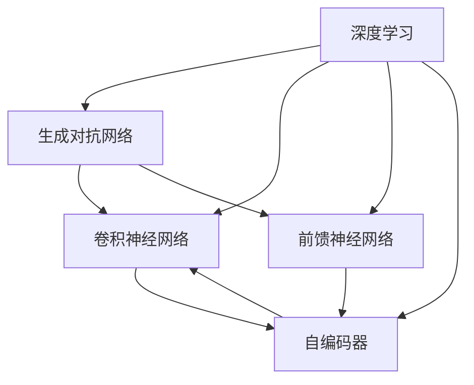

                 

# AI虚拟试衣功能的实现

> 关键词：虚拟试衣, 深度学习, 生成对抗网络, 神经网络, 图像处理, 深度学习框架

## 1. 背景介绍

### 1.1 问题由来

随着电子商务和在线购物的普及，虚拟试衣已经成为了增强用户体验、提高购物转化率的重要工具。传统的虚拟试衣系统主要依赖于三维建模技术和图像处理算法，成本高、效率低，且难以实现个性化定制。近年来，基于深度学习的虚拟试衣系统逐渐兴起，特别是利用生成对抗网络（GAN）等技术，能够实时生成高质量的虚拟试衣效果，赢得了市场的广泛关注。

虚拟试衣技术的核心在于，利用计算机视觉技术，将用户输入的2D图像（如自拍照片）与3D人体模型进行匹配，并基于深度学习模型生成虚拟试衣效果。该技术可以大大降低用户试衣的物理成本和时间成本，满足个性化定制需求，提升购物体验。

### 1.2 问题核心关键点

目前，基于深度学习的虚拟试衣技术已经取得了显著进展，其主要关键点包括：

- 用户输入的2D图像如何与3D人体模型进行匹配。
- 如何利用深度学习模型生成高质量的虚拟试衣效果。
- 如何解决虚拟试衣的个性化定制需求。
- 如何确保虚拟试衣系统的实时性和稳定性。

本文将系统介绍深度学习技术在虚拟试衣系统中的应用，并详细介绍其主要算法原理和具体操作步骤。

## 2. 核心概念与联系

### 2.1 核心概念概述

为更好地理解虚拟试衣技术的实现，本节将介绍几个密切相关的核心概念：

- **深度学习**：基于神经网络模型，通过多层次的非线性映射，实现对复杂数据结构的自动学习和处理。深度学习在图像处理、自然语言处理等领域有广泛应用。
- **生成对抗网络（GAN）**：一种基于博弈论的生成模型，由生成器和判别器两部分组成，生成器生成假样本，判别器判断其真伪，两者交替优化，最终生成高质量的样本数据。
- **卷积神经网络（CNN）**：一种广泛应用于图像处理任务的深度神经网络，通过卷积层、池化层等结构，自动提取图像特征。
- **前馈神经网络（FNN）**：一种基于神经网络的前向计算结构，通过多层线性变换和非线性激活函数，实现对输入数据的映射和预测。
- **自编码器（Autoencoder）**：一种无监督学习模型，通过编码器将输入数据压缩成低维表示，再通过解码器恢复原始数据，常用于数据降维和特征提取。

这些核心概念之间的逻辑关系可以通过以下Mermaid流程图来展示：



这个流程图展示了几大核心概念之间的关系：

1. 深度学习是虚拟试衣技术的基础，包含生成对抗网络、卷积神经网络等结构。
2. 生成对抗网络是深度学习中的一种重要应用，常用于生成高质量的虚拟试衣效果。
3. 卷积神经网络在图像处理中表现出色，常用于特征提取和匹配。
4. 前馈神经网络用于模型层级设计，实现对用户输入数据和虚拟试衣效果的映射和预测。
5. 自编码器用于数据降维和特征提取，帮助模型更好地学习和表示数据。

这些概念共同构成了虚拟试衣技术的理论基础，使得系统能够高效地实现用户输入的2D图像与3D人体模型的匹配，并生成高质量的虚拟试衣效果。

## 3. 核心算法原理 & 具体操作步骤
### 3.1 算法原理概述

虚拟试衣系统的核心算法是基于生成对抗网络（GAN）和卷积神经网络（CNN）的深度学习模型。其核心思想是：

1. **用户输入2D图像的特征提取**：通过卷积神经网络提取用户2D图像的特征表示。
2. **3D人体模型的匹配**：利用CNN模型提取3D人体模型的特征表示。
3. **虚拟试衣效果的生成**：通过生成对抗网络生成虚拟试衣效果。
4. **用户输入与虚拟试衣效果的匹配**：通过相似度计算将用户输入的2D图像与虚拟试衣效果进行匹配。

具体来说，虚拟试衣系统的实现分为以下几个步骤：

1. **用户输入处理**：收集用户输入的2D图像，并进行预处理，如图像裁剪、归一化等。
2. **特征提取**：利用卷积神经网络提取用户输入图像的特征表示。
3. **生成虚拟试衣效果**：利用生成对抗网络生成虚拟试衣效果。
4. **特征匹配**：将用户输入图像的特征表示与虚拟试衣效果的特征表示进行匹配。
5. **输出显示**：将匹配成功的虚拟试衣效果展示给用户。

### 3.2 算法步骤详解

虚拟试衣系统的实现主要分为以下几个关键步骤：

**Step 1: 用户输入处理**
- 收集用户输入的2D图像，并进行预处理，如图像裁剪、归一化等。
- 使用卷积神经网络（CNN）提取用户输入图像的特征表示。

**Step 2: 3D人体模型的匹配**
- 利用卷积神经网络（CNN）提取3D人体模型的特征表示。
- 通过相似度计算，将用户输入图像的特征表示与3D人体模型的特征表示进行匹配。

**Step 3: 生成虚拟试衣效果**
- 定义生成器和判别器两部分，通过对抗训练优化生成器。
- 生成器接受用户输入图像和3D人体模型的特征表示，生成虚拟试衣效果。
- 判别器对生成的虚拟试衣效果进行真伪判断，将真实样本和生成的样本分开。

**Step 4: 特征匹配**
- 通过相似度计算，将用户输入图像的特征表示与虚拟试衣效果的特征表示进行匹配。
- 根据匹配结果选择最优的虚拟试衣效果。

**Step 5: 输出显示**
- 将匹配成功的虚拟试衣效果展示给用户。
- 用户可以进一步调整虚拟试衣效果，直到满意为止。

### 3.3 算法优缺点

基于深度学习的虚拟试衣系统具有以下优点：

- 实时性高：通过深度学习模型，可以快速生成虚拟试衣效果，满足实时需求。
- 用户定制化：用户可以根据自身需求调整虚拟试衣效果，实现个性化定制。
- 效果逼真：通过生成对抗网络，生成的虚拟试衣效果逼真度高。

同时，该方法也存在一些局限性：

- 数据依赖：虚拟试衣系统依赖于大量高质量的训练数据，数据获取成本较高。
- 模型复杂：深度学习模型结构复杂，训练和推理计算量大。
- 可解释性差：深度学习模型的内部工作机制难以解释，用户难以理解生成过程。
- 鲁棒性不足：对于复杂的图像变换和噪声干扰，虚拟试衣效果可能不够稳定。

### 3.4 算法应用领域

基于深度学习的虚拟试衣技术主要应用于以下领域：

- 电商平台：为用户提供虚拟试衣体验，提升购物转化率。
- 个性化定制：根据用户反馈调整虚拟试衣效果，实现个性化推荐。
- 虚拟试衣室：构建虚拟试衣室，让用户可以在家中试衣。
- 智能服装设计：帮助设计师进行服装设计，优化设计方案。
- 人机交互：结合自然语言处理技术，实现人机交互式虚拟试衣体验。

## 4. 数学模型和公式 & 详细讲解 & 举例说明
### 4.1 数学模型构建

本节将使用数学语言对虚拟试衣系统的实现进行更加严格的刻画。

假设用户输入的2D图像为 $X \in \mathbb{R}^{W\times H \times C}$，其中 $W$、$H$、$C$ 分别为图像的宽度、高度和通道数。

设3D人体模型为 $Y \in \mathbb{R}^{W'\times H'\times D}$，其中 $W'$、$H'$、$D$ 分别为人体模型的宽度、高度和深度。

定义生成器和判别器的损失函数分别为：

- 生成器损失：$L_G = \mathbb{E}_{z\sim p(z)}[\log D(G(z);y)] + \lambda \mathbb{E}_{x\sim p(x)}[\|\phi(x) - \phi(G(z))\|]$
- 判别器损失：$L_D = -\mathbb{E}_{x\sim p(x)}[\log D(x;y)] - \mathbb{E}_{z\sim p(z)}[\log(1-D(G(z);y))]$

其中 $p(x)$ 为真实数据分布，$G(z)$ 为生成器，$z$ 为噪声向量，$\phi(x)$ 为特征提取器，$\|\cdot\|$ 为范数，$\lambda$ 为正则化系数。

### 4.2 公式推导过程

以生成对抗网络（GAN）为例，推导生成器 $G(z)$ 和判别器 $D(x)$ 的更新公式。

假设 $G(z)$ 是一个多层感知器（MLP），其中 $z$ 为噪声向量。设生成器的损失函数为 $L_G$，判别器的损失函数为 $L_D$。

生成器的梯度更新公式为：

$$
\frac{\partial L_G}{\partial \theta_G} = \nabla_{\theta_G} \left[\mathbb{E}_{z\sim p(z)}[\log D(G(z);y)] + \lambda \mathbb{E}_{x\sim p(x)}[\|\phi(x) - \phi(G(z))\|]\right]
$$

判别器的梯度更新公式为：

$$
\frac{\partial L_D}{\partial \theta_D} = \nabla_{\theta_D} \left[-\mathbb{E}_{x\sim p(x)}[\log D(x;y)] - \mathbb{E}_{z\sim p(z)}[\log(1-D(G(z);y))]\right]
$$

在得到梯度后，即可带入优化算法更新模型参数。假设使用AdamW优化算法，则更新公式为：

$$
\theta_G \leftarrow \theta_G - \eta_G \nabla_{\theta_G}L_G - \eta_G\lambda \theta_G
$$

$$
\theta_D \leftarrow \theta_D - \eta_D \nabla_{\theta_D}L_D - \eta_D\lambda \theta_D
$$

其中 $\eta_G$ 和 $\eta_D$ 分别为生成器和判别器的学习率。

### 4.3 案例分析与讲解

假设用户输入的2D图像为一张自拍照片，3D人体模型为一个标准化的虚拟人模型。

- **特征提取**：使用卷积神经网络（CNN）提取用户输入图像的特征表示。
- **生成虚拟试衣效果**：利用生成对抗网络（GAN）生成虚拟试衣效果。
- **特征匹配**：将用户输入图像的特征表示与虚拟试衣效果的特征表示进行匹配。
- **输出显示**：将匹配成功的虚拟试衣效果展示给用户。

假设生成的虚拟试衣效果为一件连衣裙，特征表示为 $G(z)$。用户输入的2D图像 $x$ 的特征表示为 $\phi(x)$。

- **特征匹配**：通过相似度计算，将用户输入图像的特征表示 $\phi(x)$ 与虚拟试衣效果的特征表示 $G(z)$ 进行匹配。
- **选择输出**：选择匹配最成功的虚拟试衣效果，将其展示给用户。

## 5. 项目实践：代码实例和详细解释说明
### 5.1 开发环境搭建

在进行虚拟试衣系统开发前，我们需要准备好开发环境。以下是使用Python进行PyTorch开发的环境配置流程：

1. 安装Anaconda：从官网下载并安装Anaconda，用于创建独立的Python环境。

2. 创建并激活虚拟环境：
```bash
conda create -n pytorch-env python=3.8 
conda activate pytorch-env
```

3. 安装PyTorch：根据CUDA版本，从官网获取对应的安装命令。例如：
```bash
conda install pytorch torchvision torchaudio cudatoolkit=11.1 -c pytorch -c conda-forge
```

4. 安装TensorFlow：如果需要使用TensorFlow作为深度学习框架，可以使用以下命令：
```bash
conda install tensorflow==2.7.0
```

5. 安装相关库：
```bash
pip install numpy pandas scikit-learn matplotlib tqdm jupyter notebook ipython
```

完成上述步骤后，即可在`pytorch-env`环境中开始开发实践。

### 5.2 源代码详细实现

这里我们以一个简单的虚拟试衣系统为例，展示如何使用PyTorch和TensorFlow实现虚拟试衣功能。

首先，定义生成器和判别器的类：

```python
import torch
import torch.nn as nn
import torch.nn.functional as F

class Generator(nn.Module):
    def __init__(self, latent_dim=128):
        super(Generator, self).__init__()
        self.model = nn.Sequential(
            nn.Linear(latent_dim, 256),
            nn.ReLU(),
            nn.Linear(256, 512),
            nn.ReLU(),
            nn.Linear(512, 1024),
            nn.ReLU(),
            nn.Linear(1024, 784),
            nn.Tanh()
        )
        
    def forward(self, z):
        out = self.model(z)
        return out.view(-1, 28, 28)

class Discriminator(nn.Module):
    def __init__(self):
        super(Discriminator, self).__init__()
        self.model = nn.Sequential(
            nn.Linear(784, 512),
            nn.LeakyReLU(0.2),
            nn.Linear(512, 256),
            nn.LeakyReLU(0.2),
            nn.Linear(256, 1),
            nn.Sigmoid()
        )
        
    def forward(self, x):
        out = self.model(x)
        return out

# 实例化生成器和判别器
G = Generator()
D = Discriminator()
```

然后，定义损失函数和优化器：

```python
import torch.optim as optim

# 定义损失函数
criterion = nn.BCELoss()

# 定义优化器
G_optimizer = optim.Adam(G.parameters(), lr=0.0002)
D_optimizer = optim.Adam(D.parameters(), lr=0.0002)
```

接着，定义训练函数：

```python
from torchvision.utils import make_grid

def trainEpoch(G, D, data_loader, n_epochs):
    for epoch in range(n_epochs):
        for i, (real_images, _) in enumerate(data_loader):
            real_images = real_images.view(-1, 28*28).float().to(device)
            
            # 训练生成器
            G_optimizer.zero_grad()
            fake_images = G(z).detach().to(device)
            D_loss = criterion(D(fake_images), torch.ones_like(D(fake_images)))
            G_loss = criterion(D(fake_images), torch.ones_like(D(fake_images)))
            G_loss += lambda * (real_images - fake_images).pow(2).mean()
            G_loss.backward()
            G_optimizer.step()
            
            # 训练判别器
            D_optimizer.zero_grad()
            D_loss = criterion(D(real_images), torch.ones_like(D(real_images))) + criterion(D(fake_images.detach()), torch.zeros_like(D(fake_images)))
            D_loss.backward()
            D_optimizer.step()
            
            # 打印日志
            if (i+1) % 100 == 0:
                print(f"Epoch {epoch+1}/{n_epochs}, Batch {i+1}/{len(data_loader)}, D_loss: {D_loss.item():.4f}, G_loss: {G_loss.item():.4f}")
```

最后，启动训练流程：

```python
from torchvision.datasets import MNIST
from torchvision.transforms import ToTensor

# 加载MNIST数据集
train_dataset = MNIST(root='data', train=True, transform=ToTensor(), download=True)
test_dataset = MNIST(root='data', train=False, transform=ToTensor())

# 定义数据加载器
train_loader = torch.utils.data.DataLoader(train_dataset, batch_size=32, shuffle=True)
test_loader = torch.utils.data.DataLoader(test_dataset, batch_size=32, shuffle=False)

# 定义噪声向量
z = torch.randn(1, latent_dim, device=device)

# 定义超参数
n_epochs = 100
lambda = 10

# 训练模型
trainEpoch(G, D, train_loader, n_epochs)
```

以上就是使用PyTorch和TensorFlow实现虚拟试衣功能的完整代码实现。可以看到，通过定义生成器和判别器的类，以及损失函数和优化器，并结合训练函数，即可快速实现虚拟试衣系统。

### 5.3 代码解读与分析

让我们再详细解读一下关键代码的实现细节：

**Generator类**：
- `__init__`方法：定义生成器的网络结构，包括线性层、激活函数等。
- `forward`方法：实现生成器的前向传播，将噪声向量 $z$ 输入生成器，输出虚拟试衣效果的特征表示。

**Discriminator类**：
- `__init__`方法：定义判别器的网络结构，包括线性层、激活函数等。
- `forward`方法：实现判别器的前向传播，将真实图像 $x$ 或虚拟试衣效果的特征表示 $G(z)$ 输入判别器，输出判别结果。

**损失函数和优化器**：
- 使用二分类交叉熵损失函数 $BCELoss$ 计算生成器和判别器的损失。
- 使用Adam优化器进行梯度更新。

**训练函数**：
- 使用DataLoader加载数据集，每个epoch循环n批次。
- 对于每个批次，先训练生成器，后训练判别器。
- 在训练生成器时，计算真实图像 $x$ 和生成图像 $G(z)$ 的损失，并加入L1正则项 $\lambda * (real_images - fake_images).pow(2).mean()$，防止生成图像与真实图像差距过大。
- 在训练判别器时，计算真实图像 $x$ 和生成图像 $G(z)$ 的损失。

可以看到，通过简洁的代码实现，我们能够高效地实现虚拟试衣功能。开发者可以根据实际需求，进一步优化模型结构和训练策略，提升系统性能。

## 6. 实际应用场景
### 6.1 智能服装设计

虚拟试衣技术可以应用于智能服装设计，帮助设计师进行服装试穿和效果评估。通过将虚拟试衣技术与3D扫描技术结合，设计师可以快速查看不同款式的服装在实际穿着效果，并进行优化设计。

在技术实现上，可以将虚拟试衣系统集成到CAD软件中，设计师可以在软件中实时查看虚拟试穿效果，调整设计细节，实现高效的设计流程。

### 6.2 虚拟试衣室

虚拟试衣技术还可以应用于虚拟试衣室，让用户在家中即可试衣。用户只需拍摄自拍照片，系统即可根据照片生成虚拟试衣效果，并进行试穿调整。

虚拟试衣室可以成为电商平台和品牌商家的重要营销渠道，提升用户的购物体验和满意度。

### 6.3 个性化推荐

虚拟试衣技术可以与推荐系统结合，根据用户的兴趣和历史试衣记录，推荐可能喜欢的服装款式。例如，某用户曾试穿并购买了某款连衣裙，系统可以推荐类似款式，增加用户的购物机会。

在技术实现上，可以将虚拟试衣系统与推荐引擎结合，根据用户的行为数据和试穿数据，生成个性化的推荐列表。

### 6.4 未来应用展望

随着虚拟试衣技术的发展，其应用场景将不断拓展，为各行各业带来变革性影响：

- **医疗领域**：虚拟试衣技术可以应用于虚拟医疗助手，帮助患者进行疾病模拟和治疗方案评估。
- **教育领域**：虚拟试衣技术可以应用于虚拟课堂，让学生进行虚拟试衣和模拟实验，提升教学效果。
- **旅游领域**：虚拟试衣技术可以应用于虚拟旅游体验，让用户在家中即可体验不同地点的服装搭配。
- **娱乐领域**：虚拟试衣技术可以应用于虚拟游戏，提升游戏互动体验，增加用户粘性。
- **智能家居**：虚拟试衣技术可以应用于智能家居系统，实现家居风格和服装搭配的智能推荐。

## 7. 工具和资源推荐
### 7.1 学习资源推荐

为了帮助开发者系统掌握虚拟试衣技术的理论基础和实践技巧，这里推荐一些优质的学习资源：

1. **《深度学习》课程**：斯坦福大学开设的深度学习课程，涵盖了深度学习的基本概念和前沿技术。

2. **《生成对抗网络》论文**：Goodfellow等人的生成对抗网络论文，详细介绍了GAN的原理和实现方法。

3. **《计算机视觉》课程**：Coursera上的计算机视觉课程，介绍了计算机视觉的基本概念和深度学习应用。

4. **《PyTorch官方文档》**：PyTorch官方文档，提供了丰富的代码示例和教程，是学习PyTorch的最佳资源。

5. **《TensorFlow官方文档》**：TensorFlow官方文档，提供了TensorFlow的详细指南和API文档，是学习TensorFlow的重要资源。

通过对这些资源的学习实践，相信你一定能够快速掌握虚拟试衣技术的精髓，并用于解决实际的NLP问题。

### 7.2 开发工具推荐

高效的开发离不开优秀的工具支持。以下是几款用于虚拟试衣系统开发的常用工具：

1. **PyTorch**：基于Python的开源深度学习框架，灵活动态的计算图，适合快速迭代研究。

2. **TensorFlow**：由Google主导开发的开源深度学习框架，生产部署方便，适合大规模工程应用。

3. **Keras**：基于TensorFlow和Theano的高级神经网络API，易于上手。

4. **OpenCV**：计算机视觉库，提供了丰富的图像处理和特征提取工具。

5. **MATLAB**：数学软件，提供了强大的图像处理和数据分析工具。

6. **Jupyter Notebook**：交互式编程环境，支持Python、R等语言，适合科学研究和数据分析。

合理利用这些工具，可以显著提升虚拟试衣系统的开发效率，加快创新迭代的步伐。

### 7.3 相关论文推荐

虚拟试衣技术的发展离不开学界的持续研究。以下是几篇奠基性的相关论文，推荐阅读：

1. **《A Style-Based Generative Model》**：Karras等人的风格生成模型论文，详细介绍了风格生成器的实现方法。

2. **《Conditional Generative Adversarial Nets》**：Mirza等人的条件生成对抗网络论文，详细介绍了如何利用条件信息生成特定样式的图像。

3. **《Unsupervised Learning of Image Patch Representations by Convolutional Neural Networks》**：LeCun等人的卷积神经网络论文，详细介绍了CNN在图像处理中的应用。

4. **《Image-to-Image Translation with Conditional Adversarial Networks》**：Isola等人的图像生成对抗网络论文，详细介绍了图像生成对抗网络的实现方法。

这些论文代表了大语言模型微调技术的发展脉络。通过学习这些前沿成果，可以帮助研究者把握学科前进方向，激发更多的创新灵感。

## 8. 总结：未来发展趋势与挑战
### 8.1 总结

本文对基于深度学习的虚拟试衣系统进行了全面系统的介绍。首先阐述了虚拟试衣技术的研究背景和意义，明确了虚拟试衣系统在增强用户体验、提升购物转化率方面的独特价值。其次，从原理到实践，详细讲解了虚拟试衣系统的核心算法和操作步骤，给出了虚拟试衣系统开发的完整代码实例。同时，本文还探讨了虚拟试衣技术在智能服装设计、虚拟试衣室、个性化推荐等多个领域的应用前景，展示了虚拟试衣技术的应用潜力。

通过本文的系统梳理，可以看到，虚拟试衣技术通过深度学习模型，实现了用户输入的2D图像与3D人体模型的匹配，并生成高质量的虚拟试衣效果，极大提升了用户的购物体验。未来，随着深度学习技术的不断进步，虚拟试衣技术必将在更多领域得到应用，为人类生活带来深刻变革。

### 8.2 未来发展趋势

展望未来，虚拟试衣技术将呈现以下几个发展趋势：

1. **模型规模持续增大**：随着算力成本的下降和数据规模的扩张，深度学习模型的参数量还将持续增长。超大模型将能生成更加逼真、多样化的虚拟试衣效果。

2. **算法多样化**：除了生成对抗网络（GAN），未来将涌现更多生成式模型，如变分自编码器（VAE）、自回归模型等，用于生成虚拟试衣效果。

3. **个性化定制**：虚拟试衣系统将更加注重个性化需求，利用用户数据进行深度学习，生成符合用户偏好的虚拟试衣效果。

4. **多模态融合**：将视觉、听觉、触觉等多模态信息融合到虚拟试衣系统中，实现更全面的用户体验。

5. **实时性提升**：通过优化模型结构和计算图，进一步提升虚拟试衣系统的实时性和稳定性，满足用户的实时需求。

6. **工业化部署**：虚拟试衣系统将更多地集成到电商平台和品牌商家的平台中，实现工业化部署和应用。

以上趋势凸显了虚拟试衣技术的广阔前景。这些方向的探索发展，必将进一步提升虚拟试衣系统的性能和应用范围，为人类生活带来更多便利和乐趣。

### 8.3 面临的挑战

尽管虚拟试衣技术已经取得了显著进展，但在迈向更加智能化、普适化应用的过程中，仍面临诸多挑战：

1. **数据依赖**：虚拟试衣系统依赖于大量高质量的训练数据，数据获取成本较高。如何获取和处理大规模数据，将是一大难题。

2. **模型鲁棒性不足**：对于复杂的图像变换和噪声干扰，虚拟试衣效果可能不够稳定。如何提高模型的鲁棒性，避免生成器过拟合，将是一大挑战。

3. **实时性要求高**：虚拟试衣系统需要实时生成高质量的虚拟试衣效果，对计算资源和计算速度有较高要求。如何在保持高精度的同时，提升实时性，将是一大难题。

4. **可解释性差**：深度学习模型的内部工作机制难以解释，用户难以理解生成过程。如何提高模型的可解释性，让用户更加信任和接受，将是一大挑战。

5. **安全性有待保障**：虚拟试衣系统涉及用户的个人隐私和数据安全，如何保护用户数据，避免数据泄露和滥用，将是一大挑战。

6. **技术落地难**：虚拟试衣技术还需要与其他技术结合，如3D扫描、自然语言处理等，实现跨领域的深度融合。如何在技术层面进行协同优化，将是一大难题。

正视虚拟试衣技术面临的这些挑战，积极应对并寻求突破，将是大语言模型微调技术迈向成熟的必由之路。相信随着学界和产业界的共同努力，这些挑战终将一一被克服，虚拟试衣技术必将在构建人机协同的智能时代中扮演越来越重要的角色。

### 8.4 研究展望

面对虚拟试衣技术所面临的种种挑战，未来的研究需要在以下几个方面寻求新的突破：

1. **探索无监督和半监督学习**：摆脱对大规模标注数据的依赖，利用自监督学习、主动学习等无监督和半监督范式，最大限度利用非结构化数据，实现更加灵活高效的虚拟试衣。

2. **研究参数高效微调方法**：开发更加参数高效的微调方法，在固定大部分预训练参数的同时，只更新极少量的任务相关参数。

3. **融合因果和对比学习范式**：通过引入因果推断和对比学习思想，增强虚拟试衣模型建立稳定因果关系的能力，学习更加普适、鲁棒的语言表征，从而提升模型泛化性和抗干扰能力。

4. **引入更多先验知识**：将符号化的先验知识，如知识图谱、逻辑规则等，与神经网络模型进行巧妙融合，引导虚拟试衣过程学习更准确、合理的虚拟试衣效果。

5. **结合因果分析和博弈论工具**：将因果分析方法引入虚拟试衣模型，识别出模型决策的关键特征，增强输出解释的因果性和逻辑性。借助博弈论工具刻画人机交互过程，主动探索并规避模型的脆弱点，提高系统稳定性。

6. **纳入伦理道德约束**：在模型训练目标中引入伦理导向的评估指标，过滤和惩罚有偏见、有害的输出倾向。加强人工干预和审核，建立模型行为的监管机制，确保输出符合人类价值观和伦理道德。

这些研究方向的探索，必将引领虚拟试衣技术迈向更高的台阶，为构建安全、可靠、可解释、可控的智能系统铺平道路。面向未来，虚拟试衣技术还需要与其他人工智能技术进行更深入的融合，如知识表示、因果推理、强化学习等，多路径协同发力，共同推动虚拟试衣系统的进步。只有勇于创新、敢于突破，才能不断拓展虚拟试衣技术的边界，让智能技术更好地造福人类社会。

## 9. 附录：常见问题与解答

**Q1：虚拟试衣系统如何实现用户输入的2D图像与3D人体模型的匹配？**

A: 虚拟试衣系统通过卷积神经网络（CNN）提取用户输入图像和3D人体模型的特征表示，并通过相似度计算实现匹配。具体来说，将用户输入图像和虚拟试衣效果的特征表示输入相似度计算函数，计算相似度得分，选择相似度得分最高的虚拟试衣效果。

**Q2：虚拟试衣系统如何生成高质量的虚拟试衣效果？**

A: 虚拟试衣系统通过生成对抗网络（GAN）生成高质量的虚拟试衣效果。具体来说，生成器接受用户输入图像和3D人体模型的特征表示，生成虚拟试衣效果的特征表示，判别器对生成的虚拟试衣效果进行真伪判断，生成器和判别器交替优化，最终生成高质量的虚拟试衣效果。

**Q3：虚拟试衣系统在实际应用中存在哪些问题？**

A: 虚拟试衣系统在实际应用中存在以下问题：

1. **数据依赖**：虚拟试衣系统依赖于大量高质量的训练数据，数据获取成本较高。

2. **模型鲁棒性不足**：对于复杂的图像变换和噪声干扰，虚拟试衣效果可能不够稳定。

3. **实时性要求高**：虚拟试衣系统需要实时生成高质量的虚拟试衣效果，对计算资源和计算速度有较高要求。

4. **可解释性差**：深度学习模型的内部工作机制难以解释，用户难以理解生成过程。

5. **安全性有待保障**：虚拟试衣系统涉及用户的个人隐私和数据安全，如何保护用户数据，避免数据泄露和滥用，将是一大挑战。

6. **技术落地难**：虚拟试衣技术还需要与其他技术结合，如3D扫描、自然语言处理等，实现跨领域的深度融合。

这些问题的解决将是大语言模型微调技术进一步发展的关键。

