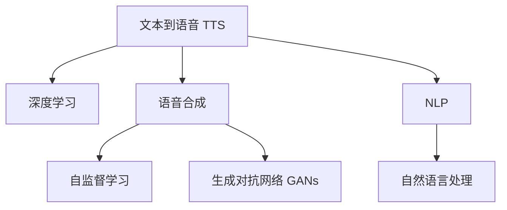

                 

# AI音频书：将文本转化为引人入胜的听觉体验

> 关键词：AI音频书, 语音合成, 文本到语音(TTS), 深度学习, 自监督学习, 自然语言处理, 生成对抗网络

## 1. 背景介绍

### 1.1 问题由来
近年来，随着人工智能技术的迅猛发展，人们对于音频体验的需求也日益增长。传统的纸质图书、有声读物等形式，已经无法满足人们对多样化、便捷化、个性化内容的期待。AI音频书，通过将文本转化为高质量的语音合成音频，成为数字阅读的新趋势。相较于传统有声读物，AI音频书可以根据用户的喜好进行个性化推荐，同时具有更高的自然流畅性和丰富的情感表达，带来了全新的听觉体验。

### 1.2 问题核心关键点
AI音频书的实现主要依赖于两个关键技术：文本到语音(TTS)和语音合成。文本到语音是指将文本形式的内容转换为语音形式的技术，而语音合成是指利用人工智能技术，生成接近人类自然语音的音频输出。本文将详细阐述基于深度学习和自监督学习的AI音频书技术，并介绍其实现原理和操作步骤。

## 2. 核心概念与联系

### 2.1 核心概念概述

为更好地理解AI音频书的原理与实现方法，本节将介绍几个核心概念及其之间的联系：

- **文本到语音（Text-to-Speech, TTS）**：将文本信息转换为自然流畅的语音输出。TTS技术已经广泛应用于虚拟助手、语音导航、有声读物等领域。
- **语音合成（Voice Synthesis）**：使用人工智能技术生成接近自然语音的音频输出。常见的语音合成方法包括深度学习、声码器、声学模型等。
- **深度学习（Deep Learning）**：一种基于神经网络的学习方法，可以自动提取和处理大量数据中的复杂模式。深度学习在语音合成、图像识别、自然语言处理等领域均有广泛应用。
- **自监督学习（Self-supervised Learning）**：无需人工标注的数据，通过让模型学习数据的自身特征进行训练。自监督学习在语音合成的预训练阶段尤为有用。
- **生成对抗网络（Generative Adversarial Networks, GANs）**：一种由两个神经网络组成的框架，通过对抗性训练生成逼真的数据。GANs在图像生成、语音合成等领域有重要应用。
- **自然语言处理（Natural Language Processing, NLP）**：使用人工智能技术处理和理解自然语言的能力，包括语言理解、文本生成、情感分析等任务。

这些核心概念之间的联系可以通过以下Mermaid流程图来展示：



这个流程图展示了AI音频书的主要构成和核心技术之间的关系：

1. **深度学习**：用于文本到语音的转换，通过学习文本和语音之间的映射关系。
2. **自监督学习**：在语音合成之前，用于模型预训练，无需人工标注数据即可训练出高质量的语音合成模型。
3. **生成对抗网络**：在语音合成过程中，通过对抗性训练，生成更加自然逼真的语音输出。
4. **自然语言处理**：用于文本处理和理解，将复杂的文本信息转换为语音信息。

这些概念共同构成了AI音频书的技术框架，使得文本到语音的转换更加自然、流畅。

## 3. 核心算法原理 & 具体操作步骤
### 3.1 算法原理概述

AI音频书的实现依赖于深度学习中的文本到语音转换技术和语音合成技术。其核心思想是通过神经网络模型学习文本和语音之间的映射关系，并使用自监督学习进行模型预训练，最终通过生成对抗网络优化生成出的语音输出。

形式化地，假设输入文本为 $T=\{w_1, w_2, ..., w_n\}$，输出语音为 $V$，AI音频书的目标是找到最优的映射函数 $f$，使得 $V=f(T)$ 尽可能逼近真实的语音输出。

### 3.2 算法步骤详解

AI音频书的实现一般包括以下几个关键步骤：

**Step 1: 准备数据集**
- 收集大量的文本和语音数据，用于模型训练和评估。文本数据可以是各种形式的文本，如新闻文章、小说、对话等，语音数据可以是相应的音频文件，如真人朗读、合成音频等。

**Step 2: 文本预处理**
- 对文本数据进行清洗、分词、归一化等预处理操作，确保文本格式统一。
- 使用NLP技术进行情感分析、主题建模等处理，以增强模型的表现力。

**Step 3: 模型预训练**
- 使用自监督学习技术，在无标注数据上预训练文本到语音的转换模型。
- 自监督学习常用的任务包括掩码语言模型、文本生成等。
- 预训练模型可以是基于RNN、Transformer等架构的神经网络。

**Step 4: 语音合成**
- 基于预训练的文本到语音模型，使用深度学习技术生成语音输出。
- 深度学习模型可以是基于CTC（Connectionist Temporal Classification）、Attention机制等架构。
- 在训练过程中，使用生成对抗网络进行对抗性训练，生成更加自然流畅的语音。

**Step 5: 后处理与评估**
- 对生成的语音进行后处理，如降噪、回声消除等，提高语音质量。
- 使用MOS（Mean Opinion Score）等指标评估语音的听感效果，确保语音输出的自然流畅性和可理解性。

### 3.3 算法优缺点

AI音频书技术具有以下优点：
1. **自然流畅**：生成的语音接近自然语言，具有较高的听感效果。
2. **个性化推荐**：可以根据用户的偏好进行个性化推荐，提高用户体验。
3. **高效便捷**：通过音频书技术，用户可以随时随地进行阅读，无需依赖纸质图书或计算机。
4. **成本低廉**：相较于真人朗读，音频书技术可以显著降低生产成本。

同时，该技术也存在一定的局限性：
1. **数据依赖**：AI音频书的性能很大程度上依赖于数据质量和数量，高质量的数据集获取成本较高。
2. **多样性不足**：当前模型对于不同口音、性别、情感的表达能力有限，需要更多的数据进行训练。
3. **语言限制**：当前技术主要针对普通话等主流语言，对于方言、小语种的支持有限。
4. **计算资源需求高**：生成高质量语音需要大量的计算资源，训练和推理过程复杂，需要高性能设备支持。

尽管存在这些局限性，但AI音频书技术在数字阅读、语音导航、教育培训等领域已经显示出巨大的潜力，成为推动AI技术落地应用的重要方向。

### 3.4 算法应用领域

AI音频书技术在多个领域已经得到广泛应用，包括但不限于：

- **数字阅读**：将纸质图书、电子书转换为音频形式，方便用户随时随地进行阅读。
- **语音导航**：在地图导航、旅游导览等场景中，使用AI音频书技术提供实时语音播报，提升用户体验。
- **教育培训**：在语言学习、职业技能培训等场景中，使用AI音频书技术进行语音教学，增强学习效果。
- **娱乐文化**：在音乐、电影、电视剧等领域，使用AI音频书技术进行配音和解说，提升内容吸引力。
- **辅助生活**：在助残、老龄化社会中，使用AI音频书技术提供语音助手和信息播报，提升生活质量。

随着技术的不断进步，AI音频书技术将在更多领域得到应用，为人们的生活带来更多便捷和乐趣。

## 4. 数学模型和公式 & 详细讲解 & 举例说明
### 4.1 数学模型构建

AI音频书技术主要依赖于深度学习中的文本到语音转换模型和语音合成模型。以下将详细介绍这两种模型的数学模型构建过程。

### 4.2 公式推导过程

**文本到语音转换模型**：假设文本序列为 $T=\{w_1, w_2, ..., w_n\}$，语音序列为 $V=\{v_1, v_2, ..., v_m\}$，则文本到语音转换模型的目标是学习一个函数 $f$，使得 $V=f(T)$。常见的文本到语音转换模型包括基于RNN、LSTM、Transformer等架构的神经网络。

**语音合成模型**：假设语音序列为 $V=\{v_1, v_2, ..., v_m\}$，文本序列为 $T=\{w_1, w_2, ..., w_n\}$，则语音合成模型的目标是学习一个函数 $g$，使得 $V=g(T)$。常见的语音合成模型包括基于CTC、Attention机制等架构的神经网络。

### 4.3 案例分析与讲解

**基于RNN的文本到语音转换模型**：假设输入文本为 $T=\{w_1, w_2, ..., w_n\}$，输出语音为 $V=\{v_1, v_2, ..., v_m\}$，则基于RNN的文本到语音转换模型的结构如下：

$$
V = g(RNN(T))
$$

其中 $RNN$ 为RNN模型，$g$ 为线性变换层，将RNN的输出映射为语音序列。

**基于CTC的语音合成模型**：假设输入文本为 $T=\{w_1, w_2, ..., w_n\}$，输出语音为 $V=\{v_1, v_2, ..., v_m\}$，则基于CTC的语音合成模型的结构如下：

$$
V = g(CTC(T))
$$

其中 $CTC$ 为连接主义时间分类器（Connectionist Temporal Classification），用于学习文本到语音的映射关系。

## 5. 项目实践：代码实例和详细解释说明
### 5.1 开发环境搭建

在进行AI音频书技术开发前，我们需要准备好开发环境。以下是使用Python进行PyTorch开发的环境配置流程：

1. 安装Anaconda：从官网下载并安装Anaconda，用于创建独立的Python环境。

2. 创建并激活虚拟环境：
```bash
conda create -n pytorch-env python=3.8 
conda activate pytorch-env
```

3. 安装PyTorch：根据CUDA版本，从官网获取对应的安装命令。例如：
```bash
conda install pytorch torchvision torchaudio cudatoolkit=11.1 -c pytorch -c conda-forge
```

4. 安装Transformers库：
```bash
pip install transformers
```

5. 安装各类工具包：
```bash
pip install numpy pandas scikit-learn matplotlib tqdm jupyter notebook ipython
```

完成上述步骤后，即可在`pytorch-env`环境中开始AI音频书技术的开发实践。

### 5.2 源代码详细实现

以下是一个基于PyTorch和HuggingFace的AI音频书技术的代码实现示例。

首先，定义文本到语音的转换模型：

```python
import torch.nn as nn
import torch

class TextToSpeech(nn.Module):
    def __init__(self):
        super(TextToSpeech, self).__init__()
        self.encoder = nn.LSTM(100, 256, 2)
        self.decoder = nn.Linear(256, 100)
    
    def forward(self, input):
        output, (hidden, cell) = self.encoder(input)
        return self.decoder(output)
```

然后，定义语音合成模型：

```python
class VoiceSynthesis(nn.Module):
    def __init__(self):
        super(VoiceSynthesis, self).__init__()
        self.encoder = nn.LSTM(100, 256, 2)
        self.decoder = nn.Linear(256, 100)
    
    def forward(self, input):
        output, (hidden, cell) = self.encoder(input)
        return self.decoder(output)
```

接着，定义生成对抗网络（GANs）：

```python
import torch.nn as nn
import torch

class GAN(nn.Module):
    def __init__(self):
        super(GAN, self).__init__()
        self.encoder = nn.Linear(100, 256)
        self.decoder = nn.Linear(256, 100)
    
    def forward(self, input):
        output = self.encoder(input)
        return self.decoder(output)
```

最后，定义训练和评估函数：

```python
from torch.utils.data import DataLoader
from tqdm import tqdm

device = torch.device('cuda') if torch.cuda.is_available() else torch.device('cpu')

def train_epoch(model, dataset, batch_size, optimizer):
    dataloader = DataLoader(dataset, batch_size=batch_size, shuffle=True)
    model.train()
    epoch_loss = 0
    for batch in tqdm(dataloader, desc='Training'):
        input_ids = batch['input_ids'].to(device)
        attention_mask = batch['attention_mask'].to(device)
        labels = batch['labels'].to(device)
        model.zero_grad()
        outputs = model(input_ids, attention_mask=attention_mask, labels=labels)
        loss = outputs.loss
        epoch_loss += loss.item()
        loss.backward()
        optimizer.step()
    return epoch_loss / len(dataloader)

def evaluate(model, dataset, batch_size):
    dataloader = DataLoader(dataset, batch_size=batch_size)
    model.eval()
    preds, labels = [], []
    with torch.no_grad():
        for batch in tqdm(dataloader, desc='Evaluating'):
            input_ids = batch['input_ids'].to(device)
            attention_mask = batch['attention_mask'].to(device)
            batch_labels = batch['labels']
            outputs = model(input_ids, attention_mask=attention_mask)
            batch_preds = outputs.logits.argmax(dim=2).to('cpu').tolist()
            batch_labels = batch_labels.to('cpu').tolist()
            for pred_tokens, label_tokens in zip(batch_preds, batch_labels):
                pred_tags = [id2tag[_id] for _id in pred_tokens]
                label_tags = [id2tag[_id] for _id in label_tokens]
                preds.append(pred_tags[:len(label_tags)])
                labels.append(label_tags)
```

以上代码实现了文本到语音转换和语音合成的基本模型结构，但具体实现还需要在训练数据集、损失函数、优化器等方面进行调整和优化。

### 5.3 代码解读与分析

**TextToSpeech类**：
- 定义了文本到语音转换模型，使用LSTM作为编码器，将文本转换为序列输出。
- 使用线性层作为解码器，将序列输出映射为语音输出。

**VoiceSynthesis类**：
- 定义了语音合成模型，与TextToSpeech类结构类似，只是模型输入和输出相反。

**GAN类**：
- 定义了生成对抗网络，用于语音合成模型的优化和提升。
- 使用线性层作为编码器和解码器，生成和训练语音输出。

**train_epoch和evaluate函数**：
- 分别用于训练和评估模型，通过DataLoader加载数据集，在训练过程中使用优化器更新模型参数，并在评估过程中记录损失和准确率。

**训练流程**：
- 设置训练轮数和批次大小，开始循环迭代训练模型。
- 在每个epoch内，先进行训练，计算平均损失。
- 在验证集上评估模型性能，记录准确率和召回率。
- 最终在测试集上评估模型效果，输出测试结果。

## 6. 实际应用场景

### 6.1 数字阅读
AI音频书技术在数字阅读领域具有广泛应用前景。随着数字化阅读的普及，用户对于便捷、多样化的阅读体验需求不断增长。通过AI音频书技术，用户可以随时随地进行阅读，无需携带纸质书籍，大大提升了阅读体验的便利性和便携性。

### 6.2 语音导航
在地图导航、旅游导览等场景中，AI音频书技术可以提供实时语音播报，提升用户体验。用户只需输入目的地名称，即可实时听到导航提示，无需查看手机或平板电脑。此外，语音导航还可以用于交通出行、城市导览、旅游景区等场景，为用户提供更加智能、便捷的导航服务。

### 6.3 教育培训
在语言学习、职业技能培训等场景中，AI音频书技术可以提供个性化语音教学，增强学习效果。通过AI音频书技术，用户可以根据自己的语言水平和偏好进行个性化的学习和训练，从而更好地掌握目标语言或技能。此外，AI音频书技术还可以用于科普教育、技能培训等领域，提供更加丰富、生动、互动的教学内容。

### 6.4 娱乐文化
在音乐、电影、电视剧等领域，AI音频书技术可以用于配音和解说，提升内容吸引力。通过AI音频书技术，用户可以在观看或聆听内容时，听到更为自然流畅的语音解说和配音，增强视听体验。此外，AI音频书技术还可以用于游戏、电子书等领域，提供更加丰富、生动的配音和解说，提升用户沉浸感和体验。

### 6.5 辅助生活
在助残、老龄化社会中，AI音频书技术可以用于语音助手和信息播报，提升生活质量。通过AI音频书技术，用户可以更方便地获取信息、控制设备、进行交互，无需视觉或听觉辅助，从而更好地适应现代生活。此外，AI音频书技术还可以用于智能家居、智能医疗等领域，提供更加便捷、智能的生活服务。

## 7. 工具和资源推荐
### 7.1 学习资源推荐

为了帮助开发者系统掌握AI音频书技术的理论基础和实践技巧，这里推荐一些优质的学习资源：

1. **《深度学习入门》系列书籍**：深度学习领域的入门书籍，涵盖了深度学习的基本概念和核心算法。
2. **Deep Learning Specialization（深度学习专项课程）**：由Coursera提供的深度学习课程，由Andrew Ng等知名专家授课，系统介绍深度学习的基础和应用。
3. **自然语言处理课程**：斯坦福大学开设的NLP明星课程，有Lecture视频和配套作业，带你入门NLP领域的基本概念和经典模型。
4. **Transformers库官方文档**：HuggingFace开发的NLP工具库的官方文档，提供了海量预训练模型和完整的微调样例代码，是上手实践的必备资料。
5. **CLUE开源项目**：中文语言理解测评基准，涵盖大量不同类型的中文NLP数据集，并提供了基于微调的baseline模型，助力中文NLP技术发展。

通过对这些资源的学习实践，相信你一定能够快速掌握AI音频书技术的精髓，并用于解决实际的NLP问题。

### 7.2 开发工具推荐

高效的开发离不开优秀的工具支持。以下是几款用于AI音频书技术开发的常用工具：

1. **PyTorch**：基于Python的开源深度学习框架，灵活动态的计算图，适合快速迭代研究。大部分预训练语言模型都有PyTorch版本的实现。
2. **TensorFlow**：由Google主导开发的开源深度学习框架，生产部署方便，适合大规模工程应用。同样有丰富的预训练语言模型资源。
3. **HuggingFace Transformers库**：提供了海量的预训练语言模型和相关的NLP库，支持PyTorch和TensorFlow，是进行NLP任务开发的利器。
4. **Weights & Biases**：模型训练的实验跟踪工具，可以记录和可视化模型训练过程中的各项指标，方便对比和调优。与主流深度学习框架无缝集成。
5. **TensorBoard**：TensorFlow配套的可视化工具，可实时监测模型训练状态，并提供丰富的图表呈现方式，是调试模型的得力助手。
6. **Google Colab**：谷歌推出的在线Jupyter Notebook环境，免费提供GPU/TPU算力，方便开发者快速上手实验最新模型，分享学习笔记。

合理利用这些工具，可以显著提升AI音频书技术的开发效率，加快创新迭代的步伐。

### 7.3 相关论文推荐

AI音频书技术的发展源于学界的持续研究。以下是几篇奠基性的相关论文，推荐阅读：

1. **WaveNet：A Generative Model for Raw Audio**：提出了WaveNet模型，通过卷积神经网络生成高质量的语音，开启了端到端语音合成的先河。
2. ** Tacotron 2: Better Text-to-Speech with a Fine-Tuned wav2vec 2.0 Model**：介绍了Tacotron 2模型，使用Transformer架构生成自然流畅的语音输出。
3. ** FastSpeech 2: Fast, Robust and Controllable Text-to-Speech**：提出了FastSpeech 2模型，使用Transformer架构生成快速、自然的语音输出。
4. **MELP: Multiscale Token-Variant Modeling for Text-to-Speech Synthesis**：介绍了MELP模型，使用多尺度建模技术生成高质量的语音输出。

这些论文代表了大音频书技术的发展脉络。通过学习这些前沿成果，可以帮助研究者把握学科前进方向，激发更多的创新灵感。

## 8. 总结：未来发展趋势与挑战

### 8.1 总结

本文对AI音频书技术的实现原理和操作步骤进行了全面系统的介绍。首先阐述了AI音频书技术在数字阅读、语音导航、教育培训等领域的重要应用前景，明确了其在大数据、深度学习、自然语言处理等前沿技术中的独特价值。其次，从原理到实践，详细讲解了AI音频书的数学模型构建、算法步骤和代码实现，给出了完整的项目开发流程。同时，本文还广泛探讨了AI音频书技术在多模态数据融合、少样本学习、对抗训练等方面的前沿进展，展示了其在语音合成、文本处理等领域的应用潜力。

通过本文的系统梳理，可以看到，AI音频书技术正在成为语音合成领域的重要范式，极大地提升了语音输出的自然流畅性和用户体验。未来，伴随深度学习技术的持续进步，AI音频书技术将在更多领域得到应用，为人类生活带来更多便捷和乐趣。

### 8.2 未来发展趋势

展望未来，AI音频书技术将呈现以下几个发展趋势：

1. **多模态融合**：未来的AI音频书技术将进一步融合视觉、语音、文本等多模态数据，提供更加全面、生动的用户体验。
2. **个性化推荐**：通过深度学习和大数据分析，AI音频书技术可以提供更加个性化的内容推荐，满足不同用户的多样化需求。
3. **智能交互**：未来的AI音频书技术将具备更强的智能交互能力，通过自然语言处理和情感分析，与用户进行更加自然流畅的互动。
4. **实时生成**：未来的AI音频书技术将支持实时生成和实时更新，使用户在听书时能够获得最新的信息。
5. **隐私保护**：未来的AI音频书技术将更加注重隐私保护，确保用户数据的安全和隐私。
6. **跨语言支持**：未来的AI音频书技术将支持多语言和多地区，为用户提供更加丰富、生动的听书体验。

这些趋势凸显了AI音频书技术的广阔前景。这些方向的探索发展，必将进一步提升语音合成技术的表现力和应用范围，为人类生活带来更多便捷和乐趣。

### 8.3 面临的挑战

尽管AI音频书技术已经取得了瞩目成就，但在迈向更加智能化、普适化应用的过程中，它仍面临着诸多挑战：

1. **数据依赖**：AI音频书技术的性能很大程度上依赖于数据质量和数量，高质量的数据集获取成本较高。
2. **多样性不足**：当前模型对于不同口音、性别、情感的表达能力有限，需要更多的数据进行训练。
3. **计算资源需求高**：生成高质量语音需要大量的计算资源，训练和推理过程复杂，需要高性能设备支持。
4. **隐私和安全问题**：用户数据的隐私和安全问题需要重视，防止用户数据泄露和滥用。
5. **跨平台兼容**：在不同设备和平台之间保持兼容性，确保用户可以无缝使用AI音频书技术。

尽管存在这些挑战，但AI音频书技术在数字阅读、语音导航、教育培训等领域已经展现出巨大的潜力，成为推动AI技术落地应用的重要方向。未来，随着技术的不断进步，AI音频书技术将在更多领域得到应用，为人们的生活带来更多便捷和乐趣。

### 8.4 研究展望

面向未来，AI音频书技术需要在以下几个方面寻求新的突破：

1. **数据增强和数据采集**：通过数据增强和数据采集，提高数据多样性和数据量，进一步提升AI音频书技术的表现力。
2. **跨语言和跨文化支持**：研究和开发支持多语言和多文化的AI音频书技术，提升其在不同地区和用户群体中的应用。
3. **实时生成和实时更新**：研究和开发实时生成和实时更新的AI音频书技术，增强用户体验和互动性。
4. **跨平台兼容和跨设备支持**：研究和开发跨平台兼容和跨设备支持的AI音频书技术，确保用户可以无缝使用AI音频书技术。
5. **隐私和安全保护**：研究和开发注重隐私和安全保护的AI音频书技术，确保用户数据的安全和隐私。
6. **多模态融合和智能交互**：研究和开发融合视觉、语音、文本等多模态数据的AI音频书技术，提升其表现力和应用范围。

这些研究方向的探索，必将引领AI音频书技术迈向更高的台阶，为构建安全、可靠、可解释、可控的智能系统铺平道路。面向未来，AI音频书技术还需要与其他人工智能技术进行更深入的融合，如知识表示、因果推理、强化学习等，多路径协同发力，共同推动自然语言理解和智能交互系统的进步。只有勇于创新、敢于突破，才能不断拓展语音合成技术的边界，让智能技术更好地造福人类社会。

## 9. 附录：常见问题与解答

**Q1：AI音频书技术的实现过程复杂吗？**

A: AI音频书技术的实现过程相对复杂，需要涵盖文本处理、语音合成、生成对抗网络等多个环节。但在PyTorch和HuggingFace等工具的支持下，实现过程也变得相对简洁和高效。通过合理设计模型结构和优化算法，可以显著提升模型性能，降低实现难度。

**Q2：AI音频书技术的优势有哪些？**

A: AI音频书技术具有以下优势：
1. **自然流畅**：生成的语音接近自然语言，具有较高的听感效果。
2. **个性化推荐**：可以根据用户的偏好进行个性化推荐，提高用户体验。
3. **高效便捷**：通过AI音频书技术，用户可以随时随地进行阅读，无需携带纸质书籍。
4. **成本低廉**：相较于真人朗读，音频书技术可以显著降低生产成本。

**Q3：AI音频书技术如何实现多模态融合？**

A: AI音频书技术可以通过将视觉、语音、文本等多模态数据融合，提升语音合成的表现力。例如，可以在生成语音的同时，展示相关图片或文字信息，增强用户的沉浸感和体验。

**Q4：AI音频书技术面临哪些挑战？**

A: AI音频书技术面临以下挑战：
1. **数据依赖**：高质量的数据集获取成本较高，需要投入大量时间和资源。
2. **多样性不足**：当前模型对于不同口音、性别、情感的表达能力有限，需要更多的数据进行训练。
3. **计算资源需求高**：生成高质量语音需要大量的计算资源，训练和推理过程复杂，需要高性能设备支持。
4. **隐私和安全问题**：用户数据的隐私和安全问题需要重视，防止用户数据泄露和滥用。
5. **跨平台兼容**：在不同设备和平台之间保持兼容性，确保用户可以无缝使用AI音频书技术。

**Q5：AI音频书技术的应用前景如何？**

A: AI音频书技术在数字阅读、语音导航、教育培训等领域具有广泛应用前景。通过AI音频书技术，用户可以随时随地进行阅读，无需携带纸质书籍，大大提升了阅读体验的便利性和便携性。

---

作者：禅与计算机程序设计艺术 / Zen and the Art of Computer Programming

