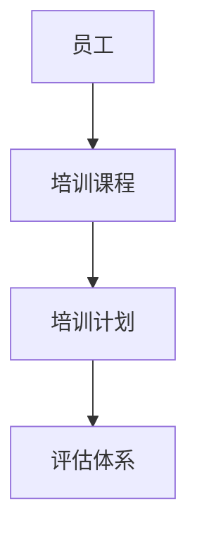

# 员工培训管理系统详细设计与具体代码实现

作者：禅与计算机程序设计艺术

## 1. 背景介绍

### 1.1 企业培训管理的现状与挑战

在当今竞争激烈的商业环境中，企业越来越重视员工培训，将其视为提升员工技能、提高生产力、增强竞争优势的关键举措。然而，传统的员工培训管理模式 often 面临诸多挑战：

* **培训需求难以精准把握:** 员工的培训需求往往分散且多样化，难以准确收集和分析，导致培训内容与实际需求脱节。
* **培训资源难以有效整合:**  企业内部的培训资源分散，难以整合利用，造成资源浪费和培训效率低下。
* **培训过程缺乏有效监控:** 传统的培训方式难以追踪员工的学习进度和效果，无法及时调整培训方案，影响培训效果。
* **培训结果难以评估:** 缺乏科学的评估体系，难以衡量培训的实际效果，无法为企业决策提供有效依据。

### 1.2  员工培训管理系统的价值

为了解决上述问题，越来越多的企业开始采用员工培训管理系统，通过信息化手段提升培训管理效率和效果。员工培训管理系统可以：

* **精准定位培训需求:** 通过调查问卷、绩效评估等方式，精准收集员工培训需求，制定针对性的培训计划。
* **整合优化培训资源:**  将企业内部的培训资源进行整合，建立统一的培训资源库，方便员工学习和使用。
* **实时监控培训过程:**  追踪员工的学习进度和效果，及时发现问题并调整培训方案，提高培训效率。
* **科学评估培训结果:**  建立科学的评估体系，对培训效果进行量化评估，为企业决策提供数据支持。

## 2. 核心概念与联系

### 2.1 员工

* 员工是培训管理系统的核心对象，每个员工拥有唯一的ID、姓名、部门、职位等基本信息。
* 员工可以根据自身需求选择参加不同的培训课程，并记录学习进度和成绩。

### 2.2 培训课程

* 培训课程是培训管理系统的重要组成部分，每个课程包含课程名称、课程介绍、课程目标、课程内容、授课讲师等信息。
* 课程可以分为不同的类别，例如：新员工入职培训、技能提升培训、领导力培训等。

### 2.3 培训计划

* 培训计划是根据企业需求制定的培训方案，包含培训目标、培训时间、培训地点、培训课程、培训讲师、培训对象等信息。
* 培训计划可以根据实际情况进行调整，例如：增加或删除培训课程、更改培训时间等。

### 2.4 评估体系

* 评估体系用于衡量培训效果，可以采用多种评估方式，例如：考试、问卷调查、绩效评估等。
* 评估结果可以作为改进培训方案的依据，提升培训效果。

### 2.5 关系图



## 3. 核心算法原理具体操作步骤

### 3.1 需求分析

* 收集员工培训需求，包括：岗位技能需求、个人发展需求等。
* 分析企业发展战略，确定培训目标和方向。
* 调查市场上现有的培训课程，了解最新的培训理念和技术。

### 3.2 系统设计

* 设计数据库表结构，存储员工信息、课程信息、培训计划等数据。
* 设计系统功能模块，包括：用户管理、课程管理、培训计划管理、评估管理等。
* 设计系统界面，简洁易用，方便用户操作。

### 3.3 系统开发

* 选择合适的开发语言和框架，例如：Java、Python、Spring Boot等。
* 编写代码实现系统功能，包括：用户注册登录、课程浏览报名、培训计划制定执行、评估结果查询等。
* 进行单元测试和集成测试，确保系统功能正常运行。

### 3.4 系统部署

* 选择合适的服务器环境，例如：云服务器、本地服务器等。
* 部署系统代码和数据库，配置系统参数。
* 进行系统测试，确保系统稳定运行。

### 3.5 系统维护

* 定期备份系统数据，防止数据丢失。
* 监控系统运行状态，及时解决系统故障。
* 更新系统功能，满足不断变化的业务需求。

## 4. 数学模型和公式详细讲解举例说明

### 4.1 培训需求预测模型

* 基于历史培训数据，预测未来培训需求。
* 采用时间序列分析方法，例如：ARIMA模型。

**公式:**

$$
\hat{y}_t = c + \phi_1 y_{t-1} + \phi_2 y_{t-2} + ... + \phi_p y_{t-p} + \theta_1 \epsilon_{t-1} + \theta_2 \epsilon_{t-2} + ... + \theta_q \epsilon_{t-q} + \epsilon_t
$$

**参数说明:**

* $\hat{y}_t$: t时刻的预测值
* $c$: 常数项
* $\phi_i$: 自回归系数
* $y_{t-i}$: t-i时刻的实际值
* $\theta_i$: 移动平均系数
* $\epsilon_{t-i}$: t-i时刻的误差项
* $\epsilon_t$: t时刻的误差项

**举例说明:**

假设某公司过去三年的培训需求分别为100、120、150人，利用ARIMA模型预测未来一年的培训需求。

### 4.2 培训效果评估模型

* 基于培训前后员工绩效变化，评估培训效果。
* 采用回归分析方法，例如：线性回归模型。

**公式:**

$$
y = \beta_0 + \beta_1 x_1 + \beta_2 x_2 + ... + \beta_n x_n + \epsilon
$$

**参数说明:**

* $y$: 员工绩效
* $\beta_0$: 常数项
* $\beta_i$: 回归系数
* $x_i$: 影响员工绩效的因素，例如：培训时长、培训内容等
* $\epsilon$: 误差项

**举例说明:**

假设某公司对员工进行技能培训，培训时长为一个月，培训内容为软件开发，培训前后员工绩效分别为70、80分，利用线性回归模型评估培训效果。

## 5. 项目实践：代码实例和详细解释说明

### 5.1 数据库设计

```sql
CREATE TABLE employee (
  id INT PRIMARY KEY AUTO_INCREMENT,
  name VARCHAR(255) NOT NULL,
  department VARCHAR(255) NOT NULL,
  position VARCHAR(255) NOT NULL
);

CREATE TABLE course (
  id INT PRIMARY KEY AUTO_INCREMENT,
  name VARCHAR(255) NOT NULL,
  description TEXT,
  goal TEXT,
  content TEXT,
  teacher VARCHAR(255)
);

CREATE TABLE training_plan (
  id INT PRIMARY KEY AUTO_INCREMENT,
  goal TEXT NOT NULL,
  start_time DATE NOT NULL,
  end_time DATE NOT NULL,
  location VARCHAR(255),
  course_id INT,
  teacher_id INT,
  FOREIGN KEY (course_id) REFERENCES course(id),
  FOREIGN KEY (teacher_id) REFERENCES employee(id)
);

CREATE TABLE evaluation (
  id INT PRIMARY KEY AUTO_INCREMENT,
  employee_id INT,
  training_plan_id INT,
  score INT,
  FOREIGN KEY (employee_id) REFERENCES employee(id),
  FOREIGN KEY (training_plan_id) REFERENCES training_plan(id)
);
```

### 5.2 代码实现

```java
// 用户注册
@PostMapping("/users")
public User createUser(@RequestBody User user) {
  return userService.createUser(user);
}

// 课程浏览
@GetMapping("/courses")
public List<Course> getAllCourses() {
  return courseService.getAllCourses();
}

// 培训计划制定
@PostMapping("/training-plans")
public TrainingPlan createTrainingPlan(@RequestBody TrainingPlan trainingPlan) {
  return trainingPlanService.createTrainingPlan(trainingPlan);
}

// 评估结果查询
@GetMapping("/evaluations/{employeeId}")
public List<Evaluation> getEvaluationsByEmployeeId(@PathVariable Long employeeId) {
  return evaluationService.getEvaluationsByEmployeeId(employeeId);
}
```

## 6. 实际应用场景

### 6.1 新员工入职培训

* 新员工入职培训是企业人力资源管理的重要环节，通过培训帮助新员工快速了解企业文化、规章制度、岗位职责等，使其快速融入企业。
* 员工培训管理系统可以帮助企业制定新员工入职培训计划，安排培训课程，跟踪培训进度，评估培训效果，提高新员工入职效率。

### 6.2 技能提升培训

* 随着技术的发展，员工需要不断学习新的技能，才能保持竞争力。
* 员工培训管理系统可以帮助企业制定技能提升培训计划，选择合适的培训课程，跟踪员工学习进度，评估培训效果，帮助员工提升技能水平。

### 6.3 领导力培训

* 企业发展需要优秀的领导者，领导力培训可以帮助员工提升领导能力，成为优秀的管理者。
* 员工培训管理系统可以帮助企业制定领导力培训计划，选择合适的培训课程，跟踪员工学习进度，评估培训效果，培养优秀的领导者。

## 7. 总结：未来发展趋势与挑战

### 7.1 未来发展趋势

* **个性化学习:** 员工培训管理系统将更加注重个性化学习，根据员工的学习风格、学习进度、学习目标，推荐合适的培训内容和学习路径。
* **人工智能辅助:** 人工智能技术将被应用于员工培训管理系统，例如：智能推荐培训课程、自动评估培训效果等。
* **移动学习:** 员工培训管理系统将支持移动学习，员工可以随时随地利用移动设备进行学习。

### 7.2 面临的挑战

* **数据安全:** 员工培训管理系统存储了大量的员工信息和培训数据，需要采取有效的措施保障数据安全。
* **系统集成:** 员工培训管理系统需要与其他企业系统进行集成，例如：人力资源管理系统、财务管理系统等，才能发挥更大的价值。
* **用户体验:** 员工培训管理系统需要提供良好的用户体验，才能吸引员工使用，提高培训效果。

## 8. 附录：常见问题与解答

### 8.1 如何选择合适的员工培训管理系统？

* **需求分析:** 首先要明确企业培训管理需求，例如：培训目标、培训对象、培训预算等。
* **功能对比:** 比较不同员工培训管理系统的功能，选择满足企业需求的系统。
* **供应商实力:** 了解供应商的实力和经验，选择可靠的供应商。

### 8.2 如何提高员工培训效果？

* **精准定位培训需求:** 通过调查问卷、绩效评估等方式，精准收集员工培训需求，制定针对性的培训计划。
* **选择合适的培训方式:** 根据培训内容和培训对象，选择合适的培训方式，例如：线上培训、线下培训、混合式培训等。
* **加强培训过程管理:**  追踪员工的学习进度和效果，及时发现问题并调整培训方案，提高培训效率。
* **建立科学的评估体系:**  对培训效果进行量化评估，为企业决策提供数据支持。
