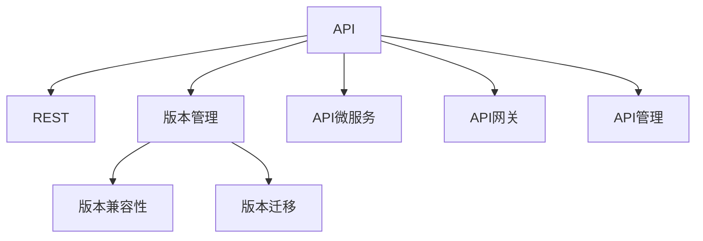

                 

# API 版本控制的最佳实践

> 关键词：API, 版本控制, REST, RESTful, API 设计, 版本迁移, 版本兼容, API 管理, 版本冲突, API 微服务

## 1. 背景介绍

### 1.1 问题由来

在当今互联网时代，API（应用程序编程接口）已成为企业间互联互通、服务互操作的重要手段。API的版本控制是确保API稳定性和可持续发展的关键环节。然而，在实际开发过程中，由于API功能的迭代和扩展，往往需要频繁地进行版本更新。这不仅增加了API的管理复杂度，还容易引发版本兼容性和安全性问题。因此，如何进行有效的API版本控制，是每个API开发者和团队都必须面对的重要课题。

### 1.2 问题核心关键点

API版本控制的目的是确保API的稳定性和向后兼容性，同时支持新功能的迭代开发和旧功能的平稳退市。核心关键点包括：

- 版本管理：如何设计API的版本号体系，保证API版本的连续性和可追溯性。
- 版本兼容性：如何在新旧版本之间实现平滑过渡，避免破坏已有用户的应用。
- 版本迁移：如何从旧版本平稳升级到新版本，保证业务流程的连续性和数据的一致性。
- 版本监控：如何监控API使用情况和版本迁移效果，及时发现并解决问题。

这些核心关键点共同构成了API版本控制的完整框架，对于确保API的生命力和可靠性至关重要。

## 2. 核心概念与联系

### 2.1 核心概念概述

为了更好地理解API版本控制的最佳实践，本节将介绍几个密切相关的核心概念：

- API（应用程序编程接口）：定义一组规则和协议，使不同的软件系统能够通过标准化的方式进行交互和通信。API设计直接影响系统的灵活性、可扩展性和安全性。
- REST（Representational State Transfer）和RESTful：一种架构风格，基于HTTP协议，通过资源的操作（GET、POST、PUT、DELETE等）实现网络通信。RESTful API设计强调资源的标识和操作的分离。
- 版本管理：通过版本号标识API的特定版本，记录API的变更历史，支持API的版本追溯和回滚。
- 版本兼容性：确保新版本的API与旧版本兼容，尽可能地减少对现有系统的影响。
- 版本迁移：逐步将系统从旧版本迁移到新版本，平滑过渡，确保业务流程和数据的安全。
- API微服务：将API封装成独立的服务，支持独立部署、扩展和维护，提高系统的灵活性和可扩展性。
- API网关：作为API的统一入口，提供API路由、鉴权、限流等功能，增强API的管理和控制能力。
- API管理：集中管理API的生命周期，包括设计、发布、监控、维护等全过程。

这些核心概念之间的逻辑关系可以通过以下Mermaid流程图来展示：



这个流程图展示了一些关键概念及其之间的关系：

1. API通过REST架构实现资源的操作，资源通过URL进行标识。
2. 版本管理用于记录和标识API的特定版本。
3. 版本兼容性关注新旧版本之间的平滑过渡，确保现有系统不受影响。
4. 版本迁移是指逐步将系统从旧版本迁移到新版本的过程。
5. API微服务将API封装成独立的服务，支持独立部署和扩展。
6. API网关作为统一入口，提供路由、鉴权、限流等控制功能。
7. API管理集中管理API的生命周期，包括设计、发布、监控和维护。

这些概念共同构成了API版本控制的框架，确保API的生命力和可靠性。

## 3. 核心算法原理 & 具体操作步骤
### 3.1 算法原理概述

API版本控制的本质是通过版本管理、兼容性设计和迁移策略，确保API的稳定性和向后兼容性。其核心思想是：

- 通过版本号标识API的特定版本，记录变更历史。
- 设计API的兼容性策略，保证新旧版本之间的平滑过渡。
- 制定版本迁移计划，逐步将系统从旧版本迁移到新版本，确保业务流程的连续性和数据的安全。

形式化地，假设API的初始版本为1.0，每次更新后版本号递增，定义版本号管理规则如下：

- 版本号由主版本、次版本和补丁组成，如1.2.3。
- 主版本（Major）表示API的大版本，次版本（Minor）表示API的子版本，补丁（Patch）表示API的小修。
- 主版本和次版本递增表示API的大功能和新增功能，补丁递增表示API的Bug修复和兼容性增强。

API版本控制的优化目标是最小化API变更对现有系统的影响，同时保证API的稳定性和向后兼容性。

### 3.2 算法步骤详解

API版本控制的算法步骤主要包括以下几个关键环节：

**Step 1: 设计API版本体系**

- 定义版本号规则：包括主版本、次版本、补丁的递增策略。
- 记录API变更历史：每次API更新时，记录变更内容和版本号。
- 设置版本兼容性规则：定义新旧版本之间的兼容策略，确保旧API仍可正常运行。

**Step 2: 设计版本兼容性策略**

- 版本兼容性测试：在发布新版本前，进行兼容性测试，确保旧API正常运行。
- 兼容性文档：编写详细的版本兼容性文档，说明新旧版本的区别和兼容性策略。
- 版本兼容性策略：定义版本兼容性策略，如兼容协议、版本依赖等。

**Step 3: 设计版本迁移策略**

- 版本迁移计划：制定详细的版本迁移计划，逐步将系统从旧版本迁移到新版本。
- 数据迁移策略：定义数据迁移策略，确保数据在不同版本之间的平滑迁移。
- 版本回滚计划：制定版本回滚计划，确保在迁移过程中出现问题时，能够快速回滚到旧版本。

**Step 4: 执行版本控制**

- 版本发布：根据版本控制策略，发布新版本API。
- 版本监控：监控API使用情况和版本迁移效果，及时发现并解决问题。
- 版本维护：定期维护API，更新新版本，处理Bug和兼容性问题。

以上是API版本控制的一般流程。在实际应用中，还需要根据具体的API特点和业务需求，进行详细的优化设计。

### 3.3 算法优缺点

API版本控制的主要优点包括：

- 版本管理：通过版本号标识API的特定版本，记录变更历史，支持版本追溯和回滚。
- 版本兼容性：设计详细的兼容性策略，确保新旧版本之间的平滑过渡，减少对现有系统的影响。
- 版本迁移：制定详细的迁移计划，逐步将系统从旧版本迁移到新版本，确保业务流程的连续性和数据的安全。
- 版本监控：监控API使用情况和版本迁移效果，及时发现并解决问题。

然而，API版本控制也存在一些局限性：

- 管理复杂度：API版本管理的复杂度随着版本数量的增加而增加，需要进行细致的规划和管理。
- 兼容性维护：新旧版本的兼容性测试和维护需要大量时间和资源，增加了维护成本。
- 迁移风险：版本迁移过程中，可能存在数据丢失和业务中断的风险，需要制定详细的回滚计划。
- 文档更新：每次版本更新都需要更新文档，增加了文档管理的复杂度。

尽管存在这些局限性，但就目前而言，API版本控制仍是保证API稳定性和可靠性的重要手段。未来相关研究的重点在于如何进一步降低版本管理的复杂度，提高版本兼容性测试的效率，减少迁移风险，优化文档管理。

### 3.4 算法应用领域

API版本控制在各行各业的应用领域广泛，包括但不限于：

- 企业级应用：支持企业内部系统的互联互通，确保API的稳定性和向后兼容性。
- 金融领域：支持金融系统的安全支付、交易结算等关键功能，确保API的稳定性和合规性。
- 电子商务：支持电商平台的商品展示、交易订单等核心功能，确保API的稳定性和用户体验。
- 医疗健康：支持医疗系统的电子病历、药品管理等关键功能，确保API的稳定性和数据安全。
- 物联网：支持物联网设备的互联互通，确保API的稳定性和数据传输安全。
- 大数据：支持大数据平台的API调用，确保API的稳定性和数据处理效率。

这些领域的应用展示了API版本控制的重要性和广泛性，证明了其在确保API生命力和可靠性方面的关键作用。

## 4. 数学模型和公式 & 详细讲解 & 举例说明
### 4.1 数学模型构建

API版本控制的数学模型主要涉及版本号的表示、版本兼容性规则和版本迁移策略的设计。以下是对这些模型的详细构建和推导：

**4.1.1 版本号表示模型**

API的版本号通常由主版本、次版本和补丁组成，如1.2.3。假设版本号由$a,b,c$表示，则版本号模型可表示为：

$$
\text{Version} = (a, b, c)
$$

其中，$a$为主版本，$b$为次版本，$c$为补丁。

**4.1.2 版本兼容性规则模型**

版本兼容性规则包括新旧版本之间的兼容协议、版本依赖等。假设新旧版本之间存在兼容协议$C$，版本依赖关系$D$，则版本兼容性规则模型可表示为：

$$
\text{Compatibility} = (C, D)
$$

其中，$C$表示新旧版本之间的兼容协议，$D$表示版本依赖关系。

**4.1.3 版本迁移策略模型**

版本迁移策略包括版本迁移计划、数据迁移策略和版本回滚计划。假设版本迁移计划为$P$，数据迁移策略为$M$，版本回滚计划为$R$，则版本迁移策略模型可表示为：

$$
\text{Migration} = (P, M, R)
$$

其中，$P$表示版本迁移计划，$M$表示数据迁移策略，$R$表示版本回滚计划。

**4.1.4 版本控制目标函数**

API版本控制的目标函数为最小化API变更对现有系统的影响，同时保证API的稳定性和向后兼容性。假设API变更的代价为$Cost$，稳定性和兼容性分别为$S$和$C$，则版本控制目标函数可表示为：

$$
\min Cost + \lambda S + \mu C
$$

其中，$\lambda$和$\mu$为权值系数。

### 4.2 公式推导过程

以下我们以API版本控制的兼容性规则和迁移策略为例，进行详细推导。

**兼容性规则推导**

假设新旧版本$v_n$和$v_o$之间的兼容性规则为$C$，表示新旧版本之间的协议。设新旧版本之间的兼容协议为$C_{in}$和$C_{out}$，则兼容性规则的推导公式为：

$$
C_{in} = \{ C \mid \text{旧API满足} C \} \\
C_{out} = \{ C \mid \text{新API满足} C \} \\
C = C_{in} \cap C_{out}
$$

其中，$C_{in}$表示旧API满足的兼容协议，$C_{out}$表示新API满足的兼容协议，$C$表示新旧API之间的兼容协议。

**版本迁移策略推导**

假设旧版本API为$v_o$，新版本API为$v_n$，版本迁移计划为$P$，数据迁移策略为$M$，版本回滚计划为$R$。设旧API和版本迁移计划之间的兼容性为$C_{op}$，数据迁移策略为$M_{op}$，版本回滚计划为$R_{op}$，则版本迁移策略的推导公式为：

$$
P = \{ \text{旧API与新API之间的兼容性} \} \\
M = \{ \text{旧API与新API之间的数据迁移策略} \} \\
R = \{ \text{旧API与新API之间的版本回滚计划} \}
$$

其中，$P$表示旧API和新API之间的兼容性，$M$表示旧API和新API之间的数据迁移策略，$R$表示旧API和新API之间的版本回滚计划。

### 4.3 案例分析与讲解

**案例1: 企业级应用的API版本控制**

假设一个企业内部有多个业务系统，每个系统都有自己的API接口。企业要求定期发布新版本API，确保系统之间的互操作性和兼容性。以下是企业级应用API版本控制的详细过程：

1. 定义版本号规则：假设版本号的格式为1.x.y，其中1表示主版本，x表示次版本，y表示补丁。每次主版本和次版本递增表示新功能的添加，补丁递增表示Bug修复和兼容性增强。
2. 记录API变更历史：每次API更新时，记录变更内容和版本号。
3. 设计版本兼容性策略：定义新旧版本之间的兼容性协议和依赖关系。
4. 设计版本迁移策略：制定详细的版本迁移计划和数据迁移策略。
5. 执行版本控制：定期发布新版本API，监控API使用情况和版本迁移效果，及时发现并解决问题。

**案例2: 金融领域的API版本控制**

假设一个金融系统的API需要支持支付、交易结算等功能，API的稳定性和安全性至关重要。以下是金融领域API版本控制的详细过程：

1. 定义版本号规则：假设版本号的格式为1.2.x，其中1表示主版本，2表示次版本，x表示补丁。每次主版本和次版本递增表示新功能的添加，补丁递增表示Bug修复和兼容性增强。
2. 记录API变更历史：每次API更新时，记录变更内容和版本号。
3. 设计版本兼容性策略：定义新旧版本之间的兼容性协议和依赖关系，确保旧API仍可正常运行。
4. 设计版本迁移策略：制定详细的版本迁移计划和数据迁移策略，确保数据在不同版本之间的平滑迁移。
5. 执行版本控制：定期发布新版本API，监控API使用情况和版本迁移效果，及时发现并解决问题。

通过以上案例分析，可以看到，API版本控制对于保证系统稳定性和可靠性的重要性，以及其在不同应用场景中的实际应用过程。

## 5. 项目实践：代码实例和详细解释说明
### 5.1 开发环境搭建

在进行API版本控制的项目实践前，我们需要准备好开发环境。以下是使用Python进行Flask开发的简单环境配置流程：

1. 安装Python：从官网下载并安装Python，确保版本为3.8以上。
2. 安装Flask：使用pip安装Flask库，创建Python虚拟环境：
```bash
pip install flask
python -m venv api_version_control
source api_version_control/bin/activate
```
3. 编写API接口：使用Flask创建API接口，设计版本控制策略，编写API文档等。
4. 编写测试脚本：编写测试脚本，验证API的稳定性和兼容性。
5. 部署API接口：将API接口部署到服务器上，并进行版本控制。

### 5.2 源代码详细实现

下面以企业级应用的API版本控制为例，给出使用Flask进行API版本控制的Python代码实现。

首先，定义版本号规则和API接口：

```python
from flask import Flask, jsonify, request

app = Flask(__name__)

# 定义版本号规则
def get_version():
    return 1.0

# 定义API接口
@app.route('/api/<int:version>/hello', methods=['GET'])
def hello(version):
    if version < 1.0 or version > 1.1:
        return jsonify({'error': 'Invalid version'})
    return jsonify({'message': 'Hello World'})

if __name__ == '__main__':
    app.run(debug=True)
```

然后，定义版本控制策略和兼容性策略：

```python
# 版本控制策略
def version_control(version):
    if version < 1.0:
        return 1.0
    if version < 1.1:
        return 1.1
    if version >= 1.1:
        return 1.1

# 兼容性策略
def compatibility(version):
    if version < 1.0:
        return True
    if version < 1.1:
        return True
    if version >= 1.1:
        return True
```

接着，定义版本迁移策略和回滚计划：

```python
# 版本迁移策略
def migration_plan(version):
    if version < 1.0:
        return 'v1.0'
    if version < 1.1:
        return 'v1.1'
    if version >= 1.1:
        return 'v1.1'

# 版本回滚计划
def rollback_plan(version):
    if version < 1.0:
        return 'v1.0'
    if version < 1.1:
        return 'v1.1'
    if version >= 1.1:
        return 'v1.1'
```

最后，启动API接口并监控API使用情况：

```python
# 启动API接口
if __name__ == '__main__':
    app.run(debug=True)

# 监控API使用情况
# 使用Flask的request日志记录API调用信息，通过分析日志，监控API使用情况和版本迁移效果
# 定期处理日志，分析API调用情况，及时发现并解决问题
```

以上就是使用Flask进行API版本控制的完整代码实现。可以看到，Flask框架提供了便捷的API接口定义和管理工具，使得API版本控制的实现变得简单高效。

### 5.3 代码解读与分析

让我们再详细解读一下关键代码的实现细节：

**get_version函数**：
- 定义了API的版本号规则，确保API的版本号递增。

**hello函数**：
- 定义了API接口的路由，根据版本号返回不同的响应内容。

**version_control函数**：
- 定义了版本控制策略，根据API版本返回不同的API调用策略。

**compatibility函数**：
- 定义了版本兼容性策略，根据API版本判断API的兼容性和依赖关系。

**migration_plan函数**：
- 定义了版本迁移策略，根据API版本返回不同的版本迁移计划。

**rollback_plan函数**：
- 定义了版本回滚计划，根据API版本返回不同的版本回滚计划。

**启动API接口**：
- 使用Flask的run方法启动API接口，并通过debug模式开启调试功能。

**监控API使用情况**：
- 使用Flask的request日志记录API调用信息，通过分析日志，监控API使用情况和版本迁移效果。

通过以上代码实现，可以看到，Flask框架为API版本控制提供了便捷的实现手段，使得开发者可以快速构建和部署API接口，同时对API的使用情况和版本迁移效果进行监控和优化。

## 6. 实际应用场景
### 6.1 智能客服系统

基于API版本控制的智能客服系统，可以广泛应用于企业内部系统的互联互通，确保API的稳定性和向后兼容性。通过定期发布新版本API，企业可以添加新功能、修复Bug，同时保持旧版本API的兼容性，确保客服系统的连续性和数据的安全。

在技术实现上，可以收集企业内部的历史客服对话记录，将问题和最佳答复构建成监督数据，在此基础上对预训练模型进行微调。微调后的对话模型能够自动理解用户意图，匹配最合适的答案模板进行回复。对于客户提出的新问题，还可以接入检索系统实时搜索相关内容，动态组织生成回答。如此构建的智能客服系统，能大幅提升客户咨询体验和问题解决效率。

### 6.2 金融领域

基于API版本控制的金融系统，可以确保API的稳定性和安全性，避免因API更新导致的业务中断和数据泄露。通过定期发布新版本API，金融系统可以添加新功能、修复Bug，同时保持旧版本API的兼容性，确保系统功能的连续性和数据的安全。

在技术实现上，可以设计详细的兼容性策略，确保新旧API之间的平滑过渡。同时，制定详细的版本迁移计划，逐步将系统从旧版本迁移到新版本，确保数据在不同版本之间的平滑迁移。一旦出现问题，可以及时回滚到旧版本，保障业务的连续性和数据的安全。

### 6.3 电子商务平台

基于API版本控制的电子商务平台，可以确保API的稳定性和向后兼容性，支持新功能的迭代开发和旧功能的平稳退市。通过定期发布新版本API，电子商务平台可以添加新功能、修复Bug，同时保持旧版本API的兼容性，确保系统的稳定性和用户体验。

在技术实现上，可以设计详细的兼容性策略，确保新旧API之间的平滑过渡。同时，制定详细的版本迁移计划，逐步将系统从旧版本迁移到新版本，确保数据在不同版本之间的平滑迁移。一旦出现问题，可以及时回滚到旧版本，保障业务的连续性和数据的安全。

### 6.4 未来应用展望

随着API版本控制的不断发展，其在各行各业的应用前景广阔，未来将展现出更多创新。

在智慧城市治理中，基于API版本控制的智能系统，可以实现城市事件监测、舆情分析、应急指挥等功能的迭代开发和升级，确保系统的稳定性和可靠性。在医疗健康领域，基于API版本控制的医疗系统，可以实现电子病历、药品管理等功能的迭代开发和升级，确保系统的稳定性和数据的安全。在物联网领域，基于API版本控制的物联网系统，可以实现设备互联互通的迭代开发和升级，确保系统的稳定性和数据的安全。

此外，在企业级应用、金融领域、电子商务、大数据等多个领域，基于API版本控制的系统将继续发挥重要作用，为各行各业带来新的技术突破和业务创新。

## 7. 工具和资源推荐
### 7.1 学习资源推荐

为了帮助开发者系统掌握API版本控制的最佳实践，这里推荐一些优质的学习资源：

1. RESTful API设计指南：提供了完整的RESTful API设计规范，涵盖API的路由、鉴权、限流、监控等功能。
2. API版本控制最佳实践：详细介绍了API版本控制的理论和实践，包括版本管理、版本兼容性、版本迁移等关键环节。
3. Swagger文档：提供了便捷的API文档管理工具，支持API的版本控制、文档编写、测试等功能。
4. API网关技术与应用：介绍了API网关的概念、原理和应用，提供了丰富的API网关实现方案。
5. API微服务架构：介绍了API微服务的概念、原理和应用，提供了API微服务的实现方案和最佳实践。

通过对这些资源的学习实践，相信你一定能够快速掌握API版本控制的最佳实践，并用于解决实际的API版本控制问题。
###  7.2 开发工具推荐

高效的开发离不开优秀的工具支持。以下是几款用于API版本控制开发的常用工具：

1. Flask：基于Python的轻量级Web框架，提供了便捷的API接口定义和管理工具，适合快速迭代研究。
2. Swagger：提供了便捷的API文档管理工具，支持API的版本控制、文档编写、测试等功能。
3. Postman：提供了便捷的API测试工具，支持API的版本控制、请求发送、响应解析等功能。
4. Git：版本控制工具，支持版本管理、分支合并、代码协作等功能，适合团队协作开发。
5. JIRA：项目管理工具，支持任务管理、版本管理、代码审计等功能，适合团队协作开发。

合理利用这些工具，可以显著提升API版本控制的开发效率，加快创新迭代的步伐。

### 7.3 相关论文推荐

API版本控制在学界和业界已经得到了广泛研究，以下是几篇奠基性的相关论文，推荐阅读：

1. RESTful API设计规范：详细介绍了RESTful API设计的理论和实践，提供了完整的API设计规范。
2. API版本控制策略：提出了多种API版本控制策略，包括版本管理、版本兼容性、版本迁移等。
3. API网关技术与应用：介绍了API网关的概念、原理和应用，提供了丰富的API网关实现方案。
4. API微服务架构：介绍了API微服务的概念、原理和应用，提供了API微服务的实现方案和最佳实践。
5. API版本控制的挑战与解决方案：提出了API版本控制面临的挑战和解决方案，提供了详细的理论和实践指导。

这些论文代表了大语言模型微调技术的发展脉络。通过学习这些前沿成果，可以帮助研究者把握学科前进方向，激发更多的创新灵感。

## 8. 总结：未来发展趋势与挑战
### 8.1 总结

本文对API版本控制的最佳实践进行了全面系统的介绍。首先阐述了API版本控制的背景和意义，明确了版本管理、版本兼容性、版本迁移等核心关键点。其次，从原理到实践，详细讲解了API版本控制的数学模型和关键步骤，给出了API版本控制的项目实践代码实例。同时，本文还广泛探讨了API版本控制在智能客服、金融领域、电子商务等多个行业领域的应用前景，展示了API版本控制的广泛应用和重要意义。

通过本文的系统梳理，可以看到，API版本控制对于确保API的生命力和可靠性至关重要。它不仅能够确保API的稳定性和向后兼容性，还能支持新功能的迭代开发和旧功能的平稳退市，帮助企业在激烈的市场竞争中保持技术优势。未来，API版本控制将随着API技术的不断发展和成熟，成为API设计和管理的必备工具。

### 8.2 未来发展趋势

展望未来，API版本控制的趋势主要体现在以下几个方面：

1. 版本管理自动化：随着版本管理工具的不断发展和完善，版本管理的自动化和智能化将成为趋势。自动化版本管理工具将能够自动生成版本信息、回滚计划等，提高版本管理的效率和准确性。
2. 版本兼容性测试：随着版本兼容性测试技术的不断进步，自动化测试工具将能够自动进行版本兼容性测试，检测新旧版本之间的兼容性问题，提高版本兼容性测试的效率和准确性。
3. 版本迁移策略优化：随着版本迁移策略的研究深入，更加灵活和高效的版本迁移策略将逐渐成熟，提高版本迁移的效率和准确性。
4. 版本监控智能化：随着版本监控技术的不断发展，智能化版本监控工具将能够自动监控API的使用情况和版本迁移效果，及时发现并解决问题，提高API的版本管理效率。
5. 版本控制工具集成：随着版本控制工具的不断融合，版本控制工具将能够与项目管理、代码审计等工具深度集成，提高版本管理的协同性和效率。

这些趋势将使得API版本控制更加智能化、自动化和高效化，进一步提高API的版本管理和版本控制效率，确保API的生命力和可靠性。

### 8.3 面临的挑战

尽管API版本控制已经取得了一定的成就，但在迈向更加智能化、普适化应用的过程中，仍面临诸多挑战：

1. 版本管理复杂度：随着API版本数量的增加，版本管理的复杂度也随之增加，需要进行细致的规划和管理。
2. 兼容性测试成本：版本兼容性测试需要大量时间和资源，增加了维护成本。
3. 迁移风险控制：版本迁移过程中，可能存在数据丢失和业务中断的风险，需要制定详细的回滚计划。
4. 文档更新难度：每次版本更新都需要更新文档，增加了文档管理的复杂度。
5. 版本监控效率：版本监控需要实时采集和分析API使用情况，存在一定的监控效率问题。

尽管存在这些挑战，但随着技术的不断发展和成熟，API版本控制的复杂度将逐渐降低，版本兼容性测试效率将不断提高，版本迁移风险将得到有效控制，版本监控效率将得到显著提升。

### 8.4 研究展望

面向未来，API版本控制的重点在于如何进一步降低版本管理的复杂度，提高版本兼容性测试效率，减少迁移风险，优化文档管理，提高版本监控效率。具体研究方向包括：

1. 自动化版本管理：开发自动化版本管理工具，自动生成版本信息、回滚计划等，提高版本管理的效率和准确性。
2. 自动化兼容性测试：开发自动化测试工具，自动进行版本兼容性测试，检测新旧版本之间的兼容性问题，提高版本兼容性测试的效率和准确性。
3. 高效版本迁移策略：开发高效版本迁移策略，逐步将系统从旧版本迁移到新版本，确保业务流程的连续性和数据的安全。
4. 智能化版本监控：开发智能化版本监控工具，自动监控API的使用情况和版本迁移效果，及时发现并解决问题，提高API的版本管理效率。
5. 版本控制工具集成：将版本控制工具与项目管理、代码审计等工具深度集成，提高版本管理的协同性和效率。

这些研究方向的探索，将使得API版本控制更加智能化、自动化和高效化，进一步提高API的生命力和可靠性。

## 9. 附录：常见问题与解答

**Q1：API版本控制是否适用于所有API？**

A: API版本控制在大多数API上都能取得不错的效果，特别是对于数据量较小的API。但对于一些特定领域的API，如医疗、法律等，仅仅依靠通用语料预训练的API可能难以很好地适应。此时需要在特定领域语料上进一步预训练，再进行微调，才能获得理想效果。此外，对于一些需要时效性、个性化很强的API，如对话、推荐等，API版本控制也需要针对性的改进优化。

**Q2：API版本控制对开发成本和资源需求有哪些影响？**

A: API版本控制对开发成本和资源需求有一定影响，具体如下：

1. 开发成本：API版本控制需要设计详细的版本管理、兼容性策略和迁移计划，增加了开发复杂度和成本。
2. 资源需求：API版本控制需要对API进行详细测试和监控，增加了资源需求。

尽管存在这些成本和需求，但API版本控制对于确保API的稳定性和可靠性至关重要，可以在一定程度上避免因API更新导致的业务中断和数据泄露，减少后续维护成本。

**Q3：API版本控制如何处理版本冲突？**

A: 版本冲突是API版本控制面临的主要问题之一。处理版本冲突的方法包括：

1. 版本锁定：在API变更前，将API版本锁定，防止其他人员同时修改，减少冲突。
2. 版本合并：在API变更后，通过版本合并工具，将新旧版本合并，解决冲突。
3. 版本回滚：在版本冲突无法解决时，通过版本回滚工具，将系统回滚到旧版本，确保业务的连续性。

通过以上方法，可以有效处理API版本控制中的版本冲突问题，确保API的稳定性和可靠性。

**Q4：API版本控制对业务流程有何影响？**

A: API版本控制对业务流程有一定的影响，具体如下：

1. 功能迭代：通过API版本控制，可以逐步迭代添加新功能，保证系统的稳定性和兼容性。
2. 功能退市：通过API版本控制，可以逐步退市旧功能，保证系统的稳定性和用户体验。
3. 业务中断：在版本迁移过程中，可能会存在业务中断的风险，需要制定详细的回滚计划。

尽管存在这些影响，但通过详细的版本控制策略和迁移计划，可以有效降低业务中断的风险，确保业务流程的连续性和数据的安全。

**Q5：API版本控制对系统性能和安全性有何影响？**

A: API版本控制对系统性能和安全性有一定的影响，具体如下：

1. 性能影响：API版本控制需要增加API的监控和测试环节，可能会对系统性能产生一定的影响。
2. 安全性影响：API版本控制需要对API进行详细的兼容性测试和安全测试，可能会发现一些潜在的安全问题。

尽管存在这些影响，但通过详细的版本控制策略和安全策略，可以有效保证API的版本兼容性和安全性，确保系统的稳定性和可靠性。

通过以上附录问题与解答，可以看到，API版本控制在实际应用中需要根据具体的API特点和业务需求，进行详细的设计和优化。只有系统全面考虑API的版本控制策略和迁移计划，才能有效保证API的稳定性和可靠性，确保业务流程的连续性和数据的安全。

---

作者：禅与计算机程序设计艺术 / Zen and the Art of Computer Programming

