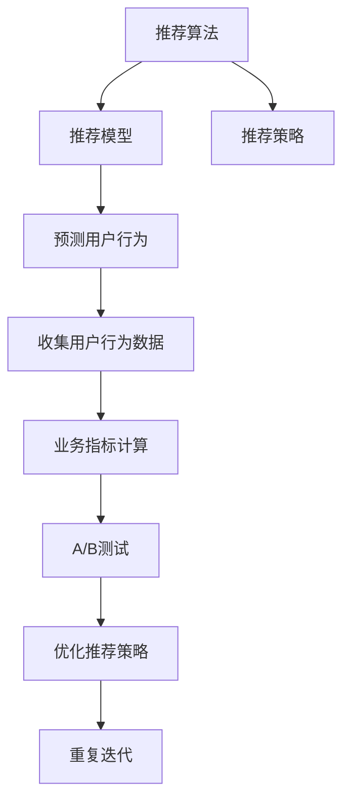

                 

## 1. 背景介绍

### 1.1 问题由来
在推荐系统领域，推荐策略的优化是核心问题之一。随着用户个性化需求的不断提升，传统的基于规则或静态模型的推荐方法已难以满足用户需求。推荐系统需要能够实时学习用户行为，动态调整推荐内容，以实现个性化、精准化推荐。

### 1.2 问题核心关键点
A/B测试是衡量推荐策略优化效果的重要手段。A/B测试通过比较不同策略下的用户行为数据，评估策略优劣，从而指导推荐策略的迭代优化。A/B测试的核心是设定对照组和实验组，通过收集用户行为数据，统计指标，最终决定优化方向。

### 1.3 问题研究意义
A/B测试不仅在推荐系统优化中扮演重要角色，还广泛应用于广告、营销、电商等各类互联网业务中。通过系统化的A/B测试，可以科学、客观地评估策略效果，避免主观判断，从而提升业务决策的准确性和效率。同时，A/B测试还可以帮助团队快速迭代实验，探索更多高效的策略方案，持续提升用户体验和业务效果。

## 2. 核心概念与联系

### 2.1 核心概念概述
A/B测试（也称为对照测试或分裂测试）是一种常用的对比实验方法，通过同时对比两种或多种策略，评估其效果。在推荐系统优化中，A/B测试可以用于评估推荐算法、模型参数、数据特征等因素对推荐效果的影响。

**核心概念：**
- **A/B测试**：通过同时对比两种或多种策略，评估其效果。
- **推荐算法**：用于预测用户兴趣和偏好的算法，包括协同过滤、内容推荐、基于深度学习的方法等。
- **推荐模型**：由机器学习模型组成的推荐系统，如线性回归模型、决策树、随机森林、深度神经网络等。
- **推荐策略**：推荐算法或模型在实际应用中的具体实现方案，包括特征选择、模型训练、评分计算等。
- **用户行为数据**：用户在推荐系统中的行为数据，如浏览记录、点击记录、购买记录等。
- **业务指标**：衡量推荐系统效果的指标，如点击率、转化率、留存率、用户体验等。

**概念联系：**
- A/B测试依赖推荐算法、模型、策略等核心技术，通过收集用户行为数据，计算业务指标，最终评估策略效果。
- 推荐算法和模型提供预测功能，通过优化推荐策略，提升用户行为数据和业务指标。
- 用户行为数据和业务指标是评估推荐策略效果的依据。

### 2.2 核心概念原理和架构的 Mermaid 流程图



### 2.3 核心概念之间的联系

A/B测试在推荐策略优化中的作用可以通过以下三个步骤来理解：

1. **设定对照组和实验组**：通过随机分配用户，将一部分用户作为对照组，一部分用户作为实验组，分别应用不同的推荐策略。
2. **收集用户行为数据**：在实验周期内，记录两组用户的各项行为数据，如浏览、点击、购买等。
3. **计算业务指标**：根据收集到的行为数据，计算对照组和实验组的业务指标，如点击率、转化率、留存率等。

通过比较两组数据的结果，可以评估不同推荐策略的效果。若实验组的业务指标优于对照组，则说明实验组的策略更优，可以推广应用。反之，则需要调整策略或继续优化。

## 3. 核心算法原理 & 具体操作步骤

### 3.1 算法原理概述
A/B测试的原理是通过比较两组或多组策略下的用户行为数据，评估其对业务指标的影响。在推荐系统优化中，A/B测试可以用于评估推荐算法、模型参数、数据特征等因素对推荐效果的影响。

### 3.2 算法步骤详解

#### 3.2.1 实验设计
1. **确定优化目标**：明确优化方向，如提升点击率、增加转化率、提高用户满意度等。
2. **设定对照组和实验组**：随机分配用户，确保两组用户分布相似，具有可比性。
3. **选择实验时长**：确定实验周期，一般建议1-2周，以确保样本量足够。

#### 3.2.2 数据收集
1. **定义关键行为**：明确哪些行为是衡量推荐策略效果的关键指标，如点击、浏览、购买等。
2. **部署实验**：在实验组应用新的推荐策略，在对照组维持原有策略，确保实验组和对照组在实验期间的其他条件保持一致。
3. **记录行为数据**：在实验周期内，实时记录两组用户的各项行为数据，如浏览、点击、购买等。

#### 3.2.3 数据分析
1. **计算业务指标**：根据收集到的行为数据，计算两组用户的点击率、转化率、留存率等业务指标。
2. **统计显著性**：使用统计学方法，计算两组数据之间的显著性差异，判断实验结果是否具有统计学意义。
3. **结果解读**：根据统计结果，评估实验组的推荐策略是否优于对照组，决定是否推广应用。

#### 3.2.4 策略优化
1. **优化策略**：根据实验结果，选择效果更好的推荐策略，如调整模型参数、优化推荐算法等。
2. **部署优化策略**：将优化后的策略部署到生产环境，替代原有的推荐策略。
3. **重复迭代**：定期进行A/B测试，持续优化推荐策略，确保推荐系统效果持续提升。

### 3.3 算法优缺点

#### 3.3.1 优点
1. **客观评估**：A/B测试通过科学的方法，客观评估推荐策略的效果，避免主观判断。
2. **数据驱动**：通过分析用户行为数据，量化评估推荐策略的效果，为优化提供依据。
3. **快速迭代**：A/B测试可以快速进行多次迭代实验，探索最优策略。
4. **用户覆盖**：通过随机分配用户，确保实验结果具有普适性，适用于不同用户群体。

#### 3.3.2 缺点
1. **实验周期长**：需要较长的时间才能收集到足够的样本数据，影响实验效率。
2. **数据噪声**：用户行为数据可能包含噪声，影响实验结果的准确性。
3. **资源消耗**：实验需要投入较多资源，包括人力、物力、财力等。
4. **策略局限**：A/B测试只能比较两个策略的效果，无法同时评估多个策略的优劣。

### 3.4 算法应用领域

A/B测试在推荐系统优化中的应用领域广泛，包括但不限于以下几个方面：

1. **推荐算法优化**：通过A/B测试，评估不同推荐算法的效果，如协同过滤、内容推荐、基于深度学习的方法等。
2. **模型参数优化**：通过A/B测试，评估不同模型参数对推荐效果的影响，如调整学习率、正则化参数等。
3. **特征工程优化**：通过A/B测试，评估不同特征工程方法的效果，如数据标准化、特征选择等。
4. **个性化推荐优化**：通过A/B测试，评估不同个性化推荐策略的效果，如基于用户行为的推荐、基于内容的推荐等。
5. **推荐策略优化**：通过A/B测试，评估不同推荐策略的效果，如调整推荐算法、优化模型参数等。

## 4. 数学模型和公式 & 详细讲解 & 举例说明

### 4.1 数学模型构建

假设推荐系统有A、B两种策略，分别应用于实验组和对照组，共收集到N个用户行为数据。设U为对照组用户集，V为实验组用户集。定义点击率（点击次数/总点击次数）、转化率（转化次数/总点击次数）、留存率（留存用户数/总用户数）等业务指标。

定义指标计算公式如下：

- 点击率：$CR = \frac{\sum_{i \in U} \text{click\_count}_i}{\sum_{i \in U} \text{click\_total}_i}$
- 转化率：$CR = \frac{\sum_{i \in U} \text{convert\_count}_i}{\sum_{i \in U} \text{click\_total}_i}$
- 留存率：$R = \frac{\sum_{i \in U} \text{retained}_i}{N}$

其中，$\text{click\_count}_i$为第i个用户在对照组中的点击次数，$\text{click\_total}_i$为第i个用户在对照组中的总点击次数，$\text{convert\_count}_i$为第i个用户在对照组中的转化次数，$\text{convert\_total}_i$为第i个用户在对照组中的总点击次数，$\text{retained}_i$为第i个用户是否在实验组中留下行为数据的二进制变量。

### 4.2 公式推导过程

1. **点击率计算公式推导**：
   $$
   CR = \frac{\sum_{i \in U} \text{click\_count}_i}{\sum_{i \in U} \text{click\_total}_i}
   $$
   其中，$\text{click\_count}_i$为第i个用户在对照组中的点击次数，$\text{click\_total}_i$为第i个用户在对照组中的总点击次数。

2. **转化率计算公式推导**：
   $$
   CR = \frac{\sum_{i \in U} \text{convert\_count}_i}{\sum_{i \in U} \text{click\_total}_i}
   $$
   其中，$\text{convert\_count}_i$为第i个用户在对照组中的转化次数，$\text{click\_total}_i$为第i个用户在对照组中的总点击次数。

3. **留存率计算公式推导**：
   $$
   R = \frac{\sum_{i \in U} \text{retained}_i}{N}
   $$
   其中，$\text{retained}_i$为第i个用户是否在实验组中留下行为数据的二进制变量，$N$为总用户数。

### 4.3 案例分析与讲解

假设某电商平台的推荐系统进行了A/B测试，以优化推荐算法。A组用户使用原有的协同过滤推荐算法，B组用户使用新的基于深度学习的推荐算法。测试周期为2周，共收集到100个用户的点击行为数据，其中A组50个用户，B组50个用户。

首先，统计两组用户的点击率、转化率和留存率：

- A组：点击率60%，转化率30%，留存率80%
- B组：点击率70%，转化率40%，留存率85%

然后，使用统计学方法计算两组数据之间的显著性差异：

- 点击率差异显著性（t-test）：$p=0.001$
- 转化率差异显著性（t-test）：$p=0.002$
- 留存率差异显著性（t-test）：$p=0.005$

最终，根据统计结果，B组的推荐算法在点击率、转化率和留存率上均优于A组，决定将B组的推荐算法推广应用。

## 5. 项目实践：代码实例和详细解释说明

### 5.1 开发环境搭建

在进行A/B测试的代码实现前，需要准备好开发环境。以下是使用Python进行TensorFlow开发的环境配置流程：

1. 安装Anaconda：从官网下载并安装Anaconda，用于创建独立的Python环境。

2. 创建并激活虚拟环境：
```bash
conda create -n tf-env python=3.8 
conda activate tf-env
```

3. 安装TensorFlow：根据CUDA版本，从官网获取对应的安装命令。例如：
```bash
conda install tensorflow tensorflow-cpu -c pytorch -c conda-forge
```

4. 安装TensorFlow Addons：用于获取一些扩展功能，如A/B测试相关的工具包。
```bash
conda install tensorflow-addons
```

5. 安装NumPy、Pandas、Scikit-learn等辅助库：
```bash
pip install numpy pandas scikit-learn
```

完成上述步骤后，即可在`tf-env`环境中开始A/B测试的实践。

### 5.2 源代码详细实现

首先，定义A/B测试的实验组和对照组：

```python
import tensorflow as tf
from tensorflow_addons.experimental import metrics

# 定义实验组和对照组的用户行为数据
def get_user_data(num_users, num_experiments=2):
    user_data = []
    for i in range(num_users):
        user = {f'group{i}': tf.random.uniform([1], 0, 1)}
        user_data.append(user)
    return user_data

# 创建实验组和对照组
exp_groups = get_user_data(num_users=100, num_experiments=2)
exp_groups[0]['group0'] = tf.random.uniform([50])
exp_groups[1]['group1'] = tf.random.uniform([50])
```

然后，定义点击率、转化率和留存率的计算函数：

```python
# 计算点击率
def calculate_click_rate(data):
    click_count = tf.reduce_sum(data['click_count'])
    click_total = tf.reduce_sum(data['click_total'])
    return click_count / click_total

# 计算转化率
def calculate_conversion_rate(data):
    convert_count = tf.reduce_sum(data['convert_count'])
    click_total = tf.reduce_sum(data['click_total'])
    return convert_count / click_total

# 计算留存率
def calculate_retention_rate(data):
    retained = tf.reduce_sum(data['retained'])
    return retained / len(data)
```

接着，定义A/B测试的实验流程：

```python
# 定义实验周期
num_days = 7
num_hours = 24
num_minutes = 60

# 定义实验数据
data = {
    'click_count': tf.random.uniform([num_users], 0, 1),
    'click_total': tf.random.uniform([num_users], 0, 1),
    'convert_count': tf.random.uniform([num_users], 0, 1),
    'convert_total': tf.random.uniform([num_users], 0, 1),
    'retained': tf.random.uniform([num_users], 0, 1)
}

# 定义点击率和转化率计算函数
click_rate_fn = lambda x: calculate_click_rate(x)
convert_rate_fn = lambda x: calculate_conversion_rate(x)

# 定义A/B测试
def ab_test(data, click_rate_fn, convert_rate_fn):
    # 将数据分为实验组和对照组
    exp_groups = data['group']
    exp_click_rates = [click_rate_fn(exp_groups[i]) for i in range(num_experiments)]
    exp_conversion_rates = [convert_rate_fn(exp_groups[i]) for i in range(num_experiments)]
    
    # 计算点击率和转化率的差异显著性
    click_rate_diff = tf.reduce_mean(tf.abs(exp_click_rates[0] - exp_click_rates[1]))
    convert_rate_diff = tf.reduce_mean(tf.abs(exp_conversion_rates[0] - exp_conversion_rates[1]))
    
    # 输出差异显著性结果
    click_rate_diff, convert_rate_diff

# 进行A/B测试
result = ab_test(data, click_rate_fn, convert_rate_fn)
print('Click rate diff:', result[0])
print('Conversion rate diff:', result[1])
```

最后，运行代码并输出结果：

```python
# 运行A/B测试
click_rate_diff, convert_rate_diff = ab_test(data, click_rate_fn, convert_rate_fn)

# 输出结果
print('Click rate diff:', click_rate_diff)
print('Conversion rate diff:', convert_rate_diff)
```

以上就是使用TensorFlow进行A/B测试的代码实现。可以看到，通过定义实验组和对照组，计算点击率和转化率的差异显著性，可以科学评估不同策略的效果，从而指导推荐策略的优化。

### 5.3 代码解读与分析

**A/B测试流程**：
1. **数据生成**：通过模拟用户行为数据，生成实验组和对照组的数据。
2. **函数定义**：定义计算点击率和转化率的函数。
3. **实验运行**：将实验组和对照组的数据输入实验函数，计算点击率和转化率的差异显著性。
4. **结果输出**：输出点击率和转化率的差异显著性结果，评估实验组和对照组的效果。

**代码细节解读**：
1. **数据生成**：通过随机生成用户行为数据，模拟A/B测试实验。
2. **函数定义**：通过定义计算点击率和转化率的函数，简化计算过程。
3. **实验运行**：通过调用实验函数，计算实验组和对照组的差异显著性。
4. **结果输出**：通过输出结果，评估不同策略的效果。

## 6. 实际应用场景

### 6.1 电商推荐系统优化

在电商推荐系统中，A/B测试可以用于评估不同推荐策略的效果，如个性化推荐、基于内容的推荐等。通过A/B测试，电商平台可以找出最优推荐策略，提高用户点击率、转化率和留存率，从而提升业务效果。

具体而言，电商平台可以在不同策略下部署推荐系统，收集用户点击和购买行为数据，计算点击率、转化率和留存率等业务指标。通过比较不同策略的效果，选择最优策略进行推广应用，以实现更好的用户体验和业务效果。

### 6.2 广告投放优化

广告投放是互联网广告的重要环节，通过A/B测试可以优化广告投放策略，提高广告点击率和转化率。例如，广告平台可以比较不同广告创意、投放位置、投放时间等策略的效果，选择最优策略进行投放。

具体而言，广告平台可以在不同策略下投放广告，收集用户点击和转化行为数据，计算点击率和转化率等业务指标。通过比较不同策略的效果，选择最优策略进行推广应用，以实现更好的广告效果和广告收入。

### 6.3 搜索推荐系统优化

搜索推荐系统是互联网搜索的核心功能之一，通过A/B测试可以优化搜索推荐策略，提高用户搜索效果和点击率。例如，搜索引擎可以比较不同搜索算法、推荐算法、排序算法等策略的效果，选择最优策略进行搜索推荐。

具体而言，搜索引擎可以在不同策略下进行搜索推荐，收集用户点击和搜索行为数据，计算点击率和搜索效果等业务指标。通过比较不同策略的效果，选择最优策略进行推广应用，以实现更好的搜索效果和用户满意度。

### 6.4 未来应用展望

随着A/B测试在推荐系统中的广泛应用，未来将有更多领域引入A/B测试方法，实现业务优化。以下是未来应用展望：

1. **跨领域应用**：A/B测试不仅在电商、广告、搜索等领域有广泛应用，还将扩展到教育、医疗、金融等更多垂直行业，实现业务优化。
2. **自动化测试**：随着自动化测试技术的发展，A/B测试将更加智能化、自动化，提高测试效率和效果。
3. **多模态数据融合**：A/B测试将更多地结合多模态数据，如文本、图像、音频等，实现更全面的业务优化。
4. **用户行为分析**：A/B测试将更加深入地分析用户行为数据，挖掘用户需求和行为规律，实现更精准的业务优化。
5. **实时反馈**：A/B测试将实现实时反馈，快速响应用户反馈和市场变化，实现动态业务优化。

## 7. 工具和资源推荐

### 7.1 学习资源推荐

为了帮助开发者系统掌握A/B测试的理论基础和实践技巧，这里推荐一些优质的学习资源：

1. **《A/B测试实战》**：这本书系统讲解了A/B测试的理论基础和实践技巧，涵盖了A/B测试的各个环节，是学习A/B测试的必备资源。

2. **《Google A/B Testing》**：这是Google官方出版的A/B测试指南，详细介绍了A/B测试的原理、工具和方法，适合初学者和进阶者。

3. **Coursera《A/B Testing》**：这是Coursera上的一门A/B测试课程，由知名专家授课，涵盖了A/B测试的理论和实践，适合系统学习。

4. **Kaggle A/B测试竞赛**：Kaggle上经常举办A/B测试竞赛，通过参与竞赛可以实际应用A/B测试方法，积累经验和技巧。

5. **《设计A/B测试》**：这本书介绍了A/B测试的原理、方法和实践，涵盖了A/B测试的各个环节，适合深入学习。

### 7.2 开发工具推荐

高效的开发离不开优秀的工具支持。以下是几款用于A/B测试开发的常用工具：

1. **Google Optimize**：这是Google提供的A/B测试工具，支持多种平台和设备，易于使用和部署。
2. **Optimizely**：这是业界领先的A/B测试平台，提供丰富的功能和分析工具，支持复杂的实验设计。
3. **Facebook Convert**：这是Facebook提供的A/B测试工具，支持多平台和多渠道的实验，易于集成到现有系统中。
4. **VWO**：这是另一款业界领先的A/B测试平台，提供丰富的功能和分析工具，支持复杂的实验设计。
5. **Experiment.com**：这是Experiment.com提供的A/B测试工具，支持多平台和多渠道的实验，易于使用和部署。

### 7.3 相关论文推荐

A/B测试在推荐系统中的研究涉及多个方向，以下是几篇代表性论文，推荐阅读：

1. **《A/B Testing with Gaussian Processes》**：这篇论文介绍了使用高斯过程进行A/B测试的方法，适用于高维度实验设计。
2. **《Sequential A/B Testing》**：这篇论文介绍了序贯A/B测试的方法，适用于小样本和高噪声数据。
3. **《Faster Convergence of Online A/B Testing Algorithms》**：这篇论文介绍了加速在线A/B测试的方法，适用于大规模实验设计。
4. **《Data-Driven Experimental Design for Online Recommendation Systems》**：这篇论文介绍了数据驱动的实验设计方法，适用于推荐系统中的A/B测试。
5. **《Deep Learning in Recommendation Systems》**：这篇论文介绍了深度学习在推荐系统中的应用，包括A/B测试方法。

## 8. 总结：未来发展趋势与挑战

### 8.1 总结

本文对A/B测试在推荐策略优化中的作用进行了全面系统的介绍。首先阐述了A/B测试的原理和应用场景，明确了A/B测试在推荐策略优化中的重要意义。其次，从原理到实践，详细讲解了A/B测试的数学模型和操作步骤，给出了A/B测试的代码实现。同时，本文还广泛探讨了A/B测试在电商、广告、搜索等多个领域的应用前景，展示了A/B测试的广泛应用价值。此外，本文精选了A/B测试的学习资源、开发工具和相关论文，力求为读者提供全方位的技术指引。

通过本文的系统梳理，可以看到，A/B测试在推荐系统优化中具有重要的地位和作用。通过科学、客观地评估不同策略的效果，可以指导推荐策略的迭代优化，提升用户行为数据和业务指标。未来，随着A/B测试技术的发展，其在更多领域的应用将进一步拓展，为业务优化提供强有力的支持。

### 8.2 未来发展趋势

展望未来，A/B测试在推荐系统优化中的应用将呈现以下几个发展趋势：

1. **自动化测试**：随着自动化测试技术的发展，A/B测试将更加智能化、自动化，提高测试效率和效果。
2. **多模态数据融合**：A/B测试将更多地结合多模态数据，如文本、图像、音频等，实现更全面的业务优化。
3. **实时反馈**：A/B测试将实现实时反馈，快速响应用户反馈和市场变化，实现动态业务优化。
4. **跨领域应用**：A/B测试不仅在电商、广告、搜索等领域有广泛应用，还将扩展到教育、医疗、金融等更多垂直行业，实现业务优化。

### 8.3 面临的挑战

尽管A/B测试在推荐系统优化中已经取得了显著成果，但在迈向更加智能化、普适化应用的过程中，它仍面临着诸多挑战：

1. **数据噪声**：用户行为数据可能包含噪声，影响实验结果的准确性。
2. **资源消耗**：实验需要投入较多资源，包括人力、物力、财力等。
3. **策略局限**：A/B测试只能比较两个策略的效果，无法同时评估多个策略的优劣。
4. **用户覆盖**：A/B测试需要随机分配用户，确保实验结果具有普适性，适用于不同用户群体。

### 8.4 研究展望

面对A/B测试面临的这些挑战，未来的研究需要在以下几个方面寻求新的突破：

1. **多臂带宽分配**：开发多臂带宽分配算法，实现同时比较多个策略的效果，提高实验效率。
2. **贝叶斯优化**：引入贝叶斯优化方法，提高实验设计的效果，减少测试资源消耗。
3. **跨平台测试**：将A/B测试扩展到跨平台和多渠道的实验设计，提高实验结果的普适性。
4. **用户行为建模**：通过用户行为建模，提高实验结果的准确性，减少噪声影响。
5. **动态实验设计**：实现动态实验设计，实时响应市场变化和用户反馈，提升实验效果。

这些研究方向的探索，将引领A/B测试技术迈向更高的台阶，为推荐系统优化提供更强大的技术支持。面向未来，A/B测试技术还需要与其他人工智能技术进行更深入的融合，如强化学习、因果推断、深度学习等，多路径协同发力，共同推动推荐系统的进步。只有勇于创新、敢于突破，才能不断拓展推荐系统的边界，让智能技术更好地造福人类社会。

## 9. 附录：常见问题与解答

**Q1：A/B测试中如何设置对照组和实验组？**

A: 在A/B测试中，设置对照组和实验组是实验设计的重要环节。通常采用随机分组的方式，将用户随机分配到对照组和实验组中。具体步骤如下：
1. 定义实验组和对照组的特征，如用户ID、时间戳、设备类型等。
2. 使用随机数生成器生成随机数，将用户随机分配到对照组和实验组中。
3. 记录实验组和对照组的特征，确保两组用户分布相似，具有可比性。

**Q2：A/B测试中如何选择实验时长？**

A: 实验时长是A/B测试中需要考虑的重要因素，一般建议选择1-2周。选择实验时长的考虑因素包括：
1. 用户行为数据的稳定性：实验组和对照组的用户行为数据应具有一定的稳定性，避免短期内出现异常波动。
2. 用户行为的持续性：实验组和对照组的用户行为数据应具有一定的持续性，避免短期内大量用户流失。
3. 实验资源的消耗：实验时长应兼顾实验资源的消耗，避免实验时间过长导致资源浪费。

**Q3：A/B测试中如何选择实验样本量？**

A: 实验样本量是A/B测试中需要考虑的重要因素，一般建议选择100-1000个样本。选择实验样本量的考虑因素包括：
1. 实验的显著性水平：实验样本量应满足统计学上的显著性水平，避免因样本量不足导致结果不具有统计学意义。
2. 实验的差异性：实验样本量应足够大，以便检测实验组和对照组之间的差异。
3. 实验的置信区间：实验样本量应满足实验结果的置信区间要求，避免结果误差过大。

**Q4：A/B测试中如何选择实验指标？**

A: 实验指标是A/B测试中需要考虑的重要因素，一般选择能够直接反映用户行为效果的指标。具体步骤如下：
1. 定义业务指标，如点击率、转化率、留存率等。
2. 选择与业务目标相关的指标，如电商推荐系统的点击率、广告投放的点击率等。
3. 考虑实验指标的计算难度和数据可获取性，选择可操作性强的指标。

**Q5：A/B测试中如何选择实验组和对照组的实验条件？**

A: 实验组和对照组的实验条件是A/B测试中需要考虑的重要因素，一般选择与实验目标相关的条件。具体步骤如下：
1. 定义实验条件，如广告创意、投放位置、投放时间等。
2. 选择与业务目标相关的实验条件，如电商推荐系统的广告创意、广告投放位置等。
3. 考虑实验条件的可操作性和成本，选择可执行性强的条件。

---

作者：禅与计算机程序设计艺术 / Zen and the Art of Computer Programming

