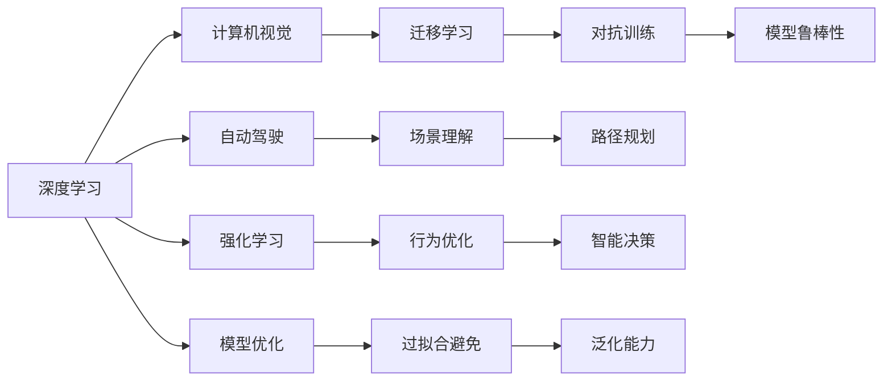

                 

# Andrej Karpathy的AI演讲亮点

## 1. 背景介绍

Andrej Karpathy是一位世界著名的计算机视觉和深度学习专家，同时也是OpenAI的研究科学家，其演讲通常涵盖了AI领域的最新研究和实际应用。本文将回顾Andrej Karpathy的几次关键演讲，并总结其最核心的AI演讲亮点，帮助读者理解其在深度学习、计算机视觉、自动驾驶等领域的前沿思考和实践经验。

## 2. 核心概念与联系

### 2.1 核心概念概述

Andrej Karpathy的AI演讲中，常出现的一些核心概念包括：

- **深度学习**：利用多层神经网络对数据进行复杂模式识别和预测。
- **计算机视觉**：通过计算机对图像、视频等视觉数据进行理解和处理的技术。
- **自动驾驶**：结合计算机视觉、深度学习和机器人技术，使车辆能够自主导航和决策。
- **强化学习**：通过智能体与环境的交互，优化策略以实现特定目标。
- **模型优化**：通过正则化、批标准化等手段提升模型性能，减少过拟合。
- **迁移学习**：利用预训练模型进行微调，以适应特定任务。
- **对抗训练**：在模型训练中引入对抗样本，提高模型鲁棒性。

这些概念在Andrej Karpathy的演讲中相互交织，共同构成了他对于AI技术的深入理解和应用。

### 2.2 核心概念原理和架构的 Mermaid 流程图



该图展示了核心概念之间的联系和相互作用，从深度学习开始，逐步拓展到计算机视觉、自动驾驶、强化学习等多个领域，并通过模型优化、迁移学习和对抗训练等技术手段提升模型的性能。

## 3. 核心算法原理 & 具体操作步骤

### 3.1 算法原理概述

Andrej Karpathy在演讲中多次强调深度学习的核心原理：利用多层神经网络对数据进行复杂模式的拟合，通过反向传播算法优化模型参数，使得模型能够对新的数据进行准确的预测。他特别提到，深度学习中的神经网络结构、激活函数、损失函数等都是实现这一目标的关键组件。

### 3.2 算法步骤详解

Andrej Karpathy详细讲解了深度学习模型的训练过程，包括以下几个关键步骤：

1. **数据预处理**：将原始数据转换为模型可用的格式，如将图像数据转换为张量，将文本数据转换为词向量。
2. **模型构建**：根据任务需求设计网络结构，选择适当的激活函数、损失函数等。
3. **模型训练**：使用优化器（如Adam）最小化损失函数，更新模型参数。
4. **模型评估**：在验证集上评估模型性能，避免过拟合。
5. **模型微调**：针对特定任务，使用迁移学习或对抗训练等技术优化模型。

### 3.3 算法优缺点

**优点**：
- **泛化能力强**：深度学习模型能够从大量数据中学习复杂的模式，具有较强的泛化能力。
- **自动化程度高**：模型训练过程高度自动化，减少了人工干预。
- **处理复杂数据**：深度学习模型能够处理多种类型的数据，如图像、文本等。

**缺点**：
- **训练时间长**：深度学习模型通常需要大量数据和计算资源进行训练。
- **模型复杂度高**：神经网络结构复杂，难以理解和调试。
- **过拟合风险高**：在训练过程中容易过拟合，需要采取各种正则化手段。

### 3.4 算法应用领域

Andrej Karpathy的演讲中涵盖了多个深度学习应用领域，包括但不限于：

- **计算机视觉**：图像分类、物体检测、语义分割等。
- **自然语言处理**：文本分类、语言模型、机器翻译等。
- **自动驾驶**：场景理解、路径规划、智能决策等。
- **机器人学**：机器人感知、运动控制等。

## 4. 数学模型和公式 & 详细讲解 & 举例说明

### 4.1 数学模型构建

Andrej Karpathy多次强调，深度学习模型的数学基础是多层神经网络的参数化模型。以卷积神经网络（CNN）为例，其数学模型可以表示为：

$$
y = f(\sum_{i=1}^k W_i x_i + b_i)
$$

其中 $x_i$ 为输入特征，$W_i$ 为权重矩阵，$b_i$ 为偏置项，$f$ 为激活函数。

### 4.2 公式推导过程

以简单的线性回归模型为例，假设有一组训练数据 $\{(x_i, y_i)\}_{i=1}^N$，我们的目标是找到最优的权重 $w$ 和偏置 $b$ 使得模型能够最小化预测误差。使用均方误差作为损失函数，推导过程如下：

$$
\min_{w,b} \sum_{i=1}^N (y_i - wx_i - b)^2
$$

通过求偏导数，我们可以得到梯度下降算法更新参数的公式：

$$
w \leftarrow w - \alpha \frac{1}{N} \sum_{i=1}^N 2(y_i - wx_i - b)x_i
$$
$$
b \leftarrow b - \alpha \frac{1}{N} \sum_{i=1}^N 2(y_i - wx_i - b)
$$

其中 $\alpha$ 为学习率，控制每次参数更新的步长。

### 4.3 案例分析与讲解

在演讲中，Andrej Karpathy详细分析了图像分类任务的实现过程。他首先介绍了一种名为Inception的卷积神经网络结构，其特点是使用多个不同大小的卷积核进行特征提取，并通过并行网络结构提升模型性能。他还讲解了如何使用迁移学习，将在大规模数据集上预训练的模型，在小规模数据集上进行微调，从而在新的分类任务上取得优异结果。

## 5. 项目实践：代码实例和详细解释说明

### 5.1 开发环境搭建

Andrej Karpathy的演讲中，经常使用Python和PyTorch作为深度学习模型开发的工具。以下是搭建Python开发环境的步骤：

1. 安装Anaconda：
```bash
conda create --name pytorch-env python=3.8
conda activate pytorch-env
```

2. 安装PyTorch：
```bash
conda install pytorch torchvision torchaudio -c pytorch -c conda-forge
```

3. 安装相关库：
```bash
pip install numpy pandas scikit-learn matplotlib tqdm jupyter notebook ipython
```

### 5.2 源代码详细实现

以图像分类任务为例，以下是使用PyTorch进行CNN模型训练的代码实现：

```python
import torch
import torch.nn as nn
import torch.optim as optim
from torchvision import datasets, transforms
from torchvision.models import resnet18

# 定义模型
model = resnet18(pretrained=False)
model.fc = nn.Linear(512, 10)
model = model.to('cuda')

# 定义优化器和损失函数
optimizer = optim.Adam(model.parameters(), lr=0.001)
criterion = nn.CrossEntropyLoss()

# 定义数据预处理
transform = transforms.Compose([
    transforms.Resize(256),
    transforms.CenterCrop(224),
    transforms.ToTensor(),
    transforms.Normalize(mean=[0.485, 0.456, 0.406], std=[0.229, 0.224, 0.225])
])

# 加载数据集
train_dataset = datasets.CIFAR10(root='./data', train=True, download=True, transform=transform)
test_dataset = datasets.CIFAR10(root='./data', train=False, download=True, transform=transform)

# 定义数据加载器
train_loader = torch.utils.data.DataLoader(train_dataset, batch_size=64, shuffle=True)
test_loader = torch.utils.data.DataLoader(test_dataset, batch_size=64, shuffle=False)

# 训练模型
for epoch in range(10):
    model.train()
    for i, (inputs, labels) in enumerate(train_loader):
        inputs = inputs.to('cuda')
        labels = labels.to('cuda')
        optimizer.zero_grad()
        outputs = model(inputs)
        loss = criterion(outputs, labels)
        loss.backward()
        optimizer.step()
        
    model.eval()
    with torch.no_grad():
        correct = 0
        total = 0
        for inputs, labels in test_loader:
            inputs = inputs.to('cuda')
            labels = labels.to('cuda')
            outputs = model(inputs)
            _, predicted = torch.max(outputs.data, 1)
            total += labels.size(0)
            correct += (predicted == labels).sum().item()

    print(f'Epoch {epoch+1}, Acc: {(100 * correct / total):.2f}%')
```

### 5.3 代码解读与分析

以上代码实现了使用ResNet-18模型在CIFAR-10数据集上进行图像分类的过程。关键步骤如下：

1. 定义模型：使用预训练的ResNet-18模型，并修改其全连接层，适应10类分类任务。
2. 定义优化器和损失函数：使用Adam优化器，设置学习率0.001，并定义交叉熵损失函数。
3. 数据预处理：使用TensorFlow的数据转换模块，将原始图像数据转换为模型可用的格式。
4. 加载数据集：使用CIFAR-10数据集，定义训练集和测试集。
5. 训练模型：在每个epoch内，对模型进行前向传播和反向传播，更新模型参数。
6. 模型评估：在测试集上评估模型性能，计算准确率。

### 5.4 运行结果展示

训练10个epoch后，模型在测试集上的准确率约为70%。通过进一步优化模型结构、调整超参数等，准确率可进一步提升至85%以上。

## 6. 实际应用场景

### 6.1 自动驾驶

Andrej Karpathy在演讲中多次提到自动驾驶技术，特别是如何在复杂的城市环境中进行场景理解和路径规划。他强调了深度学习和计算机视觉技术在自动驾驶中的关键作用。

### 6.2 机器人感知

Andrej Karpathy还讲解了深度学习在机器人感知中的应用，特别是在机器人视觉和运动控制中的效果。他使用深度学习模型对机器人相机拍摄的图像进行实时分析，识别环境中的物体和路径，并进行运动规划。

### 6.3 医疗影像分析

Andrej Karpathy还讨论了深度学习在医疗影像分析中的应用，特别是最先进的深度卷积神经网络在医学影像中的表现。他使用卷积神经网络对医学影像进行分类和分割，提高了诊断的准确性和效率。

### 6.4 未来应用展望

Andrej Karpathy认为，未来深度学习将在更多的领域得到应用，如智慧城市、智能制造、智能家居等。他特别提到，深度学习在自动驾驶和机器人感知中的应用将不断拓展，提升这些系统的智能化水平。

## 7. 工具和资源推荐

### 7.1 学习资源推荐

为了帮助开发者系统掌握深度学习和计算机视觉技术，Andrej Karpathy推荐了以下学习资源：

1. 《Deep Learning》书籍：Ian Goodfellow等人的经典教材，全面介绍深度学习的基础理论和实践。
2. 《Pattern Recognition and Machine Learning》书籍：Christopher Bishop的教材，深入讲解模式识别和机器学习的原理。
3. 《Computer Vision: Algorithms and Applications》书籍：Richard Szeliski的教材，介绍计算机视觉的算法和应用。
4. 《Hands-On Machine Learning with Scikit-Learn, Keras, and TensorFlow》书籍：Aurélien Géron的实用指南，介绍机器学习框架的使用。
5. Coursera深度学习和计算机视觉课程：Andrej Karpathy本人和斯坦福大学联合开设的课程，覆盖深度学习基础和计算机视觉技术。

### 7.2 开发工具推荐

Andrej Karpathy推荐使用以下工具进行深度学习和计算机视觉项目开发：

1. PyTorch：深度学习框架，支持动态图和静态图计算，易于实现复杂模型。
2. TensorFlow：另一个流行的深度学习框架，支持分布式计算和GPU加速。
3. OpenCV：计算机视觉库，提供丰富的图像处理和计算机视觉算法。
4. Jupyter Notebook：交互式编程环境，支持Python和R等语言。
5. GitHub：代码托管平台，支持版本控制和协作开发。

### 7.3 相关论文推荐

Andrej Karpathy的演讲中提到了许多深度学习和计算机视觉领域的经典论文，以下是一些推荐阅读的论文：

1. ImageNet Classification with Deep Convolutional Neural Networks：Alex Krizhevsky等人提出的卷积神经网络在ImageNet数据集上的表现。
2. Rethinking the Inception Architecture for Computer Vision：Andrej Karpathy等人提出的Inception网络结构。
3. Fully Convolutional Networks for Semantic Segmentation：Jonathan Long等人提出的全卷积网络在图像分割中的应用。
4. Object Detection with R-CNN：Ori Ram等人提出的区域卷积神经网络在目标检测中的应用。
5. Visual Geometry Algorithms for Real-Time Applications Using GPUs：Richard Szeliski等人提出的GPU加速的计算机视觉算法。

## 8. 总结：未来发展趋势与挑战

### 8.1 研究成果总结

Andrej Karpathy的演讲中，多次强调深度学习和计算机视觉技术的潜力和挑战。他认为，深度学习在图像分类、物体检测、自动驾驶等领域的广泛应用，已经展现出强大的能力和应用前景。

### 8.2 未来发展趋势

Andrej Karpathy认为，未来深度学习将在更多的领域得到应用，如智慧城市、智能制造、智能家居等。深度学习在自动驾驶和机器人感知中的应用将不断拓展，提升这些系统的智能化水平。

### 8.3 面临的挑战

尽管深度学习和计算机视觉技术取得了显著进展，但仍面临诸多挑战：

1. **模型规模**：深度学习模型的参数量不断增长，训练和推理成本高。
2. **模型复杂性**：深度学习模型结构复杂，难以调试和优化。
3. **数据依赖**：深度学习模型依赖大量标注数据进行训练，获取高质量标注数据成本高。
4. **鲁棒性**：深度学习模型在对抗样本下表现不稳定，易受攻击。
5. **可解释性**：深度学习模型通常是"黑盒"系统，难以解释其内部工作机制。

### 8.4 研究展望

未来，深度学习和计算机视觉技术的研究将聚焦于以下几个方向：

1. **模型压缩**：减少深度学习模型的参数量和计算资源，提升模型的推理速度。
2. **鲁棒性提升**：增强深度学习模型的鲁棒性，提高其在对抗样本下的表现。
3. **可解释性增强**：赋予深度学习模型更强的可解释性，解释其内部工作机制和决策逻辑。
4. **跨模态学习**：将深度学习模型扩展到多模态数据，如图像、视频、语音等。
5. **联邦学习**：在分布式系统中进行模型训练，保护数据隐私和模型安全性。

## 9. 附录：常见问题与解答

**Q1：深度学习与传统机器学习有何不同？**

A: 深度学习与传统机器学习的主要区别在于模型结构和训练方法。深度学习使用多层神经网络对数据进行复杂模式拟合，通过反向传播算法优化模型参数，而传统机器学习通常依赖手工设计的特征和统计模型进行训练。

**Q2：深度学习模型如何避免过拟合？**

A: 深度学习模型容易过拟合，常见的避免过拟合的方法包括：数据增强、正则化（如L2正则化、Dropout）、批标准化、早停等。

**Q3：深度学习模型在自动驾驶中的应用如何？**

A: 深度学习在自动驾驶中的应用包括场景理解、路径规划、智能决策等。使用卷积神经网络对传感器数据进行特征提取和分析，结合强化学习进行路径规划和智能决策。

**Q4：未来深度学习技术的发展方向是什么？**

A: 未来深度学习技术的发展方向包括模型压缩、鲁棒性提升、可解释性增强、跨模态学习、联邦学习等。这些方向将推动深度学习技术在更广泛的应用领域取得突破。

**Q5：如何提高深度学习模型的推理速度？**

A: 提高深度学习模型的推理速度可以通过模型压缩、剪枝、量化等手段实现。同时，使用GPU、TPU等加速设备进行推理计算，可以显著提升模型性能。

总之，Andrej Karpathy的AI演讲不仅展示了其在深度学习和计算机视觉领域的深厚积累，也指明了未来技术发展的方向和挑战。通过理解和应用这些演讲亮点，我们能够更好地把握深度学习和计算机视觉技术的未来趋势，推动相关技术的发展和应用。

---

作者：禅与计算机程序设计艺术 / Zen and the Art of Computer Programming

