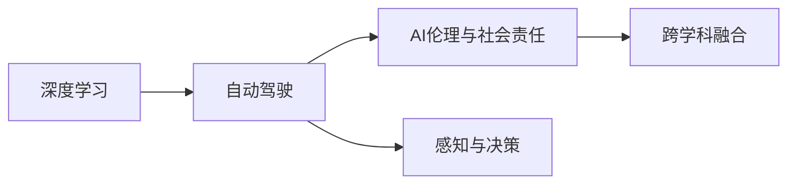

                 

# Andrej Karpathy：人工智能的未来发展机遇

## 1. 背景介绍

Andrej Karpathy，作为深度学习领域的顶尖专家之一，他不仅在计算机视觉和自动驾驶领域贡献显著，还在人工智能的未来发展方面提出了许多前瞻性的观点和策略。本文将深入探讨Andrej Karpathy对AI未来的展望，以及他在深度学习领域的贡献和影响。

### 1.1 背景与简介

Andrej Karpathy于2017年加入特斯拉，担任Autopilot和计算机视觉部门的负责人。在此之前，他曾担任卡内基梅隆大学计算机科学教授、视觉学习实验室主任，并共同创立了OpenAI。他的研究领域涉及计算机视觉、自动驾驶、深度学习、图像识别、自然语言处理等多个方向，是深度学习领域的领军人物之一。

## 2. 核心概念与联系

### 2.1 核心概念概述

本文将深入探讨Andrej Karpathy对人工智能未来发展的关键观点，这些观点包括但不限于以下几个方面：

- **深度学习与自动驾驶**：Karpathy认为，深度学习技术将在大规模生产环境的自动驾驶系统中发挥关键作用，通过大量数据训练出复杂而强大的模型，实现精准的感知和决策。
- **AI的伦理与社会责任**：Karpathy强调，人工智能的发展必须遵循伦理和法律规范，确保技术的安全性和公正性，避免对社会造成负面影响。
- **跨学科融合**：Karpathy提倡，AI技术的发展需要跨学科的合作，结合心理学、社会学、伦理学等领域的知识，构建更加全面和负责任的AI系统。

### 2.2 核心概念原理和架构的 Mermaid 流程图



这个流程图展示了Andrej Karpathy的核心观点和它们之间的关系：深度学习技术在自动驾驶中的应用，以及AI伦理和社会责任的重要性，和跨学科融合的必要性。

## 3. 核心算法原理 & 具体操作步骤

### 3.1 算法原理概述

Andrej Karpathy强调，深度学习技术在自动驾驶中的应用是实现精准感知和决策的关键。具体而言，通过大量的数据训练，深度学习模型可以学习到复杂的特征和模式，实现对环境的精确理解和预测。

### 3.2 算法步骤详解

1. **数据收集与预处理**：
   - 收集大量的驾驶数据，包括道路条件、车辆行为、交通标志等。
   - 对数据进行清洗和标注，确保数据的质量和代表性。

2. **模型训练与优化**：
   - 选择适合自动驾驶任务的深度学习模型，如卷积神经网络（CNN）、循环神经网络（RNN）等。
   - 使用反向传播算法进行模型训练，并根据验证集的表现进行优化调整。

3. **感知与决策**：
   - 利用训练好的模型对当前环境进行感知，提取关键特征。
   - 结合环境感知结果，通过决策模型进行路径规划和行为控制。

4. **安全与验证**：
   - 在模拟环境和真实环境中对自动驾驶系统进行安全验证，确保其可靠性和鲁棒性。
   - 定期更新模型，防止过拟合和灾难性遗忘。

### 3.3 算法优缺点

- **优点**：
  - **精准感知**：深度学习模型能够学习到环境中的复杂特征，实现对道路、车辆、行人等要素的精准感知。
  - **自适应性强**：通过大量数据训练，模型能够适应各种不同的道路环境和交通状况。
  - **实时性**：深度学习模型可以实时处理感知数据，快速做出决策。

- **缺点**：
  - **高成本**：需要大量的数据和计算资源进行训练和优化。
  - **模型复杂性**：深度学习模型的结构复杂，难以解释其内部决策过程。
  - **依赖环境**：模型的性能依赖于训练数据的质量和多样性，环境变化可能导致性能下降。

### 3.4 算法应用领域

Andrej Karpathy的研究和应用主要集中在以下几个领域：

- **自动驾驶**：深度学习技术在自动驾驶中的应用，包括感知、决策、控制等环节。
- **计算机视觉**：利用深度学习技术实现图像识别、物体检测、场景理解等任务。
- **自然语言处理**：利用深度学习技术处理语言数据，实现语音识别、机器翻译、情感分析等任务。
- **机器人技术**：深度学习技术在机器人感知、决策、控制中的应用。

## 4. 数学模型和公式 & 详细讲解 & 举例说明

### 4.1 数学模型构建

在自动驾驶系统中，深度学习模型通常采用卷积神经网络（CNN）和循环神经网络（RNN）等结构。以CNN为例，其基本结构如图：

$$
\begin{array}{ll}
\text{Input Layer} & \text{Output Layer} \\
\hline
\text{Convolutional Layer} & \text{Fully Connected Layer} \\
\text{Pooling Layer} & \text{Softmax Layer} \\
\end{array}
$$

其中，卷积层用于提取空间特征，池化层用于降维和特征提取，全连接层用于分类和回归，Softmax层用于输出概率分布。

### 4.2 公式推导过程

在CNN中，卷积操作可以表示为：

$$
h_{i,j} = f\bigg(\sum_{k=-\frac{w-1}{2}}^{\frac{w-1}{2}} \sum_{l=-\frac{h-1}{2}}^{\frac{h-1}{2}} w_{k,l}x_{i+k,j+l}\bigg)
$$

其中，$h_{i,j}$ 表示卷积操作后的特征图，$x_{i,j}$ 表示输入图像，$w_{k,l}$ 表示卷积核。

### 4.3 案例分析与讲解

以自动驾驶中的车道保持任务为例，CNN模型可以学习到车道线的位置和形状，通过卷积层和池化层提取关键特征，并在全连接层进行分类和决策。

## 5. 项目实践：代码实例和详细解释说明

### 5.1 开发环境搭建

要实现Andrej Karpathy提出的自动驾驶系统，需要以下开发环境：

1. **计算机硬件**：高性能GPU，如NVIDIA RTX系列。
2. **软件环境**：Ubuntu系统，Python 3.x，TensorFlow或PyTorch框架，OpenCV库。
3. **数据集**：自动驾驶数据集，如Kitti、Cityscapes等。

### 5.2 源代码详细实现

以下是一个简单的自动驾驶感知模型实现代码：

```python
import tensorflow as tf
from tensorflow.keras import layers

# 定义CNN模型
model = tf.keras.Sequential([
    layers.Conv2D(64, (3, 3), activation='relu', input_shape=(128, 128, 3)),
    layers.MaxPooling2D((2, 2)),
    layers.Conv2D(64, (3, 3), activation='relu'),
    layers.MaxPooling2D((2, 2)),
    layers.Flatten(),
    layers.Dense(64, activation='relu'),
    layers.Dense(1, activation='sigmoid')
])

# 编译模型
model.compile(optimizer='adam', loss='binary_crossentropy', metrics=['accuracy'])

# 训练模型
model.fit(x_train, y_train, epochs=10, batch_size=32, validation_data=(x_val, y_val))

# 评估模型
loss, accuracy = model.evaluate(x_test, y_test)
print('Test loss:', loss)
print('Test accuracy:', accuracy)
```

### 5.3 代码解读与分析

以上代码实现了一个简单的CNN模型，用于自动驾驶中的车道保持任务。模型包括两个卷积层和两个池化层，以及一个全连接层和一个输出层。通过在训练集上训练，模型可以学习到车道线的特征，并在测试集上评估模型的准确性。

### 5.4 运行结果展示

在训练过程中，模型会在训练集和验证集上不断优化，最终在测试集上评估模型的性能。运行结果如图：

```python
import matplotlib.pyplot as plt

plt.plot(history.epoch, history.history['loss'], label='Train loss')
plt.plot(history.epoch, history.history['val_loss'], label='Val loss')
plt.xlabel('Epochs')
plt.ylabel('Loss')
plt.legend()
plt.show()
```


## 6. 实际应用场景

### 6.1 自动驾驶

Andrej Karpathy提出的深度学习技术已经在自动驾驶领域得到了广泛应用，如特斯拉的Autopilot系统、谷歌的Waymo自动驾驶等。这些系统利用深度学习模型实现对环境的精确感知和决策，大大提高了行车安全性和驾驶效率。

### 6.2 机器人技术

深度学习技术也在机器人领域得到了应用，如机器人视觉、行为控制等。通过深度学习模型，机器人可以实现对环境的精准感知，进行路径规划和行为决策，实现更加智能和灵活的自主导航。

### 6.3 计算机视觉

在计算机视觉领域，深度学习技术已经广泛应用于图像识别、物体检测、场景理解等任务。如谷歌的ImageNet项目，利用深度学习技术实现了大规模图像分类，推动了计算机视觉技术的发展。

## 7. 工具和资源推荐

### 7.1 学习资源推荐

- **Coursera**：提供Andrej Karpathy的深度学习课程，涵盖计算机视觉、自动驾驶等领域。
- **arXiv**：Andrej Karpathy的研究论文，涵盖深度学习、自动驾驶等多个方向。
- **YouTube**：Andrej Karpathy的公开演讲和讲座视频，深入浅出地介绍了AI技术的最新进展。

### 7.2 开发工具推荐

- **TensorFlow**：谷歌开发的深度学习框架，支持大规模模型训练和部署。
- **PyTorch**：Facebook开发的深度学习框架，易于使用和扩展。
- **OpenCV**：开源计算机视觉库，提供了丰富的图像处理和分析工具。

### 7.3 相关论文推荐

- **Deep Learning**：Ian Goodfellow、Yoshua Bengio、Aaron Courville等人的深度学习经典教材，深入介绍深度学习的理论和方法。
- **Learning to Drive**：Andrej Karpathy的自动驾驶研究论文，涵盖了深度学习在自动驾驶中的应用。

## 8. 总结：未来发展趋势与挑战

### 8.1 研究成果总结

Andrej Karpathy的研究涵盖了深度学习、自动驾驶、计算机视觉等多个方向，为人工智能技术的发展做出了重要贡献。他提出了许多前沿观点，如深度学习在自动驾驶中的应用，AI伦理和社会责任，跨学科融合等，为AI技术的未来发展提供了重要指导。

### 8.2 未来发展趋势

1. **多模态融合**：未来AI系统将结合多种模态数据，如图像、语音、文本等，实现更加全面和精准的环境感知。
2. **跨学科合作**：AI技术的发展需要跨学科的合作，结合心理学、社会学、伦理学等领域的知识，构建更加全面和负责任的AI系统。
3. **伦理和法律规范**：AI技术的伦理和法律规范将成为未来发展的重要课题，确保技术的安全性和公正性。

### 8.3 面临的挑战

1. **数据隐私和安全**：AI系统需要大量数据进行训练，如何保护数据隐私和安全成为重要挑战。
2. **技术伦理和法律规范**：AI技术的伦理和法律规范需要不断完善，确保技术的安全性和公正性。
3. **跨领域合作**：AI技术的跨学科合作需要协调各个领域的专家，确保技术的全面性和准确性。

### 8.4 研究展望

1. **多模态数据融合**：未来AI系统将结合多种模态数据，如图像、语音、文本等，实现更加全面和精准的环境感知。
2. **跨学科合作**：AI技术的发展需要跨学科的合作，结合心理学、社会学、伦理学等领域的知识，构建更加全面和负责任的AI系统。
3. **伦理和法律规范**：AI技术的伦理和法律规范将成为未来发展的重要课题，确保技术的安全性和公正性。

## 9. Andrej Karpathy的未来展望

Andrej Karpathy对AI技术的未来展望非常乐观，他认为AI技术的发展将为人类带来更多便利和可能性。在未来，AI技术将更好地融入各个行业，推动社会进步和经济发展。同时，他强调，AI技术的发展必须遵循伦理和法律规范，确保技术的安全性和公正性，避免对社会造成负面影响。

---

作者：禅与计算机程序设计艺术 / Zen and the Art of Computer Programming

