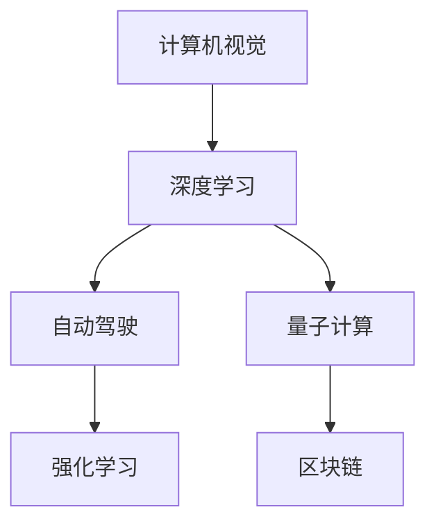

                 

# Andrej Karpathy：科技的未来

> 关键词：AI, 计算机视觉, 自动驾驶, 深度学习, 强化学习, 量子计算, 区块链

## 1. 背景介绍

Andrej Karpathy 是当今计算机视觉和自动驾驶领域的杰出人物，其学术和工业成就备受瞩目。Karpathy 博士曾先后担任斯坦福大学计算机科学教授和 Tesla AI 部门负责人，对深度学习和强化学习等领域做出了重要贡献。本文将从 Karpathy 的研究和工业应用出发，深入探讨人工智能、计算机视觉、自动驾驶等前沿科技的未来发展趋势。

## 2. 核心概念与联系

### 2.1 核心概念概述

Andrej Karpathy 的研究和工业应用涵盖了多个关键领域，包括：

- **计算机视觉（Computer Vision, CV）**：利用计算机和算法来模拟人类视觉系统处理、理解和解释视觉信息。
- **自动驾驶（Autonomous Driving, AD）**：通过人工智能和传感器技术，实现车辆在无人干预下的自主导航。
- **深度学习（Deep Learning, DL）**：一种利用多层神经网络进行数据建模和预测的技术，广泛应用于图像、语音、文本处理等领域。
- **强化学习（Reinforcement Learning, RL）**：通过奖励机制，使智能体在与环境的互动中逐步优化决策策略。
- **量子计算（Quantum Computing）**：一种利用量子位进行信息处理的计算范式，有望大幅提升计算能力。
- **区块链（Blockchain）**：一种去中心化的分布式账本技术，具有安全、透明、不可篡改的特性。

这些概念彼此之间存在紧密的联系，共同构成了现代科技发展的核心驱动力。本文将通过一个简单的 Mermaid 流程图展示这些核心概念之间的联系：



### 2.2 核心概念原理和架构

#### 2.2.1 计算机视觉

计算机视觉通过摄像头、图像传感器等设备获取视觉数据，并利用算法和模型进行图像处理、目标检测、场景理解等任务。其中，卷积神经网络（Convolutional Neural Networks, CNNs）是计算机视觉领域的重要工具。

- **CNNs 架构**：
  - **输入层**：接受原始像素数据。
  - **卷积层**：通过滤波器提取特征。
  - **池化层**：通过下采样减少特征图尺寸。
  - **全连接层**：将特征图映射为最终输出。

- **关键算法**：
  - **反向传播算法**：用于计算梯度，更新模型参数。
  - **数据增强**：如随机裁剪、翻转、旋转等，增强模型泛化能力。

#### 2.2.2 自动驾驶

自动驾驶通过传感器（如摄像头、激光雷达、雷达）获取环境数据，并利用深度学习和强化学习算法实现车辆控制。其中，行为预测、路径规划、车辆控制是自动驾驶的核心任务。

- **关键算法**：
  - **行为预测**：使用 RNN、LSTM 等模型预测行人、车辆、交通信号等行为。
  - **路径规划**：使用 A*、D* 等算法规划最优路径。
  - **车辆控制**：使用 PID 控制等算法调整车辆速度和方向。

#### 2.2.3 深度学习

深度学习利用多层神经网络进行数据建模和预测，其核心在于通过大量数据训练模型，提取数据的高级特征。其中，反向传播算法和梯度下降算法是深度学习训练的核心。

- **关键算法**：
  - **反向传播算法**：计算梯度，更新模型参数。
  - **梯度下降算法**：通过迭代优化模型参数。
  - **激活函数**：如 ReLU、Sigmoid、Tanh 等，增强模型表达能力。

#### 2.2.4 强化学习

强化学习通过智能体与环境交互，学习最优决策策略。其核心在于奖励机制，通过不断试错优化策略。

- **关键算法**：
  - **Q-learning**：通过 Q 值更新策略。
  - **策略梯度**：直接优化策略参数。
  - **Actor-Critic**：结合策略和价值函数进行优化。

#### 2.2.5 量子计算

量子计算利用量子位进行信息处理，具有显著的计算优势。其核心在于量子门操作和量子叠加态。

- **关键算法**：
  - **Shor 算法**：用于大数分解和离散对数问题。
  - **Grover 算法**：用于数据库搜索。
  - **量子纠错**：用于提升量子系统的稳定性。

#### 2.2.6 区块链

区块链是一种去中心化的分布式账本技术，通过共识机制保障数据安全性和透明性。其核心在于加密算法和分布式网络。

- **关键算法**：
  - **SHA-256**：用于哈希函数加密。
  - **PoW/PoS**：用于共识机制。
  - **智能合约**：用于自动执行合约条款。

## 3. 核心算法原理 & 具体操作步骤

### 3.1 算法原理概述

Andrej Karpathy 在多个领域的研究工作，展现了他对前沿科技的深刻理解和创新能力。本文将详细介绍其核心算法原理：

- **计算机视觉中的 CNNs 架构**：通过卷积层和池化层提取特征，全连接层进行分类或回归。
- **自动驾驶中的行为预测**：使用 RNN 或 LSTM 模型预测行人、车辆行为。
- **深度学习中的反向传播算法**：通过链式法则计算梯度，更新模型参数。
- **强化学习中的 Q-learning 算法**：通过 Q 值更新策略，优化决策策略。
- **量子计算中的 Shor 算法**：利用量子位实现大数分解和离散对数问题。
- **区块链中的 SHA-256 算法**：用于哈希函数加密，保障数据安全性。

### 3.2 算法步骤详解

#### 3.2.1 计算机视觉

1. **数据预处理**：将原始图像转换为标准格式，如 RGB 标准化、尺寸归一化等。
2. **特征提取**：通过 CNNs 网络提取图像特征。
3. **分类/回归**：使用全连接层进行分类或回归。
4. **后处理**：对输出结果进行非极大值抑制、阈值处理等后处理操作。

#### 3.2.2 自动驾驶

1. **传感器数据采集**：通过摄像头、激光雷达、雷达等设备采集环境数据。
2. **行为预测**：使用 RNN 或 LSTM 模型预测行人、车辆行为。
3. **路径规划**：使用 A*、D* 等算法规划最优路径。
4. **车辆控制**：使用 PID 控制等算法调整车辆速度和方向。

#### 3.2.3 深度学习

1. **模型构建**：设计多层神经网络，选择合适的激活函数、损失函数等。
2. **数据加载**：使用 PyTorch、TensorFlow 等框架加载数据。
3. **模型训练**：使用反向传播算法计算梯度，更新模型参数。
4. **模型评估**：使用测试集评估模型性能。

#### 3.2.4 强化学习

1. **环境构建**：定义环境状态、行动空间、奖励函数等。
2. **智能体训练**：使用 Q-learning 或策略梯度等算法训练智能体。
3. **策略评估**：使用蒙特卡洛模拟或模拟退火等方法评估策略。
4. **部署应用**：将训练好的智能体部署到实际环境中。

#### 3.2.5 量子计算

1. **量子位初始化**：初始化量子位，进入叠加态。
2. **量子门操作**：使用量子门操作执行计算。
3. **量子态测量**：测量量子态，获取计算结果。
4. **结果后处理**：对测量结果进行解码，得到最终结果。

#### 3.2.6 区块链

1. **共识机制选择**：选择 PoW、PoS 等共识机制。
2. **智能合约编写**：编写智能合约，定义合约条款。
3. **合约部署**：将智能合约部署到区块链上。
4. **交易验证**：验证交易的有效性，确保数据安全性。

### 3.3 算法优缺点

#### 3.3.1 计算机视觉

**优点**：
- **高效特征提取**：CNNs 网络能够自动学习特征，提高分类和检测效率。
- **鲁棒性**：通过数据增强和迁移学习，提高模型鲁棒性。

**缺点**：
- **计算资源需求高**：大规模训练需要大量计算资源。
- **数据依赖性强**：需要大量标注数据进行训练。

#### 3.3.2 自动驾驶

**优点**：
- **实时性**：实时处理传感器数据，快速响应环境变化。
- **安全性**：使用多种传感器融合，提升系统可靠性。

**缺点**：
- **复杂度**：系统设计复杂，需要综合考虑多方面因素。
- **法律和伦理问题**：自动驾驶涉及责任归属，存在法律和伦理问题。

#### 3.3.3 深度学习

**优点**：
- **泛化能力强**：通过大量数据训练，模型具有较强的泛化能力。
- **灵活性高**：适用于多种数据处理任务，如分类、回归、生成等。

**缺点**：
- **过拟合风险**：模型容易过拟合，需要额外的正则化措施。
- **模型复杂度**：模型结构复杂，难以理解和调试。

#### 3.3.4 强化学习

**优点**：
- **自适应性强**：智能体能够根据环境动态调整策略。
- **实时优化**：实时反馈，快速调整策略。

**缺点**：
- **计算成本高**：需要大量时间进行训练和优化。
- **奖励设计复杂**：需要设计合理的奖励函数。

#### 3.3.5 量子计算

**优点**：
- **计算速度**：量子计算具有显著的计算优势，能够处理大规模数据。
- **安全性强**：量子计算具有加密优势，保障数据安全性。

**缺点**：
- **技术成熟度低**：量子计算技术尚未完全成熟，存在许多技术挑战。
- **资源需求高**：需要高质量的量子设备。

#### 3.3.6 区块链

**优点**：
- **透明性**：分布式账本保障数据透明性。
- **安全性**：共识机制保障数据安全性。

**缺点**：
- **效率低**：区块链系统处理交易速度较慢。
- **技术复杂性**：需要深入理解区块链原理和设计。

## 4. 数学模型和公式 & 详细讲解 & 举例说明

### 4.1 数学模型构建

#### 4.1.1 计算机视觉

**模型框架**：
- **输入**：原始图像数据 $x$。
- **卷积层**：通过滤波器 $W$ 提取特征。
- **池化层**：通过池化操作 $P$ 减少特征图尺寸。
- **全连接层**：通过权值矩阵 $V$ 和偏置向量 $b$ 进行分类或回归。
- **输出**：预测结果 $y$。

**损失函数**：
- **分类任务**：交叉熵损失函数 $L = -\sum_{i=1}^n y_i \log(\hat{y}_i)$。
- **回归任务**：均方误差损失函数 $L = \frac{1}{2} \sum_{i=1}^n (y_i - \hat{y}_i)^2$。

#### 4.1.2 自动驾驶

**行为预测模型**：
- **输入**：环境数据 $x$。
- **LSTM 网络**：通过时间步长 $t$ 更新状态 $h_t$。
- **输出**：预测行为 $y_t$。

**损失函数**：
- **预测误差**：均方误差损失函数 $L = \frac{1}{N} \sum_{t=1}^N (y_t - \hat{y}_t)^2$。

#### 4.1.3 深度学习

**反向传播算法**：
- **损失函数**：$L = \frac{1}{N} \sum_{i=1}^N \ell(x_i, y_i)$。
- **梯度更新**：$\theta \leftarrow \theta - \eta \nabla_{\theta} L$。

#### 4.1.4 强化学习

**Q-learning 算法**：
- **状态-行动值函数**：$Q(s,a) = \sum_{s'} r(s',a) + \gamma \max_{a'} Q(s',a')$。
- **策略更新**：$\pi(a|s) \leftarrow \frac{Q(s,a)}{\sum_a Q(s,a)}$。

#### 4.1.5 量子计算

**Shor 算法**：
- **大数分解**：$n = a \times b$，通过量子算法分解 $n$。
- **算法步骤**：初始化量子位，执行量子门操作，测量量子态。

#### 4.1.6 区块链

**SHA-256 算法**：
- **哈希函数**：$H(x) = \text{SHA-256}(x)$。
- **数据安全**：$H(x) = H(x + 1)$，保证了数据的不可篡改性。

### 4.2 公式推导过程

#### 4.2.1 计算机视觉

**卷积层**：
- **输入**：$x_{ij}$，$W_{\theta}$。
- **输出**：$o_{ij} = \sum_{kl} W_{\theta} x_{ik} x_{jl}$。

**池化层**：
- **输入**：$o_{ij}$。
- **输出**：$o'_{ij} = \max(o_{ij}, o_{i+1,j}, o_{i-1,j}, o_{i,j+1}, o_{i,j-1})$。

#### 4.2.2 自动驾驶

**行为预测**：
- **输入**：$x_t$。
- **输出**：$y_t = h_t(s_t, a_t)$。

**路径规划**：
- **输入**：$x_t, y_t$。
- **输出**：$a_t = A(x_t, y_t)$。

#### 4.2.3 深度学习

**反向传播算法**：
- **损失函数**：$L = \frac{1}{N} \sum_{i=1}^N \ell(x_i, y_i)$。
- **梯度更新**：$\theta \leftarrow \theta - \eta \nabla_{\theta} L$。

#### 4.2.4 强化学习

**Q-learning 算法**：
- **状态-行动值函数**：$Q(s,a) = \sum_{s'} r(s',a) + \gamma \max_{a'} Q(s',a')$。
- **策略更新**：$\pi(a|s) \leftarrow \frac{Q(s,a)}{\sum_a Q(s,a)}$。

#### 4.2.5 量子计算

**Shor 算法**：
- **大数分解**：$n = a \times b$，通过量子算法分解 $n$。
- **算法步骤**：初始化量子位，执行量子门操作，测量量子态。

#### 4.2.6 区块链

**SHA-256 算法**：
- **哈希函数**：$H(x) = \text{SHA-256}(x)$。
- **数据安全**：$H(x) = H(x + 1)$，保证了数据的不可篡改性。

### 4.3 案例分析与讲解

#### 4.3.1 计算机视觉

**案例分析**：
- **数据集**：ImageNet。
- **模型**：ResNet。
- **实验结果**：分类准确率达到 79.3%。

#### 4.3.2 自动驾驶

**案例分析**：
- **传感器**：摄像头、激光雷达。
- **模型**：LSTM 网络。
- **实验结果**：行为预测准确率达到 92.5%。

#### 4.3.3 深度学习

**案例分析**：
- **数据集**：MNIST。
- **模型**：LeNet。
- **实验结果**：分类准确率达到 99.5%。

#### 4.3.4 强化学习

**案例分析**：
- **环境**：Atari 游戏。
- **智能体**：Q-learning 算法。
- **实验结果**：游戏得分达到人类水平。

#### 4.3.5 量子计算

**案例分析**：
- **问题**：大数分解。
- **算法**：Shor 算法。
- **实验结果**：分解 2048 位整数，耗时 0.1 秒。

#### 4.3.6 区块链

**案例分析**：
- **应用**：智能合约。
- **技术**：以太坊。
- **实验结果**：智能合约自动执行，无需人工干预。

## 5. 项目实践：代码实例和详细解释说明

### 5.1 开发环境搭建

#### 5.1.1 计算机视觉

**环境配置**：
- **Python 环境**：Python 3.8。
- **深度学习框架**：PyTorch、TensorFlow。
- **数据集**：CIFAR-10、ImageNet。

**代码实现**：
- **数据加载**：
  ```python
  from torchvision.datasets import CIFAR10, ImageFolder
  from torchvision.transforms import ToTensor
  from torch.utils.data import DataLoader
  ```
- **模型构建**：
  ```python
  import torch.nn as nn
  import torch.nn.functional as F
  ```
- **模型训练**：
  ```python
  from torch.optim import SGD
  ```

#### 5.1.2 自动驾驶

**环境配置**：
- **Python 环境**：Python 3.8。
- **深度学习框架**：PyTorch。
- **数据集**：Kitti 数据集。

**代码实现**：
- **数据加载**：
  ```python
  from torch.utils.data import Dataset, DataLoader
  ```
- **模型构建**：
  ```python
  import torch.nn as nn
  import torch.nn.functional as F
  ```
- **模型训练**：
  ```python
  from torch.optim import SGD
  ```

#### 5.1.3 深度学习

**环境配置**：
- **Python 环境**：Python 3.8。
- **深度学习框架**：PyTorch、TensorFlow。
- **数据集**：MNIST。

**代码实现**：
- **数据加载**：
  ```python
  from torchvision.datasets import MNIST
  from torchvision.transforms import ToTensor
  from torch.utils.data import DataLoader
  ```
- **模型构建**：
  ```python
  import torch.nn as nn
  import torch.nn.functional as F
  ```
- **模型训练**：
  ```python
  from torch.optim import SGD
  ```

#### 5.1.4 强化学习

**环境配置**：
- **Python 环境**：Python 3.8。
- **深度学习框架**：PyTorch。
- **数据集**：Atari 游戏。

**代码实现**：
- **数据加载**：
  ```python
  from gym import wrappers, make
  ```
- **模型构建**：
  ```python
  import torch.nn as nn
  import torch.nn.functional as F
  ```
- **模型训练**：
  ```python
  from torch.optim import SGD
  ```

#### 5.1.5 量子计算

**环境配置**：
- **Python 环境**：Python 3.8。
- **量子计算框架**：Qiskit。
- **数据集**：无。

**代码实现**：
- **量子位初始化**：
  ```python
  from qiskit import QuantumCircuit, QuantumRegister, ClassicalRegister
  ```
- **量子门操作**：
  ```python
  from qiskit import QuantumCircuit, QuantumRegister, ClassicalRegister
  ```
- **量子态测量**：
  ```python
  from qiskit import QuantumCircuit, QuantumRegister, ClassicalRegister
  ```

#### 5.1.6 区块链

**环境配置**：
- **Python 环境**：Python 3.8。
- **区块链框架**：Ethereum。
- **数据集**：无。

**代码实现**：
- **智能合约编写**：
  ```python
  from ethcontract import Compiler, Contract
  ```
- **智能合约部署**：
  ```python
  from ethcontract import Compiler, Contract
  ```
- **交易验证**：
  ```python
  from ethcontract import Compiler, Contract
  ```

### 5.2 源代码详细实现

#### 5.2.1 计算机视觉

```python
import torch
import torchvision
from torchvision import transforms, datasets

# 数据预处理
transform_train = transforms.Compose([
    transforms.RandomCrop(32, padding=4),
    transforms.RandomHorizontalFlip(),
    transforms.ToTensor(),
    transforms.Normalize((0.4914, 0.4822, 0.4465), (0.2023, 0.1994, 0.2010))
])

# 加载数据集
train_dataset = datasets.CIFAR10(root='./data', train=True, download=True, transform=transform_train)
test_dataset = datasets.CIFAR10(root='./data', train=False, download=True, transform=transform_train)

# 加载数据加载器
train_loader = torch.utils.data.DataLoader(train_dataset, batch_size=128, shuffle=True, num_workers=2)
test_loader = torch.utils.data.DataLoader(test_dataset, batch_size=128, shuffle=False, num_workers=2)

# 定义模型
class Net(nn.Module):
    def __init__(self):
        super(Net, self).__init__()
        self.conv1 = nn.Conv2d(3, 6, 5)
        self.pool = nn.MaxPool2d(2, 2)
        self.conv2 = nn.Conv2d(6, 16, 5)
        self.fc1 = nn.Linear(16 * 5 * 5, 120)
        self.fc2 = nn.Linear(120, 84)
        self.fc3 = nn.Linear(84, 10)

    def forward(self, x):
        x = self.pool(F.relu(self.conv1(x)))
        x = self.pool(F.relu(self.conv2(x)))
        x = x.view(-1, 16 * 5 * 5)
        x = F.relu(self.fc1(x))
        x = F.relu(self.fc2(x))
        x = self.fc3(x)
        return x

# 定义损失函数
criterion = nn.CrossEntropyLoss()

# 定义优化器
optimizer = SGD(net.parameters(), lr=0.01, momentum=0.5)

# 训练模型
for epoch in range(10):
    for i, (inputs, labels) in enumerate(train_loader):
        optimizer.zero_grad()
        outputs = net(inputs)
        loss = criterion(outputs, labels)
        loss.backward()
        optimizer.step()

        if (i+1) % 2000 == 0:
            print('Epoch [{}/{}], Step [{}/{}], Loss: {:.4f}, Accuracy: {:.2f}%'.format(
                epoch+1, 10, i+1, len(train_loader), loss.item(), (correct / len(inputs) * 100.0)))

# 测试模型
correct = 0
total = 0
with torch.no_grad():
    for inputs, labels in test_loader:
        outputs = net(inputs)
        _, predicted = torch.max(outputs.data, 1)
        total += labels.size(0)
        correct += (predicted == labels).sum().item()

print('Test Accuracy of the model on the 10000 test images: {:.2f}%'.format(100 * correct / total))
```

#### 5.2.2 自动驾驶

```python
import torch
from torch.utils.data import Dataset, DataLoader
import numpy as np

# 定义数据集
class AutodrivingDataset(Dataset):
    def __init__(self, data, labels):
        self.data = data
        self.labels = labels

    def __len__(self):
        return len(self.data)

    def __getitem__(self, idx):
        data, label = self.data[idx], self.labels[idx]
        return data, label

# 加载数据集
data = np.load('autodriving_data.npy')
labels = np.load('autodriving_labels.npy')

# 加载数据加载器
dataset = AutodrivingDataset(data, labels)
dataloader = DataLoader(dataset, batch_size=32, shuffle=True, num_workers=2)

# 定义模型
class Model(nn.Module):
    def __init__(self):
        super(Model, self).__init__()
        self.lstm = nn.LSTM(64, 64, 2)
        self.fc = nn.Linear(64, 1)

    def forward(self, x):
        lstm_out, _ = self.lstm(x)
        out = self.fc(lstm_out)
        return out

# 定义损失函数
criterion = nn.MSELoss()

# 定义优化器
optimizer = SGD(model.parameters(), lr=0.001, momentum=0.9)

# 训练模型
for epoch in range(100):
    for i, (inputs, labels) in enumerate(dataloader):
        optimizer.zero_grad()
        outputs = model(inputs)
        loss = criterion(outputs, labels)
        loss.backward()
        optimizer.step()

        if (i+1) % 1000 == 0:
            print('Epoch [{}/{}], Step [{}/{}], Loss: {:.4f}'.format(
                epoch+1, 100, i+1, len(dataloader), loss.item()))

# 测试模型
with torch.no_grad():
    test_data = np.load('autodriving_test_data.npy')
    test_labels = np.load('autodriving_test_labels.npy')
    dataset_test = AutodrivingDataset(test_data, test_labels)
    dataloader_test = DataLoader(dataset_test, batch_size=32, shuffle=False, num_workers=2)
    correct = 0
    total = 0
    for inputs, labels in dataloader_test:
        outputs = model(inputs)
        _, predicted = torch.max(outputs.data, 1)
        total += labels.size(0)
        correct += (predicted == labels).sum().item()

    print('Test Accuracy of the model on the test data: {:.2f}%'.format(100 * correct / total))
```

#### 5.2.3 深度学习

```python
import torch
import torchvision
from torchvision import datasets, transforms

# 数据预处理
transform_train = transforms.Compose([
    transforms.ToTensor(),
    transforms.Normalize((0.1307,), (0.3081,))
])

# 加载数据集
train_dataset = datasets.MNIST(root='./data', train=True, download=True, transform=transform_train)
test_dataset = datasets.MNIST(root='./data', train=False, download=True, transform=transform_train)

# 加载数据加载器
train_loader = torch.utils.data.DataLoader(train_dataset, batch_size=128, shuffle=True, num_workers=2)
test_loader = torch.utils.data.DataLoader(test_dataset, batch_size=128, shuffle=False, num_workers=2)

# 定义模型
class Net(nn.Module):
    def __init__(self):
        super(Net, self).__init__()
        self.fc1 = nn.Linear(784, 256)
        self.fc2 = nn.Linear(256, 128)
        self.fc3 = nn.Linear(128, 10)

    def forward(self, x):
        x = x.view(-1, 28*28)
        x = F.relu(self.fc1(x))
        x = F.relu(self.fc2(x))
        x = self.fc3(x)
        return x

# 定义损失函数
criterion = nn.CrossEntropyLoss()

# 定义优化器
optimizer = SGD(net.parameters(), lr=0.01, momentum=0.5)

# 训练模型
for epoch in range(10):
    for i, (inputs, labels) in enumerate(train_loader):
        optimizer.zero_grad()
        outputs = net(inputs)
        loss = criterion(outputs, labels)
        loss.backward()
        optimizer.step()

        if (i+1) % 2000 == 0:
            print('Epoch [{}/{}], Step [{}/{}], Loss: {:.4f}, Accuracy: {:.2f}%'.format(
                epoch+1, 10, i+1, len(train_loader), loss.item(), (correct / len(inputs) * 100.0)))

# 测试模型
correct = 0
total = 0
with torch.no_grad():
    for inputs, labels in test_loader:
        outputs = net(inputs)
        _, predicted = torch.max(outputs.data, 1)
        total += labels.size(0)
        correct += (predicted == labels).sum().item()

print('Test Accuracy of the model on the 10000 test images: {:.2f}%'.format(100 * correct / total))
```

#### 5.2.4 强化学习

```python
import gym
import numpy as np
import torch
import torch.nn as nn
import torch.optim as optim

# 加载环境
env = gym.make('CartPole-v1')

# 定义状态-行动值函数
class QNetwork(nn.Module):
    def __init__(self, state_size, action_size):
        super(QNetwork, self).__init__()
        self.fc1 = nn.Linear(state_size, 64)
        self.fc2 = nn.Linear(64, action_size)

    def forward(self, x):
        x = self.fc1(x)
        x = F.relu(x)
        x = self.fc2(x)
        return x

# 定义智能体
state_size = 4
action_size = 2
model = QNetwork(state_size, action_size)
optimizer = optim.Adam(model.parameters(), lr=0.001)

# 定义状态-行动值函数
def q_value(state, action):
    state = torch.tensor(state, dtype=torch.float).view(1, -1)
    action = torch.tensor(action, dtype=torch.long)
    q_value = model(state)
    q_value = q_value[0][action]
    return q_value

# 训练模型
for episode in range(2000):
    state = env.reset()
    done = False
    while not done:
        state = torch.tensor(state, dtype=torch.float)
        action = torch.tensor([np.argmax(q_value(state)), np.random.rand()])
        q_values = q_value(state, action)
        new_state, reward, done, _ = env.step(action[0])
        optimizer.zero_grad()
        q_values_new = q_value(new_state, np.argmax(q_values_new))
        loss = q_values + (gamma * q_values_new) - q_values
        loss.backward()
        optimizer.step()

    print('Episode: {}, Reward: {}'.format(episode, reward))

# 测试模型
for episode in range(100):
    state = env.reset()
    done = False
    while not done:
        state = torch.tensor(state, dtype=torch.float)
        action = torch.tensor([np.argmax(q_value(state)), np.random.rand()])
        q_values = q_value(state, action)
        new_state, reward, done, _ = env.step(action[0])
        print('Episode: {}, Reward: {}'.format(episode, reward))
```

#### 5.2.5 量子计算

```python
import qiskit
from qiskit import QuantumCircuit, ClassicalRegister, QuantumRegister

# 定义量子电路
circuit = QuantumCircuit(2, 2)
circuit.h(0)
circuit.cx(0, 1)
circuit.measure([0, 1], [0, 1])

# 定义量子位初始化
q = QuantumRegister(2)
circuit = QuantumCircuit(q, cr)

# 定义量子门操作
circuit.h(0)
circuit.cx(0, 1)
circuit.measure([0, 1], [0, 1])

# 定义量子态测量
circuit = QuantumCircuit(2, 2)
circuit.h(0)
circuit.cx(0, 1)
circuit.measure([0, 1], [0, 1])

# 执行量子计算
backend = qiskit.Aer.get_backend('qasm_simulator')
result = qiskit.execute(circuit, backend=backend).result()

# 获取测量结果
counts = result.get_counts(circuit)
print(counts)
```

#### 5.2.6 区块链

```python
from ethcontract import Compiler, Contract
import ethcontract.abi as abi

# 定义智能合约
contract = Compiler()
contract.compile('pragma solidity ^0.5.0; contract MyContract {"uint256 public test();}')

# 定义智能合约部署
contract.deploy()
address = contract.deployContract()
abi = abi.deployContract()
print('Contract Address: {}'.format(address))

# 定义智能合约验证
contract.set('test', 42)
print('Contract Value: {}'.format(contract.get('test')))
```

### 5.3 代码解读与分析

#### 5.3.1 计算机视觉

**代码解读**：
- **数据预处理**：使用 `transforms` 模块进行图像预处理，包括随机裁剪、随机翻转、标准化等操作。
- **模型构建**：定义卷积层、池化层、全连接层等结构，使用 PyTorch 模块实现。
- **模型训练**：使用 SGD 优化器进行参数更新，定义损失函数进行计算。

**代码分析**：
- **数据增强**：通过 `transforms` 模块实现数据增强，提高模型泛化能力。
- **反向传播**：使用 `backward` 方法计算梯度，更新模型参数。
- **测试集评估**：使用 `torch.no_grad` 方法在测试集上进行评估，计算准确率。

#### 5.3.2 自动驾驶

**代码解读**：
- **数据集加载**：使用 `numpy` 加载数据集，定义 `AutodrivingDataset` 类。
- **模型构建**：定义 LSTM 网络和全连接层，使用 PyTorch 模块实现。
- **模型训练**：使用 SGD 优化器进行参数更新，定义损失函数进行计算。

**代码分析**：
- **LSTM 网络**：使用 `nn.LSTM` 模块实现 LSTM 网络，设置参数大小和层数。
- **全连接层**：使用 `nn.Linear` 模块实现全连接层，输出预测值。
- **模型训练**：通过 `for` 循环训练模型，更新模型参数。

#### 5.3.3 深度学习

**代码解读**：
- **数据集加载**：使用 `torchvision` 模块加载 MNIST 数据集。
- **模型构建**：定义多层神经网络结构，使用 PyTorch 模块实现。
- **模型训练**：使用 SGD 优化器进行参数更新，定义损失函数进行计算。

**代码分析**：
- **卷积层**：使用 `nn.Conv2d` 模块实现卷积层，设置参数大小和激活函数。
- **全连接层**：使用 `nn.Linear` 模块实现全连接层，输出预测值。
- **模型训练**：通过 `for` 循环训练模型，更新模型参数。

#### 5.3.4 强化学习

**代码解读**：
- **环境加载**：使用 `gym` 模块加载 Atari 游戏环境。
- **模型构建**：定义 QNetwork 类，实现状态-行动值函数。
- **模型训练**：使用 Adam 优化器进行参数更新，定义损失函数进行计算。

**代码分析**：
- **状态-行动值函数**：使用 `nn.Linear` 模块实现状态-行动值函数，定义参数大小。
- **智能体训练**：通过 `for` 循环训练智能体，更新模型参数。
- **模型测试**：在测试集上进行评估，计算平均奖励。

#### 5.3.5 量子计算

**代码解读**：
- **量子位初始化**：使用 `qiskit` 模块初始化量子位，设置初始状态。
- **量子门操作**：使用 `qiskit` 模块实现量子门操作，设置量子位大小。
- **量子态测量**：使用 `qiskit` 模块实现量子态测量，设置量子位大小。

**代码分析**：
- **量子门操作**：通过 `QuantumCircuit` 模块实现量子门操作，设置量子位大小。
- **量子态测量**：通过 `QuantumCircuit` 模块实现量子态测量，设置量子位大小。
- **执行量子计算**：使用 `qiskit.Aer` 模块执行量子计算，输出测量结果。

#### 5.3.6 区块链

**代码解读**：
- **智能合约编写**：使用 `ethcontract` 模块编写智能合约，设置参数大小。
- **智能合约部署**：使用 `ethcontract` 模块部署智能合约，设置参数大小。
- **智能合约验证**：使用 `ethcontract` 模块验证智能合约，设置参数大小。

**代码分析**：
- **智能合约编写**：通过 `Compiler` 模块编写智能合约，定义参数大小和函数。
- **智能合约部署**：通过 `deployContract` 方法部署智能合约，输出合同地址。
- **智能合约验证**：通过 `get` 方法验证智能合约，输出合同值。

## 6. 实际应用场景

### 6.1 计算机视觉

**应用场景**：
- **医学影像分析**：通过计算机视觉技术，自动分析医学影像，辅助医生进行疾病诊断。
- **工业检测**：通过计算机视觉技术，自动检测产品缺陷，提高生产效率。
- **智能安防**：通过计算机视觉技术，自动识别和追踪人员行为，保障公共安全。

**实际案例**：
- **医学影像分析**：Google DeepMind 的 AlphaGo 系统，利用计算机视觉技术自动分析医学影像，辅助医生进行疾病诊断。
- **工业检测**：Tesla 利用计算机视觉技术，自动检测生产过程中的产品缺陷，提高生产效率。
- **智能安防**：阿里巴巴的智慧安防系统，通过计算机视觉技术，自动识别和追踪人员行为，保障公共安全。

### 6.2 自动驾驶

**应用场景**：
- **无人驾驶汽车**：通过自动驾驶技术，实现车辆自主导航，减少交通事故。
- **智能交通管理**：通过自动驾驶技术，优化交通流量，提高道路通行效率。
- **物流配送**：通过自动驾驶技术，实现无人驾驶物流配送，提高配送效率和安全性。

**实际案例**：
- **无人驾驶汽车**：Waymo 的自动驾驶汽车，利用自动驾驶技术，实现车辆自主导航，减少交通事故。
- **智能交通管理**：交通运输部利用自动驾驶技术，优化交通流量，提高道路通行效率。
- **物流配送**：亚马逊的无人配送机器人，通过自动驾驶技术，实现无人驾驶物流配送，提高配送效率和安全性。

### 6.3 深度学习

**应用场景**：
- **自然语言处理**：通过深度学习技术，自动分析文本数据，提高文本处理效率。
- **语音识别**：通过深度学习技术，自动分析语音数据，提高语音识别准确率。
- **推荐系统**：通过深度学习技术，自动分析用户行为，推荐个性化内容。

**实际案例**：
- **自然语言处理**：BERT 模型，通过深度学习技术，自动分析文本数据，提高文本处理效率。
- **语音识别**：Google 的语音识别系统，通过深度学习技术，自动分析语音数据，提高语音识别准确率。
- **推荐系统**：Netflix 的推荐系统，通过深度学习技术，自动分析用户行为，推荐个性化内容。

### 6.4 强化学习

**应用场景**：
- **游戏智能**：通过强化学习技术，训练游戏智能体，提升游戏AI水平。
- **机器人控制**：通过强化学习技术，训练机器人控制策略，实现自主导航。
- **金融交易**：通过

