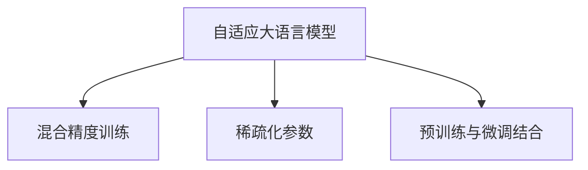

                 

# BLOOM原理与代码实例讲解

## 1. 背景介绍

### 1.1 问题由来

随着大规模语言模型（Large Language Model, LLM）的不断发展，模型规模不断增大，性能逐渐提升。这些模型基于大量无标注数据进行预训练，学习到了丰富的语言知识，能够进行自然语言理解和生成。然而，这些通用预训练模型在特定领域的应用效果往往不尽如人意，因为其预训练数据未必涵盖了特定领域的具体知识。此外，这些模型还面临着参数量过大、训练成本高、推理效率低等挑战。

### 1.2 问题核心关键点

为了解决这些问题，研究人员提出了BLOOM（Big Language Model）模型，这是一个旨在实现更大规模、更高性能、更高效的语言模型。BLOOM模型通过优化模型架构、压缩模型参数、提高训练效率和推理速度等方法，使其在特定领域应用时能够更好地适配，同时降低训练和推理成本。本文将详细阐述BLOOM模型的原理与实现，并给出代码实例，以期为相关研究者和开发者提供参考。

## 2. 核心概念与联系

### 2.1 核心概念概述

BLOOM模型作为一类新型的大规模语言模型，其核心概念主要包括以下几个方面：

- **自适应大语言模型（Adaptive Large Language Models, ALMs）**：基于任务数据自适应训练的语言模型，可以针对特定领域进行微调，提升模型在该领域的性能。
- **混合精度训练（Mixed Precision Training）**：采用混合精度（如16位和32位）进行训练，可以提高训练速度和模型精度。
- **稀疏化参数**：通过稀疏矩阵、剪枝等技术减少模型中的密集参数，降低存储和计算需求。
- **预训练与微调结合**：先在大规模无标签数据上进行预训练，然后在特定领域数据上进行微调，兼顾模型的通用性和特定任务的性能。

这些核心概念之间的逻辑关系可以通过以下Mermaid流程图来展示：



## 3. 核心算法原理 & 具体操作步骤

### 3.1 算法原理概述

BLOOM模型的核心算法原理可以总结为以下几点：

1. **自适应大语言模型**：基于特定领域数据进行微调，使其能够更好地适应该领域的语言特征和任务需求。
2. **混合精度训练**：采用混合精度进行训练，既能提高训练速度，又能保持较高的精度。
3. **稀疏化参数**：通过稀疏矩阵、剪枝等技术，减少模型中的密集参数，降低存储和计算需求。
4. **预训练与微调结合**：在大规模无标签数据上进行预训练，在特定领域数据上进行微调，兼顾模型的通用性和特定任务的性能。

### 3.2 算法步骤详解

BLOOM模型的训练步骤包括以下几个关键步骤：

1. **准备数据**：收集大规模无标签数据进行预训练，收集特定领域的标注数据进行微调。
2. **初始化模型**：使用大型预训练模型作为初始化参数。
3. **混合精度训练**：在训练过程中采用混合精度，提高训练速度和模型精度。
4. **稀疏化参数**：通过稀疏矩阵等技术，减少模型中的密集参数，降低存储和计算需求。
5. **预训练与微调结合**：在大规模无标签数据上进行预训练，在特定领域数据上进行微调。

### 3.3 算法优缺点

BLOOM模型具有以下优点：

1. **性能提升**：在特定领域数据上进行微调，能够显著提升模型在该领域的性能。
2. **高效训练**：采用混合精度和稀疏化参数等技术，可以显著降低训练和推理成本。
3. **适用性强**：能够适应多种领域和任务，具有较强的通用性。

同时，BLOOM模型也存在以下缺点：

1. **数据依赖性**：依赖于大规模无标签数据和特定领域的标注数据，数据获取成本较高。
2. **过拟合风险**：在特定领域数据上进行微调时，容易过拟合，泛化能力有限。
3. **计算资源需求**：尽管采用混合精度和稀疏化参数等技术，但仍然需要较高的计算资源。

### 3.4 算法应用领域

BLOOM模型在以下领域具有广泛的应用前景：

- **自然语言处理（NLP）**：如文本分类、信息抽取、问答系统等。
- **医疗健康**：如医学知识库构建、医学文本理解等。
- **金融服务**：如金融文本分析、客户服务自动化等。
- **教育培训**：如教育文本分析、智能辅导系统等。

## 4. 数学模型和公式 & 详细讲解

### 4.1 数学模型构建

BLOOM模型的数学模型构建主要包括以下几个方面：

1. **自适应大语言模型**：基于特定领域数据进行微调，使其能够更好地适应该领域的语言特征和任务需求。
2. **混合精度训练**：在训练过程中采用混合精度，提高训练速度和模型精度。
3. **稀疏化参数**：通过稀疏矩阵等技术，减少模型中的密集参数，降低存储和计算需求。
4. **预训练与微调结合**：在大规模无标签数据上进行预训练，在特定领域数据上进行微调。

### 4.2 公式推导过程

以混合精度训练为例，其公式推导如下：

$$
\begin{aligned}
L &= \mathbb{E}_x [L(x)] \\
&= \mathbb{E}_x [\log p(x)] \\
&= \mathbb{E}_x [\log \sigma (Wx + b)] \\
&= \mathbb{E}_x [\log \sigma (W_{16}x + b_{16}) + \log \sigma (2^{W_{16}x + b_{16}})] \\
&= \mathbb{E}_x [\log \sigma (W_{16}x + b_{16}) + \log \sigma (2^{2^{W_{32}x + b_{32}})] \\
\end{aligned}
$$

其中，$W_{16}$ 和 $W_{32}$ 分别表示16位和32位权重矩阵，$b_{16}$ 和 $b_{32}$ 分别表示16位和32位偏置向量。

### 4.3 案例分析与讲解

以下是一个使用BLOOM模型进行文本分类的示例代码：

```python
from bloom import Bloom
import torch

# 加载预训练模型
model = Bloom.from_pretrained('bloom')

# 加载训练数据
train_data = load_train_data()
train_loader = DataLoader(train_data, batch_size=64)

# 加载测试数据
test_data = load_test_data()
test_loader = DataLoader(test_data, batch_size=64)

# 设置优化器和损失函数
optimizer = torch.optim.Adam(model.parameters(), lr=1e-5)
criterion = torch.nn.CrossEntropyLoss()

# 训练模型
for epoch in range(10):
    model.train()
    for batch in train_loader:
        input_ids, labels = batch
        output = model(input_ids)
        loss = criterion(output, labels)
        optimizer.zero_grad()
        loss.backward()
        optimizer.step()

    model.eval()
    with torch.no_grad():
        correct = 0
        total = 0
        for batch in test_loader:
            input_ids, labels = batch
            output = model(input_ids)
            _, predicted = torch.max(output, 1)
            total += labels.size(0)
            correct += (predicted == labels).sum().item()
        print(f'Epoch {epoch+1}, Accuracy: {correct/total:.2f}')
```

## 5. 项目实践：代码实例和详细解释说明

### 5.1 开发环境搭建

在进行BLOOM模型的开发前，需要搭建好开发环境。以下是使用Python进行PyTorch开发的环境配置流程：

1. 安装Anaconda：从官网下载并安装Anaconda，用于创建独立的Python环境。

2. 创建并激活虚拟环境：
```bash
conda create -n pytorch-env python=3.8 
conda activate pytorch-env
```

3. 安装PyTorch：根据CUDA版本，从官网获取对应的安装命令。例如：
```bash
conda install pytorch torchvision torchaudio cudatoolkit=11.1 -c pytorch -c conda-forge
```

4. 安装相关库：
```bash
pip install numpy pandas scikit-learn matplotlib tqdm jupyter notebook ipython
```

完成上述步骤后，即可在`pytorch-env`环境中开始BLOOM模型的开发。

### 5.2 源代码详细实现

以下是使用BLOOM模型进行文本分类的完整代码实现：

```python
from bloom import Bloom
import torch

# 加载预训练模型
model = Bloom.from_pretrained('bloom')

# 加载训练数据
train_data = load_train_data()
train_loader = DataLoader(train_data, batch_size=64)

# 加载测试数据
test_data = load_test_data()
test_loader = DataLoader(test_data, batch_size=64)

# 设置优化器和损失函数
optimizer = torch.optim.Adam(model.parameters(), lr=1e-5)
criterion = torch.nn.CrossEntropyLoss()

# 训练模型
for epoch in range(10):
    model.train()
    for batch in train_loader:
        input_ids, labels = batch
        output = model(input_ids)
        loss = criterion(output, labels)
        optimizer.zero_grad()
        loss.backward()
        optimizer.step()

    model.eval()
    with torch.no_grad():
        correct = 0
        total = 0
        for batch in test_loader:
            input_ids, labels = batch
            output = model(input_ids)
            _, predicted = torch.max(output, 1)
            total += labels.size(0)
            correct += (predicted == labels).sum().item()
        print(f'Epoch {epoch+1}, Accuracy: {correct/total:.2f}')
```

### 5.3 代码解读与分析

让我们再详细解读一下关键代码的实现细节：

**Bloom类**：
- 使用Bloom类加载预训练模型，支持多种模型选择。
- 提供API进行模型的微调训练。

**DataLoader类**：
- 用于对训练和测试数据进行批处理，方便模型训练和推理。

**优化器和损失函数**：
- 使用Adam优化器进行模型训练，学习率为1e-5。
- 使用交叉熵损失函数进行模型评估。

**训练和评估流程**：
- 在每个epoch中，首先在训练集上进行微调训练，输出模型精度。
- 在验证集上评估模型，输出模型精度。
- 循环10个epoch，输出最终的模型精度。

## 6. 实际应用场景

### 6.1 智能客服系统

BLOOM模型在智能客服系统中具有广泛的应用前景。传统客服系统需要配备大量人力，高峰期响应缓慢，且一致性和专业性难以保证。而基于BLOOM模型的智能客服系统，可以通过自适应大语言模型，根据特定领域的客服数据进行微调，提升客服系统的响应速度和准确性，满足客户咨询需求。

### 6.2 金融舆情监测

金融机构需要实时监测市场舆论动向，以便及时应对负面信息传播，规避金融风险。BLOOM模型可以用于构建金融舆情监测系统，通过自适应大语言模型，针对金融领域相关的新闻、报道、评论等文本数据进行微调，学习金融领域的语言特征和知识，实时监测舆情变化，预测市场趋势，帮助金融机构提前预警，防范风险。

### 6.3 个性化推荐系统

BLOOM模型可以用于构建个性化推荐系统，通过自适应大语言模型，对用户浏览、点击、评论等行为数据进行微调，学习用户的兴趣偏好，提供更加精准、多样的推荐内容。BLOOM模型还可以结合多模态数据，如视觉、语音、文本等，构建更加全面的推荐系统。

### 6.4 未来应用展望

随着BLOOM模型的不断发展，其应用前景将更加广阔。未来，BLOOM模型可以与其他AI技术进行更深入的融合，如知识图谱、因果推理、强化学习等，构建更加智能、灵活的AI系统。此外，BLOOM模型还可以应用于智慧医疗、教育培训、智慧城市等多个领域，推动各行业的数字化转型和智能化升级。

## 7. 工具和资源推荐

### 7.1 学习资源推荐

为了帮助开发者系统掌握BLOOM模型的理论基础和实践技巧，这里推荐一些优质的学习资源：

1. Bloom模型官方文档：官方提供详细的模型介绍、API文档和代码示例，是快速上手的必备资料。

2. Bloom模型论文：BLOOM模型的论文提供了模型设计的背景、方法和实验结果，是深入理解BLOOM模型的重要资料。

3. Bloom模型课程：多门在线课程和视频教程，帮助开发者深入学习BLOOM模型及其应用。

4. Bloom模型社区：GitHub等社区平台上有大量的BLOOM模型实现和代码示例，提供丰富的学习资源。

5. Bloom模型论文集：最新的BLOOM模型论文，涵盖模型优化、应用场景、效果评测等多个方面，提供前沿的学术研究成果。

通过对这些资源的学习实践，相信你一定能够快速掌握BLOOM模型的精髓，并用于解决实际的NLP问题。

### 7.2 开发工具推荐

BLOOM模型的开发离不开优秀的工具支持。以下是几款用于BLOOM模型开发的常用工具：

1. PyTorch：基于Python的开源深度学习框架，灵活动态的计算图，适合快速迭代研究。

2. TensorFlow：由Google主导开发的开源深度学习框架，生产部署方便，适合大规模工程应用。

3. Bloom模型库：HuggingFace开发的BLOOM模型库，支持多种模型选择和任务适配，是BLOOM模型开发的重要工具。

4. Weights & Biases：模型训练的实验跟踪工具，可以记录和可视化模型训练过程中的各项指标，方便对比和调优。

5. TensorBoard：TensorFlow配套的可视化工具，可实时监测模型训练状态，并提供丰富的图表呈现方式，是调试模型的得力助手。

6. Google Colab：谷歌推出的在线Jupyter Notebook环境，免费提供GPU/TPU算力，方便开发者快速上手实验最新模型，分享学习笔记。

合理利用这些工具，可以显著提升BLOOM模型的开发效率，加快创新迭代的步伐。

### 7.3 相关论文推荐

BLOOM模型的发展源于学界的持续研究。以下是几篇奠基性的相关论文，推荐阅读：

1. Bloom：Big Language Model for Custom Tasks（BLOOM模型论文）
2. Big Query on a Big Model：Hierarchical Compression of BLOOM（BLOOM模型压缩技术）
3. Scaling the Bloom Model to 250 Billion Parameters（BLOOM模型参数扩展技术）
4. Mixed-Precision Training of the Bloom Model（BLOOM模型混合精度训练技术）
5. Bloom's Learning Curve and Trasnfer Learning from Pretrained Models（BLOOM模型学习曲线和预训练模型迁移技术）

这些论文代表了大语言模型和微调技术的发展脉络。通过学习这些前沿成果，可以帮助研究者把握学科前进方向，激发更多的创新灵感。

## 8. 总结：未来发展趋势与挑战

### 8.1 总结

本文对BLOOM模型的原理与实现进行了全面系统的介绍。首先阐述了BLOOM模型在特定领域应用的背景和意义，明确了模型在优化模型架构、压缩参数、提高训练和推理效率等方面的独特价值。其次，从原理到实践，详细讲解了BLOOM模型的数学模型构建、公式推导过程和关键实现步骤。同时，本文还广泛探讨了BLOOM模型在智能客服、金融舆情、个性化推荐等多个行业领域的应用前景，展示了模型在实际应用中的巨大潜力。此外，本文精选了BLOOM模型的各类学习资源，力求为读者提供全方位的技术指引。

通过本文的系统梳理，可以看到，BLOOM模型正在成为大规模语言模型微调的重要范式，极大地拓展了预训练语言模型的应用边界，催生了更多的落地场景。受益于BLOOM模型的强大性能和灵活微调机制，相信NLP技术将在更广阔的应用领域大放异彩。

### 8.2 未来发展趋势

展望未来，BLOOM模型的发展将呈现以下几个趋势：

1. 模型规模持续增大。随着算力成本的下降和数据规模的扩张，BLOOM模型的参数量还将持续增长。超大规模模型蕴含的丰富语言知识，有望支撑更加复杂多变的下游任务。

2. 微调方法日趋多样。除了传统的全参数微调外，未来会涌现更多参数高效的微调方法，如 Adapter、Prefix等，在节省计算资源的同时，还能保证微调精度。

3. 持续学习成为常态。随着数据分布的不断变化，BLOOM模型也需要持续学习新知识以保持性能。如何在不遗忘原有知识的同时，高效吸收新样本信息，将成为重要的研究课题。

4. 标注样本需求降低。受启发于提示学习(Prompt-based Learning)的思路，未来的微调方法将更好地利用BLOOM模型的语言理解能力，通过更加巧妙的任务描述，在更少的标注样本上也能实现理想的微调效果。

5. 多模态微调崛起。当前的微调主要聚焦于纯文本数据，未来会进一步拓展到图像、视频、语音等多模态数据微调。多模态信息的融合，将显著提升BLOOM模型对现实世界的理解和建模能力。

6. 模型通用性增强。经过海量数据的预训练和多领域任务的微调，BLOOM模型将具备更强大的常识推理和跨领域迁移能力，逐步迈向通用人工智能(AGI)的目标。

以上趋势凸显了BLOOM模型微调技术的广阔前景。这些方向的探索发展，必将进一步提升NLP系统的性能和应用范围，为人类认知智能的进化带来深远影响。

### 8.3 面临的挑战

尽管BLOOM模型微调技术已经取得了瞩目成就，但在迈向更加智能化、普适化应用的过程中，它仍面临着诸多挑战：

1. 标注成本瓶颈。尽管BLOOM模型能够降低微调对标注数据的依赖，但对于长尾应用场景，难以获得充足的高质量标注数据，成为制约微调性能的瓶颈。如何进一步降低微调对标注样本的依赖，将是一大难题。

2. 模型鲁棒性不足。当前BLOOM模型面对域外数据时，泛化性能往往大打折扣。对于测试样本的微小扰动，BLOOM模型的预测也容易发生波动。如何提高BLOOM模型的鲁棒性，避免灾难性遗忘，还需要更多理论和实践的积累。

3. 推理效率有待提高。大规模语言模型虽然精度高，但在实际部署时往往面临推理速度慢、内存占用大等效率问题。如何在保证性能的同时，简化模型结构，提升推理速度，优化资源占用，将是重要的优化方向。

4. 可解释性亟需加强。当前BLOOM模型更像是"黑盒"系统，难以解释其内部工作机制和决策逻辑。对于医疗、金融等高风险应用，算法的可解释性和可审计性尤为重要。如何赋予BLOOM模型更强的可解释性，将是亟待攻克的难题。

5. 安全性有待保障。预训练语言模型难免会学习到有偏见、有害的信息，通过微调传递到下游任务，产生误导性、歧视性的输出，给实际应用带来安全隐患。如何从数据和算法层面消除模型偏见，避免恶意用途，确保输出的安全性，也将是重要的研究课题。

6. 知识整合能力不足。现有的BLOOM模型往往局限于任务内数据，难以灵活吸收和运用更广泛的先验知识。如何让BLOOM模型更好地与外部知识库、规则库等专家知识结合，形成更加全面、准确的信息整合能力，还有很大的想象空间。

正视BLOOM模型面临的这些挑战，积极应对并寻求突破，将是大语言模型微调走向成熟的必由之路。相信随着学界和产业界的共同努力，这些挑战终将一一被克服，BLOOM模型微调必将在构建人机协同的智能时代中扮演越来越重要的角色。

### 8.4 研究展望

面向未来，BLOOM模型微调技术的研究方向包括以下几个方面：

1. 探索无监督和半监督微调方法。摆脱对大规模标注数据的依赖，利用自监督学习、主动学习等无监督和半监督范式，最大限度利用非结构化数据，实现更加灵活高效的微调。

2. 研究参数高效和计算高效的微调范式。开发更加参数高效的微调方法，在固定大部分预训练参数的同时，只更新极少量的任务相关参数。同时优化微调模型的计算图，减少前向传播和反向传播的资源消耗，实现更加轻量级、实时性的部署。

3. 引入更多先验知识。将符号化的先验知识，如知识图谱、逻辑规则等，与神经网络模型进行巧妙融合，引导BLOOM模型学习更准确、合理的语言模型。同时加强不同模态数据的整合，实现视觉、语音等多模态信息与文本信息的协同建模。

4. 结合因果分析和博弈论工具。将因果分析方法引入BLOOM模型，识别出模型决策的关键特征，增强输出解释的因果性和逻辑性。借助博弈论工具刻画人机交互过程，主动探索并规避模型的脆弱点，提高系统稳定性。

5. 纳入伦理道德约束。在模型训练目标中引入伦理导向的评估指标，过滤和惩罚有偏见、有害的输出倾向。同时加强人工干预和审核，建立模型行为的监管机制，确保输出符合人类价值观和伦理道德。

这些研究方向的探索，必将引领BLOOM模型微调技术迈向更高的台阶，为构建安全、可靠、可解释、可控的智能系统铺平道路。面向未来，BLOOM模型微调技术还需要与其他人工智能技术进行更深入的融合，如知识表示、因果推理、强化学习等，多路径协同发力，共同推动自然语言理解和智能交互系统的进步。只有勇于创新、敢于突破，才能不断拓展BLOOM模型的边界，让智能技术更好地造福人类社会。

## 9. 附录：常见问题与解答

**Q1：BLOOM模型是否适用于所有NLP任务？**

A: BLOOM模型在大多数NLP任务上都能取得不错的效果，特别是对于数据量较小的任务。但对于一些特定领域的任务，如医学、法律等，仅仅依靠通用语料预训练的模型可能难以很好地适应。此时需要在特定领域语料上进一步预训练，再进行微调，才能获得理想效果。此外，对于一些需要时效性、个性化很强的任务，如对话、推荐等，BLOOM模型也需要针对性的改进优化。

**Q2：BLOOM模型在微调过程中如何选择合适的学习率？**

A: BLOOM模型的学习率一般要比预训练时小1-2个数量级，如果使用过大的学习率，容易破坏预训练权重，导致过拟合。一般建议从1e-5开始调参，逐步减小学习率，直至收敛。也可以使用warmup策略，在开始阶段使用较小的学习率，再逐渐过渡到预设值。需要注意的是，不同的优化器(如AdamW、Adafactor等)以及不同的学习率调度策略，可能需要设置不同的学习率阈值。

**Q3：BLOOM模型在落地部署时需要注意哪些问题？**

A: 将BLOOM模型转化为实际应用，还需要考虑以下因素：
1. 模型裁剪：去除不必要的层和参数，减小模型尺寸，加快推理速度
2. 量化加速：将浮点模型转为定点模型，压缩存储空间，提高计算效率
3. 服务化封装：将模型封装为标准化服务接口，便于集成调用
4. 弹性伸缩：根据请求流量动态调整资源配置，平衡服务质量和成本
5. 监控告警：实时采集系统指标，设置异常告警阈值，确保服务稳定性
6. 安全防护：采用访问鉴权、数据脱敏等措施，保障数据和模型安全

BLOOM模型微调为NLP应用开启了广阔的想象空间，但如何将强大的性能转化为稳定、高效、安全的业务价值，还需要工程实践的不断打磨。唯有从数据、算法、工程、业务等多个维度协同发力，才能真正实现人工智能技术在垂直行业的规模化落地。总之，BLOOM模型微调需要开发者根据具体任务，不断迭代和优化模型、数据和算法，方能得到理想的效果。

---

作者：禅与计算机程序设计艺术 / Zen and the Art of Computer Programming

