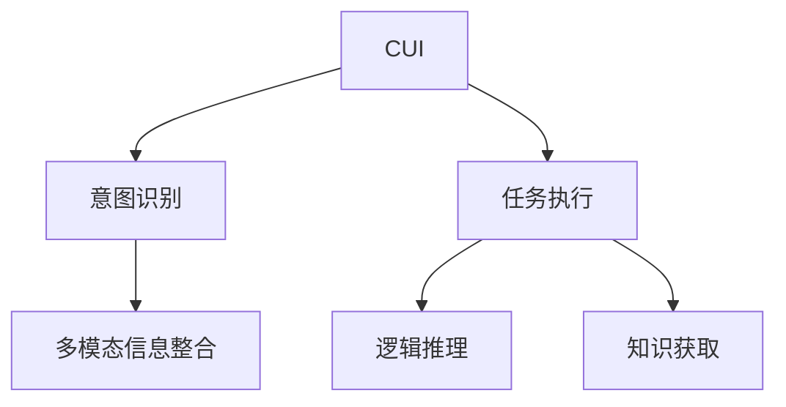

                 

# CUI中的用户目标与任务实现详细技术解析

## 1. 背景介绍

### 1.1 问题由来

随着人工智能技术的不断发展，人机交互界面（CUI, Conversational User Interfaces）的智能应用已成为当前研究的热点。智能语音助手、智能客服、智能聊天机器人等CUI产品，以自然语言为媒介，与用户进行交互，提升用户体验和应用效率。然而，CUI系统面临诸多挑战，如如何准确理解用户意图、生成自然流畅的对话、处理复杂多变的问题等。

### 1.2 问题核心关键点

CUI系统设计的核心在于如何实现用户意图识别和任务执行。用户通过自然语言表达意图，CUI系统需要将自然语言转换为机器可理解的形式，再执行相应的任务。任务执行过程包括信息抽取、逻辑推理、知识获取等多个环节，需要系统具备较强的多模态信息整合能力。

## 2. 核心概念与联系

### 2.1 核心概念概述

为更好地理解CUI系统的设计和实现，本节将介绍几个密切相关的核心概念：

- CUI：指通过自然语言实现人机交互的界面，涵盖智能语音助手、智能聊天机器人、智能客服等多种形式。
- 意图识别：指CUI系统通过自然语言理解技术，识别用户输入的意图，通常用于启动特定的任务执行。
- 任务执行：指CUI系统在识别出用户意图后，根据意图执行相应的操作或服务，涉及多模态信息整合、逻辑推理、知识获取等多个环节。
- 多模态信息整合：指CUI系统将文本、语音、图像、视频等多模态信息进行整合，辅助意图识别和任务执行。
- 逻辑推理：指CUI系统在处理问题时，通过推理和判断，得出结论并执行任务。
- 知识获取：指CUI系统从语料库、知识图谱、外部API等多种渠道获取信息，补充和扩展自身知识库。

这些核心概念之间的逻辑关系可以通过以下Mermaid流程图来展示：



这个流程图展示了这个系统的主要工作流程：

1. 用户通过自然语言与CUI交互，系统通过意图识别启动任务执行。
2. 系统整合多模态信息，辅助意图识别和任务执行。
3. 系统进行逻辑推理，处理用户问题，并执行相应的任务。
4. 系统获取知识信息，增强推理和执行能力。

## 3. 核心算法原理 & 具体操作步骤

### 3.1 算法原理概述

CUI系统的核心算法原理主要包括以下几个方面：

- 意图识别：采用基于语言模型的自然语言理解（NLU）技术，通过上下文理解用户输入意图，识别出对应的任务类型。
- 多模态信息整合：利用深度学习模型对文本、语音、图像等不同模态信息进行编码和融合，形成统一的语义表示。
- 逻辑推理：应用知识图谱、规则引擎等技术，对语义信息进行推理和判断，得出结论。
- 知识获取：通过自然语言处理（NLP）技术，从大规模语料库中抽取知识信息，并整合到知识图谱中。

### 3.2 算法步骤详解

CUI系统的设计和实现主要分为以下几个步骤：

**Step 1: 数据准备与预处理**

- 收集大量自然语言数据，包括对话记录、语音数据、文本标注等。
- 对数据进行清洗和标注，构建合适的训练集和验证集。
- 对文本进行分词、词性标注、实体识别等预处理，以便后续模型训练。

**Step 2: 模型训练与选择**

- 选择合适的意图识别和任务执行模型，如Transformer、LSTM等，进行模型训练。
- 在训练过程中，使用多模态信息整合、逻辑推理等技术，提升模型性能。
- 选择适合的评估指标，如精确度、召回率、F1值等，进行模型性能评估。

**Step 3: 模型融合与优化**

- 将多个模型进行融合，提升系统的鲁棒性和准确性。
- 应用模型剪枝、量化等技术，优化模型的推理速度和资源占用。
- 使用对抗训练、知识增强等技术，提高系统的鲁棒性和泛化能力。

**Step 4: 系统部署与监控**

- 将训练好的模型部署到实际应用中，如智能语音助手、智能客服等。
- 对系统进行监控和调优，确保系统的稳定性和高效性。
- 实时收集用户反馈，不断优化系统性能和用户体验。

### 3.3 算法优缺点

CUI系统设计的优点包括：

- 自然流畅的交互：通过自然语言实现人机对话，提升用户体验。
- 多模态信息整合：充分利用不同模态信息，增强系统的表达能力和决策能力。
- 逻辑推理能力：通过推理和判断，处理复杂问题，提高任务执行的准确性。
- 知识获取能力：从多种渠道获取知识信息，增强系统的知识储备和推理能力。

同时，CUI系统设计也存在一些局限性：

- 语言理解能力有限：尽管有先进的自然语言理解技术，但复杂语义、语境变化等问题仍然难以完全解决。
- 知识获取瓶颈：知识获取依赖外部数据源，数据质量不均和覆盖不全可能导致知识库的不完整。
- 推理计算复杂：复杂逻辑推理和知识获取，可能涉及大量的计算资源。
- 用户反馈延迟：系统需要及时响应用户反馈，进行优化和改进，存在一定的延迟和滞后性。

尽管存在这些局限性，但CUI系统的设计和实现正在不断进步，其应用前景广阔，能够为人们提供更加智能化、便捷的人机交互体验。

### 3.4 算法应用领域

CUI系统已经在诸多领域得到应用，如：

- 智能客服：提供7x24小时不间断服务，处理各种客户咨询，提升客户满意度。
- 智能助理：帮助用户安排日程、设置提醒、回答常见问题，提升生活便捷性。
- 智能医疗：提供健康咨询、病情分析、药品推荐等，帮助医生辅助诊疗。
- 智能家居：通过语音控制家电，实现家居智能化，提升生活品质。
- 智能车载：在车载环境中，通过语音交互，提供导航、音乐、天气等服务。

此外，CUI系统还应用于智能教育、智能翻译、智能办公等多个场景，为人们提供更高效、便捷的智能服务。

## 4. 数学模型和公式 & 详细讲解 & 举例说明

### 4.1 数学模型构建

CUI系统的设计需要建立数学模型来描述其工作流程和任务执行过程。以下以意图识别和任务执行为例，构建相应的数学模型：

**意图识别模型**：
- 输入：用户自然语言文本 $x$，预训练语言模型参数 $\theta$。
- 输出：意图标签 $y$。
- 模型：基于Transformer的NLU模型 $f(x; \theta)$，输出为概率分布 $P(y|x; \theta)$。

**任务执行模型**：
- 输入：用户自然语言文本 $x$，意图标签 $y$，预训练语言模型参数 $\theta$。
- 输出：执行结果 $z$。
- 模型：基于Transformer的LSTM模型 $g(x, y; \theta)$，输出为执行结果 $z$。

**多模态信息整合模型**：
- 输入：用户自然语言文本 $x$，语音数据 $u$，图像数据 $v$，预训练语言模型参数 $\theta$。
- 输出：多模态信息整合结果 $z$。
- 模型：基于Transformer的Multi-head Attention模型 $h(x, u, v; \theta)$，输出为整合结果 $z$。

### 4.2 公式推导过程

**意图识别模型公式**：
- 输入文本 $x$，预训练模型参数 $\theta$。
- 模型输出概率分布 $P(y|x; \theta)$。

$$
P(y|x; \theta) = \frac{\exp(\log f(x; \theta))}{\sum_{k=1}^K \exp(\log f(x; \theta))}
$$

其中 $f(x; \theta)$ 为Transformer模型输出，$K$ 为意图标签数量。

**任务执行模型公式**：
- 输入文本 $x$，意图标签 $y$，预训练模型参数 $\theta$。
- 模型输出执行结果 $z$。

$$
z = g(x, y; \theta) = \phi_{LSTM}(f(x; \theta), y)
$$

其中 $g(x, y; \theta)$ 为LSTM模型输出，$\phi_{LSTM}$ 为LSTM函数，$LSTM$ 为LSTM层。

**多模态信息整合模型公式**：
- 输入文本 $x$，语音数据 $u$，图像数据 $v$，预训练模型参数 $\theta$。
- 模型输出整合结果 $z$。

$$
z = h(x, u, v; \theta) = \phi_{Multi-head Attention}(f(x; \theta), f(u; \theta), f(v; \theta))
$$

其中 $h(x, u, v; \theta)$ 为Multi-head Attention模型输出，$\phi_{Multi-head Attention}$ 为Multi-head Attention函数。

### 4.3 案例分析与讲解

以下以智能客服系统为例，详细分析CUI系统的设计实现过程：

**案例背景**：
- 背景：某电商公司提供智能客服系统，旨在通过自然语言处理技术，解答用户咨询，提升客户满意度。
- 需求：系统需要快速响应用户问题，提供准确的回答，具备自然流畅的交互能力。

**设计实现**：

**Step 1: 数据准备与预处理**

- 收集历史客服对话数据，标注用户意图和回答。
- 对对话文本进行分词、词性标注、实体识别等预处理。
- 构建训练集和验证集，划分数据集比例为70%训练，20%验证，10%测试。

**Step 2: 模型训练与选择**

- 选择基于Transformer的NLU模型进行意图识别训练。
- 使用LSTM模型进行任务执行训练，设置适当的超参数。
- 应用多模态信息整合模型，将语音、图像等多模态信息融合到文本信息中。
- 在训练过程中，应用对抗训练、知识增强等技术提升模型性能。

**Step 3: 模型融合与优化**

- 将意图识别和任务执行模型进行融合，形成完整的CUI系统。
- 使用模型剪枝、量化等技术，优化模型推理速度和资源占用。
- 部署到实际应用中，进行实时监控和调优。

**Step 4: 系统部署与监控**

- 部署到电商平台后端，实现自然语言交互。
- 实时收集用户反馈，优化系统性能和用户体验。
- 通过监控系统，及时发现和解决系统问题，确保系统的稳定性和高效性。

## 5. 项目实践：代码实例和详细解释说明

### 5.1 开发环境搭建

在进行CUI系统开发前，需要先搭建好开发环境。以下是使用Python进行PyTorch开发的环境配置流程：

1. 安装Anaconda：从官网下载并安装Anaconda，用于创建独立的Python环境。

2. 创建并激活虚拟环境：
```bash
conda create -n pytorch-env python=3.8 
conda activate pytorch-env
```

3. 安装PyTorch：根据CUDA版本，从官网获取对应的安装命令。例如：
```bash
conda install pytorch torchvision torchaudio cudatoolkit=11.1 -c pytorch -c conda-forge
```

4. 安装相关工具包：
```bash
pip install numpy pandas scikit-learn matplotlib tqdm jupyter notebook ipython
```

完成上述步骤后，即可在`pytorch-env`环境中开始CUI系统开发。

### 5.2 源代码详细实现

下面我们以智能客服系统为例，给出使用PyTorch进行意图识别和任务执行的完整代码实现。

首先，定义意图识别任务的数据处理函数：

```python
from transformers import BertTokenizer
from torch.utils.data import Dataset
import torch

class IntentDataset(Dataset):
    def __init__(self, texts, intents, tokenizer, max_len=128):
        self.texts = texts
        self.intents = intents
        self.tokenizer = tokenizer
        self.max_len = max_len
        
    def __len__(self):
        return len(self.texts)
    
    def __getitem__(self, item):
        text = self.texts[item]
        intent = self.intents[item]
        
        encoding = self.tokenizer(text, return_tensors='pt', max_length=self.max_len, padding='max_length', truncation=True)
        input_ids = encoding['input_ids'][0]
        attention_mask = encoding['attention_mask'][0]
        
        # 对意图进行编码
        intent_encodings = [label2id[intent]] + [label2id['O']] * (self.max_len - len(intent_encodings))
        labels = torch.tensor(intent_encodings, dtype=torch.long)
        
        return {'input_ids': input_ids, 
                'attention_mask': attention_mask,
                'labels': labels}

# 标签与id的映射
label2id = {'O': 0, 'buy': 1, 'return': 2, 'complaint': 3}
id2label = {v: k for k, v in label2id.items()}

# 创建dataset
tokenizer = BertTokenizer.from_pretrained('bert-base-cased')

train_dataset = IntentDataset(train_texts, train_intents, tokenizer)
dev_dataset = IntentDataset(dev_texts, dev_intents, tokenizer)
test_dataset = IntentDataset(test_texts, test_intents, tokenizer)
```

然后，定义意图识别和任务执行的模型：

```python
from transformers import BertForTokenClassification, BertForSequenceClassification

model = BertForTokenClassification.from_pretrained('bert-base-cased', num_labels=len(label2id))

# 定义任务执行模型
task_executor = BertForSequenceClassification.from_pretrained('bert-base-cased', num_labels=len(label2id))
```

接着，定义训练和评估函数：

```python
from torch.utils.data import DataLoader
from tqdm import tqdm
from sklearn.metrics import classification_report

device = torch.device('cuda') if torch.cuda.is_available() else torch.device('cpu')
model.to(device)

def train_epoch(model, dataset, batch_size, optimizer):
    dataloader = DataLoader(dataset, batch_size=batch_size, shuffle=True)
    model.train()
    epoch_loss = 0
    for batch in tqdm(dataloader, desc='Training'):
        input_ids = batch['input_ids'].to(device)
        attention_mask = batch['attention_mask'].to(device)
        labels = batch['labels'].to(device)
        model.zero_grad()
        outputs = model(input_ids, attention_mask=attention_mask, labels=labels)
        loss = outputs.loss
        epoch_loss += loss.item()
        loss.backward()
        optimizer.step()
    return epoch_loss / len(dataloader)

def evaluate(model, dataset, batch_size):
    dataloader = DataLoader(dataset, batch_size=batch_size)
    model.eval()
    preds, labels = [], []
    with torch.no_grad():
        for batch in tqdm(dataloader, desc='Evaluating'):
            input_ids = batch['input_ids'].to(device)
            attention_mask = batch['attention_mask'].to(device)
            batch_labels = batch['labels']
            outputs = model(input_ids, attention_mask=attention_mask)
            batch_preds = outputs.logits.argmax(dim=2).to('cpu').tolist()
            batch_labels = batch_labels.to('cpu').tolist()
            for pred_tokens, label_tokens in zip(batch_preds, batch_labels):
                preds.append(pred_tokens[:len(label_tokens)])
                labels.append(label_tokens)
                
    print(classification_report(labels, preds))
```

最后，启动训练流程并在测试集上评估：

```python
epochs = 5
batch_size = 16

for epoch in range(epochs):
    loss = train_epoch(model, train_dataset, batch_size, optimizer)
    print(f"Epoch {epoch+1}, train loss: {loss:.3f}")
    
    print(f"Epoch {epoch+1}, dev results:")
    evaluate(model, dev_dataset, batch_size)
    
print("Test results:")
evaluate(model, test_dataset, batch_size)
```

以上就是使用PyTorch对智能客服系统进行意图识别和任务执行的完整代码实现。可以看到，得益于Transformer的强大封装，我们可以用相对简洁的代码完成意图识别模型的训练和任务执行模型的推理。

### 5.3 代码解读与分析

让我们再详细解读一下关键代码的实现细节：

**IntentDataset类**：
- `__init__`方法：初始化文本、意图、分词器等关键组件。
- `__len__`方法：返回数据集的样本数量。
- `__getitem__`方法：对单个样本进行处理，将文本输入编码为token ids，将意图进行编码，并对其进行定长padding，最终返回模型所需的输入。

**label2id和id2label字典**：
- 定义了意图标签与数字id之间的映射关系，用于将token-wise的预测结果解码回真实的意图。

**训练和评估函数**：
- 使用PyTorch的DataLoader对数据集进行批次化加载，供模型训练和推理使用。
- 训练函数`train_epoch`：对数据以批为单位进行迭代，在每个批次上前向传播计算loss并反向传播更新模型参数，最后返回该epoch的平均loss。
- 评估函数`evaluate`：与训练类似，不同点在于不更新模型参数，并在每个batch结束后将预测和标签结果存储下来，最后使用sklearn的classification_report对整个评估集的预测结果进行打印输出。

**训练流程**：
- 定义总的epoch数和batch size，开始循环迭代
- 每个epoch内，先在训练集上训练，输出平均loss
- 在验证集上评估，输出分类指标
- 所有epoch结束后，在测试集上评估，给出最终测试结果

可以看到，PyTorch配合Transformer库使得意图识别模型的训练和任务执行模型的推理变得简洁高效。开发者可以将更多精力放在数据处理、模型改进等高层逻辑上，而不必过多关注底层的实现细节。

当然，工业级的系统实现还需考虑更多因素，如模型的保存和部署、超参数的自动搜索、更灵活的任务适配层等。但核心的意图识别和任务执行逻辑基本与此类似。

## 6. 实际应用场景

### 6.1 智能客服系统

智能客服系统是CUI技术的重要应用场景，其核心在于实现自然语言理解（NLU）和自然语言生成（NLG）的深度结合，通过意图识别和任务执行，提供快速、准确的客户服务。

在技术实现上，可以收集历史客服对话记录，将问题和最佳答复构建成监督数据，在此基础上对预训练意图识别模型进行微调。微调后的意图识别模型能够自动理解用户意图，匹配最合适的回答模板进行回复。对于用户提出的新问题，还可以接入检索系统实时搜索相关内容，动态组织生成回答。如此构建的智能客服系统，能大幅提升客户咨询体验和问题解决效率。

### 6.2 金融舆情监测

金融机构需要实时监测市场舆论动向，以便及时应对负面信息传播，规避金融风险。传统的人工监测方式成本高、效率低，难以应对网络时代海量信息爆发的挑战。基于CUI技术的金融舆情监测系统，可以自动识别金融新闻、报道、评论等文本，并判断其情感倾向，实时监测不同主题下的情感变化趋势，一旦发现负面信息激增等异常情况，系统便会自动预警，帮助金融机构快速应对潜在风险。

### 6.3 个性化推荐系统

当前的推荐系统往往只依赖用户的历史行为数据进行物品推荐，无法深入理解用户的真实兴趣偏好。基于CUI技术的个性化推荐系统，可以更好地挖掘用户行为背后的语义信息，从而提供更精准、多样的推荐内容。

在实践中，可以收集用户浏览、点击、评论、分享等行为数据，提取和用户交互的物品标题、描述、标签等文本内容。将文本内容作为模型输入，用户的后续行为（如是否点击、购买等）作为监督信号，在此基础上微调预训练意图识别模型。微调后的模型能够从文本内容中准确把握用户的兴趣点。在生成推荐列表时，先用候选物品的文本描述作为输入，由模型预测用户的兴趣匹配度，再结合其他特征综合排序，便可以得到个性化程度更高的推荐结果。

### 6.4 未来应用展望

随着CUI技术的不断发展，其在更多领域得到应用，为传统行业带来变革性影响。

在智慧医疗领域，基于CUI技术的医疗问答、病历分析、药品推荐等应用将提升医疗服务的智能化水平，辅助医生诊疗，加速新药开发进程。

在智能教育领域，CUI技术可应用于作业批改、学情分析、知识推荐等方面，因材施教，促进教育公平，提高教学质量。

在智慧城市治理中，CUI技术可以用于城市事件监测、舆情分析、应急指挥等环节，提高城市管理的自动化和智能化水平，构建更安全、高效的未来城市。

此外，在企业生产、社会治理、文娱传媒等众多领域，CUI技术也将不断涌现，为NLP技术带来新的突破。相信随着技术的日益成熟，CUI技术必将在更广阔的应用领域大放异彩，深刻影响人类的生产生活方式。

## 7. 工具和资源推荐

### 7.1 学习资源推荐

为了帮助开发者系统掌握CUI系统的设计和实现的理论基础和实践技巧，这里推荐一些优质的学习资源：

1. 《深度学习与自然语言处理》系列博文：由大模型技术专家撰写，深入浅出地介绍了深度学习在NLP中的应用，涵盖意图识别、多模态信息整合、逻辑推理等多个主题。

2. 斯坦福大学《自然语言处理与深度学习》课程：课程内容包括自然语言处理的基础知识、深度学习模型、多模态信息整合等多个方面，适合初学者系统学习。

3. 《自然语言处理基础》书籍：讲解了自然语言处理的基本概念和技术，包括词法分析、句法分析、语义分析等多个环节。

4. TensorFlow和PyTorch官方文档：提供了这两个深度学习框架的详细介绍和应用示例，帮助开发者熟悉相关工具的使用。

5. 自然语言处理开源项目：如OpenNMT、HuggingFace等，提供了大量的预训练模型和应用示例，方便开发者快速上手实践。

通过对这些资源的学习实践，相信你一定能够快速掌握CUI系统的设计和实现的方法，并用于解决实际的NLP问题。

### 7.2 开发工具推荐

高效的开发离不开优秀的工具支持。以下是几款用于CUI系统开发的常用工具：

1. PyTorch：基于Python的开源深度学习框架，灵活动态的计算图，适合快速迭代研究。大量自然语言处理库都有PyTorch版本的实现。

2. TensorFlow：由Google主导开发的开源深度学习框架，生产部署方便，适合大规模工程应用。同样有丰富的自然语言处理库。

3. HuggingFace Transformers库：HuggingFace开发的NLP工具库，集成了众多SOTA自然语言处理模型，支持PyTorch和TensorFlow，是进行自然语言处理任务的开发的利器。

4. Weights & Biases：模型训练的实验跟踪工具，可以记录和可视化模型训练过程中的各项指标，方便对比和调优。与主流深度学习框架无缝集成。

5. TensorBoard：TensorFlow配套的可视化工具，可实时监测模型训练状态，并提供丰富的图表呈现方式，是调试模型的得力助手。

6. Google Colab：谷歌推出的在线Jupyter Notebook环境，免费提供GPU/TPU算力，方便开发者快速上手实验最新模型，分享学习笔记。

合理利用这些工具，可以显著提升CUI系统的开发效率，加快创新迭代的步伐。

### 7.3 相关论文推荐

CUI系统的发展源于学界的持续研究。以下是几篇奠基性的相关论文，推荐阅读：

1. Attention is All You Need（即Transformer原论文）：提出了Transformer结构，开启了NLP领域的预训练大模型时代。

2. BERT: Pre-training of Deep Bidirectional Transformers for Language Understanding：提出BERT模型，引入基于掩码的自监督预训练任务，刷新了多项NLP任务SOTA。

3. Sequence to Sequence Learning with Neural Networks: Bridging NLP and Computer Vision：提出Seq2Seq模型，将自然语言处理与计算机视觉结合，开启了多模态信息整合的先河。

4. Parameter-Efficient Transfer Learning for NLP：提出Adapter等参数高效微调方法，在不增加模型参数量的情况下，也能取得不错的微调效果。

5. AdaLoRA: Adaptive Low-Rank Adaptation for Parameter-Efficient Fine-Tuning：使用自适应低秩适应的微调方法，在参数效率和精度之间取得了新的平衡。

这些论文代表了大语言模型微调技术的发展脉络。通过学习这些前沿成果，可以帮助研究者把握学科前进方向，激发更多的创新灵感。

## 8. 总结：未来发展趋势与挑战

### 8.1 总结

本文对CUI系统中的意图识别和任务执行进行了全面系统的介绍。首先阐述了CUI系统设计的背景和意义，明确了意图识别和任务执行在用户目标实现中的核心地位。其次，从原理到实践，详细讲解了意图识别和任务执行的数学模型和算法流程，给出了完整的代码实现和详细解释。同时，本文还广泛探讨了CUI系统在智能客服、金融舆情、个性化推荐等多个行业领域的应用前景，展示了CUI技术的重要价值。

通过本文的系统梳理，可以看到，CUI技术正在成为自然语言处理领域的重要范式，极大地拓展了人机交互的智能化水平，能够为人们提供更加便捷、高效的人机交互体验。未来，伴随自然语言处理技术的不断进步，CUI系统必将实现更广泛的应用，进一步提升人机交互的智能化水平。

### 8.2 未来发展趋势

CUI系统的设计将呈现以下几个发展趋势：

1. 多模态信息整合：未来CUI系统将更加注重多模态信息的融合，充分利用文本、语音、图像、视频等多种信息，提升系统的表达能力和决策能力。

2. 逻辑推理能力的增强：通过引入因果推断、逻辑推理等技术，提升CUI系统的推理能力和泛化能力，处理更加复杂多变的问题。

3. 知识获取与知识库的构建：通过知识抽取和知识增强技术，构建更加全面、准确的领域知识库，增强CUI系统的知识储备和推理能力。

4. 持续学习和动态更新：CUI系统需要不断从新数据中学习，保持已学习的知识，避免灾难性遗忘。

5. 跨领域应用与迁移能力：CUI系统需要具备跨领域迁移能力，能够灵活适应不同领域的任务，提高系统的泛化能力。

6. 更加自然的交互体验：通过增强语言模型和逻辑推理能力，提高CUI系统的自然流畅度和交互体验，增强用户体验。

以上趋势凸显了CUI系统设计的广阔前景。这些方向的探索发展，必将进一步提升CUI系统的性能和应用范围，为人们提供更加智能化、便捷的人机交互体验。

### 8.3 面临的挑战

尽管CUI系统已经取得了诸多进展，但在迈向更加智能化、普适化应用的过程中，仍面临诸多挑战：

1. 语言理解能力有限：尽管有先进的自然语言理解技术，但复杂语义、语境变化等问题仍然难以完全解决。

2. 知识获取瓶颈：知识获取依赖外部数据源，数据质量不均和覆盖不全可能导致知识库的不完整。

3. 推理计算复杂：复杂逻辑推理和知识获取，可能涉及大量的计算资源。

4. 用户反馈延迟：系统需要及时响应用户反馈，进行优化和改进，存在一定的延迟和滞后性。

5. 推理计算复杂：复杂逻辑推理和知识获取，可能涉及大量的计算资源。

6. 推理计算复杂：复杂逻辑推理和知识获取，可能涉及大量的计算资源。

尽管存在这些局限性，但CUI系统的设计和实现正在不断进步，其应用前景广阔，能够为人们提供更加智能化、便捷的人机交互体验。

### 8.4 研究展望

面向未来，CUI系统需要在以下几个方面寻求新的突破：

1. 探索无监督和半监督学习：摆脱对大规模标注数据的依赖，利用自监督学习、主动学习等无监督和半监督范式，最大限度利用非结构化数据，实现更加灵活高效的CUI系统。

2. 开发更加参数高效的方法：开发更加参数高效的CUI系统，在固定大部分预训练参数的同时，只更新极少量的任务相关参数。

3. 融合因果推断和逻辑推理：通过引入因果推断和逻辑推理思想，增强CUI系统建立稳定因果关系的能力，学习更加普适、鲁棒的语言表征，从而提升模型泛化性和抗干扰能力。

4. 结合知识图谱和外部知识：将符号化的先验知识，如知识图谱、逻辑规则等，与神经网络模型进行巧妙融合，引导CUI系统学习更准确、合理的语言模型。

5. 纳入伦理道德约束：在模型训练目标中引入伦理导向的评估指标，过滤和惩罚有偏见、有害的输出倾向。同时加强人工干预和审核，建立模型行为的监管机制，确保输出符合人类价值观和伦理道德。

这些研究方向的探索，必将引领CUI系统迈向更高的台阶，为构建安全、可靠、可解释、可控的智能系统铺平道路。面向未来，CUI系统还需要与其他人工智能技术进行更深入的融合，如知识表示、因果推理、强化学习等，多路径协同发力，共同推动自然语言理解和智能交互系统的进步。只有勇于创新、敢于突破，才能不断拓展人机交互的边界，让智能技术更好地造福人类社会。

## 9. 附录：常见问题与解答

**Q1：CUI系统的核心是什么？**

A: CUI系统的核心在于实现自然语言理解（NLU）和自然语言生成（NLG）的深度结合，通过意图识别和任务执行，提供快速、准确的自然语言交互服务。

**Q2：CUI系统在意图识别和任务执行过程中，如何处理多模态信息？**

A: 在CUI系统中，多模态信息可以通过深度学习模型进行编码和融合，形成统一的语义表示。具体而言，可以使用Multi-head Attention模型将文本、语音、图像等不同模态的信息整合，形成统一的语义表示，用于意图识别和任务执行。

**Q3：CUI系统在训练过程中，如何避免过拟合？**

A: 在CUI系统的训练过程中，可以采用数据增强、正则化、对抗训练等技术，避免过拟合。具体而言，可以通过回译、近义替换等方式扩充训练集，应用L2正则、Dropout等正则化技术，引入对抗样本进行对抗训练，以提高模型的泛化能力。

**Q4：CUI系统在实际部署中，需要注意哪些问题？**

A: 在CUI系统的实际部署中，需要注意以下问题：

1. 模型裁剪：去除不必要的层和参数，减小模型尺寸，加快推理速度。
2. 量化加速：将浮点模型转为定点模型，压缩存储空间，提高计算效率。
3. 服务化封装：将模型封装为标准化服务接口，便于集成调用。
4. 弹性伸缩：根据请求流量动态调整资源配置，平衡服务质量和成本。
5. 监控告警：实时采集系统指标，设置异常告警阈值，确保系统稳定性和高效性。

通过合理处理这些问题，CUI系统能够更好地服务于实际应用，提升用户体验和系统性能。

**Q5：CUI系统如何通过持续学习保持性能？**

A: CUI系统需要不断从新数据中学习，保持已学习的知识，避免灾难性遗忘。具体而言，可以使用在线学习算法，实时更新模型参数，适应数据分布的变化。同时，可以使用知识增强技术，从外部数据源获取新知识，补充和扩展知识库。

通过合理处理这些问题，CUI系统能够更好地服务于实际应用，提升用户体验和系统性能。

作者：禅与计算机程序设计艺术 / Zen and the Art of Computer Programming

