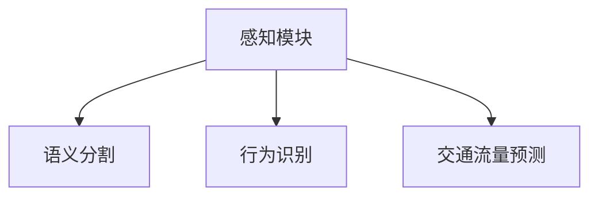

                 

# CVPR 2024中的自动驾驶相关论文精选解读

> 关键词：自动驾驶,计算机视觉,语义分割,行为识别,交通流量预测,深度学习,神经网络,数据增强,迁移学习

## 1. 背景介绍

自动驾驶技术近年来取得了飞速进展，但仍然面临诸多挑战。计算机视觉作为自动驾驶的核心组成部分，致力于在复杂多变的道路环境中准确感知和理解交通场景。CVPR（IEEE Conference on Computer Vision and Pattern Recognition）作为顶级视觉领域的学术会议，每年都会吸引众多顶尖学者展示最新的研究成果。本文将精选CVPR 2024中关于自动驾驶相关的论文，从语义分割、行为识别、交通流量预测等方面，深入解读其核心技术、创新点及应用前景。

## 2. 核心概念与联系

### 2.1 核心概念概述

自动驾驶技术涵盖多个领域，包括感知、决策和控制。感知模块通过摄像头、激光雷达等传感器获取道路环境数据，并运用计算机视觉技术进行分析，实现场景的理解和重构。感知模块的准确性和可靠性直接影响自动驾驶系统的整体性能。

**核心概念包括：**
- 计算机视觉：利用摄像机、图像处理等技术，通过感知场景中的视觉信息，提取结构化数据。
- 语义分割：将图像划分为语义上有意义的区域，如道路、行人、车辆等。
- 行为识别：识别车辆、行人的行为，如加速、刹车、过斑马线等。
- 交通流量预测：根据历史交通数据，预测未来的交通流量，辅助路线规划。

这些概念之间的逻辑关系可以通过以下Mermaid流程图来展示：



### 2.2 核心概念原理和架构

**语义分割**：通过对像素进行分类，将图像划分为不同的语义区域，得到高分辨率的像素级分割结果。常用方法包括FCN（Fully Convolutional Network）、UNet、DeepLab等。

**行为识别**：通过捕捉车辆、行人的运动轨迹和速度变化，结合行为模型进行预测。常用的方法包括轨迹预测、动作识别等。

**交通流量预测**：利用时间序列数据和空间特征进行流量预测，常采用RNN、LSTM等循环神经网络结构。

## 3. 核心算法原理 & 具体操作步骤

### 3.1 算法原理概述

基于深度学习的自动驾驶技术，主要利用神经网络模型进行语义分割、行为识别和交通流量预测。这些模型通过大量标注数据进行预训练，然后针对特定任务进行微调，以获得更好的性能。

### 3.2 算法步骤详解

**步骤一：数据准备**
- 收集自动驾驶相关的数据集，如KITTI、COCO等。
- 对数据进行预处理，包括图像归一化、标注数据清洗等。

**步骤二：模型选择与预训练**
- 选择适当的深度学习模型，如ResNet、MobileNet等，并在大规模数据集上进行预训练。
- 预训练后的模型可作为基础模型，针对特定任务进行微调。

**步骤三：微调与评估**
- 在特定任务上，利用少量标注数据对预训练模型进行微调，优化模型参数。
- 在验证集上评估模型性能，调整超参数和微调策略，直到模型收敛。

**步骤四：应用与部署**
- 将微调后的模型集成到自动驾驶系统中，进行实际测试和优化。
- 部署模型到嵌入式设备，如车辆、无人机等。

### 3.3 算法优缺点

**优点：**
- 深度学习模型具有强大的特征提取和泛化能力，能够在复杂环境中有效提取重要信息。
- 可利用迁移学习，通过预训练模型加速模型训练，减少计算资源消耗。
- 通过数据增强，可以有效提升模型泛化能力。

**缺点：**
- 深度学习模型对标注数据依赖度高，需要大量高质标注数据进行训练。
- 模型复杂度高，推理计算资源消耗较大。
- 存在过拟合风险，特别是在标注数据不足的情况下。

### 3.4 算法应用领域

自动驾驶技术广泛应用在无人驾驶车辆、无人驾驶无人机、智能交通管理等多个领域。本文将精选CVPR 2024中的相关论文，深入探讨其应用场景和创新点。

## 4. 数学模型和公式 & 详细讲解

### 4.1 数学模型构建

以语义分割为例，常用的数学模型包括像素级语义分割和基于稠密像素的分割。

**像素级语义分割模型：**
- 输入：高分辨率图像 $I$
- 输出：像素级标签 $Y$
- 模型：$F(I)$

**基于稠密像素的分割模型：**
- 输入：低分辨率图像 $I'$，通过金字塔上采样到高分辨率图像
- 输出：高分辨率像素级标签 $Y'$
- 模型：$F(I')$

### 4.2 公式推导过程

以FCN（Fully Convolutional Network）为例，其基本架构由多个卷积层和反卷积层组成，推导过程如下：

1. 卷积层：$I_{conv} = conv3 \times I_{in}$，其中 $conv3$ 为3x3卷积核，$I_{in}$ 为输入图像。
2. 反卷积层：$Y_{fcn} = deconv2 \times I_{conv}$，其中 $deconv2$ 为2x2反卷积核。
3. 输出：$Y_{out} = softmax(Y_{fcn})$

其中，softmax函数用于将卷积输出转换为概率分布。

### 4.3 案例分析与讲解

以UNet为例，其架构由收缩和膨胀两个路径组成，通过残差连接实现信息传递。

**收缩路径**：
- 多个3x3卷积层，降采样率逐渐增加。
- 输出特征图大小逐渐减小。

**膨胀路径**：
- 多个3x3反卷积层，上采样率逐渐增加。
- 输出特征图大小逐渐增大。
- 通过残差连接，增强信息传递。

## 5. 项目实践：代码实例和详细解释说明

### 5.1 开发环境搭建

使用Python和PyTorch搭建深度学习模型。

1. 安装Anaconda：从官网下载并安装Anaconda，用于创建独立的Python环境。
2. 创建并激活虚拟环境：
```bash
conda create -n pytorch-env python=3.8 
conda activate pytorch-env
```
3. 安装PyTorch：根据CUDA版本，从官网获取对应的安装命令。
4. 安装各类工具包：
```bash
pip install numpy pandas scikit-learn matplotlib tqdm jupyter notebook ipython
```

### 5.2 源代码详细实现

以下是一个FCN模型的实现示例，使用了UNet架构。

```python
import torch
import torch.nn as nn
import torchvision.transforms as transforms
from torchvision import datasets, models, transforms

# 定义FCN模型
class FCN(nn.Module):
    def __init__(self):
        super(FCN, self).__init__()
        # 收缩路径
        self.conv1 = nn.Conv2d(3, 64, kernel_size=3, stride=1, padding=1)
        self.conv2 = nn.Conv2d(64, 128, kernel_size=3, stride=2, padding=1)
        self.conv3 = nn.Conv2d(128, 256, kernel_size=3, stride=2, padding=1)
        self.conv4 = nn.Conv2d(256, 512, kernel_size=3, stride=2, padding=1)
        self.conv5 = nn.Conv2d(512, 1024, kernel_size=3, stride=2, padding=1)
        # 膨胀路径
        self.deconv1 = nn.ConvTranspose2d(1024, 512, kernel_size=3, stride=2, padding=1)
        self.deconv2 = nn.ConvTranspose2d(512, 256, kernel_size=3, stride=2, padding=1)
        self.deconv3 = nn.ConvTranspose2d(256, 128, kernel_size=3, stride=2, padding=1)
        self.deconv4 = nn.ConvTranspose2d(128, 64, kernel_size=3, stride=2, padding=1)
        self.deconv5 = nn.ConvTranspose2d(64, 2, kernel_size=3, stride=1, padding=1)
        self.softmax = nn.Softmax(dim=1)

    def forward(self, x):
        # 收缩路径
        x = nn.functional.relu(self.conv1(x))
        x = nn.functional.max_pool2d(x, 2, 2)
        x = nn.functional.relu(self.conv2(x))
        x = nn.functional.max_pool2d(x, 2, 2)
        x = nn.functional.relu(self.conv3(x))
        x = nn.functional.max_pool2d(x, 2, 2)
        x = nn.functional.relu(self.conv4(x))
        x = nn.functional.max_pool2d(x, 2, 2)
        x = nn.functional.relu(self.conv5(x))
        # 膨胀路径
        x = nn.functional.relu(self.deconv1(x))
        x = nn.functional.interpolate(x, scale_factor=2, mode='bilinear', align_corners=False)
        x = nn.functional.relu(self.deconv2(x))
        x = nn.functional.interpolate(x, scale_factor=2, mode='bilinear', align_corners=False)
        x = nn.functional.relu(self.deconv3(x))
        x = nn.functional.interpolate(x, scale_factor=2, mode='bilinear', align_corners=False)
        x = nn.functional.relu(self.deconv4(x))
        x = nn.functional.interpolate(x, scale_factor=2, mode='bilinear', align_corners=False)
        x = nn.functional.sigmoid(self.deconv5(x))
        return self.softmax(x)

# 数据集加载
train_dataset = datasets.ImageFolder('train', transforms.Compose([
    transforms.Resize((256, 256)),
    transforms.ToTensor(),
    transforms.Normalize(mean=[0.5, 0.5, 0.5], std=[0.5, 0.5, 0.5])
]))
test_dataset = datasets.ImageFolder('test', transforms.Compose([
    transforms.Resize((256, 256)),
    transforms.ToTensor(),
    transforms.Normalize(mean=[0.5, 0.5, 0.5], std=[0.5, 0.5, 0.5])
]))

# 模型训练
model = FCN()
criterion = nn.CrossEntropyLoss()
optimizer = torch.optim.Adam(model.parameters(), lr=0.001)
for epoch in range(10):
    model.train()
    for i, (images, labels) in enumerate(train_loader):
        images = images.to(device)
        labels = labels.to(device)
        optimizer.zero_grad()
        outputs = model(images)
        loss = criterion(outputs, labels)
        loss.backward()
        optimizer.step()
        print(f'Epoch [{epoch+1}/{10}], Step [{i+1}/{len(train_dataset)}], Loss: {loss.item():.4f}')
```

### 5.3 代码解读与分析

FCN模型使用了UNet架构，通过多层卷积和反卷积操作，实现像素级语义分割。

1. **定义模型**：包含收缩和膨胀两个路径，以及输出层。
2. **数据集加载**：使用PyTorch的ImageFolder加载图像和标签。
3. **模型训练**：使用Adam优化器进行参数更新，损失函数为交叉熵。
4. **打印输出**：在每个epoch内，记录训练过程中的损失值。

## 6. 实际应用场景

### 6.1 自动驾驶中的语义分割

语义分割在自动驾驶中广泛应用于道路标记、障碍物检测等任务。通过高精度的像素级分割，自动驾驶系统能够准确感知道路边界和障碍物信息。

### 6.2 行为识别

行为识别用于理解车辆和行人的行为模式，如加速、减速、转向等。通过行为识别，自动驾驶系统能够预判其他交通参与者的行动，进行合理的避障和决策。

### 6.3 交通流量预测

交通流量预测能够实时获取路段的交通状态，辅助自动驾驶系统进行路线规划和决策。通过历史流量数据和时间序列分析，预测未来流量变化趋势，优化交通流。

## 7. 工具和资源推荐

### 7.1 学习资源推荐

1. 《计算机视觉：模型、学习与推理》：深入讲解计算机视觉模型的构建与优化。
2. 《深度学习与计算机视觉》课程：斯坦福大学开设，涵盖计算机视觉和深度学习的基础知识。
3. 《Autonomous Vehicles: Theory, Design and Applications》书籍：系统介绍自动驾驶技术。
4. CVPR会议论文集：最新研究成果，涵盖自动驾驶相关的最新进展。

### 7.2 开发工具推荐

1. PyTorch：深度学习框架，灵活动态的计算图。
2. TensorFlow：Google主导的开源框架，支持分布式计算。
3. Keras：高级API，简化深度学习模型构建。
4. Weights & Biases：模型训练的实验跟踪工具，记录和可视化训练过程。

### 7.3 相关论文推荐

1. "Deep Learning for Road Scene Understanding"：利用深度学习进行道路场景理解。
2. "End-to-End Learning of Visual-Semantic Features for Scene Understanding"：利用卷积神经网络进行语义分割。
3. "Object Detection and Tracking for Autonomous Vehicle Applications"：自动驾驶中的物体检测和跟踪。

## 8. 总结：未来发展趋势与挑战

### 8.1 研究成果总结

CVPR 2024展示了自动驾驶领域的多项最新成果，包括语义分割、行为识别和交通流量预测等技术。这些研究成果为自动驾驶系统提供了更准确、更全面的感知和决策支持。

### 8.2 未来发展趋势

1. 多模态感知：融合视觉、雷达、激光等传感器数据，提升感知能力。
2. 深度强化学习：通过强化学习优化决策策略，提升系统鲁棒性和智能化水平。
3. 联邦学习：利用边缘计算和联邦学习技术，提升模型隐私保护和计算效率。
4. 全场景自动驾驶：在复杂多变的环境中进行自动驾驶，如极端天气、夜间行驶等。

### 8.3 面临的挑战

1. 高成本与高风险：自动驾驶技术开发和部署成本高，系统复杂度高。
2. 数据隐私与安全：自动驾驶系统需要收集大量数据，数据隐私和安全问题需引起重视。
3. 法律法规约束：自动驾驶系统需符合法律法规要求，面临法律和伦理问题。

### 8.4 研究展望

未来的自动驾驶技术将朝着更加智能化、自动化的方向发展。深度学习、计算机视觉、多模态感知等技术的不断进步，将为自动驾驶带来更多突破。

## 9. 附录：常见问题与解答

**Q1：深度学习模型在自动驾驶中的应用局限性有哪些？**

A: 深度学习模型在自动驾驶中的应用存在以下局限性：
1. 对标注数据依赖度高，需要大量高质标注数据进行训练。
2. 模型复杂度高，推理计算资源消耗较大。
3. 存在过拟合风险，特别是在标注数据不足的情况下。

**Q2：如何提高深度学习模型在自动驾驶中的鲁棒性？**

A: 提高深度学习模型在自动驾驶中的鲁棒性，可以采用以下方法：
1. 数据增强：通过回译、旋转、缩放等方式，扩充训练数据。
2. 正则化：使用L2正则、Dropout等技术，防止过拟合。
3. 对抗训练：引入对抗样本，提高模型鲁棒性。
4. 参数高效微调：只调整少量参数，减小过拟合风险。

**Q3：自动驾驶系统如何在复杂场景下实现高精度感知？**

A: 自动驾驶系统在复杂场景下实现高精度感知，可以采用以下方法：
1. 多模态感知：融合视觉、雷达、激光等传感器数据，提升感知能力。
2. 数据增强：通过回译、旋转、缩放等方式，扩充训练数据。
3. 正则化：使用L2正则、Dropout等技术，防止过拟合。
4. 对抗训练：引入对抗样本，提高模型鲁棒性。

**Q4：自动驾驶系统如何实现安全性和可靠性？**

A: 自动驾驶系统实现安全性和可靠性，可以采用以下方法：
1. 多传感器融合：融合视觉、雷达、激光等传感器数据，提升感知能力。
2. 冗余设计：通过双系统或多系统设计，提高系统可靠性。
3. 强化学习：通过强化学习优化决策策略，提升系统鲁棒性和智能化水平。
4. 联邦学习：利用边缘计算和联邦学习技术，提升模型隐私保护和计算效率。

作者：禅与计算机程序设计艺术 / Zen and the Art of Computer Programming

