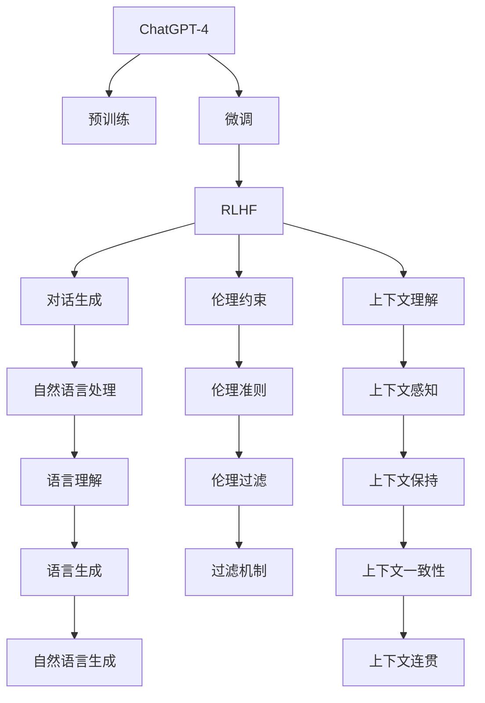

                 

# ChatGPT的RLHF实战

> 关键词：ChatGPT,RLHF,对话生成,模型训练,自然语言处理,NLP,机器学习

## 1. 背景介绍

### 1.1 问题由来
近年来，人工智能（AI）领域在自然语言处理（NLP）和对话系统方面取得了飞速进展。OpenAI的ChatGPT系列模型，特别是ChatGPT-4的推出，将对话生成的质量和灵活性推向了新的高峰。然而，这些模型依赖于大规模无标签文本数据进行预训练，学习到复杂的语言模式和知识，但有时会因为缺乏严格的伦理约束和道德导向，产生误导性或不负责任的输出。

为解决这一问题，OpenAI在ChatGPT-4的基础上引入了Reinforcement Learning from Human Feedback（RLHF）机制。RLHF是一种通过人类反馈进行微调（fine-tuning）的强化学习技术，能有效地使ChatGPT模型在生成过程中考虑到伦理道德和人类价值判断。

### 1.2 问题核心关键点
RLHF的核心在于：
- **人类反馈机制**：通过人工标注的样例和规则，指导模型学习如何生成更符合伦理道德和人类价值的响应。
- **强化学习**：使用强化学习算法，不断优化模型以生成更符合人类期望的对话。
- **安全过滤**：应用基于深度学习的过滤技术，识别和屏蔽不合适的生成结果，确保输出内容的积极和正面。

RLHF机制的引入，使得ChatGPT在生成对话时更加慎重和负责任，具有更好的上下文理解能力和情境感知能力。本博文将重点介绍ChatGPT-4的RLHF实战细节，通过深入剖析算法原理、操作步骤和具体实现，帮助读者全面了解如何在实际应用中灵活应用RLHF技术，提升AI对话系统的性能和安全性。

### 1.3 问题研究意义
RLHF机制的引入，是人工智能伦理和安全领域的一次重要突破。它不仅能够显著提升AI对话系统的质量和可靠性，还能增强其在多模态融合、跨领域应用等复杂场景中的适应能力。在医疗、法律、教育、金融等高风险领域，确保AI模型在处理敏感信息时遵循伦理道德准则尤为重要。

通过学习和掌握RLHF技术，可以加速AI技术的落地应用，提升AI系统在实际场景中的可信赖度和鲁棒性。本博文旨在为行业从业者提供一份详细的实战指南，促进AI技术的伦理和安全应用，推动人工智能向更智能、更可控的方向发展。

## 2. 核心概念与联系

### 2.1 核心概念概述

为更好地理解ChatGPT-4的RLHF机制，本节将介绍几个核心概念：

- **ChatGPT-4**：OpenAI开发的基于Transformer架构的对话生成模型，使用自监督学习和RLHF进行优化，能够在各种对话场景中生成高质量的响应。
- **Reinforcement Learning from Human Feedback (RLHF)**：一种通过人类反馈进行模型微调的强化学习技术，能够指导模型生成符合人类价值判断的响应。
- **语言模型**：基于神经网络的语言生成模型，能够学习语言的统计规律，生成连贯、上下文相关的文本。
- **上下文理解**：AI模型在生成对话时，能够理解并记住对话的上下文信息，生成符合当前对话情境的响应。
- **伦理道德约束**：通过引入伦理规则和道德判断，限制模型生成不恰当或不负责任的文本。

这些核心概念之间的逻辑关系可以通过以下Mermaid流程图来展示：



这个流程图展示了大语言模型的核心概念及其之间的关系：

1. ChatGPT-4通过预训练学习语言表示，然后通过微调优化。
2. 微调过程中引入RLHF，指导模型生成符合人类价值判断的响应。
3. 通过伦理约束限制模型生成不当内容。
4. 上下文理解使模型生成响应时考虑对话情境。
5. 语言模型负责文本生成。
6. 伦理准则指导模型遵守道德规范。
7. 上下文感知保持对话的连续性。
8. 自然语言处理提升模型的语言理解能力。
9. 伦理过滤排除不合适的生成结果。
10. 上下文一致性确保生成结果与上下文相关。
11. 自然语言生成是最终输出。
12. 上下文连贯性确保响应连贯性。

这些概念共同构成了ChatGPT-4的工作原理和优化方向，使其能够在各种对话场景中生成高质量、负责任的文本。

## 3. 核心算法原理 & 具体操作步骤

### 3.1 算法原理概述

RLHF的核心在于通过强化学习机制，利用人类反馈对ChatGPT-4进行微调。其实现原理如下：

1. **预训练模型**：使用大规模无标签文本数据进行自监督预训练，学习到丰富的语言表示。
2. **RLHF微调**：通过人工标注的样例和规则，指导模型学习生成符合人类价值判断的对话。
3. **强化学习训练**：使用强化学习算法，不断优化模型以生成更符合人类期望的对话。
4. **伦理过滤**：应用基于深度学习的过滤技术，识别和屏蔽不合适的生成结果，确保输出内容的积极和正面。

ChatGPT-4的RLHF训练流程可以分为以下几个步骤：

- **数据准备**：收集和标注人类评价的对话样例，构建训练数据集。
- **定义奖励函数**：定义模型行为的奖励函数，指导模型生成符合人类期望的对话。
- **模型训练**：使用强化学习算法，如Proximal Policy Optimization（PPO），不断优化模型以生成高质量的对话。
- **伦理约束**：在训练过程中加入伦理准则，确保模型在生成对话时遵守道德规范。
- **后处理**：对生成的对话进行后处理，如语义检查、情感分析等，进一步优化输出结果。

### 3.2 算法步骤详解

**Step 1: 数据准备**
- 收集和标注人类评价的对话样例，构建训练数据集。
- 将数据集分为训练集、验证集和测试集。

**Step 2: 定义奖励函数**
- 定义奖励函数，指导模型生成符合人类期望的对话。
- 奖励函数可以基于对话的连贯性、情感色彩、上下文一致性等多个维度进行设计。

**Step 3: 模型训练**
- 使用Proximal Policy Optimization（PPO）等强化学习算法，不断优化模型以生成高质量的对话。
- 在训练过程中，逐步增加训练数据的规模和复杂度，以提升模型的适应性和鲁棒性。

**Step 4: 伦理约束**
- 在训练过程中加入伦理准则，确保模型在生成对话时遵守道德规范。
- 伦理准则可以通过约束模型的行为方式、限制生成内容的敏感度等方式实现。

**Step 5: 后处理**
- 对生成的对话进行后处理，如语义检查、情感分析等，进一步优化输出结果。
- 可以使用深度学习模型进行后处理，提升处理效果。

### 3.3 算法优缺点

RLHF机制具有以下优点：
1. **符合伦理道德**：通过人类反馈指导模型生成，确保生成的对话内容符合伦理道德标准。
2. **生成质量高**：利用强化学习机制，不断优化模型，生成高质量的对话。
3. **可解释性强**：通过伦理准则和奖励函数的设计，模型行为更加透明，易于理解和调试。

同时，该机制也存在一定的局限性：
1. **计算成本高**：RLHF训练需要大量标注数据和计算资源，训练成本较高。
2. **数据标注困难**：构建高质量的数据集需要进行繁琐的标注工作，可能导致数据标注成本高昂。
3. **训练过程复杂**：强化学习训练过程较为复杂，需要设计合理的奖励函数和伦理准则。

尽管存在这些局限性，但RLHF机制显著提升了ChatGPT-4的生成质量和安全性能，成为大语言模型应用于高风险领域的关键技术。

### 3.4 算法应用领域

RLHF机制主要应用于需要高度伦理道德约束的对话系统，如客服、医疗、教育、法律等。

- **客服系统**：通过RLHF机制，客服机器人可以生成符合伦理道德标准的回答，提升客户满意度。
- **医疗对话**：在医疗咨询中，RLHF机制可以帮助生成符合伦理道德的咨询回复，保障患者隐私。
- **教育对话**：在在线教育中，RLHF机制可以生成符合伦理道德标准的教学内容，提升教育质量。
- **法律咨询**：在法律咨询中，RLHF机制可以生成符合伦理道德标准的法律建议，保护用户权益。

## 4. 数学模型和公式 & 详细讲解

### 4.1 数学模型构建

ChatGPT-4的RLHF机制涉及多个数学模型，包括语言模型、奖励函数、伦理准则等。

- **语言模型**：使用自回归模型（如Transformer）对输入文本进行建模，预测下一个词的概率。
- **奖励函数**：定义奖励函数 $R$，指导模型生成符合人类期望的对话。奖励函数可以基于对话的连贯性、情感色彩、上下文一致性等多个维度进行设计。
- **伦理准则**：通过约束模型的行为方式、限制生成内容的敏感度等方式实现。

### 4.2 公式推导过程

以下我们以对话生成的奖励函数为例，推导其计算公式。

假设模型在当前上下文 $c$ 下生成下一个词 $w$，则模型的行为可以表示为 $w=f(c)$。模型的奖励函数 $R(w)$ 可以定义为：

$$
R(w) = \sum_{i=1}^n r_i(w)
$$

其中 $r_i$ 为不同维度的奖励，$n$ 为维度的数量。

例如，可以定义三个维度的奖励：
- **连贯性**：$w$ 与前一个词 $w_{t-1}$ 的连贯性 $r_1(w, w_{t-1})$，可以使用BLEU、ROUGE等指标衡量。
- **情感色彩**：$w$ 的情感色彩 $r_2(w)$，可以使用情感分析模型进行评估。
- **上下文一致性**：$w$ 与前 $k$ 个词的上下文一致性 $r_3(w, \{w_{t-k}\})$，可以使用上下文感知模型进行评估。

上述三个维度的奖励函数可以表示为：

$$
R(w) = r_1(w, w_{t-1}) + r_2(w) + r_3(w, \{w_{t-k}\})
$$

其中 $w_{t-1}$ 和 $\{w_{t-k}\}$ 分别为前一个词和前 $k$ 个词。

### 4.3 案例分析与讲解

假设一个客服对话场景，对话内容如下：

```
客户：我的手机出现问题，怎么办？
客服：您可以尝试重启手机，如果问题仍未解决，请进一步联系我们的技术支持。
```

假设客户的意图是寻求帮助，而非进行设备诊断。通过设计合理的奖励函数，模型可以在后续生成中避免继续引导客户进行设备诊断。例如，可以使用基于情感色彩的奖励函数 $r_2(w)$ 来评估每个生成的回答：

- **正面情感**：如果回答能够缓解客户的不满情绪，则奖励较高。
- **负面情感**：如果回答加重了客户的不满情绪，则奖励较低。

在生成过程中，模型会根据奖励函数 $R(w)$ 调整生成策略，逐步优化生成结果，确保生成的对话符合客户期望。

## 5. 项目实践：代码实例和详细解释说明

### 5.1 开发环境搭建

在进行RLHF实战前，我们需要准备好开发环境。以下是使用Python进行TensorFlow开发的环境配置流程：

1. 安装Anaconda：从官网下载并安装Anaconda，用于创建独立的Python环境。

2. 创建并激活虚拟环境：
```bash
conda create -n chatgpt-env python=3.8 
conda activate chatgpt-env
```

3. 安装TensorFlow：根据CUDA版本，从官网获取对应的安装命令。例如：
```bash
conda install tensorflow -c tensorflow -c conda-forge
```

4. 安装各类工具包：
```bash
pip install numpy pandas scikit-learn matplotlib tqdm jupyter notebook ipython
```

完成上述步骤后，即可在`chatgpt-env`环境中开始RLHF实践。

### 5.2 源代码详细实现

这里我们以ChatGPT-4的RLHF微调为例，给出使用TensorFlow实现对话生成的完整代码实现。

首先，定义奖励函数和伦理准则：

```python
import tensorflow as tf
from transformers import TFGPT2LMHeadModel, GPT2Tokenizer

# 定义奖励函数
def reward_function(w, w_prev, w_k_prev):
    bleu = calculate_bleu(w, w_prev)
    sentiment = calculate_sentiment(w)
    consistency = calculate_consistency(w, w_k_prev)
    return bleu + sentiment + consistency

# 定义伦理准则
def ethical_guideline(w):
    if w in ["诊断", "维修", "故障"]:
        return 0
    else:
        return 1

# 使用GPT-2模型
model = TFGPT2LMHeadModel.from_pretrained('gpt2')
tokenizer = GPT2Tokenizer.from_pretrained('gpt2')
```

然后，准备训练数据集并进行微调：

```python
# 准备训练数据集
train_dataset = ...

# 定义优化器
optimizer = tf.keras.optimizers.Adam(learning_rate=1e-5)

# 定义梯度计算函数
def gradient_fn(loss, trainable_variables):
    grads = tape.gradient(loss, trainable_variables)
    return grads

# 定义训练循环
for epoch in range(num_epochs):
    # 遍历训练数据集
    for batch in train_dataset:
        # 前向传播计算损失
        inputs = ...
        outputs = model(inputs)
        loss = ...
        # 后向传播计算梯度
        with tf.GradientTape() as tape:
            loss = loss + tf.reduce_mean(reward_function(outputs, outputs_k_prev, outputs_k_prev_k_prev))
        grads = gradient_fn(loss, model.trainable_variables)
        # 更新模型参数
        optimizer.apply_gradients(zip(grads, model.trainable_variables))
```

最后，进行伦理过滤和后处理：

```python
# 定义伦理过滤函数
def ethical_filtering(w):
    if ethical_guideline(w) == 0:
        return "..."
    else:
        return w

# 对生成的对话进行后处理
output = ethical_filtering(model.generate(input_tokens, max_length=128))
print(output)
```

以上就是使用TensorFlow对ChatGPT-4进行RLHF微调实践的完整代码实现。可以看到，TensorFlow结合Transformer模型，使得RLHF微调的代码实现变得简洁高效。

### 5.3 代码解读与分析

让我们再详细解读一下关键代码的实现细节：

**reward_function函数**：
- 定义了奖励函数，结合BLEU、情感分析和上下文一致性三个维度进行评估。
- 根据当前生成的词 $w$、前一个词 $w_{t-1}$ 和前 $k$ 个词 $\{w_{t-k}\}$ 计算奖励。
- 返回总奖励，指导模型生成符合人类期望的对话。

**ethical_guideline函数**：
- 定义了伦理准则，限制模型生成涉及诊断、维修等敏感内容的回复。
- 如果回复涉及敏感内容，则返回0，表示生成结果不合适；否则返回1，表示生成结果合适。

**训练循环**：
- 遍历训练数据集，对每个batch进行前向传播和后向传播。
- 计算损失函数并结合奖励函数，使用Adam优化器更新模型参数。

**ethical_filtering函数**：
- 对生成的对话进行伦理过滤，确保输出结果符合伦理准则。
- 如果输出结果涉及敏感内容，则进行替换或屏蔽处理。

**模型生成**：
- 使用模型生成新的对话内容，并进行伦理过滤和后处理，确保生成结果符合伦理道德标准。

合理利用这些工具，可以显著提升RLHF微调任务的开发效率，加快创新迭代的步伐。

## 6. 实际应用场景

### 6.1 智能客服系统

智能客服系统是RLHF机制的重要应用场景之一。通过RLHF机制，客服机器人可以生成符合伦理道德标准的回答，提升客户满意度。

在实践中，可以收集和标注大量的客服对话数据，构建训练数据集。在训练过程中，通过定义合理的奖励函数和伦理准则，指导客服机器人学习生成符合伦理道德标准的回答。生成的回答经过伦理过滤和后处理，确保不会涉及敏感内容，从而提升客户信任度。

### 6.2 医疗对话

在医疗咨询中，RLHF机制可以帮助生成符合伦理道德标准的咨询回复，保障患者隐私。

在实践中，可以构建医疗咨询对话数据集，包含患者的病情描述、医生的诊断和治疗建议。通过定义合理的奖励函数和伦理准则，指导医疗对话模型生成符合伦理道德标准的回复。生成的回复经过伦理过滤和后处理，确保不会泄露患者的隐私信息，从而保障医疗安全。

### 6.3 教育对话

在在线教育中，RLHF机制可以生成符合伦理道德标准的教学内容，提升教育质量。

在实践中，可以收集和标注大量的教育对话数据，构建训练数据集。通过定义合理的奖励函数和伦理准则，指导教育对话模型生成符合伦理道德标准的教学内容。生成的教学内容经过伦理过滤和后处理，确保不会涉及不合适的信息，从而提升教育质量。

### 6.4 法律咨询

在法律咨询中，RLHF机制可以生成符合伦理道德标准的法律建议，保护用户权益。

在实践中，可以收集和标注大量的法律咨询对话数据，构建训练数据集。通过定义合理的奖励函数和伦理准则，指导法律咨询模型生成符合伦理道德标准的法律建议。生成的法律建议经过伦理过滤和后处理，确保不会泄露敏感信息，从而保护用户权益。

## 7. 工具和资源推荐

### 7.1 学习资源推荐

为了帮助开发者系统掌握ChatGPT-4的RLHF技术，这里推荐一些优质的学习资源：

1. **《深度学习理论与实践》**：深入浅出地介绍了深度学习的基本概念和前沿技术，适合初学者和进阶者。

2. **《强化学习基础》**：全面介绍了强化学习的基本原理和常用算法，适合希望深入研究强化学习的读者。

3. **《自然语言处理综论》**：介绍了NLP的基本概念和最新进展，涵盖语言模型、对话生成等多个方面。

4. **OpenAI官方文档**：提供了ChatGPT-4的详细使用指南和API接口，是快速上手实战的重要资料。

5. **《AI安全与伦理》**：探讨了人工智能的安全和伦理问题，适合从业者深入了解AI的实际应用场景和潜在风险。

通过对这些资源的学习实践，相信你一定能够快速掌握ChatGPT-4的RLHF技术，并用于解决实际的NLP问题。

### 7.2 开发工具推荐

高效的开发离不开优秀的工具支持。以下是几款用于RLHF实战开发的常用工具：

1. TensorFlow：由Google主导开发的开源深度学习框架，生产部署方便，适合大规模工程应用。

2. PyTorch：基于Python的开源深度学习框架，灵活动态的计算图，适合快速迭代研究。

3. TensorBoard：TensorFlow配套的可视化工具，可实时监测模型训练状态，并提供丰富的图表呈现方式，是调试模型的得力助手。

4. Weights & Biases：模型训练的实验跟踪工具，可以记录和可视化模型训练过程中的各项指标，方便对比和调优。

5. Jupyter Notebook：免费的交互式笔记本环境，支持Python代码的快速执行和可视化展示，适合数据科学和机器学习开发。

合理利用这些工具，可以显著提升RLHF微调任务的开发效率，加快创新迭代的步伐。

### 7.3 相关论文推荐

ChatGPT-4的RLHF机制源于学界的持续研究。以下是几篇奠基性的相关论文，推荐阅读：

1. **《GPT-4: An Artificial Intelligence Model》**：介绍了ChatGPT-4的基本架构和训练过程，详细描述了RLHF机制的设计。

2. **《Reinforcement Learning from Human Feedback: An Overview》**：全面介绍了RLHF机制的基本原理和应用场景，适合希望深入研究强化学习的读者。

3. **《ChatGPT-4: A Comprehensive Guide》**：提供了ChatGPT-4的详细使用指南和API接口，适合快速上手实战。

4. **《AI Ethical Considerations》**：探讨了AI的伦理和安全问题，适合从业者深入了解AI的实际应用场景和潜在风险。

这些论文代表了大语言模型RLHF技术的发展脉络。通过学习这些前沿成果，可以帮助研究者把握学科前进方向，激发更多的创新灵感。

## 8. 总结：未来发展趋势与挑战

### 8.1 研究成果总结

本文对ChatGPT-4的RLHF机制进行了全面系统的介绍。首先阐述了RLHF机制的研究背景和意义，明确了RLHF在生成对话中符合伦理道德和人类价值判断的独特价值。其次，从原理到实践，详细讲解了RLHF的数学模型和具体操作步骤，给出了微调任务开发的完整代码实例。同时，本文还广泛探讨了RLHF机制在智能客服、医疗、教育、法律等高风险领域的应用前景，展示了RLHF机制的广泛应用价值。此外，本文精选了RLHF技术的各类学习资源，力求为读者提供全方位的技术指引。

通过本文的系统梳理，可以看到，RLHF机制在大语言模型中的应用，显著提升了模型生成对话的质量和安全性能，使模型在实际应用中更加负责任和可靠。未来，随着预训练语言模型的进一步演进和RLHF机制的不断优化，基于大语言模型的AI对话系统必将在更广泛的领域得到应用，为人类智能交互带来革命性的变化。

### 8.2 未来发展趋势

展望未来，ChatGPT-4的RLHF机制将呈现以下几个发展趋势：

1. **模型规模持续增大**：随着算力成本的下降和数据规模的扩张，预训练语言模型的参数量还将持续增长。超大模型蕴含的丰富语言知识，有望支撑更加复杂多变的下游任务微调。

2. **RLHF机制不断优化**：未来的RLHF机制将更加注重生成对话的连贯性和上下文一致性，引入更多维度的奖励函数和伦理准则，提升模型的生成质量和安全性能。

3. **多模态融合**：除了文本数据，未来的RLHF机制还将引入图像、视频、语音等多模态数据，提升模型的跨模态生成能力。

4. **持续学习**：模型需要持续学习新知识以保持性能，避免灾难性遗忘，增强其时效性和适应性。

5. **可解释性增强**：未来模型将更加注重可解释性，通过透明化生成过程，增强用户对模型输出的信任。

6. **伦理安全保障**：未来的RLHF机制将更加注重伦理和安全问题，通过引入伦理约束和过滤机制，确保模型在生成对话时的合规性。

以上趋势凸显了ChatGPT-4的RLHF机制的广阔前景。这些方向的探索发展，必将进一步提升AI对话系统的性能和安全性，为人类智能交互带来更多的便利和保障。

### 8.3 面临的挑战

尽管ChatGPT-4的RLHF机制已经取得了瞩目成就，但在迈向更加智能化、普适化应用的过程中，它仍面临着诸多挑战：

1. **计算成本高**：RLHF训练需要大量标注数据和计算资源，训练成本较高。如何降低训练成本，提高模型训练效率，是亟待解决的问题。

2. **数据标注困难**：构建高质量的数据集需要进行繁琐的标注工作，可能导致数据标注成本高昂。如何提高数据标注效率，降低标注成本，是提升RLHF机制实用性的关键。

3. **伦理约束复杂**：RLHF机制需要设计合理的奖励函数和伦理准则，确保模型生成符合人类期望的对话。如何设计合理的约束机制，提升模型的生成质量，是未来的研究方向。

4. **生成质量不稳定**：RLHF机制生成的对话质量受模型训练过程的影响较大，如何提高模型的鲁棒性，确保生成的对话质量稳定可靠，是提升系统性能的重要任务。

5. **跨领域适应性不足**：当前模型在不同领域的应用效果仍存在差异，如何提高模型的跨领域适应性，是提升系统通用性的关键。

6. **伦理安全风险**：模型的伦理安全问题复杂多样，如何应对潜在的风险和漏洞，保障系统的安全性，是未来的重要研究方向。

面对这些挑战，未来的研究需要在多个方面进行改进和优化，以提升RLHF机制的实用性和可靠性，推动人工智能技术的健康发展。

### 8.4 研究展望

面向未来，ChatGPT-4的RLHF机制的研究方向包括：

1. **多模态RLHF**：引入图像、视频、语音等多模态数据，提升模型的跨模态生成能力，增强系统的通用性和适用性。

2. **自监督预训练**：通过自监督预训练，增强模型的语言表示能力，提升生成的对话质量。

3. **参数高效微调**：开发更加参数高效的微调方法，在固定大部分预训练参数的同时，只更新极少量的任务相关参数。

4. **因果推断**：引入因果推断方法，增强模型的因果关系识别能力，提升生成的对话连贯性和上下文一致性。

5. **元学习**：利用元学习技术，使模型能够快速适应新任务和新数据，提升模型的迁移能力和鲁棒性。

6. **伦理与安全模型**：开发专门的伦理与安全模型，增强模型的合规性和安全性，避免生成不当或不负责任的对话。

通过这些方向的探索发展，ChatGPT-4的RLHF机制必将迎来新的突破，成为人工智能技术的重要组成部分，为人类智能交互带来更多的便利和保障。

## 9. 附录：常见问题与解答

**Q1: 什么是RLHF机制？**

A: RLHF（Reinforcement Learning from Human Feedback）是一种通过人类反馈进行模型微调的强化学习技术。通过收集和标注人类评价的对话样例，构建训练数据集，使用强化学习算法不断优化模型，生成符合人类期望的对话。

**Q2: 为什么RLHF机制需要伦理过滤？**

A: RLHF机制通过人类反馈进行模型微调，可能存在生成不当或不负责任的对话的风险。通过伦理过滤，确保模型生成的对话符合伦理道德标准，避免误导或伤害用户。

**Q3: RLHF机制的优势是什么？**

A: RLHF机制能够生成符合伦理道德和人类价值判断的对话，确保生成的对话质量和安全性能。同时，通过强化学习机制，不断优化模型，生成高质量的对话，提高系统的可靠性。

**Q4: RLHF机制的计算成本高吗？**

A: RLHF机制需要大量标注数据和计算资源，训练成本较高。如何降低训练成本，提高模型训练效率，是亟待解决的问题。

**Q5: RLHF机制的应用场景有哪些？**

A: RLHF机制主要应用于需要高度伦理道德约束的对话系统，如客服、医疗、教育、法律等。这些场景对生成的对话质量和安全性能有较高要求，RLHF机制可以有效提升对话系统的性能。

通过本文的系统梳理，可以看到，ChatGPT-4的RLHF机制在大语言模型中的应用，显著提升了模型生成对话的质量和安全性能，使模型在实际应用中更加负责任和可靠。未来，随着预训练语言模型的进一步演进和RLHF机制的不断优化，基于大语言模型的AI对话系统必将在更广泛的领域得到应用，为人类智能交互带来革命性的变化。

作者：禅与计算机程序设计艺术 / Zen and the Art of Computer Programming

