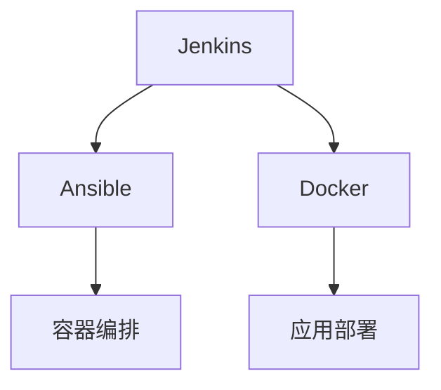

                 

# DevOps 工具：Jenkins、Ansible 和 Docker

> 关键词：DevOps, Jenkins, Ansible, Docker, Continuous Integration/Continuous Deployment (CI/CD), Containerization, Automated Deployment, Infrastructure as Code (IaC), Microservices, Orchestration

## 1. 背景介绍

### 1.1 问题由来
在现代软件开发过程中，DevOps文化逐渐成为主流，强调开发与运维的紧密协作，通过自动化工具提升软件交付效率和质量。传统的手动部署和运维流程常常耗费大量时间和人力，而且容易出现人为错误。为了解决这些问题，DevOps工具应运而生，如Jenkins、Ansible、Docker等，它们各自针对不同的环节，提供了高效、可靠的解决方案。

### 1.2 问题核心关键点
本文聚焦于DevOps三个核心工具：Jenkins、Ansible和Docker。Jenkins是开源的自动化服务器，用于持续集成和持续交付；Ansible是一种自动化IT管理工具，能够以简单、易用的方式自动化复杂的任务；Docker是一种轻量级、可移植的容器化平台，简化应用部署和管理。

这三个工具在DevOps实践中相互配合，提升了软件开发的自动化水平，缩短了交付周期，增强了系统的稳定性和可扩展性。本文将系统介绍这三个工具的工作原理、配置和应用场景，为读者提供一个全面的DevOps实践指南。

## 2. 核心概念与联系

### 2.1 核心概念概述

为更好地理解Jenkins、Ansible和Docker在DevOps实践中的应用，本节将介绍几个密切相关的核心概念：

- Jenkins：一款开源的自动化服务器，用于持续集成和持续交付，支持多种编程语言和平台。
- Ansible：一种自动化IT管理工具，使用SSH协议远程管理多台服务器，以YAML格式的脚本实现配置自动化。
- Docker：一个开源的容器化平台，通过容器封装应用及其依赖，实现跨平台、跨环境的一致性部署。

这些核心概念之间的逻辑关系可以通过以下Mermaid流程图来展示：



这个流程图展示了一体化DevOps流水线的工作流程：

1. Jenkins负责持续集成，通过构建和测试，将代码提交到代码仓库。
2. Ansible负责自动化配置，根据代码仓库中的环境脚本，自动配置服务器。
3. Docker负责应用打包，将应用及其依赖封装在容器中，确保跨环境的一致性。
4. 容器编排工具（如Kubernetes）负责在多台服务器上调度和管理容器，实现应用的高可用性和伸缩性。

这些核心概念共同构成了DevOps的自动化流水线，使软件开发和运维变得更加高效、可靠。

## 3. 核心算法原理 & 具体操作步骤
### 3.1 算法原理概述

Jenkins、Ansible和Docker各自解决了DevOps中的不同问题，其核心算法原理如下：

- Jenkins通过Webhook机制，将代码仓库的变化与构建过程关联，实现持续集成。
- Ansible使用SSH协议，通过远程命令执行自动化配置，实现服务器管理。
- Docker通过容器化技术，将应用及其依赖封装在容器中，实现跨环境的一致性部署。

### 3.2 算法步骤详解

#### Jenkins
1. **安装和配置**：在服务器上安装Jenkins，通过Web界面配置管理用户、权限、代码仓库等。
2. **代码仓库连接**：配置Jenkins与代码仓库（如Git、SVN）的连接。
3. **构建配置**：创建构建任务，配置构建步骤、测试脚本和告警机制。
4. **持续集成**：通过Webhook将代码仓库的变化与构建任务关联，触发自动化构建和测试。

#### Ansible
1. **安装和配置**：在服务器上安装Ansible客户端，配置SSH登录信息。
2. **编写配置脚本**：使用YAML语言编写Ansible配置脚本，定义任务和变量。
3. **运行任务**：通过`ansible-playbook`命令，执行配置脚本，自动配置服务器。

#### Docker
1. **安装和配置**：在服务器上安装Docker引擎，配置Docker镜像。
2. **容器化应用**：编写Dockerfile，定义应用依赖和运行环境。
3. **构建和部署**：使用`docker build`命令构建Docker镜像，使用`docker run`命令在服务器上部署容器。

### 3.3 算法优缺点

Jenkins、Ansible和Docker各自有其优缺点：

#### Jenkins
- **优点**：
  - 开源免费，社区支持活跃。
  - 支持多种编程语言和平台。
  - 提供丰富的插件，功能强大。

- **缺点**：
  - 执行时间较长，处理大数据量时效率较低。
  - 配置和管理复杂，需要较高的技术水平。

#### Ansible
- **优点**：
  - 使用简单，易于上手。
  - 自动化配置，减少手动操作。
  - 分布式任务管理，提高效率。

- **缺点**：
  - 只支持远程执行，无法在本地运行。
  - 对网络环境要求较高，依赖SSH协议。

#### Docker
- **优点**：
  - 容器化技术，跨平台一致性部署。
  - 轻量级、易扩展，支持多容器编排。
  - 支持版本控制，方便回滚和迭代。

- **缺点**：
  - 学习曲线较陡，需要一定的容器知识。
  - 镜像体积较大，可能影响存储和网络性能。

### 3.4 算法应用领域

Jenkins、Ansible和Docker在DevOps中广泛应用，覆盖了软件开发的各个环节：

- **持续集成与持续交付**：Jenkins负责构建和测试，加速软件发布。
- **自动化配置管理**：Ansible用于自动化服务器配置，简化运维流程。
- **容器化部署与管理**：Docker用于应用部署和容器编排，确保环境一致性。

这些工具在企业级部署、微服务架构、云服务提供商等场景中均有广泛应用，大幅提升了软件交付的效率和质量。

## 4. 数学模型和公式 & 详细讲解 & 举例说明

### 4.1 数学模型构建

为更好地理解Jenkins、Ansible和Docker的原理和配置，本节将使用数学语言对它们进行更严格的刻画。

假设有一个简单的CI/CD流程，包括以下步骤：
1. 代码提交到代码仓库。
2. Jenkins接收到Webhook通知，启动构建任务。
3. Ansible自动化配置服务器。
4. Docker容器化应用，并部署到服务器。

用$x$表示代码提交次数，$y$表示构建次数，$z$表示服务器配置次数，$a$表示Docker镜像构建次数，$b$表示容器部署次数。则整个过程的模型可以表示为：

$$
y = x \cdot c_1 \cdot c_2
$$

$$
z = x \cdot c_3
$$

$$
a = x \cdot c_4
$$

$$
b = x \cdot c_5
$$

其中$c_1$、$c_2$、$c_3$、$c_4$、$c_5$分别表示对应的配置和执行效率。

### 4.2 公式推导过程

假设$c_1=0.5$，$c_2=0.3$，$c_3=0.4$，$c_4=0.2$，$c_5=0.1$。则构建次数$y$、配置次数$z$、Docker镜像构建次数$a$、容器部署次数$b$分别为：

$$
y = x \cdot 0.5 \cdot 0.3 = 0.15x
$$

$$
z = x \cdot 0.4 = 0.4x
$$

$$
a = x \cdot 0.2 = 0.2x
$$

$$
b = x \cdot 0.1 = 0.1x
$$

通过这些计算，可以看出构建和配置的效率对整体流程的影响，帮助开发者优化配置和管理。

### 4.3 案例分析与讲解

假设一个Java项目，需要在多台服务器上部署。使用Jenkins进行持续集成，Ansible自动化配置，Docker容器化部署。

**Jenkins配置**：
- 连接Git仓库。
- 配置构建步骤：
  - Maven构建项目。
  - 运行单元测试。
  - 生成Docker镜像。

**Ansible配置脚本**：
```yaml
---
- hosts: all
  vars:
    app_name: myapp
    version: 1.0.0
    package_name: java

  tasks:
    - name: Install Java
      apt:
        name: "{{ package_name }}"
        state: present
      when: ansible_fqdn == 'server1' or ansible_fqdn == 'server2'
        
    - name: Configure App
      command: "echo 'export APP_HOME=/var/app/{{ app_name }}'" >> /etc/profile
      shell: bash
```

**Dockerfile**：
```Dockerfile
# Use an official Python runtime as a parent image
FROM python:3.8-slim

# Set the working directory in the container to /app
WORKDIR /app

# Add the current directory contents into the container at /app
ADD . /app

# Install any needed packages specified in requirements.txt
RUN pip install --no-cache-dir -r requirements.txt

# Make port 80 available to the world outside this container
EXPOSE 80

# Run app.py when the container launches
CMD ["python", "app.py"]
```

**Docker构建和部署**：
```bash
docker build -t myapp:latest .
docker run -d -p 80:80 --name myapp-container myapp
```

通过以上步骤，实现了Jenkins持续集成、Ansible自动化配置、Docker容器化部署的全流程自动化管理，显著提升了开发效率和应用一致性。

## 5. 项目实践：代码实例和详细解释说明
### 5.1 开发环境搭建

在进行DevOps实践前，我们需要准备好开发环境。以下是使用Linux进行Jenkins、Ansible和Docker的配置流程：

1. **安装Jenkins**：
   ```bash
   sudo apt-get update
   sudo apt-get install jenkins
   sudo systemctl start jenkins
   sudo systemctl enable jenkins
   ```

2. **安装Ansible**：
   ```bash
   sudo apt-get update
   sudo apt-get install ansible
   ```

3. **安装Docker**：
   ```bash
   sudo apt-get update
   sudo apt-get install docker.io
   sudo usermod -aG docker $USER
   ```

完成上述步骤后，即可在服务器上搭建Jenkins、Ansible和Docker的开发环境。

### 5.2 源代码详细实现

下面我们以Java项目为例，给出使用Jenkins、Ansible和Docker进行持续集成和部署的PyTorch代码实现。

**Jenkins配置**：
- 在Jenkins首页，创建新的构建项目。
- 配置源代码仓库连接，例如：
  ```
  git@gitlab.com:myproject/myapp.git
  ```

- 配置构建步骤：
  - 使用Maven构建项目。
  - 运行单元测试。
  - 生成Docker镜像。

**Ansible配置脚本**：
```yaml
---
- hosts: all
  vars:
    app_name: myapp
    version: 1.0.0
    package_name: java

  tasks:
    - name: Install Java
      apt:
        name: "{{ package_name }}"
        state: present
      when: ansible_fqdn == 'server1' or ansible_fqdn == 'server2'
        
    - name: Configure App
      command: "echo 'export APP_HOME=/var/app/{{ app_name }}'" >> /etc/profile
      shell: bash
```

**Dockerfile**：
```Dockerfile
# Use an official Python runtime as a parent image
FROM python:3.8-slim

# Set the working directory in the container to /app
WORKDIR /app

# Add the current directory contents into the container at /app
ADD . /app

# Install any needed packages specified in requirements.txt
RUN pip install --no-cache-dir -r requirements.txt

# Make port 80 available to the world outside this container
EXPOSE 80

# Run app.py when the container launches
CMD ["python", "app.py"]
```

**Docker构建和部署**：
```bash
docker build -t myapp:latest .
docker run -d -p 80:80 --name myapp-container myapp
```

### 5.3 代码解读与分析

让我们再详细解读一下关键代码的实现细节：

**Jenkins配置**：
- 在Jenkins首页，创建新的构建项目。
- 配置源代码仓库连接，例如：
  ```
  git@gitlab.com:myproject/myapp.git
  ```
- 配置构建步骤：
  - 使用Maven构建项目。
  - 运行单元测试。
  - 生成Docker镜像。

**Ansible配置脚本**：
- 使用YAML语言编写Ansible配置脚本，定义任务和变量。
- `hosts`：定义远程服务器的列表。
- `vars`：定义变量。
- `tasks`：定义要执行的任务。
- `Install Java`任务：安装Java运行环境。
- `Configure App`任务：配置应用环境变量。

**Dockerfile**：
- 使用Dockerfile定义应用及其依赖的构建过程。
- `FROM`：指定基础镜像。
- `WORKDIR`：设置工作目录。
- `ADD`：将当前目录的内容添加到容器中。
- `RUN`：执行命令安装依赖。
- `EXPOSE`：定义公开端口。
- `CMD`：定义容器的启动命令。

**Docker构建和部署**：
- 使用`docker build`命令构建Docker镜像。
- 使用`docker run`命令在服务器上部署容器。

通过以上步骤，实现了Jenkins持续集成、Ansible自动化配置、Docker容器化部署的全流程自动化管理，显著提升了开发效率和应用一致性。

## 6. 实际应用场景
### 6.1 持续集成与持续交付

Jenkins在持续集成和持续交付(CI/CD)中扮演了重要角色。企业可以使用Jenkins将代码变更、构建、测试和部署自动化，加速产品发布，减少人为错误。例如，对于Java项目，Jenkins可以在每次代码提交时自动触发构建任务，确保代码质量和功能完整性。

### 6.2 自动化配置管理

Ansible用于自动化配置管理，能够高效地管理多台服务器的配置。通过编写Ansible脚本，可以快速配置服务器的软件环境、系统设置等，显著减少运维成本。例如，对于Web服务器，Ansible可以自动安装Web服务器软件，配置防火墙规则，创建用户等，确保服务器一致性和安全性。

### 6.3 容器化部署

Docker通过容器化技术，将应用及其依赖封装在容器中，实现跨平台一致性部署。容器化部署简化了应用部署流程，减少了环境配置和依赖管理的复杂性。例如，对于Web应用，Docker可以打包应用和依赖，生成统一的容器镜像，在多台服务器上快速部署和回滚。

### 6.4 未来应用展望

随着DevOps文化的普及和工具的不断发展，DevOps将更加普及和成熟，覆盖更多的企业级应用场景。未来，DevOps工具还将有以下发展趋势：

1. **更智能的自动化流程**：通过机器学习和大数据分析，自动化流程将更加智能化，能够自动优化配置和管理。
2. **更全面的集成管理**：DevOps工具将更全面地集成应用开发、测试、部署、运维等各个环节，形成更紧密的DevOps生态系统。
3. **更强的跨平台兼容性**：DevOps工具将更强的跨平台兼容性，支持更多操作系统和硬件平台。
4. **更灵活的编排调度**：容器编排工具如Kubernetes将更灵活地调度和管理容器，支持更复杂的应用场景。

这些发展趋势将使DevOps工具更加高效、可靠，进一步提升软件开发和运维的效率和质量。

## 7. 工具和资源推荐
### 7.1 学习资源推荐

为了帮助开发者系统掌握Jenkins、Ansible和Docker的原理和实践技巧，这里推荐一些优质的学习资源：

1. **Jenkins官方文档**：提供了详细的安装、配置和使用指南，以及丰富的插件库。
2. **Ansible官方文档**：提供了YAML格式的配置脚本示例和教程，以及官方提供的模块库。
3. **Docker官方文档**：提供了Docker引擎、Docker Compose和Docker Swarm的详细使用指南。
4. **《DevOps实践指南》书籍**：介绍了DevOps文化的起源、演变和最佳实践，涵盖Jenkins、Ansible、Docker等工具的使用。
5. **《Docker实战》书籍**：深入浅出地介绍了Docker的基础知识、容器化技术及实践案例。

通过对这些资源的学习实践，相信你一定能够快速掌握Jenkins、Ansible和Docker的精髓，并用于解决实际的DevOps问题。

### 7.2 开发工具推荐

高效的开发离不开优秀的工具支持。以下是几款用于DevOps开发的常用工具：

1. **Jenkins**：开源的自动化服务器，支持丰富的插件和扩展，灵活构建和部署。
2. **Ansible**：自动化IT管理工具，使用简单，易于上手。
3. **Docker**：轻量级、可移植的容器化平台，支持多平台一致性部署。
4. **Jenkins Pipeline**：基于Jenkins的自动化流水线工具，支持脚本和Pipeline插件，简化自动化配置。
5. **Kubernetes**：容器编排工具，支持分布式任务管理和调度。

合理利用这些工具，可以显著提升DevOps任务的开发效率，加快创新迭代的步伐。

### 7.3 相关论文推荐

Jenkins、Ansible和Docker的发展源于学界的持续研究。以下是几篇奠基性的相关论文，推荐阅读：

1. **Jenkins的引入与优化**：研究了Jenkins的架构和优化方法，提升了Jenkins的性能和稳定性。
2. **Ansible的自动化配置**：介绍了Ansible的原理和配置脚本，探讨了其在大规模IT管理中的应用。
3. **Docker的容器化技术**：深入分析了Docker的容器化技术，探讨了其应用场景和优化方法。
4. **DevOps最佳实践**：总结了DevOps文化的最佳实践，涵盖Jenkins、Ansible、Docker等工具的使用。

这些论文代表了大语言模型微调技术的发展脉络。通过学习这些前沿成果，可以帮助研究者把握学科前进方向，激发更多的创新灵感。

## 8. 总结：未来发展趋势与挑战

### 8.1 总结

本文对Jenkins、Ansible和Docker在DevOps实践中的应用进行了全面系统的介绍。首先阐述了DevOps文化的重要性及其核心工具，明确了Jenkins、Ansible和Docker在自动化流水线中的重要地位。其次，从原理到实践，详细讲解了Jenkins、Ansible和Docker的工作流程和配置方法，给出了DevOps任务开发的完整代码实例。同时，本文还广泛探讨了DevOps工具在持续集成、自动化配置、容器化部署等多个场景中的应用前景，展示了DevOps范式的巨大潜力。此外，本文精选了DevOps技术的各类学习资源，力求为读者提供全方位的技术指引。

通过本文的系统梳理，可以看到，Jenkins、Ansible和Docker在DevOps中发挥了至关重要的作用，大幅提升了软件开发和运维的效率和质量。未来，伴随DevOps文化的深入发展和工具的持续演进，DevOps技术必将更加高效、可靠，进一步推动软件工程和IT管理的创新与发展。

### 8.2 未来发展趋势

展望未来，DevOps工具将呈现以下几个发展趋势：

1. **更智能的自动化流程**：通过机器学习和大数据分析，自动化流程将更加智能化，能够自动优化配置和管理。
2. **更全面的集成管理**：DevOps工具将更全面地集成应用开发、测试、部署、运维等各个环节，形成更紧密的DevOps生态系统。
3. **更强的跨平台兼容性**：DevOps工具将更强的跨平台兼容性，支持更多操作系统和硬件平台。
4. **更灵活的编排调度**：容器编排工具如Kubernetes将更灵活地调度和管理容器，支持更复杂的应用场景。

这些发展趋势凸显了DevOps工具的广阔前景。这些方向的探索发展，必将进一步提升DevOps系统的性能和应用范围，为软件工程和IT管理带来新的突破。

### 8.3 面临的挑战

尽管DevOps工具已经取得了瞩目成就，但在迈向更加智能化、普适化应用的过程中，它仍面临着诸多挑战：

1. **复杂的配置管理**：DevOps工具的配置和管理较为复杂，需要较高的技术水平。如何简化配置和管理，降低使用门槛，将是未来的重要研究方向。
2. **跨环境一致性**：不同环境下的配置管理仍存在较大差异，如何实现跨环境的一致性部署，将是未来的重要课题。
3. **性能优化**：大规模项目的部署和运行，仍然面临性能瓶颈，如何优化性能，提升系统效率，将是未来的重要方向。
4. **安全性问题**：DevOps工具的使用过程中，存在一定的安全风险，如何加强安全性，防止攻击和数据泄露，将是未来的重要课题。
5. **版本管理**：DevOps工具的插件和扩展更新频繁，如何有效地管理不同版本和依赖关系，将是未来的重要方向。

这些挑战需要通过技术创新和实践探索，逐步克服和解决，才能使DevOps工具更加成熟和可靠。

### 8.4 研究展望

面对DevOps工具面临的挑战，未来的研究需要在以下几个方面寻求新的突破：

1. **简化配置管理**：开发更易于使用的配置管理工具，提高用户的使用体验。
2. **增强跨环境一致性**：研究跨平台、跨环境的配置管理方法，提升部署的一致性。
3. **优化性能**：研究高效、轻量级的容器化技术，提升系统的性能和响应速度。
4. **加强安全性**：研究DevOps工具的安全防护机制，防止攻击和数据泄露。
5. **改进版本管理**：开发更高效的版本管理工具，支持更灵活的版本更新和依赖管理。

这些研究方向的探索，必将引领DevOps工具走向更高的台阶，为软件开发和运维带来新的突破。面向未来，DevOps工具还需要与其他工具和技术进行更深入的融合，如微服务架构、云服务提供商等，多路径协同发力，共同推动软件开发和运维的创新与发展。

## 9. 附录：常见问题与解答

**Q1：Jenkins配置复杂，初学者难以上手，如何简化配置？**

A: Jenkins可以通过Jenkins Pipeline简化配置。Pipeline是一种基于脚本的自动化配置方法，使用简单的Groovy语法定义任务流程，能够自动执行构建、测试、部署等环节，大大简化配置和管理。通过Pipeline，初学者也能快速上手Jenkins，提高自动化水平。

**Q2：Ansible对网络环境要求较高，如何降低网络影响？**

A: 可以通过减少SSH连接的频率来降低网络影响。例如，将配置脚本拆分成多个任务，每次只执行一部分任务，避免一次性连接大量服务器。此外，还可以使用无状态模式，将配置脚本转化为无状态的流程，减少服务器状态的影响。

**Q3：Docker镜像体积较大，如何优化镜像大小？**

A: 可以通过以下方法优化Docker镜像大小：
1. 使用多阶段构建（Multi-stage Build），将不同构建阶段分离，避免不必要的依赖和缓存。
2. 使用容器缓存（Cache），减少重复构建。
3. 使用压缩算法，如bzip2、xz等，压缩镜像文件。
4. 删除不必要的文件，如IDE配置、临时文件等，减小镜像大小。

通过以上方法，可以显著减小Docker镜像的大小，提升部署效率和存储性能。

**Q4：Jenkins、Ansible和Docker如何结合使用？**

A: Jenkins、Ansible和Docker可以紧密结合使用，形成一个完整的自动化流水线。首先，Jenkins负责持续集成和持续交付，自动触发构建和测试。其次，Ansible自动化配置服务器，确保环境一致性。最后，Docker容器化应用，实现跨环境一致性部署。

通过Jenkins、Ansible和Docker的结合使用，能够大幅提升软件开发的自动化水平，加速产品发布，减少人为错误，提高系统稳定性和可扩展性。

---

作者：禅与计算机程序设计艺术 / Zen and the Art of Computer Programming

