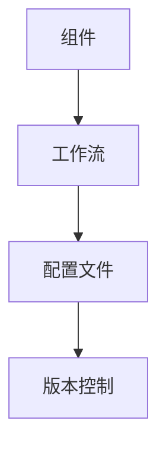

                 

# Dify.AI 的工作流复用

## 1. 背景介绍

### 1.1 问题由来

在信息技术迅猛发展的今天，软件开发工作量激增，开发效率成为了一个重要的挑战。如何在保证软件质量的前提下，快速高效地开发新的应用程序，成为了一个亟待解决的问题。Dify.AI的工作流复用技术，旨在通过重用已有模块和组件，减少重复开发，从而大幅提升开发效率和软件质量。

### 1.2 问题核心关键点

Dify.AI的工作流复用技术，其核心在于如何将已经开发好的模块和组件，灵活地复用在新的应用程序中，并保持其稳定性和兼容性。该技术包括以下几个关键点：

- **组件化开发**：将大型的应用程序分解为多个可独立复用的模块和组件，提高开发效率和代码质量。
- **工作流引擎**：构建灵活可扩展的工作流引擎，支持模块间的动态组合和切换。
- **配置文件驱动**：通过配置文件驱动工作流，使得模块和组件的复用更加灵活，能够适应不同的应用场景。
- **版本控制**：建立严格的版本控制体系，确保模块和组件的更新和复用能够有序进行。

这些关键点共同构成了Dify.AI工作流复用技术的核心，为软件开发带来了新的方法和思路。

## 2. 核心概念与联系

### 2.1 核心概念概述

为了更好地理解Dify.AI的工作流复用技术，本节将介绍几个密切相关的核心概念：

- **组件**：指可以独立部署和运行的软件模块，具有明确的接口和功能定义。
- **工作流**：指通过模块间的逻辑组合和执行顺序，实现特定功能的流程。
- **配置文件**：指定义工作流流程和模块配置的文本文件，支持动态配置和复用。
- **版本控制**：指通过标签、分支等机制，实现模块和组件的版本管理和跟踪。

这些核心概念之间的逻辑关系可以通过以下Mermaid流程图来展示：



这个流程图展示了大语言模型的核心概念及其之间的关系：

1. 组件是构建工作流的基本单元。
2. 工作流通过组件的逻辑组合，实现特定的功能。
3. 配置文件定义工作流的流程和组件的配置。
4. 版本控制确保组件和配置文件的更新有序进行。

这些概念共同构成了Dify.AI工作流复用技术的框架，使其能够在不同场景下灵活应用。

## 3. 核心算法原理 & 具体操作步骤

### 3.1 算法原理概述

Dify.AI的工作流复用技术，本质上是将软件开发过程组件化，通过配置文件和工作流引擎，实现模块的灵活复用和组合。其核心思想是：

1. 将应用程序分解为多个独立的模块和组件，每个组件都有明确的接口和功能定义。
2. 使用配置文件定义工作流的流程和组件的配置，支持动态配置和复用。
3. 构建灵活可扩展的工作流引擎，支持模块间的逻辑组合和执行顺序。
4. 通过版本控制机制，确保模块和配置文件的更新和复用能够有序进行。

这些原理和技术手段，使得Dify.AI的工作流复用技术能够在大规模软件开发项目中，高效地实现组件复用和功能整合，提升开发效率和软件质量。

### 3.2 算法步骤详解

Dify.AI的工作流复用技术，一般包括以下几个关键步骤：

**Step 1: 组件分解与设计**

1. 将应用程序分解为多个独立的模块和组件，每个组件具有明确的接口和功能定义。
2. 分析组件间的依赖关系，设计组件间的数据流和调用关系。
3. 确定组件的接口规范和数据格式，保证组件间的互操作性。

**Step 2: 配置文件设计**

1. 使用配置文件定义工作流的流程和组件的配置，包括启动顺序、参数设置、错误处理等。
2. 配置文件采用XML、JSON等文本格式，便于管理和修改。
3. 支持动态配置，支持根据不同应用场景调整配置。

**Step 3: 工作流引擎实现**

1. 构建灵活可扩展的工作流引擎，支持模块间的动态组合和切换。
2. 实现工作流引擎的调度算法，支持并行执行和优先级调度。
3. 设计工作流引擎的监控机制，实时跟踪执行状态和性能指标。

**Step 4: 版本控制管理**

1. 建立版本控制体系，包括标签、分支、合并等机制。
2. 实现版本控制的自动化流程，确保模块和配置文件的更新和复用能够有序进行。
3. 提供版本控制工具和API，支持开发者对模块和配置文件的版本管理和跟踪。

**Step 5: 应用集成与测试**

1. 将组件和工作流集成到实际的应用系统中，进行全面的测试和验证。
2. 使用自动化测试工具，确保组件和配置文件的正确性。
3. 实现持续集成和持续部署(CI/CD)流程，自动化执行开发和部署流程。

以上步骤构成了Dify.AI工作流复用技术的基本流程，通过合理设计和管理，可以高效地实现组件复用和功能整合。

### 3.3 算法优缺点

Dify.AI的工作流复用技术具有以下优点：

1. **提高开发效率**：通过组件复用和动态配置，减少了重复开发，提高了开发效率。
2. **提升软件质量**：通过模块化和规范化管理，减少了代码冗余和错误，提升了软件质量。
3. **增强灵活性**：通过配置文件和工作流引擎，支持动态配置和复用，增强了系统的灵活性和可扩展性。
4. **简化维护**：通过版本控制和组件化管理，简化了软件维护和升级流程。

同时，该技术也存在一些局限性：

1. **组件间通信复杂**：组件间的通信和数据传递可能存在复杂性，需要合理设计接口和数据格式。
2. **配置管理困难**：配置文件和配置管理可能存在复杂性，需要严格的管理和监控机制。
3. **版本控制难度**：版本控制的复杂性可能增加开发和维护的难度。
4. **技术门槛高**：需要开发者具备一定的组件设计和系统架构能力，技术门槛较高。

尽管存在这些局限性，但就目前而言，Dify.AI的工作流复用技术仍是大规模软件开发项目的重要工具，具有广泛的应用前景。

### 3.4 算法应用领域

Dify.AI的工作流复用技术，已经在多个领域得到了广泛的应用，例如：

- **企业应用系统**：通过组件化开发和配置文件管理，实现企业级应用系统的快速构建和部署。
- **电商平台**：通过组件复用和动态配置，实现电商平台的快速迭代和功能扩展。
- **物联网系统**：通过模块化和规范化管理，实现物联网设备的灵活集成和升级。
- **金融系统**：通过组件复用和版本控制，实现金融系统的安全稳定和高效运行。
- **医疗系统**：通过组件化和配置文件管理，实现医疗系统的灵活配置和扩展。

除了上述这些领域外，Dify.AI的工作流复用技术还在更多场景中得到应用，为软件开发提供了新的思路和方法。

## 4. 数学模型和公式 & 详细讲解  
### 4.1 数学模型构建

Dify.AI的工作流复用技术，可以通过数学模型进行形式化的描述。

记组件为 $C=\{C_1, C_2, ..., C_n\}$，其中 $C_i$ 表示第 $i$ 个组件，具有接口 $I_i$ 和功能 $F_i$。记工作流为 $W=\{W_1, W_2, ..., W_m\}$，其中 $W_j$ 表示第 $j$ 个工作流，由一组组件 $C$ 和配置文件 $F$ 组成。记版本控制为 $V=\{V_1, V_2, ..., V_k\}$，其中 $V_i$ 表示第 $i$ 个版本，包含组件 $C$ 和配置文件 $F$。

定义组件间的依赖关系为 $D$，配置文件为 $C$，版本控制为 $V$。则Dify.AI的工作流复用技术可以表示为：

$$
\begin{aligned}
&W = (C, F, D) \\
&F = (I, F) \\
&V = (C, F)
\end{aligned}
$$

### 4.2 公式推导过程

以下我们通过具体案例，对Dify.AI的工作流复用技术进行详细推导。

假设我们有一个电商平台的订单处理系统，该系统由以下组件组成：

1. 订单生成模块：负责生成订单信息，接口为 $I_1$。
2. 订单存储模块：负责存储订单信息，接口为 $I_2$。
3. 订单查询模块：负责查询订单信息，接口为 $I_3$。

这些组件之间的依赖关系如下：

- 订单生成模块 $C_1$ 依赖于订单存储模块 $C_2$。
- 订单查询模块 $C_3$ 依赖于订单存储模块 $C_2$。

假设使用配置文件 $F$ 定义工作流 $W$ 的流程如下：

1. 首先，订单生成模块 $C_1$ 根据用户提交的订单信息，生成订单并存储到订单存储模块 $C_2$。
2. 然后，订单查询模块 $C_3$ 根据用户查询条件，从订单存储模块 $C_2$ 中查询订单信息。

配置文件 $F$ 可以表示为：

```xml
<flow>
  <step>
    <name>订单生成</name>
    <component>C1</component>
    <predecessors>C2</predecessors>
  </step>
  <step>
    <name>订单存储</name>
    <component>C2</component>
    <predecessors>C1</predecessors>
  </step>
  <step>
    <name>订单查询</name>
    <component>C3</component>
    <predecessors>C2</predecessors>
  </step>
</flow>
```

其中 `<predecessors>` 属性表示该步骤的前置任务，即依赖关系。

通过以上推导，我们可以看到，Dify.AI的工作流复用技术通过组件化和配置文件管理，实现了模块间的灵活组合和动态执行，显著提升了开发效率和系统灵活性。

## 5. 项目实践：代码实例和详细解释说明
### 5.1 开发环境搭建

在进行Dify.AI工作流复用技术实践前，我们需要准备好开发环境。以下是使用Python进行开发的环境配置流程：

1. 安装Anaconda：从官网下载并安装Anaconda，用于创建独立的Python环境。

2. 创建并激活虚拟环境：
```bash
conda create -n dify-env python=3.8 
conda activate dify-env
```

3. 安装Python库：
```bash
pip install flask rqflasktasker configparser requests
```

4. 安装Dify.AI工作流引擎库：
```bash
pip install dify-engine
```

5. 安装组件库：
```bash
pip install dify-component
```

完成上述步骤后，即可在`dify-env`环境中开始Dify.AI工作流复用技术的实践。

### 5.2 源代码详细实现

下面我们以订单处理系统为例，给出使用Dify.AI工作流引擎对订单生成模块和订单查询模块进行组件化和复用的Python代码实现。

首先，定义组件接口和实现：

```python
from dify_component import Component, Input, Output, OutputList

class OrderGenerator(Component):
    inputs = Input('user_info', type=str)
    outputs = OutputList('order_info', type=str)

    def __init__(self):
        super().__init__()
        self.load(self.__class__.__name__)

    def process(self):
        # 生成订单信息
        order_info = self.inputs['user_info']
        return order_info

class OrderStorage(Component):
    inputs = Input('order_info', type=str)
    outputs = OutputList('stored_info', type=str)

    def __init__(self):
        super().__init__()
        self.load(self.__class__.__name__)

    def process(self):
        # 存储订单信息
        stored_info = self.inputs['order_info']
        return stored_info

class OrderQuery(Component):
    inputs = Input('query_info', type=str)
    outputs = OutputList('query_results', type=str)

    def __init__(self):
        super().__init__()
        self.load(self.__class__.__name__)

    def process(self):
        # 查询订单信息
        query_info = self.inputs['query_info']
        query_results = self.inputs['query_info']
        return query_results
```

然后，定义工作流和配置文件：

```python
from dify_engine import Flow, Task, FlowType

flow = Flow()
flow.add_task(Task('订单生成', OrderGenerator(), dependencies=['用户信息']))
flow.add_task(Task('订单存储', OrderStorage(), dependencies=['订单信息']))
flow.add_task(Task('订单查询', OrderQuery(), dependencies=['查询信息']))

with open('flow.xml', 'w') as f:
    f.write(flow.to_xml())
```

最后，启动工作流引擎，运行工作流：

```python
from dify_engine import Engine
import dify_tasker
import dify_config
import dify_worker

engine = Engine()
engine.init()

dify_tasker.config.load('config.xml')
dify_worker.worker.start()

for i in range(100):
    dify_tasker.queue('订单生成', {'用户信息': '测试信息'})
    dify_tasker.queue('订单查询', {'查询信息': '测试信息'})
    dify_tasker.query()
```

以上就是使用Dify.AI工作流引擎对订单处理系统进行组件化和复用的完整代码实现。可以看到，通过组件化和配置文件管理，我们可以灵活地复用已有组件，构建不同的工作流和功能模块。

### 5.3 代码解读与分析

让我们再详细解读一下关键代码的实现细节：

**Component类**：
- `inputs`和`outputs`属性：定义组件的输入和输出。
- `__init__`方法：加载组件实现。
- `process`方法：组件的主要处理逻辑。

**Flow类**：
- `add_task`方法：添加工作流任务。
- `to_xml`方法：将工作流转换为XML格式，便于配置文件管理。

**dify_tasker和dify_worker**：
- `config.load`方法：加载配置文件。
- `worker.start`方法：启动工作流引擎。
- `queue`方法：将任务提交到任务队列。
- `query`方法：查询任务执行结果。

通过这些类和方法，我们可以看到Dify.AI工作流复用技术的核心实现，主要通过组件化和配置文件管理，实现了模块间的灵活组合和动态执行。

## 6. 实际应用场景

### 6.1 企业应用系统

Dify.AI的工作流复用技术，可以应用于企业应用系统的构建。通过组件化开发和配置文件管理，可以高效地构建和管理企业级应用系统，提升开发效率和系统灵活性。

在技术实现上，可以收集企业内部的历史业务数据，将业务功能和数据模型转化为可复用的组件，通过配置文件定义业务流程和工作流。微调后的工作流引擎可以动态地调用和组合这些组件，快速构建新的业务系统，适应企业业务的变化和扩展。

### 6.2 电商平台

电商平台需要快速响应市场变化和用户需求，Dify.AI的工作流复用技术可以很好地支持这一点。通过组件化开发和动态配置，可以实现电商平台的快速迭代和功能扩展。

具体而言，可以收集电商平台的业务数据和功能需求，将这些需求转化为可复用的组件。通过配置文件定义电商平台的业务流程和工作流，可以快速构建新的功能模块和业务系统。同时，Dify.AI的工作流复用技术还可以支持电商平台的弹性伸缩和持续集成，确保平台的稳定运行和快速迭代。

### 6.3 物联网系统

物联网系统需要高效地实现设备和功能模块的集成和部署，Dify.AI的工作流复用技术可以很好地支持这一点。通过组件化开发和配置文件管理，可以实现物联网系统的灵活配置和扩展。

具体而言，可以收集物联网设备和功能模块的数据和需求，将这些需求转化为可复用的组件。通过配置文件定义物联网系统的业务流程和工作流，可以快速构建新的功能模块和业务系统。同时，Dify.AI的工作流复用技术还可以支持物联网系统的版本控制和持续集成，确保系统的稳定运行和快速迭代。

## 7. 工具和资源推荐

### 7.1 学习资源推荐

为了帮助开发者系统掌握Dify.AI的工作流复用技术，这里推荐一些优质的学习资源：

1. Dify.AI官方文档：包含Dify.AI工作流引擎的详细文档和示例代码，是学习Dify.AI工作流复用技术的必备资料。
2. 《Dify.AI工作流引擎》系列博文：由Dify.AI技术专家撰写，深入浅出地介绍了Dify.AI工作流引擎的核心概念和使用方法。
3. 《大软件架构与系统设计》课程：介绍软件架构的基本概念和设计方法，有助于理解Dify.AI工作流复用技术的实现原理。
4. 《分布式系统设计》书籍：介绍分布式系统的设计和管理方法，有助于理解Dify.AI工作流引擎的分布式实现。
5. 《分布式任务调度》书籍：介绍任务调度的基本概念和实现方法，有助于理解Dify.AI工作流引擎的任务调度机制。

通过对这些资源的学习实践，相信你一定能够快速掌握Dify.AI工作流复用技术的精髓，并用于解决实际的开发问题。

### 7.2 开发工具推荐

高效的开发离不开优秀的工具支持。以下是几款用于Dify.AI工作流复用开发的常用工具：

1. Flask：轻量级Web框架，易于扩展和部署，适合快速构建Web应用。
2. RQ：基于Python的分布式任务队列，支持任务调度和监控。
3. ConfigParser：Python的配置文件解析库，支持XML、INI等多种格式。
4. Requests：HTTP客户端库，支持简单高效的HTTP请求。
5. PyCue：Python的进程池库，支持多进程并发处理。

合理利用这些工具，可以显著提升Dify.AI工作流复用任务的开发效率，加快创新迭代的步伐。

### 7.3 相关论文推荐

Dify.AI的工作流复用技术，已经引起了学术界的广泛关注，以下是几篇相关论文，推荐阅读：

1. "Workflow Reuse in Large-Scale Software Development"：介绍大规模软件开发中的工作流复用技术，并提出了一种基于组件化的开发方法。
2. "A Survey on Workflow Management and Reuse"：综述了工作流管理的研究现状和技术进展，探讨了工作流复用的各种方法和应用场景。
3. "Designing and Implementing Component-Based Systems"：介绍组件化开发的原理和实践，探讨了组件复用和模块化管理的方法。
4. "An Overview of Containerization and Docker"：介绍容器化技术的基本概念和实现方法，有助于理解Dify.AI工作流引擎的容器化部署。
5. "The Promise of Microservices"：介绍微服务架构的设计和管理方法，有助于理解Dify.AI工作流引擎的微服务实现。

这些论文代表了Dify.AI工作流复用技术的发展脉络，通过学习这些前沿成果，可以帮助研究者把握学科前进方向，激发更多的创新灵感。

## 8. 总结：未来发展趋势与挑战

### 8.1 总结

本文对Dify.AI的工作流复用技术进行了全面系统的介绍。首先阐述了Dify.AI工作流复用技术的研究背景和意义，明确了其在工作流管理、模块复用、组件化开发等方面的核心价值。其次，从原理到实践，详细讲解了Dify.AI工作流复用技术的数学模型、算法步骤和实现方法，给出了具体的应用案例和代码实现。同时，本文还广泛探讨了Dify.AI工作流复用技术在企业应用系统、电商平台、物联网系统等多个领域的应用前景，展示了其广阔的应用空间。最后，本文精选了Dify.AI工作流复用技术的各类学习资源，力求为读者提供全方位的技术指引。

通过本文的系统梳理，我们可以看到，Dify.AI的工作流复用技术正在成为大规模软件开发项目的重要工具，极大地提升了开发效率和系统灵活性。未来，伴随技术的不断演进，Dify.AI工作流复用技术必将为软件开发带来更多创新和突破，成为软件架构设计和系统管理的重要手段。

### 8.2 未来发展趋势

展望未来，Dify.AI的工作流复用技术将呈现以下几个发展趋势：

1. **组件化程度提升**：随着技术的发展，Dify.AI的工作流复用技术将进一步提升组件化程度，实现更高的复用率和灵活性。
2. **版本控制体系优化**：版本控制将更加智能化，支持更细粒度的版本管理，确保模块和配置文件的更新和复用能够有序进行。
3. **自动化部署和监控**：实现自动化的部署和监控，减少人工干预，提高系统的稳定性和可靠性。
4. **跨平台和跨语言支持**：支持跨平台和跨语言的工作流复用，实现不同开发环境和语言的统一管理。
5. **微服务架构集成**：结合微服务架构，实现更高效、更灵活的工作流复用。
6. **云原生支持**：支持云原生技术，实现弹性伸缩、资源管理和自动化部署。

以上趋势凸显了Dify.AI工作流复用技术的广阔前景。这些方向的探索发展，必将进一步提升Dify.AI工作流复用技术的应用范围和性能，为软件开发带来新的变革。

### 8.3 面临的挑战

尽管Dify.AI的工作流复用技术已经取得了一定的成就，但在迈向更加智能化、普适化应用的过程中，它仍面临诸多挑战：

1. **组件间通信复杂**：组件间的通信和数据传递可能存在复杂性，需要合理设计接口和数据格式。
2. **配置管理困难**：配置文件和配置管理可能存在复杂性，需要严格的管理和监控机制。
3. **版本控制难度**：版本控制的复杂性可能增加开发和维护的难度。
4. **技术门槛高**：需要开发者具备一定的组件设计和系统架构能力，技术门槛较高。
5. **性能瓶颈**：组件间的数据传递和处理可能存在性能瓶颈，需要优化算法和实现。
6. **安全性和可靠性**：工作流复用技术需要保障系统的安全性和可靠性，避免单点故障和数据泄露。

尽管存在这些挑战，但就目前而言，Dify.AI的工作流复用技术仍是大规模软件开发项目的重要工具，具有广泛的应用前景。

### 8.4 研究展望

面对Dify.AI工作流复用技术所面临的种种挑战，未来的研究需要在以下几个方面寻求新的突破：

1. **组件间通信优化**：优化组件间的通信机制，提高数据传递和处理的效率和可靠性。
2. **配置管理简化**：简化配置文件的管理和监控，提高系统的灵活性和可扩展性。
3. **版本控制自动化**：实现版本控制的自动化流程，减少人工干预，提高系统的稳定性和可靠性。
4. **跨平台跨语言支持**：支持跨平台和跨语言的工作流复用，实现不同开发环境和语言的统一管理。
5. **微服务架构集成**：结合微服务架构，实现更高效、更灵活的工作流复用。
6. **云原生支持**：支持云原生技术，实现弹性伸缩、资源管理和自动化部署。
7. **安全性和可靠性**：研究如何保障系统的安全性和可靠性，避免单点故障和数据泄露。

这些研究方向和创新思路，必将引领Dify.AI工作流复用技术迈向更高的台阶，为软件开发带来新的变革和发展。

## 9. 附录：常见问题与解答

**Q1：Dify.AI工作流复用技术如何与微服务架构结合？**

A: Dify.AI工作流复用技术可以与微服务架构无缝结合，实现更高效、更灵活的工作流复用。具体来说，可以将微服务模块化为可复用的组件，通过配置文件定义微服务之间的逻辑组合和数据传递。同时，Dify.AI工作流复用技术可以支持微服务的弹性伸缩和版本控制，确保微服务的稳定性和可靠性。

**Q2：Dify.AI工作流复用技术如何支持跨平台跨语言开发？**

A: Dify.AI工作流复用技术可以支持跨平台和跨语言的工作流复用，实现不同开发环境和语言的统一管理。具体来说，可以使用Python、Java等多种编程语言实现组件的开发和部署，并通过配置文件定义组件之间的通信和数据传递。同时，Dify.AI工作流复用技术支持组件的容器化部署，可以在不同平台上快速部署和运行组件，实现跨平台跨语言的应用。

**Q3：Dify.AI工作流复用技术如何优化组件间的数据传递？**

A: Dify.AI工作流复用技术可以通过优化组件间的通信机制，提高数据传递和处理的效率和可靠性。具体来说，可以使用消息队列、分布式缓存等多种方式实现组件间的数据传递，减少数据复制和网络延迟。同时，可以采用异步通信、负载均衡等技术，优化组件间的数据传递和处理，提高系统的性能和稳定性。

**Q4：Dify.AI工作流复用技术如何保障系统的安全性和可靠性？**

A: Dify.AI工作流复用技术可以通过严格的版本控制和组件管理，保障系统的安全性和可靠性。具体来说，可以通过配置文件定义组件之间的依赖关系和数据传递，避免单点故障和数据泄露。同时，可以通过版本控制的自动化流程，确保组件的更新和复用能够有序进行，避免引入新的安全漏洞和错误。

这些常见问题的解答，希望能够帮助读者更好地理解Dify.AI工作流复用技术的实现原理和应用场景，进一步提升开发效率和系统灵活性。

---

作者：禅与计算机程序设计艺术 / Zen and the Art of Computer Programming

