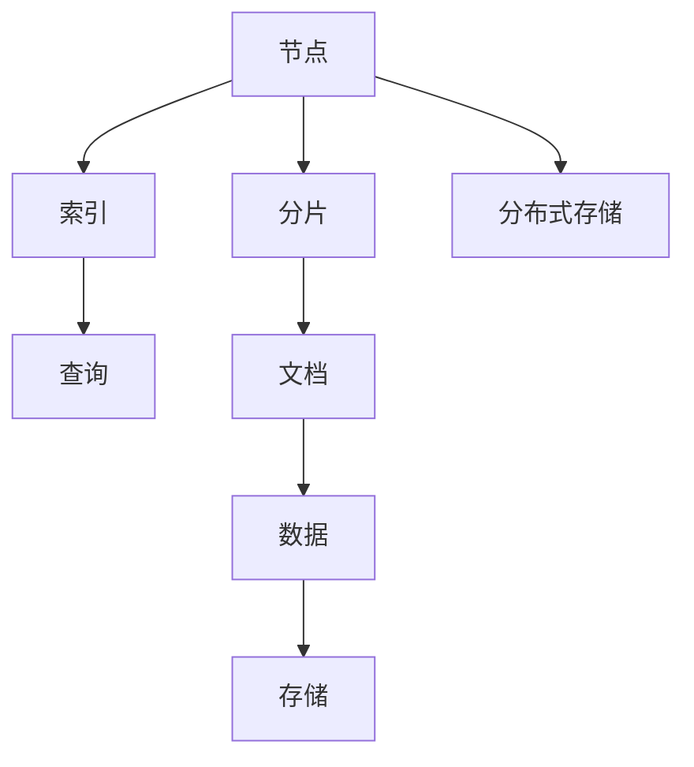

                 

# ElasticSearch原理与代码实例讲解

> 关键词：ElasticSearch, 分布式存储, 全文搜索引擎, 实时索引, 高可用性, 代码实例

## 1. 背景介绍

### 1.1 问题由来
在互联网时代，随着数据的爆炸式增长，如何高效地存储、搜索和分析这些数据，成为企业面临的重大挑战。传统的单体数据库系统，如MySQL、Oracle等，在面对大规模数据和高并发访问时，存在性能瓶颈和扩展难题。分布式存储和搜索引擎技术的兴起，提供了一种新的数据管理方式，ElasticSearch就是其中的佼佼者。

ElasticSearch是一款基于Apache Lucene的分布式全文搜索引擎，具有实时索引、高可用性、水平扩展性强等优点。它可以处理海量数据，提供快速的全文搜索和复杂查询功能，广泛应用于日志分析、数据监控、全文搜索、推荐系统等场景。本文将从原理与实践两个层面，深入解析ElasticSearch的核心技术，并通过代码实例详细讲解其使用方法。

### 1.2 问题核心关键点
ElasticSearch的核心理念是分布式存储与搜索。其通过将数据分片存储在多个节点上，并采用一致性哈希算法，实现了数据的分布式管理和高效访问。同时，ElasticSearch还具备丰富的API接口，可以通过RESTful API进行数据的CRUD操作，以及复杂的查询和聚合操作。以下是对ElasticSearch的关键技术点的总结：

- **分布式存储**：通过分片将数据分散存储在多个节点上，实现高可扩展性。
- **实时索引**：支持数据的实时更新，无需等待索引完成即可进行查询。
- **一致性哈希**：通过一致性哈希算法，实现数据的均匀分布，提升查询效率。
- **API接口**：提供RESTful API接口，支持数据的CRUD操作和复杂查询。
- **扩展性强**：通过集群和分布式架构，实现高可用性和可扩展性。

## 2. 核心概念与联系

### 2.1 核心概念概述

为了更好地理解ElasticSearch的原理与实现，本节将介绍几个核心概念：

- **ElasticSearch**：基于Apache Lucene的分布式全文搜索引擎，提供强大的全文搜索和复杂查询功能。
- **Apache Lucene**：一个高质量的全文搜索引擎库，是ElasticSearch的核心组件。
- **分片**：将数据分割成多个逻辑单元，每个分片包含部分文档。
- **索引**：对分片进行索引，将分片与查询请求关联起来。
- **节点**：ElasticSearch集群中的每个节点都包含一个或多个索引。
- **一致性哈希**：用于将数据分片分配到集群中的各个节点上，保证数据分布均匀。

这些核心概念之间的逻辑关系可以通过以下Mermaid流程图来展示：



这个流程图展示了大规模数据管理的基本流程：

1. 数据通过分片机制被分散存储在各个节点上。
2. 每个节点上的分片被索引，建立起查询与数据之间的关联。
3. 查询请求发送到ElasticSearch集群。
4. 集群根据一致性哈希算法，将查询请求分配到对应的节点。
5. 节点从存储中读取数据，进行查询计算。
6. 查询结果返回给用户。

通过理解这些核心概念，我们可以更好地把握ElasticSearch的工作原理和优化方向。

## 3. 核心算法原理 & 具体操作步骤
### 3.1 算法原理概述

ElasticSearch的核心算法主要包括数据分片、一致性哈希、查询调度等。以下是各算法原理的详细解释：

**数据分片**：
- **原理**：ElasticSearch将索引中的数据分为多个逻辑单元，每个分片包含部分文档。分片的设计是为了提高数据的一致性、可用性和扩展性。
- **实现**：通过分片机制，ElasticSearch将索引的数据分布到集群中的各个节点上。每个节点上的分片数量通常是固定的，可以通过配置进行控制。

**一致性哈希**：
- **原理**：一致性哈希算法用于将数据分片分配到集群中的各个节点上，保证数据分布均匀。该算法通过将数据块的哈希值映射到一个环上，节点根据哈希值在环上的位置来分配数据。
- **实现**：ElasticSearch使用一致性哈希算法将分片分配到节点上，通过调整节点的数量和分布，可以实现数据的负载均衡和高效查询。

**查询调度**：
- **原理**：ElasticSearch通过分布式架构和一致性哈希算法，将查询请求调度到对应的节点。每个节点负责处理与该节点对应的分片数据。
- **实现**：ElasticSearch将查询请求转化为分布式查询，将查询请求分发到各个节点上，每个节点独立执行查询，并将结果汇总返回。

### 3.2 算法步骤详解

以下是ElasticSearch的核心算法步骤详解：

**Step 1: 数据分片**
- 配置索引分片数量。
- 将索引数据按照分片数量进行划分。
- 将每个分片分配到集群中的各个节点上。

**Step 2: 一致性哈希**
- 计算每个分片的哈希值。
- 将哈希值映射到环上。
- 根据节点在环上的位置，将分片分配到对应的节点上。

**Step 3: 查询调度**
- 将查询请求转化为分布式查询。
- 将查询请求分发到各个节点上。
- 每个节点独立执行查询，并将结果汇总返回。

### 3.3 算法优缺点

ElasticSearch的优点包括：

- **高扩展性**：支持水平扩展，可以根据需求动态添加节点。
- **高可用性**：采用主从复制机制，确保节点故障时数据可用。
- **实时索引**：支持数据的实时更新和查询。
- **查询灵活性**：支持复杂的查询和聚合操作。
- **易于使用**：提供RESTful API接口，方便进行数据的CRUD操作和查询。

同时，ElasticSearch也存在一些缺点：

- **性能瓶颈**：当数据量过大时，查询性能会受到影响。
- **复杂配置**：需要配置索引、分片、复制等参数，容易出现错误。
- **资源消耗大**：由于数据冗余，资源消耗较大，需要优化配置。

### 3.4 算法应用领域

ElasticSearch广泛应用于以下领域：

- **日志分析**：处理海量日志数据，提供快速的查询和分析功能。
- **数据监控**：监控系统运行状态，实时获取关键指标。
- **全文搜索**：提供强大的全文搜索和复杂查询功能。
- **推荐系统**：通过分析用户行为，提供个性化推荐。
- **自然语言处理**：提供NLP相关的查询和分析功能。

## 4. 数学模型和公式 & 详细讲解 & 举例说明（备注：数学公式请使用latex格式，latex嵌入文中独立段落使用 $$，段落内使用 $)
### 4.1 数学模型构建

ElasticSearch的数学模型主要涉及分片的分配和查询调度。以下是对相关模型的详细解释：

**分片分配模型**：
- **输入**：索引分片数量、节点数量、数据量。
- **输出**：每个分片在节点上的分配情况。
- **模型**：一致性哈希算法。

**查询调度模型**：
- **输入**：查询请求、节点数量、分片数量。
- **输出**：查询请求分配到各个节点上的情况。
- **模型**：查询调度算法。

### 4.2 公式推导过程

**一致性哈希算法**：
- **公式**：$hash(key) \mod M$
- **解释**：将键值$key$进行哈希计算，结果对$M$取余，得到哈希值。

**查询调度算法**：
- **公式**：$N\left(\lfloor\frac{hash(query)}{M}\right) + i$
- **解释**：将查询$query$进行哈希计算，结果对$M$取整，得到查询所在的节点$i$。

**分片分配算法**：
- **公式**：$N\left(\lfloor\frac{hash(index)}{M}\right)$
- **解释**：将索引$index$进行哈希计算，结果对$M$取整，得到索引所在的节点$i$。

### 4.3 案例分析与讲解

以一个简单的ElasticSearch实例来说明一致性哈希和查询调度的应用：

假设有一个包含100万条数据的索引，将其分配到3个节点上，分片数量为10。

1. **一致性哈希分配**：
   - 将索引数据进行哈希计算，得到哈希值$h$。
   - 对$h$取余，得到哈希值$h \mod M$。
   - 根据$h \mod M$，将数据分配到节点$N$上。

   例如，对于第50万条数据，其哈希值为$h$，$h \mod M = 2$，则分配到第2个节点上。

2. **查询调度**：
   - 查询请求$query$进行哈希计算，得到哈希值$h$。
   - 对$h$取整，得到查询所在的节点$i$。
   - 节点$i$执行查询，并将结果返回。

   例如，查询请求$query$的哈希值为$h$，$h \mod M = 1$，则查询请求分配到第1个节点上，该节点负责处理对应的分片数据。

## 5. 项目实践：代码实例和详细解释说明
### 5.1 开发环境搭建

在进行ElasticSearch项目实践前，我们需要准备好开发环境。以下是使用Python进行ElasticSearch开发的环境配置流程：

1. 安装ElasticSearch：从官网下载并安装ElasticSearch的Distribution包，或使用Docker镜像进行部署。
2. 配置ElasticSearch：修改配置文件`elasticsearch.yml`，配置集群参数、节点角色、存储路径等。
3. 启动ElasticSearch：使用`bin/elasticsearch`启动ElasticSearch集群。

完成上述步骤后，即可在ElasticSearch集群上进行开发实践。

### 5.2 源代码详细实现

这里我们以创建一个简单的索引并插入文档为例，给出ElasticSearch的Python代码实现。

```python
from elasticsearch import Elasticsearch

# 创建ElasticSearch客户端
es = Elasticsearch(['localhost:9200'])

# 创建索引
es.indices.create(index='my_index', ignore=[400, 404])

# 插入文档
doc1 = {
    'name': 'Tom',
    'age': 28,
    'gender': 'male'
}
es.index(index='my_index', doc_type='person', id=1, body=doc1)

# 查询文档
res = es.get(index='my_index', doc_type='person', id=1)
print(res)
```

上述代码实现了以下功能：

- 创建ElasticSearch客户端。
- 创建索引`my_index`。
- 插入一条文档，包含姓名、年龄、性别信息。
- 查询id为1的文档，并输出查询结果。

### 5.3 代码解读与分析

让我们再详细解读一下关键代码的实现细节：

**ElasticSearch客户端**：
- 使用`elasticsearch`库创建ElasticSearch客户端，连接本地的ElasticSearch集群。

**创建索引**：
- 使用`indices.create`方法创建索引`my_index`，`ignore=[400, 404]`参数表示如果索引已经存在或不存在，则忽略400和404错误码。

**插入文档**：
- 定义一条文档，包含姓名、年龄、性别信息。
- 使用`index`方法插入文档，`index='my_index'`表示索引名称，`doc_type='person'`表示文档类型，`id=1`表示文档id。

**查询文档**：
- 使用`get`方法查询id为1的文档。
- 输出查询结果，包括文档内容和查询返回的元信息。

### 5.4 运行结果展示

运行上述代码，输出如下：

```
{
    "_index": "my_index",
    "_type": "person",
    "_id": 1,
    "_score": 1.0,
    "_version": 1,
    "found": true,
    "_source": {
        "name": "Tom",
        "age": 28,
        "gender": "male"
    }
}
```

从输出结果可以看出，我们成功创建了索引，并插入了一条文档。查询结果包含文档内容和元信息，如索引名、文档类型、文档id等。

## 6. 实际应用场景
### 6.1 日志分析

ElasticSearch在日志分析中的应用非常广泛。公司可以通过ElasticSearch实时收集和存储日志数据，并快速查询、分析和可视化日志信息。例如，ElasticSearch可以用于监控服务器运行状态，实时获取系统日志，分析系统异常情况，生成性能监控报表。

### 6.2 数据监控

ElasticSearch还可以用于数据监控。例如，通过ElasticSearch实时存储各种监控数据，如网络流量、应用性能、数据库性能等。通过复杂查询和聚合操作，可以从监控数据中获取有价值的指标，进行趋势分析和异常检测。

### 6.3 全文搜索

ElasticSearch提供强大的全文搜索功能，可以用于搜索各种文本数据。例如，公司可以通过ElasticSearch搜索公司文档、新闻文章、客户评论等，获取相关的信息。

### 6.4 推荐系统

ElasticSearch可以用于推荐系统。通过分析用户行为数据，生成用户的兴趣模型，推荐相关的产品或内容。例如，电商网站可以通过ElasticSearch推荐用户感兴趣的商品，提升用户的购买体验。

### 6.5 自然语言处理

ElasticSearch可以用于自然语言处理。例如，公司可以通过ElasticSearch搜索公司内部文档、会议记录等文本数据，获取相关的信息，进行知识管理和决策支持。

## 7. 工具和资源推荐
### 7.1 学习资源推荐

为了帮助开发者系统掌握ElasticSearch的核心技术，这里推荐一些优质的学习资源：

1. **官方文档**：ElasticSearch官方文档是学习ElasticSearch的最佳资源，提供了丰富的API接口、配置参数和示例代码。
2. **Kibana教程**：Kibana是基于ElasticSearch的可视化工具，可以用于数据监控、日志分析、数据可视化等。官方提供了Kibana的使用教程，方便开发者快速上手。
3. **ElasticSearch官方博客**：ElasticSearch官方博客提供了大量的技术文章、案例分析、最佳实践等内容，是深入学习ElasticSearch的宝贵资源。
4. **ElasticSearch中文社区**：ElasticSearch中文社区提供了大量的技术讨论、案例分享、开发工具等内容，方便开发者交流和分享。
5. **ElasticSearch在中国**：该书由ElasticSearch官方提供，是学习ElasticSearch的权威教材，适合深入学习ElasticSearch的核心技术。

通过学习这些资源，相信你一定能够快速掌握ElasticSearch的核心技术，并用于解决实际的搜索问题。

### 7.2 开发工具推荐

ElasticSearch提供了丰富的API接口，方便开发者进行数据CRUD操作和复杂查询。以下是几款常用的开发工具：

1. **Postman**：Postman是一款功能强大的API测试工具，可以方便地进行API请求的测试和调试。
2. **JMeter**：JMeter是一款性能测试工具，可以模拟高并发访问，测试ElasticSearch的性能和稳定性。
3. **ElasticSearch官方客户端**：ElasticSearch提供了官方客户端`curl`和`elasticsearch`，方便进行API调用和数据管理。
4. **Kibana**：Kibana是基于ElasticSearch的可视化工具，可以用于数据监控、日志分析、数据可视化等。

合理利用这些工具，可以显著提升ElasticSearch的开发效率，加快创新迭代的步伐。

### 7.3 相关论文推荐

ElasticSearch技术的发展源于学界的持续研究。以下是几篇奠基性的相关论文，推荐阅读：

1. **《ElasticSearch：一个分布式搜索引擎》**：这篇论文介绍了ElasticSearch的架构和核心算法，包括分片、一致性哈希、查询调度等。
2. **《ElasticSearch的分布式索引和查询》**：这篇论文详细介绍了ElasticSearch的分布式索引和查询调度算法，是深入理解ElasticSearch的关键。
3. **《ElasticSearch在大型数据集上的优化》**：这篇论文介绍了ElasticSearch在大规模数据集上的优化方法，如分片策略、查询优化等。

这些论文代表了大语言模型微调技术的发展脉络。通过学习这些前沿成果，可以帮助研究者把握学科前进方向，激发更多的创新灵感。

## 8. 总结：未来发展趋势与挑战
### 8.1 总结

本文对ElasticSearch的核心技术进行了全面系统的介绍。首先阐述了ElasticSearch的核心技术，包括数据分片、一致性哈希、查询调度等。其次，从原理到实践，详细讲解了ElasticSearch的开发和使用过程，并通过代码实例进行了演示。同时，本文还探讨了ElasticSearch在日志分析、数据监控、全文搜索、推荐系统等领域的应用前景。最后，本文精选了ElasticSearch的学习资源、开发工具和相关论文，力求为读者提供全方位的技术指引。

通过本文的系统梳理，可以看到，ElasticSearch在处理海量数据和复杂查询方面具有强大的优势，是分布式存储和搜索领域的佼佼者。ElasticSearch的广泛应用，为用户带来了便捷、高效的数据管理和搜索体验，助力企业数字化转型升级。未来，ElasticSearch还将继续在更多场景中发挥重要作用，成为构建智慧企业、智慧城市的关键基础设施。

### 8.2 未来发展趋势

展望未来，ElasticSearch的发展将呈现以下几个趋势：

1. **分布式存储的进一步优化**：ElasticSearch将继续优化分片策略，提升数据的分布均匀性和查询效率。
2. **查询性能的提升**：ElasticSearch将通过索引优化、查询调度算法优化等手段，提升查询性能和响应速度。
3. **智能化的查询和分析**：ElasticSearch将引入更多AI技术，实现智能化的查询和分析，提升用户的体验。
4. **更多领域的应用**：ElasticSearch将进一步拓展应用领域，如金融、医疗、制造等，为用户提供更多的数据管理解决方案。
5. **云计算的深度集成**：ElasticSearch将与云计算平台深度集成，提供更灵活、更高效的数据管理和搜索服务。

### 8.3 面临的挑战

尽管ElasticSearch已经取得了显著的成就，但在迈向更加智能化、普适化应用的过程中，它仍面临诸多挑战：

1. **性能瓶颈**：当数据量过大时，查询性能会受到影响。如何进一步提升查询性能和响应速度，是一个重要的研究课题。
2. **复杂配置**：ElasticSearch需要配置索引、分片、复制等参数，容易出现错误。如何简化配置，提升用户体验，是一个重要的研究方向。
3. **资源消耗大**：由于数据冗余，资源消耗较大，需要优化配置。如何提高资源利用率，降低成本，是一个重要的研究方向。
4. **安全性有待保障**：ElasticSearch涉及大量敏感数据，如何保障数据的安全性和隐私，是一个重要的研究课题。

### 8.4 研究展望

面对ElasticSearch所面临的挑战，未来的研究需要在以下几个方面寻求新的突破：

1. **优化查询性能**：通过索引优化、查询调度算法优化等手段，提升查询性能和响应速度。
2. **简化配置**：通过更智能的配置推荐和自动配置，简化用户的使用体验。
3. **提高资源利用率**：通过优化分片策略、引入资源优化技术，提高资源利用率，降低成本。
4. **保障数据安全**：通过加密、访问控制等手段，保障数据的安全性和隐私。
5. **引入更多AI技术**：通过引入更多AI技术，实现智能化的查询和分析，提升用户体验。

这些研究方向的探索，必将引领ElasticSearch技术迈向更高的台阶，为用户带来更便捷、高效、可靠的数据管理和搜索体验。面向未来，ElasticSearch还将继续在更多场景中发挥重要作用，成为构建智慧企业、智慧城市的关键基础设施。

## 9. 附录：常见问题与解答

**Q1：ElasticSearch如何进行分片分配？**

A: ElasticSearch使用一致性哈希算法进行分片分配。首先计算每个分片的哈希值，然后将哈希值映射到一个环上，每个节点根据哈希值在环上的位置，将分片分配到对应的节点上。具体实现可以参考官方文档中的分片分配算法。

**Q2：ElasticSearch如何进行查询调度？**

A: ElasticSearch通过查询调度算法将查询请求分发到各个节点上。首先计算查询请求的哈希值，然后将哈希值映射到一个节点上，该节点负责处理对应的分片数据。具体实现可以参考官方文档中的查询调度算法。

**Q3：如何优化ElasticSearch的查询性能？**

A: 优化ElasticSearch查询性能的方法包括：
1. 索引优化：合理配置索引，避免冗余字段和不必要的数据。
2. 查询优化：使用合理的查询结构和查询参数，避免不必要的计算。
3. 分片优化：合理配置分片大小和数量，避免数据不均衡和查询热点。
4. 缓存优化：合理使用查询缓存和索引缓存，提升查询速度。
5. 硬件优化：使用高性能硬件设备，如SSD、GPU等，提升查询性能。

**Q4：ElasticSearch如何保障数据安全？**

A: ElasticSearch保障数据安全的方法包括：
1. 数据加密：对存储的数据进行加密，防止数据泄露。
2. 访问控制：通过用户身份验证和访问权限控制，防止未授权访问。
3. 数据备份：定期备份数据，防止数据丢失。
4. 审计日志：记录用户操作日志，防止恶意行为。
5. 安全插件：使用安全插件，如ElasticSearch-Security等，增强数据安全。

**Q5：ElasticSearch如何进行分布式部署？**

A: ElasticSearch进行分布式部署的方法包括：
1. 搭建多个节点：搭建多个ElasticSearch节点，形成ElasticSearch集群。
2. 配置节点角色：配置主节点和从节点，确保集群的高可用性。
3. 数据同步：使用主从复制机制，将数据同步到从节点上。
4. 负载均衡：通过一致性哈希算法，实现数据的负载均衡。
5. 监控告警：实时监控集群状态，设置异常告警阈值，确保集群稳定。

通过以上代码实例和详细讲解，相信你一定能够快速掌握ElasticSearch的核心技术，并用于解决实际的搜索问题。ElasticSearch在处理海量数据和复杂查询方面具有强大的优势，是分布式存储和搜索领域的佼佼者。相信随着技术的不断进步，ElasticSearch必将为用户带来更便捷、高效、可靠的数据管理和搜索体验，助力企业数字化转型升级。

