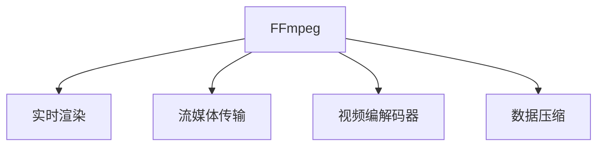

                 

# FFmpeg 在 VR 中的应用：编码和流媒体的结合

> 关键词：VR, 编码, 流媒体, 实时渲染, 高性能视频, 视频编码器, 数据压缩

## 1. 背景介绍

### 1.1 问题由来
随着虚拟现实(VR)技术的发展，越来越多的用户对高质量的沉浸式体验提出了更高要求。VR 视频和音频的实时渲染需要高效的视频编码器和流媒体处理工具的支持，而当前主流的流媒体平台和视频编码器无法满足这些高要求。FFmpeg，作为一个开源、跨平台的视频处理工具，以其灵活的编码能力和强大的流媒体处理功能，在 VR 领域获得了广泛的应用。

### 1.2 问题核心关键点
FFmpeg 在 VR 中的应用主要涉及以下几个关键点：
- 实时编码与解码：确保 VR 视频和音频数据的实时处理和渲染。
- 高效数据压缩：通过先进的编码算法，实现高压缩比和低延迟的视频传输。
- 跨平台支持：在多个操作系统和硬件平台上高效运行。
- 易于定制：提供丰富的编码器和流媒体协议，支持自定义格式。

### 1.3 问题研究意义
FFmpeg 在 VR 中的应用不仅能够提升用户的沉浸式体验，还能降低数据传输和存储的成本。通过合理配置编码参数，可以实现低延迟、高质量的视频流，大幅提升 VR 系统的整体性能。同时，FFmpeg 作为开源工具，可以持续演进和优化，不断适应 VR 技术的进步和应用场景的变化。

## 2. 核心概念与联系

### 2.1 核心概念概述

为了更好地理解 FFmpeg 在 VR 中的应用，本节将介绍几个关键概念：

- **FFmpeg**：一个功能强大的开源视频处理工具，支持多种视频编解码器、流媒体协议和实时处理功能。
- **实时渲染**：VR 系统通过实时渲染技术，将虚拟场景转化为视频和音频数据，呈现给用户。
- **流媒体传输**：通过网络传输实时数据，支持多用户、多设备共享的 VR 体验。
- **视频编解码器**：将视频数据压缩和解压缩的算法。
- **数据压缩**：通过减少数据量，提升数据传输效率。

这些概念之间的逻辑关系可以通过以下 Mermaid 流程图来展示：



这个流程图展示了 FFmpeg 在 VR 中的核心应用场景，包括实时渲染、流媒体传输和视频编解码等。

## 3. 核心算法原理 & 具体操作步骤
### 3.1 算法原理概述

FFmpeg 在 VR 中的应用基于其强大的视频编解码器和流媒体处理能力，主要涉及以下几个关键算法：

- **视频编解码算法**：FFmpeg 支持多种主流的视频编解码器，如 H.264、H.265、AV1 等。这些编解码器通过压缩算法，将视频数据转换为适合传输的格式。
- **流媒体传输协议**：FFmpeg 支持多种流媒体协议，如 RTP、RTSP、RTMP 等。这些协议提供了稳定的数据传输机制，支持实时流和缓冲控制。
- **视频格式转换**：FFmpeg 可以将不同格式的视频数据进行高效转换，支持多种视频编码和解码需求。
- **音频编解码**：FFmpeg 支持多种音频编解码器，如 AAC、MP3、FLAC 等，实现高质量音频数据的实时处理和传输。

### 3.2 算法步骤详解

以下详细介绍基于 FFmpeg 的 VR 视频编码和流媒体处理的基本步骤：

**Step 1: 选择合适的编解码器**
- 根据 VR 系统的硬件配置和需求，选择合适的编解码器。如使用 H.264 或 H.265 编码器，获得高压缩比和低延迟的视频流。

**Step 2: 配置编解码参数**
- 使用 FFmpeg 的命令行工具或脚本，配置编解码参数，如帧率、分辨率、码率等。优化参数，实现最佳的编解码效果。

**Step 3: 实时视频采集和渲染**
- 通过摄像头、传感器等设备，实时采集 VR 场景数据。
- 使用 FFmpeg 的实时渲染功能，将采集到的数据转换为视频和音频数据，进行实时处理。

**Step 4: 流媒体传输**
- 使用 FFmpeg 的流媒体协议，将实时处理的视频和音频数据传输到用户设备。
- 设置缓冲控制和网络参数，确保数据传输的稳定性和实时性。

**Step 5: 播放与渲染**
- 在用户设备上，使用 FFmpeg 或相关流媒体软件播放传输的视频和音频数据。
- 使用 GPU 等硬件加速技术，实现高质量的实时渲染。

### 3.3 算法优缺点

FFmpeg 在 VR 中的应用具有以下优点：

- **灵活性高**：支持多种编解码器和流媒体协议，可以根据具体需求进行配置。
- **高效压缩**：通过先进的视频编码算法，实现高压缩比和低延迟的视频传输。
- **跨平台支持**：在多个操作系统和硬件平台上运行，支持多设备应用。
- **开源免费**：作为开源软件，提供丰富的社区支持和自定义功能。

同时，也存在一些缺点：

- **配置复杂**：需要掌握多种编解码器和流媒体协议的配置，有一定学习成本。
- **性能依赖硬件**：对硬件性能的要求较高，需要配置高性能的 GPU 和 CPU。
- **代码复杂**：作为功能强大的工具，FFmpeg 的代码和配置复杂度较高，需要一定的时间和经验积累。

### 3.4 算法应用领域

FFmpeg 在 VR 中的应用领域非常广泛，涵盖了从视频采集和渲染到流媒体传输的各个环节。以下是几个典型的应用场景：

- **虚拟会议室**：通过实时视频和音频采集、编解码和流媒体传输，实现多用户、多设备共享的 VR 会议体验。
- **虚拟旅游**：将实时采集的旅游场景数据进行编解码和渲染，通过网络传输到用户设备，实现虚拟旅游体验。
- **虚拟培训**：将虚拟现实场景和教材进行同步编解码和流媒体传输，实现远程教育和培训。
- **虚拟演出**：通过实时采集演出场景数据，进行编解码和渲染，实现高质量的虚拟演出体验。

## 4. 数学模型和公式 & 详细讲解  
### 4.1 数学模型构建

在基于 FFmpeg 的 VR 视频编解码和流媒体处理中，涉及到以下几个数学模型：

- **视频编解码模型**：将视频数据压缩和解压缩的模型。
- **流媒体传输模型**：描述数据在网络中的传输过程和控制机制。
- **实时渲染模型**：描述虚拟场景数据的实时采集、处理和渲染过程。

### 4.2 公式推导过程

以下是一些核心公式的推导过程：

- **H.264 编码器公式**：
  $$
  \text{Rate} = \frac{C}{P}
  $$
  其中，$C$ 为码率，$P$ 为帧率，$\text{Rate}$ 为视频传输速率。

- **RTP 协议公式**：
  $$
  \text{Packet Size} = \frac{\text{Frame Size}}{\text{Frame Rate}}
  $$
  其中，$\text{Packet Size}$ 为数据包大小，$\text{Frame Size}$ 为视频帧大小，$\text{Frame Rate}$ 为帧率。

### 4.3 案例分析与讲解

以一个典型的 VR 会议应用为例，分析 FFmpeg 的应用过程：

1. **视频采集**：使用摄像头采集视频数据，输入到 FFmpeg。
2. **编解码**：使用 H.264 编解码器对视频数据进行压缩和解压缩。
3. **流媒体传输**：使用 RTMP 协议，将编解码后的视频数据传输到用户设备。
4. **实时渲染**：在用户设备上，使用 GPU 进行实时渲染，输出高质量的视频和音频数据。

## 5. 项目实践：代码实例和详细解释说明
### 5.1 开发环境搭建

在使用 FFmpeg 进行 VR 应用开发前，需要准备以下开发环境：

1. **安装 FFmpeg**：
   - 从官方网站下载最新的 FFmpeg 版本，解压后进行安装。
   - 添加 FFmpeg 的 bin 目录到系统 PATH 变量中。

2. **配置编译环境**：
   - 根据需要配置编译环境，如使用 brew 或 apt-get 安装依赖库。
   - 配置 Makefile，设置编译选项和参数。

### 5.2 源代码详细实现

以下是一个使用 FFmpeg 进行视频编解码和流媒体传输的代码示例：

```bash
# 配置参数
ffmpeg -i input.avi -c:v libx264 -crf 28 -c:a aac -b:a 128k -r 30 -f rtmp -rtmp_url rtmp://localhost/vode channel1 output.rtmp
```

**代码解释**：
- `-i input.avi`：输入视频文件。
- `-c:v libx264`：使用 H.264 编码器。
- `-crf 28`：设置编码参数，实现低延迟、高质量的视频流。
- `-c:a aac`：使用 AAC 编解码器，实现高质量音频数据。
- `-b:a 128k`：设置音频码率，控制数据传输速率。
- `-r 30`：设置帧率，控制视频实时性。
- `-f rtmp`：使用 RTMP 协议，进行实时流传输。
- `-rtmp_url rtmp://localhost/vode channel1`：设置流媒体传输地址。

### 5.3 代码解读与分析

**配置参数解析**：
- `libx264`：使用 H.264 编解码器。
- `-crf 28`：CRF（Calibrated Rate Factor）是 H.264 编解码器中的关键参数，用于控制视频质量。CRF 值越小，视频质量越高，但码率也越高。
- `aac`：使用 AAC 编解码器，支持高质量音频数据。
- `-b:a 128k`：设置音频码率，控制数据传输速率。
- `-r 30`：设置帧率，控制视频实时性。

**流媒体传输解析**：
- `-f rtmp`：使用 RTMP 协议，进行实时流传输。
- `-rtmp_url rtmp://localhost/vode channel1`：设置流媒体传输地址，通道为 channel1。

### 5.4 运行结果展示

运行上述代码后，将在指定的 RTMP 地址输出高质量的视频和音频流。通过实时渲染技术，用户可以在 VR 设备上观看高质量的会议视频和音频。

## 6. 实际应用场景
### 6.1 虚拟会议室

FFmpeg 在虚拟会议室中的应用，通过实时视频和音频采集、编解码和流媒体传输，实现多用户、多设备共享的 VR 会议体验。例如，通过摄像头采集会议室的图像和声音，使用 H.264 编解码器进行压缩和解压缩，将视频和音频数据通过 RTMP 协议传输到 VR 设备，实现高质量的会议录制和直播。

### 6.2 虚拟旅游

在虚拟旅游应用中，FFmpeg 可以将实时采集的旅游场景数据进行编解码和渲染，通过网络传输到用户设备，实现虚拟旅游体验。例如，使用摄像头采集旅游景点的图像和声音，使用 H.265 编解码器进行压缩和解压缩，将视频和音频数据通过 RTMP 协议传输到 VR 设备，用户可以在虚拟环境中自由探索和体验。

### 6.3 虚拟培训

FFmpeg 在虚拟培训中的应用，通过实时采集培训场景数据，进行编解码和流媒体传输，实现远程教育和培训。例如，使用摄像头和传感器采集培训场景的图像和声音，使用 H.264 编解码器进行压缩和解压缩，将视频和音频数据通过 RTMP 协议传输到学员的 VR 设备，实现高质量的远程培训体验。

### 6.4 未来应用展望

未来，随着 VR 技术的进一步发展，FFmpeg 在 VR 中的应用也将不断扩展。以下是一些可能的应用场景：

- **虚拟展览**：将博物馆、艺术馆的展品数据进行编解码和渲染，通过网络传输到用户设备，实现虚拟展览体验。
- **虚拟体育**：将体育比赛的场景数据进行编解码和流媒体传输，实现虚拟体育赛事体验。
- **虚拟教育**：将虚拟现实和教材同步编解码和流媒体传输，实现远程教育和培训。
- **虚拟医疗**：将医疗场景数据进行编解码和流媒体传输，实现虚拟医疗培训和诊疗体验。

## 7. 工具和资源推荐
### 7.1 学习资源推荐

为了帮助开发者系统掌握 FFmpeg 在 VR 中的应用，这里推荐一些优质的学习资源：

1. **FFmpeg 官方文档**：详细介绍了 FFmpeg 的编解码器和流媒体协议，是学习 FFmpeg 的最佳资源。
2. **《FFmpeg 视频编解码实战》书籍**：涵盖了 FFmpeg 的高级应用，适合深入学习。
3. **FFmpeg 官方博客**：分享了 FFmpeg 的最新功能和性能优化技巧。
4. **YouTube 视频教程**：提供了大量的视频教程，适合初学者入门。

### 7.2 开发工具推荐

FFmpeg 开发主要依赖命令行工具和脚本，以下是一些常用的开发工具：

1. **Linux**：支持多种系统平台，是开发 FFmpeg 的主要环境。
2. **macOS**：支持 macOS 用户开发和调试 FFmpeg。
3. **Windows**：支持 Windows 用户开发和调试 FFmpeg。

### 7.3 相关论文推荐

以下是一些与 FFmpeg 在 VR 应用相关的学术论文，推荐阅读：

1. "Real-time Video Streaming in VR Applications"：介绍了基于 FFmpeg 的实时视频流传输技术。
2. "Efficient Video Coding in VR Systems"：分析了在 VR 系统中高效视频编码的方法。
3. "Multimedia Streaming in Virtual Reality"：介绍了基于 FFmpeg 的流媒体传输技术。

## 8. 总结：未来发展趋势与挑战
### 8.1 总结

本文对基于 FFmpeg 的 VR 应用进行了详细分析。首先介绍了 FFmpeg 在 VR 中的应用背景和核心关键点，然后从算法原理和具体操作步骤等方面，详细讲解了 FFmpeg 在视频编解码和流媒体处理中的关键步骤。最后，讨论了 FFmpeg 在 VR 领域的应用场景和未来发展趋势。

通过本文的系统梳理，可以看到，FFmpeg 在 VR 中的应用不仅能够提升用户的沉浸式体验，还能降低数据传输和存储的成本。未来，随着 VR 技术的进一步发展，FFmpeg 在 VR 中的应用也将不断扩展，为 VR 行业带来新的变革。

### 8.2 未来发展趋势

未来，FFmpeg 在 VR 中的应用将呈现以下几个发展趋势：

1. **实时渲染技术提升**：随着 GPU 性能的提升，实时渲染技术将不断优化，提升 VR 体验的流畅性和质量。
2. **低延迟流媒体传输**：通过优化网络传输协议和编解码算法，实现更低的延迟和更高的实时性。
3. **多设备兼容**：支持更多设备平台和硬件加速，实现多设备无缝兼容。
4. **自定义格式支持**：提供更多自定义格式的编解码支持，满足不同应用场景的需求。

### 8.3 面临的挑战

尽管 FFmpeg 在 VR 中的应用已经取得一定进展，但仍然面临一些挑战：

1. **配置复杂性**：需要掌握多种编解码器和流媒体协议的配置，有一定学习成本。
2. **性能瓶颈**：对硬件性能的要求较高，需要配置高性能的 GPU 和 CPU。
3. **代码复杂性**：作为功能强大的工具，FFmpeg 的代码和配置复杂度较高，需要一定的时间和经验积累。

### 8.4 研究展望

未来的研究需要在以下几个方面寻求新的突破：

1. **自动化配置**：开发自动化配置工具，简化配置过程，降低学习成本。
2. **智能编码**：引入智能编码技术，根据不同设备和网络环境，自动调整编解码参数。
3. **硬件优化**：优化硬件加速，提升编解码和渲染性能。
4. **多模态数据融合**：将视频、音频和传感器数据融合，实现更全面、更真实的多模态 VR 体验。

总之，FFmpeg 在 VR 中的应用前景广阔，但也需要不断创新和优化，才能满足不断变化的需求和技术挑战。

## 9. 附录：常见问题与解答

**Q1：如何选择合适的编解码器？**

A: 根据 VR 系统的硬件配置和需求，选择合适的编解码器。例如，使用 H.264 或 H.265 编码器，获得高压缩比和低延迟的视频流。

**Q2：配置编解码参数时需要注意哪些问题？**

A: 需要根据具体需求进行参数优化。例如，设置适当的码率和帧率，平衡视频质量和传输效率。

**Q3：如何实现低延迟流媒体传输？**

A: 优化网络传输协议和编解码算法，使用 RTMP 协议进行实时流传输。

**Q4：FFmpeg 在 VR 中的应用有哪些？**

A: 广泛应用于虚拟会议室、虚拟旅游、虚拟培训等场景，提供高质量的视频和音频体验。

**Q5：FFmpeg 在 VR 中的应用前景如何？**

A: 随着 VR 技术的进一步发展，FFmpeg 在 VR 中的应用前景广阔，将带来更多创新应用场景。

---

作者：禅与计算机程序设计艺术 / Zen and the Art of Computer Programming

