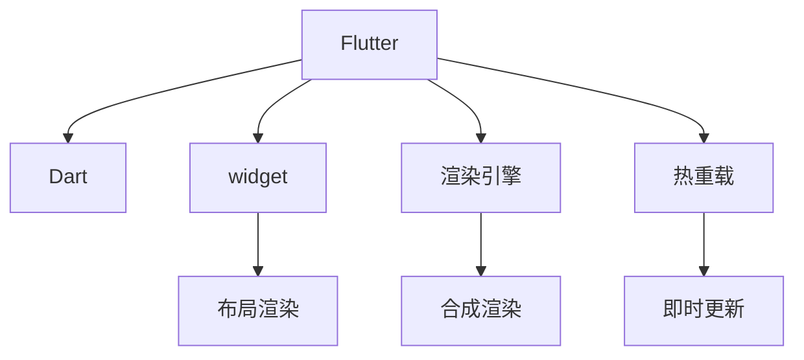

                 

# Flutter：Google的UI工具包for移动开发

在当今移动应用开发领域，框架的选择直接影响着应用的性能、维护成本和开发效率。Google推出的Flutter，作为一款由Dart语言驱动的移动UI开发框架，自2015年推出以来，凭借其高性能、跨平台、丰富的组件库和活跃的社区支持，成为了移动开发者的一个热门选择。本文将全面介绍Flutter的核心概念、关键算法、操作步骤、应用场景、未来趋势及常见问题解答，旨在帮助开发者深入理解Flutter，并提升其移动应用开发水平。

## 1. 背景介绍

### 1.1 问题由来
随着移动设备的普及，移动应用开发需求快速增长。传统的跨平台开发框架如React Native和Ionic等，尽管支持iOS和Android平台的开发，但由于性能和用户体验不佳，难以满足高标准的需求。Google推出了Flutter，旨在打造一款高性能、跨平台的UI框架，提供一致的用户体验和开发效率。Flutter基于Dart语言，相比于Java/Kotlin和Swift等主流移动开发语言，Dart语法更接近JavaScript，学习成本较低，而且性能优于JavaScript引擎，适合构建高性能的移动应用。

### 1.2 问题核心关键点
Flutter的核心优势在于其声明式编程和高性能渲染引擎。声明式编程使得开发者更加关注UI的最终呈现效果，而不是具体的实现细节；高性能渲染引擎则是通过实现widget层级的合成和重绘优化，确保在跨平台下也能达到接近原生应用的性能表现。

### 1.3 问题研究意义
Flutter的引入为移动应用开发提供了全新的范式，大大简化了跨平台应用的开发复杂度，提升了应用性能和用户体验。它不仅适用于新应用开发，还为现有应用的维护和升级提供了便利。了解Flutter的理论基础和实践方法，对于提升开发效率和应用质量，具有重要意义。

## 2. 核心概念与联系

### 2.1 核心概念概述

为了更好地理解Flutter的核心工作原理和架构，本节将介绍几个关键概念：

- **Flutter**：由Google推出的移动UI开发框架，基于Dart语言，支持iOS和Android平台的开发。
- **Dart**：Flutter的开发语言，具有高性能和易于学习的特点，语法类似于JavaScript。
- **widget**：Flutter的基本UI组件，用于构建界面布局和用户交互。
- **渲染引擎**：Flutter的渲染引擎，负责将widget转换为目标平台的UI组件，并优化渲染性能。
- **热重载(Hot Reload)**：Flutter的调试工具，在代码修改后无需重新编译即可实时更新UI。

这些概念之间的逻辑关系可以通过以下Mermaid流程图来展示：



这个流程图展示出Flutter的核心组件及其相互关系：

1. Flutter框架基于Dart语言，用于声明式UI开发。
2. widget是Flutter的基本UI组件，通过布局渲染形成最终界面。
3. 渲染引擎负责将widget转换为目标平台的UI组件，并进行优化渲染。
4. 热重载工具在代码修改后即时更新UI，提升开发效率。

## 3. 核心算法原理 & 具体操作步骤
### 3.1 算法原理概述

Flutter的核心算法原理主要集中在以下几个方面：

1. **声明式UI编程**：Flutter采用声明式编程模型，开发者通过定义widget层次结构来描述UI布局和交互逻辑，而不是直接操作平台UI组件。这使得代码更加易于理解和维护。

2. **渲染引擎**：Flutter的渲染引擎基于widget层级的合成和重绘机制，通过计算所有widget的变换关系，优化出最小的重绘范围，从而提高渲染效率。

3. **热重载**：热重载技术通过Dart的热重载功能，使得代码修改后无需重新编译即可实时更新UI，极大提升了开发效率。

4. **响应式编程**：Flutter的widget支持响应式编程，能够自动处理布局变化、事件驱动和动画效果，使得UI动态更新更加流畅。

5. **跨平台支持**：Flutter通过一套共同的widget系统，实现了iOS和Android平台之间的跨平台开发，共享代码库，减少了开发成本。

### 3.2 算法步骤详解

Flutter的开发流程主要包括以下几个步骤：

**Step 1: 环境配置**
- 安装Dart SDK和Flutter SDK
- 配置编辑器如Android Studio或Visual Studio Code
- 配置Android和iOS开发环境

**Step 2: 创建项目**
- 使用Flutter CLI创建新项目
- 定义app的main函数和widget树结构

**Step 3: 开发UI组件**
- 设计并实现widget层次结构
- 处理布局、事件、动画等

**Step 4: 测试和调试**
- 运行热重载调试工具
- 在模拟器和真机上测试应用性能和体验

**Step 5: 发布和部署**
- 打包iOS和Android APK
- 部署到App Store和Google Play

### 3.3 算法优缺点

Flutter的优点包括：

- **高性能**：通过声明式UI和优化渲染引擎，Flutter能够提供接近原生应用的性能表现。
- **跨平台**：共享代码库，减少开发成本，提升开发效率。
- **易于学习和使用**：Dart语法类似于JavaScript，学习曲线较低。
- **热重载**：实时更新UI，提升开发效率。

其缺点主要有：

- **社区相对较小**：相比于React Native和Swift，Flutter的社区活跃度较低，资源和工具相对较少。
- **性能依赖Dart编译器**：Dart编译器优化程度不如原生编译器，可能会影响某些性能敏感的应用。

### 3.4 算法应用领域

Flutter适用于各种类型的移动应用开发，包括但不限于：

- 社交网络应用：如微信、微博等
- 电商应用：如淘宝、京东等
- 游戏应用：如王者荣耀、和平精英等
- 教育应用：如有道词典、 Khan Academy等
- 金融应用：如支付宝、微信支付等

此外，Flutter还被广泛应用于企业内部应用、工具类应用、跨平台应用等多个领域，展示出强大的生命力和广泛的应用前景。

## 4. 数学模型和公式 & 详细讲解 & 举例说明
### 4.1 数学模型构建

Flutter的渲染引擎基于widget层级的合成和重绘机制，通过计算所有widget的变换关系，优化出最小的重绘范围，从而提高渲染效率。假设 widget 的树结构为 $W = (W_1, W_2, \ldots, W_n)$，其中 $W_i$ 表示第 $i$ 个widget，$R_i$ 表示 $W_i$ 的渲染区域。则渲染引擎的优化目标为：

$$
\min_{R} \sum_{i=1}^n \text{area}(R_i)
$$

其中，$\text{area}(R)$ 表示渲染区域 $R$ 的面积，$n$ 表示widget的总数。

### 4.2 公式推导过程

根据widget的层级关系，渲染引擎可以通过递归计算每个widget的渲染区域 $R_i$。假设 $W_i$ 的渲染区域为 $R_i$，$W_j$ 是 $W_i$ 的子widget，则 $W_i$ 的渲染区域为 $R_i \cup R_j$。因此，渲染引擎的优化过程可以表示为：

$$
R_i = R_i \cup \bigcup_{j \in \mathcal{C}_i} R_j
$$

其中 $\mathcal{C}_i$ 表示 $W_i$ 的子widget集合。通过计算每个widget的渲染区域，并求并集，最终得到整个应用的最小渲染区域。

### 4.3 案例分析与讲解

以一个简单的列表为例，说明Flutter渲染引擎如何优化渲染。假设列表包含3个item，每个item的大小为50x50像素。在未优化前，渲染引擎需要渲染整个列表区域，即150x150像素。而在优化后，渲染引擎只渲染需要更新的区域，即3个item的并集区域，即150x50像素。这使得渲染效率提高了3倍。

## 5. 项目实践：代码实例和详细解释说明
### 5.1 开发环境搭建

以下是使用Android Studio搭建Flutter开发环境的步骤：

1. 安装Dart SDK和Flutter SDK：
```
brew install dart
flutter/bin/flutter doctor
```

2. 配置Android Studio：
- 安装Flutter插件
- 配置Android Studio和Flutter项目
- 创建新项目

3. 安装模拟器：
```
flutter run --release --simulator
```

### 5.2 源代码详细实现

以下是一个简单的Flutter应用实现，展示如何使用widget进行UI开发：

```dart
import 'package:flutter/material.dart';

void main() {
  runApp(MyApp());
}

class MyApp extends StatelessWidget {
  @override
  Widget build(BuildContext context) {
    return MaterialApp(
      title: 'Flutter App',
      theme: ThemeData(
        primaryColor: Colors.blue,
      ),
      home: MyHomePage(title: 'Flutter Home Page'),
    );
  }
}

class MyHomePage extends StatefulWidget {
  MyHomePage({Key key, this.title}) : super(key: key);

  final String title;

  @override
  _MyHomePageState createState() => _MyHomePageState();
}

class _MyHomePageState extends State<MyHomePage> {
  @override
  Widget build(BuildContext context) {
    return Scaffold(
      appBar: AppBar(
        title: Text(widget.title),
      ),
      body: Center(
        child: Column(
          children: <Widget>[
            Text('Hello, Flutter!'),
            RaisedButton(
              onPressed: () {
                Navigator.pushNamed(context, '/home');
              },
              child: Text('Go to Home'),
            ),
          ],
        ),
      ),
    );
  }
}
```

### 5.3 代码解读与分析

上述代码中，我们使用了MaterialApp作为应用的根widget，并在其内部定义了MyHomePage作为应用的主要内容区域。MyHomePage内部包含一个Container widget，用于包裹UI元素。通过嵌套widget，我们构建了一个简单的UI界面。其中，使用了Text和RaisedButton两个widget，分别用于展示文本和按钮。

### 5.4 运行结果展示

运行Flutter应用，可以看到以下输出：

```
flutter run
Your Flutter project is now running at localhost: 8080! Visit http://localhost:8080 in your browser or type flutter open .
```

访问http://localhost:8080，即可在浏览器中看到Flutter应用的界面。

## 6. 实际应用场景
### 6.1 智能推荐系统

Flutter的跨平台特性使得智能推荐系统能够在iOS和Android平台上同时运行，提供一致的用户体验。通过集成推荐算法，Flutter可以实时根据用户行为和兴趣，推荐个性化的内容，提升用户粘性和满意度。

### 6.2 实时数据分析

Flutter的热重载特性使得开发和测试实时数据分析应用更加高效。开发者可以实时调整算法参数，快速验证结果，提升数据分析的准确性和时效性。

### 6.3 全栈开发

Flutter的Dart语言和跨平台特性，使得前端和后端开发人员能够无缝协作，共同构建高性能的移动应用。这对于新兴的全栈开发团队，具有重要意义。

### 6.4 未来应用展望

未来，Flutter将在以下几个方面继续拓展其应用领域：

- **增强现实和虚拟现实**：Flutter与ARKit和ARCore等AR平台结合，能够提供更加沉浸式的用户体验。
- **物联网应用**：Flutter与Flutter for IoT结合，能够构建跨平台的IoT应用。
- **边缘计算**：Flutter与Raspberry Pi等边缘计算设备结合，能够提供低延迟、高可靠性的移动应用体验。

## 7. 工具和资源推荐
### 7.1 学习资源推荐

为了帮助开发者掌握Flutter开发技能，以下是一些优质的学习资源：

1. Flutter官方文档：详细介绍了Flutter的API、组件、插件等，是学习Flutter的必备资料。

2. Flutter中文网：提供Flutter的中文教程、插件、开发指南等，适合中文开发者使用。

3. Flutter之路：一本系统介绍Flutter开发的书籍，涵盖了从基础到高级的各种主题。

4. Flutter.dev：Flutter的官方英文文档，包含丰富的开发资源和社区支持。

5. Udacity Flutter课程：Udacity提供的Flutter开发课程，适合初学者系统学习Flutter。

### 7.2 开发工具推荐

以下是几款用于Flutter开发的高效工具：

1. Android Studio：支持Flutter开发的Android平台编辑器，提供丰富的插件和工具支持。

2. Visual Studio Code：支持Flutter开发的跨平台编辑器，提供热重载、调试等常用功能。

3. Flutter CLI：Flutter的命令行工具，支持项目创建、依赖管理、插件安装等操作。

4. Flutter for Web：Flutter的Web平台支持，可以在浏览器中运行Flutter应用。

5. Flutter for iOS和Android：Flutter的移动平台支持，可以在模拟器和真机上测试应用。

### 7.3 相关论文推荐

以下是几篇Flutter相关的论文，推荐阅读：

1. Flutter: Building beautiful, high-performance, cross-platform mobile and web applications. (2018)
2. Flutter Performance Improvements and Future Roadmap (2020)
3. DART: A Language for Flutter, the UI Toolkit for Mobile, Web, and Desktop
4. Flutter for Web: Building Native-Performance Web Apps with Flutter

这些论文介绍了Flutter的核心算法、性能优化和未来发展方向，对于深入理解Flutter的原理和技术细节，具有重要参考价值。

## 8. 总结：未来发展趋势与挑战
### 8.1 研究成果总结

Flutter作为Google推出的移动UI框架，凭借其高性能、跨平台、易于学习的特点，迅速成为移动开发的热门选择。Flutter的声明式编程和优化渲染引擎，使得开发者能够轻松构建高性能、跨平台的移动应用，提升了开发效率和用户体验。

### 8.2 未来发展趋势

Flutter的未来发展趋势主要包括以下几个方面：

1. **性能优化**：Flutter将继续优化渲染引擎，提升应用的性能表现。
2. **社区扩展**：Flutter社区将不断壮大，提供更多的插件和工具支持。
3. **跨平台扩展**：Flutter将进一步拓展跨平台应用的场景，支持更多的平台和设备。
4. **新特性引入**：Flutter将不断引入新的特性和功能，提升用户体验和开发效率。
5. **技术合作**：Flutter将与更多技术平台合作，提供更加丰富的开发工具和资源。

### 8.3 面临的挑战

尽管Flutter取得了显著成就，但在发展过程中也面临一些挑战：

1. **性能瓶颈**：尽管Flutter在性能上已经表现出色，但在某些高性能需求的应用场景下，仍存在优化空间。
2. **社区活跃度**：虽然Flutter社区逐渐壮大，但相较于React Native和Swift，活跃度仍相对较低。
3. **生态系统**：虽然Flutter提供了丰富的组件库和插件，但在某些特定领域的应用较少。
4. **开发成本**：学习Flutter需要掌握Dart语言和Flutter开发工具，有一定学习曲线。

### 8.4 研究展望

为了克服这些挑战，未来的Flutter研究将集中在以下几个方向：

1. **性能优化**：继续优化渲染引擎，提升应用性能。
2. **社区建设**：加强社区建设，吸引更多开发者贡献资源和工具。
3. **生态系统扩展**：引入更多组件库和插件，丰富Flutter的应用场景。
4. **跨平台扩展**：支持更多平台和设备，拓展Flutter的应用范围。
5. **新技术引入**：引入新的技术，如AR、IoT等，提升Flutter的竞争力。

## 9. 附录：常见问题与解答

**Q1: Flutter和React Native有什么区别？**

A: Flutter和React Native都是跨平台开发框架，但它们在实现方式和性能上有显著差异。Flutter采用声明式编程和优化渲染引擎，性能表现更好，用户体验更一致。而React Native通过桥接原生代码实现跨平台，性能表现和用户体验相对较差。

**Q2: Flutter的性能优势在哪里？**

A: Flutter的性能优势主要体现在以下几个方面：
1. 声明式编程：声明式编程使得UI开发更加简洁高效。
2. 优化渲染引擎：通过计算所有widget的变换关系，优化出最小的重绘范围，提升渲染效率。
3. 热重载：热重载工具在代码修改后即时更新UI，提升开发效率。

**Q3: Flutter与原生应用相比有哪些不足？**

A: 尽管Flutter在性能上表现优异，但相较于原生应用，仍然存在一些不足：
1. 动态代码加载：Flutter的动态代码加载能力较弱，无法实现某些复杂的动态效果。
2. 插件支持：相较于React Native，Flutter的插件生态系统相对较小，限制了某些功能实现。
3. 兼容性：某些第三方库和API可能不支持Flutter，需要额外适配。

**Q4: Flutter的跨平台性能如何？**

A: Flutter在跨平台性能方面表现优异，几乎可以达到原生应用的性能水平。通过声明式编程和优化渲染引擎，Flutter能够在iOS和Android平台上提供一致的用户体验。

通过以上系统介绍，相信你已对Flutter有了一个全面的认识，掌握了Flutter的核心概念、关键算法和操作步骤，能够自信地开始Flutter开发之旅。随着Flutter技术的不断进步，相信它将为移动应用开发带来更多的可能性，推动移动应用进入新的发展阶段。

