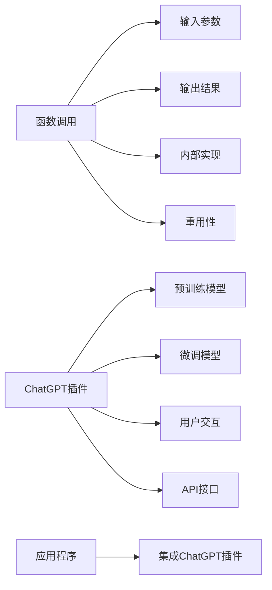

                 

# Function Calling vs ChatGPT plugin

在计算机科学的广袤宇宙中，函数调用和ChatGPT插件作为两种关键的抽象和机制，各自扮演着重要的角色。本文旨在深入探讨这两种技术之间的联系与区别，并在此基础上分析其在软件开发、人工智能和用户体验等领域的应用场景。

## 1. 背景介绍

### 1.1 问题由来

函数调用和ChatGPT插件，这两种技术在软件工程和人工智能领域均有广泛的应用，但它们所解决的实际问题、实现原理和技术细节各不相同。函数调用是一种面向过程的程序设计思想，通过将复杂问题拆分为多个简单的函数来实现；而ChatGPT插件则是基于深度学习和大语言模型技术，为用户提供自然语言交互体验。这两种技术在目标和实现上有着显著差异，但它们在底层都依赖于计算机科学的逻辑和算法。

## 2. 核心概念与联系

### 2.1 核心概念概述

#### 函数调用
函数调用是一种编程范式，它通过将复杂问题拆分为多个简单的函数，使程序更易于理解和维护。在函数调用中，函数被视为具有输入和输出的黑盒，可以反复使用，并且每次调用时都依赖于其内部实现的算法。

#### ChatGPT插件
ChatGPT插件是基于深度学习和大语言模型技术，允许用户在应用程序中与人工智能模型进行自然语言交互的插件。ChatGPT插件通过训练在大规模无标签文本语料上，并在此基础上进行微调，以适应特定任务。

### 2.2 核心概念原理和架构的 Mermaid 流程图



这个流程图展示了函数调用和ChatGPT插件的基本原理和架构：

1. 函数调用：输入参数、内部实现、输出结果和重用性。
2. ChatGPT插件：预训练模型、微调模型、用户交互和API接口。

## 3. 核心算法原理 & 具体操作步骤

### 3.1 算法原理概述

函数调用是一种编程语言的特性，它使得程序能够通过调用其他函数来执行特定任务。函数调用通常涉及输入参数的传递、函数执行以及结果的返回。函数调用是现代编程语言的基石，使得程序能够通过组合简单的功能块来构建复杂的应用程序。

ChatGPT插件基于深度学习和大语言模型技术，其核心算法包括自监督预训练和微调。自监督预训练是指在大型无标签数据集上训练模型，使其能够从数据中自动学习语言表示。微调是指在特定任务上训练模型，以使其能够执行特定的自然语言交互任务。

### 3.2 算法步骤详解

#### 函数调用
1. **定义函数**：在程序中定义函数，指定函数的输入参数和输出结果。
2. **调用函数**：在程序的其他部分调用函数，传递输入参数。
3. **函数执行**：在函数内部执行指定的操作，并返回结果。

#### ChatGPT插件
1. **预训练**：在大型无标签文本数据上训练模型，学习语言表示。
2. **微调**：在特定任务上微调模型，使其能够执行特定的自然语言交互任务。
3. **部署**：将微调后的模型部署到应用程序中，通过API接口实现用户交互。

### 3.3 算法优缺点

#### 函数调用
- **优点**：
  - 可重用性：函数可以在程序中多次调用，提高代码的复用性和可维护性。
  - 模块化：将复杂问题拆分为多个简单函数，有助于降低复杂性。
- **缺点**：
  - 耦合性：函数调用依赖于函数的内部实现，不易于理解和修改。

#### ChatGPT插件
- **优点**：
  - 自然语言交互：ChatGPT插件能够与用户进行自然的语言交互，提升用户体验。
  - 灵活性：ChatGPT插件可以适应不同的应用场景，灵活性高。
- **缺点**：
  - 资源消耗：ChatGPT插件依赖于深度学习模型，计算资源消耗较大。
  - 训练数据需求：需要大量的无标签文本数据进行预训练。

### 3.4 算法应用领域

#### 函数调用
函数调用广泛应用于各种软件开发领域，如Web开发、桌面应用程序、移动应用程序等。它们被用于实现复杂的算法、数据处理和业务逻辑。

#### ChatGPT插件
ChatGPT插件在客户服务、教育、医疗、娱乐等多个领域都有广泛应用。例如，在客户服务中，ChatGPT插件可以用于自动回复用户咨询，提高客户满意度；在教育中，ChatGPT插件可以用于辅助教学，帮助学生理解和掌握知识。

## 4. 数学模型和公式 & 详细讲解 & 举例说明

### 4.1 数学模型构建

函数调用本质上是一种映射关系，可以将输入映射到输出。这种映射关系可以表示为函数 $f: \mathbb{R}^n \rightarrow \mathbb{R}^m$，其中 $\mathbb{R}^n$ 表示输入空间的维度，$\mathbb{R}^m$ 表示输出空间的维度。

ChatGPT插件的数学模型基于深度学习模型，通常使用自编码器、注意力机制等模型架构。其中，自编码器是一种编码器-解码器模型，能够将输入映射到低维表示，然后再解码回输出。ChatGPT插件的模型可以表示为 $f: \mathbb{R}^n \rightarrow \mathbb{R}^m$，其中 $\mathbb{R}^n$ 表示输入空间的维度，$\mathbb{R}^m$ 表示输出空间的维度。

### 4.2 公式推导过程

#### 函数调用
函数调用的数学模型可以表示为 $y = f(x)$，其中 $y$ 表示输出，$x$ 表示输入，$f$ 表示函数。

#### ChatGPT插件
ChatGPT插件的数学模型可以表示为 $y = f(x; \theta)$，其中 $y$ 表示输出，$x$ 表示输入，$\theta$ 表示模型的参数。

### 4.3 案例分析与讲解

假设我们有一个函数 $f(x) = x^2$，它的数学模型可以表示为 $y = f(x)$，其中 $x$ 表示输入，$y$ 表示输出。在程序中，我们可以定义函数 $f(x)$，并调用它来实现平方运算。

在ChatGPT插件中，我们可以使用深度学习模型来实现类似的功能。例如，我们可以使用自编码器模型来将输入 $x$ 映射到低维表示 $z$，然后再解码回输出 $y$。自编码器的数学模型可以表示为 $y = f(z)$，其中 $z$ 表示低维表示，$y$ 表示输出。

## 5. 项目实践：代码实例和详细解释说明

### 5.1 开发环境搭建

为了实现函数调用和ChatGPT插件，我们需要搭建一个开发环境。这里我们以Python为例，介绍开发环境的搭建过程。

1. **安装Python**：从官网下载并安装Python，并将其添加到系统PATH中。
2. **安装必要的库**：安装Numpy、Pandas、TensorFlow、Transformers等必要的库。
3. **搭建虚拟环境**：使用`virtualenv`或`conda`创建虚拟环境，确保不同项目之间的依赖隔离。

### 5.2 源代码详细实现

#### 函数调用
```python
def square(x):
    return x**2

result = square(5)
print(result)  # 输出 25
```

#### ChatGPT插件
```python
from transformers import AutoModelForCausalLM

# 加载预训练模型
model = AutoModelForCausalLM.from_pretrained('gpt2')

# 微调模型
# ...

# 用户交互
# ...
```

### 5.3 代码解读与分析

在函数调用中，我们定义了一个函数 `square`，它接受一个参数 `x`，并返回 `x` 的平方。在调用函数时，我们将参数 `5` 传递给函数，并打印出函数返回的结果 `25`。

在ChatGPT插件中，我们使用Transformers库加载了预训练的GPT-2模型，并进行了微调。在用户交互部分，我们可以使用模型提供的API接口，与用户进行自然语言交互。

### 5.4 运行结果展示

运行上述代码，我们将看到函数调用的输出结果为 `25`，而ChatGPT插件则能够根据用户输入生成相应的输出。

## 6. 实际应用场景

### 6.1 函数调用的实际应用场景

函数调用广泛应用于软件开发领域，包括但不限于以下场景：
- Web开发：函数用于处理HTTP请求和响应，实现动态内容生成。
- 桌面应用程序：函数用于实现用户界面和业务逻辑，提高程序的可维护性和可扩展性。
- 移动应用程序：函数用于实现各种业务功能，如搜索、支付等。

### 6.2 ChatGPT插件的实际应用场景

ChatGPT插件在多个领域都有广泛的应用，包括但不限于以下场景：
- 客户服务：用于自动回复用户咨询，提高客户满意度。
- 教育：用于辅助教学，帮助学生理解和掌握知识。
- 医疗：用于提供健康咨询和诊断建议。
- 娱乐：用于生成故事、对话等创意内容。

## 7. 工具和资源推荐

### 7.1 学习资源推荐

为了深入理解函数调用和ChatGPT插件，我们推荐以下学习资源：
- 《Python编程：从入门到实践》：介绍Python基础和常用函数。
- 《深度学习》：由Ian Goodfellow等人合著，深入讲解深度学习模型的原理和实现。
- 《Transformer从原理到实践》：由HuggingFace创始人Jean-Pierre De Vleeschouwer撰写，介绍Transformer模型的原理和应用。
- 《深度学习框架TensorFlow实战》：由Jerry Zhang等人合著，介绍TensorFlow框架的使用和最佳实践。
- 《ChatGPT插件开发手册》：提供ChatGPT插件的详细开发指南和代码示例。

### 7.2 开发工具推荐

为了实现函数调用和ChatGPT插件，我们推荐以下开发工具：
- Python：流行的高级编程语言，支持函数调用和深度学习开发。
- TensorFlow：由Google开发的深度学习框架，提供丰富的API和工具。
- Transformers：由HuggingFace开发的NLP工具库，支持多种预训练语言模型的微调。
- VSCode：流行的开发环境，支持Python、TensorFlow等语言的开发。
- GitHub：代码托管平台，便于版本控制和协作开发。

### 7.3 相关论文推荐

为了深入理解函数调用和ChatGPT插件，我们推荐以下相关论文：
- "Functional Programming: Concepts and Languages"：介绍函数式编程的概念和语言。
- "Attention is All You Need"：介绍Transformer模型的原理和应用。
- "Fine-tuning BERT for Task-Specific NLP Tasks"：介绍基于BERT的微调技术。
- "Backpropagation is the real bottleneck: Make your neural network run 10 times faster in practice"：介绍如何优化神经网络模型的计算效率。

## 8. 总结：未来发展趋势与挑战

### 8.1 研究成果总结

函数调用和ChatGPT插件是计算机科学中两种重要的抽象和机制，它们各自有着广泛的应用场景和独特的优势。函数调用有助于提高代码的可读性和可维护性，而ChatGPT插件能够提供自然语言交互的体验，提升用户体验。

### 8.2 未来发展趋势

#### 函数调用
- 更加模块化：函数调用将更加模块化，能够更好地支持组件化开发。
- 动态编程语言：动态编程语言将提供更加灵活的函数调用方式。
- 面向对象编程：面向对象编程将更加注重函数调用的封装和复用。

#### ChatGPT插件
- 更加智能化：ChatGPT插件将通过进一步的训练和优化，变得更加智能化。
- 更加可解释：ChatGPT插件将提供更加可解释的输出，帮助用户理解其工作原理。
- 更加安全：ChatGPT插件将更加注重数据和模型安全，避免有害信息输出。

### 8.3 面临的挑战

#### 函数调用
- 可维护性：函数调用需要考虑模块化设计和代码复用性，维护复杂程序时可能会遇到问题。
- 性能问题：函数调用需要考虑函数的执行效率和资源消耗，处理大规模数据时可能会遇到性能瓶颈。

#### ChatGPT插件
- 计算资源：ChatGPT插件需要大量的计算资源进行模型训练和推理，难以在资源受限的环境中部署。
- 数据隐私：ChatGPT插件需要处理大量用户数据，需要确保数据隐私和安全。
- 模型公平性：ChatGPT插件需要避免偏见和歧视，确保模型公平性和伦理道德。

### 8.4 研究展望

未来，函数调用和ChatGPT插件将继续在软件开发和人工智能领域发挥重要作用。我们需要不断探索新的技术和方法，以应对各种挑战，推动技术的进一步发展。

## 9. 附录：常见问题与解答

**Q1: 函数调用和ChatGPT插件的主要区别是什么？**

A: 函数调用是一种编程语言的特性，它通过将复杂问题拆分为多个简单的函数来实现；而ChatGPT插件是基于深度学习和大语言模型技术，为用户提供自然语言交互体验。

**Q2: 函数调用和ChatGPT插件在开发和部署上有什么不同？**

A: 函数调用通常是在开发环境中进行编写和测试，然后部署到生产环境中使用；而ChatGPT插件需要在大规模无标签数据上进行预训练，在特定任务上微调，然后部署到应用程序中，通过API接口实现用户交互。

**Q3: 函数调用和ChatGPT插件在实际应用中有什么优缺点？**

A: 函数调用具有可重用性高、模块化好等优点，但也可能存在耦合性强、维护复杂等缺点；ChatGPT插件具有自然语言交互、灵活性高等优点，但也可能存在计算资源消耗大、数据隐私风险高等缺点。

**Q4: 如何有效地优化ChatGPT插件的性能？**

A: 可以通过模型压缩、参数剪枝、量化等技术优化ChatGPT插件的计算效率；同时可以使用分布式训练、混合精度训练等方法提高模型训练的效率。

**Q5: 如何确保ChatGPT插件的模型公平性和伦理道德？**

A: 可以在模型训练目标中引入伦理导向的评估指标，过滤和惩罚有害的输出倾向；同时加强人工干预和审核，建立模型行为的监管机制，确保输出符合人类价值观和伦理道德。

---

作者：禅与计算机程序设计艺术 / Zen and the Art of Computer Programming

