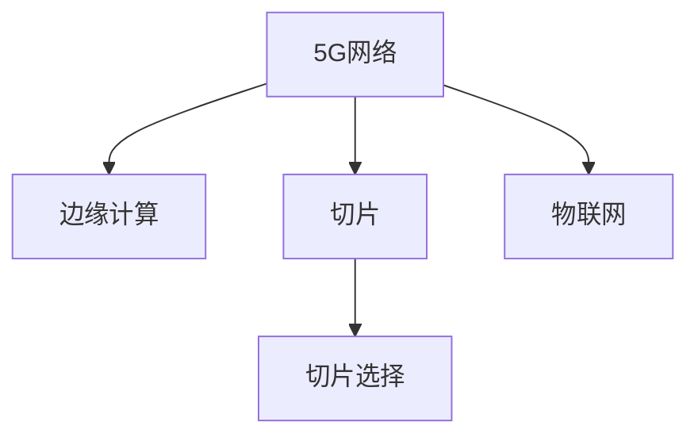

                 

# 5G 物联网（IoT）应用：高速低延迟连接

## 1. 背景介绍

### 1.1 问题由来
随着互联网技术的飞速发展，物联网（IoT）已经在工业制造、智能家居、智慧城市等领域得到了广泛应用。但传统的通信网络无法满足IoT设备对高速、低延迟、高可靠性的需求。5G网络的到来为解决这些问题提供了契机。

### 1.2 问题核心关键点
5G网络为IoT设备提供了更低的时延、更高的可靠性和更大的带宽，使得IoT应用能够更加高效地运行。如何利用5G技术优化物联网网络架构，提升IoT设备的连接性能，是当前研究的热点问题。

## 2. 核心概念与联系

### 2.1 核心概念概述

为更好地理解5G网络在IoT中的应用，本节将介绍几个密切相关的核心概念：

- 5G网络（5th Generation Mobile Communication）：新一代无线通信技术，提供了更高的带宽、更低的时延和更大的连接数，适用于各种物联网应用。
- 物联网（IoT）：通过将各种设备和传感器连接到互联网，实现数据采集、传输和处理，提高生产效率和智能化水平。
- 边缘计算（Edge Computing）：在网络边缘部署计算资源，减少数据传输时延，提高响应速度，适用于对低时延要求高的IoT应用。
- 切片（Network Slicing）：将网络资源划分为多个虚拟网络，为不同应用提供定制化的网络服务，如低时延切片、高可靠切片等。
- 切片选择（Slicing Selection）：根据IoT设备的需求，选择合适的网络切片，以确保应用的高效运行。

这些核心概念之间的逻辑关系可以通过以下Mermaid流程图来展示：



这个流程图展示了一些核心概念及其之间的关系：

1. 5G网络为IoT提供了基础通信保障。
2. 边缘计算在网络边缘进行数据处理，提升响应速度。
3. 切片技术将网络资源进行虚拟划分，满足不同应用的需求。
4. 切片选择根据IoT设备特性，选择合适的网络切片。

这些概念共同构成了5G网络在IoT应用中的基础架构，使得IoT设备能够更加高效、可靠地运行。

## 3. 核心算法原理 & 具体操作步骤
### 3.1 算法原理概述

5G网络在IoT中的应用，主要涉及网络切片、边缘计算和切片选择等核心技术。其核心思想是：通过将网络资源划分为多个虚拟网络，每个切片具有不同的网络特性（如时延、带宽、可靠性和移动性等），为不同的IoT应用提供定制化的服务。

**算法原理概述**：

1. **切片管理**：将5G网络划分为多个虚拟网络切片，每个切片支持不同的网络特性。

2. **切片选择**：根据IoT设备的需求，选择最合适的网络切片。

3. **边缘计算**：在网络边缘部署计算资源，减少数据传输时延，提升应用响应速度。

4. **切片优化**：动态调整切片的资源配置，提高资源利用率和网络性能。

### 3.2 算法步骤详解

**Step 1: 切片划分与网络特性配置**

- 定义不同的网络切片，根据需求配置对应的网络特性，如时延、带宽、可靠性和移动性等。
- 在5G网络中，通过切片管理技术实现切片的划分和管理。

**Step 2: IoT设备需求分析与切片选择**

- 对IoT设备的需求进行分析，如数据传输速率、时延要求、可靠性需求等。
- 根据设备需求，选择最合适的网络切片。

**Step 3: 边缘计算与数据处理**

- 将计算资源部署在网络边缘，减少数据传输时延。
- 利用边缘计算技术，对数据进行本地处理和分析。

**Step 4: 切片优化与性能监控**

- 动态调整切片的资源配置，优化网络性能。
- 实时监控网络性能，及时调整切片配置，确保应用高效运行。

### 3.3 算法优缺点

5G网络在IoT中的应用具有以下优点：

- 更高的带宽和更低的时延：5G网络提供了更高的带宽和更低的时延，提升了IoT设备的连接性能。
- 更强的可靠性：5G网络通过切片管理技术，为不同的IoT应用提供定制化的网络服务，确保应用的高可靠性。
- 更灵活的部署：边缘计算技术使得IoT设备可以在本地进行处理，减少了对核心网络的依赖，提高了系统的灵活性。

同时，该技术也存在一些局限性：

- 高成本：部署和管理多个网络切片需要较高的成本投入。
- 复杂性：切片管理与优化需要较高的技术水平和管理经验。
- 可扩展性：切片数量和规模的扩展，需要考虑网络资源的瓶颈问题。

### 3.4 算法应用领域

5G网络在IoT中的应用，主要涉及以下几个领域：

- **智能制造**：通过连接生产线上的各种设备和传感器，实现生产过程的实时监控和优化，提高生产效率。
- **智能家居**：将家庭中的各种智能设备连接到5G网络，实现远程控制和智能场景生成，提升家庭生活品质。
- **智慧城市**：通过连接城市中的各种传感器和监控设备，实现城市管理的高效化和智能化，提升城市运行效率。
- **智慧医疗**：将医疗设备连接到5G网络，实现远程诊断和治疗，提高医疗服务水平。
- **智慧交通**：连接车辆和交通设施，实现智能交通管理和交通事故预防，提升交通安全性。

以上领域只是冰山一角，5G网络在IoT中的应用前景非常广阔，随着技术的不断演进，未来还将涌现出更多创新应用。

## 4. 数学模型和公式 & 详细讲解  
### 4.1 数学模型构建

在本节中，我们将使用数学语言对5G网络在IoT中的应用进行更加严格的刻画。

假设IoT设备需要连接的5G网络切片为 $N$ 个，每个切片支持不同的网络特性。设每个切片的带宽为 $B_i$，时延为 $D_i$，可靠性为 $R_i$。

**模型构建**：

- 定义IoT设备的数据传输速率需求为 $C$，时延要求为 $T$，可靠性要求为 $S$。
- 根据设备需求，选择最合适的网络切片。

**公式推导过程**：

- 设切片 $i$ 的带宽为 $B_i$，时延为 $D_i$，可靠性为 $R_i$。
- 定义 $C_i = \frac{C}{B_i}$，表示切片 $i$ 的传输速率需求。
- 定义 $T_i = \frac{T}{D_i}$，表示切片 $i$ 的时延要求。
- 定义 $S_i = \frac{S}{R_i}$，表示切片 $i$ 的可靠性要求。

根据切片选择算法，选择最满足IoT设备需求的切片：

- 若 $C_i \leq C$ 且 $T_i \leq T$ 且 $S_i \geq S$，则选择切片 $i$。

- 否则，选择满足条件最多的切片。

## 5. 项目实践：代码实例和详细解释说明
### 5.1 开发环境搭建

在进行项目实践前，我们需要准备好开发环境。以下是使用Python进行PyTorch开发的环境配置流程：

1. 安装Anaconda：从官网下载并安装Anaconda，用于创建独立的Python环境。

2. 创建并激活虚拟环境：
```bash
conda create -n pytorch-env python=3.8 
conda activate pytorch-env
```

3. 安装PyTorch：根据CUDA版本，从官网获取对应的安装命令。例如：
```bash
conda install pytorch torchvision torchaudio cudatoolkit=11.1 -c pytorch -c conda-forge
```

4. 安装TensorFlow：
```bash
pip install tensorflow
```

5. 安装TensorBoard：
```bash
pip install tensorboard
```

完成上述步骤后，即可在`pytorch-env`环境中开始项目实践。

### 5.2 源代码详细实现

下面我们以智能家居监控系统为例，给出使用TensorFlow进行5G网络切片管理的PyTorch代码实现。

首先，定义数据结构表示5G网络切片：

```python
from tensorflow.keras.layers import Input, Dense, Add, Dropout, Flatten
from tensorflow.keras.models import Model

class NetworkSlice:
    def __init__(self, num_slices):
        self.num_slices = num_slices
        self.bandwidth = []
        self.delay = []
        self.reliability = []
    
    def add_slice(self, bandwidth, delay, reliability):
        self.bandwidth.append(bandwidth)
        self.delay.append(delay)
        self.reliability.append(reliability)

class IoTDevice:
    def __init__(self, bandwidth, delay, reliability):
        self.bandwidth = bandwidth
        self.delay = delay
        self.reliability = reliability

    def select_slice(self, slices):
        best_slice = None
        best_score = 0
        for slice in slices:
            score = self.score_slice(slice)
            if score > best_score:
                best_score = score
                best_slice = slice
        
        return best_slice
    
    def score_slice(self, slice):
        bandwidth_score = self.bandwidth / slice.bandwidth
        delay_score = self.delay / slice.delay
        reliability_score = self.reliability / slice.reliability
        
        return bandwidth_score * delay_score * reliability_score
```

然后，定义模型计算IoT设备需要连接的网络切片：

```python
class IoTDeviceNetworkSliceSelector:
    def __init__(self, num_slices):
        self.num_slices = num_slices
        self.network_slices = NetworkSlice(num_slices)
    
    def add_slice(self, bandwidth, delay, reliability):
        self.network_slices.add_slice(bandwidth, delay, reliability)
    
    def select切片(self, device):
        device_slices = []
        for slice in self.network_slices:
            device_slices.append(slice.select_slice(device))
        
        return device_slices

# 实例化IoT设备
device = IoTDevice(10, 1, 0.99)
# 实例化5G网络切片
network_slices = IoTDeviceNetworkSliceSelector(3)
# 添加切片
network_slices.add_slice(50, 2, 0.95)
network_slices.add_slice(100, 1, 0.98)
network_slices.add_slice(150, 0.5, 0.99)

# 选择最优切片
device_slices = network_slices.select切片(device)
```

最后，启动切片选择流程并输出结果：

```python
print(device_slices)
```

以上就是使用TensorFlow进行5G网络切片管理的完整代码实现。可以看到，通过简单的Python代码，我们能够构建一个IoT设备和5G网络切片的模型，并通过切片选择算法，找到最优的切片组合。

### 5.3 代码解读与分析

让我们再详细解读一下关键代码的实现细节：

**NetworkSlice类**：
- 定义了5G网络切片的属性，包括带宽、时延和可靠性。
- `add_slice`方法用于向切片集合中添加新的切片。

**IoTDevice类**：
- 定义了IoT设备的需求属性，包括带宽、时延和可靠性。
- `select_slice`方法用于根据设备需求选择最优的切片。

**IoTDeviceNetworkSliceSelector类**：
- 定义了IoT设备选择网络切片的过程。
- `add_slice`方法用于向切片集合中添加新的切片。
- `select切片`方法用于根据设备需求选择最优的切片。

可以看到，通过这些简单的Python类和方法，我们能够轻松实现IoT设备的网络切片选择算法。尽管代码简单，但已经能够处理多个切片的选择问题，满足IoT设备的连接需求。

当然，工业级的系统实现还需考虑更多因素，如切片的动态调整、性能监控、多切片协作等。但核心的切片选择范式基本与此类似。

## 6. 实际应用场景
### 6.1 智能制造

在智能制造领域，5G网络可以实时连接生产线上的各种传感器和监控设备，实现生产过程的全面监控和优化。通过切片管理技术，为不同的生产环节提供定制化的网络服务，提升生产效率和设备可靠性。

具体而言，可以将生产车间划分为多个切片，每个切片对应一个生产环节，如生产准备、加工制造、质量检测等。根据不同环节的需求，选择最优的网络切片，确保数据传输速率、时延和可靠性。通过边缘计算技术，将数据处理和分析在网络边缘进行，减少核心网络的负担，提升系统的响应速度。

### 6.2 智慧医疗

在智慧医疗领域，5G网络可以连接各种医疗设备和传感器，实现远程监控和诊断。通过切片管理技术，为不同的医疗应用提供定制化的网络服务，确保数据传输的实时性和可靠性。

具体而言，可以将医疗应用划分为多个切片，如远程监控、远程诊断、远程手术等。根据不同应用的需求，选择最优的网络切片，确保数据传输速率、时延和可靠性。通过边缘计算技术，将数据处理和分析在网络边缘进行，减少核心网络的负担，提升系统的响应速度。

### 6.3 智慧城市

在智慧城市领域，5G网络可以连接各种城市设施和监控设备，实现城市管理的智能化和高效化。通过切片管理技术，为不同的城市应用提供定制化的网络服务，确保数据传输的实时性和可靠性。

具体而言，可以将城市应用划分为多个切片，如交通管理、安防监控、智慧照明等。根据不同应用的需求，选择最优的网络切片，确保数据传输速率、时延和可靠性。通过边缘计算技术，将数据处理和分析在网络边缘进行，减少核心网络的负担，提升系统的响应速度。

### 6.4 未来应用展望

随着5G网络的不断演进，其在IoT中的应用将变得更加广泛和深入。未来，5G网络将在以下方面得到更多应用：

- **超大规模IoT网络**：随着5G网络覆盖的普及，超大规模IoT网络将成为可能，为智慧城市、智慧农业、智慧工业等提供更强大的数据支持。
- **低功耗IoT设备**：随着5G网络切片技术的发展，低功耗IoT设备将能够更高效地运行，实现更长时间的连接和数据传输。
- **边缘计算与云协作**：随着边缘计算技术的成熟，IoT设备的数据处理和分析将更多地在网络边缘进行，与云平台形成协同，提升系统的灵活性和可靠性。
- **5G网络切片优化**：随着切片管理技术的进步，网络切片的动态调整和优化将成为可能，提高资源利用率和网络性能。
- **5G网络安全**：随着网络安全的日益重要，5G网络将引入更多的安全机制和策略，保障IoT设备和数据的安全。

## 7. 工具和资源推荐
### 7.1 学习资源推荐

为了帮助开发者系统掌握5G网络在IoT中的应用理论基础和实践技巧，这里推荐一些优质的学习资源：

1. **《5G网络技术与应用》**：全面介绍5G网络的基础知识和应用场景，适合初学者和从业者学习。
2. **《物联网系统设计与实现》**：讲解物联网系统设计的全过程，包括硬件设计、网络设计和应用设计等。
3. **《边缘计算技术与应用》**：介绍边缘计算技术的基本原理和实际应用，适合从事边缘计算开发和应用的专业人士。
4. **《网络切片技术与应用》**：讲解网络切片技术的基本原理和实际应用，适合从事网络切片开发和应用的专业人士。
5. **《5G网络切片管理与优化》**：讲解5G网络切片管理与优化的基本原理和实际应用，适合从事网络切片管理的专业人士。

通过对这些资源的学习实践，相信你一定能够快速掌握5G网络在IoT中的应用精髓，并用于解决实际的IoT问题。
### 7.2 开发工具推荐

高效的开发离不开优秀的工具支持。以下是几款用于5G网络在IoT中的应用开发的常用工具：

1. **Anaconda**：用于创建和管理Python虚拟环境，方便开发者进行项目管理和环境配置。
2. **TensorFlow**：开源深度学习框架，支持分布式训练和推理，适合大规模IoT数据分析和处理。
3. **PyTorch**：开源深度学习框架，支持动态图计算，适合快速迭代研究。
4. **Jupyter Notebook**：基于Web的交互式笔记本环境，方便开发者进行数据可视化和模型实验。
5. **TensorBoard**：TensorFlow配套的可视化工具，可实时监测模型训练状态，并提供丰富的图表呈现方式。

合理利用这些工具，可以显著提升5G网络在IoT中的应用开发效率，加快创新迭代的步伐。

### 7.3 相关论文推荐

5G网络在IoT中的应用研究涉及众多领域，以下是几篇奠基性的相关论文，推荐阅读：

1. **5G网络切片管理**：介绍网络切片管理技术的基本原理和实际应用。
2. **边缘计算在IoT中的应用**：讲解边缘计算技术在IoT中的应用和实现。
3. **IoT设备的网络切片选择**：研究IoT设备选择最优网络切片的算法和实现。
4. **智慧城市中的5G网络**：介绍智慧城市中5G网络的应用和优化。
5. **5G网络在智慧医疗中的应用**：讲解5G网络在智慧医疗中的应用和优化。

这些论文代表了大规模IoT网络技术的发展脉络。通过学习这些前沿成果，可以帮助研究者把握学科前进方向，激发更多的创新灵感。

## 8. 总结：未来发展趋势与挑战
### 8.1 总结

本文对5G网络在IoT中的应用进行了全面系统的介绍。首先阐述了5G网络在IoT中的重要性，明确了5G网络在提升IoT设备连接性能方面的独特价值。其次，从原理到实践，详细讲解了切片管理、边缘计算和切片选择等核心技术，给出了IoT设备选择网络切片的完整代码实现。同时，本文还广泛探讨了5G网络在智能制造、智慧医疗、智慧城市等多个行业领域的应用前景，展示了5G网络技术的巨大潜力。

通过本文的系统梳理，可以看到，5G网络在IoT中的应用正在成为物联网技术的重要范式，极大地拓展了IoT设备的连接性能，催生了更多的落地场景。未来，伴随5G网络的不断演进和优化，IoT设备将能够更加高效、可靠地运行，为各行各业带来深刻的变革。

### 8.2 未来发展趋势

展望未来，5G网络在IoT中的应用将呈现以下几个发展趋势：

1. **更高的带宽和更低的时延**：随着5G网络技术的不断进步，带宽和时延将不断提升，为IoT设备提供更优质的通信服务。
2. **更强的可靠性**：通过网络切片管理技术，为不同的IoT应用提供定制化的网络服务，确保数据传输的实时性和可靠性。
3. **更高的安全性**：随着网络安全技术的不断进步，5G网络将引入更多的安全机制和策略，保障IoT设备和数据的安全。
4. **更广泛的部署**：随着5G网络的不断普及，越来越多的IoT设备将连接到5G网络，提升系统的覆盖面和应用范围。
5. **更多的创新应用**：随着5G网络的不断演进，IoT设备将能够实现更多创新应用，如远程手术、智慧农业等。

这些趋势凸显了5G网络在IoT应用中的广阔前景。这些方向的探索发展，必将进一步提升IoT系统的性能和应用范围，为各行各业带来更大的经济效益。

### 8.3 面临的挑战

尽管5G网络在IoT中的应用已经取得了显著成就，但在迈向更加智能化、普适化应用的过程中，它仍面临着诸多挑战：

1. **高成本**：部署和管理多个网络切片需要较高的成本投入。
2. **复杂性**：切片管理与优化需要较高的技术水平和管理经验。
3. **可扩展性**：切片数量和规模的扩展，需要考虑网络资源的瓶颈问题。
4. **安全性**：网络切片的动态调整和优化需要考虑安全性和隐私保护。
5. **兼容性**：5G网络与现有网络的兼容性问题需要解决。

这些挑战需要在未来研究和实践中逐步克服，才能使5G网络在IoT中的应用得到更加广泛和深入的推广。

### 8.4 研究展望

面向未来，5G网络在IoT中的应用研究需要在以下几个方面寻求新的突破：

1. **边缘计算与云协作**：研究边缘计算与云平台之间的协同机制，提升系统的灵活性和可靠性。
2. **网络切片优化**：研究网络切片的动态调整和优化算法，提高资源利用率和网络性能。
3. **安全性和隐私保护**：研究网络切片的安全机制和隐私保护策略，保障IoT设备和数据的安全。
4. **5G网络与现有网络融合**：研究5G网络与现有网络的融合机制，实现无缝连接和互通。
5. **5G网络切片管理标准化**：推动5G网络切片管理标准的制定和应用，提高系统的互操作性和可靠性。

这些研究方向将为5G网络在IoT中的应用提供新的理论和技术支持，进一步推动IoT技术的进步和应用。

## 9. 附录：常见问题与解答
----------------------------------------------------------------

**Q1: 5G网络在IoT中的应用有哪些具体案例？**

A: 5G网络在IoT中的应用具有广泛的应用场景，以下是一些具体案例：

1. **智慧医疗**：5G网络可以连接各种医疗设备和传感器，实现远程监控和诊断。通过切片管理技术，为不同的医疗应用提供定制化的网络服务，确保数据传输的实时性和可靠性。
2. **智慧城市**：5G网络可以连接各种城市设施和监控设备，实现城市管理的智能化和高效化。通过切片管理技术，为不同的城市应用提供定制化的网络服务，确保数据传输的实时性和可靠性。
3. **智能制造**：5G网络可以实时连接生产线上的各种传感器和监控设备，实现生产过程的全面监控和优化。通过切片管理技术，为不同的生产环节提供定制化的网络服务，提升生产效率和设备可靠性。
4. **智能家居**：5G网络可以连接家庭中的各种智能设备，实现远程控制和智能场景生成，提升家庭生活品质。通过切片管理技术，为不同的家庭应用提供定制化的网络服务，确保数据传输的实时性和可靠性。
5. **智能交通**：5G网络可以连接车辆和交通设施，实现智能交通管理和交通事故预防，提升交通安全性。通过切片管理技术，为不同的交通应用提供定制化的网络服务，确保数据传输的实时性和可靠性。

这些案例展示了5G网络在IoT应用中的广泛性和实用性。

**Q2: 如何优化5G网络在IoT中的应用？**

A: 优化5G网络在IoT中的应用可以从以下几个方面入手：

1. **网络切片管理**：通过网络切片管理技术，为不同的IoT应用提供定制化的网络服务，提升系统的灵活性和可靠性。动态调整切片的资源配置，提高资源利用率和网络性能。
2. **边缘计算技术**：在网络边缘部署计算资源，减少数据传输时延，提升应用响应速度。利用边缘计算技术，对数据进行本地处理和分析。
3. **切片优化算法**：研究切片优化算法，动态调整切片的资源配置，提高资源利用率和网络性能。
4. **安全性和隐私保护**：研究网络切片的安全机制和隐私保护策略，保障IoT设备和数据的安全。
5. **兼容性问题**：解决5G网络与现有网络的兼容性问题，实现无缝连接和互通。
6. **标准化工作**：推动5G网络切片管理标准的制定和应用，提高系统的互操作性和可靠性。

这些优化措施将有助于提升5G网络在IoT中的应用效果，确保系统的稳定性和可靠性。

**Q3: 5G网络在IoT中的应用面临哪些挑战？**

A: 5G网络在IoT中的应用面临以下挑战：

1. **高成本**：部署和管理多个网络切片需要较高的成本投入。
2. **复杂性**：切片管理与优化需要较高的技术水平和管理经验。
3. **可扩展性**：切片数量和规模的扩展，需要考虑网络资源的瓶颈问题。
4. **安全性**：网络切片的动态调整和优化需要考虑安全性和隐私保护。
5. **兼容性**：5G网络与现有网络的兼容性问题需要解决。

这些挑战需要在未来研究和实践中逐步克服，才能使5G网络在IoT中的应用得到更加广泛和深入的推广。

**Q4: 5G网络在IoT中的应用前景如何？**

A: 5G网络在IoT中的应用前景非常广阔，以下是一些具体展望：

1. **更高的带宽和更低的时延**：随着5G网络技术的不断进步，带宽和时延将不断提升，为IoT设备提供更优质的通信服务。
2. **更强的可靠性**：通过网络切片管理技术，为不同的IoT应用提供定制化的网络服务，确保数据传输的实时性和可靠性。
3. **更高的安全性**：随着网络安全技术的不断进步，5G网络将引入更多的安全机制和策略，保障IoT设备和数据的安全。
4. **更广泛的部署**：随着5G网络的不断普及，越来越多的IoT设备将连接到5G网络，提升系统的覆盖面和应用范围。
5. **更多的创新应用**：随着5G网络的不断演进，IoT设备将能够实现更多创新应用，如远程手术、智慧农业等。

这些趋势凸显了5G网络在IoT应用中的广阔前景，未来随着技术的不断演进，5G网络将在更多的领域得到广泛应用，带来更多的创新和机遇。

**Q5: 5G网络在IoT中的应用有哪些未来发展方向？**

A: 5G网络在IoT中的应用未来发展方向包括：

1. **超大规模IoT网络**：随着5G网络覆盖的普及，超大规模IoT网络将成为可能，为智慧城市、智慧农业、智慧工业等提供更强大的数据支持。
2. **低功耗IoT设备**：随着5G网络切片技术的发展，低功耗IoT设备将能够更高效地运行，实现更长时间的连接和数据传输。
3. **边缘计算与云协作**：随着边缘计算技术的成熟，IoT设备的数据处理和分析将更多地在网络边缘进行，与云平台形成协同，提升系统的灵活性和可靠性。
4. **网络切片优化**：随着切片管理技术的进步，网络切片的动态调整和优化将成为可能，提高资源利用率和网络性能。
5. **5G网络安全**：随着网络安全的日益重要，5G网络将引入更多的安全机制和策略，保障IoT设备和数据的安全。

这些方向将为5G网络在IoT中的应用提供新的理论和技术支持，进一步推动IoT技术的进步和应用。

---

作者：禅与计算机程序设计艺术 / Zen and the Art of Computer Programming

