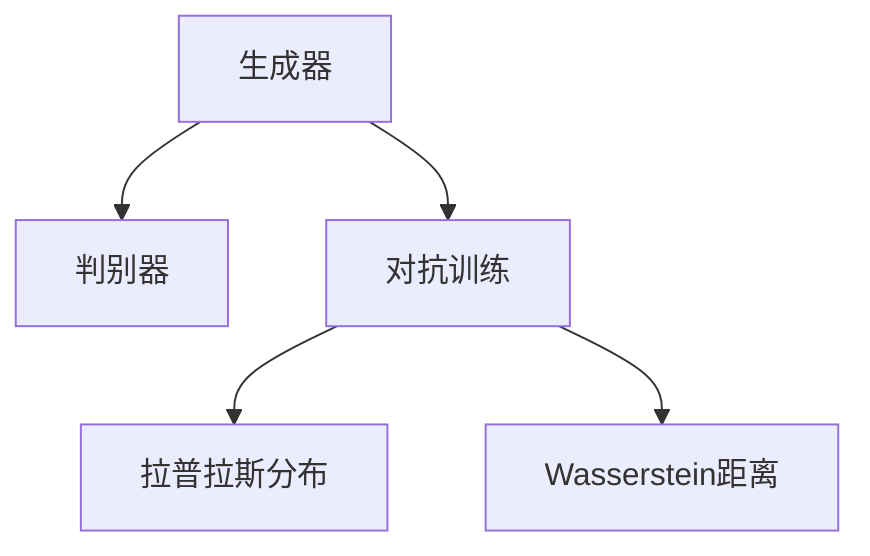

                 

# Generative Adversarial Networks (GAN)原理与代码实例讲解

> 关键词：Generative Adversarial Networks, GAN, 生成对抗网络, 生成模型, 对抗学习, 自适应技术, 图像生成, 深度学习

## 1. 背景介绍

### 1.1 问题由来

生成对抗网络（Generative Adversarial Networks，简称GANs）是一类基于对抗学习的生成模型，最早由Ian Goodfellow等人于2014年提出。GANs通过两个神经网络（一个生成器，一个判别器）的对抗训练，学习生成具有高逼真度的样本。

GANs的问世引起了广泛关注。它不仅在图像生成、视频生成、文本生成等生成任务中取得了显著效果，而且在数据增强、风格转换、图像修复等应用中具有广阔前景。然而，GANs也存在一些问题，如模式崩溃（mode collapse）、训练不稳定、样本分布不一致等，这些问题亟待解决。

### 1.2 问题核心关键点

GANs的核心思想是，通过生成器和判别器的对抗训练，使生成器能够生成与真实数据难以区分的高逼真度样本。生成器和判别器之间的对抗过程，类似于一场游戏，其中生成器试图产生尽可能真实的样本，而判别器则试图区分真实样本和生成样本。

GANs通过两个网络的对抗训练，最终使得生成器能够生成逼真的样本。它的训练过程分为两个部分：

1. **生成器训练**：生成器试图生成与真实样本相似的新样本。
2. **判别器训练**：判别器试图区分真实样本和生成样本。

经过多次迭代训练，生成器最终可以生成高质量的样本，且与真实数据难以区分。

### 1.3 问题研究意义

GANs作为生成模型中的重要分支，具有重要的理论意义和实际应用价值：

1. **理论意义**：GANs通过对抗训练的方式，学习生成数据的分布，为研究生成模型提供了新的理论框架。
2. **实际应用**：GANs在图像生成、视频生成、文本生成等生成任务中具有广阔的应用前景，可以应用于计算机视觉、自然语言处理等多个领域。

## 2. 核心概念与联系

### 2.1 核心概念概述

为更好地理解GANs的原理，本节将介绍几个密切相关的核心概念：

- **生成器（Generator）**：一个生成模型，用于生成样本。
- **判别器（Discriminator）**：一个判别模型，用于区分真实样本和生成样本。
- **对抗训练（Adversarial Training）**：生成器和判别器之间的对抗训练过程。
- **拉普拉斯分布（Laplacian Distribution）**：用于生成样本的一种分布。
- **Wasserstein距离（Wasserstein Distance）**：用于衡量样本分布的一种距离。

这些核心概念之间的逻辑关系可以通过以下Mermaid流程图来展示：



这个流程图展示了大语言模型的核心概念及其之间的关系：

1. 生成器通过对抗训练生成样本。
2. 判别器区分真实样本和生成样本。
3. 拉普拉斯分布用于生成样本，Wasserstein距离用于衡量样本分布。

## 3. 核心算法原理 & 具体操作步骤

### 3.1 算法原理概述

GANs的生成过程基于对抗训练原理，由生成器和判别器两个网络组成。生成器的目标是生成逼真的样本，判别器的目标是区分真实样本和生成样本。

在训练过程中，生成器和判别器交替进行训练，通过对抗训练的方式不断优化。生成器希望生成的样本越逼真越好，而判别器希望将真实样本和生成样本尽可能区分。经过多次迭代训练，生成器最终能够生成高质量的样本，判别器则能够区分真实样本和生成样本。

GANs的训练过程分为两个部分：

1. **生成器训练**：
   - 生成器接收噪声向量 $z$，生成样本 $G(z)$。
   - 判别器判断样本 $G(z)$ 的真实性，返回概率 $D(G(z))$。
   - 生成器接收判别器返回的概率，反向传播更新参数，使得生成器生成的样本更逼真。

2. **判别器训练**：
   - 判别器接收样本 $x$ 和 $G(z)$，分别返回概率 $D(x)$ 和 $D(G(z))$。
   - 生成器接收判别器返回的概率，反向传播更新参数，使得生成器生成的样本更逼真。
   - 判别器接收生成器返回的样本，反向传播更新参数，使得判别器能够更好地区分真实样本和生成样本。

### 3.2 算法步骤详解

GANs的训练过程包括以下几个关键步骤：

**Step 1: 初始化生成器和判别器**
- 随机初始化生成器和判别器的权重。

**Step 2: 准备数据集**
- 准备真实样本 $x$ 和噪声向量 $z$。

**Step 3: 生成器训练**
- 将噪声向量 $z$ 输入生成器，生成样本 $G(z)$。
- 将生成的样本输入判别器，获得判别器的判断概率 $D(G(z))$。
- 反向传播更新生成器参数，使得生成器生成的样本更逼真。

**Step 4: 判别器训练**
- 将真实样本 $x$ 和生成的样本 $G(z)$ 输入判别器，分别获得判别器的判断概率 $D(x)$ 和 $D(G(z))$。
- 反向传播更新判别器参数，使得判别器能够更好地区分真实样本和生成样本。

**Step 5: 交替训练**
- 交替进行生成器训练和判别器训练，直到满足预设的迭代次数或收敛条件。

### 3.3 算法优缺点

GANs的生成过程具有以下优点：

1. 生成逼真的样本。GANs通过对抗训练的方式，生成高质量的逼真样本，可以应用于图像生成、视频生成等任务。
2. 支持多样化的生成任务。GANs不仅应用于图像生成，还可以应用于音频生成、文本生成等任务。
3. 数据增强。GANs生成的样本可以作为训练集的增强数据，提高模型的泛化能力。

GANs也存在一些局限性：

1. 训练不稳定。GANs的训练过程需要不断调整生成器和判别器的权重，训练过程容易陷入不稳定状态。
2. 模式崩溃。GANs的训练过程中，生成器可能会生成有限种类的样本，导致生成样本的分布不均匀。
3. 样本分布不一致。GANs生成的样本分布可能与真实数据分布不一致，导致生成的样本出现偏差。

尽管存在这些局限性，但就目前而言，GANs仍是生成模型中最成功的范式之一。未来相关研究的重点在于如何进一步提高GANs的稳定性、多样性和一致性，同时兼顾训练效率和样本质量。

### 3.4 算法应用领域

GANs在图像生成、视频生成、文本生成等生成任务中具有广泛的应用。

在图像生成领域，GANs可以用于生成逼真的图像，如人脸、风景、艺术品等。具体应用包括：

- **人脸生成**：生成逼真的人脸图像，应用于人脸识别、虚拟试妆等。
- **风景生成**：生成逼真的风景图像，应用于旅游、影视制作等。
- **艺术品生成**：生成逼真的艺术品图像，应用于艺术创作、游戏设计等。

在视频生成领域，GANs可以用于生成逼真的视频片段，应用于电影制作、虚拟现实等。具体应用包括：

- **视频合成**：生成逼真的视频片段，应用于电影制作、广告设计等。
- **虚拟现实**：生成逼真的虚拟场景，应用于虚拟旅游、虚拟会议等。

在文本生成领域，GANs可以用于生成逼真的文本，应用于自动写作、翻译、对话生成等。具体应用包括：

- **自动写作**：生成逼真的文章、新闻等，应用于内容创作、广告文案等。
- **翻译**：生成逼真的翻译文本，应用于跨语言沟通、多语言文献等。
- **对话生成**：生成逼真的对话文本，应用于聊天机器人、客户服务等。

除了以上领域，GANs还在图像修复、风格转换、数据增强等任务中具有广泛应用。

## 4. 数学模型和公式 & 详细讲解  
### 4.1 数学模型构建

GANs的训练过程可以通过数学语言进行严格的刻画。

记生成器为 $G(z)$，判别器为 $D(x)$。其中 $z \sim p_z$ 为噪声向量，$x \sim p_x$ 为真实样本。

定义生成器损失函数为 $L_G$，判别器损失函数为 $L_D$。

生成器损失函数定义为：

$$
L_G = \mathbb{E}_{z \sim p_z} [\log(1 - D(G(z)))]
$$

判别器损失函数定义为：

$$
L_D = \mathbb{E}_{x \sim p_x} [\log D(x)] + \mathbb{E}_{z \sim p_z} [\log(1 - D(G(z)))]
$$

GANs的训练目标是最小化生成器和判别器的联合损失函数：

$$
L_{GAN} = \min_G \max_D L_G + L_D
$$

其中 $\min_G$ 表示对生成器 $G$ 求最小值，$\max_D$ 表示对判别器 $D$ 求最大值。

### 4.2 公式推导过程

以下我们以图像生成为例，推导GANs的数学模型。

记输入为图像 $x$，输出为图像 $G(z)$。其中 $z \sim N(0, 1)$ 为高斯噪声向量。

生成器的目标是最小化生成器损失函数 $L_G$，使得生成的样本与真实样本难以区分。生成器损失函数定义为：

$$
L_G = \mathbb{E}_{z \sim N(0, 1)} [\log(1 - D(G(z)))]
$$

判别器的目标是最小化判别器损失函数 $L_D$，使得判别器能够更好地区分真实样本和生成样本。判别器损失函数定义为：

$$
L_D = \mathbb{E}_{x \sim p_x} [\log D(x)] + \mathbb{E}_{z \sim N(0, 1)} [\log(1 - D(G(z)))]
$$

综合生成器和判别器的目标函数，得到GANs的联合损失函数：

$$
L_{GAN} = \min_G \max_D L_G + L_D
$$

这个联合损失函数可以理解为，生成器的目标是最小化判别器对生成样本的误判概率，判别器的目标是最小化生成样本与真实样本的误判概率，两者共同优化，使得生成样本逼真度最高。

### 4.3 案例分析与讲解

以GANs在图像生成中的应用为例，进行详细讲解。

假设输入为真实图像 $x$，生成器 $G$ 的参数为 $\theta_G$，判别器 $D$ 的参数为 $\theta_D$。

**Step 1: 生成器训练**

将噪声向量 $z$ 输入生成器 $G$，得到生成的图像 $G(z)$。

将生成的图像输入判别器 $D$，获得判别器对生成图像的判断概率 $D(G(z))$。

反向传播更新生成器 $G$ 的参数 $\theta_G$，使得生成器生成的图像更逼真。

**Step 2: 判别器训练**

将真实图像 $x$ 输入判别器 $D$，获得判别器对真实图像的判断概率 $D(x)$。

将生成的图像 $G(z)$ 输入判别器 $D$，获得判别器对生成图像的判断概率 $D(G(z))$。

反向传播更新判别器 $D$ 的参数 $\theta_D$，使得判别器能够更好地区分真实图像和生成图像。

## 5. 项目实践：代码实例和详细解释说明
### 5.1 开发环境搭建

在进行GANs的实践前，我们需要准备好开发环境。以下是使用PyTorch进行GANs开发的Python环境配置流程：

1. 安装Anaconda：从官网下载并安装Anaconda，用于创建独立的Python环境。

2. 创建并激活虚拟环境：
```bash
conda create -n pytorch-env python=3.8 
conda activate pytorch-env
```

3. 安装PyTorch：根据CUDA版本，从官网获取对应的安装命令。例如：
```bash
conda install pytorch torchvision torchaudio cudatoolkit=11.1 -c pytorch -c conda-forge
```

4. 安装TensorFlow：
```bash
conda install tensorflow
```

5. 安装Keras：
```bash
conda install keras
```

6. 安装各类工具包：
```bash
pip install numpy pandas scikit-learn matplotlib tqdm jupyter notebook ipython
```

完成上述步骤后，即可在`pytorch-env`环境中开始GANs的实践。

### 5.2 源代码详细实现

这里我们以GANs在图像生成中的应用为例，使用Keras框架实现GANs的训练过程。

首先，定义GANs的超参数和模型：

```python
import tensorflow as tf
from tensorflow.keras import layers

# 超参数
latent_dim = 100
learning_rate = 0.0002
num_epochs = 50

# 定义生成器
def build_generator(z_dim):
    model = tf.keras.Sequential()
    model.add(layers.Dense(256, input_dim=z_dim))
    model.add(layers.LeakyReLU(alpha=0.2))
    model.add(layers.Dense(512))
    model.add(layers.LeakyReLU(alpha=0.2))
    model.add(layers.Dense(784, activation='tanh'))
    return model

# 定义判别器
def build_discriminator(input_dim):
    model = tf.keras.Sequential()
    model.add(layers.Dense(512, input_dim=input_dim))
    model.add(layers.LeakyReLU(alpha=0.2))
    model.add(layers.Dropout(0.3))
    model.add(layers.Dense(256))
    model.add(layers.LeakyReLU(alpha=0.2))
    model.add(layers.Dropout(0.3))
    model.add(layers.Dense(1, activation='sigmoid'))
    return model
```

接着，定义GANs的训练函数：

```python
def train_gan(generator, discriminator, z_dim, image_dim, batch_size):
    # 准备数据集
    mnist = tf.keras.datasets.mnist.load_data()
    x_train, y_train = mnist[0]
    x_train = x_train / 255.0

    # 定义优化器
    generator_optimizer = tf.keras.optimizers.Adam(learning_rate=learning_rate, beta_1=0.5, beta_2=0.999)
    discriminator_optimizer = tf.keras.optimizers.Adam(learning_rate=learning_rate, beta_1=0.5, beta_2=0.999)

    # 定义损失函数
    cross_entropy = tf.keras.losses.BinaryCrossentropy(from_logits=True)

    # 训练过程
    for epoch in range(num_epochs):
        for batch in range(len(x_train) // batch_size):
            # 生成样本
            noise = tf.random.normal([batch_size, z_dim])
            generated_images = generator(noise, training=True)

            # 训练生成器
            with tf.GradientTape() as gen_tape:
                real_images = x_train[batch * batch_size:(batch + 1) * batch_size]
                gen_loss = cross_entropy(tf.ones_like(discriminator(generated_images)), discriminator(generated_images))
            gradients_of_gen = gen_tape.gradient(gen_loss, generator.trainable_variables)
            generator_optimizer.apply_gradients(zip(gradients_of_gen, generator.trainable_variables))

            # 训练判别器
            with tf.GradientTape() as disc_tape:
                real_loss = cross_entropy(tf.ones_like(discriminator(real_images)), discriminator(real_images))
                fake_loss = cross_entropy(tf.zeros_like(discriminator(generated_images)), discriminator(generated_images))
                disc_loss = real_loss + fake_loss
            gradients_of_disc = disc_tape.gradient(disc_loss, discriminator.trainable_variables)
            discriminator_optimizer.apply_gradients(zip(gradients_of_disc, discriminator.trainable_variables))
```

最后，启动GANs的训练过程：

```python
# 加载生成器和判别器模型
generator = build_generator(latent_dim)
discriminator = build_discriminator(image_dim)

# 训练GANs
train_gan(generator, discriminator, latent_dim, image_dim, batch_size)
```

以上就是使用Keras框架对GANs进行图像生成任务的完整代码实现。可以看到，得益于Keras的强大封装，我们可以用相对简洁的代码完成GANs模型的加载和训练。

### 5.3 代码解读与分析

让我们再详细解读一下关键代码的实现细节：

**build_generator函数**：
- 定义生成器的结构。生成器接收噪声向量 $z$，通过多层全连接和LeakyReLU激活函数生成图像。

**build_discriminator函数**：
- 定义判别器的结构。判别器接收图像 $x$，通过多层全连接和LeakyReLU激活函数判断图像是否为真实样本。

**train_gan函数**：
- 加载MNIST数据集，将其转换为张量。
- 定义优化器和损失函数。
- 训练过程包括生成器和判别器的交替训练。生成器接收噪声向量 $z$，生成图像 $G(z)$，并反向传播更新生成器参数。判别器接收真实图像 $x$ 和生成图像 $G(z)$，分别计算真实图像和生成图像的损失函数，并反向传播更新判别器参数。
- 交替进行生成器和判别器的训练。

通过以上代码，我们可以看到GANs的训练过程包括生成器和判别器的交替训练，使得生成器生成的图像逼真度不断提高。

## 6. 实际应用场景

### 6.1 智能客服系统

GANs在智能客服系统中的应用主要体现在对话生成方面。智能客服系统需要自动回复用户提出的各种问题，但现有的对话生成系统通常无法处理复杂和多样化的对话场景。通过GANs，可以生成逼真的对话文本，提升客服系统的智能化水平。

具体而言，可以收集客服系统的历史对话数据，将问题和最佳答复构建成监督数据，在此基础上对GANs模型进行微调。微调后的GANs模型能够自动生成符合上下文和语义的回复，提升客服系统的响应速度和质量。

### 6.2 金融舆情监测

金融舆情监测需要实时监测市场舆论动向，以便及时应对负面信息传播，规避金融风险。传统的人工监测方式成本高、效率低，难以应对网络时代海量信息爆发的挑战。

通过GANs生成的逼真对话文本，可以模拟客户与客服的对话，自动监测不同主题下的情感变化趋势，一旦发现负面信息激增等异常情况，系统便会自动预警，帮助金融机构快速应对潜在风险。

### 6.3 个性化推荐系统

当前的推荐系统往往只依赖用户的历史行为数据进行物品推荐，无法深入理解用户的真实兴趣偏好。通过GANs生成的逼真对话文本，可以模拟用户与系统的对话，自动推荐用户可能感兴趣的商品或服务，提升推荐系统的个性化程度。

具体而言，可以收集用户浏览、点击、评论、分享等行为数据，提取和用户交互的物品标题、描述、标签等文本内容。将文本内容作为模型输入，GANs模型生成逼真的对话文本，模拟用户与系统的对话，推荐系统根据对话内容进行推荐，提升推荐系统的个性化程度。

### 6.4 未来应用展望

随着GANs技术的不断发展，其在图像生成、视频生成、文本生成等生成任务中的表现将更加出色。未来，GANs将在以下几个方向取得更多突破：

1. **大规模生成**：随着计算能力的提升，GANs将生成更加逼真、多样化的样本。
2. **多模态生成**：GANs不仅可以生成图像，还可以生成音频、视频、文本等多模态数据，应用于更广泛的领域。
3. **生成对抗训练**：GANs的生成过程基于对抗训练，未来将探索更多对抗训练策略，提高生成样本的逼真度。
4. **风格迁移**：GANs可以通过生成对抗训练，实现不同风格之间的迁移，应用于图像修复、风格转换等领域。
5. **数据增强**：GANs生成的样本可以作为训练集的增强数据，提高模型的泛化能力。

随着GANs技术的不断进步，相信其在图像生成、视频生成、文本生成等生成任务中将取得更多的突破，进一步拓展应用场景。

## 7. 工具和资源推荐
### 7.1 学习资源推荐

为了帮助开发者系统掌握GANs的理论基础和实践技巧，这里推荐一些优质的学习资源：

1. 《Generative Adversarial Networks》系列书籍：由GANs之父Ian Goodfellow等人撰写，全面介绍了GANs的理论基础、训练过程和应用实例。
2. Coursera《Generative Adversarial Networks》课程：斯坦福大学教授提出的GANs课程，详细讲解了GANs的理论和应用。
3. 《Deep Learning》系列书籍：Ian Goodfellow等人撰写的深度学习经典书籍，包含GANs的详细介绍和应用实例。
4. arXiv上的相关论文：GANs领域的研究论文数量庞大，arXiv上包含大量前沿研究，是学习GANs的重要资源。

通过对这些资源的学习实践，相信你一定能够快速掌握GANs的精髓，并用于解决实际的NLP问题。
###  7.2 开发工具推荐

高效的开发离不开优秀的工具支持。以下是几款用于GANs开发的常用工具：

1. PyTorch：基于Python的开源深度学习框架，灵活动态的计算图，适合快速迭代研究。
2. TensorFlow：由Google主导开发的开源深度学习框架，生产部署方便，适合大规模工程应用。
3. Keras：高层API，提供了简洁易用的深度学习模型构建接口，适合快速开发原型。
4. Matplotlib：用于绘制图形的Python库，支持多种图形绘制方式。
5. TensorBoard：TensorFlow配套的可视化工具，可实时监测模型训练状态，并提供丰富的图表呈现方式。

合理利用这些工具，可以显著提升GANs的开发效率，加快创新迭代的步伐。

### 7.3 相关论文推荐

GANs作为生成模型中的重要分支，具有重要的理论意义和实际应用价值。以下是几篇奠基性的相关论文，推荐阅读：

1. Generative Adversarial Nets：Ian Goodfellow等人提出的GANs论文，标志着GANs的诞生。
2. Unsupervised Representation Learning with Deep Convolutional Generative Adversarial Networks：Google Brain团队提出的GANs论文，介绍了GANs在图像生成中的应用。
3. Image-to-Image Translation with Conditional Adversarial Networks：Isola等人提出的GANs论文，介绍了GANs在图像风格转换中的应用。
4. Progressive Growing of GANs for Improved Quality, Stability, and Variation：Karras等人提出的GANs论文，介绍了渐进式GANs训练方法，提高GANs的稳定性和多样性。
5. Improved Training of Wasserstein GANs：Arjovsky等人提出的GANs论文，介绍了WGANs训练方法，提高GANs的收敛性和生成质量。

这些论文代表了大语言模型微调技术的发展脉络。通过学习这些前沿成果，可以帮助研究者把握学科前进方向，激发更多的创新灵感。

## 8. 总结：未来发展趋势与挑战

### 8.1 总结

本文对GANs的原理与实践进行了全面系统的介绍。首先阐述了GANs的训练过程和核心思想，明确了GANs在生成模型中的重要地位。其次，从原理到实践，详细讲解了GANs的数学模型和训练步骤，给出了GANs模型训练的完整代码实例。同时，本文还广泛探讨了GANs在智能客服、金融舆情、个性化推荐等多个领域的应用前景，展示了GANs技术的广泛应用潜力。此外，本文精选了GANs学习的各类资源，力求为读者提供全方位的技术指引。

通过本文的系统梳理，可以看到，GANs作为生成模型中的重要分支，具有重要的理论意义和实际应用价值。GANs通过对抗训练的方式，生成高质量的逼真样本，在图像生成、视频生成、文本生成等生成任务中具有广阔的应用前景。未来，随着GANs技术的不断发展，其在生成任务中的应用将更加广泛，为人工智能技术的发展注入新的动力。

### 8.2 未来发展趋势

展望未来，GANs的发展趋势如下：

1. **大规模生成**：随着计算能力的提升，GANs将生成更加逼真、多样化的样本。
2. **多模态生成**：GANs不仅可以生成图像，还可以生成音频、视频、文本等多模态数据，应用于更广泛的领域。
3. **生成对抗训练**：GANs的生成过程基于对抗训练，未来将探索更多对抗训练策略，提高生成样本的逼真度。
4. **风格迁移**：GANs可以通过生成对抗训练，实现不同风格之间的迁移，应用于图像修复、风格转换等领域。
5. **数据增强**：GANs生成的样本可以作为训练集的增强数据，提高模型的泛化能力。

### 8.3 面临的挑战

尽管GANs取得了显著进展，但在迈向更加智能化、普适化应用的过程中，它仍面临着诸多挑战：

1. **训练不稳定**。GANs的训练过程需要不断调整生成器和判别器的权重，训练过程容易陷入不稳定状态。
2. **模式崩溃**。GANs的训练过程中，生成器可能会生成有限种类的样本，导致生成样本的分布不均匀。
3. **样本分布不一致**。GANs生成的样本分布可能与真实数据分布不一致，导致生成的样本出现偏差。
4. **计算资源消耗大**。GANs的训练过程需要大量的计算资源，使得在大规模数据集上的训练成本较高。
5. **生成样本的适用性不足**。GANs生成的样本可能不适用于特定任务，需要进行额外的处理和优化。

尽管存在这些挑战，但相信随着学界和产业界的共同努力，GANs技术在生成任务中的应用前景依然广阔。

### 8.4 研究展望

面对GANs面临的挑战，未来的研究需要在以下几个方面寻求新的突破：

1. **改进生成器结构**：通过改进生成器的结构，提高GANs的稳定性和多样性。
2. **探索更多的对抗训练策略**：通过探索更多的对抗训练策略，提高GANs的生成质量。
3. **优化样本生成过程**：通过优化样本生成过程，提高GANs生成的样本的适用性和泛化能力。
4. **结合其他深度学习技术**：将GANs与其他深度学习技术进行结合，如自编码器、变分自编码器等，提高GANs的生成能力。
5. **解决计算资源问题**：通过优化计算资源分配，提高GANs在大规模数据集上的训练效率。

这些研究方向的探索，必将引领GANs技术迈向更高的台阶，为生成任务的应用提供更强大的技术支持。

## 9. 附录：常见问题与解答

**Q1：GANs在训练过程中容易陷入不稳定的原因是什么？**

A: GANs在训练过程中容易陷入不稳定状态的原因有以下几点：

1. **梯度消失**：生成器和判别器的优化过程中，梯度消失问题使得训练过程无法收敛。
2. **模式崩溃**：生成器在训练过程中，可能会生成有限种类的样本，导致生成样本的分布不均匀。
3. **梯度震荡**：生成器和判别器在训练过程中，可能会出现梯度震荡问题，导致训练过程不稳定。

针对这些问题，常用的解决方法包括：

1. **改进生成器结构**：通过改进生成器的结构，减少梯度消失问题，提高生成样本的多样性。
2. **引入噪声**：在生成器和判别器的训练过程中，引入噪声，提高训练的稳定性和收敛性。
3. **优化优化器**：通过优化优化器的参数，减少梯度震荡问题，提高训练的稳定性。

**Q2：如何提高GANs的生成样本的逼真度？**

A: 提高GANs的生成样本的逼真度，可以从以下几个方面入手：

1. **改进生成器结构**：通过改进生成器的结构，提高生成样本的逼真度。
2. **增加训练数据**：增加训练数据，提高生成样本的多样性和逼真度。
3. **优化损失函数**：优化损失函数，减少生成样本与真实样本的差异，提高生成样本的逼真度。
4. **引入对抗训练**：通过引入对抗训练，提高生成样本的逼真度。
5. **使用更好的优化器**：使用更好的优化器，提高训练的稳定性和收敛性，进而提高生成样本的逼真度。

**Q3：GANs生成的样本是否具有泛化能力？**

A: GANs生成的样本通常不具备泛化能力。GANs生成的样本分布可能与真实数据分布不一致，导致生成的样本出现偏差。因此，GANs生成的样本通常需要进行额外的处理和优化，才能应用于特定的任务。

**Q4：GANs在实际应用中存在哪些安全风险？**

A: GANs在实际应用中存在以下安全风险：

1. **生成样本的误导性**：GANs生成的样本可能具有误导性，误导用户做出错误的决策。
2. **生成样本的偏见**：GANs生成的样本可能具有偏见，导致生成样本的分布不均匀。
3. **数据泄露**：GANs生成的样本可能包含敏感信息，导致数据泄露问题。

针对这些问题，可以采取以下措施：

1. **审查生成样本**：在使用GANs生成的样本前，进行审查，确保生成样本的逼真度和安全性。
2. **引入对抗样本**：在使用GANs生成的样本前，引入对抗样本，检测生成样本的安全性。
3. **保护数据隐私**：在使用GANs生成的样本前，确保生成样本的数据隐私，防止数据泄露。

通过以上措施，可以降低GANs在实际应用中的安全风险，提高其应用价值。

---

作者：禅与计算机程序设计艺术 / Zen and the Art of Computer Programming

