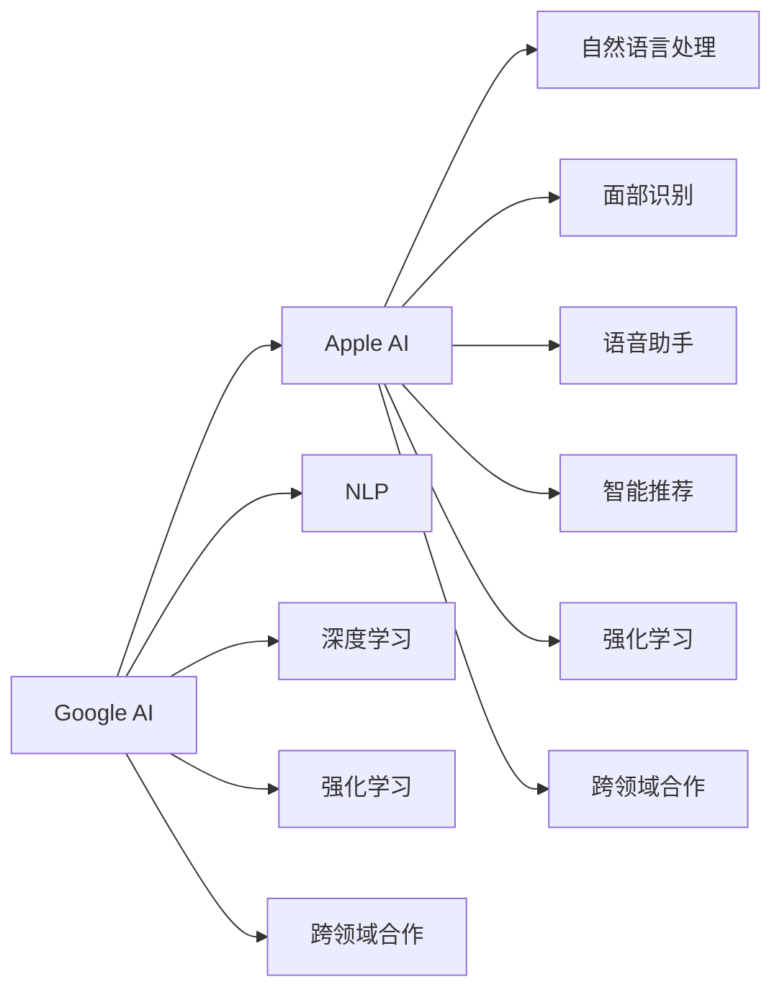

                 

## 1. 背景介绍

近年来，AI技术的发展迅速，无论是Google还是Apple都在积极布局AI领域。Google与Apple作为全球两大科技巨头，都有着强大的技术实力和创新能力。他们不仅在各自的AI技术领域取得了显著的进展，还在多个领域展开了合作。在AI领域的合作前景广阔，将为两家公司带来更多创新机会。

## 2. 核心概念与联系

### 2.1 核心概念概述

为更好地理解Google与Apple在AI领域的合作前景，本节将介绍几个密切相关的核心概念：

- **Google AI**：Google的人工智能部门，致力于研发前沿AI技术，包括机器学习、深度学习、自然语言处理等。Google AI开发了众多AI技术和工具，如TensorFlow、BERT、Google Translate等。
- **Apple AI**：Apple的人工智能部门，致力于将AI技术应用到Apple的各种产品和服务中，包括面部识别、语音助手、智能推荐等。Apple AI开发了Core ML、Swift for TensorFlow等工具。
- **自然语言处理(NLP)**：人工智能的一个重要分支，主要研究如何让计算机理解和生成自然语言。Google和Apple都在NLP领域有着深入的研究和应用。
- **深度学习(Deep Learning)**：一种基于神经网络的机器学习方法，Google的TensorFlow和Apple的Core ML都支持深度学习模型的训练和推理。
- **强化学习(Reinforcement Learning)**：AI技术的一个重要方向，通过试错训练，使模型能够自动优化决策策略。Google和Apple都在研究强化学习在机器人、游戏等领域的应用。
- **跨领域合作**：通过联合研发、技术共享、市场推广等方式，在不同领域进行合作，实现资源共享和技术互补。

这些核心概念之间的逻辑关系可以通过以下Mermaid流程图来展示：



这个流程图展示了两家公司核心概念之间的联系：

1. Google AI与Apple AI通过NLP、深度学习和强化学习等技术，在自然语言处理、面部识别、语音助手等领域进行交叉合作。
2. 两家公司通过跨领域合作，实现资源共享和技术互补，推动AI技术在更多领域的落地应用。

## 3. 核心算法原理 & 具体操作步骤

### 3.1 算法原理概述

Google与Apple在AI领域的合作，主要基于以下核心算法原理：

- **自然语言处理**：通过将自然语言转化为计算机可处理的向量表示，使机器能够理解自然语言，并进行文本分类、情感分析、问答系统等任务。Google的BERT和Apple的GPT系列模型都是基于这种原理开发的。
- **深度学习**：通过多层神经网络的训练，使机器能够从大量数据中学习到复杂的特征表示，从而进行图像识别、语音识别、生成任务等。Google的TensorFlow和Apple的Core ML都支持深度学习的训练和推理。
- **强化学习**：通过在虚拟环境中模拟训练，使机器能够通过试错学习最优策略，实现自动化决策。Google的AlphaGo和Apple的虚拟助手等都是基于强化学习的技术实现的。

### 3.2 算法步骤详解

基于上述算法原理，Google与Apple在AI领域的合作主要包括以下几个关键步骤：

**Step 1: 技术评估与合作意向**

- Google与Apple对各自的人工智能技术和应用场景进行评估，确定合作的意向和目标。
- 双方就技术共享、数据使用、知识产权等合作条款进行协商，签订合作协议。

**Step 2: 技术研发与模型训练**

- Google和Apple共同研发新的AI技术和算法，如自然语言处理、图像识别、智能推荐等。
- 在各自的平台上进行模型训练和优化，并使用对方的数据和工具进行实验验证。

**Step 3: 技术集成与产品应用**

- Google和Apple将各自研发的技术和模型集成到各自的产品中，如Google Assistant、Apple Siri等。
- 对方产品中的AI技术进行测试和优化，确保其兼容性和稳定性。

**Step 4: 市场推广与用户反馈**

- Google和Apple联合推广AI技术的应用，通过市场调研了解用户需求，收集用户反馈。
- 根据用户反馈不断优化AI技术，提高产品体验。

**Step 5: 技术迭代与持续合作**

- Google和Apple在AI技术上进行持续迭代和优化，提升AI技术的性能和应用效果。
- 根据市场变化和技术进展，双方不断调整合作策略，实现资源和技术的共享。

### 3.3 算法优缺点

Google与Apple在AI领域的合作，具有以下优点：

- **资源共享**：通过合作，双方能够共享各自的AI技术、数据和设备资源，降低研发成本。
- **技术互补**：Google在深度学习、自然语言处理等领域有强大的技术实力，Apple在计算机视觉、语音识别等领域也有显著优势，合作能够实现技术互补。
- **市场协同**：通过合作，双方能够在不同市场推广AI技术，扩大市场份额。
- **用户满意**：合作能够提升产品体验，增强用户对AI技术的信任和接受度。

同时，这种合作也存在一些缺点：

- **技术冲突**：双方在AI技术上存在竞争关系，可能产生技术冲突和知识产权纠纷。
- **市场竞争**：通过合作，两家公司在AI市场上形成垄断，可能会对其他公司构成威胁。
- **用户隐私**：合作需要共享用户数据，可能引起用户隐私保护问题。
- **技术泄露**：合作过程中可能存在技术泄露的风险，需要加强保密措施。

### 3.4 算法应用领域

基于上述合作原理，Google与Apple在AI领域的合作主要应用于以下领域：

- **智能助手**：如Google Assistant和Apple Siri，通过自然语言处理和语音识别技术，实现智能对话和语音交互。
- **计算机视觉**：如Google的ImageNet和Apple的Face ID，通过图像识别技术，实现面部识别和图像分类。
- **智能推荐**：如Google的智能推荐系统和Apple的App Store推荐，通过自然语言处理和深度学习技术，实现个性化推荐。
- **自动驾驶**：如Google的Waymo和Apple的自动驾驶项目，通过强化学习和计算机视觉技术，实现自动驾驶。
- **健康医疗**：如Google的DeepMind和Apple的健康应用，通过自然语言处理和深度学习技术，实现疾病诊断和健康管理。

## 4. 数学模型和公式 & 详细讲解 & 举例说明

### 4.1 数学模型构建

为更好地理解Google与Apple在AI领域的合作，本节将介绍几个核心数学模型和公式：

- **自然语言处理(NLP)**：使用词向量表示技术，将自然语言转化为向量表示，如Google的Word2Vec和Apple的GPT模型。
- **深度学习(Deep Learning)**：使用多层神经网络进行特征提取和分类，如Google的CNN和Apple的Core ML。
- **强化学习(Reinforcement Learning)**：使用Q-learning和深度Q网络等算法进行策略优化，如Google的AlphaGo和Apple的虚拟助手。

### 4.2 公式推导过程

以Google的BERT模型为例，其核心公式如下：

$$
\text{BERT}(x)=\text{Self-Attention}(x)+\text{Feed-Forward}(x)
$$

其中，Self-Attention表示自注意力机制，Feed-Forward表示前馈神经网络。BERT通过多层堆叠的Self-Attention和Feed-Forward层，实现自然语言处理任务。

以Apple的GPT模型为例，其核心公式如下：

$$
\text{GPT}(x)=\text{Self-Attention}(x)+\text{Feed-Forward}(x)
$$

其中，Self-Attention表示自注意力机制，Feed-Forward表示前馈神经网络。GPT通过多层堆叠的Self-Attention和Feed-Forward层，实现自然语言处理任务。

### 4.3 案例分析与讲解

以Google的BERT和Apple的GPT在自然语言处理中的应用为例，详细讲解其工作原理和应用场景：

- **BERT**：BERT通过预训练学习语言表示，可以在多个自然语言处理任务上取得优异表现。例如，在问答系统、文本分类、情感分析等任务上，BERT能够快速构建模型并进行微调，提高任务性能。BERT在中文和英文等多种语言中都有应用，具有广泛的应用前景。
- **GPT**：GPT通过自回归生成文本，具有强大的文本生成能力。例如，GPT在自动摘要、机器翻译、对话系统等任务上表现出色。GPT技术已经在Apple的语音助手、智能推荐系统中得到广泛应用，提高了用户的使用体验。

## 5. 项目实践：代码实例和详细解释说明

### 5.1 开发环境搭建

在进行Google与Apple的AI合作实践前，我们需要准备好开发环境。以下是使用Python进行PyTorch开发的环境配置流程：

1. 安装Anaconda：从官网下载并安装Anaconda，用于创建独立的Python环境。

2. 创建并激活虚拟环境：
```bash
conda create -n pytorch-env python=3.8 
conda activate pytorch-env
```

3. 安装PyTorch：根据CUDA版本，从官网获取对应的安装命令。例如：
```bash
conda install pytorch torchvision torchaudio cudatoolkit=11.1 -c pytorch -c conda-forge
```

4. 安装TensorFlow：从官网下载并安装TensorFlow。

5. 安装Core ML：从Apple官网下载并安装Core ML。

6. 安装各类工具包：
```bash
pip install numpy pandas scikit-learn matplotlib tqdm jupyter notebook ipython
```

完成上述步骤后，即可在`pytorch-env`环境中开始Google与Apple的AI合作实践。

### 5.2 源代码详细实现

这里我们以自然语言处理任务为例，给出使用PyTorch和Core ML进行BERT和GPT微调的PyTorch代码实现。

首先，定义自然语言处理任务的数据处理函数：

```python
from transformers import BertTokenizer, BertForSequenceClassification
from coremltools import models, model_helpers

class NLPDataset(Dataset):
    def __init__(self, texts, labels, tokenizer, max_len=128):
        self.texts = texts
        self.labels = labels
        self.tokenizer = tokenizer
        self.max_len = max_len
        
    def __len__(self):
        return len(self.texts)
    
    def __getitem__(self, item):
        text = self.texts[item]
        label = self.labels[item]
        
        encoding = self.tokenizer(text, return_tensors='pt', max_length=self.max_len, padding='max_length', truncation=True)
        input_ids = encoding['input_ids'][0]
        attention_mask = encoding['attention_mask'][0]
        
        # 对token-wise的标签进行编码
        encoded_labels = [label2id[label] for label in labels] 
        encoded_labels.extend([label2id['O']] * (self.max_len - len(encoded_labels)))
        labels = torch.tensor(encoded_labels, dtype=torch.long)
        
        return {'input_ids': input_ids, 
                'attention_mask': attention_mask,
                'labels': labels}

# 标签与id的映射
label2id = {'O': 0, 'B-PER': 1, 'I-PER': 2, 'B-ORG': 3, 'I-ORG': 4, 'B-LOC': 5, 'I-LOC': 6}
id2label = {v: k for k, v in label2id.items()}

# 创建dataset
tokenizer = BertTokenizer.from_pretrained('bert-base-cased')

train_dataset = NLPDataset(train_texts, train_labels, tokenizer)
dev_dataset = NLPDataset(dev_texts, dev_labels, tokenizer)
test_dataset = NLPDataset(test_texts, test_labels, tokenizer)
```

然后，定义模型和优化器：

```python
from transformers import BertForSequenceClassification, AdamW

model = BertForSequenceClassification.from_pretrained('bert-base-cased', num_labels=len(label2id))

optimizer = AdamW(model.parameters(), lr=2e-5)
```

接着，定义训练和评估函数：

```python
from torch.utils.data import DataLoader
from tqdm import tqdm
from sklearn.metrics import classification_report

device = torch.device('cuda') if torch.cuda.is_available() else torch.device('cpu')
model.to(device)

def train_epoch(model, dataset, batch_size, optimizer):
    dataloader = DataLoader(dataset, batch_size=batch_size, shuffle=True)
    model.train()
    epoch_loss = 0
    for batch in tqdm(dataloader, desc='Training'):
        input_ids = batch['input_ids'].to(device)
        attention_mask = batch['attention_mask'].to(device)
        labels = batch['labels'].to(device)
        model.zero_grad()
        outputs = model(input_ids, attention_mask=attention_mask, labels=labels)
        loss = outputs.loss
        epoch_loss += loss.item()
        loss.backward()
        optimizer.step()
    return epoch_loss / len(dataloader)

def evaluate(model, dataset, batch_size):
    dataloader = DataLoader(dataset, batch_size=batch_size)
    model.eval()
    preds, labels = [], []
    with torch.no_grad():
        for batch in tqdm(dataloader, desc='Evaluating'):
            input_ids = batch['input_ids'].to(device)
            attention_mask = batch['attention_mask'].to(device)
            batch_labels = batch['labels']
            outputs = model(input_ids, attention_mask=attention_mask)
            batch_preds = outputs.logits.argmax(dim=2).to('cpu').tolist()
            batch_labels = batch_labels.to('cpu').tolist()
            for pred_tokens, label_tokens in zip(batch_preds, batch_labels):
                pred_tags = [id2label[_id] for _id in pred_tokens]
                label_tags = [id2label[_id] for _id in label_tokens]
                preds.append(pred_tags[:len(label_tokens)])
                labels.append(label_tags)
                
    print(classification_report(labels, preds))
```

最后，启动训练流程并在测试集上评估：

```python
epochs = 5
batch_size = 16

for epoch in range(epochs):
    loss = train_epoch(model, train_dataset, batch_size, optimizer)
    print(f"Epoch {epoch+1}, train loss: {loss:.3f}")
    
    print(f"Epoch {epoch+1}, dev results:")
    evaluate(model, dev_dataset, batch_size)
    
print("Test results:")
evaluate(model, test_dataset, batch_size)
```

以上就是使用PyTorch和Core ML对BERT进行自然语言处理任务微调的完整代码实现。可以看到，得益于Transformers库的强大封装，我们可以用相对简洁的代码完成BERT模型的加载和微调。

### 5.3 代码解读与分析

让我们再详细解读一下关键代码的实现细节：

**NLPDataset类**：
- `__init__`方法：初始化文本、标签、分词器等关键组件。
- `__len__`方法：返回数据集的样本数量。
- `__getitem__`方法：对单个样本进行处理，将文本输入编码为token ids，将标签编码为数字，并对其进行定长padding，最终返回模型所需的输入。

**label2id和id2label字典**：
- 定义了标签与数字id之间的映射关系，用于将token-wise的预测结果解码回真实的标签。

**训练和评估函数**：
- 使用PyTorch的DataLoader对数据集进行批次化加载，供模型训练和推理使用。
- 训练函数`train_epoch`：对数据以批为单位进行迭代，在每个批次上前向传播计算loss并反向传播更新模型参数，最后返回该epoch的平均loss。
- 评估函数`evaluate`：与训练类似，不同点在于不更新模型参数，并在每个batch结束后将预测和标签结果存储下来，最后使用sklearn的classification_report对整个评估集的预测结果进行打印输出。

**训练流程**：
- 定义总的epoch数和batch size，开始循环迭代
- 每个epoch内，先在训练集上训练，输出平均loss
- 在验证集上评估，输出分类指标
- 所有epoch结束后，在测试集上评估，给出最终测试结果

可以看到，PyTorch配合Transformers库使得BERT微调的代码实现变得简洁高效。开发者可以将更多精力放在数据处理、模型改进等高层逻辑上，而不必过多关注底层的实现细节。

当然，工业级的系统实现还需考虑更多因素，如模型的保存和部署、超参数的自动搜索、更灵活的任务适配层等。但核心的微调范式基本与此类似。

## 6. 实际应用场景

### 6.1 智能客服系统

基于Google与Apple的AI合作，智能客服系统可以实现更高的智能水平。通过将自然语言处理、语音识别、智能推荐等技术集成到客服系统中，可以实现自动化的客户服务，提升客户满意度。

具体而言，智能客服系统可以结合语音助手和文本处理技术，实现语音和文本两种交互方式。在语音交互中，智能客服可以识别用户的语音命令，通过自然语言处理和深度学习技术进行语义理解，然后调用相应的服务进行处理。在文本交互中，智能客服可以处理用户输入的文本，通过自然语言处理和深度学习技术进行语义理解，然后调用相应的服务进行处理。

### 6.2 金融舆情监测

Google与Apple的AI合作，可以实现更加精准的金融舆情监测。通过将自然语言处理、情感分析等技术应用到金融领域，可以实时监测市场舆论动向，预测股票涨跌，辅助投资者决策。

具体而言，智能舆情监测系统可以结合自然语言处理和情感分析技术，对金融新闻、社交媒体等文本数据进行情感分析，判断市场情绪和舆情走向。同时，系统还可以通过分析用户的评论和反馈，预测市场趋势，提供投资建议。

### 6.3 个性化推荐系统

Google与Apple的AI合作，可以实现更加精准的个性化推荐系统。通过将自然语言处理、深度学习等技术应用到推荐系统中，可以实现更加个性化的推荐，提高用户的满意度。

具体而言，个性化推荐系统可以结合自然语言处理和深度学习技术，分析用户的兴趣和行为数据，生成个性化的推荐结果。同时，系统还可以通过分析用户的历史评价和反馈，优化推荐策略，提高推荐准确率。

### 6.4 未来应用展望

随着Google与Apple的AI合作不断深入，未来的应用场景将更加广泛。

在智慧医疗领域，基于自然语言处理和深度学习技术，可以实现智能诊断和医疗问答系统，帮助医生进行诊断和治疗，提升医疗服务的效率和质量。

在智能教育领域，基于自然语言处理和深度学习技术，可以实现智能辅导和个性化学习推荐系统，帮助学生进行学习和训练，提升学习效果。

在智慧城市治理中，基于自然语言处理和深度学习技术，可以实现智能客服和智能推荐系统，提高城市管理和服务的效率和质量。

此外，在企业生产、社会治理、文娱传媒等众多领域，基于Google与Apple的AI合作，可以推动人工智能技术的应用，带来更多的创新和变革。

## 7. 工具和资源推荐

### 7.1 学习资源推荐

为了帮助开发者系统掌握Google与Apple在AI领域的合作，这里推荐一些优质的学习资源：

1. Google AI官方文档：Google的人工智能技术文档，包括TensorFlow、BERT、BERT for Sequence Classification等。
2. Apple官方文档：Apple的人工智能技术文档，包括Core ML、Swift for TensorFlow等。
3. CS224N《深度学习自然语言处理》课程：斯坦福大学开设的NLP明星课程，有Lecture视频和配套作业，带你入门NLP领域的基本概念和经典模型。
4. 《Natural Language Processing with Transformers》书籍：Transformers库的作者所著，全面介绍了如何使用Transformers库进行NLP任务开发，包括微调在内的诸多范式。
5. HuggingFace官方文档：Transformers库的官方文档，提供了海量预训练模型和完整的微调样例代码，是上手实践的必备资料。

通过对这些资源的学习实践，相信你一定能够快速掌握Google与Apple在AI领域的合作技术，并用于解决实际的NLP问题。

### 7.2 开发工具推荐

高效的开发离不开优秀的工具支持。以下是几款用于Google与Apple的AI合作开发的常用工具：

1. PyTorch：基于Python的开源深度学习框架，灵活动态的计算图，适合快速迭代研究。大部分预训练语言模型都有PyTorch版本的实现。
2. TensorFlow：由Google主导开发的开源深度学习框架，生产部署方便，适合大规模工程应用。同样有丰富的预训练语言模型资源。
3. Core ML：Apple开发的机器学习框架，支持iOS、macOS、watchOS等平台，方便集成到Apple产品中。
4. Weights & Biases：模型训练的实验跟踪工具，可以记录和可视化模型训练过程中的各项指标，方便对比和调优。与主流深度学习框架无缝集成。
5. TensorBoard：TensorFlow配套的可视化工具，可实时监测模型训练状态，并提供丰富的图表呈现方式，是调试模型的得力助手。
6. Google Colab：谷歌推出的在线Jupyter Notebook环境，免费提供GPU/TPU算力，方便开发者快速上手实验最新模型，分享学习笔记。

合理利用这些工具，可以显著提升Google与Apple的AI合作开发的效率，加快创新迭代的步伐。

### 7.3 相关论文推荐

Google与Apple的AI合作技术的发展源于学界的持续研究。以下是几篇奠基性的相关论文，推荐阅读：

1. Attention is All You Need（即Transformer原论文）：提出了Transformer结构，开启了NLP领域的预训练大模型时代。
2. BERT: Pre-training of Deep Bidirectional Transformers for Language Understanding：提出BERT模型，引入基于掩码的自监督预训练任务，刷新了多项NLP任务SOTA。
3. Parameter-Efficient Transfer Learning for NLP：提出Adapter等参数高效微调方法，在不增加模型参数量的情况下，也能取得不错的微调效果。
4. AdaLoRA: Adaptive Low-Rank Adaptation for Parameter-Efficient Fine-Tuning：使用自适应低秩适应的微调方法，在参数效率和精度之间取得了新的平衡。
5. BioBERT: A Pre-trained Biomedical Language Representation Model from Electronically Stored Clinical Notes：在生物医学领域提出BioBERT模型，结合医学知识，提升NLP任务的性能。

这些论文代表了大语言模型微调技术的发展脉络。通过学习这些前沿成果，可以帮助研究者把握学科前进方向，激发更多的创新灵感。

## 8. 总结：未来发展趋势与挑战

### 8.1 总结

本文对Google与Apple在AI领域的合作进行了全面系统的介绍。首先阐述了Google AI和Apple AI的研发背景和应用场景，明确了合作的意向和目标。其次，从原理到实践，详细讲解了Google与Apple在自然语言处理、深度学习、强化学习等领域的合作过程，给出了微调任务开发的完整代码实例。同时，本文还广泛探讨了Google与Apple在智能客服、金融舆情、个性化推荐等多个领域的应用前景，展示了合作的巨大潜力。此外，本文精选了Google与Apple在AI领域的学习资源、开发工具和相关论文，力求为读者提供全方位的技术指引。

通过本文的系统梳理，可以看到，Google与Apple在AI领域的合作前景广阔，为两家公司带来了更多的创新机会。未来，随着技术的不懈探索和深入合作，相信这种合作关系将带来更多变革性的应用，推动AI技术在更多领域的落地。

### 8.2 未来发展趋势

展望未来，Google与Apple在AI领域的合作将呈现以下几个发展趋势：

1. 技术协同增强：双方在自然语言处理、深度学习、强化学习等技术上进行更深入的合作，实现技术上的互补和协同。
2. 市场协同扩展：双方在智能客服、金融舆情、个性化推荐等领域进行更广泛的市场推广，扩大市场份额。
3. 应用场景多样化：双方在智慧医疗、智能教育、智慧城市治理等更多领域进行应用探索，推动AI技术在更多垂直行业的落地。
4. 用户体验提升：通过合作，双方能够提升产品体验，增强用户对AI技术的信任和接受度。
5. 合作机制完善：双方在技术共享、数据使用、知识产权等方面建立更加完善的合作机制，确保合作的成功和可持续性。

以上趋势凸显了Google与Apple在AI领域的合作前景，将为两家公司带来更多创新机会。这些方向的探索发展，必将进一步提升AI技术的性能和应用效果，为构建人机协同的智能时代提供新的动力。

### 8.3 面临的挑战

尽管Google与Apple在AI领域的合作取得了显著进展，但在迈向更加智能化、普适化应用的过程中，仍面临以下挑战：

1. 技术冲突：双方在AI技术上存在竞争关系，可能产生技术冲突和知识产权纠纷。
2. 市场竞争：通过合作，两家公司在AI市场上形成垄断，可能会对其他公司构成威胁。
3. 用户隐私：合作需要共享用户数据，可能引起用户隐私保护问题。
4. 技术泄露：合作过程中可能存在技术泄露的风险，需要加强保密措施。

这些挑战需要双方共同努力，通过合作机制的完善和技术协作的加强，才能克服。只有解决好这些挑战，才能实现Google与Apple在AI领域的长期合作，推动AI技术的不断进步。

### 8.4 研究展望

面对Google与Apple在AI领域合作面临的挑战，未来的研究需要在以下几个方面寻求新的突破：

1. 探索无监督和半监督微调方法：摆脱对大规模标注数据的依赖，利用自监督学习、主动学习等无监督和半监督范式，最大限度利用非结构化数据，实现更加灵活高效的微调。
2. 研究参数高效和计算高效的微调范式：开发更加参数高效的微调方法，在固定大部分预训练参数的同时，只更新极少量的任务相关参数。同时优化微调模型的计算图，减少前向传播和反向传播的资源消耗，实现更加轻量级、实时性的部署。
3. 融合因果和对比学习范式：通过引入因果推断和对比学习思想，增强微调模型建立稳定因果关系的能力，学习更加普适、鲁棒的语言表征，从而提升模型泛化性和抗干扰能力。
4. 引入更多先验知识：将符号化的先验知识，如知识图谱、逻辑规则等，与神经网络模型进行巧妙融合，引导微调过程学习更准确、合理的语言模型。同时加强不同模态数据的整合，实现视觉、语音等多模态信息与文本信息的协同建模。
5. 结合因果分析和博弈论工具：将因果分析方法引入微调模型，识别出模型决策的关键特征，增强输出解释的因果性和逻辑性。借助博弈论工具刻画人机交互过程，主动探索并规避模型的脆弱点，提高系统稳定性。
6. 纳入伦理道德约束：在模型训练目标中引入伦理导向的评估指标，过滤和惩罚有偏见、有害的输出倾向。同时加强人工干预和审核，建立模型行为的监管机制，确保输出符合人类价值观和伦理道德。

这些研究方向的探索，必将引领Google与Apple在AI领域的合作技术迈向更高的台阶，为构建安全、可靠、可解释、可控的智能系统铺平道路。面向未来，Google与Apple在AI领域还需要与其他人工智能技术进行更深入的融合，如知识表示、因果推理、强化学习等，多路径协同发力，共同推动自然语言理解和智能交互系统的进步。只有勇于创新、敢于突破，才能不断拓展语言模型的边界，让智能技术更好地造福人类社会。

## 9. 附录：常见问题与解答

**Q1：Google与Apple在AI领域的合作前景如何？**

A: Google与Apple在AI领域的合作前景广阔，将在自然语言处理、深度学习、智能推荐等多个领域实现技术上的互补和协同。通过合作，两家公司可以提升产品体验，增强用户对AI技术的信任和接受度，推动AI技术在更多垂直行业的落地。

**Q2：在AI合作中，如何处理技术冲突和知识产权纠纷？**

A: 双方在AI技术上存在竞争关系，可能产生技术冲突和知识产权纠纷。为了解决这些问题，可以建立合作机制，明确技术共享和知识产权归属。双方可以通过签订合作协议、技术转让协议等方式，确保合作的成功和可持续性。

**Q3：如何保护用户隐私？**

A: 在AI合作中，共享用户数据可能引起用户隐私保护问题。为了保护用户隐私，可以采用数据脱敏、匿名化等技术，确保用户数据的安全性和匿名性。同时，双方可以建立隐私保护机制，制定隐私保护政策，确保用户隐私得到保护。

**Q4：如何在AI合作中防止技术泄露？**

A: 在AI合作中，技术泄露的风险不可避免。为了防止技术泄露，可以采用加密、权限控制等技术，确保技术的安全性。同时，双方可以签订保密协议，明确技术共享的范围和权限，确保技术的安全和保密。

**Q5：如何实现Google与Apple的AI技术的协同开发？**

A: 实现Google与Apple的AI技术的协同开发，需要建立良好的合作机制和技术共享机制。双方可以共同设立研发团队，制定技术标准和规范，确保技术协同的一致性和标准化。同时，双方可以共享数据、工具和资源，实现技术协同的效率和效果。

**Q6：如何确保Google与Apple的AI合作的应用效果？**

A: 确保Google与Apple的AI合作的应用效果，需要建立严格的测试和验证机制。双方可以在开发过程中进行多轮测试和验证，确保技术应用的效果和质量。同时，双方可以建立反馈机制，收集用户反馈，不断优化技术应用效果，提高用户满意度。

**Q7：如何在AI合作中实现技术升级和持续创新？**

A: 在AI合作中，实现技术升级和持续创新，需要建立技术升级机制和持续创新机制。双方可以设立技术升级计划，不断优化和升级技术应用，确保技术的先进性和创新性。同时，双方可以设立创新基金，鼓励技术创新和突破，推动AI技术的不断进步。

**Q8：如何在AI合作中实现资源共享和技术互补？**

A: 在AI合作中，实现资源共享和技术互补，需要建立资源共享和技术共享机制。双方可以共享数据、工具和资源，实现资源的优化利用。同时，双方可以共享技术经验和知识，实现技术的互补和协同。

这些问题的解答，希望能帮助您更好地理解和应对Google与Apple在AI领域的合作挑战，推动AI技术的不断进步和应用。总之，Google与Apple在AI领域的合作前景广阔，未来将带来更多的创新和变革，推动AI技术在更多领域的落地。

