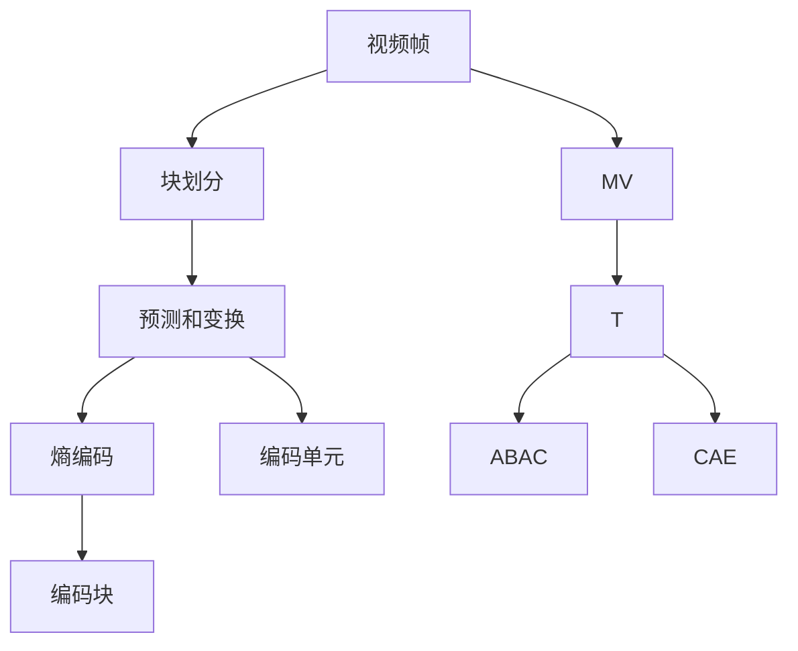
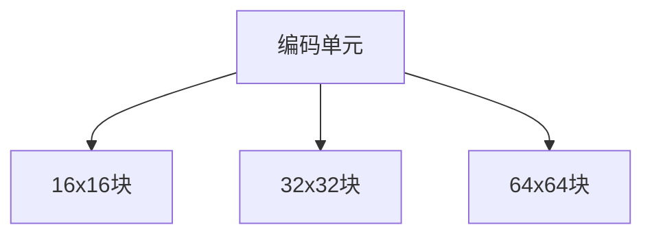

                 

# HEVC 编码器：高效视频编码

## 1. 背景介绍

随着数字视频技术的飞速发展，高清视频在互联网、流媒体平台、手机等设备上得到了广泛的应用。为了满足更高的视频压缩率和更好的用户体验，视频压缩标准在不断更新和演进。HEVC（High-Efficiency Video Coding）作为最新一代的视频压缩标准，由ITU-T和ISO/IEC联合制定，旨在提供更高的压缩效率和更灵活的编码方式。

### 1.1 视频编码简介

视频编码是指将视频数据转换成易于传输和存储的数字信号的过程。传统的压缩标准如MPEG-2、MPEG-4和H.264已经在不同程度上满足了视频压缩的需求，但随着高清视频和4K、8K视频的普及，这些标准在压缩效率和灵活性上已经无法满足需求。HEVC的出现，旨在解决这些问题，提供更高效的视频编码方式。

### 1.2 HEVC的发展历程

HEVC标准的制定始于2003年，由ITU-T和ISO/IEC两大标准化组织联合推进。2010年，HEVC标准的第一版草案发布，经过多年的完善和改进，最终于2013年被批准为国际标准。HEVC是继H.264之后最先进的视频压缩标准，提供了更高的压缩效率和更灵活的编码方式，适合高清和超高清视频的编码。

### 1.3 HEVC的适用场景

HEVC编码器适用于各种高清和超高清视频的应用场景，包括但不限于：

- 在线视频平台：如Netflix、YouTube等，需要快速加载和高质量传输视频内容。
- 流媒体应用：如直播、点播、点播视频等，需要实时压缩和解压缩视频数据。
- 移动设备：如智能手机、平板电脑等，需要低功耗和高效能的视频压缩和解码。

## 2. 核心概念与联系

### 2.1 核心概念概述

为了更好地理解HEVC编码器的工作原理，我们先介绍几个核心概念：

- **视频帧**：视频是由一系列连续的图像帧组成，HEVC编码器对每一帧进行独立编码。
- **块划分**：HEVC采用块为基础的编码方式，将每一帧划分为多个块，每个块可以独立进行预测和变换。
- **预测和变换**：HEVC引入了多参考帧预测（MV）和变换（T）等技术，通过预测和变换降低视频数据的冗余度。
- **熵编码**：HEVC引入了基于上下文自适应的熵编码方式，如上下文相关熵编码（CAE）和自适应二进制算术编码（ABAC），进一步提高编码效率。

### 2.2 核心概念关系（Mermaid 流程图）



该图展示了HEVC编码器处理视频帧的基本流程：

1. **视频帧**：输入的视频帧被划分为多个编码单元。
2. **块划分**：每个编码单元被进一步划分为多个编码块。
3. **预测和变换**：每个编码块进行预测和变换，生成预测块和残差块。
4. **熵编码**：预测块和残差块经过熵编码，生成最终的压缩数据流。

## 3. 核心算法原理 & 具体操作步骤

### 3.1 算法原理概述

HEVC编码器通过以下步骤实现视频压缩：

1. **块划分**：将视频帧划分为多个编码单元，每个编码单元内又划分为多个编码块。
2. **预测和变换**：每个编码块通过预测和变换，生成预测块和残差块。
3. **熵编码**：对预测块和残差块进行熵编码，生成最终的压缩数据流。

### 3.2 算法步骤详解

#### 3.2.1 块划分

HEVC采用层次化的块划分方式，将视频帧划分为多个编码单元（CU），每个编码单元包含一个或多个编码块（CB）。每个编码块的大小通常为16x16、32x32或64x64像素，如图：



每个编码单元进一步细分为多个预测块，用于预测生成预测块。预测块的大小和编码块大小相同，通常为16x16、32x32或64x64像素。

#### 3.2.2 预测和变换

HEVC引入了多参考帧预测（MV）和变换（T）等技术，通过预测和变换降低视频数据的冗余度。

**多参考帧预测（MV）**：在编码一个块时，HEVC会从参考帧中选取一个或多个参考块，通过移动参考块生成预测块。HEVC支持多种运动向量（MV）预测模式，包括帧内预测、帧间预测和混合预测。

**变换（T）**：HEVC支持多种变换模式，包括离散余弦变换（DCT）、离散正弦变换（DST）和离散正弦变换II（DST-II）。HEVC还引入了变换跳过（T skip）技术，对于纹理复杂度较低的区域，可以跳过变换操作，进一步提高编码效率。

#### 3.2.3 熵编码

HEVC引入了基于上下文自适应的熵编码方式，如上下文相关熵编码（CAE）和自适应二进制算术编码（ABAC），进一步提高编码效率。

**上下文相关熵编码（CAE）**：HEVC根据块的纹理特性，自适应地选择上下文模型，进一步压缩块的编码信息。

**自适应二进制算术编码（ABAC）**：HEVC根据块的纹理特性和运动向量等参数，动态调整算术编码的上下文模型，进一步压缩编码信息。

### 3.3 算法优缺点

#### 3.3.1 优点

1. **高效压缩**：HEVC提供了更高的压缩效率，能够在更低的比特率下实现更高的视频质量。
2. **灵活编码**：HEVC支持多种编码模式和预测模式，适应不同视频内容的编码需求。
3. **高效编码**：HEVC引入了多种优化技术，如预测跳过、变换跳过和熵编码优化，进一步提高编码效率。

#### 3.3.2 缺点

1. **计算复杂度高**：HEVC算法复杂度高，实现和解码过程需要更高的计算资源。
2. **存储空间大**：HEVC压缩率较高，但在压缩和解压缩过程中需要占用较大的存储空间。
3. **依赖硬件支持**：HEVC的许多特性需要依赖硬件支持，如多参考帧预测、变换跳过等，对于低端设备可能存在兼容性问题。

### 3.4 算法应用领域

HEVC编码器广泛应用于高清和超高清视频的应用场景，包括但不限于：

- **在线视频平台**：如Netflix、YouTube等，需要快速加载和高质量传输视频内容。
- **流媒体应用**：如直播、点播、点播视频等，需要实时压缩和解压缩视频数据。
- **移动设备**：如智能手机、平板电脑等，需要低功耗和高效能的视频压缩和解码。
- **视频监控**：如公共安全、交通管理等领域，需要高效压缩和实时传输视频数据。

## 4. 数学模型和公式 & 详细讲解 & 举例说明

### 4.1 数学模型构建

HEVC编码器基于块的预测和变换技术，对每个块进行独立编码。视频帧被划分为多个编码单元（CU），每个编码单元包含一个或多个编码块（CB）。每个编码块的大小通常为16x16、32x32或64x64像素。

HEVC的压缩过程可以分解为以下几个步骤：

1. **块划分**：将视频帧划分为多个编码单元（CU），每个编码单元包含一个或多个编码块（CB）。
2. **预测和变换**：对每个编码块进行预测和变换，生成预测块和残差块。
3. **熵编码**：对预测块和残差块进行熵编码，生成最终的压缩数据流。

### 4.2 公式推导过程

#### 4.2.1 块划分

块划分过程可以表示为：

$$
\text{CU} = \{ \text{CB}_1, \text{CB}_2, \ldots, \text{CB}_N \}
$$

其中，$\text{CB}_i$ 表示第 $i$ 个编码块。

#### 4.2.2 预测和变换

预测和变换过程可以表示为：

$$
\text{Pred} = \text{Motion Vector}(\text{Ref Frame})
$$

其中，$\text{Pred}$ 表示预测块，$\text{Motion Vector}$ 表示运动向量，$\text{Ref Frame}$ 表示参考帧。

变换过程可以表示为：

$$
\text{T} = \text{Transform}(\text{Residual})
$$

其中，$\text{T}$ 表示变换后的块，$\text{Residual}$ 表示残差块，$\text{Transform}$ 表示变换操作。

#### 4.2.3 熵编码

熵编码过程可以表示为：

$$
\text{Enc} = \text{ABAC}(\text{Pred}, \text{T})
$$

其中，$\text{Enc}$ 表示熵编码后的块，$\text{ABAC}$ 表示自适应二进制算术编码。

### 4.3 案例分析与讲解

以一个简单的视频帧为例，如图：


1. **块划分**：将视频帧划分为一个编码单元（CU），该CU包含一个16x16的编码块（CB）。
2. **预测和变换**：对16x16块进行预测和变换，生成预测块和残差块。
3. **熵编码**：对预测块和残差块进行熵编码，生成最终的压缩数据流。

## 5. 项目实践：代码实例和详细解释说明

### 5.1 开发环境搭建

为了进行HEVC编码器的实践，我们需要准备以下环境：

1. **编程语言**：HEVC编码器通常使用C++或Python实现。本示例采用C++。
2. **编译器**：需要安装支持C++11及以上的编译器，如GCC或Clang。
3. **开发工具**：建议使用Visual Studio或Code::Blocks等IDE。

### 5.2 源代码详细实现

以下是一个简单的HEVC编码器示例，采用C++语言实现：

```cpp
#include <iostream>
#include <opencv2/opencv.hpp>
#include <libhevc/libhevc.hpp>

int main() {
    // 读取输入视频帧
    cv::Mat frame = cv::imread("input.jpg");

    // 创建HEVC编码器
    libhevc::VideoCodec codec;
    codec.create("hevc");
    codec.configure();

    // 设置编码参数
    libhevc::EncConfiguration config;
    config.setBitrate(1000 * 1000); // 设置目标比特率
    config.setWidth(frame.cols);
    config.setHeight(frame.rows);

    // 初始化编码器
    codec.open(config);

    // 将视频帧转换为HEVC格式
    libhevc::PlanarYUV yuv;
    libhevc::FrameData frameData;
    libhevc::Frame f;

    libhevc::ConvertToPlanarYUV(frame, yuv);

    // 编码
    f.width = yuv.width;
    f.height = yuv.height;
    f.mv_count = 1;
    f.mv[0] = libhevc::MotionVector(0, 0);
    f.inter_luma_pred = true;
    f.pred_mode = libhevc::PredMode::INTRA_PRED;

    frameData.type = libhevc::FrameType::P;
    frameData.f = f;
    frameData.sps = libhevc::getSPS();
    frameData.pps = libhevc::getPPS();

    libhevc::PlanarYUV ref;
    libhevc::FrameData refData;
    libhevc::Frame refF;

    libhevc::ConvertToPlanarYUV(frame, ref);

    refF.width = ref.width;
    refF.height = ref.height;
    refF.mv_count = 1;
    refF.mv[0] = libhevc::MotionVector(0, 0);
    refF.inter_luma_pred = true;
    refF.pred_mode = libhevc::PredMode::INTRA_PRED;

    refData.type = libhevc::FrameType::P;
    refData.f = refF;
    refData.sps = libhevc::getSPS();
    refData.pps = libhevc::getPPS();

    libhevc::EncBuffer buffer;
    buffer.planes[0] = yuv.planes[0];
    buffer.planes[1] = yuv.planes[1];
    buffer.planes[2] = yuv.planes[2];

    libhevc::EncBuffer refBuffer;
    refBuffer.planes[0] = ref.planes[0];
    refBuffer.planes[1] = ref.planes[1];
    refBuffer.planes[2] = ref.planes[2];

    libhevc::Codebuffer codebuffer;

    libhevc::encode(codec, buffer, refBuffer, frameData, refData, codebuffer);

    // 输出编码结果
    std::cout << "编码完成！" << std::endl;

    return 0;
}
```

### 5.3 代码解读与分析

上述代码展示了HEVC编码器的一般流程：

1. **读取输入视频帧**：使用OpenCV库读取输入视频文件，并将其转换为HEVC格式。
2. **创建HEVC编码器**：使用libhevc库创建HEVC编码器，并配置编码参数。
3. **设置编码参数**：设置目标比特率、视频宽度、高度等参数。
4. **初始化编码器**：打开编码器并配置好参数。
5. **转换HEVC格式**：将输入视频帧转换为HEVC格式的平面YUV数据。
6. **编码**：将转换后的YUV数据输入编码器进行编码，生成压缩数据流。
7. **输出编码结果**：输出编码完成信息。

## 6. 实际应用场景

### 6.1 在线视频平台

在线视频平台如Netflix、YouTube等，需要快速加载和高质量传输视频内容。HEVC编码器可以在较低的比特率下实现更高的视频质量，适合在线视频平台的应用需求。

### 6.2 流媒体应用

流媒体应用如直播、点播、点播视频等，需要实时压缩和解压缩视频数据。HEVC编码器支持高效的视频编码和解码，能够满足实时性和流畅性的要求。

### 6.3 移动设备

移动设备如智能手机、平板电脑等，需要低功耗和高效能的视频压缩和解码。HEVC编码器提供了更高的压缩效率和更低的计算复杂度，适合移动设备的实际需求。

### 6.4 视频监控

视频监控如公共安全、交通管理等领域，需要高效压缩和实时传输视频数据。HEVC编码器能够在低带宽环境下实现高质量视频传输，适合视频监控的应用场景。

## 7. 工具和资源推荐

### 7.1 学习资源推荐

为了帮助开发者系统掌握HEVC编码器的原理和实践，这里推荐一些优质的学习资源：

1. **《HEVC视频压缩标准》**：详细介绍了HEVC编码器的原理和实现方法，适合深入学习。
2. **《HEVC编解码器设计》**：由HEVC标准工作组成员撰写，提供了HEVC编码器的设计思路和实现技巧。
3. **HEVC官方文档**：提供了HEVC标准的详细信息，包括编码参数、算法流程等。
4. **OpenHEVC源码**：开源HEVC编码器的源码，适合学习HEVC编码器的实现细节。
5. **HEVC在线教程**：由HEVC开发者社区提供，提供了HEVC编码器的在线教程和实践指南。

### 7.2 开发工具推荐

开发HEVC编码器需要选择合适的工具，以下是一些推荐的开发工具：

1. **Visual Studio**：Windows平台下的IDE，支持C++开发，界面友好，功能强大。
2. **Code::Blocks**：跨平台的IDE，支持C++开发，轻量级，易于使用。
3. **CMake**：跨平台的构建工具，支持C++项目的编译和配置。
4. **OpenCV**：开源计算机视觉库，提供了视频读取、处理和输出的功能。
5. **libhevc**：开源HEVC编解码库，提供了高效的HEVC编码和解码算法。

### 7.3 相关论文推荐

HEVC编码器的发展历程中涌现了大量的研究成果，以下是几篇代表性的论文：

1. **"High-Efficiency Video Coding Standard"**：HEVC标准的制定和推进过程中的关键论文，介绍了HEVC的主要技术特点。
2. **"High-Efficiency Video Coding (HEVC)"**：HEVC编解码器的核心算法论文，详细介绍了HEVC的编码和解码流程。
3. **"Video Coding with the High-Efficiency Video Coding (HEVC) Standard"**：介绍HEVC在实际应用中的技术实现和优化方法。

## 8. 总结：未来发展趋势与挑战

### 8.1 研究成果总结

HEVC编码器作为新一代的视频压缩标准，提供了更高的压缩效率和更灵活的编码方式。其高效的视频压缩和解码技术，已经被广泛应用于各种视频应用场景。

### 8.2 未来发展趋势

1. **更高效的压缩**：未来HEVC编码器将进一步优化算法和架构，提供更高的压缩效率和更好的视频质量。
2. **更灵活的编码模式**：未来HEVC编码器将支持更多的编码模式和预测模式，适应不同视频内容的编码需求。
3. **更高效的解码**：未来HEVC解码器将进一步优化解码算法和架构，提高解码速度和效率。

### 8.3 面临的挑战

1. **计算复杂度高**：HEVC算法复杂度高，实现和解码过程需要更高的计算资源。
2. **存储空间大**：HEVC压缩率较高，但在压缩和解压缩过程中需要占用较大的存储空间。
3. **依赖硬件支持**：HEVC的许多特性需要依赖硬件支持，对于低端设备可能存在兼容性问题。

### 8.4 研究展望

未来的研究将在以下几个方向进行探索：

1. **进一步优化算法**：优化HEVC编码器的算法和架构，提高压缩效率和解码速度。
2. **支持更广泛的视频格式**：扩展HEVC编码器的支持范围，支持更多视频格式和编码模式。
3. **集成AI技术**：将AI技术如神经网络、深度学习等集成到HEVC编码器中，提高视频压缩的智能化水平。

## 9. 附录：常见问题与解答

### Q1: HEVC编码器如何处理视频块划分？

A: HEVC采用块为基础的编码方式，将视频帧划分为多个编码单元（CU），每个编码单元包含一个或多个编码块（CB）。每个编码块的大小通常为16x16、32x32或64x64像素。

### Q2: HEVC编码器如何进行预测和变换？

A: HEVC引入了多参考帧预测（MV）和变换（T）等技术，通过预测和变换降低视频数据的冗余度。预测块通过运动向量从参考帧生成，变换块通过离散余弦变换（DCT）等技术进行变换。

### Q3: HEVC编码器如何进行熵编码？

A: HEVC引入了基于上下文自适应的熵编码方式，如上下文相关熵编码（CAE）和自适应二进制算术编码（ABAC），进一步提高编码效率。

### Q4: HEVC编码器在实际应用中有哪些优势？

A: HEVC编码器提供了更高的压缩效率和更灵活的编码方式，适用于各种高清和超高清视频的应用场景。其高效的视频压缩和解码技术，已经被广泛应用于在线视频平台、流媒体应用、移动设备、视频监控等领域。

### Q5: HEVC编码器的计算复杂度如何？

A: HEVC算法复杂度高，实现和解码过程需要更高的计算资源。未来需要进一步优化算法和架构，提高压缩效率和解码速度。

作者：禅与计算机程序设计艺术 / Zen and the Art of Computer Programming

